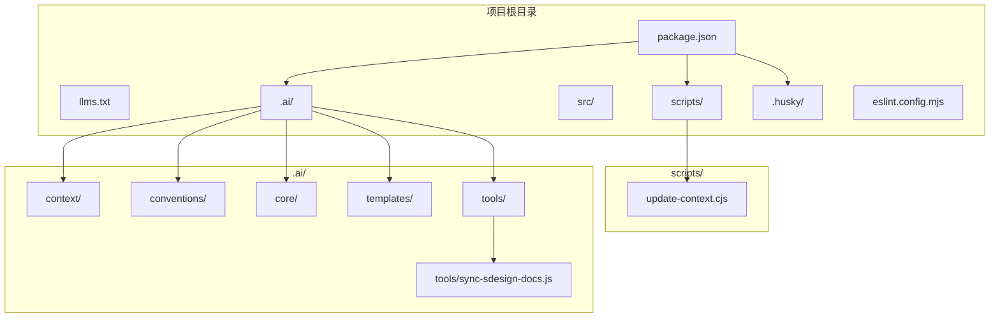
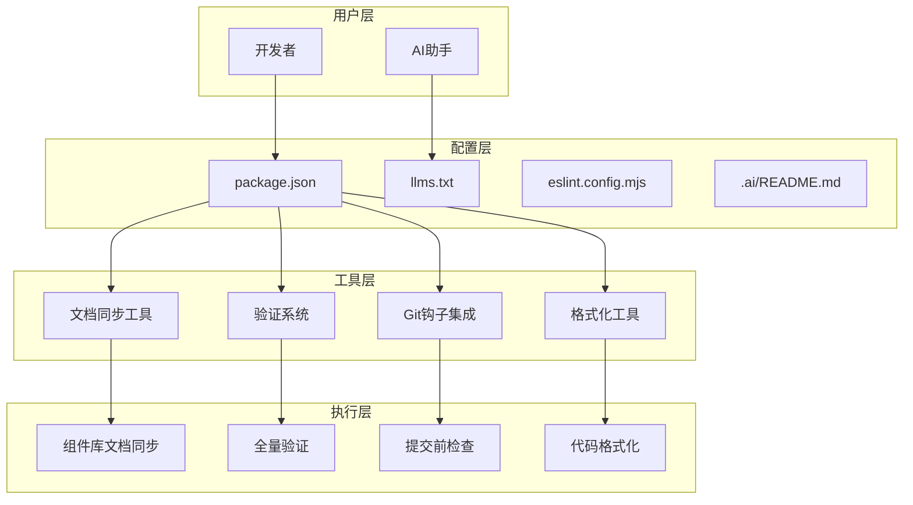
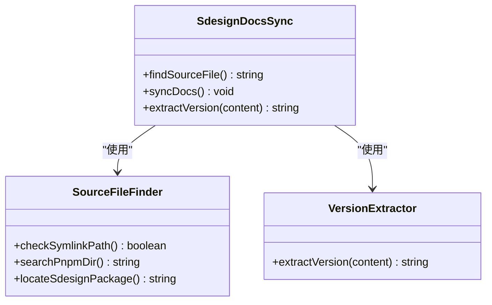
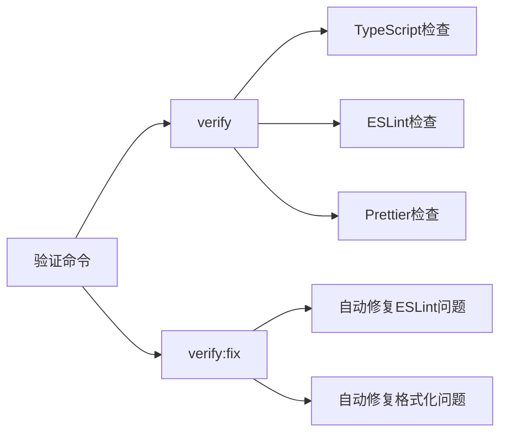
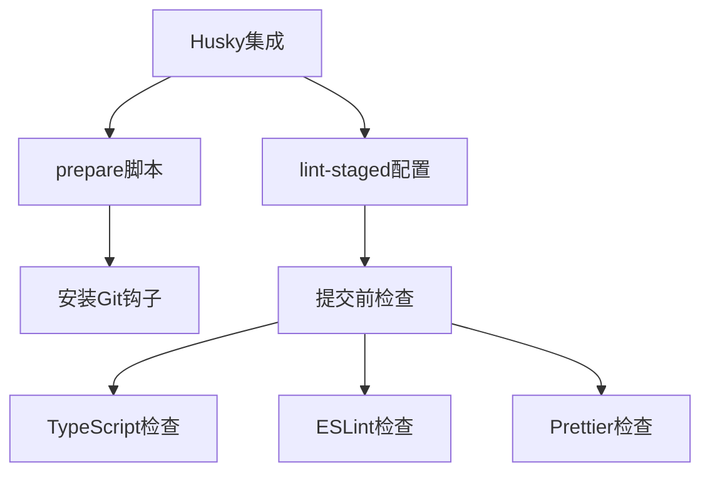
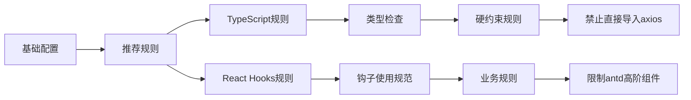
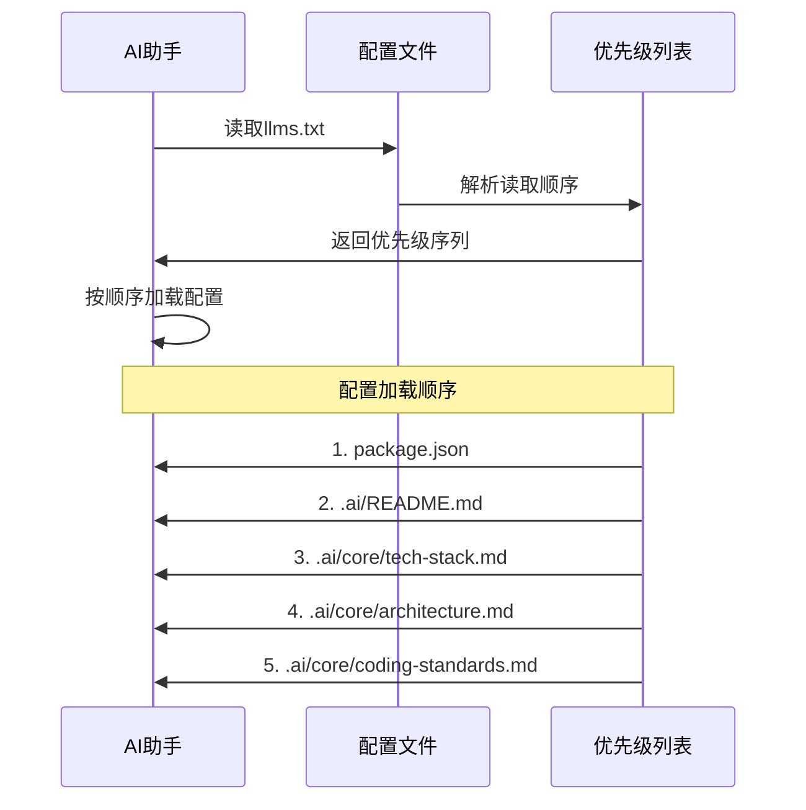

# AI工具链

<cite>
**本文引用的文件**
- [package.json](file://package.json)
- [eslint.config.mjs](file://eslint.config.mjs)
- [.ai/README.md](file://.ai/README.md)
- [.ai/tools/sync-sdesign-docs.js](file://.ai/tools/sync-sdesign-docs.js)
- [scripts/update-context.cjs](file://scripts/update-context.cjs)
- [llms.txt](file://llms.txt)
</cite>

## 更新摘要

**所做更改**

- 更新了项目结构，反映AI工具链的重大简化
- 移除了update-context.js相关的过时内容
- 新增了sync-sdesign-docs.js工具的详细说明
- 更新了验证命令和Git钩子集成的说明
- 重新组织了核心组件部分以反映当前工具链状态

## 目录

1. [简介](#简介)
2. [项目结构](#项目结构)
3. [核心组件](#核心组件)
4. [架构概览](#架构概览)
5. [详细组件分析](#详细组件分析)
6. [依赖分析](#依赖分析)
7. [性能考虑](#性能考虑)
8. [故障排除指南](#故障排除指南)
9. [结论](#结论)
10. [附录](#附录)

## 简介

本项目是一个面向前端开发的AI工具链系统，旨在通过配置驱动的方式提升开发效率、保证代码质量并减少重复劳动。经过重大简化后，该工具链专注于核心的文档同步和验证功能，移除了复杂的自动化工具，保留了必要的同步工具和Git钩子集成，提供了更简洁高效的开发工具链。

## 项目结构

项目采用模块化设计，经过简化后的主要结构如下：



**图表来源**

- [package.json](file://package.json#L1-L85)
- [.ai/tools/sync-sdesign-docs.js](file://.ai/tools/sync-sdesign-docs.js#L1-L123)

**章节来源**

- [package.json](file://package.json#L1-L85)
- [llms.txt](file://llms.txt#L1-L39)

## 核心组件

经过简化后的AI工具链包含以下核心组件：

### 文档同步工具

- **组件库文档同步器**: 专门同步@sdesign组件库的AI文档
- **上下文生成器**: 生成项目特定的AI上下文信息

### 验证系统

- **全量验证命令**: 集成TypeScript检查、ESLint和Prettier验证
- **自动修复功能**: 支持一键修复代码问题

### Git钩子集成

- **Husky集成**: 自动化的Git钩子管理
- **lint-staged配置**: 提交前代码检查和格式化

### 代码检查工具

- **ESLint配置**: 基于TypeScript的现代化代码检查规则
- **TypeScript类型检查**: 全面的类型安全验证

### 格式化工具

- **Prettier配置**: 统一的代码格式化标准
- **导入排序插件**: 自动组织import语句

**章节来源**

- [package.json](file://package.json#L6-L21)
- [eslint.config.mjs](file://eslint.config.mjs#L1-L97)
- [.ai/README.md](file://.ai/README.md#L26-L33)

## 架构概览

简化后的AI工具链采用精简的分层架构设计：



**图表来源**

- [package.json](file://package.json#L6-L21)
- [llms.txt](file://llms.txt#L1-L39)

## 详细组件分析

### 组件库文档同步器 (Component Library Docs Sync)

组件库文档同步器是当前AI工具链的核心组件，负责同步@sdesign组件库的AI文档。

```mermaid
flowchart TD
A[启动同步] --> B[查找源文件]
B --> C[检查软链接路径]
C --> D[搜索pnpm存储目录]
D --> E[定位@sdesign包]
E --> F[读取llms.txt]
F --> G[添加文件头信息]
G --> H[写入目标文件]
H --> I[输出同步结果]
I --> J[完成同步]
```

**图表来源**

- [.ai/tools/sync-sdesign-docs.js](file://.ai/tools/sync-sdesign-docs.js#L25-L123)

#### 主要功能特性

- **多路径查找**: 支持软链接和pnpm存储两种路径查找方式
- **版本提取**: 自动从源文件中提取组件库版本信息
- **文件头生成**: 自动生成包含元数据的文件头
- **错误处理**: 完善的错误检测和用户友好的错误信息

#### 数据结构分析



**图表来源**

- [.ai/tools/sync-sdesign-docs.js](file://.ai/tools/sync-sdesign-docs.js#L25-L123)

**章节来源**

- [.ai/tools/sync-sdesign-docs.js](file://.ai/tools/sync-sdesign-docs.js#L1-L123)

### 验证系统 (Validation System)

全量验证系统整合了TypeScript检查、ESLint和Prettier，提供统一的代码质量验证。

#### 验证命令配置



**图表来源**

- [package.json](file://package.json#L19-L20)

#### 验证策略

- **全量检查**: 同时执行TypeScript、ESLint和Prettier检查
- **自动修复**: 提供一键修复功能，自动修正可修复的问题
- **严格模式**: TypeScript检查采用严格模式，确保类型安全

**章节来源**

- [package.json](file://package.json#L19-L20)

### Git钩子集成 (Git Hooks Integration)

通过Husky实现的Git钩子集成为代码质量提供了自动化保障。

#### Husky配置分析



**图表来源**

- [package.json](file://package.json#L13-L30)

#### 提交前检查策略

- **多语言支持**: 支持TypeScript、JSON、Markdown、CSS等文件类型
- **分组处理**: 不同类型的文件采用不同的处理策略
- **缓存机制**: 利用Prettier缓存提高检查速度

**章节来源**

- [package.json](file://package.json#L13-L30)

### 代码检查系统 (Code Quality Checker)

基于ESLint的现代化代码检查系统，提供全面的代码质量保障。

#### ESLint配置分析



**图表来源**

- [eslint.config.mjs](file://eslint.config.mjs#L6-L96)

#### 规则配置详解

- **硬约束规则**: 禁止any类型、强制使用import type等
- **业务规则**: 限制antd高阶组件使用，引导使用@sdesign替代
- **导入限制**: 统一通过request插件使用HTTP请求
- **文件范围**: 针对不同文件类型设置不同的检查规则

**章节来源**

- [eslint.config.mjs](file://eslint.config.mjs#L28-L95)

### 代码格式化系统 (Code Formatter)

统一的代码格式化解决方案，确保团队代码风格一致性。

#### Prettier配置分析

```mermaid
graph TB
A[Prettier配置] --> B[插件系统]
A --> C[格式化规则]
A --> D[文件覆盖]
B --> E[@ianvs/prettier-plugin-sort-imports]
B --> F[prettier-plugin-packagejson]
C --> G[导入排序]
C --> H[单引号]
C --> I[尾逗号]
C --> J[行宽80字符]
D --> K[MD文件特殊处理]
D --> L[忽略node_modules]
```

**图表来源**

- [package.json](file://package.json#L50-L69)

#### 格式化策略

- **导入排序**: 按React、内部模块、外部依赖的顺序组织import语句
- **代码风格**: 单引号、尾逗号、80字符行长
- **插件扩展**: 支持导入排序和package.json格式化
- **文件过滤**: 特殊处理Markdown文件，忽略node_modules目录

**章节来源**

- [package.json](file://package.json#L50-L69)

### AI配置管理 (AI Configuration Manager)

通过llms.txt文件管理AI助手的配置和优先级。

#### 配置优先级体系



**图表来源**

- [llms.txt](file://llms.txt#L5-L14)

#### 功能分类

- **强制读取**: 固定顺序的必需配置
- **按需读取**: 根据任务类型动态加载
- **组件库文档**: 特定UI库的文档配置
- **技术栈摘要**: 当前项目的技术栈信息

**章节来源**

- [llms.txt](file://llms.txt#L1-L39)

## 依赖分析

简化后的AI工具链依赖关系更加清晰：

```mermaid
graph TB
subgraph "运行时依赖"
A[react ^18.3.0]
B[typescript ^5.5.0]
C[@dalydb/sdesign ^1.3.2]
D[zustand ^5.0.11]
E[antd ^5.29.3]
end
subgraph "开发时依赖"
F[@rsbuild/core ^1.7.0]
G[eslint ^10.0.3]
H[prettier ^3.8.1]
I[husky ^9.1.7]
J[lint-staged ^16.3.3]
end
subgraph "AI工具链"
K[组件库文档同步]
L[验证系统]
M[Git钩子集成]
N[格式化工具]
end
A --> K
B --> L
C --> K
D --> N
E --> M
F --> K
G --> L
H --> N
I --> M
J --> M
```

**图表来源**

- [package.json](file://package.json#L31-L71)

### 关键依赖特性

- **构建系统**: RSBuild提供现代化的构建体验
- **代码质量**: ESLint + TypeScript确保代码质量
- **UI生态**: @dalydb/sdesign + Ant Design的组合
- **状态管理**: Zustand + Immer的组合
- **Git集成**: Husky + lint-staged的自动化检查
- **AI集成**: 专门的AI工具链配置

**章节来源**

- [package.json](file://package.json#L31-L71)

## 性能考虑

简化后的AI工具链在性能优化方面采用了多项策略：

### 同步优化

- **智能查找**: 支持多种路径查找方式，提高查找成功率
- **版本缓存**: 自动提取版本信息，避免重复解析
- **文件头缓存**: 生成的文件头信息可直接复用

### 验证优化

- **并行执行**: TypeScript、ESLint、Prettier检查可以并行执行
- **增量检查**: Git钩子只检查受影响的文件
- **缓存机制**: 利用工具内置缓存提高检查速度

### 内存管理

- **流式处理**: 大文件采用流式读取方式
- **垃圾回收**: 及时释放不再使用的内存
- **内存监控**: 定期检查内存使用情况

### 磁盘I/O优化

- **批量写入**: 减少磁盘写入次数
- **异步操作**: 非阻塞的文件操作
- **路径缓存**: 缓存常用路径避免重复计算

## 故障排除指南

常见问题及解决方案：

### 组件库文档同步失败

**症状**: 组件库文档同步器无法找到@sdesign的llms.txt文件
**解决方案**:

1. 确认@sdesign组件库已正确安装
2. 检查pnpm存储目录是否存在
3. 验证软链接路径是否有效
4. 查看控制台错误信息获取具体原因

### 验证命令执行失败

**症状**: verify或verify:fix命令执行失败
**解决方案**:

1. 检查TypeScript编译错误
2. 运行 `npm run lint:fix` 修复ESLint问题
3. 运行 `npm run prettier` 修复格式化问题
4. 查看具体错误行号进行修复

### Git钩子不工作

**症状**: 提交时Git钩子没有执行
**解决方案**:

1. 运行 `npm run prepare` 重新安装Git钩子
2. 检查Husky版本兼容性
3. 验证lint-staged配置是否正确
4. 查看Git钩子日志获取详细信息

### 代码检查报错

**症状**: ESLint检查失败
**解决方案**:

1. 运行 `npm run lint:fix` 自动修复
2. 检查TypeScript类型定义
3. 验证React Hooks使用规范
4. 检查业务规则限制（如antd组件使用）

**章节来源**

- [.ai/tools/sync-sdesign-docs.js](file://.ai/tools/sync-sdesign-docs.js#L37-L58)
- [package.json](file://package.json#L19-L20)
- [eslint.config.mjs](file://eslint.config.mjs#L28-L95)

## 结论

经过重大简化的AI工具链通过精简的设计，为前端开发提供了更加高效和可靠的智能化解决方案。其核心优势包括：

1. **专注核心功能**: 专注于文档同步和验证，避免功能冗余
2. **自动化程度高**: Git钩子和验证命令实现完全自动化
3. **可维护性强**: 简化的架构降低了维护复杂度
4. **集成度好**: 与现有开发工具链无缝衔接
5. **性能优异**: 智能的查找和缓存机制提高执行效率

通过合理使用这些工具，团队可以显著提升开发效率，保证代码质量，并建立可持续的开发工作流。

## 附录

### 使用示例

```bash
# 启动开发服务器
npm run dev

# 运行全量验证
npm run verify

# 自动修复代码问题
npm run verify:fix

# 格式化代码
npm run prettier

# 同步组件库文档
npm run sync-ai-docs

# 重新安装Git钩子
npm run prepare

# 运行代码检查
npm run lint

# 自动修复代码检查问题
npm run lint:fix
```

### 最佳实践

1. **定期同步文档**: 在安装或更新@sdesign组件库后及时同步文档
2. **使用验证命令**: 在提交代码前使用verify命令确保代码质量
3. **遵循业务规则**: 严格遵守ESLint的业务规则限制
4. **Git钩子自动化**: 依赖Git钩子自动检查，减少人工干预
5. **配置版本控制**: 将AI配置纳入版本控制系统
6. **持续集成**: 在CI/CD流程中集成验证和格式化
