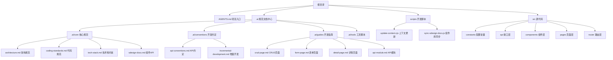
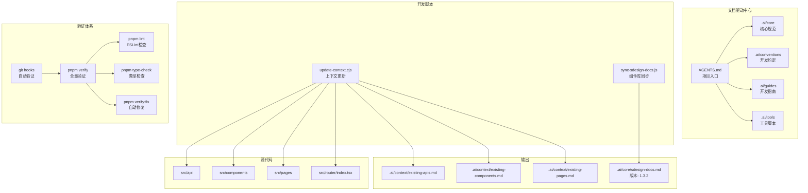
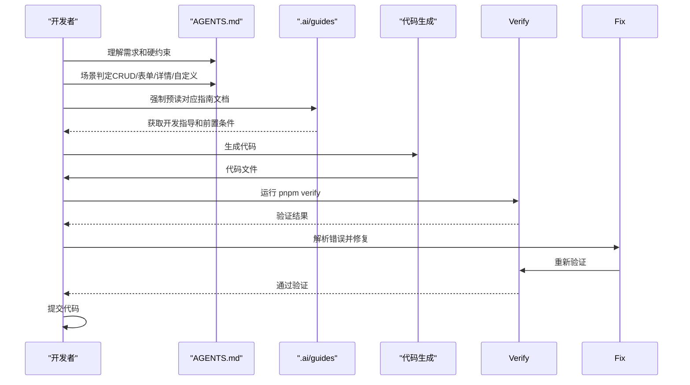
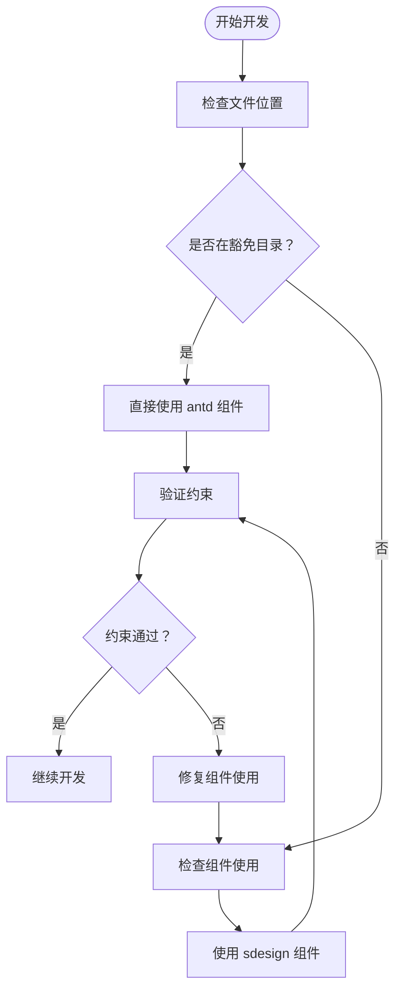
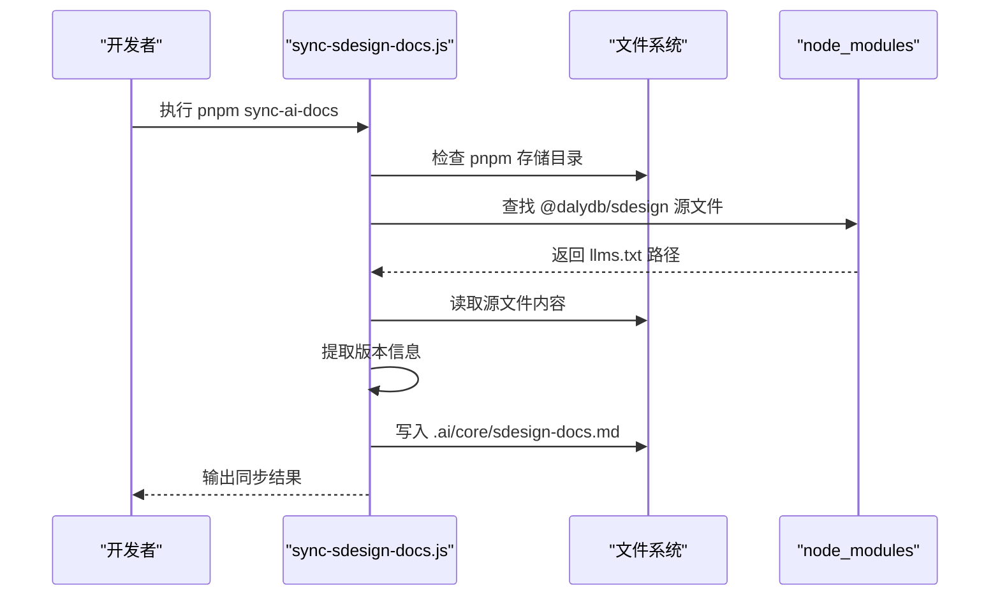
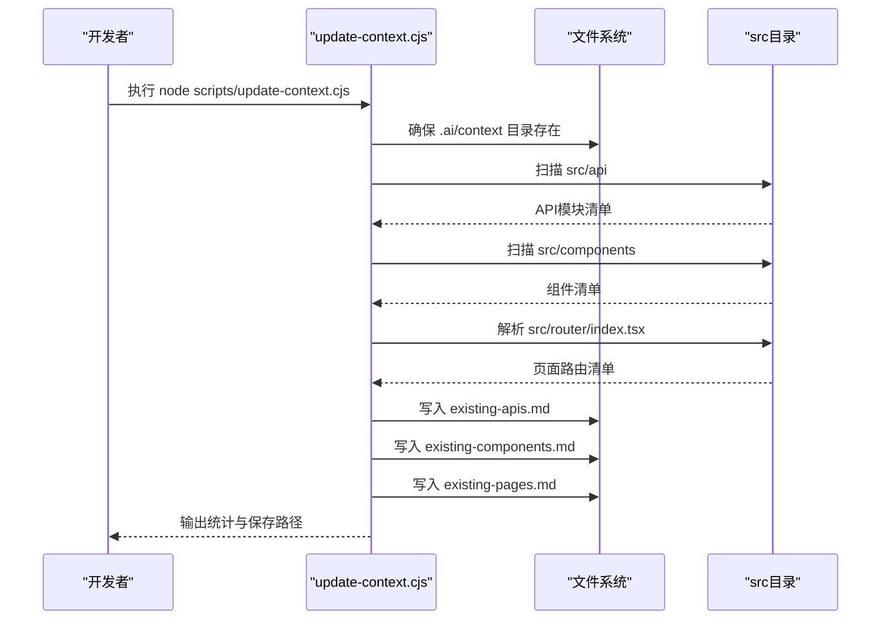
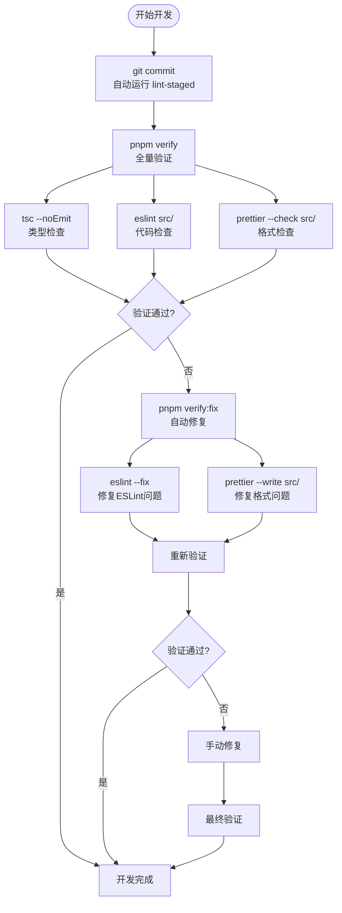
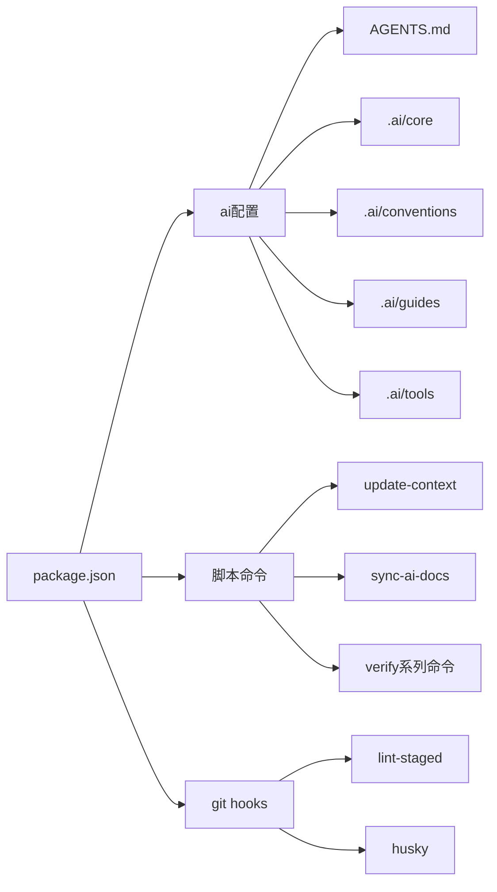

# AI开发体系

<cite>
**本文引用的文件**
- [package.json](file://package.json)
- [AGENTS.md](file://AGENTS.md)
- [update-context.cjs](file://scripts/update-context.cjs)
- [sync-sdesign-docs.js](file://.ai/tools/sync-sdesign-docs.js)
- [.ai/README.md](file://.ai/README.md)
</cite>

## 更新摘要

**所做更改**

- AGENTS.md从26行大幅扩展至148行，建立了完整的AI开发工作流和硬约束体系
- 新增"强制预读"机制，要求AI在生成代码前必须按场景阅读对应指南文档
- 建立了更严格的组件使用约束和豁免范围规则
- 增强了验证体系，包括git hooks自动验证
- 重构了开发工作流，从静态上下文管理转向动态发现策略
- 新增关键约定和深入参考文档体系

## 目录

1. [引言](#引言)
2. [项目结构](#项目结构)
3. [核心组件](#核心组件)
4. [架构概览](#架构概览)
5. [详细组件分析](#详细组件分析)
6. [开发工作流](#开发工作流)
7. [验证体系](#验证体系)
8. [依赖分析](#依赖分析)
9. [性能考虑](#性能考虑)
10. [故障排除指南](#故障排除指南)
11. [结论](#结论)
12. [附录](#附录)

## 引言

本项目是一个基于文档驱动理念构建的AI辅助前端开发体系，通过标准化的开发规范、指南文档和验证机制，实现高质量的代码生成与开发流程。项目的核心目标是：

- 建立清晰的硬约束和开发规范，确保代码质量一致性
- 提供按需查阅的开发指南，支持不同场景的页面和组件开发
- 通过验证命令确保生成代码符合项目规范
- 为团队建立高效且规范的AI辅助开发工作流

**更新** 项目现已完全重构为文档驱动开发工作流，建立了"强制预读"机制，要求AI在生成代码前必须按场景阅读对应指南文档，确保组件约束得到严格执行。

## 项目结构

项目采用前后端分离的典型前端工程结构，配合.ai目录作为AI开发规范中心，scripts目录提供开发辅助脚本，src目录承载业务代码。重构后的结构更加简洁明了，并建立了完整的文档层次结构。

**图表来源**

- [AGENTS.md](file://AGENTS.md#L42-L60)
- [package.json](file://package.json#L80-L83)
- [.ai/README.md](file://.ai/README.md#L16-L35)

**章节来源**

- [AGENTS.md](file://AGENTS.md#L42-L60)
- [package.json](file://package.json#L1-L85)
- [.ai/README.md](file://.ai/README.md#L1-L45)

## 核心组件

本节从文档驱动的角度解析项目的关键组件及其职责。

- **项目入口（AGENTS.md）**
  - 作用：定义项目的硬约束、开发规范和工作流程
  - 结构：包含组件使用约束、导入规则、验证命令、项目结构说明
  - 特性：提供完整的开发指南和规范约束，作为AI开发的权威参考
  - **更新**：从26行扩展至148行，建立了完整的强制预读机制

- **AI规范文档中心（.ai）**
  - 作用：集中管理开发规范、指南文档和工具脚本
  - 结构：core（核心规范）、conventions（开发约定）、guides（开发指南）、tools（工具脚本）
  - 读取方式：通过package.json中的ai.entry字段指向AGENTS.md作为入口
  - **更新**：建立了完整的文档层次结构，支持场景驱动的强制预读

- **上下文更新脚本（scripts/update-context.cjs）**
  - 作用：扫描src目录，自动生成现有API、组件与页面的清单
  - 输入：src/api、src/components、src/router/index.tsx
  - 输出：.ai/context/existing-apis.md、.ai/context/existing-components.md、.ai/context/existing-pages.md

- **组件库文档同步工具（.ai/tools/sync-sdesign-docs.js）**
  - 作用：自动同步 @dalydb/sdesign 组件库的AI文档到 .ai/core/sdesign-docs.md
  - 特性：支持 pnpm 内容寻址存储，自动提取版本信息，生成带时间戳的文档头部

**章节来源**

- [AGENTS.md](file://AGENTS.md#L1-L148)
- [package.json](file://package.json#L80-L83)
- [update-context.cjs](file://scripts/update-context.cjs#L1-L205)
- [sync-sdesign-docs.js](file://.ai/tools/sync-sdesign-docs.js#L1-L123)

## 架构概览

AI开发体系的运行架构围绕"文档驱动 + 强制预读 + 规范约束 + 验证检查"展开。开发者通过AGENTS.md理解需求，按场景强制预读对应的指南文档，生成代码后通过验证命令确保质量。

**图表来源**

- [AGENTS.md](file://AGENTS.md#L30-L41)
- [AGENTS.md](file://AGENTS.md#L132-L148)
- [package.json](file://package.json#L19-L20)

## 详细组件分析

### 组件A：强制预读工作流（AGENTS.md）

该文档定义了完整的开发工作流程，从需求理解到代码提交的全过程，特别强调了"强制预读"机制。

**图表来源**

- [AGENTS.md](file://AGENTS.md#L62-L84)
- [AGENTS.md](file://AGENTS.md#L101-L110)

**章节来源**

- [AGENTS.md](file://AGENTS.md#L62-L110)

### 组件B：组件使用约束机制（AGENTS.md）

该机制建立了严格的组件使用规则和豁免范围，确保统一的UI组件使用标准。

**图表来源**

- [AGENTS.md](file://AGENTS.md#L7-L21)

**章节来源**

- [AGENTS.md](file://AGENTS.md#L7-L21)

### 组件C：组件库文档同步机制（sync-sdesign-docs.js）

该脚本负责自动同步 @dalydb/sdesign 组件库的AI文档，确保开发过程使用最新版本的组件库规范。

**图表来源**

- [sync-sdesign-docs.js](file://.ai/tools/sync-sdesign-docs.js#L64-L111)

**章节来源**

- [sync-sdesign-docs.js](file://.ai/tools/sync-sdesign-docs.js#L1-L123)

### 组件D：上下文更新流程（update-context.cjs）

该脚本负责扫描项目结构并生成上下文文件，为开发提供当前项目的准确视图。

**图表来源**

- [update-context.cjs](file://scripts/update-context.cjs#L168-L205)

**章节来源**

- [update-context.cjs](file://scripts/update-context.cjs#L1-L205)

### 组件E：验证命令体系

项目提供完整的验证命令，通过机械化强制执行确保代码质量，并集成了git hooks自动验证。

**图表来源**

- [AGENTS.md](file://AGENTS.md#L30-L41)
- [package.json](file://package.json#L19-L20)

**章节来源**

- [AGENTS.md](file://AGENTS.md#L30-L41)
- [package.json](file://package.json#L19-L20)

## 开发工作流

项目采用"理解需求 → 场景判定 → 强制预读 → 生成代码 → 验证修复 → 提交"的标准化工作流程。开发者需要：

1. **理解需求意图**：判断属于哪种开发场景（CRUD / 表单 / 详情 / 自定义）
2. **场景判定**：根据需求选择对应的开发指南
3. **强制预读**：必须按场景阅读对应指南文档，不可跳过
4. **参考已有模式**：新增模块时参考现有同类模块
5. **组件约束速查**：编写JSX前对照检查清单
6. **生成代码**：基于指南和规范生成代码
7. **自我修正协议**：执行验证循环，最多3轮
8. **提交代码**：通过验证后提交到版本控制系统

**更新** 新增了"强制预读"机制，这是本次重构的核心变化，确保AI在生成代码前必须了解相关的组件约束和开发规范。

**章节来源**

- [AGENTS.md](file://AGENTS.md#L62-L110)
- [AGENTS.md](file://AGENTS.md#L132-L148)

## 验证体系

项目通过ESLint + TypeScript + Prettier的机械化验证体系确保代码质量，并集成了git hooks自动验证。验证命令具有严格的执行顺序和优先级：

- **pnpm verify**：全量验证（tsc + eslint + prettier），必须在提交前执行
- **pnpm verify:fix**：自动修复（eslint --fix + prettier --write），用于快速修复常见问题
- **pnpm lint**：仅ESLint检查，用于快速定位代码风格问题
- **pnpm type-check**：仅类型检查，用于验证TypeScript类型安全性
- **git hooks**：commit时自动运行lint-staged，push时自动运行type-check

**更新** 验证体系现在更加严格，要求开发者在每次提交前必须通过全量验证，并且集成了git hooks自动验证。

**章节来源**

- [AGENTS.md](file://AGENTS.md#L30-L41)
- [package.json](file://package.json#L19-L20)

## 依赖分析

项目通过package.json定义了核心依赖与开发脚本，其中与AI开发体系直接相关的部分包括：

- ai配置：定义项目入口为AGENTS.md，简化AI系统的定位
- 脚本命令：sync-ai-docs用于同步组件库文档，verify系列命令用于代码验证
- git hooks：lint-staged和husky集成，确保代码质量

**图表来源**

- [package.json](file://package.json#L80-L83)
- [package.json](file://package.json#L17-L20)
- [package.json](file://package.json#L22-L30)

**章节来源**

- [package.json](file://package.json#L1-L85)
- [package.json](file://package.json#L80-L83)

## 性能考虑

- **验证命令优化**：通过分层验证（tsc → eslint → prettier）减少单次验证时间
- **上下文更新频率**：建议在新增API、组件或页面后执行上下文更新脚本
- **文档查阅效率**：通过.ai/guides的分类结构，开发者可以快速定位所需指南
- **自动化集成**：通过husky在git hooks中自动执行验证，确保代码质量
- **组件库文档同步**：定期同步最新版本的组件库文档，避免版本不一致
- **强制预读机制**：虽然增加了预读步骤，但通过明确的场景映射减少了重复劳动

## 故障排除指南

- **验证命令执行失败**
  - 检查pnpm verify的返回码，按tsc → eslint → prettier的顺序修复
  - 使用pnpm verify:fix进行自动修复，然后重新验证
  - 确认TypeScript配置和ESLint配置正确无误

- **组件库文档同步失败**
  - 检查@ant-design/sdesign是否已正确安装
  - 确认pnpm存储目录存在且可访问
  - 验证.node_modules/.pnpm目录结构是否符合预期

- **上下文文件未生成**
  - 检查scripts/update-context.cjs是否正确执行
  - 确认src/api、src/components、src/router/index.tsx是否存在
  - 验证.ai/context目录权限与磁盘空间

- **AGENTS.md入口点无法找到**
  - 检查package.json中的ai.entry配置是否正确
  - 确认AGENTS.md文件存在于项目根目录
  - 验证文件编码和格式是否正确

- **强制预读机制问题**
  - 确认AI已按场景阅读对应指南文档
  - 检查.ai/guides目录下的指南文件是否存在
  - 验证指南文件的前置条件是否满足

**章节来源**

- [AGENTS.md](file://AGENTS.md#L30-L41)
- [package.json](file://package.json#L80-L83)
- [update-context.cjs](file://scripts/update-context.cjs#L168-L205)

## 结论

本AI开发体系通过文档驱动理念，将硬约束、开发规范、验证机制有机结合，形成了简洁高效的代码生成与开发辅助框架。重构后的体系建立了"强制预读"机制，要求AI在生成代码前必须按场景阅读对应指南文档，确保组件约束得到严格执行。通过AGENTS.md作为单一入口点，为开发者提供了清晰、可操作的开发指导。

**更新** 随着强制预读机制和更严格的验证体系的建立，项目变得更加规范和易于维护，同时保持了高质量的代码标准和开发体验。

## 附录

- **使用示例**
  - 查阅开发规范：阅读AGENTS.md理解项目约束和工作流程
  - 强制预读指南：按场景阅读.ai/guides下的对应指南文档
  - 同步组件库文档：执行pnpm sync-ai-docs更新.sdesign文档
  - 更新项目上下文：执行node scripts/update-context.cjs生成现有资源清单
  - 验证代码质量：执行pnpm verify进行全量检查，pnpm verify:fix进行自动修复
  - 集成git hooks：通过husky自动执行验证，确保代码质量

- **扩展指南**
  - 新增开发约定：在.ai/conventions目录添加新的约定文件
  - 创建开发指南：在.ai/guides目录添加新的开发场景指南
  - 自定义验证规则：通过ESLint配置文件添加新的代码检查规则
  - 扩展验证命令：在package.json中添加新的脚本命令
  - 集成第三方工具：通过验证器脚本集成外部验证工具
  - 版本管理：定期同步组件库文档，确保使用最新版本的组件库规范

**更新** 重构后的体系更加注重实用性，通过精简的配置和清晰的文档结构，为团队提供了高效可靠的AI辅助开发工作流。强制预读机制确保了开发质量的一致性，而严格的验证体系则保证了代码规范的执行。
