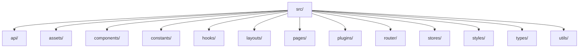
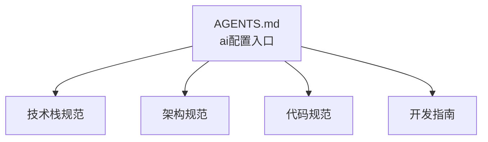
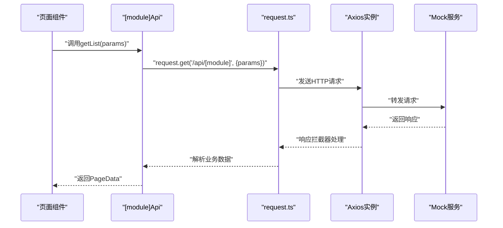
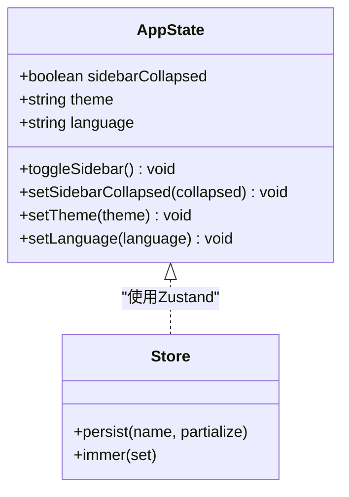
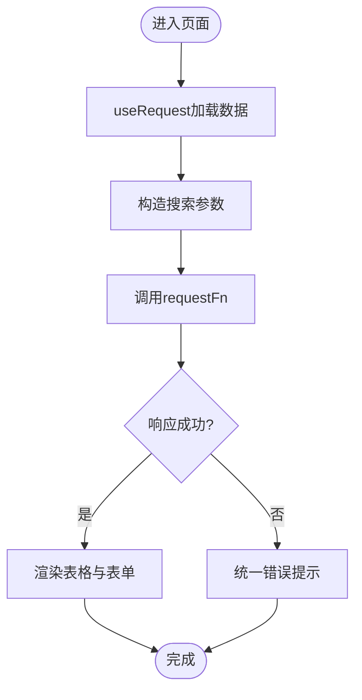

# AI配置规范

<cite>
**本文引用的文件**
- [AGENTS.md](file://AGENTS.md)
- [package.json](file://package.json)
- [llms.txt](file://llms.txt)
- [.ai/README.md](file://.ai/README.md)
- [.ai/core/tech-stack.md](file://.ai/core/tech-stack.md)
- [.ai/core/architecture.md](file://.ai/core/architecture.md)
- [.ai/core/coding-standards.md](file://.ai/core/coding-standards.md)
- [eslint.config.mjs](file://eslint.config.mjs)
- [tsconfig.json](file://tsconfig.json)
- [src/plugins/request/index.ts](file://src/plugins/request/index.ts)
- [src/constants/config.ts](file://src/constants/config.ts)
- [src/stores/app.ts](file://src/stores/app.ts)
- [src/pages/dashboard/index.tsx](file://src/pages/dashboard/index.tsx)
</cite>

## 更新摘要

**变更内容**

- AI配置规范从复杂的多文件系统简化为单一的AGENTS.md入口点
- 移除了原有的package.json AI配置和复杂的优先级机制
- 更新了配置文件结构与引用方式
- 保持原有技术栈、架构规范和编码约定的完整性

## 目录

1. [简介](#简介)
2. [项目结构](#项目结构)
3. [核心组件](#核心组件)
4. [架构总览](#架构总览)
5. [详细组件分析](#详细组件分析)
6. [依赖分析](#依赖分析)
7. [性能考虑](#性能考虑)
8. [故障排查指南](#故障排查指南)
9. [结论](#结论)
10. [附录](#附录)

## 简介

本文件为"AI配置规范"的权威说明，面向AI驱动开发场景，系统化阐述技术栈约束、项目结构强制规范、核心编码约定，以及组件规范、API层规范、状态管理规范、页面组件规范的具体实现要求与最佳实践。同时明确禁止事项及其违反后果，帮助开发者准确把握技术边界；并通过配置文件结构、优先级机制与版本兼容性等细节，确保团队协作的一致性与可维护性。

**更新** AI配置规范现已简化为单一的AGENTS.md入口点，移除了复杂的多文件系统和优先级机制，使配置更加直观和易于维护。

## 项目结构

项目采用"分层+领域"结合的结构化组织方式，强制目录命名与职责划分，确保可扩展性与一致性：

- src/api：按模块组织的API层，统一导出与类型定义分离
- src/assets：静态资源（图片、字体、图标）
- src/components：业务组件、通用组件、布局组件
- src/constants：枚举、配置常量
- src/hooks：自定义Hooks
- src/layouts：布局组件（复数命名）
- src/pages：页面层，每个页面独立目录，包含页面组件与私有组件
- src/plugins：插件层（请求封装、埋点等）
- src/router：路由配置、守卫、懒加载工具
- src/stores：状态管理（应用级与领域级）
- src/styles：全局样式
- src/types：全局类型
- src/utils：通用工具函数

**图示来源**

- [.ai/core/architecture.md](file://.ai/core/architecture.md#L20-L75)

**章节来源**

- [.ai/core/architecture.md](file://.ai/core/architecture.md#L20-L75)

## 核心组件

本节聚焦AI在生成代码时必须遵循的"核心组件"清单与约束，确保与技术栈与组件库保持一致。

- 技术栈与版本
  - 构建：RSBuild ^1.7.0
  - 框架：React ^18.3.0 + TypeScript ^5.5.0
  - UI库：@dalydb/sdesign + Ant Design ^5.29.3
  - 状态：Zustand ^5.0.11 + immer ^10.1.0
  - 路由：React Router ^6.26.0
  - HTTP：Axios ^1.7.0
  - Hooks：ahooks ^3.8.0
  - 图表：Chart.js ^4.4.0 + react-chartjs-2 ^5.2.0
  - 图标：lucide-react ^0.400.0 + @ant-design/icons ^5.4.0
  - 工具库：dayjs ^1.11.0, lodash-es ^4.17.0

- 禁用技术
  - 状态管理：Redux（使用Zustand替代）
  - 表单处理：Formik（使用SForm替代）
  - 表格组件：react-table（使用SSearchTable替代）
  - HTTP客户端：ky、fetch（使用Axios封装替代）
  - 路由管理：Next.js路由（使用React Router替代）

- 性能要求
  - Bundle size：单页不超过 500KB
  - 首屏加载：不超过 2 秒
  - 交互响应：不超过 100ms
  - 内存使用：不超过 100MB

- 开发环境要求
  - Node.js：>= 18.0.0
  - pnpm：>= 8.0.0
  - IDE：VS Code + 推荐扩展
  - 浏览器：Chrome DevTools 调试

- 版本兼容性
  - 所有组件必须与 React 18 兼容
  - TypeScript 严格模式必须启用
  - 不允许使用已废弃的API
  - 必须支持现代浏览器（Chrome 80+, Firefox 75+, Safari 14+）

**章节来源**

- [.ai/core/tech-stack.md](file://.ai/core/tech-stack.md#L1-L90)

## 架构总览

AI在处理任何任务前，必须严格遵循以下"单一入口"与"按需读取"规则，以确保上下文一致与生成质量稳定：

- 单一入口
  1. AGENTS.md（AI配置中心总览与规范定义）
  2. .ai/README.md（AI配置中心总览与读取顺序）
  3. .ai/core/tech-stack.md（技术栈定义）
  4. .ai/core/architecture.md（架构规范）
  5. .ai/core/coding-standards.md（代码规范）

- 按需读取
  - API开发：.ai/conventions/api-conventions.md
  - 增量开发：.ai/conventions/incremental-development.md
  - CRUD页面：.ai/templates/crud-page.md
  - 表单页面：.ai/templates/form-designer.md
  - 详情页面：.ai/templates/detail-page.md

- 组件库文档
  - @dalydb/sdesign：.ai/core/sdesign-docs.md

- 技术栈摘要
  - 构建：RSBuild ^1.7.0
  - 框架：React ^18.3.0 + TypeScript ^5.5.0
  - UI库：@dalydb/sdesign + Ant Design ^5.29.3
  - 状态：Zustand ^5.0.11 + immer
  - 路由：React Router ^6.26.0

**更新** AI配置规范已简化为单一入口点AGENTS.md，移除了复杂的优先级机制，使配置更加直观和易于维护。

**章节来源**

- [llms.txt](file://llms.txt#L1-L39)

## 详细组件分析

### 组件规范（强制）

- 函数式组件 + TypeScript
- Props接口定义清晰，字段具备明确注释
- 组件实现简洁，避免在组件内直接发起请求
- 使用统一的导入顺序与导出模式

最佳实践要点

- 使用默认导出（组件）
- 使用命名导出（API、Hooks、工具函数）
- 统一导出入口文件

**章节来源**

- [.ai/core/architecture.md](file://.ai/core/architecture.md#L79-L98)

### API层规范（强制）

- 模块化组织：按业务模块拆分 api/[module]，统一导出
- 类型定义与实现分离：types.ts 与 index.ts 分离
- API对象模式：getList/getById/create/update/delete 统一命名
- 使用封装后的 request，避免直接使用 axios

错误与正确的对比

- ❌ 错误：在组件内直接调用 axios；使用 any 类型；相对路径 ../../
- ✅ 正确：通过 request 封装；使用明确类型；使用绝对路径 src/

**章节来源**

- [.ai/core/architecture.md](file://.ai/core/architecture.md#L100-L138)
- [.ai/core/coding-standards.md](file://.ai/core/coding-standards.md#L122-L181)

### 状态管理规范（强制）

- Store组织：应用级（app.ts）、领域级（如 product.ts）
- 使用 Zustand + immer，避免直接修改状态
- 使用 persist 保存部分状态，减少重复初始化
- actions 通过 set 或 immer 的 set 方法更新状态

最佳实践要点

- 使用 selector 计算派生状态，不存储在 store 中
- 使用 reset 重置状态，便于组件卸载后清理

**章节来源**

- [.ai/core/architecture.md](file://.ai/core/architecture.md#L140-L181)
- [src/stores/app.ts](file://src/stores/app.ts#L1-L59)

### 页面组件规范（强制）

- 页面组件命名：PascalCase + Page
- 使用 SSearchTable 作为列表页首选，结合 SForm.Search 与 STable
- 通过 useRequest 管理数据加载与错误处理
- 使用 SConfigProvider 提供全局字典，STable/SDetail 自动读取

最佳实践要点

- headTitle/tableTitle/headDesc 等标题配置清晰
- formProps/columns 等参数合理拆分
- rowKey、scroll 等表格属性按需配置

**章节来源**

- [.ai/core/architecture.md](file://.ai/core/architecture.md#L183-L248)
- [.ai/core/sdesign-docs.md](file://.ai/core/sdesign-docs.md#L63-L70)

### 禁止事项与违反后果

- ❌ 不要使用 any 类型：违反类型安全，降低可维护性
- ❌ 不要直接使用 axios：绕过统一拦截与错误处理
- ❌ 不要在组件内直接调用API：破坏数据流与可测试性
- ❌ 不要使用相对路径 ../../：破坏模块化与可移植性
- ❌ 不要直接修改Zustand状态：导致不可预测的状态变更

违反后果

- 代码审查无法通过
- CI/CD 流程失败
- 运行时错误与性能问题
- 团队协作成本上升

**章节来源**

- [.ai/core/architecture.md](file://.ai/core/architecture.md#L250-L257)

## 依赖分析

本项目通过 AGENTS.md 的 ai 配置集中管理AI相关的规范与约束，确保AI助手在生成代码时具备一致的上下文与实施路径。

- AI配置入口
  - 入口文件：AGENTS.md
  - 配置描述：AI Frontend - Harness Engineering 驱动开发

- 技术栈与依赖
  - 构建：RSBuild + React 插件
  - 框架：React + TypeScript
  - UI：@dalydb/sdesign + Ant Design
  - 状态：Zustand + immer
  - 路由：React Router
  - HTTP：Axios 封装
  - 工具：ahooks、dayjs、lodash-es

**更新** AI配置已简化为单一入口点，移除了复杂的优先级机制和多文件系统结构。

**图示来源**

- [package.json](file://package.json#L80-L83)
- [llms.txt](file://llms.txt#L15-L28)

**章节来源**

- [package.json](file://package.json#L80-L83)
- [llms.txt](file://llms.txt#L1-L39)

## 性能考虑

- Bundle size：单页不超过 500KB，避免引入重型依赖
- 首屏加载：不超过 2 秒，合理使用懒加载与骨架屏
- 交互响应：不超过 100ms，避免不必要的重渲染
- 内存使用：不超过 100MB，及时清理定时器与事件监听
- 列表渲染：使用 key 属性；大数据量使用虚拟列表
- 避免重渲染：使用 useMemo/useCallback 缓存计算与回调

**章节来源**

- [.ai/core/tech-stack.md](file://.ai/core/tech-stack.md#L69-L75)
- [.ai/core/coding-standards.md](file://.ai/core/coding-standards.md#L323-L350)

## 故障排查指南

- 请求拦截与错误处理
  - 统一在 request.ts 中处理业务错误与网络错误
  - 401/403/404/500 等状态码对应明确提示
  - Token 过期自动清除并跳转登录页

- 常见问题定位
  - API未生效：检查 request 封装是否被正确使用
  - 状态异常：确认 actions 是否通过 set/immer 更新
  - 路由白名单：确认白名单路由配置是否覆盖目标页面
  - 样式冲突：避免全局污染，使用组件级样式

**章节来源**

- [src/plugins/request/index.ts](file://src/plugins/request/index.ts#L1-L114)
- [src/constants/config.ts](file://src/constants/config.ts#L21-L31)

## 结论

本规范以"单一AI配置入口"为核心，结合"技术栈约束、项目结构强制、编码约定与最佳实践"，为AI驱动开发提供了清晰的技术边界与实施路径。严格遵循架构与规范，可显著提升代码质量、可维护性与团队协作效率；违反规范将带来审查阻塞、流程失败与运行风险。

**更新** AI配置规范的简化使开发体验更加直观，移除了复杂的优先级机制，但仍保持了完整的约束与最佳实践指导。

## 附录

### 配置文件结构与优先级机制

- AGENTS.md.ai
  - entry：AGENTS.md（单一入口点）
  - 简化的配置结构

- llms.txt
  - 强制读取顺序与按需读取清单
  - 组件库文档索引

- tsconfig.json
  - 严格模式、路径别名、JSX策略

- eslint.config.mjs
  - ESLint规则：推荐规则 + TypeScript + React Hooks
  - 硬约束规则：禁止 any 类型、禁止直接导入 axios、限制 antd 组件使用

- .ai/README.md
  - AI配置中心总览与目录结构说明

**更新** 配置文件结构已大幅简化，移除了复杂的优先级机制和多文件系统。

**章节来源**

- [package.json](file://package.json#L80-L83)
- [llms.txt](file://llms.txt#L1-L39)
- [tsconfig.json](file://tsconfig.json#L1-L24)
- [eslint.config.mjs](file://eslint.config.mjs#L1-L97)
- [.ai/README.md](file://.ai/README.md#L1-L34)

### 版本兼容性与更新策略

- 兼容性
  - React 18 兼容
  - TypeScript 严格模式
  - 现代浏览器支持

- 更新策略
  - 主版本：充分测试与评审
  - 次版本：可自动更新，回归测试
  - 补丁版本：可安全自动更新
  - 依赖移除：评估影响与替代方案

**章节来源**

- [.ai/core/tech-stack.md](file://.ai/core/tech-stack.md#L50-L90)

### API层实现流程（序列图）

**图示来源**

- [.ai/core/architecture.md](file://.ai/core/architecture.md#L120-L137)
- [src/plugins/request/index.ts](file://src/plugins/request/index.ts#L78-L111)

### 状态管理流程（类图）

**图示来源**

- [src/stores/app.ts](file://src/stores/app.ts#L5-L58)

### 页面组件工作流（流程图）

**图示来源**

- [.ai/core/architecture.md](file://.ai/core/architecture.md#L183-L248)

### AI配置简化对比

**更新** 以下是简化前后的配置结构对比：

| 简化前（多文件系统） | 简化后（单一入口） |
| -------------------- | ------------------ |
| package.json ai配置  | AGENTS.md 单一入口 |
| 复杂优先级机制       | 简化的读取顺序     |
| 多个规范文件         | 集中在AGENTS.md    |
| llms.txt优先级       | 直接引用AGENTS.md  |
| .ai/core/... 规范    | 通过AGENTS.md引用  |

这种简化使AI配置更加直观，减少了维护复杂度，同时保持了完整的约束与最佳实践指导。
