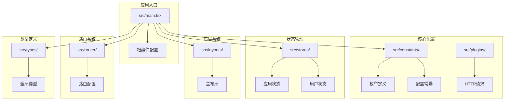
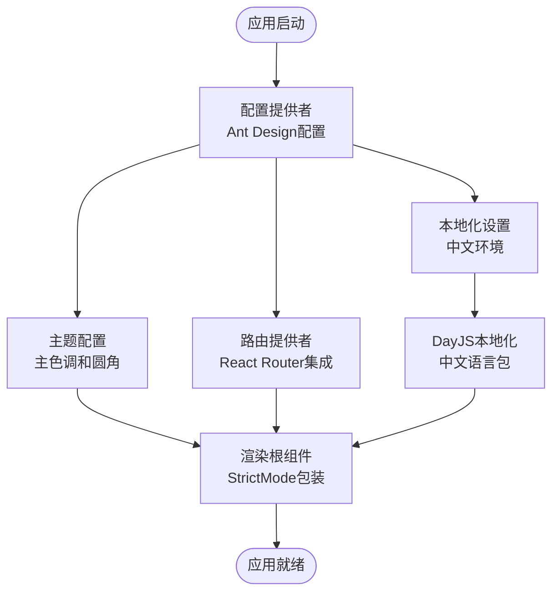
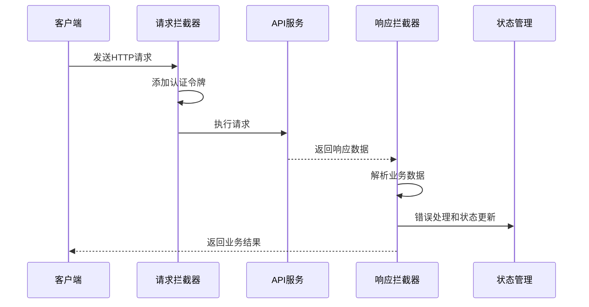
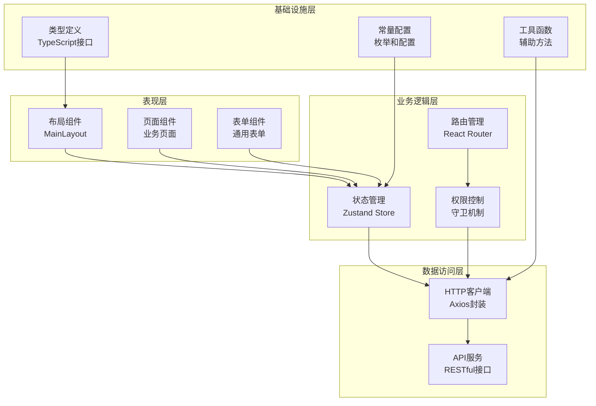
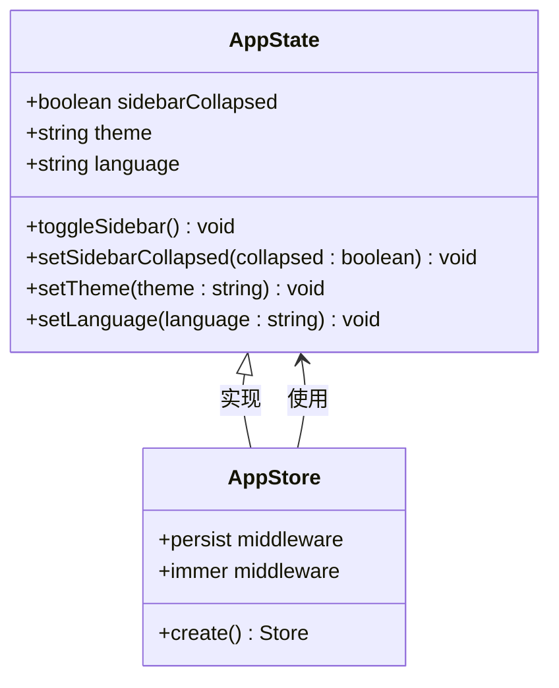
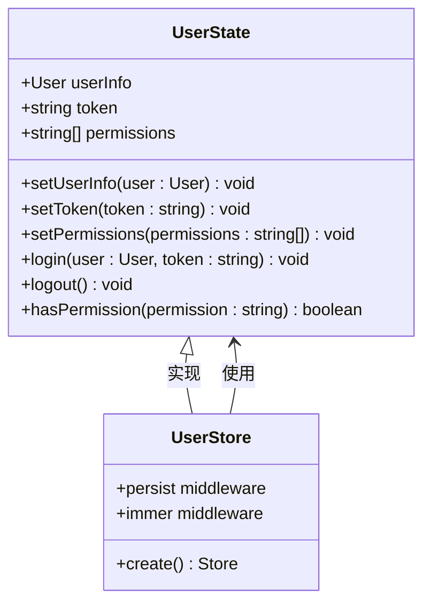
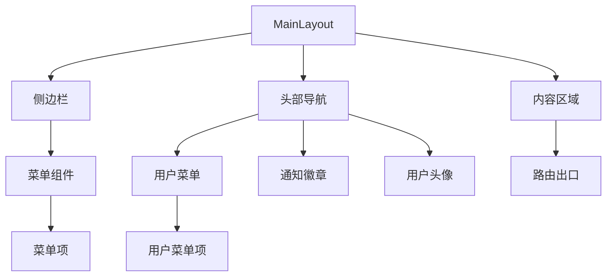
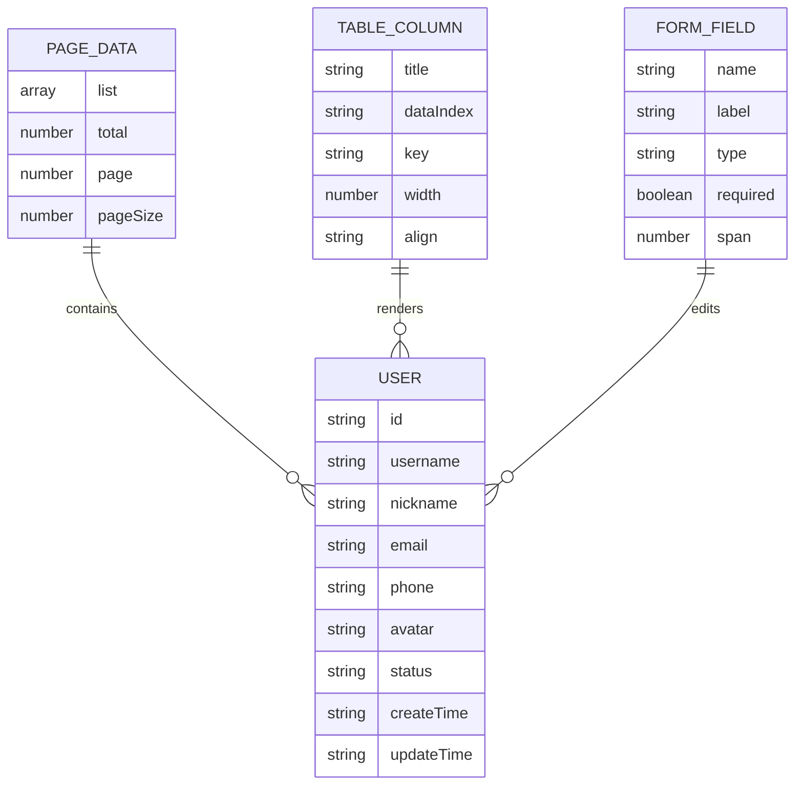
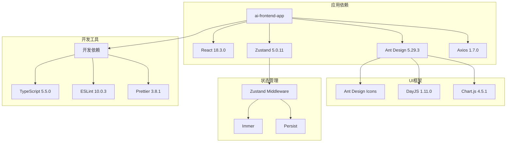

# SDesign 组件库文档

<cite>
**本文档中引用的文件**
- [package.json](file://package.json)
- [main.tsx](file://src/main.tsx)
- [index.ts](file://src/constants/index.ts)
- [enum.ts](file://src/constants/enum.ts)
- [config.ts](file://src/constants/config.ts)
- [index.ts](file://src/hooks/index.ts)
- [index.ts](file://src/plugins/index.ts)
- [index.ts](file://src/plugins/request/index.ts)
- [index.tsx](file://src/router/index.tsx)
- [MainLayout.tsx](file://src/layouts/MainLayout.tsx)
- [index.ts](file://src/stores/index.ts)
- [app.ts](file://src/stores/app.ts)
- [user.ts](file://src/stores/user.ts)
- [index.ts](file://src/types/index.ts)
</cite>

## 目录

1. [简介](#简介)
2. [项目结构](#项目结构)
3. [核心组件](#核心组件)
4. [架构概览](#架构概览)
5. [详细组件分析](#详细组件分析)
6. [依赖关系分析](#依赖关系分析)
7. [性能考虑](#性能考虑)
8. [故障排除指南](#故障排除指南)
9. [结论](#结论)

## 简介

SDesign 是一个基于 React 和 Ant Design 的企业级前端组件库，专为 AI 驱动的工程化开发而设计。该项目采用现代化的前端技术栈，包括 TypeScript、React 18、Zustand 状态管理、Axios HTTP 客户端等，提供了完整的前端应用基础设施。

该组件库的核心目标是提供一套可复用、可维护、高性能的 UI 组件解决方案，支持国际化、主题定制、权限控制等企业级功能特性。

## 项目结构

项目采用模块化的组织方式，主要分为以下几个核心模块：

**图表来源**

- [main.tsx:1-32](file://src/main.tsx#L1-L32)
- [constants/index.ts:1-4](file://src/constants/index.ts#L1-L4)
- [stores/index.ts:1-3](file://src/stores/index.ts#L1-L3)

**章节来源**

- [package.json:1-86](file://package.json#L1-L86)
- [main.tsx:1-32](file://src/main.tsx#L1-L32)

## 核心组件

### 应用配置与初始化

应用通过主入口文件进行全局配置，包括国际化设置、主题配置、路由集成等关键功能。

**图表来源**

- [main.tsx:17-31](file://src/main.tsx#L17-L31)

### HTTP 请求系统

基于 Axios 构建的统一请求封装，提供了完整的请求/响应拦截机制和错误处理策略。

**图表来源**

- [index.ts:80-112](file://src/plugins/request/index.ts#L80-L112)

**章节来源**

- [main.tsx:1-32](file://src/main.tsx#L1-L32)
- [index.ts:80-112](file://src/plugins/request/index.ts#L80-L112)

## 架构概览

系统采用分层架构设计，各层职责清晰，耦合度低，便于维护和扩展。

**图表来源**

- [MainLayout.tsx:1-174](file://src/layouts/MainLayout.tsx#L1-L174)
- [app.ts:1-59](file://src/stores/app.ts#L1-L59)
- [user.ts:1-76](file://src/stores/user.ts#L1-L76)

## 详细组件分析

### 状态管理系统

系统采用 Zustand 作为状态管理解决方案，提供了轻量级但功能强大的状态管理能力。

#### 应用状态存储 (AppState)

**图表来源**

- [app.ts:5-16](file://src/stores/app.ts#L5-L16)
- [app.ts:18-58](file://src/stores/app.ts#L18-L58)

#### 用户状态存储 (UserState)

**图表来源**

- [user.ts:6-19](file://src/stores/user.ts#L6-L19)
- [user.ts:21-75](file://src/stores/user.ts#L21-L75)

**章节来源**

- [app.ts:1-59](file://src/stores/app.ts#L1-L59)
- [user.ts:1-76](file://src/stores/user.ts#L1-L76)

### 布局系统

主布局组件提供了完整的应用骨架，包括侧边栏、头部导航、内容区域等核心布局元素。

**图表来源**

- [MainLayout.tsx:74-170](file://src/layouts/MainLayout.tsx#L74-L170)

**章节来源**

- [MainLayout.tsx:1-174](file://src/layouts/MainLayout.tsx#L1-L174)

### 类型系统

系统提供了完整的 TypeScript 类型定义，确保类型安全和开发体验。

#### 核心类型定义

**图表来源**

- [index.ts:3-28](file://src/types/index.ts#L3-L28)
- [index.ts:49-85](file://src/types/index.ts#L49-L85)

**章节来源**

- [index.ts:1-101](file://src/types/index.ts#L1-L101)

## 依赖关系分析

项目依赖关系清晰，主要依赖包括 Ant Design UI 框架、React 生态系统、状态管理库等。

**图表来源**

- [package.json:31-47](file://package.json#L31-L47)
- [package.json:48-72](file://package.json#L48-L72)

**章节来源**

- [package.json:1-86](file://package.json#L1-L86)

## 性能考虑

系统在多个层面考虑了性能优化：

1. **按需加载**: 使用 React.lazy 和 Suspense 实现组件懒加载
2. **状态持久化**: Zustand 的 persist 中间件减少重复登录
3. **缓存策略**: HTTP 客户端支持请求缓存和响应缓存
4. **渲染优化**: React.memo 和 useMemo 优化组件渲染
5. **打包优化**: Rsbuild 构建工具提供 Tree Shaking 和代码分割

## 故障排除指南

### 常见问题及解决方案

#### 登录状态异常

- 检查本地存储中的 token 是否存在
- 验证后端 JWT 令牌的有效性
- 确认路由守卫配置正确

#### API 请求失败

- 检查网络连接和 CORS 配置
- 验证请求头中的 Authorization 字段
- 查看响应状态码和错误信息

#### 样式显示异常

- 确认 Ant Design 主题配置正确
- 检查 CSS 变量和样式覆盖
- 验证国际化语言包加载

**章节来源**

- [index.ts:35-77](file://src/plugins/request/index.ts#L35-L77)

## 结论

SDesign 组件库是一个功能完整、架构清晰的企业级前端解决方案。通过合理的模块划分、完善的类型系统、强大的状态管理和灵活的配置机制，为现代 Web 应用开发提供了坚实的基础。

该组件库的主要优势包括：

- 模块化设计，易于维护和扩展
- 完善的类型安全保证
- 灵活的主题和国际化支持
- 高性能的状态管理和渲染优化
- 丰富的业务组件和工具函数

未来可以考虑的功能增强方向：

- 添加更多的业务组件和模板
- 实现更完善的测试覆盖率
- 优化构建性能和 bundle 大小
- 增强开发工具链和自动化流程
