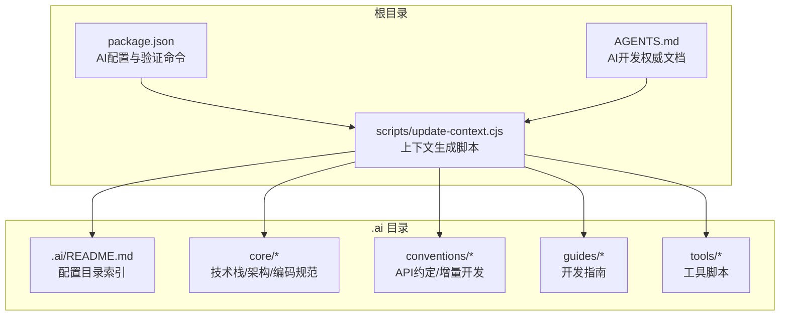
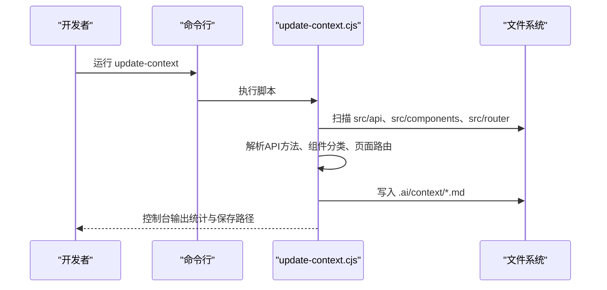
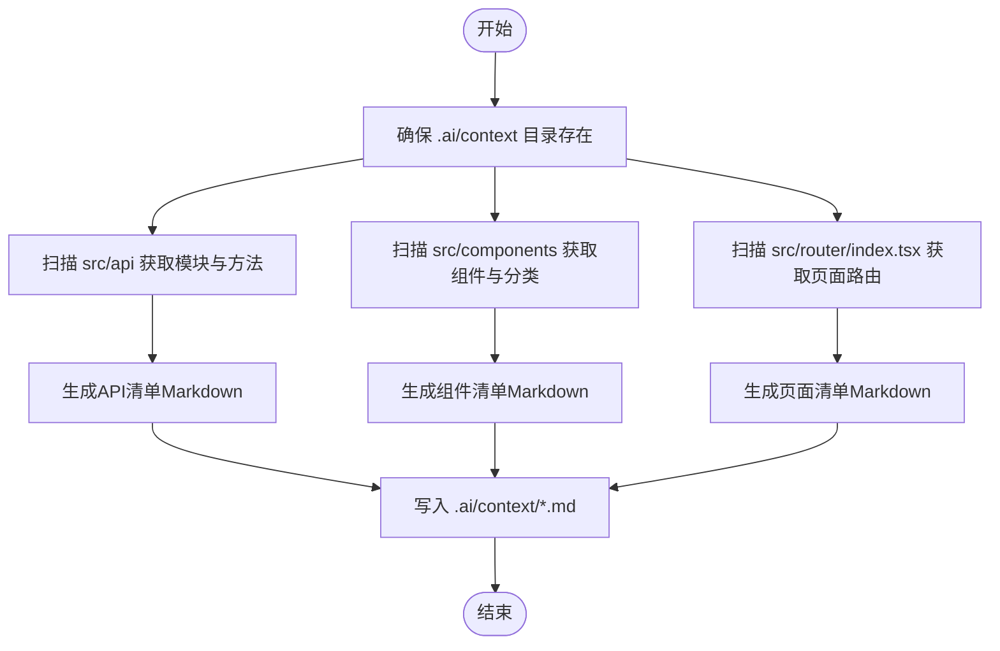
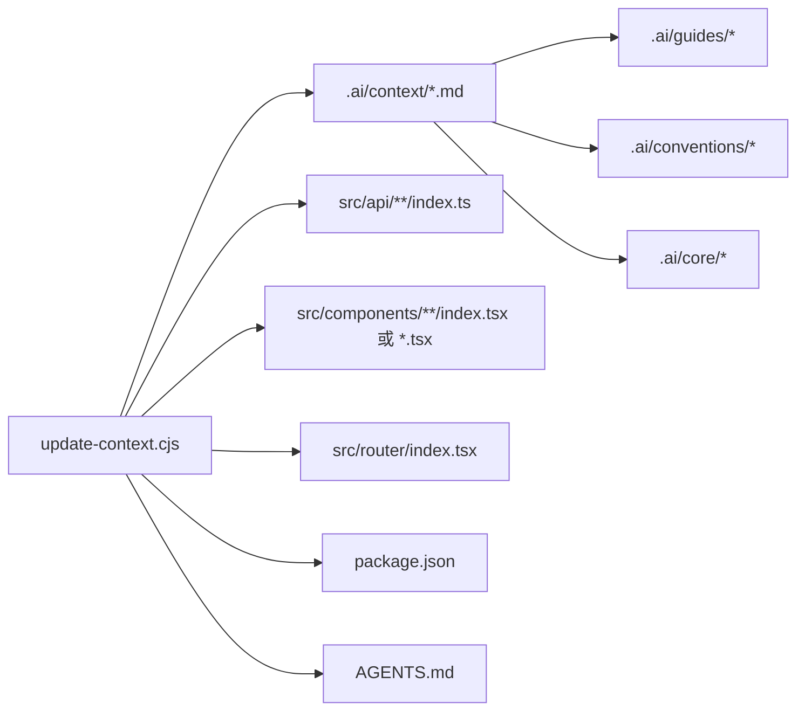

# 代码生成机制

<cite>
**本文引用的文件**
- [scripts/update-context.cjs](file://scripts/update-context.cjs)
- [package.json](file://package.json)
- [AGENTS.md](file://AGENTS.md)
- [.ai/README.md](file://.ai/README.md)
- [.ai/core/sdesign-docs.md](file://.ai/core/sdesign-docs.md)
- [.ai/conventions/api-conventions.md](file://.ai/conventions/api-conventions.md)
- [.ai/guides/crud-page.md](file://.ai/guides/crud-page.md)
</cite>

## 更新摘要

**所做更改**

- 更新了代码生成机制的架构描述，反映从自动化自我修正向文档驱动开发流程的转变
- 新增了验证命令和工作流的相关说明
- 更新了开发工作流和自我修正协议的内容
- 强调了硬约束验证的重要性

## 目录

1. [简介](#简介)
2. [项目结构](#项目结构)
3. [核心组件](#核心组件)
4. [架构总览](#架构总览)
5. [详细组件分析](#详细组件分析)
6. [依赖关系分析](#依赖关系分析)
7. [性能考虑](#性能考虑)
8. [故障排除指南](#故障排除指南)
9. [结论](#结论)
10. [附录](#附录)

## 简介

本项目围绕"文档驱动"的AI前端开发体系，提供一套可复用的代码生成机制与上下文管理方案。其核心目标是：

- 自动化收集项目上下文（API模块、组件、页面），形成结构化的知识库文件，供AI助手在生成代码时参考。
- 基于统一的规范与模板，实现从配置到代码的自动化流程，覆盖API约定、组件规范、页面模板等。
- 通过严格的验证命令和工作流，确保生成过程可追溯、可维护、可扩展。

该机制的关键入口与配置位于根目录的脚本与配置文件中，配合.ai目录下的规范与模板，形成"文档—上下文—模板—生成—验证"的闭环。

## 项目结构

项目采用"功能分层 + 文档驱动"的组织方式：

- 根目录脚本：scripts/update-context.cjs 负责扫描源码并生成上下文文件。
- 配置与规范：package.json 中的 ai 字段定义了配置根目录、AI入口文件；AGENTS.md 作为AI开发的权威文档。
- 规范与模板：.ai 目录下包含 README.md 中定义的 core（技术栈、架构、编码规范）、conventions（API约定、增量开发）、guides（开发指南）、tools（工具脚本）等文件，作为生成过程的权威依据。

**图表来源**

- [package.json](file://package.json#L80-L83)
- [AGENTS.md](file://AGENTS.md#L1-L117)
- [scripts/update-context.cjs](file://scripts/update-context.cjs#L1-L205)
- [.ai/README.md](file://.ai/README.md#L1-L34)

**章节来源**

- [package.json](file://package.json#L1-L85)
- [AGENTS.md](file://AGENTS.md#L1-L117)
- [.ai/README.md](file://.ai/README.md#L1-L34)

## 核心组件

- 上下文生成脚本（update-context.cjs）
  - 职责：扫描源码中的API模块、组件与页面，生成Markdown格式的上下文清单，并写入 .ai/context 目录。
  - 关键能力：目录存在性校验、递归创建、正则匹配API方法、路由路径解析、分类汇总与文件落盘。
- AI配置与文档（package.json 与 AGENTS.md）
  - 脚本入口：通过 npm/yarn/pnpm 的 update-context 脚本触发上下文生成。
  - 文档权威性：AGENTS.md 作为AI开发的权威文档，定义了硬约束和验证命令。
- 规范与模板（.ai 目录）
  - README：定义了.ai目录的结构和各子目录的作用。
  - core：技术栈、架构、编码规范，作为生成的约束与参考。
  - conventions：API约定、增量开发策略，指导生成的接口与组件风格。
  - guides：开发指南，提供具体的开发场景和最佳实践。
  - tools：工具脚本，如组件库文档同步工具。

**章节来源**

- [scripts/update-context.cjs](file://scripts/update-context.cjs#L1-L205)
- [package.json](file://package.json#L80-L83)
- [AGENTS.md](file://AGENTS.md#L1-L117)
- [.ai/README.md](file://.ai/README.md#L1-L34)

## 架构总览

整体架构分为三层：

- 输入层：源码（API模块、组件、页面）与配置（package.json、AGENTS.md）。
- 处理层：update-context.cjs 扫描与解析，生成上下文清单。
- 输出层：.ai/context 下的Markdown文件，以及 .ai/core、.ai/conventions、.ai/guides 中的规范与模板。

**图表来源**

- [scripts/update-context.cjs](file://scripts/update-context.cjs#L168-L202)
- [package.json](file://package.json#L80-L83)

## 详细组件分析

### 上下文生成脚本（update-context.cjs）

职责与流程

- 目录准备：确保 .ai/context 存在，不存在则递归创建。
- 源码扫描：
  - API模块：遍历 src/api 下的子目录，定位每个模块的 index.ts，提取导出的API对象中的方法名（排除标准HTTP动词）。
  - 组件：遍历 src/components 下的 layout/business/common 三类目录，识别以 index.tsx 结尾或单独 .tsx 文件的组件，标注路径与分类。
  - 页面：读取 src/router/index.tsx，解析所有路由 path，生成页面清单（含404）。
- 内容生成：将扫描结果按模块/分类/页面维度生成Markdown列表。
- 文件落盘：分别写入 existing-apis.md、existing-components.md、existing-pages.md 到 .ai/context。

**图表来源**

- [scripts/update-context.cjs](file://scripts/update-context.cjs#L9-L13)
- [scripts/update-context.cjs](file://scripts/update-context.cjs#L15-L49)
- [scripts/update-context.cjs](file://scripts/update-context.cjs#L51-L86)
- [scripts/update-context.cjs](file://scripts/update-context.cjs#L88-L114)
- [scripts/update-context.cjs](file://scripts/update-context.cjs#L116-L166)
- [scripts/update-context.cjs](file://scripts/update-context.cjs#L181-L195)

**章节来源**

- [scripts/update-context.cjs](file://scripts/update-context.cjs#L1-L205)

### AI配置与文档（package.json 与 AGENTS.md）

- package.json 中的 ai 字段定义：
  - description：AI前端应用描述。
  - entry：AI开发的入口文档为 AGENTS.md。
- AGENTS.md 作为AI开发的权威文档，定义了：
  - 硬约束：不可违反的ESLint强制执行规则。
  - 组件使用：禁止使用的组件和必须替换的组件。
  - 导入规则：类型导入、路径别名、状态管理等规范。
  - 验证命令：pnpm verify、pnpm verify:fix、pnpm lint、pnpm type-check。
  - 开发工作流：理解需求→按需查阅guides→生成代码→pnpm verify→修复→重新verify→提交。
  - 自我修正协议：生成代码后必须执行的验证循环。

**章节来源**

- [package.json](file://package.json#L80-L83)
- [AGENTS.md](file://AGENTS.md#L1-L117)

### 规范与模板（.ai 目录）

- README：定义了.ai目录的结构和各子目录的作用，包括硬约束验证说明。
- core：技术栈、架构、编码规范，作为生成的约束与参考。
- conventions：API约定、增量开发策略，指导生成的接口与组件风格。
- guides：开发指南，提供具体的开发场景和最佳实践，如CRUD页面开发指南。
- tools：工具脚本，如组件库文档同步工具。

**章节来源**

- [.ai/README.md](file://.ai/README.md#L1-L34)
- [.ai/core/sdesign-docs.md](file://.ai/core/sdesign-docs.md#L1-L622)
- [.ai/conventions/api-conventions.md](file://.ai/conventions/api-conventions.md#L1-L162)
- [.ai/guides/crud-page.md](file://.ai/guides/crud-page.md#L1-L39)

## 依赖关系分析

- 脚本依赖：
  - Node.js 内置模块：fs、path。
  - 项目源码：src/api、src/components、src/router。
  - 配置文件：package.json、AGENTS.md。
- 输出依赖：
  - .ai/context 下的上下文文件用于后续AI生成流程。
  - .ai/core、.ai/conventions、.ai/guides 提供生成规范与模板。

**图表来源**

- [scripts/update-context.cjs](file://scripts/update-context.cjs#L1-L205)
- [package.json](file://package.json#L80-L83)
- [AGENTS.md](file://AGENTS.md#L1-L117)

**章节来源**

- [scripts/update-context.cjs](file://scripts/update-context.cjs#L1-L205)
- [package.json](file://package.json#L80-L83)
- [AGENTS.md](file://AGENTS.md#L1-L117)

## 性能考虑

- 扫描范围控制：仅扫描 src/api、src/components、src/router，避免无关目录影响性能。
- 正则匹配优化：对API方法提取使用一次性匹配与迭代器，减少重复计算。
- 文件写入批处理：将多个上下文清单合并后一次性写入，降低IO开销。
- 目录存在性检查：在写入前确保 .ai/context 存在，避免异常重试。

## 故障排除指南

- 脚本无法执行
  - 现象：运行 update-context 报错或无输出。
  - 排查：确认 Node 版本满足要求；检查 package.json 中的 update-context 脚本是否正确指向 .ai/tools/update-context.js。
  - 参考
    - [package.json](file://package.json#L80-L83)
- .ai/context 未生成或为空
  - 现象：上下文文件未生成或内容为空。
  - 排查：确认 src/api、src/components、src/router 是否存在且命名符合预期；检查脚本是否具备写权限。
  - 参考
    - [scripts/update-context.cjs](file://scripts/update-context.cjs#L15-L49)
    - [scripts/update-context.cjs](file://scripts/update-context.cjs#L51-L86)
    - [scripts/update-context.cjs](file://scripts/update-context.cjs#L88-L114)
- API方法未被识别
  - 现象：API清单中缺少自定义方法。
  - 排查：确认导出的API对象中方法名不与标准HTTP动词冲突；检查正则匹配逻辑是否覆盖实际命名。
  - 参考
    - [scripts/update-context.cjs](file://scripts/update-context.cjs#L29-L37)
- 组件未被识别
  - 现象：组件清单缺失或分类错误。
  - 排查：确认组件目录结构与文件命名；检查分类目录是否为 layout/business/common。
  - 参考
    - [scripts/update-context.cjs](file://scripts/update-context.cjs#L51-L86)
- 页面路由未被识别
  - 现象：页面清单缺少路由或未包含404。
  - 排查：确认路由文件路径与命名；检查路由定义中 path 的书写格式。
  - 参考
    - [scripts/update-context.cjs](file://scripts/update-context.cjs#L88-L114)
- 验证命令失败
  - 现象：pnpm verify 报错。
  - 排查：按照优先级修复：tsc错误 > eslint错误 > prettier格式；检查AGENTS.md中的硬约束；确认所有必需的验证命令都已正确配置。
  - 参考
    - [AGENTS.md](file://AGENTS.md#L26-L33)
    - [package.json](file://package.json#L19-L20)

## 结论

本代码生成机制通过"上下文生成脚本 + 文档驱动 + 硬约束验证"的方式，实现了从项目源码到结构化上下文再到可复用模板的完整链路。update-context.cjs 负责自动化采集与落盘，AGENTS.md 作为AI开发的权威文档确保生成过程遵循统一的规范和约束。结合.ai目录下的核心规范与模板，开发者可以高效地完成API、组件与页面的自动化生成与维护，同时通过严格的验证命令确保代码质量。

## 附录

- 使用示例（概念性说明）
  - 步骤1：运行更新上下文脚本，生成 .ai/context 下的清单文件。
  - 步骤2：根据任务类型选择相应的 .ai/guides 或 .ai/conventions 文件。
  - 步骤3：AI基于上下文与模板生成目标代码。
  - 步骤4：运行 pnpm verify 进行全量验证。
  - 步骤5：根据错误输出进行修复，重复验证直到通过。
- 相关文件索引
  - 上下文生成脚本：scripts/update-context.cjs
  - 配置与文档：package.json、AGENTS.md
  - 规范与模板：.ai/README.md、.ai/core/_、.ai/conventions/_、.ai/guides/\*
