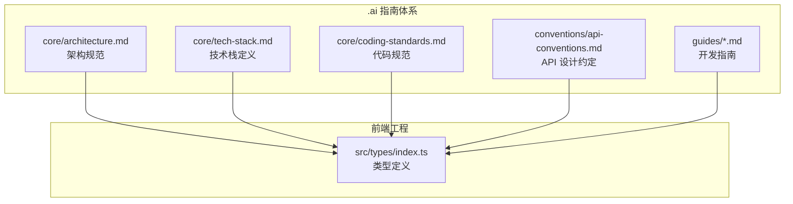
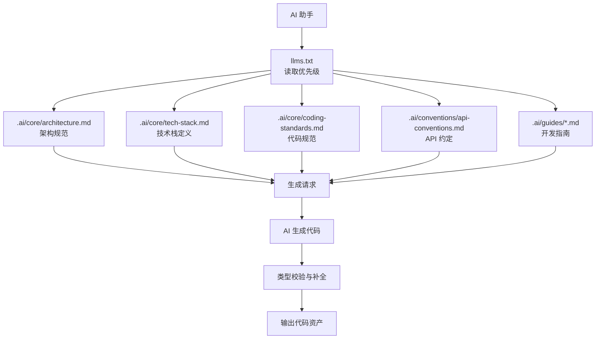
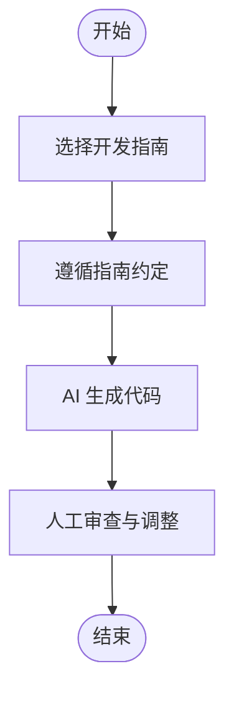
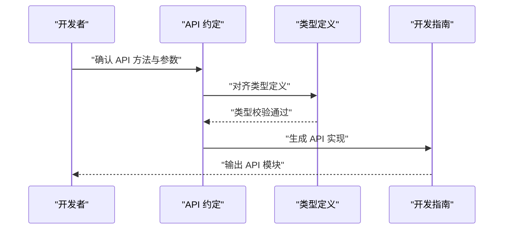
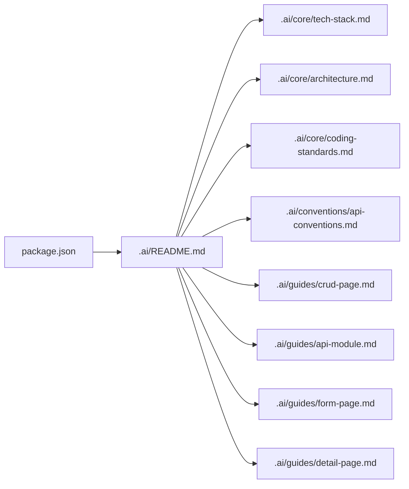
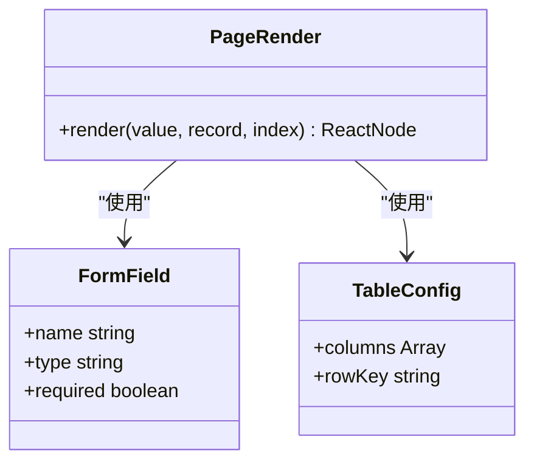
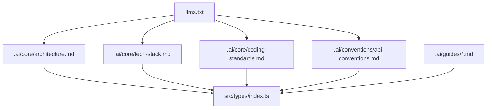

# 模板系统

<cite>
**本文引用的文件**
- [.ai/README.md](file://.ai/README.md)
- [.ai/guides/crud-page.md](file://.ai/guides/crud-page.md)
- [.ai/guides/api-module.md](file://.ai/guides/api-module.md)
- [.ai/guides/form-page.md](file://.ai/guides/form-page.md)
- [.ai/guides/detail-page.md](file://.ai/guides/detail-page.md)
- [.ai/conventions/api-conventions.md](file://.ai/conventions/api-conventions.md)
- [.ai/core/architecture.md](file://.ai/core/architecture.md)
- [.ai/core/tech-stack.md](file://.ai/core/tech-stack.md)
- [.ai/core/coding-standards.md](file://.ai/core/coding-standards.md)
- [llms.txt](file://llms.txt)
- [src/types/index.ts](file://src/types/index.ts)
</cite>

## 更新摘要

**所做更改**

- 模板系统已被新的文档指南系统取代，原有的 .ai/templates 目录被删除
- 新增专门的开发指南文件 (.ai/guides/)，包含 CRUD 页面、API 模块、表单页面、详情页面等指南
- 更新架构概览，反映从模板系统到文档指南系统的转变
- 完全重构模板使用流程，现在基于指南文件而非模板文件
- 移除自我修正规则相关内容，因为不再需要模板生成后的质量保证

## 目录

1. [简介](#简介)
2. [项目结构](#项目结构)
3. [核心组件](#核心组件)
4. [架构概览](#架构概览)
5. [详细组件分析](#详细组件分析)
6. [依赖分析](#依赖分析)
7. [性能考虑](#性能考虑)
8. [故障排除指南](#故障排除指南)
9. [结论](#结论)
10. [附录](#附录)

## 简介

本模板系统现已演进为文档指南系统，面向前端工程的 AI 辅助开发工具。新系统围绕标准化开发指南构建，通过明确的决策点、组件规范和最佳实践，指导 AI 生成符合项目规范的页面、组件、API 模块等代码资产。文档指南系统强调"指南即契约"，通过清晰的开发流程、组件使用说明与输出约定，确保生成结果的一致性与可维护性。

**更新** 系统已完全从模板驱动转向指南驱动，原有的模板库被专门的开发指南文件取代。

## 项目结构

文档指南系统主要分布在 .ai 目录下，包含核心规范、开发约定、指南文件与技术栈说明；同时通过 llms.txt 定义 AI 处理的读取优先级与按需加载策略。核心文件组织如下：

- .ai/core：核心规范（架构、技术栈、代码规范）
- .ai/conventions：开发约定（API 设计、增量开发规范）
- .ai/guides：开发指南（CRUD 页面、API 模块、表单页面、详情页面）
- llms.txt：AI 处理顺序与技术栈摘要
- src/types/index.ts：类型定义，支撑指南生成的类型一致性

**图表来源**

- [.ai/README.md](file://.ai/README.md#L1-L34)
- [.ai/core/architecture.md](file://.ai/core/architecture.md#L1-L257)
- [.ai/core/tech-stack.md](file://.ai/core/tech-stack.md#L1-L90)
- [.ai/core/coding-standards.md](file://.ai/core/coding-standards.md#L1-L351)
- [.ai/conventions/api-conventions.md](file://.ai/conventions/api-conventions.md#L1-L162)
- [.ai/guides/crud-page.md](file://.ai/guides/crud-page.md#L1-L39)
- [src/types/index.ts](file://src/types/index.ts#L1-L101)

**章节来源**

- [.ai/README.md](file://.ai/README.md#L1-L34)
- [.ai/core/architecture.md](file://.ai/core/architecture.md#L1-L257)
- [.ai/core/tech-stack.md](file://.ai/core/tech-stack.md#L1-L90)
- [.ai/core/coding-standards.md](file://.ai/core/coding-standards.md#L1-L351)
- [.ai/conventions/api-conventions.md](file://.ai/conventions/api-conventions.md#L1-L162)
- [.ai/guides/crud-page.md](file://.ai/guides/crud-page.md#L1-L39)
- [src/types/index.ts](file://src/types/index.ts#L1-L101)

## 核心组件

- 核心规范：架构规范、技术栈定义、代码规范，确保生成代码遵循统一风格与最佳实践。
- 开发约定：定义 API 实现、页面组件生成等规范，确保生成代码风格一致。
- 开发指南：提供 CRUD 页面、API 模块、表单页面、详情页面等具体开发指导。
- AI 读取优先级：通过 llms.txt 明确 AI 在处理任务前的读取顺序与按需加载策略。
- 类型支撑：src/types/index.ts 提供类型定义，保障生成代码的类型一致性。

**更新** 移除了模板库组件，新增开发指南组件，作为 AI 开发的主要参考。

**章节来源**

- [.ai/README.md](file://.ai/README.md#L1-L34)
- [.ai/core/architecture.md](file://.ai/core/architecture.md#L1-L257)
- [.ai/core/tech-stack.md](file://.ai/core/tech-stack.md#L1-L90)
- [.ai/core/coding-standards.md](file://.ai/core/coding-standards.md#L1-L351)
- [.ai/conventions/api-conventions.md](file://.ai/conventions/api-conventions.md#L1-L162)
- [.ai/guides/crud-page.md](file://.ai/guides/crud-page.md#L1-L39)
- [src/types/index.ts](file://src/types/index.ts#L1-L101)

## 架构概览

文档指南系统采用"核心规范 + 开发约定 + 开发指南 + 类型"的四层协作架构：

- 核心规范层：以架构、技术栈、代码规范为核心，定义项目的整体约束和标准。
- 开发约定层：以 API 设计、增量开发等约定约束生成行为，确保生成代码遵循统一风格与最佳实践。
- 开发指南层：以具体的开发指南指导 AI 生成流程，涵盖 CRUD 页面、API 模块、表单页面、详情页面等场景。
- 类型层：以类型定义保证生成代码的类型安全与可维护性。

**图表来源**

- [llms.txt](file://llms.txt#L1-L39)
- [.ai/README.md](file://.ai/README.md#L1-L34)
- [.ai/core/architecture.md](file://.ai/core/architecture.md#L1-L257)
- [.ai/core/tech-stack.md](file://.ai/core/tech-stack.md#L1-L90)
- [.ai/core/coding-standards.md](file://.ai/core/coding-standards.md#L1-L351)
- [.ai/conventions/api-conventions.md](file://.ai/conventions/api-conventions.md#L1-L162)
- [.ai/guides/crud-page.md](file://.ai/guides/crud-page.md#L1-L39)
- [src/types/index.ts](file://src/types/index.ts#L1-L101)

## 详细组件分析

### 开发指南与使用流程

- 指南类型与用途
  - CRUD 页面指南：用于生成列表、查询、分页等页面骨架，提供标准组件使用和文件结构。
  - API 模块指南：用于生成 API 模块，包含类型定义、API 对象模式和命名约定。
  - 表单页面指南：用于生成业务表单页面，提供 SForm 组件使用和字段配置。
  - 详情页面指南：用于生成详情展示页面，提供 SDetail 组件使用和布局配置。
- 使用流程
  1. 选择指南：根据需求从开发指南中挑选合适指南。
  2. 遵循约定：按照指南中的决策点、组件规范和最佳实践进行开发。
  3. 生成代码：将指南内容提供给 AI，触发生成流程。
  4. 审查调整：人工审查并微调生成结果，确保符合预期。

**章节来源**

- [.ai/guides/crud-page.md](file://.ai/guides/crud-page.md#L1-L39)
- [.ai/guides/api-module.md](file://.ai/guides/api-module.md#L1-L46)
- [.ai/guides/form-page.md](file://.ai/guides/form-page.md#L1-L47)
- [.ai/guides/detail-page.md](file://.ai/guides/detail-page.md#L1-L46)

### 开发约定与最佳实践

- API 设计约定：定义了标准的 API 方法集合（如 getList、getById、create、update、delete），并给出基于请求封装的实现模式。
- 页面组件生成约定：推荐使用 @dalydb/sdesign 组件库进行配置式开发，提供 SSearchTable、SForm、SDetail 等组件的使用示例。
- 组件库文档：建议参考 .ai/core/sdesign-docs.md 获取更完整的组件属性定义与使用说明。

**图表来源**

- [.ai/conventions/api-conventions.md](file://.ai/conventions/api-conventions.md#L1-L162)
- [src/types/index.ts](file://src/types/index.ts#L1-L101)

**章节来源**

- [.ai/conventions/api-conventions.md](file://.ai/conventions/api-conventions.md#L1-L162)
- [src/types/index.ts](file://src/types/index.ts#L1-L101)

### AI 读取优先级与集成点

- 强制读取顺序：AI 在处理任何任务前，必须按 package.json → .ai/README.md → .ai/core/tech-stack.md → .ai/core/architecture.md → .ai/core/coding-standards.md 的顺序读取。
- 按需读取：根据任务类型选择相应约定或指南，如 API 开发、增量开发、CRUD 页面、表单页面、详情页面等。
- 技术栈摘要：明确构建工具、框架、UI 库、状态管理、路由等技术栈信息，作为生成决策依据。

**图表来源**

- [llms.txt](file://llms.txt#L1-L39)

**章节来源**

- [llms.txt](file://llms.txt#L1-L39)

### 类型支撑与一致性保障

- 类型定义：src/types/index.ts 提供通用类型定义，覆盖页面渲染、表格列配置、表单字段等场景，确保生成代码具备良好的类型安全。
- 与指南的协同：指南中的组件使用和参数在生成过程中应与类型定义保持一致，避免类型不匹配导致的编译或运行时错误。

**图表来源**

- [src/types/index.ts](file://src/types/index.ts#L1-L101)

**章节来源**

- [src/types/index.ts](file://src/types/index.ts#L1-L101)

## 依赖分析

- 核心规范依赖 llms.txt 中的读取顺序，确保 AI 优先获取项目配置与规范。
- 开发约定依赖类型定义，生成代码需满足类型约束。
- 开发指南依赖核心规范和约定，确保指南内容的有效性。
- 指南与约定之间存在参数与输出路径的耦合关系，需要保持一致性。

**图表来源**

- [llms.txt](file://llms.txt#L1-L39)
- [.ai/README.md](file://.ai/README.md#L1-L34)
- [.ai/core/architecture.md](file://.ai/core/architecture.md#L1-L257)
- [.ai/core/tech-stack.md](file://.ai/core/tech-stack.md#L1-L90)
- [.ai/core/coding-standards.md](file://.ai/core/coding-standards.md#L1-L351)
- [.ai/conventions/api-conventions.md](file://.ai/conventions/api-conventions.md#L1-L162)
- [.ai/guides/crud-page.md](file://.ai/guides/crud-page.md#L1-L39)
- [src/types/index.ts](file://src/types/index.ts#L1-L101)

**章节来源**

- [llms.txt](file://llms.txt#L1-L39)
- [.ai/README.md](file://.ai/README.md#L1-L34)
- [.ai/core/architecture.md](file://.ai/core/architecture.md#L1-L257)
- [.ai/core/tech-stack.md](file://.ai/core/tech-stack.md#L1-L90)
- [.ai/core/coding-standards.md](file://.ai/core/coding-standards.md#L1-L351)
- [.ai/conventions/api-conventions.md](file://.ai/conventions/api-conventions.md#L1-L162)
- [.ai/guides/crud-page.md](file://.ai/guides/crud-page.md#L1-L39)
- [src/types/index.ts](file://src/types/index.ts#L1-L101)

## 性能考虑

- 指南规模控制：开发指南按需使用，避免一次性加载过多指南影响 AI 处理效率。
- 参数完整性：遵循指南时尽量完整，减少后续迭代次数，提高生成效率。
- 类型预检查：在生成前利用类型定义进行预校验，降低生成后修复成本。
- 规范一致性：通过核心规范和约定确保生成代码的一致性，减少后期维护成本。

**更新** 移除了自我修正相关的性能考虑，因为不再需要模板生成后的质量保证。

## 故障排除指南

- 指南参数缺失：检查指南参数是否完整，确保每个决策点都有明确的选择依据。
- 输出路径不符：核对指南中的文件结构与项目架构，确保生成文件放置在正确位置。
- 类型不匹配：对照类型定义修正生成代码，避免编译或运行时错误。
- 约定冲突：当指南与约定冲突时，优先遵循 llms.txt 中的强制读取顺序与约定文件。
- 组件使用错误：检查指南中的组件使用说明，确保正确使用 @dalydb/sdesign 组件库。

**更新** 移除了自我修正相关故障排除指导，因为不再需要模板生成后的质量保证。

**章节来源**

- [.ai/README.md](file://.ai/README.md#L1-L34)
- [.ai/core/architecture.md](file://.ai/core/architecture.md#L1-L257)
- [.ai/core/tech-stack.md](file://.ai/core/tech-stack.md#L1-L90)
- [.ai/core/coding-standards.md](file://.ai/core/coding-standards.md#L1-L351)
- [.ai/conventions/api-conventions.md](file://.ai/conventions/api-conventions.md#L1-L162)
- [.ai/guides/crud-page.md](file://.ai/guides/crud-page.md#L1-L39)
- [src/types/index.ts](file://src/types/index.ts#L1-L101)

## 结论

文档指南系统通过"核心规范 + 开发约定 + 开发指南 + 类型"的协同机制，为 AI 生成提供了清晰的输入、约束与输出边界。系统完全从模板驱动转向指南驱动，通过明确的决策点、组件规范和最佳实践，确保生成代码符合项目规范并在技术层面达到高质量标准。

遵循 llms.txt 的读取顺序与 .ai 目录下的规范，结合 src/types/index.ts 的类型支撑，能够稳定地生成高质量、可维护的前端代码资产。建议在实际使用中严格遵循开发指南的决策点与组件规范，并在生成后进行人工审查与微调，以获得最佳效果。

**更新** 系统已完全从模板系统演进为文档指南系统，显著提升了开发流程的规范性和可维护性。

## 附录

- 开发指南类型与文件结构对照
  - CRUD 页面指南：.ai/guides/crud-page.md
  - API 模块指南：.ai/guides/api-module.md
  - 表单页面指南：.ai/guides/form-page.md
  - 详情页面指南：.ai/guides/detail-page.md
- 核心规范文件
  - 架构规范：.ai/core/architecture.md
  - 技术栈定义：.ai/core/tech-stack.md
  - 代码规范：.ai/core/coding-standards.md
- 技术栈摘要（节选）
  - 构建：RSBuild
  - 框架：React + TypeScript
  - UI 库：@dalydb/sdesign + Ant Design
  - 状态：Zustand + immer
  - 路由：React Router

**章节来源**

- [.ai/guides/crud-page.md](file://.ai/guides/crud-page.md#L1-L39)
- [.ai/guides/api-module.md](file://.ai/guides/api-module.md#L1-L46)
- [.ai/guides/form-page.md](file://.ai/guides/form-page.md#L1-L47)
- [.ai/guides/detail-page.md](file://.ai/guides/detail-page.md#L1-L46)
- [.ai/core/architecture.md](file://.ai/core/architecture.md#L1-L257)
- [.ai/core/tech-stack.md](file://.ai/core/tech-stack.md#L1-L90)
- [.ai/core/coding-standards.md](file://.ai/core/coding-standards.md#L1-L351)
- [llms.txt](file://llms.txt#L1-L39)
