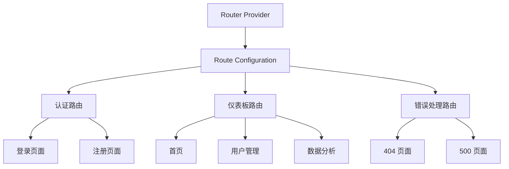
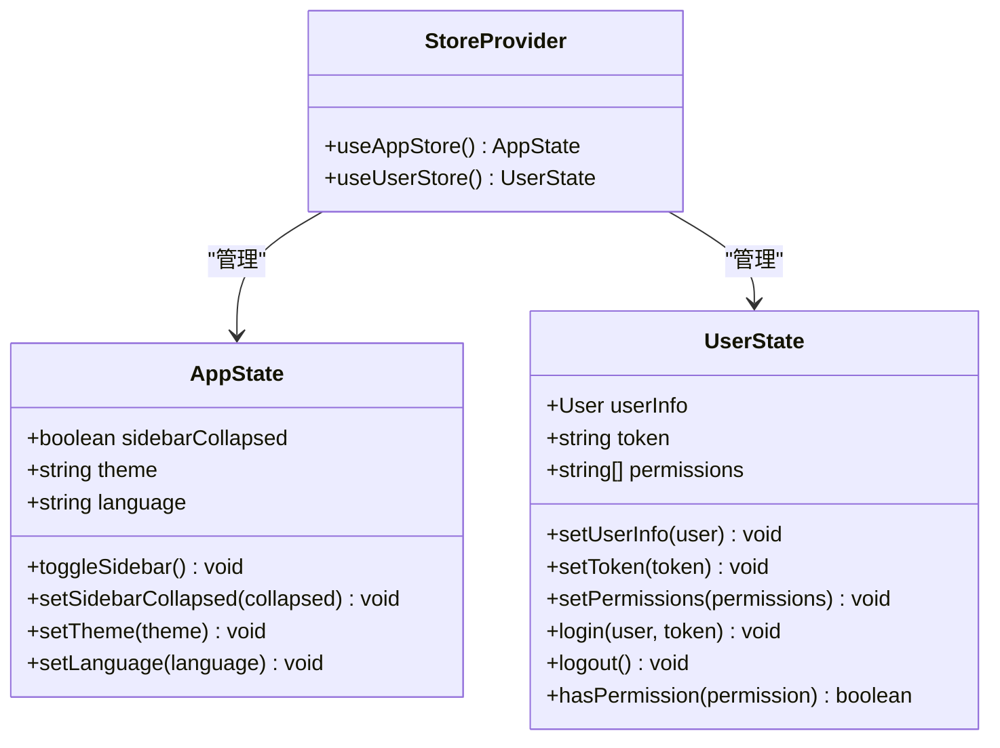
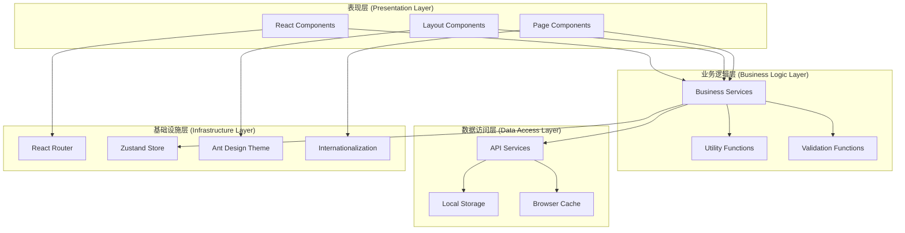
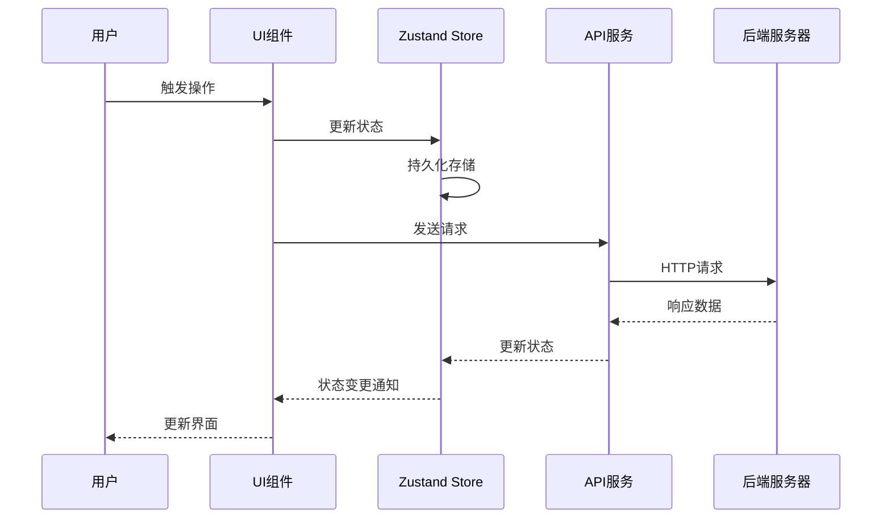
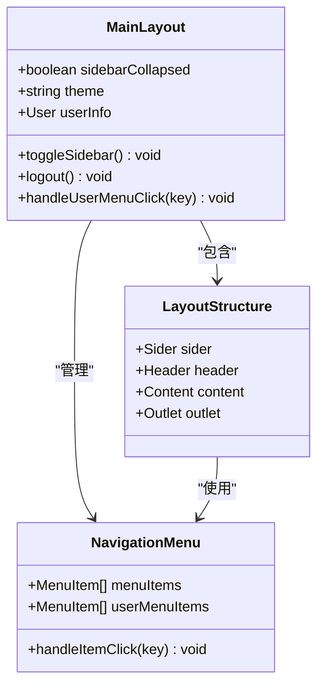
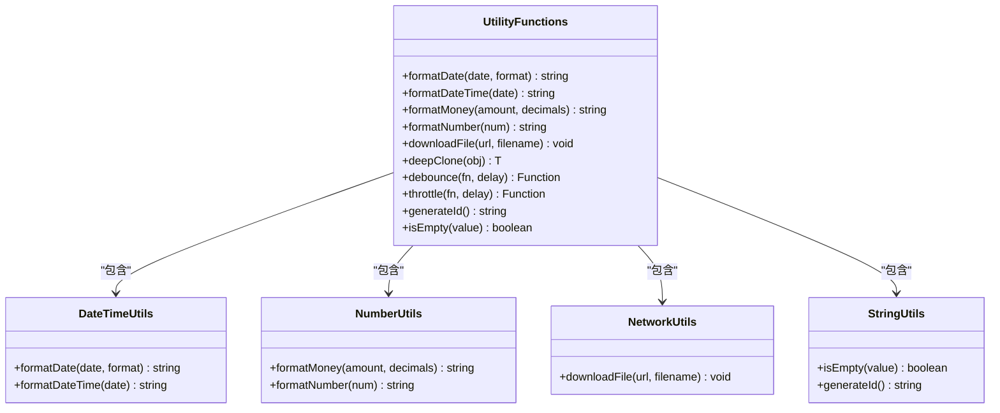
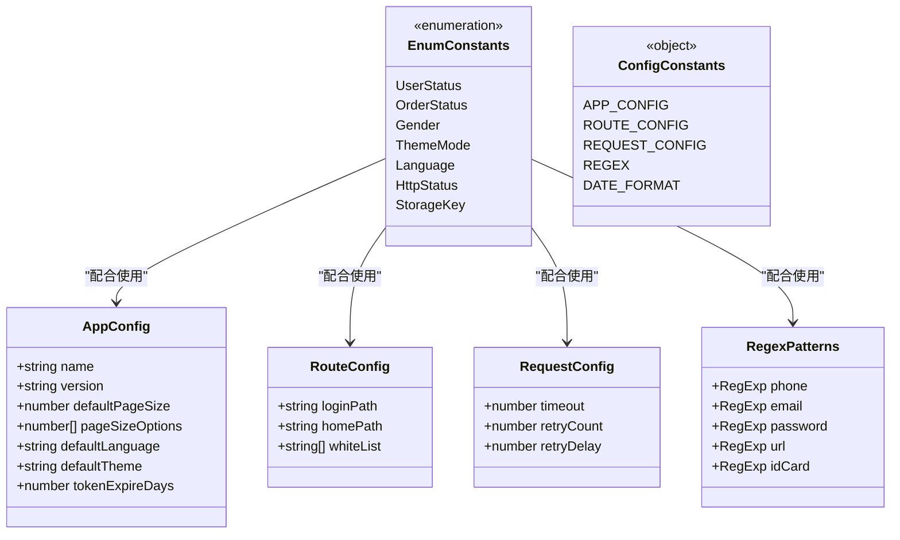
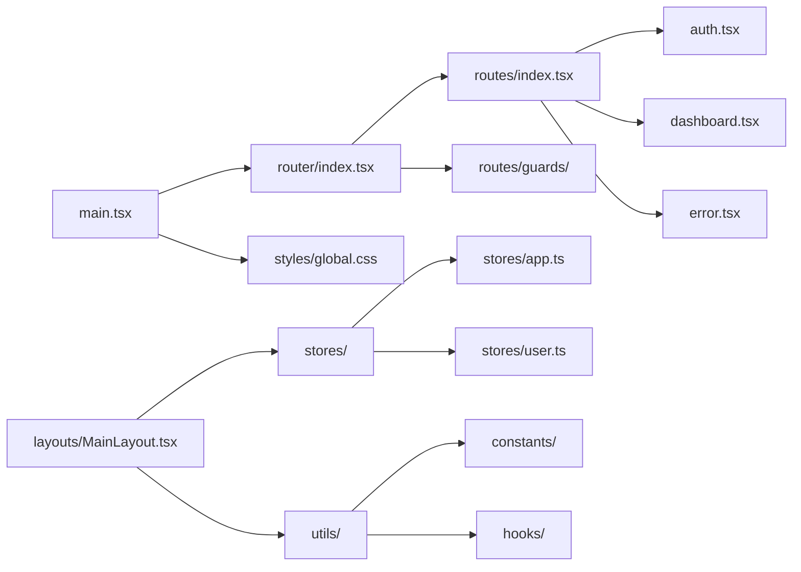

# 模板系统更新

<cite>
**本文档引用的文件**
- [package.json](file://package.json)
- [rsbuild.config.ts](file://rsbuild.config.ts)
- [tsconfig.json](file://tsconfig.json)
- [src/main.tsx](file://src/main.tsx)
- [src/router/index.tsx](file://src/router/index.tsx)
- [src/router/routes/index.tsx](file://src/router/routes/index.tsx)
- [src/layouts/MainLayout.tsx](file://src/layouts/MainLayout.tsx)
- [src/stores/app.ts](file://src/stores/app.ts)
- [src/stores/user.ts](file://src/stores/user.ts)
- [src/constants/enum.ts](file://src/constants/enum.ts)
- [src/constants/config.ts](file://src/constants/config.ts)
- [src/utils/index.ts](file://src/utils/index.ts)
</cite>

## 目录

1. [简介](#简介)
2. [项目结构](#项目结构)
3. [核心组件](#核心组件)
4. [架构概览](#架构概览)
5. [详细组件分析](#详细组件分析)
6. [依赖关系分析](#依赖关系分析)
7. [性能考虑](#性能考虑)
8. [故障排除指南](#故障排除指南)
9. [结论](#结论)

## 简介

这是一个基于 React 18 和 TypeScript 的 AI 管理系统前端模板项目。该模板系统提供了完整的前端开发基础设施，包括现代化的构建工具、状态管理、路由系统、UI 组件库集成以及企业级开发最佳实践。

项目采用模块化的架构设计，集成了 Ant Design 5.x UI 组件库、Zustand 状态管理、React Router DOM 路由系统，以及 Day.js 日期处理等核心依赖。通过精心设计的模板结构，开发者可以快速启动新的 AI 管理系统项目。

## 项目结构

该项目采用清晰的目录组织结构，遵循现代 React 开发的最佳实践：

```mermaid
graph TB
subgraph "项目根目录"
Root[项目根目录]
Package[package.json]
Rsbuild[rsbuild.config.ts]
Tsconfig[tsconfig.json]
end
subgraph "源代码目录 (src)"
Src[src/]
subgraph "API 层"
Api[api/]
end
subgraph "组件层"
Components[components/]
Business[components/business/]
end
subgraph "页面层"
Pages[pages/]
Dashboard[pages/dashboard/]
Error[pages/error/]
Login[pages/login/]
Register[pages/register/]
User[pages/user/]
end
subgraph "布局层"
Layouts[layouts/]
MainLayout[layouts/MainLayout.tsx]
end
subgraph "存储层"
Stores[stores/]
AppStore[stores/app.ts]
UserStore[stores/user.ts]
end
subgraph "路由器"
Router[router/]
Routes[routes/]
Guards[routes/guards/]
RouteIndex[routes/index.tsx]
end
subgraph "插件层"
Plugins[plugins/]
Request[plugins/request/]
end
subgraph "工具层"
Utils[utils/]
Constants[constants/]
Hooks[hooks/]
end
subgraph "样式层"
Styles[styles/]
GlobalCSS[styles/global.css]
end
end
Root --> Src
Root --> Package
Root --> Rsbuild
Root --> Tsconfig
Src --> Api
Src --> Components
Src --> Pages
Src --> Layouts
Src --> Stores
Src --> Router
Src --> Plugins
Src --> Utils
Src --> Styles
```



**图表来源**

- [package.json:1-86](file://package.json#L1-L86)
- [rsbuild.config.ts:1-30](file://rsbuild.config.ts#L1-L30)
- [tsconfig.json:1-24](file://tsconfig.json#L1-L24)

**章节来源**

- [package.json:1-86](file://package.json#L1-L86)
- [rsbuild.config.ts:1-30](file://rsbuild.config.ts#L1-L30)
- [tsconfig.json:1-24](file://tsconfig.json#L1-L24)

## 核心组件

### 构建配置系统

项目使用 Rsbuild 作为主要的构建工具，提供了现代化的开发体验和高效的构建性能。

**构建配置特点：**

- 支持 React 18 和 TypeScript
- 内置开发服务器和热重载
- 智能代理配置用于 API 开发
- 自动资源前缀处理

### 路由系统

采用 React Router DOM v6 的现代化路由架构，支持嵌套路由和权限控制：



**图表来源**

- [src/router/index.tsx:1-9](file://src/router/index.tsx#L1-L9)
- [src/router/routes/index.tsx:1-31](file://src/router/routes/index.tsx#L1-L31)

### 状态管理系统

使用 Zustand 结合 Immer 中间件实现高效的状态管理，支持持久化存储：



**图表来源**

- [src/stores/app.ts:1-59](file://src/stores/app.ts#L1-L59)
- [src/stores/user.ts:1-76](file://src/stores/user.ts#L1-L76)

**章节来源**

- [src/stores/app.ts:1-59](file://src/stores/app.ts#L1-L59)
- [src/stores/user.ts:1-76](file://src/stores/user.ts#L1-L76)

## 架构概览

### 整体架构设计



**图表来源**

- [src/main.tsx:1-32](file://src/main.tsx#L1-L32)
- [src/layouts/MainLayout.tsx:1-174](file://src/layouts/MainLayout.tsx#L1-L174)

### 数据流架构



**图表来源**

- [src/stores/app.ts:18-58](file://src/stores/app.ts#L18-L58)
- [src/stores/user.ts:21-75](file://src/stores/user.ts#L21-L75)

## 详细组件分析

### 主布局组件 (MainLayout)

主布局组件是整个应用的核心容器，提供了统一的导航结构和用户体验：



**图表来源**

- [src/layouts/MainLayout.tsx:18-174](file://src/layouts/MainLayout.tsx#L18-L174)

**组件特性：**

- 响应式侧边栏导航
- 用户信息下拉菜单
- 实时通知徽章
- 主题切换支持
- 权限控制集成

**章节来源**

- [src/layouts/MainLayout.tsx:1-174](file://src/layouts/MainLayout.tsx#L1-L174)

### 工具函数库

提供了一系列实用的工具函数，支持常见的开发需求：



**图表来源**

- [src/utils/index.ts:1-106](file://src/utils/index.ts#L1-L106)

**功能分类：**

- **日期时间处理**：格式化、转换、计算
- **数值格式化**：货币、数字、百分比
- **网络操作**：文件下载、HTTP 请求
- **算法工具**：防抖、节流、深拷贝
- **字符串处理**：验证、生成、格式化

**章节来源**

- [src/utils/index.ts:1-106](file://src/utils/index.ts#L1-L106)

### 常量配置系统

提供了完整的类型安全配置管理：



**图表来源**

- [src/constants/enum.ts:1-70](file://src/constants/enum.ts#L1-L70)
- [src/constants/config.ts:1-76](file://src/constants/config.ts#L1-L76)

**章节来源**

- [src/constants/enum.ts:1-70](file://src/constants/enum.ts#L1-L70)
- [src/constants/config.ts:1-76](file://src/constants/config.ts#L1-L76)

## 依赖关系分析

### 核心依赖架构

```mermaid
graph TB
subgraph "运行时依赖"
React[react: ^18.3.0]
ReactDOM[react-dom: ^18.3.0]
Router[react-router-dom: ^6.26.0]
Antd[antd: ^5.29.3]
Icons[@ant-design/icons: ^5.4.0]
Zustand[zustand: ^5.0.11]
Axios[axios: ^1.7.0]
Dayjs[dayjs: ^1.11.0]
Immer[immer: ^11.1.4]
Lodash[lodash-es: ^4.17.0]
ChartJS[chart.js: ^4.5.1]
ChartJS2[react-chartjs-2: ^5.3.1]
end
subgraph "开发依赖"
Rsbuild[@rsbuild/core: ^1.7.0]
PluginReact[@rsbuild/plugin-react: ^1.3.0]
Typescript[typescript: ^5.5.0]
ESLint[eslint: ^10.0.3]
Prettier[prettier: ^3.8.1]
Husky[husky: ^9.1.7]
end
subgraph "构建工具"
Rsbuild --> React
Rsbuild --> Typescript
Rsbuild --> PluginReact
end
subgraph "UI组件库"
Antd --> React
Icons --> Antd
end
subgraph "状态管理"
Zustand --> React
Immer --> Zustand
end
subgraph "HTTP客户端"
Axios --> React
end
subgraph "日期处理"
Dayjs --> React
end
subgraph "图表库"
ChartJS --> React
ChartJS2 --> ChartJS
end
```

**图表来源**

- [package.json:31-71](file://package.json#L31-L71)

### 模块导入关系



**图表来源**

- [src/main.tsx:10-12](file://src/main.tsx#L10-L12)
- [src/router/index.tsx:3-6](file://src/router/index.tsx#L3-L6)

**章节来源**

- [package.json:31-71](file://package.json#L31-L71)

## 性能考虑

### 构建优化策略

1. **Tree Shaking 优化**
   - 使用 ES 模块导入语法
   - 避免无用代码打包
   - 动态导入大型依赖

2. **代码分割**
   - 路由级别的懒加载
   - 组件级别的按需加载
   - 第三方库的独立打包

3. **缓存策略**
   - 文件内容哈希命名
   - 浏览器缓存优化
   - CDN 静态资源托管

### 运行时性能优化

1. **状态管理优化**
   - Zustand 的轻量级状态管理
   - Immer 中间件的不可变更新
   - 持久化存储的智能选择

2. **渲染性能**
   - React.memo 组件优化
   - useCallback 和 useMemo 缓存
   - 虚拟滚动列表处理

3. **网络性能**
   - axios 请求拦截器
   - 重试机制和超时控制
   - 缓存策略实现

## 故障排除指南

### 常见问题诊断

**构建问题**

- 确认 Node.js 版本满足要求 (>=18.0.0)
- 检查 pnpm 包管理器安装
- 验证 TypeScript 配置正确性

**路由问题**

- 检查路由配置中的路径映射
- 验证权限守卫的实现
- 确认嵌套路由的正确嵌套

**状态管理问题**

- 检查 Zustand store 的初始化
- 验证持久化配置的键名
- 确认状态更新的原子性

**样式问题**

- 检查 Ant Design 主题配置
- 验证 CSS 变量的定义
- 确认响应式断点的设置

### 调试技巧

1. **开发工具使用**
   - React DevTools 检查组件树
   - Redux DevTools 调试状态
   - Network 面板分析请求

2. **日志记录**
   - 在关键位置添加 console.log
   - 使用调试断点跟踪执行流程
   - 监控性能指标

3. **错误边界**
   - 实现 React 错误边界
   - 捕获和报告未处理异常
   - 提供友好的错误提示

**章节来源**

- [package.json:73-75](file://package.json#L73-L75)
- [rsbuild.config.ts:11-22](file://rsbuild.config.ts#L11-L22)

## 结论

这个 AI 管理系统模板系统提供了一个完整、现代化的前端开发基础框架。通过精心设计的架构和丰富的工具集，开发者可以快速构建高质量的企业级应用。

**主要优势：**

- 现代化的技术栈和开发体验
- 完善的类型安全支持
- 高度可定制的 UI 组件库
- 高效的状态管理和路由系统
- 企业级的安全和性能考虑

**适用场景：**

- AI 管理系统的前端开发
- 企业级后台管理平台
- 数据可视化和分析应用
- 多租户管理平台

通过遵循模板的设计原则和最佳实践，开发者可以在此基础上快速扩展功能，满足各种复杂的业务需求。
