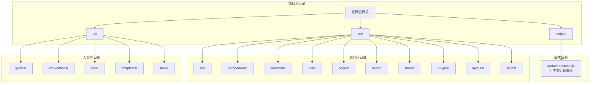
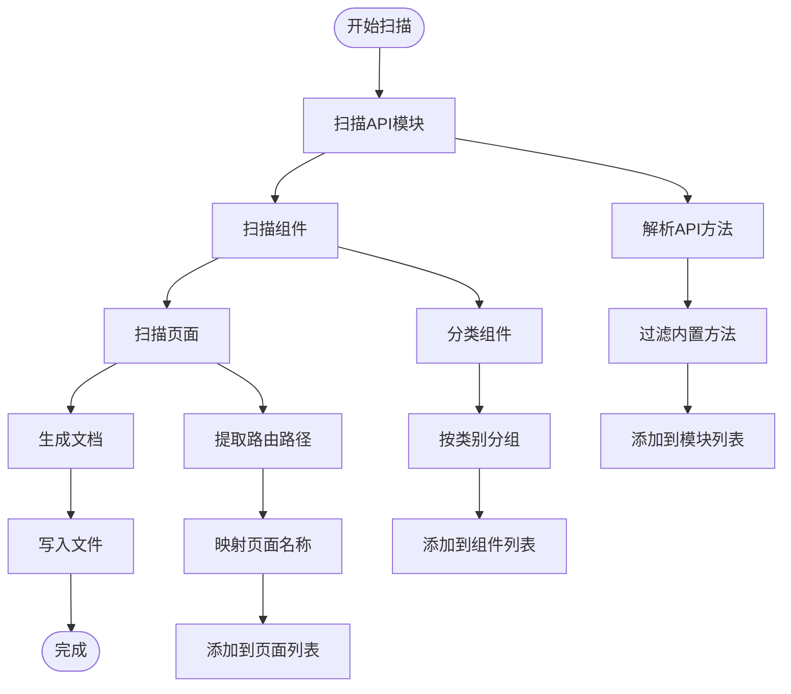
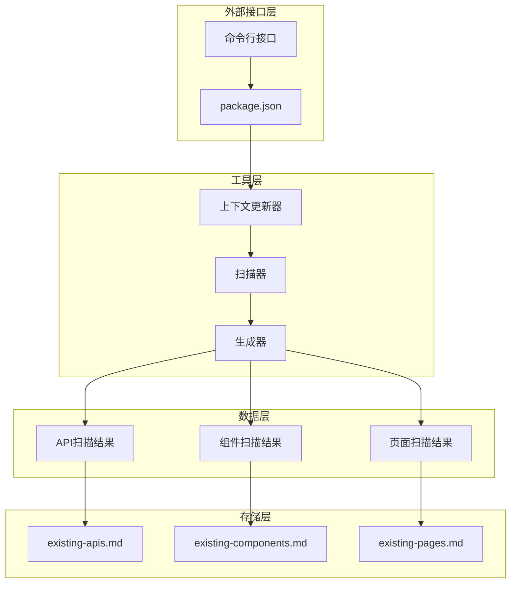
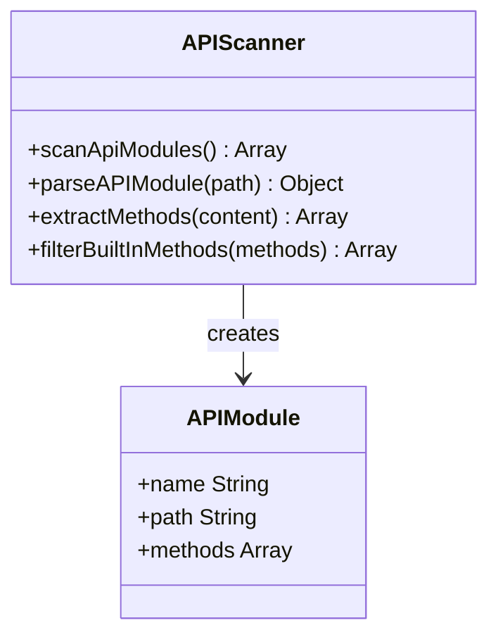
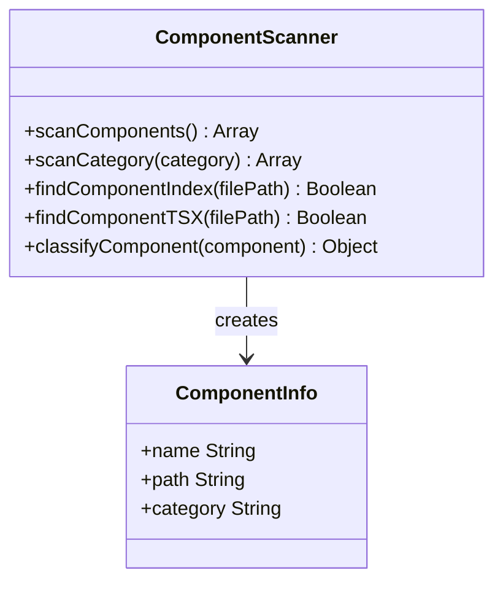
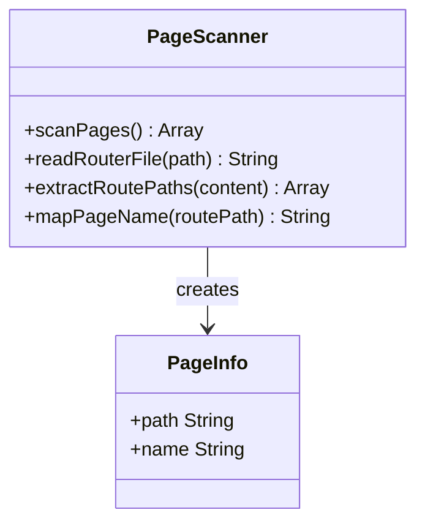
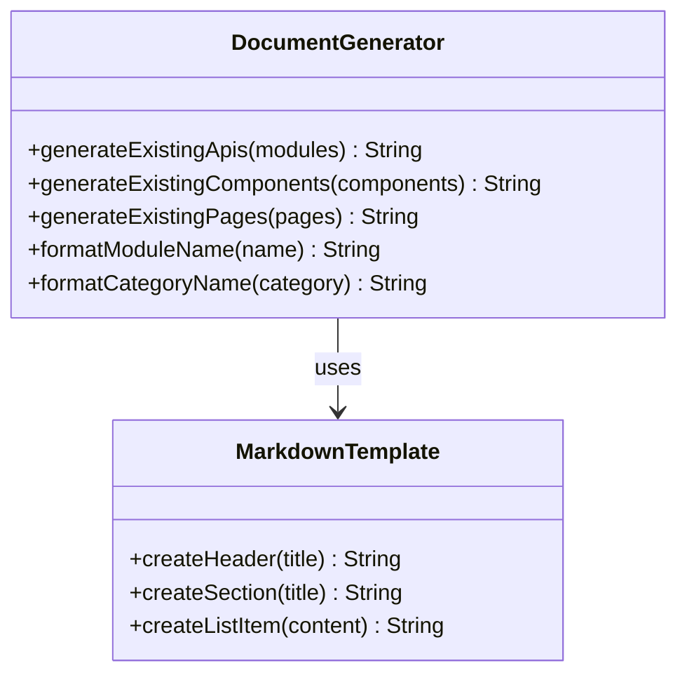

# 组件库文档同步工具

<cite>
**本文档引用的文件**
- [package.json](file://package.json)
- [update-context.cjs](file://scripts/update-context.cjs)
- [AGENTS.md](file://AGENTS.md)
- [main.tsx](file://src/main.tsx)
- [router/index.tsx](file://src/router/index.tsx)
- [constants/index.ts](file://src/constants/index.ts)
- [constants/config.ts](file://src/constants/config.ts)
- [constants/enum.ts](file://src/constants/enum.ts)
- [utils/index.ts](file://src/utils/index.ts)
- [hooks/index.ts](file://src/hooks/index.ts)
- [layouts/index.ts](file://src/layouts/index.ts)
- [plugins/index.ts](file://src/plugins/index.ts)
</cite>

## 目录

1. [简介](#简介)
2. [项目结构](#项目结构)
3. [核心组件](#核心组件)
4. [架构概览](#架构概览)
5. [详细组件分析](#详细组件分析)
6. [依赖分析](#依赖分析)
7. [性能考虑](#性能考虑)
8. [故障排除指南](#故障排除指南)
9. [结论](#结论)

## 简介

组件库文档同步工具是一个专门为AI前端应用设计的自动化工具集，旨在维护和同步组件库文档与实际代码结构的一致性。该工具通过扫描项目中的API模块、组件和页面，自动生成对应的文档清单，并提供统一的项目上下文信息。

该项目基于React 18 + TypeScript 5 + @dalydb/sdesign + Zustand + Rsbuild技术栈构建，采用严格的组件使用约束和开发规范，确保代码质量和一致性。

## 项目结构

项目采用模块化的组织方式，主要分为以下几个核心部分：



**图表来源**

- [package.json:1-86](file://package.json#L1-L86)
- [update-context.cjs:1-205](file://scripts/update-context.cjs#L1-L205)

**章节来源**

- [package.json:1-86](file://package.json#L1-L86)
- [AGENTS.md:42-60](file://AGENTS.md#L42-L60)

## 核心组件

### 上下文更新器 (Context Updater)

上下文更新器是整个系统的核心组件，负责扫描项目结构并生成相应的文档清单。它包含以下主要功能：

- **API模块扫描**：自动发现和解析API模块
- **组件扫描**：识别布局、业务和通用组件
- **页面扫描**：提取路由配置中的页面信息
- **文档生成**：创建结构化的Markdown文档



**图表来源**

- [update-context.cjs:15-49](file://scripts/update-context.cjs#L15-L49)
- [update-context.cjs:51-86](file://scripts/update-context.cjs#L51-L86)
- [update-context.cjs:88-114](file://scripts/update-context.cjs#L88-L114)

### 项目配置管理

项目配置管理系统提供了统一的应用配置、路由配置和请求配置，确保整个应用的一致性和可维护性。

**章节来源**

- [update-context.cjs:168-205](file://scripts/update-context.cjs#L168-L205)
- [constants/config.ts:1-76](file://src/constants/config.ts#L1-L76)

## 架构概览

系统采用分层架构设计，各组件之间通过清晰的接口进行交互：



**图表来源**

- [package.json:6-21](file://package.json#L6-L21)
- [update-context.cjs:168-205](file://scripts/update-context.cjs#L168-L205)

## 详细组件分析

### API模块扫描器

API模块扫描器负责发现和解析项目中的API模块，自动提取模块名称、路径和可用方法。



**图表来源**

- [update-context.cjs:15-49](file://scripts/update-context.cjs#L15-L49)

### 组件扫描器

组件扫描器识别项目中的各种组件，包括布局组件、业务组件和通用组件，并按类别进行分组。



**图表来源**

- [update-context.cjs:51-86](file://scripts/update-context.cjs#L51-L86)

### 页面扫描器

页面扫描器从路由配置中提取页面信息，包括路由路径和对应的页面名称。



**图表来源**

- [update-context.cjs:88-114](file://scripts/update-context.cjs#L88-L114)

### 文档生成器

文档生成器将扫描结果转换为结构化的Markdown文档，便于AI助手理解和使用。



**图表来源**

- [update-context.cjs:116-166](file://scripts/update-context.cjs#L116-L166)

**章节来源**

- [update-context.cjs:15-166](file://scripts/update-context.cjs#L15-L166)

## 依赖分析

系统依赖关系相对简单，主要依赖于Node.js标准库和项目自身的结构：

```mermaid
graph LR
subgraph "系统依赖"
FS[fs模块]
Path[path模块]
Console[console对象]
end
subgraph "项目内部依赖"
API[API模块]
Components[组件]
Pages[页面]
Constants[常量]
Utils[工具函数]
end
subgraph "外部依赖"
Antd[antd ^5.29.3]
Sdesign[@dalydb/sdesign ^1.3.3]
React[react ^18.3.0]
Zustand[zustand ^5.0.11]
Axios[axios ^1.7.0]
end
ContextUpdater[上下文更新器] --> FS
ContextUpdater --> Path
ContextUpdater --> API
ContextUpdater --> Components
ContextUpdater --> Pages
MainApp[主应用] --> Antd
MainApp --> React
MainApp --> Zustand
API --> Axios
Components --> Sdesign
Components --> Antd
```

**图表来源**

- [package.json:31-47](file://package.json#L31-L47)
- [update-context.cjs:1-3](file://scripts/update-context.cjs#L1-L3)

**章节来源**

- [package.json:31-86](file://package.json#L31-L86)

## 性能考虑

由于这是一个开发工具而非生产应用，性能要求相对较低。主要的性能考量包括：

- **文件系统操作**：使用同步文件操作以确保数据完整性
- **正则表达式匹配**：优化API方法提取的正则表达式
- **内存使用**：避免同时加载大量文件到内存中
- **I/O操作**：减少不必要的文件读写操作

## 故障排除指南

### 常见问题及解决方案

1. **找不到API模块**
   - 检查API目录结构是否符合约定
   - 确认每个模块都有index.ts文件

2. **组件扫描失败**
   - 验证组件目录结构
   - 确保组件文件命名规范

3. **路由文件不存在**
   - 检查router/index.tsx文件是否存在
   - 确认路由配置正确

4. **权限问题**
   - 确保有文件写入权限
   - 检查.ai/context目录的访问权限

**章节来源**

- [update-context.cjs:168-205](file://scripts/update-context.cjs#L168-L205)

## 结论

组件库文档同步工具为AI前端应用提供了一个完整的自动化解决方案，通过智能扫描和文档生成，确保项目结构与文档保持同步。该工具的设计充分考虑了项目的模块化特点和严格约束，为开发者提供了一个可靠的上下文管理工具。

工具的主要优势包括：

- 自动化程度高，减少手动维护工作
- 结构化输出，便于AI助手理解和使用
- 符合项目的开发规范和约束
- 轻量级设计，易于集成和维护

通过持续使用该工具，可以有效提升开发效率，确保项目文档的准确性和时效性。
