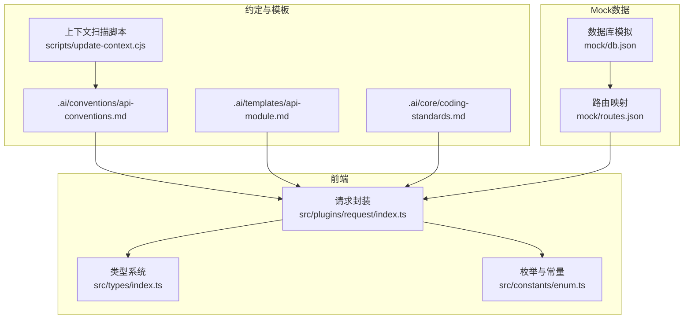
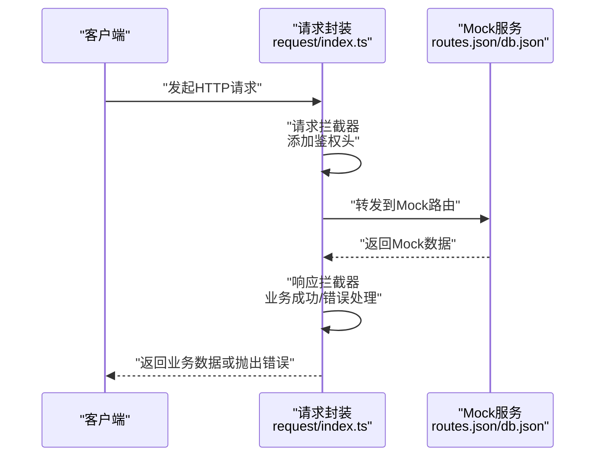
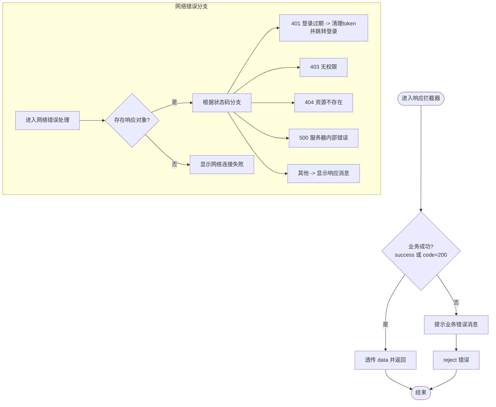
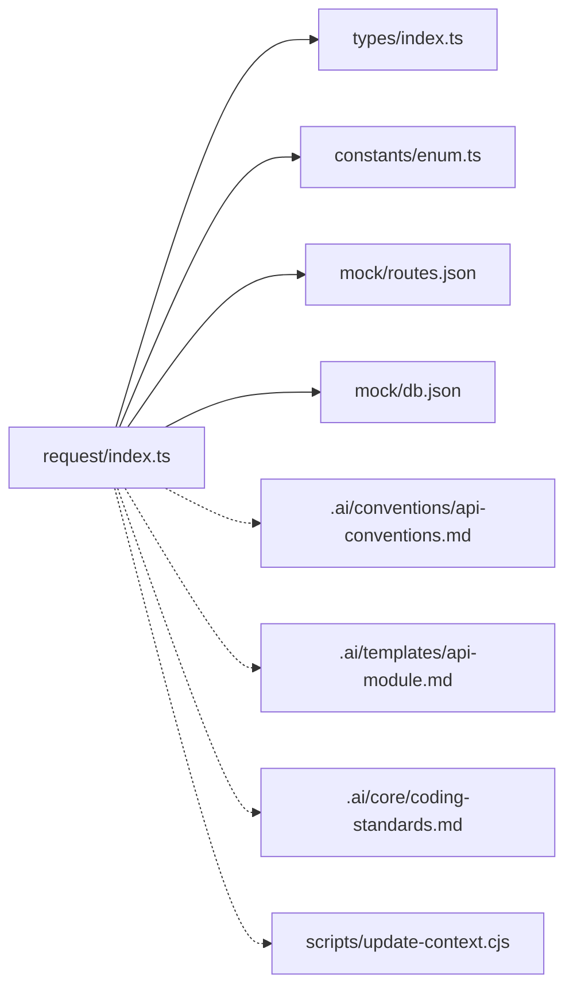

# API接口设计

<cite>
**本文引用的文件**
- [src/plugins/request/index.ts](file://src/plugins/request/index.ts)
- [src/types/index.ts](file://src/types/index.ts)
- [src/constants/enum.ts](file://src/constants/enum.ts)
- [mock/db.json](file://mock/db.json)
- [mock/routes.json](file://mock/routes.json)
- [.ai/conventions/api-conventions.md](file://.ai/conventions/api-conventions.md)
- [.ai/templates/api-module.md](file://.ai/templates/api-module.md)
- [.ai/core/coding-standards.md](file://.ai/core/coding-standards.md)
- [scripts/update-context.cjs](file://scripts/update-context.cjs)
</cite>

## 目录

1. [简介](#简介)
2. [项目结构](#项目结构)
3. [核心组件](#核心组件)
4. [架构总览](#架构总览)
5. [详细组件分析](#详细组件分析)
6. [依赖关系分析](#依赖关系分析)
7. [性能考量](#性能考量)
8. [故障排查指南](#故障排查指南)
9. [结论](#结论)
10. [附录](#附录)

## 简介

本文件面向开发者与产品团队，系统化梳理本项目的API接口设计原则、规范与实践，覆盖RESTful设计要点、URL命名约定、HTTP方法使用、状态码标准、响应格式、错误处理、模块化组织方式、版本管理与向后兼容策略，并结合现有Mock数据与约定模板给出可落地的实施建议与最佳实践。

## 项目结构

项目采用前后端一体化的前端工程化方案，API层通过统一请求封装与类型系统协同工作；Mock数据用于本地联调与演示，约定模板指导新模块的生成与一致性维护。

**图表来源**

- [src/plugins/request/index.ts](file://src/plugins/request/index.ts#L1-L114)
- [src/types/index.ts](file://src/types/index.ts#L87-L101)
- [src/constants/enum.ts](file://src/constants/enum.ts#L48-L58)
- [mock/db.json](file://mock/db.json#L1-L140)
- [mock/routes.json](file://mock/routes.json#L1-L11)
- [.ai/conventions/api-conventions.md](file://.ai/conventions/api-conventions.md#L1-L69)
- [.ai/templates/api-module.md](file://.ai/templates/api-module.md#L1-L91)
- [.ai/core/coding-standards.md](file://.ai/core/coding-standards.md#L122-L195)
- [scripts/update-context.cjs](file://scripts/update-context.cjs#L1-L49)

**章节来源**

- [src/plugins/request/index.ts](file://src/plugins/request/index.ts#L1-L114)
- [src/types/index.ts](file://src/types/index.ts#L1-L101)
- [src/constants/enum.ts](file://src/constants/enum.ts#L1-L70)
- [mock/db.json](file://mock/db.json#L1-L140)
- [mock/routes.json](file://mock/routes.json#L1-L11)
- [.ai/conventions/api-conventions.md](file://.ai/conventions/api-conventions.md#L1-L69)
- [.ai/templates/api-module.md](file://.ai/templates/api-module.md#L1-L91)
- [.ai/core/coding-standards.md](file://.ai/core/coding-standards.md#L122-L195)
- [scripts/update-context.cjs](file://scripts/update-context.cjs#L1-L49)

## 核心组件

- 统一请求封装：基于Axios的实例化与拦截器，统一路由、鉴权、错误提示与业务成功判定。
- 类型系统：统一的响应结构、分页模型、通用表单/表格字段配置等。
- 枚举与常量：HTTP状态码、存储键名等标准化值。
- Mock数据与路由：提供本地联调所需的基础实体与路由映射。

**章节来源**

- [src/plugins/request/index.ts](file://src/plugins/request/index.ts#L11-L114)
- [src/types/index.ts](file://src/types/index.ts#L3-L101)
- [src/constants/enum.ts](file://src/constants/enum.ts#L48-L58)
- [mock/db.json](file://mock/db.json#L1-L140)
- [mock/routes.json](file://mock/routes.json#L1-L11)

## 架构总览

下图展示从前端请求到Mock服务的整体流程，以及与类型系统的交互。

**图表来源**

- [src/plugins/request/index.ts](file://src/plugins/request/index.ts#L19-L76)
- [mock/routes.json](file://mock/routes.json#L1-L11)
- [mock/db.json](file://mock/db.json#L1-L140)

## 详细组件分析

### 统一请求封装（request）

- 功能职责
  - 实例化Axios，设置超时与默认头。
  - 请求拦截器：从本地存储读取令牌并注入Authorization头。
  - 响应拦截器：识别业务成功/失败，统一错误提示与异常抛出；对常见HTTP状态码做UI提示与跳转处理。
  - 方法封装：提供get/post/put/delete/patch的Promise包装。
- 关键行为
  - 业务成功：当success为真或code为200时，透传data。
  - 业务失败：弹出消息并reject错误。
  - 网络错误：区分401/403/404/500等状态码进行不同提示与登出处理。
- 设计要点
  - 将“业务错误”与“网络错误”分离，避免UI误判。
  - 通过泛型约束保证调用方获得期望的数据类型。

**图表来源**

- [src/plugins/request/index.ts](file://src/plugins/request/index.ts#L34-L76)

**章节来源**

- [src/plugins/request/index.ts](file://src/plugins/request/index.ts#L1-L114)

### 类型系统（types）

- 统一响应结构
  - 字段：code、data、message、success。
  - 用途：作为所有接口响应的载体，便于拦截器统一处理。
- 分页模型
  - 字段：list、total、page、pageSize。
  - 用途：列表查询的标准返回结构。
- 通用表单/表格配置
  - 表单字段配置：name、label、type、required、options等。
  - 表格列配置：title、dataIndex、render、sorter、filters等。
- 用户模型
  - 字段：id、username、nickname、email、phone、avatar、status、createTime、updateTime。
  - 状态：枚举化，便于前后端一致校验。

**章节来源**

- [src/types/index.ts](file://src/types/index.ts#L3-L101)

### 枚举与常量（constants）

- HTTP状态码枚举
  - 包含200、201、400、401、403、404、500等常用状态。
- 存储键名枚举
  - 包含token、user_info、theme、language等键名，统一本地存储键名。
- 用户状态枚举
  - active、inactive、disabled等，配合用户模型使用。

**章节来源**

- [src/constants/enum.ts](file://src/constants/enum.ts#L48-L69)

### Mock数据与路由（mock）

- 数据模型
  - users：用户列表，包含基础信息与状态。
  - posts：文章列表，包含标题、内容、作者、状态、分类、标签、浏览数等。
  - categories：分类列表，包含名称、描述、排序、状态。
  - projects：项目列表，包含名称、编码、描述、状态、优先级、负责人、时间范围、预算、进度、标签等。
- 路由映射
  - 提供/auth/_、/users/_、/posts/*、/categories/*等路径映射，便于本地联调。

**章节来源**

- [mock/db.json](file://mock/db.json#L1-L140)
- [mock/routes.json](file://mock/routes.json#L1-L11)

### 约定与模板（.ai）

- API约定
  - 接口定义格式：模块名、中文名、基础路径、接口方法、查询参数、URL参数、请求体、响应类型等。
  - 生成规范：文件结构、JSDoc注释、类型完整、统一使用request封装。
- 模板
  - API模块模板：types.ts与index.ts的生成模板，确保一致性。
- 编码规范
  - 模块组织：按业务模块组织，统一导出。
  - API对象模式：以对象形式暴露方法，便于按需引入与测试。
  - 类型定义位置：类型定义放在api/[module]/types.ts，不在API文件中重复定义。

**章节来源**

- [.ai/conventions/api-conventions.md](file://.ai/conventions/api-conventions.md#L1-L69)
- [.ai/templates/api-module.md](file://.ai/templates/api-module.md#L1-L91)
- [.ai/core/coding-standards.md](file://.ai/core/coding-standards.md#L122-L195)

### 上下文扫描脚本（scripts）

- 功能：扫描src/api下的模块，解析API对象的方法集合，辅助生成上下文文档。
- 作用：在新增模块时，自动发现API方法，减少手工维护成本。

**章节来源**

- [scripts/update-context.cjs](file://scripts/update-context.cjs#L15-L49)

## 依赖关系分析

- request依赖
  - 类型系统：使用ApiResponse泛型约束响应结构。
  - 枚举常量：使用HTTP状态码枚举进行错误分支判断。
- Mock数据与路由
  - 为request提供可调用的目标，支撑本地联调。
- 约定与模板
  - 为新模块生成提供规范与模板，降低耦合度，提升一致性。

**图表来源**

- [src/plugins/request/index.ts](file://src/plugins/request/index.ts#L1-L114)
- [src/types/index.ts](file://src/types/index.ts#L87-L101)
- [src/constants/enum.ts](file://src/constants/enum.ts#L48-L58)
- [mock/routes.json](file://mock/routes.json#L1-L11)
- [mock/db.json](file://mock/db.json#L1-L140)
- [.ai/conventions/api-conventions.md](file://.ai/conventions/api-conventions.md#L1-L69)
- [.ai/templates/api-module.md](file://.ai/templates/api-module.md#L1-L91)
- [.ai/core/coding-standards.md](file://.ai/core/coding-standards.md#L122-L195)
- [scripts/update-context.cjs](file://scripts/update-context.cjs#L1-L49)

**章节来源**

- [src/plugins/request/index.ts](file://src/plugins/request/index.ts#L1-L114)
- [src/types/index.ts](file://src/types/index.ts#L87-L101)
- [src/constants/enum.ts](file://src/constants/enum.ts#L48-L58)
- [mock/routes.json](file://mock/routes.json#L1-L11)
- [mock/db.json](file://mock/db.json#L1-L140)
- [.ai/conventions/api-conventions.md](file://.ai/conventions/api-conventions.md#L1-L69)
- [.ai/templates/api-module.md](file://.ai/templates/api-module.md#L1-L91)
- [.ai/core/coding-standards.md](file://.ai/core/coding-standards.md#L122-L195)
- [scripts/update-context.cjs](file://scripts/update-context.cjs#L1-L49)

## 性能考量

- 请求超时与重试
  - 当前实例设置了超时阈值，建议在复杂场景下结合重试策略与退避算法，避免瞬时抖动影响用户体验。
- 响应拦截器的开销
  - 在高频请求场景下，拦截器中的字符串拼接与消息提示可能带来额外开销，建议在批量操作时合并提示或延迟展示。
- 分页与缓存
  - 列表接口建议配合本地缓存与增量更新策略，减少重复请求；分页参数需严格校验，防止过大页码导致内存压力。
- Mock数据规模
  - 随着Mock数据增长，建议拆分模块与懒加载，避免一次性加载过多数据造成首屏卡顿。

## 故障排查指南

- 401 未授权/登录过期
  - 现象：收到401状态码，自动清理token并跳转登录页。
  - 处理：确认本地token是否有效、是否被并发清除、服务端是否下发了新的token。
- 403 禁止访问
  - 现象：权限不足，提示无权限。
  - 处理：核对用户角色与资源权限，确认路由守卫与按钮级权限控制。
- 404 资源不存在
  - 现象：请求路径或资源不存在。
  - 处理：检查URL拼写、路由映射与Mock数据是否存在。
- 500 服务器内部错误
  - 现象：服务端异常。
  - 处理：查看服务端日志，定位异常堆栈；前端做好降级与重试策略。
- 业务错误（非200）
  - 现象：success=false或code!=200，弹出message提示。
  - 处理：根据message与details进行针对性修复；必要时记录埋点以便追踪。

**章节来源**

- [src/plugins/request/index.ts](file://src/plugins/request/index.ts#L48-L76)

## 结论

本项目通过统一请求封装、类型系统与Mock数据，形成了清晰、可扩展且易于维护的API设计与实现框架。遵循约定模板与编码规范，能够确保新模块的一致性与可测试性。建议在后续迭代中逐步引入真实后端、版本化接口与更完善的错误追踪机制，持续提升API的稳定性与可观测性。

## 附录

### RESTful设计原则与规范

- URL命名约定
  - 使用名词复数形式表示资源集合，如/users、/posts、/categories、/projects。
  - 资源层级通过路径体现，如/users/{id}、/posts/{id}。
- HTTP方法使用
  - GET：获取列表或单个资源。
  - POST：创建资源。
  - PUT/PATCH：更新资源。
  - DELETE：删除资源。
- 状态码标准
  - 成功：200/201。
  - 客户端错误：400/401/403/404。
  - 服务器错误：500。
- 响应格式
  - 统一使用统一响应结构，包含code、data、message、success。
  - 列表使用分页模型，包含list、total、page、pageSize。
- 错误处理
  - 业务错误与网络错误分离；对401/403/404/500进行差异化处理与提示。
- 版本管理与向后兼容
  - 建议在URL中加入版本号，如/api/v1/users；对废弃字段与变更提供过渡期与兼容策略，确保客户端平滑升级。

**章节来源**

- [.ai/conventions/api-conventions.md](file://.ai/conventions/api-conventions.md#L6-L39)
- [src/types/index.ts](file://src/types/index.ts#L87-L101)
- [src/constants/enum.ts](file://src/constants/enum.ts#L48-L58)
- [src/plugins/request/index.ts](file://src/plugins/request/index.ts#L34-L76)

### API模块组织与生成

- 模块组织
  - 按业务模块划分，每个模块包含types.ts与index.ts，统一导出。
- 生成规范
  - 使用模板生成types.ts与index.ts，确保JSDoc、类型完整与统一请求封装。
- 上下文扫描
  - 通过脚本扫描API模块，自动生成上下文文档，降低手工维护成本。

**章节来源**

- [.ai/core/coding-standards.md](file://.ai/core/coding-standards.md#L122-L195)
- [.ai/templates/api-module.md](file://.ai/templates/api-module.md#L49-L91)
- [scripts/update-context.cjs](file://scripts/update-context.cjs#L15-L49)

### 示例：用户管理模块（概念性）

- 模块：users
- 基础路径：/api/users
- 接口示例
  - GET /api/users?page&pageSize：获取用户列表（分页）。
  - GET /api/users/{id}：获取用户详情。
  - POST /api/users：创建用户。
  - PUT /api/users/{id}：更新用户。
  - DELETE /api/users/{id}：删除用户。
- 请求参数
  - 分页参数：page、pageSize。
  - 用户表单：username、nickname、email、phone、status等。
- 响应格式
  - 统一响应结构；列表返回分页模型。
- 错误处理
  - 依据拦截器逻辑进行提示与跳转。

**章节来源**

- [.ai/conventions/api-conventions.md](file://.ai/conventions/api-conventions.md#L13-L39)
- [src/types/index.ts](file://src/types/index.ts#L3-L15)
- [src/types/index.ts](file://src/types/index.ts#L17-L28)
- [mock/db.json](file://mock/db.json#L2-L36)
