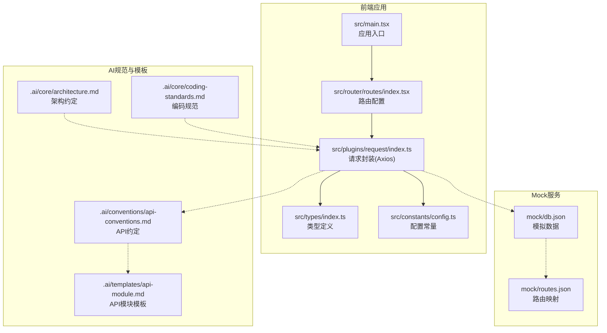
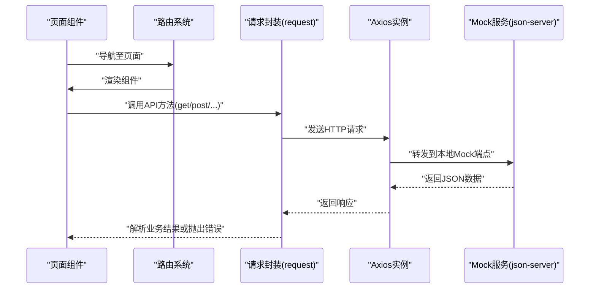
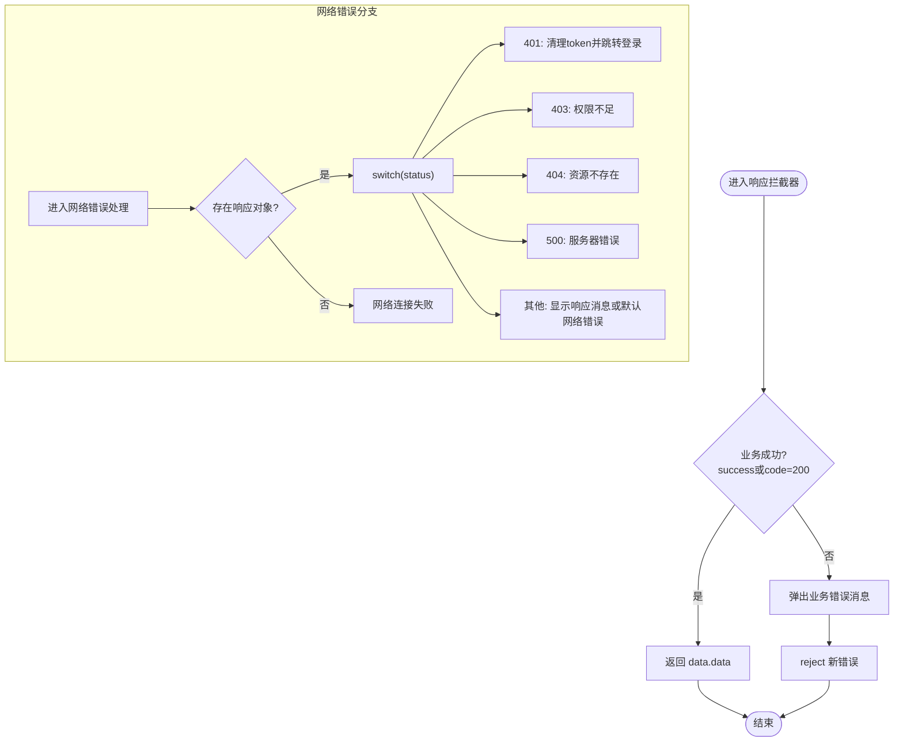
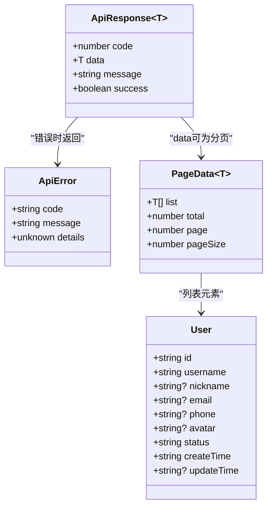
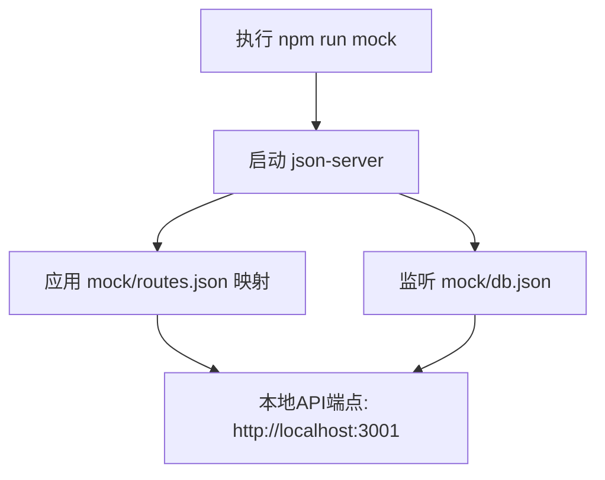
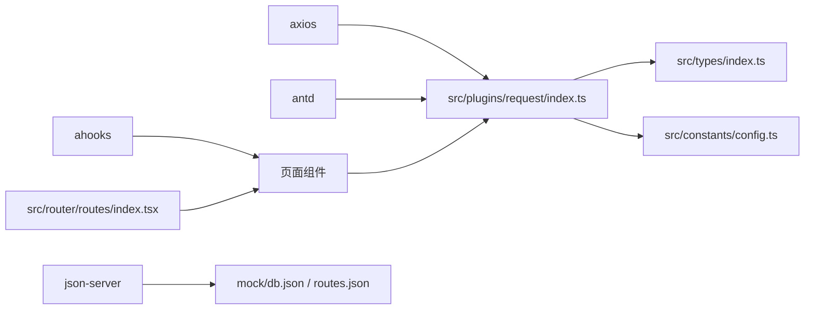

# API集成

<cite>
**本文引用的文件**
- [src/plugins/request/index.ts](file://src/plugins/request/index.ts)
- [src/types/index.ts](file://src/types/index.ts)
- [src/constants/config.ts](file://src/constants/config.ts)
- [mock/db.json](file://mock/db.json)
- [mock/routes.json](file://mock/routes.json)
- [.ai/conventions/api-conventions.md](file://.ai/conventions/api-conventions.md)
- [.ai/templates/api-module.md](file://.ai/templates/api-module.md)
- [.ai/core/architecture.md](file://.ai/core/architecture.md)
- [.ai/core/coding-standards.md](file://.ai/core/coding-standards.md)
- [package.json](file://package.json)
- [src/main.tsx](file://src/main.tsx)
- [src/router/routes/index.tsx](file://src/router/routes/index.tsx)
- [src/pages/dashboard/index.tsx](file://src/pages/dashboard/index.tsx)
</cite>

## 目录

1. [简介](#简介)
2. [项目结构](#项目结构)
3. [核心组件](#核心组件)
4. [架构总览](#架构总览)
5. [详细组件分析](#详细组件分析)
6. [依赖分析](#依赖分析)
7. [性能考虑](#性能考虑)
8. [故障排查指南](#故障排查指南)
9. [结论](#结论)
10. [附录](#附录)

## 简介

本文件面向开发者，系统化梳理本项目的API集成方案，涵盖以下重点：

- HTTP请求封装与Axios配置、请求/响应拦截器、统一错误处理
- API设计规范（REST风格、错误处理策略、数据格式约定）
- Mock数据服务的配置与使用（数据库结构、路由映射、数据模拟）
- API调用最佳实践（请求缓存、错误重试、并发控制等）
- API使用示例与数据模型定义，帮助快速集成后端服务

## 项目结构

围绕API集成的关键目录与文件如下：

- 请求封装：src/plugins/request/index.ts
- 类型定义：src/types/index.ts
- 配置常量：src/constants/config.ts
- Mock服务：mock/db.json、mock/routes.json
- AI生成规范与模板：.ai/conventions/api-conventions.md、.ai/templates/api-module.md、.ai/core/architecture.md、.ai/core/coding-standards.md
- 项目脚本与依赖：package.json
- 应用入口与路由：src/main.tsx、src/router/routes/index.tsx
- 页面示例：src/pages/dashboard/index.tsx

图表来源

- [src/main.tsx](file://src/main.tsx#L1-L32)
- [src/router/routes/index.tsx](file://src/router/routes/index.tsx#L1-L31)
- [src/plugins/request/index.ts](file://src/plugins/request/index.ts#L1-L114)
- [src/types/index.ts](file://src/types/index.ts#L1-L101)
- [src/constants/config.ts](file://src/constants/config.ts#L1-L76)
- [mock/db.json](file://mock/db.json#L1-L140)
- [mock/routes.json](file://mock/routes.json#L1-L11)
- [.ai/conventions/api-conventions.md](file://.ai/conventions/api-conventions.md#L1-L69)
- [.ai/templates/api-module.md](file://.ai/templates/api-module.md#L1-L91)
- [.ai/core/architecture.md](file://.ai/core/architecture.md#L77-L138)
- [.ai/core/coding-standards.md](file://.ai/core/coding-standards.md#L122-L270)

章节来源

- [src/main.tsx](file://src/main.tsx#L1-L32)
- [src/router/routes/index.tsx](file://src/router/routes/index.tsx#L1-L31)
- [src/plugins/request/index.ts](file://src/plugins/request/index.ts#L1-L114)
- [src/types/index.ts](file://src/types/index.ts#L1-L101)
- [src/constants/config.ts](file://src/constants/config.ts#L1-L76)
- [mock/db.json](file://mock/db.json#L1-L140)
- [mock/routes.json](file://mock/routes.json#L1-L11)
- [.ai/conventions/api-conventions.md](file://.ai/conventions/api-conventions.md#L1-L69)
- [.ai/templates/api-module.md](file://.ai/templates/api-module.md#L1-L91)
- [.ai/core/architecture.md](file://.ai/core/architecture.md#L77-L138)
- [.ai/core/coding-standards.md](file://.ai/core/coding-standards.md#L122-L270)

## 核心组件

- Axios实例与拦截器：统一设置超时、默认头、鉴权头；统一封装业务成功/失败判断与错误提示；处理401/403/404/500等状态码。
- 请求方法封装：提供get/post/put/delete/patch方法，统一返回data.data或抛出错误。
- 类型系统：统一的ApiResponse<T>、ApiError、PageData<T>、User等类型，确保前后端契约一致。
- 配置常量：REQUEST_CONFIG提供基础URL占位、超时、重试次数与延迟等配置项。

章节来源

- [src/plugins/request/index.ts](file://src/plugins/request/index.ts#L1-L114)
- [src/types/index.ts](file://src/types/index.ts#L87-L101)
- [src/constants/config.ts](file://src/constants/config.ts#L33-L45)

## 架构总览

下图展示从页面到请求封装再到Mock服务的整体流程：

图表来源

- [src/pages/dashboard/index.tsx](file://src/pages/dashboard/index.tsx#L1-L170)
- [src/router/routes/index.tsx](file://src/router/routes/index.tsx#L1-L31)
- [src/plugins/request/index.ts](file://src/plugins/request/index.ts#L78-L111)
- [mock/db.json](file://mock/db.json#L1-L140)
- [mock/routes.json](file://mock/routes.json#L1-L11)

## 详细组件分析

### 请求封装与Axios配置

- Axios实例创建：设置默认超时、Content-Type为application/json。
- 请求拦截器：从localStorage读取token并在Authorization头中携带Bearer令牌。
- 响应拦截器：
  - 业务成功：当success或code为200时，返回data.data。
  - 业务失败：弹出错误消息并reject错误。
  - 网络错误：根据HTTP状态码给出相应提示；401时清理token并跳转登录页。
- 方法封装：提供get/post/put/delete/patch方法，统一Promise返回。

图表来源

- [src/plugins/request/index.ts](file://src/plugins/request/index.ts#L34-L76)

章节来源

- [src/plugins/request/index.ts](file://src/plugins/request/index.ts#L1-L114)

### API设计规范与数据格式约定

- REST风格：GET/POST/PUT/DELETE对应列表查询、创建、更新、删除。
- 错误处理策略：统一使用ApiResponse<T>，包含code、message、success字段；业务错误与网络错误分别处理。
- 数据格式约定：分页使用PageData<T>，包含list、total、page、pageSize；实体字段遵循明确的类型约束。
- AI生成规范：模块化组织api/[module]/types.ts与index.ts，统一使用request.get/post/put/delete，API对象命名为[Module]Api。

图表来源

- [src/types/index.ts](file://src/types/index.ts#L87-L101)
- [src/types/index.ts](file://src/types/index.ts#L3-L9)
- [src/types/index.ts](file://src/types/index.ts#L17-L28)

章节来源

- [.ai/conventions/api-conventions.md](file://.ai/conventions/api-conventions.md#L6-L39)
- [.ai/templates/api-module.md](file://.ai/templates/api-module.md#L47-L91)
- [.ai/core/architecture.md](file://.ai/core/architecture.md#L100-L138)
- [.ai/core/coding-standards.md](file://.ai/core/coding-standards.md#L122-L181)
- [src/types/index.ts](file://src/types/index.ts#L1-L101)

### Mock数据服务配置与使用

- 数据库结构：users、posts、categories、projects等集合，包含标准字段如id、status、createTime、updateTime等。
- 路由映射：将/api/auth/_、/api/users/_、/api/posts/*、/api/categories/*等路径映射到本地端点。
- 启动命令：通过package.json中的mock脚本启动json-server，监听3001端口。

图表来源

- [package.json](file://package.json#L11-L11)
- [mock/db.json](file://mock/db.json#L1-L140)
- [mock/routes.json](file://mock/routes.json#L1-L11)

章节来源

- [mock/db.json](file://mock/db.json#L1-L140)
- [mock/routes.json](file://mock/routes.json#L1-L11)
- [package.json](file://package.json#L11-L11)

### API调用最佳实践

- 请求缓存：建议在调用层或状态管理层增加缓存策略，避免重复请求相同参数的数据。
- 错误重试：REQUEST_CONFIG提供retryCount与retryDelay，可在调用侧结合重试库或自定义逻辑实现指数退避。
- 并发控制：限制同时请求数量，避免风暴效应；可使用队列或信号量控制并发。
- 统一错误处理：业务错误与网络错误分离处理；401统一登出逻辑；UI层仅处理业务提示。
- 类型安全：严格使用类型定义，避免any；在API层统一返回Promise<T>。

章节来源

- [src/constants/config.ts](file://src/constants/config.ts#L33-L45)
- [src/plugins/request/index.ts](file://src/plugins/request/index.ts#L34-L76)
- [.ai/core/coding-standards.md](file://.ai/core/coding-standards.md#L122-L181)

### API使用示例与数据模型

- 页面示例：仪表盘页面展示了静态数据与UI布局，实际开发中可替换为API调用。
- API模块模板：AI生成API模块时，要求按模块目录组织types.ts与index.ts，统一使用request方法，API对象命名为[Module]Api。
- 数据模型：User、PageData<T>、ApiResponse<T>等类型定义清晰，便于前后端协作。

章节来源

- [src/pages/dashboard/index.tsx](file://src/pages/dashboard/index.tsx#L1-L170)
- [.ai/templates/api-module.md](file://.ai/templates/api-module.md#L47-L91)
- [src/types/index.ts](file://src/types/index.ts#L17-L28)
- [src/types/index.ts](file://src/types/index.ts#L3-L9)
- [src/types/index.ts](file://src/types/index.ts#L87-L93)

## 依赖分析

- 外部依赖：axios用于HTTP请求；antd用于UI与消息提示；ahooks用于请求钩子；json-server用于Mock服务。
- 内部依赖：请求封装依赖类型定义与配置常量；路由系统依赖守卫与布局；页面组件依赖API模块与状态管理。

图表来源

- [package.json](file://package.json#L20-L56)
- [src/plugins/request/index.ts](file://src/plugins/request/index.ts#L1-L114)
- [src/types/index.ts](file://src/types/index.ts#L1-L101)
- [src/constants/config.ts](file://src/constants/config.ts#L1-L76)
- [src/router/routes/index.tsx](file://src/router/routes/index.tsx#L1-L31)
- [mock/db.json](file://mock/db.json#L1-L140)
- [mock/routes.json](file://mock/routes.json#L1-L11)

章节来源

- [package.json](file://package.json#L20-L56)
- [src/plugins/request/index.ts](file://src/plugins/request/index.ts#L1-L114)
- [src/types/index.ts](file://src/types/index.ts#L1-L101)
- [src/constants/config.ts](file://src/constants/config.ts#L1-L76)
- [src/router/routes/index.tsx](file://src/router/routes/index.tsx#L1-L31)
- [mock/db.json](file://mock/db.json#L1-L140)
- [mock/routes.json](file://mock/routes.json#L1-L11)

## 性能考虑

- 超时与重试：合理设置超时与重试策略，避免长时间阻塞；结合指数退避降低后端压力。
- 缓存策略：对只读数据启用内存缓存与失效策略；对高频查询使用去抖/节流。
- 并发控制：限制同时请求数量，优先处理关键路径；对非关键请求降级或合并。
- UI反馈：在请求期间显示加载状态，减少用户等待焦虑；错误时提供明确的重试按钮。

## 故障排查指南

- 401未授权：检查localStorage中的token是否存在与是否过期；确认请求拦截器是否正确注入Authorization头。
- 403禁止访问：确认当前用户权限与接口权限；检查后端权限策略。
- 404资源不存在：核对请求路径与Mock路由映射；确认db.json中是否存在对应数据。
- 500服务器错误：查看后端日志；前端记录错误堆栈并上报。
- 网络连接失败：检查网络连通性与代理设置；确认Mock服务是否正常启动。

章节来源

- [src/plugins/request/index.ts](file://src/plugins/request/index.ts#L48-L76)
- [mock/routes.json](file://mock/routes.json#L1-L11)

## 结论

本项目的API集成以Axios为核心，通过统一的请求封装与类型系统，实现了清晰的业务错误处理与良好的扩展性。配合Mock服务与AI生成规范，能够高效地完成前后端协同开发。建议在实际项目中进一步完善缓存、重试与并发控制策略，并持续沿用类型驱动的API设计与模块化组织方式。

## 附录

- 基础URL占位：REQUEST_CONFIG中保留baseURL占位，便于在不同环境切换。
- 路由白名单：ROUTE_CONFIG提供无需登录的白名单路径，便于权限控制。
- 日期格式：DATE_FORMAT提供常用日期格式常量，统一前端展示。

章节来源

- [src/constants/config.ts](file://src/constants/config.ts#L36-L76)
