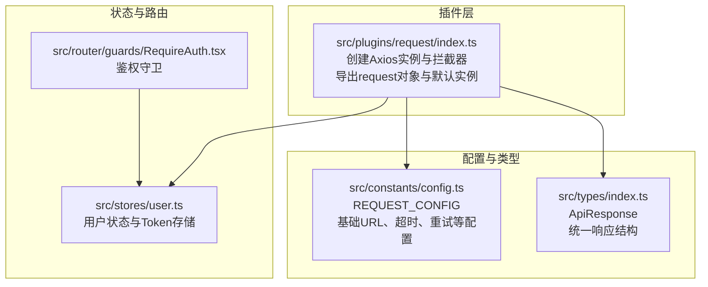
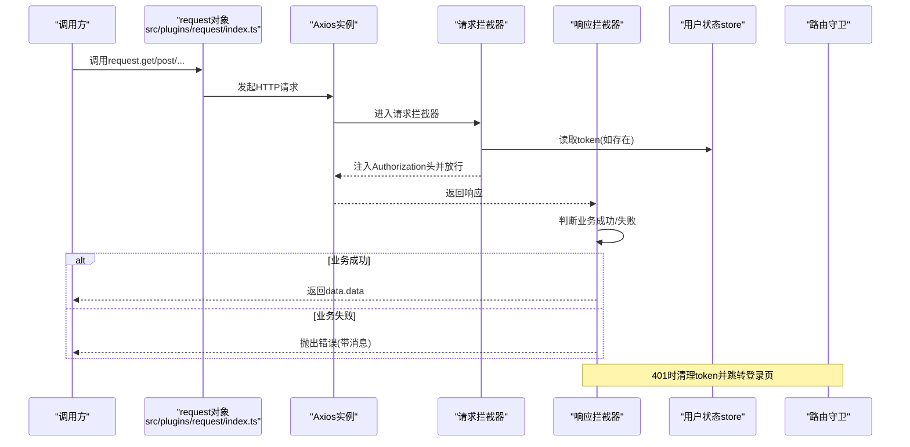
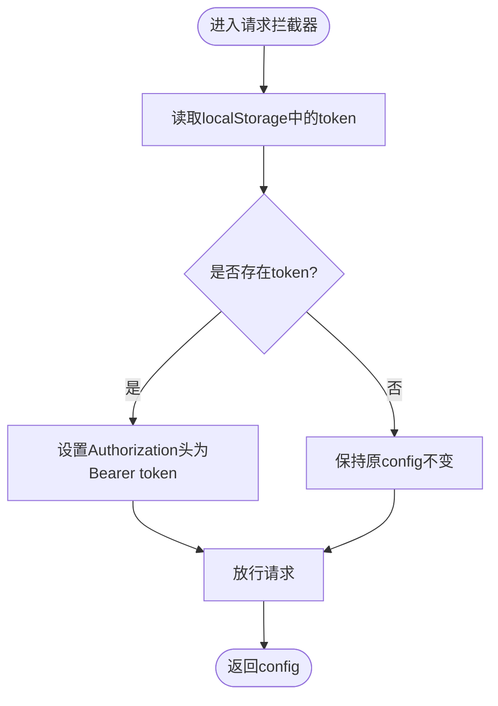
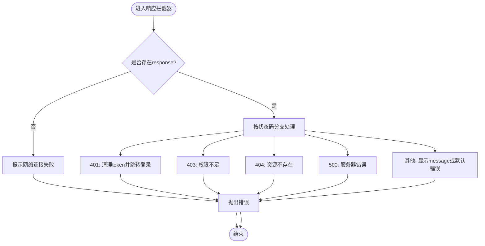
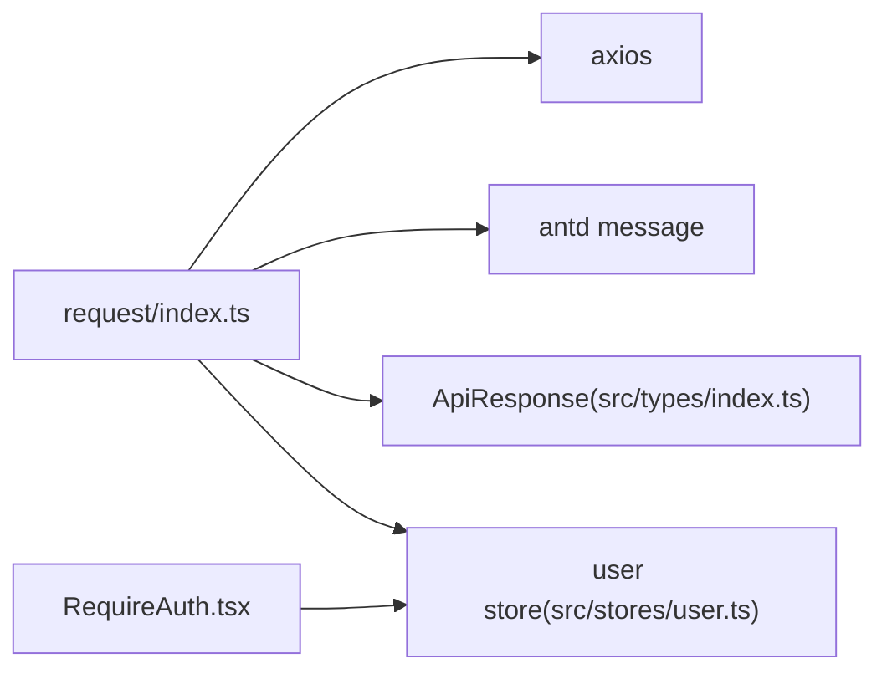

# HTTP请求封装

<cite>
**本文引用的文件**
- [src/plugins/request/index.ts](file://src/plugins/request/index.ts)
- [src/constants/config.ts](file://src/constants/config.ts)
- [src/types/index.ts](file://src/types/index.ts)
- [src/stores/user.ts](file://src/stores/user.ts)
- [src/router/guards/RequireAuth.tsx](file://src/router/guards/RequireAuth.tsx)
- [.ai/templates/api-module.md](file://.ai/templates/api-module.md)
</cite>

## 目录

1. [简介](#简介)
2. [项目结构](#项目结构)
3. [核心组件](#核心组件)
4. [架构总览](#架构总览)
5. [详细组件分析](#详细组件分析)
6. [依赖分析](#依赖分析)
7. [性能考虑](#性能考虑)
8. [故障排查指南](#故障排查指南)
9. [结论](#结论)
10. [附录](#附录)

## 简介

本文件系统性梳理并说明项目中的HTTP请求封装方案，重点覆盖以下方面：

- Axios实例的创建与配置：超时、默认请求头等参数的含义与取值来源
- 请求拦截器的实现机制：Token自动注入、请求预处理、请求头注入逻辑
- 响应拦截器的工作原理：业务状态码处理、错误消息提示、401/403等HTTP状态码的特殊处理
- request对象的方法封装：get、post、put、delete、patch的使用方式与参数配置
- 实际使用示例与最佳实践建议，帮助开发者正确使用封装的HTTP请求方法

## 项目结构

HTTP请求封装位于插件层，通过统一的入口导出供全局使用；同时配合应用常量、类型定义、用户状态管理与路由守卫共同构成完整的请求生命周期。

图表来源

- [src/plugins/request/index.ts](file://src/plugins/request/index.ts#L1-L114)
- [src/constants/config.ts](file://src/constants/config.ts#L33-L45)
- [src/types/index.ts](file://src/types/index.ts#L87-L93)
- [src/stores/user.ts](file://src/stores/user.ts#L1-L76)
- [src/router/guards/RequireAuth.tsx](file://src/router/guards/RequireAuth.tsx#L1-L25)

章节来源

- [src/plugins/request/index.ts](file://src/plugins/request/index.ts#L1-L114)
- [src/constants/config.ts](file://src/constants/config.ts#L33-L45)
- [src/types/index.ts](file://src/types/index.ts#L87-L93)
- [src/stores/user.ts](file://src/stores/user.ts#L1-L76)
- [src/router/guards/RequireAuth.tsx](file://src/router/guards/RequireAuth.tsx#L1-L25)

## 核心组件

- Axios实例与默认配置
  - 超时：30000毫秒
  - 默认请求头：Content-Type为application/json
  - 基础URL：当前代码中未显式设置，可结合应用配置进行扩展
- 请求拦截器
  - 自动从localStorage读取token并在Authorization头中注入Bearer Token
  - 对请求进行预处理后返回
- 响应拦截器
  - 业务成功判定：当success为真或code为200时，返回data.data
  - 业务失败：弹出错误消息并抛出异常
  - HTTP错误：根据状态码进行分类提示，401时清理本地token并跳转登录页
- request对象方法封装
  - 提供get、post、put、delete、patch五类方法，均基于同一Axios实例
  - 支持泛型返回类型，便于在调用侧获得强类型结果

章节来源

- [src/plugins/request/index.ts](file://src/plugins/request/index.ts#L11-L17)
- [src/plugins/request/index.ts](file://src/plugins/request/index.ts#L19-L32)
- [src/plugins/request/index.ts](file://src/plugins/request/index.ts#L34-L76)
- [src/plugins/request/index.ts](file://src/plugins/request/index.ts#L78-L111)

## 架构总览

下图展示从调用到响应的端到端流程，包括拦截器与业务处理的关键节点。

图表来源

- [src/plugins/request/index.ts](file://src/plugins/request/index.ts#L19-L32)
- [src/plugins/request/index.ts](file://src/plugins/request/index.ts#L34-L76)
- [src/stores/user.ts](file://src/stores/user.ts#L53-L60)
- [src/router/guards/RequireAuth.tsx](file://src/router/guards/RequireAuth.tsx#L15-L21)

## 详细组件分析

### Axios实例创建与配置

- 实例创建
  - 通过axios.create创建实例，设置timeout与headers
  - headers中设置Content-Type为application/json，确保发送JSON数据
- 配置来源与扩展
  - 当前代码未设置baseURL，可在应用配置中补充
  - REQUEST_CONFIG提供了超时、重试等配置项，可作为扩展参考

章节来源

- [src/plugins/request/index.ts](file://src/plugins/request/index.ts#L11-L17)
- [src/constants/config.ts](file://src/constants/config.ts#L33-L45)

### 请求拦截器实现机制

- Token自动添加
  - 从localStorage读取token，若存在则在Authorization头中以Bearer方案注入
- 请求预处理
  - 可在此处对config进行统一预处理（如合并默认headers、参数序列化等）
- 错误处理
  - 拦截器内发生异常会直接reject，交由响应拦截器统一处理

图表来源

- [src/plugins/request/index.ts](file://src/plugins/request/index.ts#L20-L32)

章节来源

- [src/plugins/request/index.ts](file://src/plugins/request/index.ts#L20-L32)

### 响应拦截器工作原理

- 业务状态处理
  - 成功条件：data.success为真或data.code为200，返回data.data
  - 失败条件：弹出错误消息并抛出异常
- HTTP状态码处理
  - 401：提示“登录已过期，请重新登录”，清理localStorage中的token并跳转登录页
  - 403：提示“没有权限访问”
  - 404：提示“请求的资源不存在”
  - 500：提示“服务器内部错误”
  - 其他：提示网络错误或响应体中的message
- 网络异常兜底
  - 若无response对象，提示“网络连接失败”

图表来源

- [src/plugins/request/index.ts](file://src/plugins/request/index.ts#L48-L76)

章节来源

- [src/plugins/request/index.ts](file://src/plugins/request/index.ts#L34-L76)

### request对象方法封装

- 方法清单
  - get(url, config?)
  - post(url, data?, config?)
  - put(url, data?, config?)
  - delete(url, config?)
  - patch(url, data?, config?)
- 参数说明
  - url：请求地址
  - data：请求体数据（POST/PUT/PATCH常用）
  - config：AxiosRequestConfig，支持自定义headers、params、超时等
- 返回类型
  - 统一返回Promise<T>，T为调用侧指定的泛型类型

章节来源

- [src/plugins/request/index.ts](file://src/plugins/request/index.ts#L78-L111)

### 类型与响应结构

- ApiResponse
  - code：业务状态码
  - data：业务数据
  - message：提示消息
  - success：业务成功标志
- 在响应拦截器中以此结构判断业务成功与失败

章节来源

- [src/types/index.ts](file://src/types/index.ts#L87-L93)

### 使用示例与最佳实践

- 示例文件
  - AI模板中提供了API模块的生成规范与示例，展示了如何统一使用request.get/post/put/delete
- 最佳实践
  - 统一通过request对象发起请求，避免直接使用axios实例
  - 在调用侧使用泛型明确返回类型，提升类型安全
  - 对于需要携带额外请求头的场景，在config中传入headers
  - 对于需要分页的GET请求，使用params传递分页参数
  - 对于需要上传文件的场景，注意Content-Type与FormData的使用

章节来源

- [.ai/templates/api-module.md](file://.ai/templates/api-module.md#L54-L90)

## 依赖分析

- request模块依赖关系
  - 依赖axios与Ant Design的消息组件
  - 依赖全局类型ApiResponse
  - 依赖用户状态store用于读取token
  - 与路由守卫配合实现鉴权控制
- 潜在耦合点
  - localStorage与store的token同步需保持一致
  - 响应拦截器中的401处理与路由跳转存在耦合

图表来源

- [src/plugins/request/index.ts](file://src/plugins/request/index.ts#L1-L10)
- [src/types/index.ts](file://src/types/index.ts#L87-L93)
- [src/stores/user.ts](file://src/stores/user.ts#L1-L76)
- [src/router/guards/RequireAuth.tsx](file://src/router/guards/RequireAuth.tsx#L1-L25)

章节来源

- [src/plugins/request/index.ts](file://src/plugins/request/index.ts#L1-L10)
- [src/types/index.ts](file://src/types/index.ts#L87-L93)
- [src/stores/user.ts](file://src/stores/user.ts#L1-L76)
- [src/router/guards/RequireAuth.tsx](file://src/router/guards/RequireAuth.tsx#L1-L25)

## 性能考虑

- 超时设置
  - 默认30000毫秒，可根据接口特性调整
- 重试策略
  - REQUEST_CONFIG中提供retryCount与retryDelay，可在后续扩展中集成到请求拦截器或上层调用
- 缓存与并发
  - 可结合业务场景引入请求去重、缓存策略，减少重复请求
- 日志与监控
  - 建议在拦截器中增加请求日志与错误上报，便于问题定位

## 故障排查指南

- 无法自动携带Token
  - 检查localStorage中是否存储了token键值
  - 确认请求拦截器是否生效
- 业务错误未正确提示
  - 检查响应拦截器中的业务成功判断条件
  - 确认后端返回的code与message字段是否符合预期
- 401频繁出现
  - 检查token是否过期或被清理
  - 确认路由守卫与拦截器的401处理逻辑是否一致
- 网络错误
  - 检查网络连通性与代理配置
  - 关注拦截器中对无response情况的兜底提示

章节来源

- [src/plugins/request/index.ts](file://src/plugins/request/index.ts#L20-L32)
- [src/plugins/request/index.ts](file://src/plugins/request/index.ts#L34-L76)
- [src/stores/user.ts](file://src/stores/user.ts#L53-L60)

## 结论

该HTTP请求封装以Axios为基础，通过统一的实例与拦截器实现了：

- Token自动注入与请求预处理
- 业务与HTTP状态码的清晰分离处理
- 简洁易用的request对象方法
  配合类型定义、用户状态与路由守卫，形成完整的请求生命周期闭环。建议在现有基础上扩展基础URL、重试与缓存策略，并持续完善错误日志与监控体系。

## 附录

- 常用配置项参考
  - REQUEST_CONFIG.timeout：请求超时时间
  - REQUEST_CONFIG.retryCount/retryDelay：重试次数与延迟
- API模块生成规范
  - 统一使用request.get/post/put/delete
  - 类型定义完整，不使用any
  - API对象命名规范

章节来源

- [src/constants/config.ts](file://src/constants/config.ts#L33-L45)
- [.ai/templates/api-module.md](file://.ai/templates/api-module.md#L54-L90)
