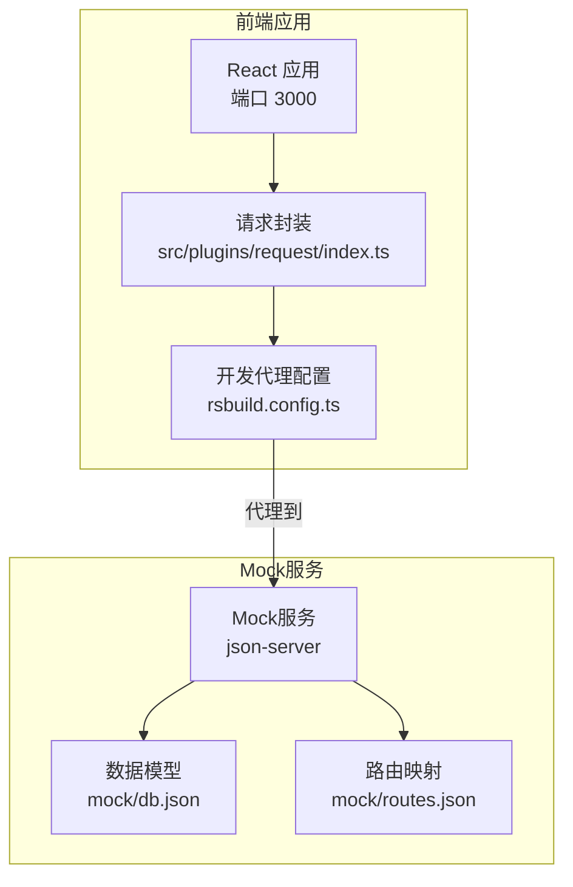
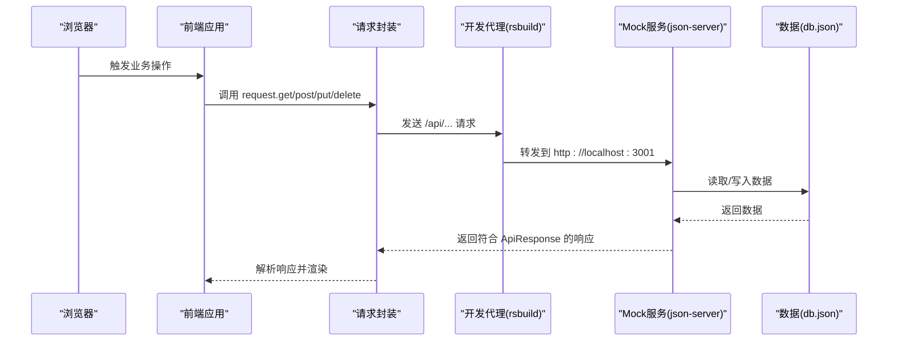
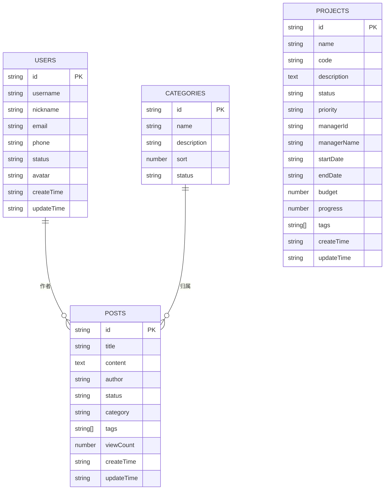
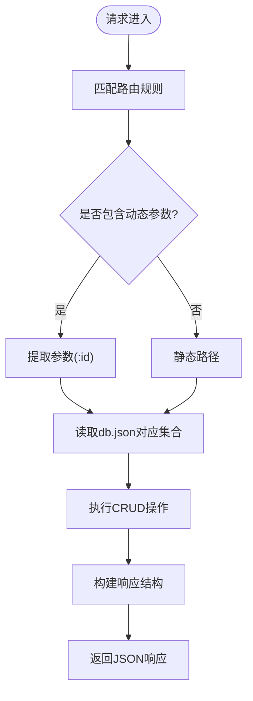
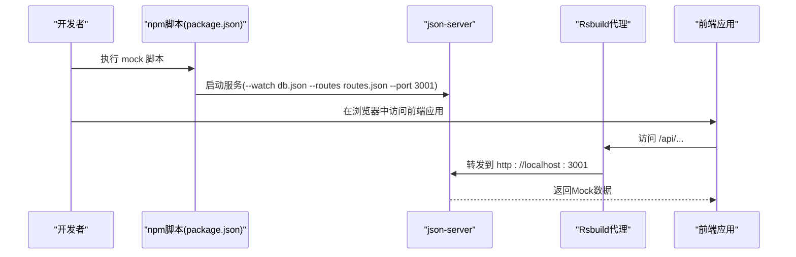
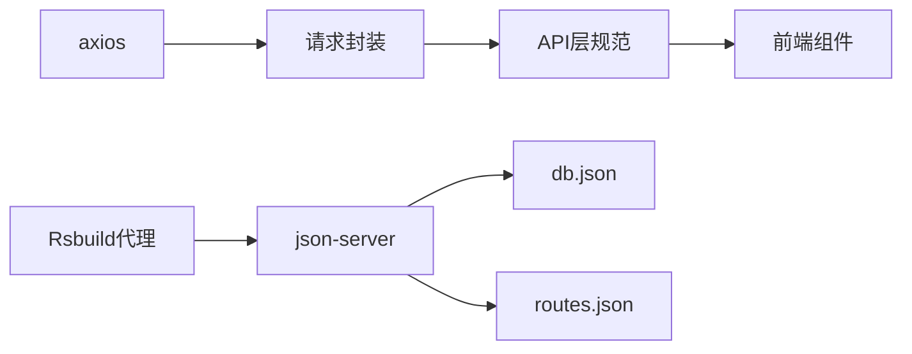

# Mock数据服务

<cite>
**本文引用的文件**
- [mock/db.json](file://mock/db.json)
- [mock/routes.json](file://mock/routes.json)
- [package.json](file://package.json)
- [src/plugins/request/index.ts](file://src/plugins/request/index.ts)
- [src/constants/config.ts](file://src/constants/config.ts)
- [rsbuild.config.ts](file://rsbuild.config.ts)
- [src/types/index.ts](file://src/types/index.ts)
- [.ai/core/architecture.md](file://.ai/core/architecture.md)
</cite>

## 目录

1. [简介](#简介)
2. [项目结构](#项目结构)
3. [核心组件](#核心组件)
4. [架构总览](#架构总览)
5. [详细组件分析](#详细组件分析)
6. [依赖分析](#依赖分析)
7. [性能考虑](#性能考虑)
8. [故障排查指南](#故障排查指南)
9. [结论](#结论)
10. [附录](#附录)

## 简介

本文件系统性地介绍项目中的Mock数据服务，涵盖以下内容：

- 数据模型与关系：db.json中的users、posts、categories、projects等集合的结构与字段语义。
- 路由映射规则：routes.json中对GET/POST/PUT/DELETE等HTTP方法的路由配置与参数传递。
- 启动与运行机制：本地开发环境下Mock服务的启动、数据加载、路由拦截与响应模拟。
- 实际使用示例：前端组件如何通过统一请求封装调用Mock接口，并处理响应数据。
- 维护与更新指南：如何在开发过程中高效维护Mock数据，确保前后端协同开发顺畅。

## 项目结构

Mock服务相关的核心文件位于根目录的mock文件夹，配合前端请求封装与开发代理配置共同工作：

- mock/db.json：定义Mock数据库的数据模型与初始数据。
- mock/routes.json：定义REST风格的路由映射规则，支持动态参数与路径重写。
- package.json：提供启动Mock服务的脚本命令。
- rsbuild.config.ts：配置开发代理，将/api前缀请求转发到Mock服务端口。
- src/plugins/request/index.ts：统一的请求封装与拦截器，负责业务错误处理与响应解包。
- src/types/index.ts：定义通用的API响应结构，用于Mock响应的一致化。
- src/constants/config.ts：应用常量与配置，便于理解请求基础配置。
- .ai/core/architecture.md：提供API层规范与模块组织建议，指导Mock接口的命名与结构。

图表来源

- [rsbuild.config.ts](file://rsbuild.config.ts#L11-L21)
- [package.json](file://package.json#L11-L11)
- [mock/db.json](file://mock/db.json#L1-L140)
- [mock/routes.json](file://mock/routes.json#L1-L11)

章节来源

- [mock/db.json](file://mock/db.json#L1-L140)
- [mock/routes.json](file://mock/routes.json#L1-L11)
- [package.json](file://package.json#L11-L11)
- [rsbuild.config.ts](file://rsbuild.config.ts#L11-L21)
- [src/plugins/request/index.ts](file://src/plugins/request/index.ts#L1-L114)
- [src/types/index.ts](file://src/types/index.ts#L87-L93)
- [src/constants/config.ts](file://src/constants/config.ts#L36-L45)

## 核心组件

- Mock数据库（db.json）
  - 定义多个集合：users、posts、categories、projects。
  - 字段覆盖用户信息、文章内容、分类信息、项目信息等，包含状态、时间戳、排序、标签等常用属性。
  - 支持分页查询、过滤、排序等常见操作（由json-server自动提供）。

- 路由映射（routes.json）
  - 提供REST风格的路径映射，支持动态参数（如/users/:id）。
  - 将前端/api前缀请求重定向到对应的Mock集合或资源。

- 请求封装（src/plugins/request/index.ts）
  - 基于axios创建实例，统一设置超时、请求头。
  - 请求拦截器：从localStorage读取token并注入Authorization头。
  - 响应拦截器：根据业务返回结构判断success或code，成功时返回data.data，失败时弹出消息并抛错；对HTTP状态码进行统一错误提示。

- 开发代理（rsbuild.config.ts）
  - 将/api前缀的请求代理到本地Mock服务（默认端口3001）。
  - 通过pathRewrite去除/api前缀，使前端调用与后端一致。

- API类型定义（src/types/index.ts）
  - 定义通用的API响应结构，确保Mock响应与真实后端保持一致的结构，便于联调与测试。

章节来源

- [mock/db.json](file://mock/db.json#L1-L140)
- [mock/routes.json](file://mock/routes.json#L1-L11)
- [src/plugins/request/index.ts](file://src/plugins/request/index.ts#L1-L114)
- [rsbuild.config.ts](file://rsbuild.config.ts#L11-L21)
- [src/types/index.ts](file://src/types/index.ts#L87-L93)

## 架构总览

前端通过统一请求封装发起请求，开发代理将/api开头的请求转发至Mock服务。Mock服务基于json-server，读取db.json中的数据模型与routes.json中的路由映射，返回符合约定的响应结构。

图表来源

- [rsbuild.config.ts](file://rsbuild.config.ts#L11-L21)
- [src/plugins/request/index.ts](file://src/plugins/request/index.ts#L78-L111)
- [mock/db.json](file://mock/db.json#L1-L140)

## 详细组件分析

### 数据模型与关系（db.json）

- users集合
  - 字段：id、username、nickname、email、phone、status、avatar、createTime、updateTime。
  - 用途：用户认证、权限控制、个人资料展示。
- posts集合
  - 字段：id、title、content、author、status、category、tags、viewCount、createTime、updateTime。
  - 用途：文章/公告管理、内容展示与统计。
- categories集合
  - 字段：id、name、description、sort、status。
  - 用途：内容分类、筛选与排序。
- projects集合
  - 字段：id、name、code、description、status、priority、managerId、managerName、startDate、endDate、budget、progress、tags、createTime、updateTime。
  - 用途：项目管理、进度跟踪、预算与人员分配。

图表来源

- [mock/db.json](file://mock/db.json#L1-L140)

章节来源

- [mock/db.json](file://mock/db.json#L1-L140)

### 路由映射规则（routes.json）

- 映射规则
  - GET /auth/login → /login
  - GET /auth/logout → /logout
  - GET/PUT/DELETE /users/:id → /users/:id
  - GET/POST /users → /users
  - GET/PUT/DELETE /posts/:id → /posts/:id
  - GET/POST /posts → /posts
  - GET/PUT/DELETE /categories/:id → /categories/:id
  - GET/POST /categories → /categories
- 参数传递
  - 动态参数通过冒号语法（如: id）传递，json-server会自动解析为路由参数。
- 响应数据设置
  - json-server基于db.json自动生成标准REST响应，包括列表、分页、过滤、排序、增删改查等。

图表来源

- [mock/routes.json](file://mock/routes.json#L1-L11)
- [mock/db.json](file://mock/db.json#L1-L140)

章节来源

- [mock/routes.json](file://mock/routes.json#L1-L11)

### 启动与运行机制

- 启动Mock服务
  - 通过package.json提供的脚本启动json-server，监听db.json并应用routes.json，端口默认3001。
- 开发代理
  - Rsbuild开发服务器将/api前缀请求代理到http://localhost:3001，实现前后端分离开发。
- 请求拦截与响应处理
  - 前端请求封装统一处理Authorization头、业务错误与HTTP错误，保证错误提示与页面交互一致。

图表来源

- [package.json](file://package.json#L11-L11)
- [rsbuild.config.ts](file://rsbuild.config.ts#L11-L21)

章节来源

- [package.json](file://package.json#L11-L11)
- [rsbuild.config.ts](file://rsbuild.config.ts#L11-L21)
- [src/plugins/request/index.ts](file://src/plugins/request/index.ts#L19-L76)

### 前端调用与响应处理示例

- 统一请求方法
  - request.get/post/put/delete/patch：封装了axios实例，支持传入URL、参数与配置。
- 响应拦截
  - 成功：当响应体包含success或code为200时，返回data.data。
  - 失败：弹出错误消息并抛出错误，便于上层组件处理。
- 错误处理
  - 对401、403、404、500等状态码进行统一提示，并在401时清理token并跳转登录页。
- 使用建议
  - 前端组件直接调用request.get('/api/users')或request.post('/api/posts', payload)，无需关心底层代理细节。
  - 若需要分页查询，可传入params对象，json-server会自动处理分页、过滤与排序。

章节来源

- [src/plugins/request/index.ts](file://src/plugins/request/index.ts#L78-L111)
- [src/plugins/request/index.ts](file://src/plugins/request/index.ts#L34-L76)

### API层规范与Mock一致性

- 模块组织
  - 建议按业务模块组织API，每个模块包含index.ts（实现）与types.ts（类型定义），统一导出便于使用。
- API对象模式
  - 使用对象模式组织API方法，命名清晰，便于Mock对接。
- 类型定义
  - 将类型定义放在api/[module]/types.ts，避免在API文件中重复定义，确保Mock响应与真实后端一致。

章节来源

- [.ai/core/architecture.md](file://.ai/core/architecture.md#L100-L138)
- [.ai/core/architecture.md](file://.ai/core/architecture.md#L138-L154)
- [.ai/core/architecture.md](file://.ai/core/architecture.md#L155-L181)

## 依赖分析

- 外部依赖
  - json-server：提供Mock REST API能力，自动读取db.json并暴露CRUD接口。
  - axios：统一请求封装，支持拦截器与错误处理。
  - Rsbuild：开发代理，将/api前缀请求转发到Mock服务。
- 内部耦合
  - 前端请求封装与API层规范紧密耦合，确保Mock与真实后端响应结构一致。
  - 开发代理配置与Mock服务端口耦合，需保持一致以避免请求失败。

图表来源

- [src/plugins/request/index.ts](file://src/plugins/request/index.ts#L1-L114)
- [rsbuild.config.ts](file://rsbuild.config.ts#L11-L21)
- [package.json](file://package.json#L51-L51)

章节来源

- [src/plugins/request/index.ts](file://src/plugins/request/index.ts#L1-L114)
- [rsbuild.config.ts](file://rsbuild.config.ts#L11-L21)
- [package.json](file://package.json#L51-L51)

## 性能考虑

- Mock数据规模
  - 初期建议控制集合数量与单集合记录数，避免json-server在大量数据时出现性能瓶颈。
- 查询优化
  - 使用分页参数与过滤条件减少一次性传输的数据量。
- 缓存策略
  - 前端可对高频读取的列表数据进行缓存，降低重复请求次数。
- 代理开销
  - 开发代理仅在本地开发阶段启用，生产环境不依赖此机制，避免引入额外开销。

## 故障排查指南

- 无法访问Mock服务
  - 确认已执行mock脚本且端口3001未被占用。
  - 检查Rsbuild代理配置是否正确指向3001端口。
- 请求返回业务错误
  - 查看响应拦截器逻辑，确认响应体中的success或code字段是否符合预期。
  - 检查前端是否正确处理401/403/404/500等状态码。
- 路由不生效
  - 确认routes.json中的路径与前端调用路径一致，注意动态参数(:id)的传递。
- 数据未更新
  - 确认db.json已保存并被json-server监听到（mock脚本使用--watch）。

章节来源

- [package.json](file://package.json#L11-L11)
- [rsbuild.config.ts](file://rsbuild.config.ts#L11-L21)
- [src/plugins/request/index.ts](file://src/plugins/request/index.ts#L34-L76)

## 结论

本Mock数据服务通过json-server与前端请求封装的协作，实现了与真实后端一致的响应结构与开发体验。借助db.json与routes.json，开发者可以快速搭建稳定的Mock环境，结合API层规范与开发代理，显著提升前后端协同开发效率。建议在团队内统一API命名与响应结构，持续维护db.json与routes.json，确保Mock数据与业务需求同步演进。

## 附录

- 快速开始
  - 启动Mock服务：执行mock脚本。
  - 启动前端应用：执行dev脚本，访问http://localhost:3000。
  - 调用示例：在组件中使用request.get('/api/users')或request.post('/api/posts', payload)。
- 维护建议
  - 新增集合：在db.json中添加新集合，并在routes.json中补充相应路由。
  - 修改字段：保持字段命名与类型与API层规范一致，避免破坏前端逻辑。
  - 版本管理：将db.json与routes.json纳入版本控制，便于团队协作与回滚。
