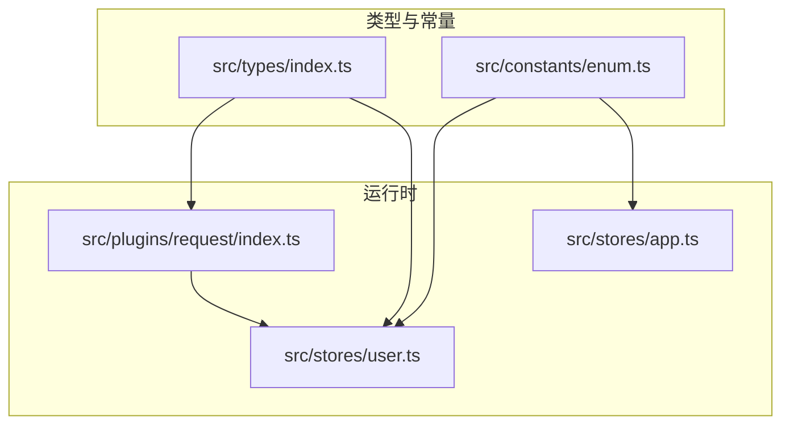
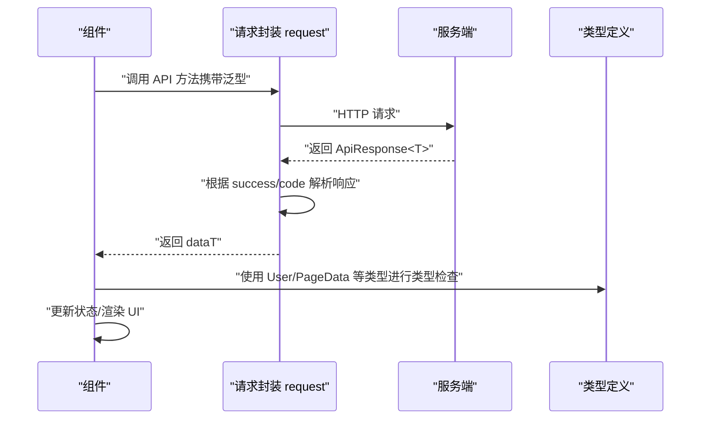
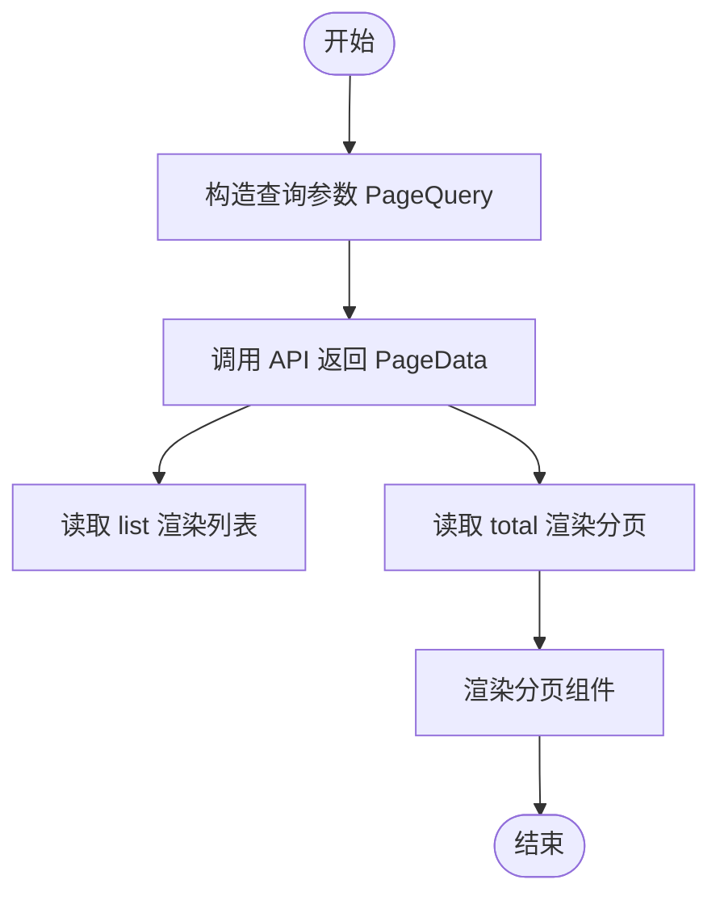
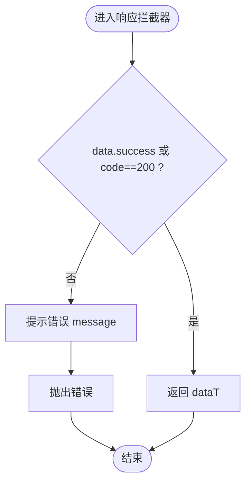
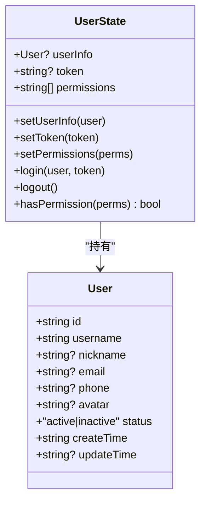
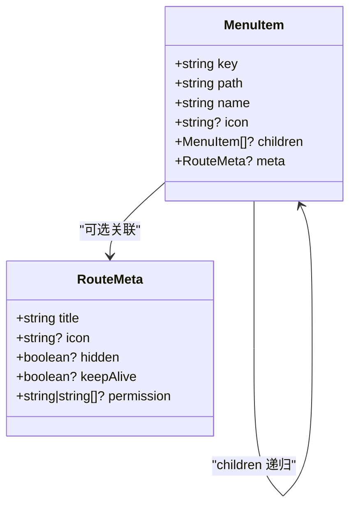
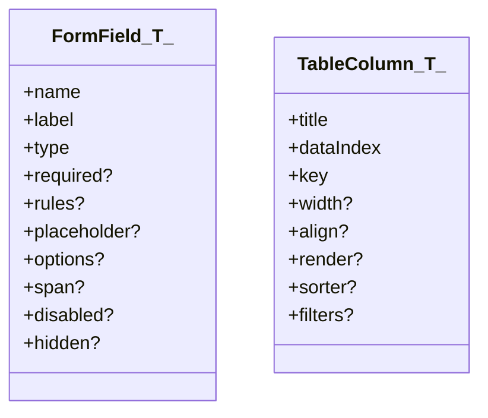
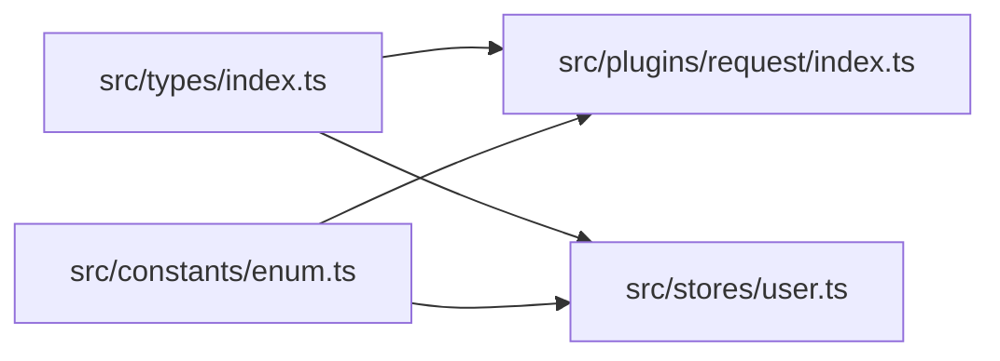

# 数据模型定义

<cite>
**本文引用的文件**
- [src/types/index.ts](file://src/types/index.ts)
- [src/constants/enum.ts](file://src/constants/enum.ts)
- [src/plugins/request/index.ts](file://src/plugins/request/index.ts)
- [src/stores/user.ts](file://src/stores/user.ts)
- [src/stores/app.ts](file://src/stores/app.ts)
- [.ai/conventions/api-conventions.md](file://.ai/conventions/api-conventions.md)
- [.ai/core/coding-standards.md](file://.ai/core/coding-standards.md)
- [mock/db.json](file://mock/db.json)
</cite>

## 目录

1. [简介](#简介)
2. [项目结构](#项目结构)
3. [核心数据模型](#核心数据模型)
4. [架构总览](#架构总览)
5. [详细组件分析](#详细组件分析)
6. [依赖关系分析](#依赖关系分析)
7. [性能考量](#性能考量)
8. [故障排查指南](#故障排查指南)
9. [结论](#结论)
10. [附录](#附录)

## 简介

本文件系统性梳理项目中的数据模型与类型定义，重点覆盖以下核心模型：

- 用户模型 User：用于描述用户实体的字段与约束
- 分页数据模型 PageData<T>：统一的分页返回结构，包含列表、总数、当前页、每页大小
- API 响应模型 ApiResponse<T>：统一的后端响应结构，包含状态码、业务结果、消息与数据载体
- 菜单项模型 MenuItem：用于前端路由菜单树结构的描述
  同时，结合请求封装与状态管理，给出类型使用范式、最佳实践与扩展维护建议。

## 项目结构

数据模型主要集中在类型定义文件与常量枚举文件中，并通过请求插件与状态管理被广泛复用：

- 类型定义集中于 src/types/index.ts
- 枚举常量集中于 src/constants/enum.ts
- 请求封装位于 src/plugins/request/index.ts，统一处理 ApiResponse<T>
- 状态管理使用 src/stores/user.ts 与 src/stores/app.ts，内部使用 User 类型

图示来源

- [src/types/index.ts](file://src/types/index.ts#L1-L101)
- [src/constants/enum.ts](file://src/constants/enum.ts#L1-L70)
- [src/plugins/request/index.ts](file://src/plugins/request/index.ts#L1-L114)
- [src/stores/user.ts](file://src/stores/user.ts#L1-L76)
- [src/stores/app.ts](file://src/stores/app.ts#L1-L59)

章节来源

- [src/types/index.ts](file://src/types/index.ts#L1-L101)
- [src/constants/enum.ts](file://src/constants/enum.ts#L1-L70)
- [src/plugins/request/index.ts](file://src/plugins/request/index.ts#L1-L114)
- [src/stores/user.ts](file://src/stores/user.ts#L1-L76)
- [src/stores/app.ts](file://src/stores/app.ts#L1-L59)

## 核心数据模型

本节逐项解析关键数据模型的字段、类型约束与典型使用场景。

- 用户 User
  - 字段与约束
    - id: string（唯一标识）
    - username: string（用户名）
    - nickname?: string（昵称，可选）
    - email?: string（邮箱，可选）
    - phone?: string（电话，可选）
    - avatar?: string（头像地址，可选）
    - status: 'active' | 'inactive'（状态枚举，限定值）
    - createTime: string（ISO 8601 字符串）
    - updateTime?: string（更新时间，可选）
  - 使用场景
    - 登录态用户信息、列表展示、详情页、表单编辑
    - 与状态管理结合，持久化 token 与用户信息
  - 章节来源
    - [src/types/index.ts](file://src/types/index.ts#L17-L28)
    - [src/stores/user.ts](file://src/stores/user.ts#L1-L76)

- 分页数据 PageData<T>
  - 字段与约束
    - list: T[]（列表数据，泛型元素）
    - total: number（总数）
    - page: number（当前页，从 1 开始）
    - pageSize: number（每页大小）
  - 设计思路
    - 以 list 作为承载数据的主体，total 用于计算页码与分页组件渲染
    - page 与 pageSize 便于与分页组件或查询参数保持一致
  - 使用场景
    - 列表页、搜索表格、分页组件绑定
    - 与 API 返回结构 PageData<T> 对齐，便于统一处理
  - 章节来源
    - [src/types/index.ts](file://src/types/index.ts#L3-L9)
    - [.ai/conventions/api-conventions.md](file://.ai/conventions/api-conventions.md#L31-L33)

- API 响应 ApiResponse<T>
  - 字段与约束
    - code: number（状态码）
    - data: T（业务数据，泛型）
    - message: string（提示信息）
    - success: boolean（业务成功标志）
  - 结构设计
    - 统一后端响应格式，便于前端统一处理与拦截器解包
    - 与请求封装协同，自动区分业务成功与错误并做 UI 提示
  - 使用场景
    - 所有后端接口返回均按此结构返回，前端通过 request 封装自动提取 data
  - 章节来源
    - [src/types/index.ts](file://src/types/index.ts#L87-L93)
    - [src/plugins/request/index.ts](file://src/plugins/request/index.ts#L35-L76)

- 菜单项 MenuItem
  - 字段与约束
    - key: string（唯一标识）
    - path: string（路由路径）
    - name: string（显示名称）
    - icon?: string（图标，可选）
    - children?: MenuItem[]（子菜单，递归）
    - meta?: RouteMeta（路由元信息，可选）
  - 使用场景
    - 菜单树渲染、路由守卫、面包屑与权限控制
  - 章节来源
    - [src/types/index.ts](file://src/types/index.ts#L39-L47)

- 路由元信息 RouteMeta
  - 字段与约束
    - title: string（标题）
    - icon?: string（图标，可选）
    - hidden?: boolean（是否隐藏，可选）
    - keepAlive?: boolean（是否缓存，可选）
    - permission?: string | string[]（权限标识，可选）
  - 使用场景
    - 控制菜单项显示、页面缓存与权限校验
  - 章节来源
    - [src/types/index.ts](file://src/types/index.ts#L30-L37)

- 表格列配置 TableColumn<T>
  - 字段与约束
    - title: string（列标题）
    - dataIndex: keyof T | string（字段映射）
    - key: string（列唯一标识）
    - width?: number（宽度，可选）
    - align?: 'left' | 'center' | 'right'（对齐，可选）
    - render?: (value, record, index) => ReactNode（渲染函数，可选）
    - sorter?: boolean | ((a, b) => number)（排序，可选）
    - filters?: { text: string; value: string | number }[]（筛选，可选）
  - 使用场景
    - 列表页表格列定义、排序与筛选
  - 章节来源
    - [src/types/index.ts](file://src/types/index.ts#L49-L59)

- 表单字段配置 FormField<T>
  - 字段与约束
    - name: keyof T | string（字段名）
    - label: string（标签）
    - type: 多种控件类型（输入、选择、日期、上传等）
    - required?: boolean（是否必填）
    - rules?: unknown[]（校验规则）
    - placeholder?: string（占位符）
    - options?: { label: string; value: string | number }[]（选项，可选）
    - span?: number（栅格跨度）
    - disabled?: boolean（禁用）
    - hidden?: boolean（隐藏）
  - 使用场景
    - 动态表单、表单设计器、搜索表单
  - 章节来源
    - [src/types/index.ts](file://src/types/index.ts#L61-L85)

- API 错误 ApiError
  - 字段与约束
    - code: string（错误码）
    - message: string（错误信息）
    - details?: unknown（错误详情，可选）
  - 使用场景
    - 与业务错误区分，用于组件层面的细粒度错误处理
  - 章节来源
    - [src/types/index.ts](file://src/types/index.ts#L95-L100)

## 架构总览

下图展示了数据模型在请求与状态管理中的流转关系：

图示来源

- [src/plugins/request/index.ts](file://src/plugins/request/index.ts#L35-L76)
- [src/types/index.ts](file://src/types/index.ts#L87-L93)

章节来源

- [src/plugins/request/index.ts](file://src/plugins/request/index.ts#L1-L114)
- [src/types/index.ts](file://src/types/index.ts#L1-L101)

## 详细组件分析

### 分页数据模型 PageData<T> 的设计与使用

- 设计要点
  - 泛型 T 支持任意实体类型，提升复用性
  - total 与 page/pageSize 协同，便于分页组件与查询参数对齐
- 使用流程
  - 组件通过 API 获取 PageData<T>
  - 分页组件读取 total、page、pageSize 渲染分页条
  - 列表组件读取 list 渲染数据
- 最佳实践
  - 查询参数使用 PageQuery，避免硬编码页码
  - 在请求拦截器中统一处理分页参数与响应解包
- 章节来源
  - [src/types/index.ts](file://src/types/index.ts#L3-L15)
  - [.ai/conventions/api-conventions.md](file://.ai/conventions/api-conventions.md#L31-L33)

图示来源

- [src/types/index.ts](file://src/types/index.ts#L3-L15)

### API 响应模型 ApiResponse<T> 的结构与拦截处理

- 结构说明
  - code：HTTP 或业务状态码
  - data：业务数据（泛型），由拦截器自动解包
  - message：提示信息
  - success：业务成功标志
- 拦截逻辑
  - 业务成功：返回 data
  - 业务失败：弹出错误提示并抛出异常
  - 网络错误：根据状态码分类处理
- 章节来源
  - [src/types/index.ts](file://src/types/index.ts#L87-L93)
  - [src/plugins/request/index.ts](file://src/plugins/request/index.ts#L35-L76)

图示来源

- [src/plugins/request/index.ts](file://src/plugins/request/index.ts#L35-L76)

### 用户模型 User 的状态与权限集成

- 状态管理
  - 使用 Zustand 管理用户信息、token、权限集合
  - 提供 login/logout、hasPermission 等动作
- 类型约束
  - User 的 status 限定为 'active' | 'inactive'
  - createTime/updateTime 采用字符串格式
- 章节来源
  - [src/types/index.ts](file://src/types/index.ts#L17-L28)
  - [src/stores/user.ts](file://src/stores/user.ts#L1-L76)

图示来源

- [src/types/index.ts](file://src/types/index.ts#L17-L28)
- [src/stores/user.ts](file://src/stores/user.ts#L6-L19)

### 菜单项模型 MenuItem 的层级与元信息

- 层级结构
  - 支持 children 递归，形成菜单树
- 元信息
  - RouteMeta 控制显示、缓存与权限
- 章节来源
  - [src/types/index.ts](file://src/types/index.ts#L39-L47)
  - [src/types/index.ts](file://src/types/index.ts#L30-L37)

图示来源

- [src/types/index.ts](file://src/types/index.ts#L30-L47)

### 表单与表格配置模型

- 表单字段配置 FormField<T>
  - 支持多种控件类型与校验规则
- 表格列配置 TableColumn<T>
  - 支持排序、筛选与自定义渲染
- 章节来源
  - [src/types/index.ts](file://src/types/index.ts#L49-L85)

图示来源

- [src/types/index.ts](file://src/types/index.ts#L49-L85)

## 依赖关系分析

- 类型到运行时的依赖
  - request 插件依赖 ApiResponse<T> 进行统一解包
  - stores 使用 User 类型进行状态建模
- 枚举与常量
  - constants/enum.ts 提供状态、主题、语言等枚举，供类型与 UI 使用
- 章节来源
  - [src/plugins/request/index.ts](file://src/plugins/request/index.ts#L9-L11)
  - [src/stores/user.ts](file://src/stores/user.ts#L1-L4)
  - [src/constants/enum.ts](file://src/constants/enum.ts#L1-L70)

图示来源

- [src/types/index.ts](file://src/types/index.ts#L1-L101)
- [src/plugins/request/index.ts](file://src/plugins/request/index.ts#L1-L114)
- [src/stores/user.ts](file://src/stores/user.ts#L1-L76)
- [src/constants/enum.ts](file://src/constants/enum.ts#L1-L70)

## 性能考量

- 类型泛型的收益
  - 编译期类型检查减少运行时错误，降低调试成本
- 请求拦截器的解包
  - 在拦截器中一次性解包 ApiResponse<T>，避免重复样板代码
- 分页数据的使用
  - 仅在需要时读取 total 与 list，避免不必要的重渲染
- 章节来源
- [src/plugins/request/index.ts](file://src/plugins/request/index.ts#L35-L76)
- [src/types/index.ts](file://src/types/index.ts#L3-L9)

## 故障排查指南

- 常见问题
  - 响应未解包：确认请求封装是否正确返回 data
  - 类型不匹配：检查 API 返回结构与 ApiResponse<T> 是否一致
  - 分页异常：核对 page 与 pageSize 的传递与 total 的计算
- 建议
  - 在组件中仅处理业务错误，网络错误由拦截器统一处理
  - 使用枚举与受限联合类型约束状态字段，减少边界条件
- 章节来源
- [src/plugins/request/index.ts](file://src/plugins/request/index.ts#L35-L76)
- [src/constants/enum.ts](file://src/constants/enum.ts#L4-L8)

## 结论

本项目通过统一的类型定义与请求封装，实现了前后端数据契约的一致性与可维护性。核心模型 User、PageData<T>、ApiResponse<T>、MenuItem 等为组件开发提供了清晰的类型边界与使用范式。配合状态管理与枚举常量，能够高效支撑复杂业务场景下的数据流与 UI 交互。

## 附录

### 使用示例与最佳实践

- 在组件中使用类型
  - 通过 API 返回的 PageData<T> 与 ApiResponse<T> 进行类型约束
  - 使用 FormField<T> 与 TableColumn<T> 生成表单与表格配置
- 类型检查与转换
  - 在请求拦截器中完成 ApiResponse<T> 到 data 的解包
  - 对时间字段采用字符串格式，避免跨时区问题
- 扩展与维护
  - 新增实体时，遵循 API 约定与类型生成规范
  - 通过枚举统一状态与配置，避免魔法字符串
- 章节来源
- [.ai/conventions/api-conventions.md](file://.ai/conventions/api-conventions.md#L1-L69)
- [.ai/core/coding-standards.md](file://.ai/core/coding-standards.md#L122-L195)
- [src/plugins/request/index.ts](file://src/plugins/request/index.ts#L35-L76)
- [src/types/index.ts](file://src/types/index.ts#L1-L101)
