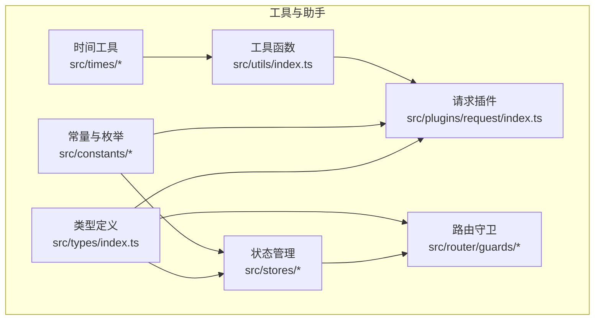
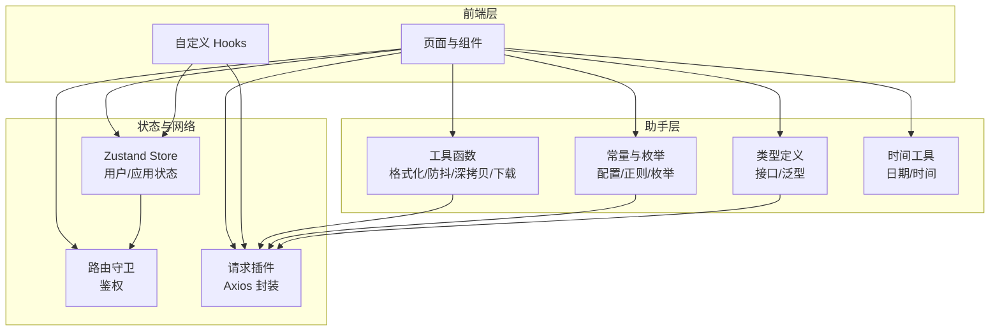
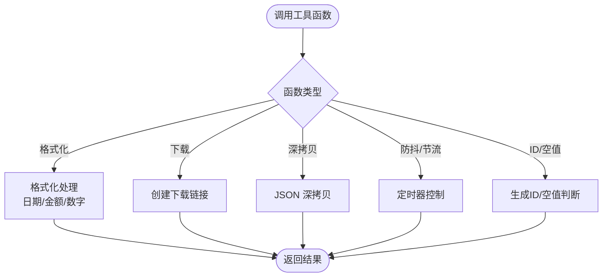
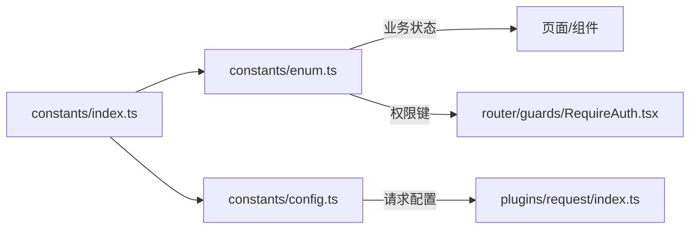
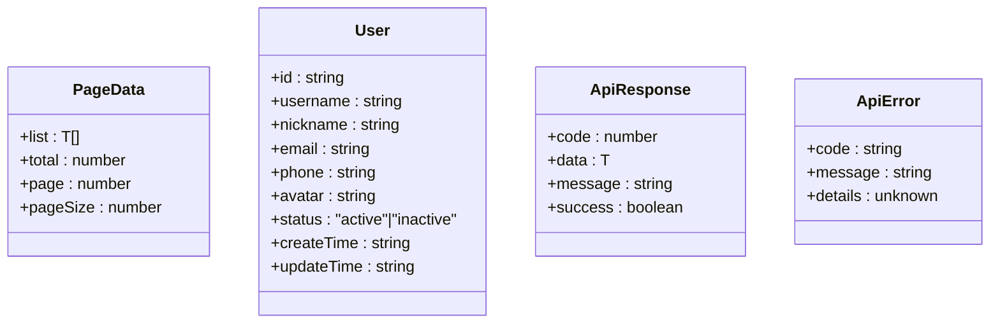
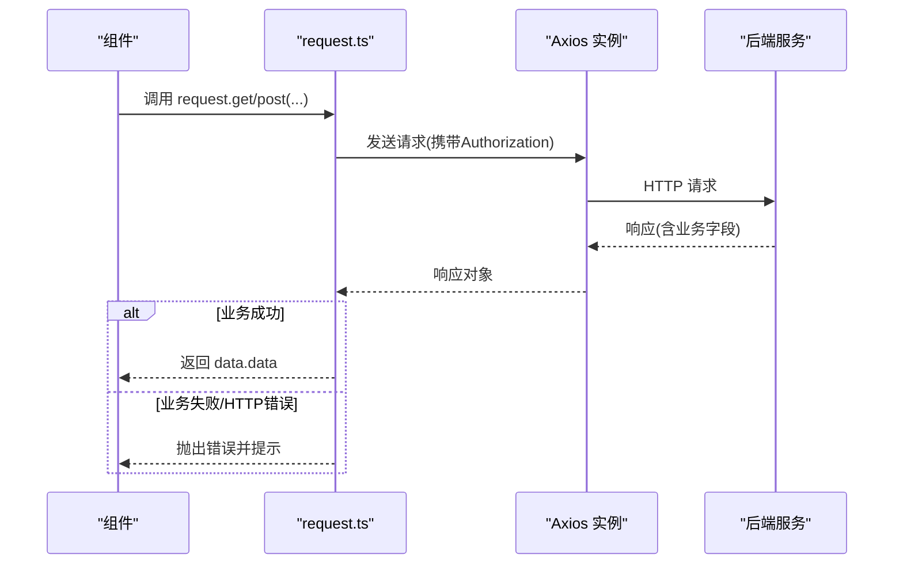
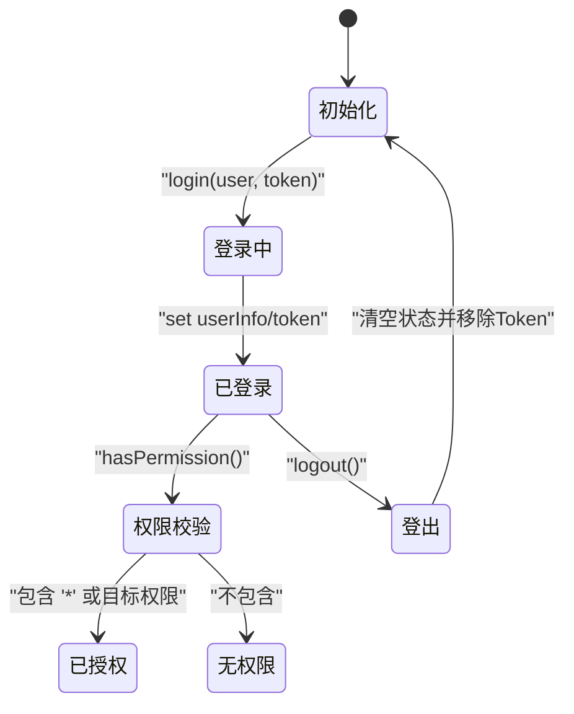
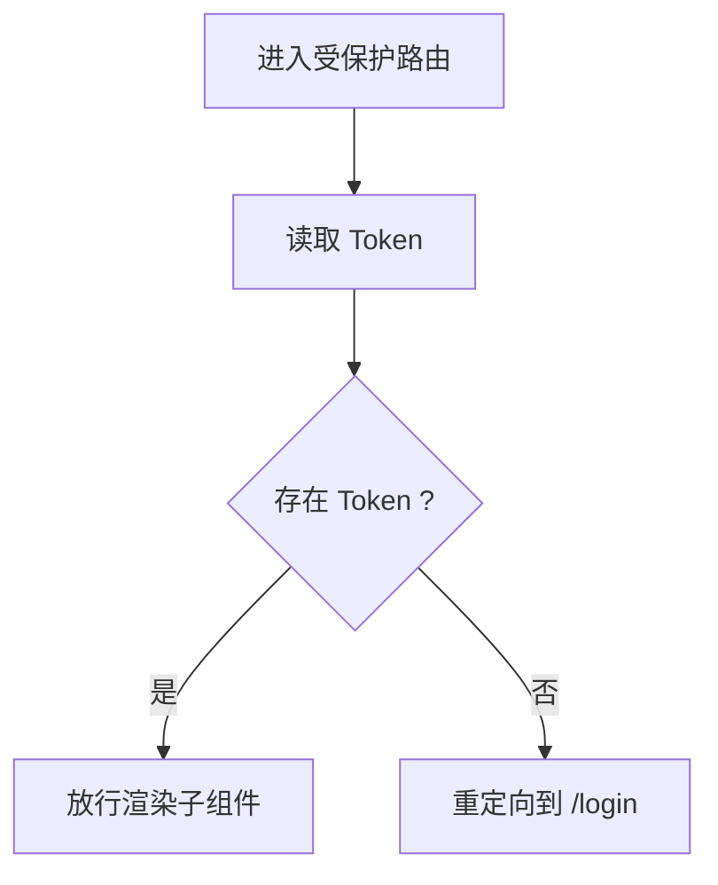
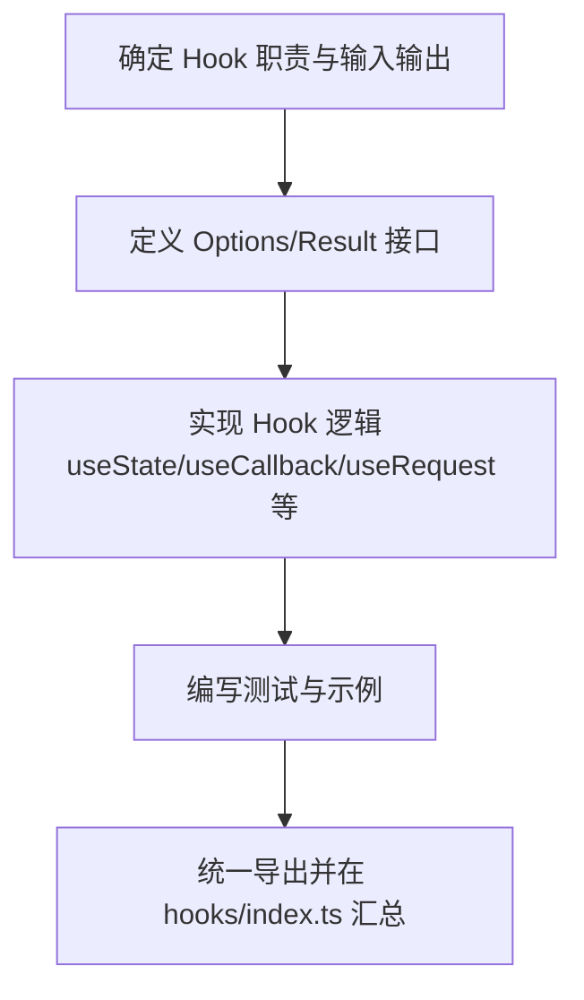
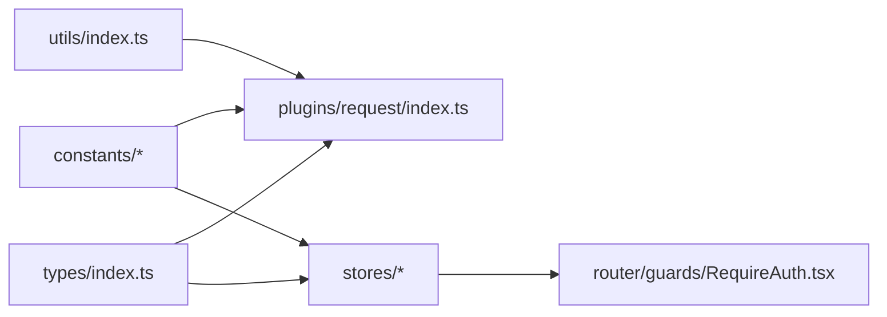

# 工具与助手

<cite>
**本文引用的文件**
- [src/utils/index.ts](file://src/utils/index.ts)
- [src/constants/index.ts](file://src/constants/index.ts)
- [src/constants/config.ts](file://src/constants/config.ts)
- [src/constants/enum.ts](file://src/constants/enum.ts)
- [src/times/index.ts](file://src/times/index.ts)
- [src/times/date.ts](file://src/times/date.ts)
- [src/times/time.ts](file://src/times/time.ts)
- [src/types/index.ts](file://src/types/index.ts)
- [src/plugins/request/index.ts](file://src/plugins/request/index.ts)
- [src/stores/index.ts](file://src/stores/index.ts)
- [src/stores/user.ts](file://src/stores/user.ts)
- [src/stores/app.ts](file://src/stores/app.ts)
- [src/router/guards/RequireAuth.tsx](file://src/router/guards/RequireAuth.tsx)
- [src/router/guards/index.ts](file://src/router/guards/index.ts)
- [.ai/core/coding-standards.md](file://.ai/core/coding-standards.md)
- [.ai/templates/archived/custom-hook.md](file://.ai/templates/archived/custom-hook.md)
</cite>

## 目录

1. [简介](#简介)
2. [项目结构](#项目结构)
3. [核心组件](#核心组件)
4. [架构总览](#架构总览)
5. [详细组件分析](#详细组件分析)
6. [依赖分析](#依赖分析)
7. [性能考虑](#性能考虑)
8. [故障排查指南](#故障排查指南)
9. [结论](#结论)
10. [附录](#附录)

## 简介

本文件系统性梳理项目中的“工具函数与助手”体系，涵盖以下方面：

- 工具函数库：数据处理、格式转换、防抖节流、空值判断、下载与深拷贝等通用能力
- 常量与枚举：应用配置、路由配置、请求配置、正则表达式、日期格式、业务枚举等统一管理
- 类型定义：全局接口与泛型模型，支撑强类型开发与可维护性
- 状态管理与守卫：基于 Zustand 的应用状态与用户状态，以及路由鉴权守卫
- 自定义 Hooks 开发模式：状态管理 Hooks、副作用处理 Hooks、组合 Hooks 的最佳实践与模板
- 使用示例与扩展指南：如何在页面与组件中高效复用工具与助手，并安全扩展

## 项目结构

围绕“工具与助手”的核心目录与文件如下：

- 工具函数：src/utils/index.ts
- 常量与枚举：src/constants/index.ts、src/constants/config.ts、src/constants/enum.ts
- 类型定义：src/types/index.ts
- 请求插件：src/plugins/request/index.ts
- 状态管理：src/stores/index.ts、src/stores/user.ts、src/stores/app.ts
- 路由守卫：src/router/guards/RequireAuth.tsx、src/router/guards/index.ts
- 时间工具：src/times/index.ts、src/times/date.ts、src/times/time.ts
- 编码规范与模板：.ai/core/coding-standards.md、.ai/templates/archived/custom-hook.md

图表来源

- [src/utils/index.ts](file://src/utils/index.ts#L1-L106)
- [src/constants/index.ts](file://src/constants/index.ts#L1-L4)
- [src/constants/config.ts](file://src/constants/config.ts#L1-L76)
- [src/constants/enum.ts](file://src/constants/enum.ts#L1-L70)
- [src/types/index.ts](file://src/types/index.ts#L1-L101)
- [src/plugins/request/index.ts](file://src/plugins/request/index.ts#L1-L114)
- [src/stores/index.ts](file://src/stores/index.ts#L1-L3)
- [src/stores/user.ts](file://src/stores/user.ts#L1-L76)
- [src/stores/app.ts](file://src/stores/app.ts#L1-L59)
- [src/router/guards/RequireAuth.tsx](file://src/router/guards/RequireAuth.tsx#L1-L25)
- [src/times/index.ts](file://src/times/index.ts#L1-L200)
- [src/times/date.ts](file://src/times/date.ts#L1-L200)
- [src/times/time.ts](file://src/times/time.ts#L1-L200)

章节来源

- [src/utils/index.ts](file://src/utils/index.ts#L1-L106)
- [src/constants/index.ts](file://src/constants/index.ts#L1-L4)
- [src/constants/config.ts](file://src/constants/config.ts#L1-L76)
- [src/constants/enum.ts](file://src/constants/enum.ts#L1-L70)
- [src/types/index.ts](file://src/types/index.ts#L1-L101)
- [src/plugins/request/index.ts](file://src/plugins/request/index.ts#L1-L114)
- [src/stores/index.ts](file://src/stores/index.ts#L1-L3)
- [src/stores/user.ts](file://src/stores/user.ts#L1-L76)
- [src/stores/app.ts](file://src/stores/app.ts#L1-L59)
- [src/router/guards/RequireAuth.tsx](file://src/router/guards/RequireAuth.tsx#L1-L25)
- [src/router/guards/index.ts](file://src/router/guards/index.ts#L1-L3)
- [src/times/index.ts](file://src/times/index.ts#L1-L200)
- [src/times/date.ts](file://src/times/date.ts#L1-L200)
- [src/times/time.ts](file://src/times/time.ts#L1-L200)

## 核心组件

- 工具函数库：提供日期格式化、金额/数字格式化、文件下载、深拷贝、防抖/节流、唯一ID生成、空值判断等基础能力
- 常量与枚举：集中管理应用配置、路由白名单、请求超时与重试、正则校验、日期格式、业务状态枚举等
- 类型定义：定义分页、用户、路由元信息、菜单项、表格列、表单字段、API响应与错误等通用接口
- 请求插件：封装 axios 实例，统一添加 Token、处理业务成功/失败、HTTP 错误码映射与跳转
- 状态管理：用户状态（登录态、权限）与应用状态（侧边栏折叠、主题、语言），持久化与 Immer 更新
- 路由守卫：鉴权跳转，未登录自动重定向到登录页
- 时间工具：按需拆分日期与时间工具模块，便于扩展与复用

章节来源

- [src/utils/index.ts](file://src/utils/index.ts#L1-L106)
- [src/constants/config.ts](file://src/constants/config.ts#L1-L76)
- [src/constants/enum.ts](file://src/constants/enum.ts#L1-L70)
- [src/types/index.ts](file://src/types/index.ts#L1-L101)
- [src/plugins/request/index.ts](file://src/plugins/request/index.ts#L1-L114)
- [src/stores/user.ts](file://src/stores/user.ts#L1-L76)
- [src/stores/app.ts](file://src/stores/app.ts#L1-L59)
- [src/router/guards/RequireAuth.tsx](file://src/router/guards/RequireAuth.tsx#L1-L25)
- [src/times/date.ts](file://src/times/date.ts#L1-L200)
- [src/times/time.ts](file://src/times/time.ts#L1-L200)

## 架构总览

下图展示“工具与助手”在系统中的位置与交互关系。

图表来源

- [src/utils/index.ts](file://src/utils/index.ts#L1-L106)
- [src/constants/index.ts](file://src/constants/index.ts#L1-L4)
- [src/constants/config.ts](file://src/constants/config.ts#L1-L76)
- [src/constants/enum.ts](file://src/constants/enum.ts#L1-L70)
- [src/types/index.ts](file://src/types/index.ts#L1-L101)
- [src/plugins/request/index.ts](file://src/plugins/request/index.ts#L1-L114)
- [src/stores/index.ts](file://src/stores/index.ts#L1-L3)
- [src/stores/user.ts](file://src/stores/user.ts#L1-L76)
- [src/stores/app.ts](file://src/stores/app.ts#L1-L59)
- [src/router/guards/RequireAuth.tsx](file://src/router/guards/RequireAuth.tsx#L1-L25)

## 详细组件分析

### 工具函数库（数据处理、格式转换、验证工具）

- 日期与时间格式化：支持多种格式输出，兼容字符串、数值与 Date 对象；提供日期时间专用格式化
- 金额与数字格式化：带千分位分隔符与小数位控制；空值安全处理
- 文件下载：动态创建 a 标签触发浏览器下载，支持自定义文件名
- 深拷贝：基于 JSON 序列化/反序列化的通用深拷贝实现
- 防抖与节流：泛型封装，确保上下文与参数类型安全
- 唯一 ID 生成：随机字符串 ID
- 空值判断：统一处理 null、undefined、空串、空数组、空对象

图表来源

- [src/utils/index.ts](file://src/utils/index.ts#L1-L106)

章节来源

- [src/utils/index.ts](file://src/utils/index.ts#L1-L106)

### 常量与枚举（组织策略）

- 配置常量：应用名称/版本、默认分页、语言/主题、Token 过期天数、路由路径、请求超时/重试、日期格式等
- 业务枚举：用户状态、订单状态、性别、主题模式、语言、HTTP 状态码、存储键名
- 统一导出：通过 constants/index.ts 聚合导出，便于跨模块引用

图表来源

- [src/constants/index.ts](file://src/constants/index.ts#L1-L4)
- [src/constants/config.ts](file://src/constants/config.ts#L1-L76)
- [src/constants/enum.ts](file://src/constants/enum.ts#L1-L70)
- [src/plugins/request/index.ts](file://src/plugins/request/index.ts#L1-L114)
- [src/router/guards/RequireAuth.tsx](file://src/router/guards/RequireAuth.tsx#L1-L25)

章节来源

- [src/constants/index.ts](file://src/constants/index.ts#L1-L4)
- [src/constants/config.ts](file://src/constants/config.ts#L1-L76)
- [src/constants/enum.ts](file://src/constants/enum.ts#L1-L70)

### 类型定义（最佳实践）

- 分页模型：列表、总数、页码、每页数量
- 用户模型：标识、用户名、昵称、邮箱/手机、头像、状态、创建/更新时间
- 路由与菜单：路由元信息、菜单项结构
- 表格列与表单字段：列标题、数据索引、宽度、排序/筛选、渲染回调、必填/规则/占位符/选项
- API 响应与错误：统一响应结构与错误结构，便于拦截器与组件层一致处理

图表来源

- [src/types/index.ts](file://src/types/index.ts#L1-L101)

章节来源

- [src/types/index.ts](file://src/types/index.ts#L1-L101)

### 请求插件（网络层助手）

- 创建 axios 实例，设置超时与 Content-Type
- 请求拦截：从本地存储读取 Token 并注入 Authorization 头
- 响应拦截：业务成功透传 data.data；业务失败弹出消息并拒绝；HTTP 错误码映射与登录过期处理
- 方法封装：get/post/put/delete/patch 统一返回 Promise<T>

图表来源

- [src/plugins/request/index.ts](file://src/plugins/request/index.ts#L1-L114)

章节来源

- [src/plugins/request/index.ts](file://src/plugins/request/index.ts#L1-L114)

### 状态管理（Zustand Store）

- 用户状态：用户信息、Token、权限集合；登录/登出；权限校验
- 应用状态：侧边栏折叠、主题、语言；切换主题/语言/侧边栏折叠
- 持久化：仅持久化必要字段（如 Token、用户信息、主题、语言）
- Immer：简化不可变更新写法

图表来源

- [src/stores/user.ts](file://src/stores/user.ts#L1-L76)
- [src/stores/app.ts](file://src/stores/app.ts#L1-L59)

章节来源

- [src/stores/index.ts](file://src/stores/index.ts#L1-L3)
- [src/stores/user.ts](file://src/stores/user.ts#L1-L76)
- [src/stores/app.ts](file://src/stores/app.ts#L1-L59)

### 路由守卫（鉴权）

- RequireAuth：读取用户 Store 中的 Token，若为空则跳转至登录页
- 作为路由包装器，保护受保护页面

图表来源

- [src/router/guards/RequireAuth.tsx](file://src/router/guards/RequireAuth.tsx#L1-L25)
- [src/router/guards/index.ts](file://src/router/guards/index.ts#L1-L3)

章节来源

- [src/router/guards/RequireAuth.tsx](file://src/router/guards/RequireAuth.tsx#L1-L25)
- [src/router/guards/index.ts](file://src/router/guards/index.ts#L1-L3)

### 时间工具（扩展建议）

- 当前结构：src/times/index.ts、src/times/date.ts、src/times/time.ts
- 建议：按领域拆分日期/时间/时区工具，保持单一职责；对外统一导出，便于按需引入

章节来源

- [src/times/index.ts](file://src/times/index.ts#L1-L200)
- [src/times/date.ts](file://src/times/date.ts#L1-L200)
- [src/times/time.ts](file://src/times/time.ts#L1-L200)

### 自定义 Hooks 开发模式（最佳实践与模板）

- 开发原则：类型完整、不使用 any、添加 JSDoc 注释、可结合 ahooks 与 @dalydb/sdesign 特性
- 结构规范：文件命名 use[HookName].ts；导出 use[HookName] 函数；返回值与选项分离定义
- 常见类型：
  - 状态管理 Hooks：封装 Store 选择器与动作
  - 副作用处理 Hooks：封装异步请求、轮询、事件监听
  - 组合 Hooks：将多个 Hooks 组合，形成更高层的业务能力

图表来源

- [.ai/templates/archived/custom-hook.md](file://.ai/templates/archived/custom-hook.md#L1-L69)
- [.ai/core/coding-standards.md](file://.ai/core/coding-standards.md#L197-L270)

章节来源

- [.ai/templates/archived/custom-hook.md](file://.ai/templates/archived/custom-hook.md#L1-L69)
- [.ai/core/coding-standards.md](file://.ai/core/coding-standards.md#L197-L270)

## 依赖分析

- 工具函数被请求插件与页面组件广泛依赖，形成“底层能力层”
- 常量与枚举为请求插件与守卫提供统一配置入口
- 类型定义贯穿网络层、状态层与 UI 层，保证一致性
- 状态管理依赖类型定义与常量枚举，用于权限与主题等配置
- 路由守卫依赖用户状态 Store，形成鉴权闭环

图表来源

- [src/utils/index.ts](file://src/utils/index.ts#L1-L106)
- [src/constants/index.ts](file://src/constants/index.ts#L1-L4)
- [src/types/index.ts](file://src/types/index.ts#L1-L101)
- [src/plugins/request/index.ts](file://src/plugins/request/index.ts#L1-L114)
- [src/stores/user.ts](file://src/stores/user.ts#L1-L76)
- [src/stores/app.ts](file://src/stores/app.ts#L1-L59)
- [src/router/guards/RequireAuth.tsx](file://src/router/guards/RequireAuth.tsx#L1-L25)

章节来源

- [src/utils/index.ts](file://src/utils/index.ts#L1-L106)
- [src/constants/index.ts](file://src/constants/index.ts#L1-L4)
- [src/types/index.ts](file://src/types/index.ts#L1-L101)
- [src/plugins/request/index.ts](file://src/plugins/request/index.ts#L1-L114)
- [src/stores/user.ts](file://src/stores/user.ts#L1-L76)
- [src/stores/app.ts](file://src/stores/app.ts#L1-L59)
- [src/router/guards/RequireAuth.tsx](file://src/router/guards/RequireAuth.tsx#L1-L25)

## 性能考虑

- 工具函数
  - 防抖/节流：合理设置延迟，避免高频触发导致主线程阻塞
  - 深拷贝：适用于小型对象；大对象或包含循环引用时考虑结构化克隆或定制方案
- 请求插件
  - 合理设置超时与重试次数，避免过多重试造成资源浪费
  - 在拦截器中尽量减少同步开销，避免阻塞响应链路
- 状态管理
  - Store 字段粒度细化，避免不必要的重渲染
  - 使用 Immer 简化更新逻辑，减少样板代码
- 路由守卫
  - 将鉴权逻辑放在守卫层，避免在组件内重复判断

## 故障排查指南

- 请求失败
  - 检查 Token 是否存在且未过期；确认拦截器是否正确注入 Authorization
  - 关注业务成功/失败分支与 HTTP 状态码映射，定位问题来源
- 登录过期
  - 响应拦截器会清除 Token 并跳转登录页；检查本地存储与路由跳转逻辑
- 权限不足
  - 使用用户 Store 的权限校验方法，确认权限集合与目标权限
- 格式化异常
  - 确认输入类型与空值处理；日期格式化需确保传入合法时间戳或 Date 对象

章节来源

- [src/plugins/request/index.ts](file://src/plugins/request/index.ts#L1-L114)
- [src/router/guards/RequireAuth.tsx](file://src/router/guards/RequireAuth.tsx#L1-L25)
- [src/stores/user.ts](file://src/stores/user.ts#L1-L76)
- [src/utils/index.ts](file://src/utils/index.ts#L1-L106)

## 结论

本项目的“工具与助手”体系以清晰的分层与统一的导出策略为基础，配合强类型定义、状态管理与路由守卫，形成了高内聚、低耦合的基础设施。遵循编码规范与模板，可快速扩展新的工具函数、常量枚举与自定义 Hooks，并在组件与页面中高效复用。

## 附录

- 使用示例与扩展指南
  - 工具函数：在组件中直接导入格式化函数进行展示；在表单提交前使用防抖/节流优化用户体验
  - 常量与枚举：通过 constants/index.ts 统一引用，避免分散硬编码
  - 类型定义：在 API 层与组件层保持一致的接口契约，提升可维护性
  - 状态管理：优先使用 Store 的选择器与动作，避免跨模块直接修改
  - 路由守卫：将 RequireAuth 作为路由包装器，统一处理登录态
  - 自定义 Hooks：参考模板与规范，先定义 Options/Result，再实现逻辑并导出

章节来源

- [.ai/core/coding-standards.md](file://.ai/core/coding-standards.md#L215-L270)
- [.ai/templates/archived/custom-hook.md](file://.ai/templates/archived/custom-hook.md#L1-L69)
