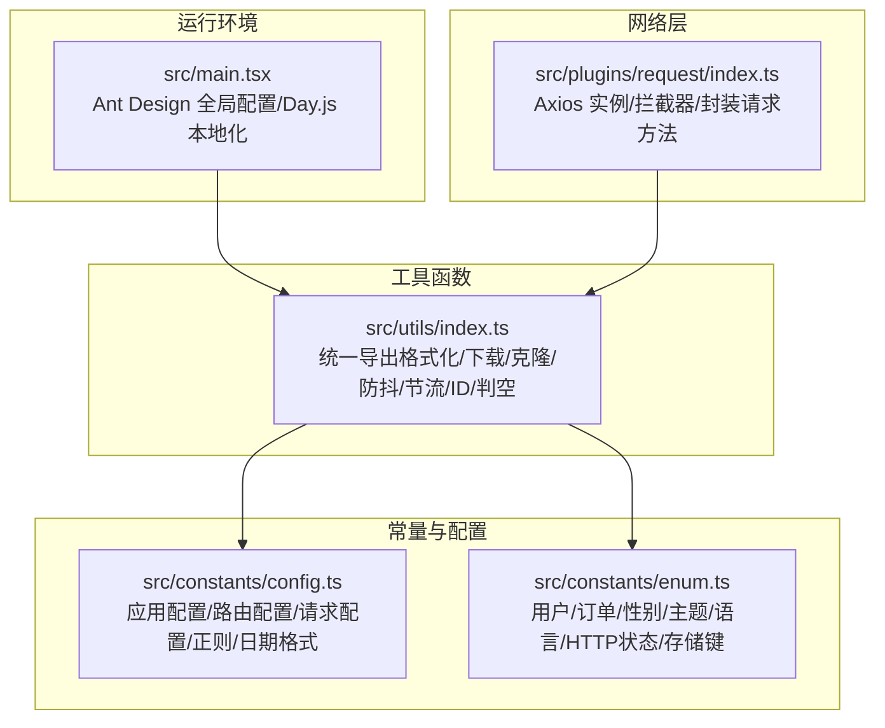
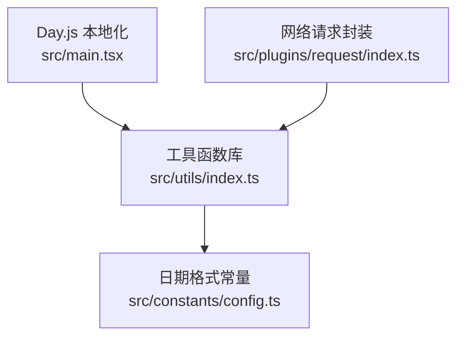
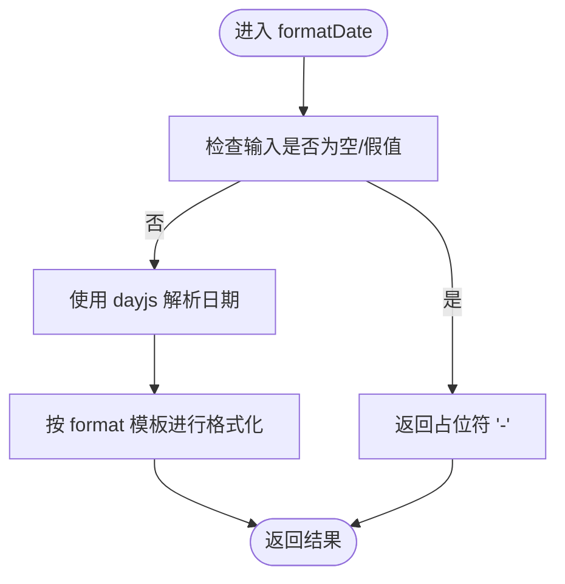
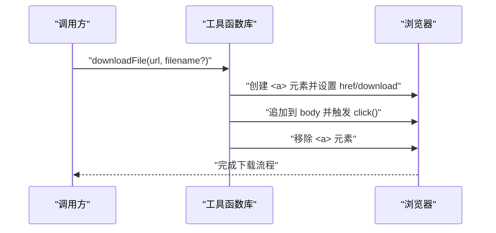
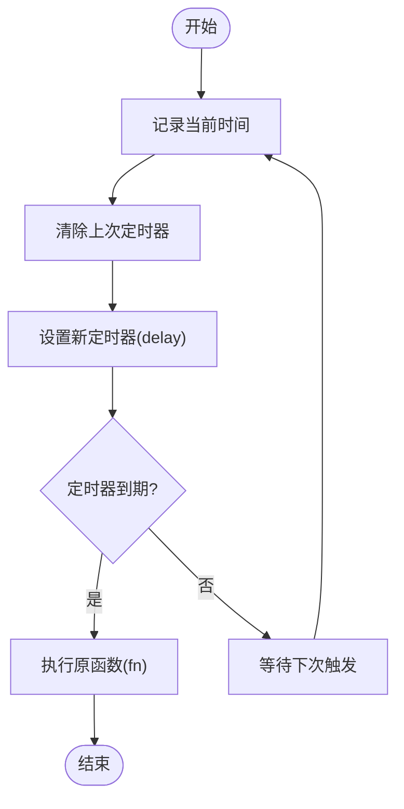
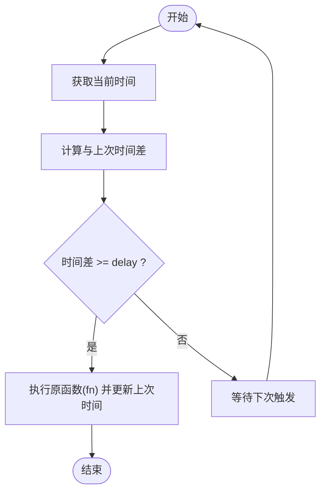
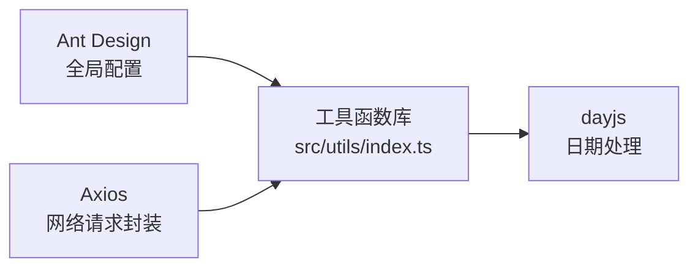

# 工具函数库

<cite>
**本文引用的文件**
- [src/utils/index.ts](file://src/utils/index.ts)
- [src/constants/config.ts](file://src/constants/config.ts)
- [src/constants/enum.ts](file://src/constants/enum.ts)
- [src/main.tsx](file://src/main.tsx)
- [src/plugins/request/index.ts](file://src/plugins/request/index.ts)
</cite>

## 目录

1. [简介](#简介)
2. [项目结构](#项目结构)
3. [核心组件](#核心组件)
4. [架构总览](#架构总览)
5. [详细组件分析](#详细组件分析)
6. [依赖分析](#依赖分析)
7. [性能考虑](#性能考虑)
8. [故障排查指南](#故障排查指南)
9. [结论](#结论)
10. [附录](#附录)

## 简介

本文件系统性梳理并说明项目中的工具函数库，重点覆盖以下方面：

- 数据格式化：日期格式化、日期时间格式化、金额格式化、数字格式化
- 文件与下载：浏览器端文件下载
- 深拷贝与空值判断：通用对象复制与空值检测
- 性能优化：防抖与节流
- 唯一ID生成：随机字符串ID
- 使用场景与最佳实践：参数说明、返回值类型、错误处理、性能考量

## 项目结构

工具函数集中于统一导出入口，便于按需引入与维护：

- 工具函数入口：src/utils/index.ts
- 常量与配置：src/constants/config.ts、src/constants/enum.ts
- 国际化与本地化：src/main.tsx 中对 dayjs 的本地化设置
- 网络请求封装：src/plugins/request/index.ts（与工具函数协同使用）

**图表来源**

- [src/utils/index.ts](file://src/utils/index.ts#L1-L106)
- [src/constants/config.ts](file://src/constants/config.ts#L1-L76)
- [src/constants/enum.ts](file://src/constants/enum.ts#L1-L70)
- [src/main.tsx](file://src/main.tsx#L1-L32)
- [src/plugins/request/index.ts](file://src/plugins/request/index.ts#L1-L114)

**章节来源**

- [src/utils/index.ts](file://src/utils/index.ts#L1-L106)
- [src/constants/config.ts](file://src/constants/config.ts#L1-L76)
- [src/constants/enum.ts](file://src/constants/enum.ts#L1-L70)
- [src/main.tsx](file://src/main.tsx#L1-L32)
- [src/plugins/request/index.ts](file://src/plugins/request/index.ts#L1-L114)

## 核心组件

本工具库提供以下核心能力：

- 日期与金额格式化：基于 dayjs 的日期格式化；金额与数字的本地化千分位格式
- 文件下载：浏览器端触发下载链接
- 深拷贝与空值判断：通用对象复制与多类型空值检测
- 性能优化：防抖与节流，降低高频事件开销
- 唯一ID生成：基于随机数的短ID
- 常量与配置：统一管理日期格式、正则、应用配置等

**章节来源**

- [src/utils/index.ts](file://src/utils/index.ts#L1-L106)
- [src/constants/config.ts](file://src/constants/config.ts#L64-L75)

## 架构总览

工具函数与全局配置、网络层的关系如下：

**图表来源**

- [src/utils/index.ts](file://src/utils/index.ts#L1-L106)
- [src/constants/config.ts](file://src/constants/config.ts#L64-L75)
- [src/main.tsx](file://src/main.tsx#L14-L15)
- [src/plugins/request/index.ts](file://src/plugins/request/index.ts#L1-L114)

## 详细组件分析

### 日期格式化与日期时间格式化

- 功能概述
  - 日期格式化：支持字符串、数值、Date 对象输入，缺省格式可自定义
  - 日期时间格式化：内置常用“年-月-日 时:分:秒”格式
- 关键点
  - 输入为空或假值时返回占位符
  - 依赖 dayjs 进行解析与格式化
  - 可结合常量 DATE_FORMAT 获取统一格式模板
- 使用建议
  - 在表格列渲染、表单展示、日志输出等场景使用
  - 与 Ant Design 的日期控件配合时，注意格式一致性
- 参数与返回
  - formatDate(date, format?): 返回字符串
  - formatDateTime(date): 返回字符串
- 错误处理
  - 非法日期输入将导致格式化失败，调用方应确保输入有效
- 复杂度
  - O(1)，字符串替换与 dayjs 解析

**图表来源**

- [src/utils/index.ts](file://src/utils/index.ts#L6-L12)
- [src/constants/config.ts](file://src/constants/config.ts#L66-L75)

**章节来源**

- [src/utils/index.ts](file://src/utils/index.ts#L6-L19)
- [src/constants/config.ts](file://src/constants/config.ts#L64-L75)
- [src/main.tsx](file://src/main.tsx#L14-L15)

### 金额格式化

- 功能概述
  - 将数值格式化为带货币符号与千分位分隔的字符串
  - 支持小数位数自定义
- 关键点
  - 空值返回占位符
  - 使用本地化千分位分隔
- 使用建议
  - 商品价格、财务报表、账单展示等
- 参数与返回
  - formatMoney(amount, decimals?): 返回字符串
- 错误处理
  - 非数值输入将被转换，非法值可能导致异常，建议先校验
- 复杂度
  - O(n)，n 为数字长度（字符串替换）

**章节来源**

- [src/utils/index.ts](file://src/utils/index.ts#L24-L27)

### 数字格式化

- 功能概述
  - 将整数或小数以千分位分隔显示
- 关键点
  - 空值返回占位符
- 使用建议
  - 统计数据、浏览量、评分等展示
- 参数与返回
  - formatNumber(num): 返回字符串
- 错误处理
  - 非数值输入将被转换，非法值可能导致异常，建议先校验
- 复杂度
  - O(n)，n 为数字长度（字符串替换）

**章节来源**

- [src/utils/index.ts](file://src/utils/index.ts#L32-L35)

### 文件下载

- 功能概述
  - 在浏览器端动态创建下载链接并触发下载
- 关键点
  - 自动从 URL 推断文件名，支持传入自定义文件名
- 使用建议
  - 后端返回文件 URL 时直接调用
- 参数与返回
  - downloadFile(url, filename?): 无返回值（void）
- 错误处理
  - URL 无效或跨域限制可能导致下载失败
- 复杂度
  - O(1)

**图表来源**

- [src/utils/index.ts](file://src/utils/index.ts#L40-L47)

**章节来源**

- [src/utils/index.ts](file://src/utils/index.ts#L40-L47)

### 深拷贝

- 功能概述
  - 使用 JSON 序列化/反序列化实现浅层深拷贝
- 关键点
  - 仅适用于可序列化对象
  - 不支持函数、undefined、Symbol、Date 等特殊类型
- 使用建议
  - 简单对象/数组的快速复制场景
- 参数与返回
  - deepClone(obj): 返回泛型 T
- 错误处理
  - 不可序列化对象会抛错
- 复杂度
  - O(n)，n 为对象大小

**章节来源**

- [src/utils/index.ts](file://src/utils/index.ts#L52-L54)

### 防抖（debounce）

- 功能概述
  - 在连续触发中仅保留最后一次调用，延迟执行
- 工作机制
  - 每次调用清除上一次定时器，重新设定新的定时器
- 适用场景
  - 搜索框输入、窗口尺寸调整、滚动事件等高频触发
- 参数与返回
  - debounce(fn, delay?): 返回包装后的函数
- 错误处理
  - 定时器清理与执行均在主线程，避免重复执行
- 复杂度
  - O(1) 每次调用；整体取决于触发频率与延迟

**图表来源**

- [src/utils/index.ts](file://src/utils/index.ts#L59-L70)

**章节来源**

- [src/utils/index.ts](file://src/utils/index.ts#L59-L70)

### 节流（throttle）

- 功能概述
  - 在固定周期内只允许一次执行
- 工作机制
  - 记录上次执行时间，若当前时间与上次间隔达到阈值则执行
- 适用场景
  - 鼠标移动、触摸滑动、滚动事件等持续触发
- 参数与返回
  - throttle(fn, delay?): 返回包装后的函数
- 错误处理
  - 严格控制执行频率，避免卡顿
- 复杂度
  - O(1) 每次调用

**图表来源**

- [src/utils/index.ts](file://src/utils/index.ts#L75-L87)

**章节来源**

- [src/utils/index.ts](file://src/utils/index.ts#L75-L87)

### 唯一ID生成

- 功能概述
  - 基于随机数生成短字符串 ID
- 关键点
  - 长度固定且较短，适合前端临时标识
- 使用建议
  - 表单临时项、列表 key、临时草稿等
- 参数与返回
  - generateId(): 返回字符串
- 错误处理
  - 无外部依赖，异常概率低
- 复杂度
  - O(1)

**章节来源**

- [src/utils/index.ts](file://src/utils/index.ts#L92-L94)

### 空值判断

- 功能概述
  - 统一判断 null、undefined、空字符串、空数组、空对象
- 关键点
  - 对字符串自动去除空白后判断
- 使用建议
  - 表单校验、条件渲染、数据清洗
- 参数与返回
  - isEmpty(value): 返回布尔值
- 错误处理
  - 无异常抛出
- 复杂度
  - O(1)（字符串 trim 为 O(n)），数组/对象为 O(1)

**章节来源**

- [src/utils/index.ts](file://src/utils/index.ts#L99-L105)

## 依赖分析

- dayjs：用于日期解析与格式化
- Ant Design：全局语言与主题配置，影响日期显示与交互
- Axios：网络层封装，与工具函数协同进行数据请求与错误提示

**图表来源**

- [src/utils/index.ts](file://src/utils/index.ts#L1)
- [src/main.tsx](file://src/main.tsx#L19-L26)
- [src/plugins/request/index.ts](file://src/plugins/request/index.ts#L1-L114)

**章节来源**

- [src/utils/index.ts](file://src/utils/index.ts#L1)
- [src/main.tsx](file://src/main.tsx#L1-L32)
- [src/plugins/request/index.ts](file://src/plugins/request/index.ts#L1-L114)

## 性能考虑

- 防抖与节流
  - 防抖适合“最终态”稳定后再执行（如搜索），减少请求次数
  - 节流适合“持续动作”中限流（如滚动），保证帧率
- 深拷贝
  - JSON 方法简单高效，但不支持复杂类型；大对象深拷贝建议使用结构化克隆或专用库
- 日期格式化
  - dayjs 本地化已在入口设置，避免重复初始化
- 数字与金额格式化
  - 千分位替换为 O(n) 操作，建议在渲染前完成，避免频繁重复格式化

[本节为通用性能建议，不直接分析具体文件]

## 故障排查指南

- 日期格式化无效
  - 检查输入是否为合法日期类型；确认 dayjs 本地化已生效
- 金额/数字格式化异常
  - 确认传入为数值类型；非数值将被转换，可能导致异常
- 深拷贝报错
  - 对包含函数、Symbol、Date 等不可序列化属性的对象无效
- 防抖/节流无效
  - 确认包装函数的 this 绑定与参数传递正确
- 文件下载失败
  - 检查 URL 是否有效、是否存在跨域限制

**章节来源**

- [src/utils/index.ts](file://src/utils/index.ts#L6-L12)
- [src/utils/index.ts](file://src/utils/index.ts#L24-L27)
- [src/utils/index.ts](file://src/utils/index.ts#L32-L35)
- [src/utils/index.ts](file://src/utils/index.ts#L52-L54)
- [src/utils/index.ts](file://src/utils/index.ts#L59-L70)
- [src/utils/index.ts](file://src/utils/index.ts#L75-L87)
- [src/utils/index.ts](file://src/utils/index.ts#L40-L47)
- [src/main.tsx](file://src/main.tsx#L14-L15)

## 结论

该工具函数库提供了项目中最常用的格式化、下载、克隆、去抖动与节流、ID 生成、空值判断等能力。通过与 dayjs、Ant Design、Axios 的协同，能够满足前端开发中的常见需求。建议在实际使用中：

- 明确各函数的适用范围与限制
- 在高频事件中优先采用防抖/节流
- 对大对象深拷贝谨慎选择方案
- 统一日期格式与本地化策略

[本节为总结性内容，不直接分析具体文件]

## 附录

- 常用日期格式常量参考
  - 完整日期时间：YYYY-MM-DD HH:mm:ss
  - 日期：YYYY-MM-DD
  - 时间：HH:mm:ss
  - 年月：YYYY-MM

**章节来源**

- [src/constants/config.ts](file://src/constants/config.ts#L66-L75)
