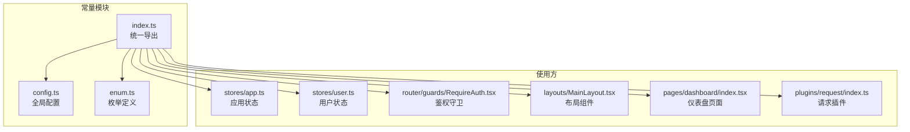
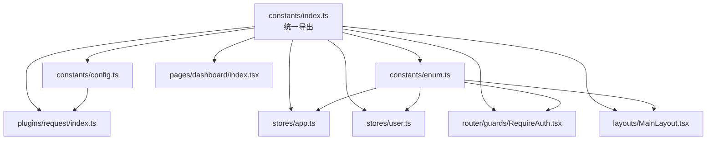
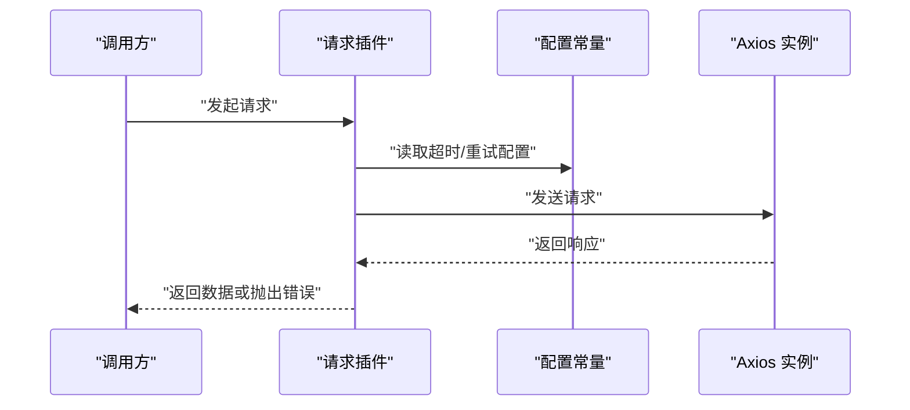
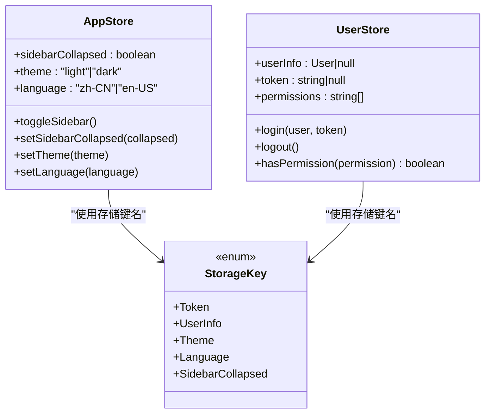
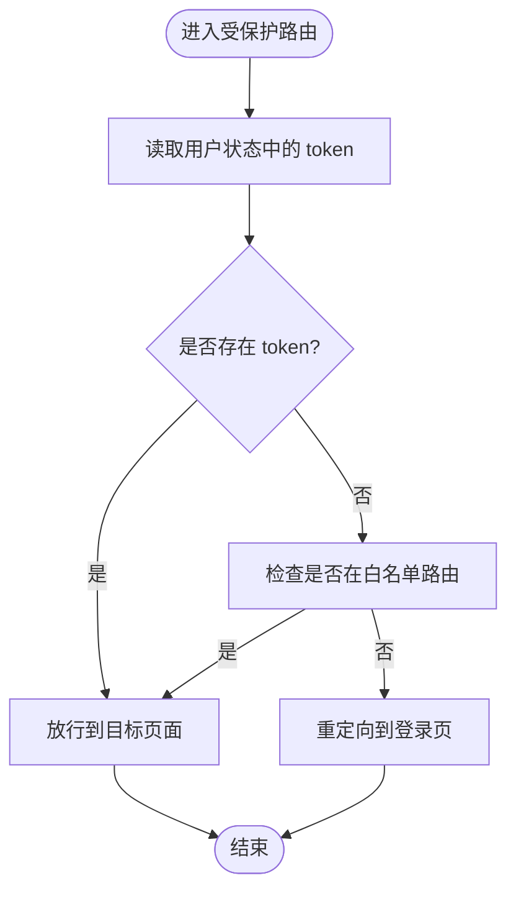
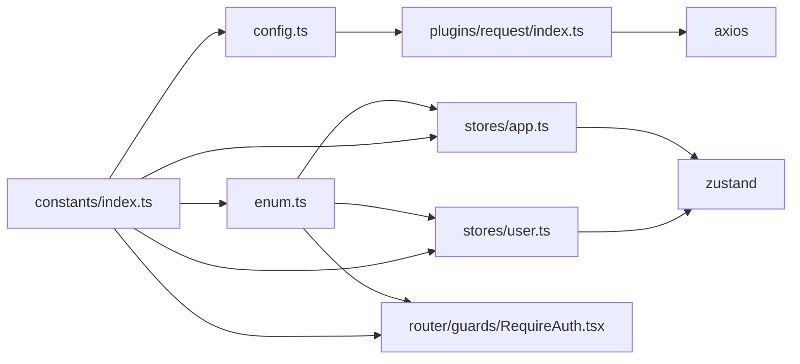

# 常量定义

<cite>
**本文引用的文件**
- [src/constants/config.ts](file://src/constants/config.ts)
- [src/constants/enum.ts](file://src/constants/enum.ts)
- [src/constants/index.ts](file://src/constants/index.ts)
- [src/plugins/request/index.ts](file://src/plugins/request/index.ts)
- [src/stores/app.ts](file://src/stores/app.ts)
- [src/stores/user.ts](file://src/stores/user.ts)
- [src/router/guards/RequireAuth.tsx](file://src/router/guards/RequireAuth.tsx)
- [src/layouts/MainLayout.tsx](file://src/layouts/MainLayout.tsx)
- [src/pages/dashboard/index.tsx](file://src/pages/dashboard/index.tsx)
- [package.json](file://package.json)
</cite>

## 目录

1. [简介](#简介)
2. [项目结构](#项目结构)
3. [核心组件](#核心组件)
4. [架构总览](#架构总览)
5. [详细组件分析](#详细组件分析)
6. [依赖分析](#依赖分析)
7. [性能考量](#性能考量)
8. [故障排查指南](#故障排查指南)
9. [结论](#结论)
10. [附录](#附录)

## 简介

本文件系统化梳理了项目的常量定义体系，覆盖配置常量、枚举值与静态数据的组织策略与命名规范，并对 config.ts 中的全局配置项（应用信息、路由、请求、正则与日期格式）进行深入解析；对 enum.ts 中的状态、类型、权限等枚举进行标准化说明。同时提供最佳实践建议（导入导出方式、类型安全、重构友好性），并给出可扩展的使用示例与维护指南，帮助开发者正确、一致地使用与演进常量定义。

## 项目结构

常量相关的核心文件位于 src/constants 目录，采用按职责拆分的模块化组织：

- config.ts：集中管理全局配置项（应用、路由、请求、正则、日期格式）
- enum.ts：集中管理各类枚举（用户状态、订单状态、性别、主题、语言、HTTP 状态码、存储键名）
- index.ts：统一导出，便于在应用中集中引入

图表来源

- [src/constants/index.ts](file://src/constants/index.ts#L1-L4)
- [src/constants/config.ts](file://src/constants/config.ts#L1-L76)
- [src/constants/enum.ts](file://src/constants/enum.ts#L1-L70)
- [src/stores/app.ts](file://src/stores/app.ts#L1-L59)
- [src/stores/user.ts](file://src/stores/user.ts#L1-L76)
- [src/router/guards/RequireAuth.tsx](file://src/router/guards/RequireAuth.tsx#L1-L25)
- [src/layouts/MainLayout.tsx](file://src/layouts/MainLayout.tsx#L1-L174)
- [src/pages/dashboard/index.tsx](file://src/pages/dashboard/index.tsx#L1-L170)
- [src/plugins/request/index.ts](file://src/plugins/request/index.ts#L1-L114)

章节来源

- [src/constants/index.ts](file://src/constants/index.ts#L1-L4)

## 核心组件

本节聚焦两类核心常量：配置常量与枚举常量，说明其职责边界、命名规范与使用方式。

- 配置常量（config.ts）
  - 应用配置：应用名称、版本、默认分页大小、分页选项、默认语言、默认主题、Token 过期天数
  - 路由配置：登录页路径、首页路径、白名单路由集合
  - 请求配置：超时时间、重试次数、重试延迟（基础 URL 可通过环境变量注入）
  - 正则表达式：手机号、邮箱、密码、URL、身份证号
  - 日期格式：完整日期时间、日期、时间、年月

- 枚举常量（enum.ts）
  - 用户状态：激活、非激活、禁用
  - 订单状态：待支付、处理中、已发货、已完成、已取消
  - 性别：男、女、其他
  - 主题模式：亮色、暗色、自动
  - 语言：简体中文、美国英语
  - HTTP 状态码：200、201、400、401、403、404、500
  - 存储键名：token、用户信息、主题、语言、侧边栏折叠状态

章节来源

- [src/constants/config.ts](file://src/constants/config.ts#L1-L76)
- [src/constants/enum.ts](file://src/constants/enum.ts#L1-L70)

## 架构总览

下图展示常量在系统中的使用关系：统一导出入口负责聚合配置与枚举；状态层（Zustand）、路由守卫、布局与页面组件通过统一入口按需引入；请求插件在运行时读取请求配置并执行业务逻辑。

图表来源

- [src/constants/index.ts](file://src/constants/index.ts#L1-L4)
- [src/constants/config.ts](file://src/constants/config.ts#L1-L76)
- [src/constants/enum.ts](file://src/constants/enum.ts#L1-L70)
- [src/stores/app.ts](file://src/stores/app.ts#L1-L59)
- [src/stores/user.ts](file://src/stores/user.ts#L1-L76)
- [src/router/guards/RequireAuth.tsx](file://src/router/guards/RequireAuth.tsx#L1-L25)
- [src/layouts/MainLayout.tsx](file://src/layouts/MainLayout.tsx#L1-L174)
- [src/pages/dashboard/index.tsx](file://src/pages/dashboard/index.tsx#L1-L170)
- [src/plugins/request/index.ts](file://src/plugins/request/index.ts#L1-L114)

## 详细组件分析

### 配置常量（config.ts）设计与使用

- 设计要点
  - 模块化分组：将应用、路由、请求、正则、日期格式分别置于独立对象中，提升可维护性与可读性
  - 类型安全：通过字面量类型与联合类型约束默认语言、主题等字段，降低运行时错误
  - 环境变量集成：请求基础 URL 支持通过 Vite 环境变量注入，便于多环境切换
  - 可扩展性：新增配置项遵循“分组+注释”的命名规范，避免命名冲突

- 使用场景
  - 请求插件：读取超时、重试次数与延迟，构建统一的请求行为
  - 路由守卫：结合白名单路由实现免登录访问控制
  - 布局与页面：用于国际化与主题初始化、表单校验与日期显示格式

- 最佳实践
  - 新增配置项时，先在对应分组内添加，再在统一导出处确认暴露
  - 对于需要跨模块共享的配置，优先通过统一导出入口引入，避免直接相对路径导入
  - 环境变量相关配置建议在构建阶段注入，运行时保持只读

章节来源

- [src/constants/config.ts](file://src/constants/config.ts#L1-L76)
- [src/plugins/request/index.ts](file://src/plugins/request/index.ts#L1-L114)
- [src/router/guards/RequireAuth.tsx](file://src/router/guards/RequireAuth.tsx#L1-L25)

### 枚举常量（enum.ts）设计与使用

- 设计要点
  - 语义化命名：枚举项采用全大写与下划线风格，清晰表达含义
  - 类型安全：字符串枚举与数值枚举并存，满足不同场景（如 HTTP 状态码）
  - 聚合管理：将状态、类型、权限等分类组织，便于查找与复用

- 使用场景
  - 应用状态：主题模式、语言选择、侧边栏折叠状态
  - 用户与订单：用户状态、订单状态、性别
  - 权限与存储：存储键名、权限判断

- 最佳实践
  - 在状态层与工具函数中优先使用枚举，避免魔法字符串
  - 枚举项变更时，同步更新相关断言与转换逻辑，确保类型推导正确
  - 对外暴露的枚举建议通过统一导出入口集中管理

章节来源

- [src/constants/enum.ts](file://src/constants/enum.ts#L1-L70)
- [src/stores/app.ts](file://src/stores/app.ts#L1-L59)
- [src/stores/user.ts](file://src/stores/user.ts#L1-L76)

### 统一导出（constants/index.ts）

- 设计要点
  - 通过“\* from”语法聚合导出配置与枚举，简化外部导入
  - 保持导出顺序稳定，避免破坏现有导入位置

- 使用建议
  - 外部模块通过统一入口引入常量，减少导入路径碎片化
  - 新增常量文件时，及时在统一导出中声明，确保被正确暴露

章节来源

- [src/constants/index.ts](file://src/constants/index.ts#L1-L4)

### 请求插件与配置常量的交互

- 关系映射
  - 请求插件读取请求配置中的超时、重试策略，封装统一的请求方法
  - 基础 URL 可通过环境变量注入，实现多环境隔离

图表来源

- [src/plugins/request/index.ts](file://src/plugins/request/index.ts#L1-L114)
- [src/constants/config.ts](file://src/constants/config.ts#L36-L45)

章节来源

- [src/plugins/request/index.ts](file://src/plugins/request/index.ts#L1-L114)
- [src/constants/config.ts](file://src/constants/config.ts#L36-L45)

### 状态层与枚举常量的交互

- 关系映射
  - 应用状态与用户状态均使用枚举值作为类型约束，确保状态合法
  - 存储键名枚举用于本地持久化键名的一致性

图表来源

- [src/stores/app.ts](file://src/stores/app.ts#L1-L59)
- [src/stores/user.ts](file://src/stores/user.ts#L1-L76)
- [src/constants/enum.ts](file://src/constants/enum.ts#L60-L70)

章节来源

- [src/stores/app.ts](file://src/stores/app.ts#L1-L59)
- [src/stores/user.ts](file://src/stores/user.ts#L1-L76)
- [src/constants/enum.ts](file://src/constants/enum.ts#L60-L70)

### 路由守卫与配置常量的交互

- 关系映射
  - 路由守卫通过读取用户状态中的 token 判断是否放行
  - 白名单路由来自配置常量，支持免登录访问

图表来源

- [src/router/guards/RequireAuth.tsx](file://src/router/guards/RequireAuth.tsx#L1-L25)
- [src/constants/config.ts](file://src/constants/config.ts#L24-L31)
- [src/stores/user.ts](file://src/stores/user.ts#L1-L76)

章节来源

- [src/router/guards/RequireAuth.tsx](file://src/router/guards/RequireAuth.tsx#L1-L25)
- [src/constants/config.ts](file://src/constants/config.ts#L24-L31)
- [src/stores/user.ts](file://src/stores/user.ts#L1-L76)

## 依赖分析

- 内聚性
  - 常量模块内部高内聚：配置与枚举各自独立，职责清晰
- 耦合度
  - 统一导出入口降低外部耦合，便于替换与扩展
  - 请求插件与配置常量存在直接依赖，但可通过环境变量解耦基础 URL
- 外部依赖
  - 请求插件依赖 axios 与 antd 的消息提示组件
  - 状态层依赖 zustand 与持久化中间件

图表来源

- [src/constants/config.ts](file://src/constants/config.ts#L1-L76)
- [src/constants/enum.ts](file://src/constants/enum.ts#L1-L70)
- [src/constants/index.ts](file://src/constants/index.ts#L1-L4)
- [src/plugins/request/index.ts](file://src/plugins/request/index.ts#L1-L114)
- [src/stores/app.ts](file://src/stores/app.ts#L1-L59)
- [src/stores/user.ts](file://src/stores/user.ts#L1-L76)
- [src/router/guards/RequireAuth.tsx](file://src/router/guards/RequireAuth.tsx#L1-L25)

章节来源

- [package.json](file://package.json#L20-L36)

## 性能考量

- 常量读取开销极低：常量在编译期即确定，运行时仅做属性访问
- 统一导出避免重复导入：减少模块解析成本
- 枚举与类型约束有助于编译期优化：TypeScript 可在编译阶段消除冗余分支

## 故障排查指南

- 常量未生效
  - 检查是否通过统一导出入口引入
  - 确认配置项所在分组与命名是否正确
- 请求异常
  - 核对请求配置中的超时与重试参数
  - 检查基础 URL 是否通过环境变量正确注入
- 路由跳转异常
  - 核对白名单路由列表与当前路径
  - 确认用户状态中的 token 是否存在且有效
- 状态不一致
  - 检查存储键名是否与枚举一致
  - 确认持久化中间件的序列化范围是否覆盖所需字段

章节来源

- [src/plugins/request/index.ts](file://src/plugins/request/index.ts#L1-L114)
- [src/constants/config.ts](file://src/constants/config.ts#L36-L45)
- [src/router/guards/RequireAuth.tsx](file://src/router/guards/RequireAuth.tsx#L1-L25)
- [src/stores/app.ts](file://src/stores/app.ts#L49-L57)
- [src/stores/user.ts](file://src/stores/user.ts#L67-L74)

## 结论

本常量定义体系以模块化、类型安全与统一导出为核心设计原则，既满足当前功能需求，又具备良好的扩展性与可维护性。建议在后续演进中持续遵循命名规范与分组策略，配合统一导出入口，确保常量在团队内的使用一致性与稳定性。

## 附录

### 命名规范与组织策略

- 配置常量
  - 使用名词短语命名分组，如 APP_CONFIG、ROUTE_CONFIG、REQUEST_CONFIG、REGEX、DATE_FORMAT
  - 字段采用驼峰命名，值类型明确（字符串、数字、数组、对象）
- 枚举常量
  - 使用名词短语命名枚举类型，如 UserStatus、OrderStatus、Gender、ThemeMode、Language、HttpStatus、StorageKey
  - 枚举项采用全大写与下划线风格，如 ACTIVE、INACTIVE、PENDING、PROCESSING 等

### 导入导出最佳实践

- 统一通过 constants/index.ts 导出，外部模块仅从该入口引入
- 新增常量文件时，同步在统一导出中声明，避免遗漏
- 对于跨模块共享的常量，优先使用统一导出入口，避免直接相对路径导入

### 类型安全与重构友好性

- 使用字面量类型与联合类型约束配置常量，减少运行时错误
- 枚举优先于字符串字面量，提升可读性与可维护性
- 对外暴露的枚举与配置项尽量保持稳定，变更时提供迁移指引

### 使用示例与扩展指南

- 示例：在请求插件中读取请求配置并封装统一方法
  - 参考路径：[src/plugins/request/index.ts](file://src/plugins/request/index.ts#L1-L114)
- 示例：在路由守卫中使用白名单路由与用户 token 控制访问
  - 参考路径：[src/router/guards/RequireAuth.tsx](file://src/router/guards/RequireAuth.tsx#L1-L25)
- 示例：在状态层中使用枚举与存储键名
  - 参考路径：[src/stores/app.ts](file://src/stores/app.ts#L1-L59)，[src/stores/user.ts](file://src/stores/user.ts#L1-L76)
- 扩展建议：新增配置项时，先在对应分组内添加，再在统一导出中确认暴露；新增枚举时，先在 enum.ts 中定义，再在使用方中引入
