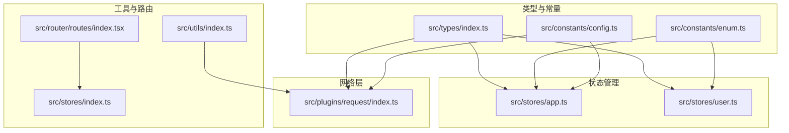
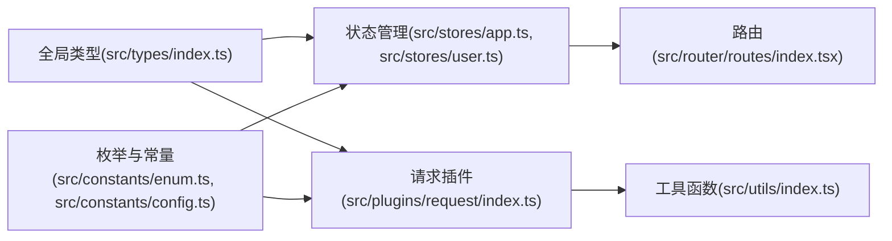
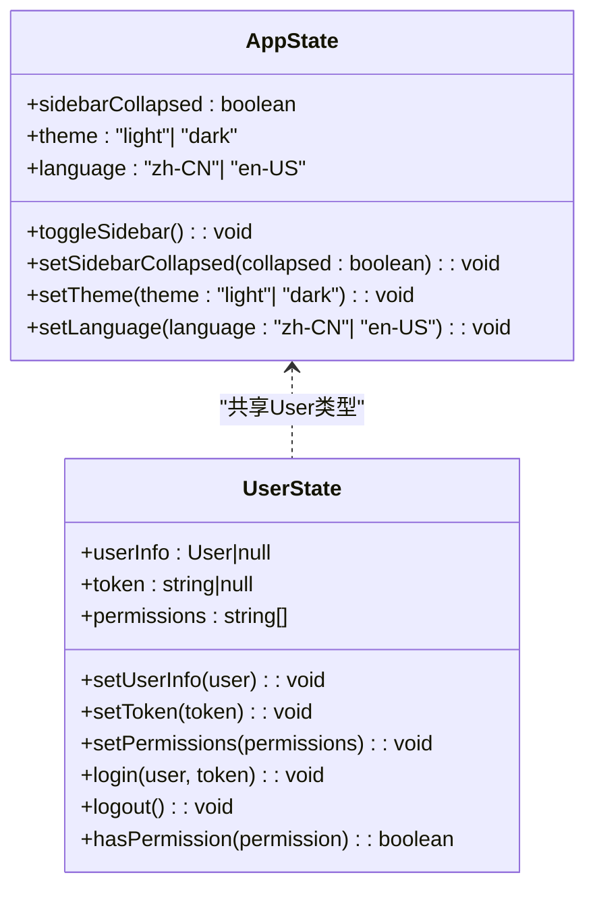
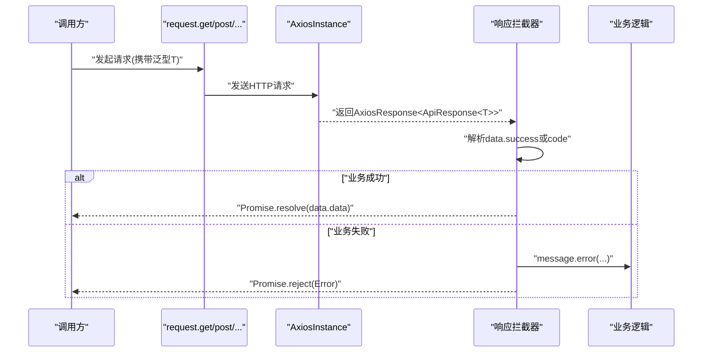
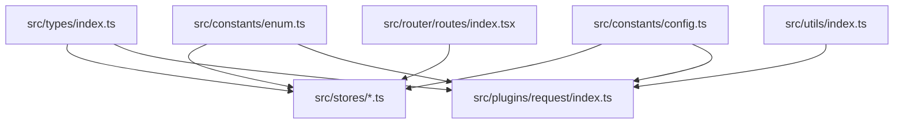

# 类型定义

<cite>
**本文引用的文件**
- [src/types/index.ts](file://src/types/index.ts)
- [src/constants/enum.ts](file://src/constants/enum.ts)
- [src/constants/config.ts](file://src/constants/config.ts)
- [src/stores/app.ts](file://src/stores/app.ts)
- [src/stores/user.ts](file://src/stores/user.ts)
- [src/plugins/request/index.ts](file://src/plugins/request/index.ts)
- [src/utils/index.ts](file://src/utils/index.ts)
- [src/router/routes/index.tsx](file://src/router/routes/index.tsx)
- [src/stores/index.ts](file://src/stores/index.ts)
</cite>

## 目录

1. [简介](#简介)
2. [项目结构](#项目结构)
3. [核心组件](#核心组件)
4. [架构总览](#架构总览)
5. [详细组件分析](#详细组件分析)
6. [依赖分析](#依赖分析)
7. [性能考虑](#性能考虑)
8. [故障排查指南](#故障排查指南)
9. [结论](#结论)
10. [附录](#附录)

## 简介

本文件系统性梳理本项目的类型定义体系，围绕全局类型、接口与类型别名、枚举、泛型约束、高级类型特性（类型推导、条件类型、映射类型）、API响应与表单数据建模、状态类型标准化、以及类型安全编程最佳实践展开。目标是帮助开发者在日常开发中高效、安全地使用 TypeScript 的类型系统，减少运行时错误并提升可维护性。

## 项目结构

类型定义主要分布在以下位置：

- 全局类型：src/types/index.ts
- 枚举与常量：src/constants/enum.ts、src/constants/config.ts
- 状态管理类型：src/stores/app.ts、src/stores/user.ts
- 请求插件类型：src/plugins/request/index.ts
- 工具函数类型：src/utils/index.ts
- 路由与导出：src/router/routes/index.tsx、src/stores/index.ts



图表来源

- [src/types/index.ts](file://src/types/index.ts#L1-L101)
- [src/constants/enum.ts](file://src/constants/enum.ts#L1-L70)
- [src/constants/config.ts](file://src/constants/config.ts#L1-L76)
- [src/stores/app.ts](file://src/stores/app.ts#L1-L59)
- [src/stores/user.ts](file://src/stores/user.ts#L1-L76)
- [src/plugins/request/index.ts](file://src/plugins/request/index.ts#L1-L114)
- [src/utils/index.ts](file://src/utils/index.ts#L1-L106)
- [src/router/routes/index.tsx](file://src/router/routes/index.tsx#L1-L31)
- [src/stores/index.ts](file://src/stores/index.ts#L1-L3)

章节来源

- [src/types/index.ts](file://src/types/index.ts#L1-L101)
- [src/constants/enum.ts](file://src/constants/enum.ts#L1-L70)
- [src/constants/config.ts](file://src/constants/config.ts#L1-L76)
- [src/stores/app.ts](file://src/stores/app.ts#L1-L59)
- [src/stores/user.ts](file://src/stores/user.ts#L1-L76)
- [src/plugins/request/index.ts](file://src/plugins/request/index.ts#L1-L114)
- [src/utils/index.ts](file://src/utils/index.ts#L1-L106)
- [src/router/routes/index.tsx](file://src/router/routes/index.tsx#L1-L31)
- [src/stores/index.ts](file://src/stores/index.ts#L1-L3)

## 核心组件

本节聚焦全局类型定义与常用类型别名，涵盖分页、用户、路由元信息、菜单项、表格列、表单字段、API响应与错误等。

- 分页数据与查询
  - PageData<T>：包含列表、总数、当前页、每页条数
  - PageQuery：分页查询参数（可选页码与页大小）
- 用户与权限
  - User：用户实体，包含标识、昵称、邮箱、电话、头像、状态、时间戳等
  - 权限数组：字符串数组用于权限校验
- 路由与菜单
  - RouteMeta：路由元信息（标题、图标、是否隐藏、是否缓存、权限）
  - MenuItem：菜单项（键、路径、名称、图标、子项、元信息）
- 表格与表单
  - TableColumn<T>：表格列配置，支持泛型约束 T，列字段名为 T 的属性或字符串
  - FormField<T>：表单字段配置，支持多种输入类型、必填、规则、占位符、选项等
- API 响应与错误
  - ApiResponse<T>：统一响应包装，包含状态码、数据体、消息、成功标志
  - ApiError：统一错误结构，包含错误码、消息与可选详情

章节来源

- [src/types/index.ts](file://src/types/index.ts#L3-L101)

## 架构总览

全局类型通过统一入口导出，被状态管理、请求插件、工具函数与路由模块广泛复用。下图展示类型定义与各模块的耦合关系：



图表来源

- [src/types/index.ts](file://src/types/index.ts#L1-L101)
- [src/constants/enum.ts](file://src/constants/enum.ts#L1-L70)
- [src/constants/config.ts](file://src/constants/config.ts#L1-L76)
- [src/stores/app.ts](file://src/stores/app.ts#L1-L59)
- [src/stores/user.ts](file://src/stores/user.ts#L1-L76)
- [src/plugins/request/index.ts](file://src/plugins/request/index.ts#L1-L114)
- [src/utils/index.ts](file://src/utils/index.ts#L1-L106)
- [src/router/routes/index.tsx](file://src/router/routes/index.tsx#L1-L31)

## 详细组件分析

### 全局类型与接口族

- 设计理念
  - 以“可复用、可扩展、可维护”为核心，将通用数据模型抽象为稳定接口
  - 使用泛型约束（如 T）实现跨模块的数据一致性
  - 通过只读/可选字段明确数据可变性与完整性
- 关键接口
  - PageData<T>、PageQuery：支撑分页查询与渲染
  - User：统一用户模型，配合枚举与状态管理
  - RouteMeta、MenuItem：支撑菜单与路由元信息
  - TableColumn<T>、FormField<T>：支撑表格与表单的类型安全配置
  - ApiResponse<T>、ApiError：统一前后端交互契约

```mermaid
classDiagram
class PageData_T_ {
+list : T[]
+total : number
+page : number
+pageSize : number
}
class PageQuery {
+page? : number
+pageSize? : number
}
class User {
+id : string
+username : string
+nickname? : string
+email? : string
+phone? : string
+avatar? : string
+status : "active"|"inactive"
+createTime : string
+updateTime? : string
}
class RouteMeta {
+title : string
+icon? : string
+hidden? : boolean
+keepAlive? : boolean
+permission? : string|string[]
}
class MenuItem {
+key : string
+path : string
+name : string
+icon? : string
+children? : MenuItem[]
+meta? : RouteMeta
}
class TableColumn_T_ {
+title : string
+dataIndex : keyof T|string
+key : string
+width? : number
+align? : "left"|"center"|"right"
+render? : (value, record, index)=>ReactNode
+sorter? : boolean|fn(a,b)
+filters? : {text,value}[]
}
class FormField_T_ {
+name : keyof T|string
+label : string
+type : enum
+required? : boolean
+rules? : unknown[]
+placeholder? : string
+options? : {label,value}[]
+span? : number
+disabled? : boolean
+hidden? : boolean
}
class ApiResponse_T_ {
+code : number
+data : T
+message : string
+success : boolean
}
class ApiError {
+code : string
+message : string
+details? : unknown
}
```

图表来源

- [src/types/index.ts](file://src/types/index.ts#L3-L101)

章节来源

- [src/types/index.ts](file://src/types/index.ts#L3-L101)

### 枚举与常量类型

- 枚举用途
  - 用户状态、订单状态、性别、主题模式、语言、HTTP 状态码、存储键名
- 设计要点
  - 使用字面量联合类型与枚举保持取值范围可控
  - 常量对象（如 APP_CONFIG、ROUTE_CONFIG、REQUEST_CONFIG）采用字面量类型确保默认值不可误改
- 在状态管理中的应用
  - 应用状态（主题、语言）与枚举值对齐，避免魔法字符串

章节来源

- [src/constants/enum.ts](file://src/constants/enum.ts#L1-L70)
- [src/constants/config.ts](file://src/constants/config.ts#L1-L76)
- [src/stores/app.ts](file://src/stores/app.ts#L5-L16)

### 状态类型与状态管理

- 应用状态（AppStore）
  - 字段：侧边栏折叠状态、主题、语言
  - 动作：切换折叠、设置主题、设置语言
- 用户状态（UserStore）
  - 字段：用户信息、令牌、权限集合
  - 动作：设置用户、设置令牌、设置权限、登录、登出、权限校验
- 类型安全要点
  - 使用接口约束状态结构
  - 通过类型守卫与可选链保证访问安全



图表来源

- [src/stores/app.ts](file://src/stores/app.ts#L5-L16)
- [src/stores/user.ts](file://src/stores/user.ts#L6-L19)
- [src/types/index.ts](file://src/types/index.ts#L17-L28)

章节来源

- [src/stores/app.ts](file://src/stores/app.ts#L1-L59)
- [src/stores/user.ts](file://src/stores/user.ts#L1-L76)
- [src/types/index.ts](file://src/types/index.ts#L17-L28)

### 请求插件与 API 响应类型

- 插件职责
  - 创建 Axios 实例，注入请求/响应拦截器
  - 统一封装 GET/POST/PUT/DELETE/PATCH 方法，返回泛型 T
- 类型契约
  - 响应拦截器基于 ApiResponse<T> 解析业务成功/失败
  - 错误处理根据 HTTP 状态码进行提示与跳转
- 使用建议
  - 对外仅暴露 request.get/post/...，内部统一收敛错误处理
  - 通过泛型参数明确返回数据结构，避免 any



图表来源

- [src/plugins/request/index.ts](file://src/plugins/request/index.ts#L11-L114)
- [src/types/index.ts](file://src/types/index.ts#L87-L101)

章节来源

- [src/plugins/request/index.ts](file://src/plugins/request/index.ts#L1-L114)
- [src/types/index.ts](file://src/types/index.ts#L87-L101)

### 工具函数与高级类型特性

- 泛型与类型推导
  - 深拷贝：使用泛型 T 保持入参与返回一致
  - 防抖/节流：使用泛型约束回调签名，自动推导参数类型
- 条件类型与映射类型
  - 可结合工具类型（如 Partial、Pick、Omit、Record 等）进一步增强类型表达力
  - 示例场景：根据表单字段动态生成表单数据类型；根据 API 返回动态推导响应类型
- 最佳实践
  - 明确函数入参与返回值的泛型边界
  - 使用类型守卫与可选链避免运行时异常

章节来源

- [src/utils/index.ts](file://src/utils/index.ts#L52-L87)

### 路由与导出

- 路由组织
  - 主布局包裹鉴权守卫，统一聚合认证、仪表盘、错误页面路由
- 导出策略
  - stores/index.ts 统一导出 useUserStore 与 useAppStore，便于上层按需引入

章节来源

- [src/router/routes/index.tsx](file://src/router/routes/index.tsx#L1-L31)
- [src/stores/index.ts](file://src/stores/index.ts#L1-L3)

## 依赖分析

- 内聚与解耦
  - 全局类型集中于 types/index.ts，其他模块仅通过接口导入，降低耦合
  - 枚举与常量独立于业务逻辑，便于跨模块复用
- 外部依赖
  - 请求插件依赖 axios 与 antd message，响应拦截器依赖全局类型 ApiResponse<T>
  - 状态管理依赖 zustand/persist/immer，类型与全局类型强绑定



图表来源

- [src/types/index.ts](file://src/types/index.ts#L1-L101)
- [src/constants/enum.ts](file://src/constants/enum.ts#L1-L70)
- [src/constants/config.ts](file://src/constants/config.ts#L1-L76)
- [src/stores/app.ts](file://src/stores/app.ts#L1-L59)
- [src/stores/user.ts](file://src/stores/user.ts#L1-L76)
- [src/plugins/request/index.ts](file://src/plugins/request/index.ts#L1-L114)
- [src/utils/index.ts](file://src/utils/index.ts#L1-L106)
- [src/router/routes/index.tsx](file://src/router/routes/index.tsx#L1-L31)

章节来源

- [src/types/index.ts](file://src/types/index.ts#L1-L101)
- [src/stores/app.ts](file://src/stores/app.ts#L1-L59)
- [src/stores/user.ts](file://src/stores/user.ts#L1-L76)
- [src/plugins/request/index.ts](file://src/plugins/request/index.ts#L1-L114)
- [src/utils/index.ts](file://src/utils/index.ts#L1-L106)
- [src/router/routes/index.tsx](file://src/router/routes/index.tsx#L1-L31)

## 性能考虑

- 类型层面
  - 避免在类型中引入不必要的深度嵌套，减少编译时负担
  - 合理使用映射类型与条件类型，避免过度复杂化
- 运行时层面
  - 工具函数（防抖/节流）通过延迟控制减少高频事件触发
  - 请求插件统一错误处理，避免重复分支判断

## 故障排查指南

- 常见问题
  - API 响应未按约定结构返回：检查响应拦截器对 success/code 的判定逻辑
  - 状态更新不生效：确认状态管理动作是否正确调用与持久化配置
  - 表单/表格列配置类型不匹配：核对 TableColumn<T>/FormField<T> 的 dataIndex/name 与数据模型一致
- 排查步骤
  - 在请求插件中打印响应结构，确认 ApiResponse<T> 的 data 字段
  - 在状态管理中打印 store 状态，确认 action 是否执行
  - 在工具函数中增加类型断言与守卫，定位类型不兼容点

章节来源

- [src/plugins/request/index.ts](file://src/plugins/request/index.ts#L34-L76)
- [src/stores/app.ts](file://src/stores/app.ts#L18-L58)
- [src/stores/user.ts](file://src/stores/user.ts#L21-L75)
- [src/types/index.ts](file://src/types/index.ts#L49-L85)

## 结论

本项目的类型定义体系以全局接口为中心，结合枚举与常量，覆盖状态管理、请求插件与工具函数的关键场景。通过泛型约束与类型守卫，实现了跨模块的一致性与安全性。建议在后续迭代中持续完善映射类型与条件类型的使用，进一步提升类型表达能力与可维护性。

## 附录

- 类型安全最佳实践清单
  - 使用接口而非内联类型，确保复用与演进
  - 对外暴露的 API 返回使用泛型，明确数据结构
  - 使用类型守卫与可选链，避免运行时访问空值
  - 将枚举与常量作为“权威来源”，避免魔法字符串
  - 在状态管理中严格区分状态与动作，保持类型清晰
- 扩展指南
  - 新增领域模型时，优先在 types/index.ts 中定义接口
  - 为 API 新增响应类型时，遵循 ApiResponse<T> 约定
  - 为表单/表格新增配置时，使用 FormField<T>/TableColumn<T>，并与数据模型对齐
  - 为状态新增字段时，先在对应 Store 接口定义，再实现 action
