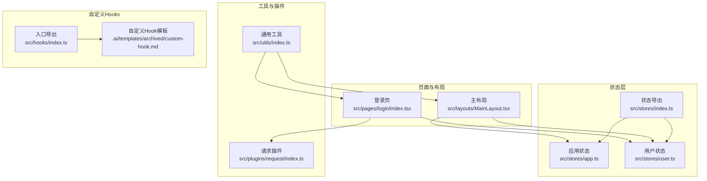
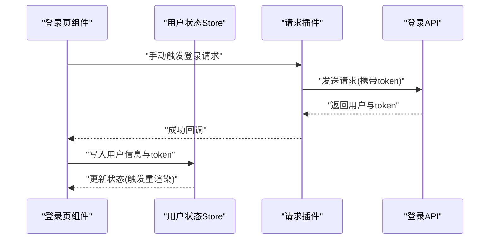
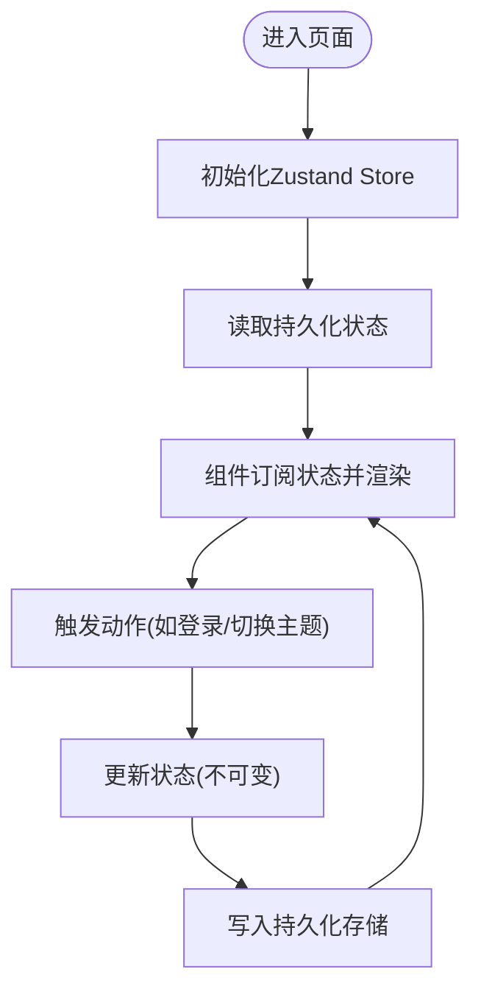
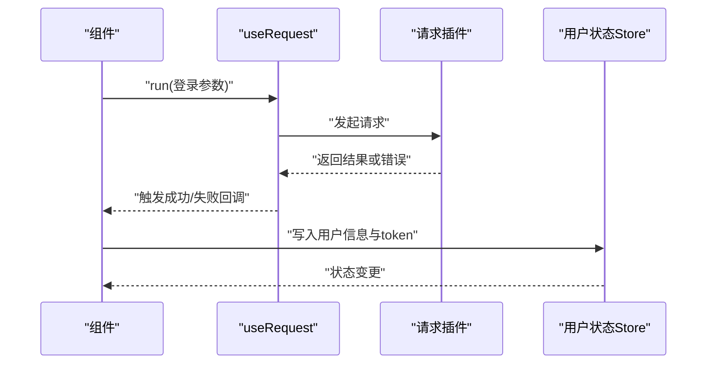
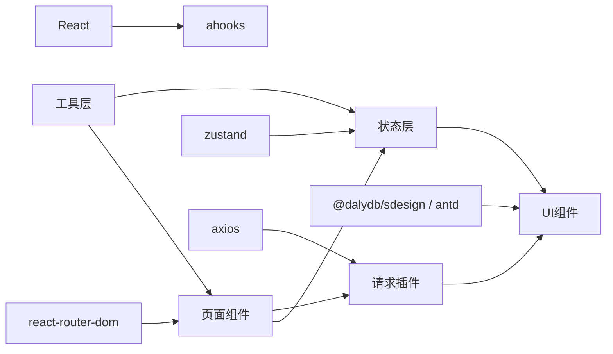

# 自定义Hooks

<cite>
**本文引用的文件**
- [src/hooks/index.ts](file://src/hooks/index.ts)
- [.ai/templates/archived/custom-hook.md](file://.ai/templates/archived/custom-hook.md)
- [src/stores/app.ts](file://src/stores/app.ts)
- [src/stores/user.ts](file://src/stores/user.ts)
- [src/stores/index.ts](file://src/stores/index.ts)
- [src/plugins/request/index.ts](file://src/plugins/request/index.ts)
- [src/pages/login/index.tsx](file://src/pages/login/index.tsx)
- [src/layouts/MainLayout.tsx](file://src/layouts/MainLayout.tsx)
- [src/utils/index.ts](file://src/utils/index.ts)
- [package.json](file://package.json)
- [.ai/core/coding-standards.md](file://.ai/core/coding-standards.md)
</cite>

## 目录

1. [简介](#简介)
2. [项目结构](#项目结构)
3. [核心组件](#核心组件)
4. [架构总览](#架构总览)
5. [详细组件分析](#详细组件分析)
6. [依赖关系分析](#依赖关系分析)
7. [性能考量](#性能考量)
8. [故障排查指南](#故障排查指南)
9. [结论](#结论)
10. [附录](#附录)

## 简介

本文件围绕“自定义Hooks”的设计模式与开发规范展开，结合仓库现有实现与模板，系统阐述状态管理Hooks、副作用处理Hooks、组合Hooks等类型的设计与落地方式；解释Hook的生命周期、依赖管理与性能优化策略；给出基于项目内真实使用的示例（如状态层Zustand Store、请求层ahooks与封装的request插件）；并总结可复用的设计原则与最佳实践。

## 项目结构

- 仓库采用按职责分层的组织方式：页面组件位于 pages，布局组件位于 layouts，状态层位于 stores，通用工具位于 utils，HTTP请求封装位于 plugins/request，自定义Hooks入口位于 src/hooks。
- 当前仓库未提供具体自定义Hook实现文件，但提供了生成自定义Hook的模板与统一的编码规范，便于后续扩展。

图表来源

- [src/pages/login/index.tsx](file://src/pages/login/index.tsx#L1-L133)
- [src/layouts/MainLayout.tsx](file://src/layouts/MainLayout.tsx#L1-L174)
- [src/stores/index.ts](file://src/stores/index.ts#L1-L3)
- [src/stores/app.ts](file://src/stores/app.ts#L1-L59)
- [src/stores/user.ts](file://src/stores/user.ts#L1-L76)
- [src/plugins/request/index.ts](file://src/plugins/request/index.ts#L1-L114)
- [src/utils/index.ts](file://src/utils/index.ts#L1-L106)
- [src/hooks/index.ts](file://src/hooks/index.ts#L1-L6)
- [.ai/templates/archived/custom-hook.md](file://.ai/templates/archived/custom-hook.md#L1-L69)

章节来源

- [src/hooks/index.ts](file://src/hooks/index.ts#L1-L6)
- [.ai/templates/archived/custom-hook.md](file://.ai/templates/archived/custom-hook.md#L1-L69)
- [src/stores/index.ts](file://src/stores/index.ts#L1-L3)
- [src/stores/app.ts](file://src/stores/app.ts#L1-L59)
- [src/stores/user.ts](file://src/stores/user.ts#L1-L76)
- [src/plugins/request/index.ts](file://src/plugins/request/index.ts#L1-L114)
- [src/pages/login/index.tsx](file://src/pages/login/index.tsx#L1-L133)
- [src/layouts/MainLayout.tsx](file://src/layouts/MainLayout.tsx#L1-L174)
- [src/utils/index.ts](file://src/utils/index.ts#L1-L106)

## 核心组件

- 状态层（Zustand Store）
  - 应用状态：包含侧边栏折叠、主题、语言等状态与切换动作。
  - 用户状态：包含用户信息、token、权限集合、登录登出、权限校验等。
- 请求层（ahooks + 封装的request）
  - 页面中使用 useRequest 进行手动触发的登录流程，并在成功回调中写入用户状态。
  - 插件层统一处理请求头、响应体结构、错误码与网络异常。
- 工具层（防抖/节流/格式化等）
  - 提供防抖、节流、日期格式化、金额格式化、深拷贝等常用能力，可作为自定义Hook的底层支撑。

章节来源

- [src/stores/app.ts](file://src/stores/app.ts#L1-L59)
- [src/stores/user.ts](file://src/stores/user.ts#L1-L76)
- [src/pages/login/index.tsx](file://src/pages/login/index.tsx#L1-L133)
- [src/plugins/request/index.ts](file://src/plugins/request/index.ts#L1-L114)
- [src/utils/index.ts](file://src/utils/index.ts#L1-L106)

## 架构总览

下图展示页面、状态层与请求层的交互关系，体现“页面组件 -> 状态层 -> 请求层”的典型调用链路。

图表来源

- [src/pages/login/index.tsx](file://src/pages/login/index.tsx#L32-L50)
- [src/plugins/request/index.ts](file://src/plugins/request/index.ts#L78-L111)
- [src/stores/user.ts](file://src/stores/user.ts#L46-L60)

## 详细组件分析

### 状态管理Hooks（Zustand Store）

- 设计要点
  - 使用 create 创建Store，结合 persist 与 immer 中间件实现持久化与不可变更新。
  - 将状态与动作分离，通过 selector 精准订阅，降低重渲染范围。
  - 在导出层统一导出，便于组件按需引入。
- 生命周期与依赖
  - Store初始化即生效；依赖于外部中间件（persist/immer）与状态选择器。
  - 订阅粒度越细，依赖越稳定，重渲染次数越少。
- 性能优化
  - 使用 selector 精确取值，避免全量状态订阅。
  - 合理拆分Store，避免单个Store过大导致频繁重渲染。
- 示例映射
  - 应用状态：侧边栏折叠、主题、语言切换。
  - 用户状态：登录、登出、权限校验。

图表来源

- [src/stores/app.ts](file://src/stores/app.ts#L18-L58)
- [src/stores/user.ts](file://src/stores/user.ts#L21-L75)

章节来源

- [src/stores/app.ts](file://src/stores/app.ts#L1-L59)
- [src/stores/user.ts](file://src/stores/user.ts#L1-L76)
- [src/stores/index.ts](file://src/stores/index.ts#L1-L3)

### 副作用处理Hooks（ahooks + 封装的request）

- 设计要点
  - 使用 useRequest 手动触发异步请求，集中处理 loading、成功、失败回调。
  - 将业务错误与网络错误在插件层统一处理，组件层仅关注业务分支。
- 生命周期与依赖
  - 手动模式下，依赖 run 函数的调用时机；成功回调中写入状态，触发组件重渲染。
- 性能优化
  - 合理设置缓存与去重策略（由 useRequest 内部机制决定），避免重复请求。
  - 对高频操作使用防抖/节流（见工具层）。
- 示例映射
  - 登录页使用 useRequest 包裹登录API，成功后写入用户状态并跳转。

图表来源

- [src/pages/login/index.tsx](file://src/pages/login/index.tsx#L32-L50)
- [src/plugins/request/index.ts](file://src/plugins/request/index.ts#L78-L111)
- [src/stores/user.ts](file://src/stores/user.ts#L46-L60)

章节来源

- [src/pages/login/index.tsx](file://src/pages/login/index.tsx#L1-L133)
- [src/plugins/request/index.ts](file://src/plugins/request/index.ts#L1-L114)

### 组合Hooks（状态+副作用+工具）

- 设计要点
  - 将状态层、副作用层与工具层能力进行组合，形成可复用的业务能力单元。
  - 通过 selector 与工具函数（防抖/节流/格式化）提升性能与可用性。
- 示例映射
  - 主布局中同时使用应用状态与用户状态，结合工具函数进行格式化与交互控制。

章节来源

- [src/layouts/MainLayout.tsx](file://src/layouts/MainLayout.tsx#L1-L174)
- [src/stores/app.ts](file://src/stores/app.ts#L1-L59)
- [src/stores/user.ts](file://src/stores/user.ts#L1-L76)
- [src/utils/index.ts](file://src/utils/index.ts#L1-L106)

### 自定义Hook设计模板与规范

- 模板结构
  - Hook命名以 use 开头，参数与返回值均具备明确类型定义。
  - 支持配置项与返回值分离，便于组合与扩展。
- 编码规范
  - 使用 TypeScript 严格模式，避免 any。
  - 结合 ahooks 与组件库特性，确保与现有生态兼容。
- 示例映射
  - 模板中给出 useState 与 useCallback 的封装思路，可直接迁移至项目。

章节来源

- [.ai/templates/archived/custom-hook.md](file://.ai/templates/archived/custom-hook.md#L1-L69)
- [src/hooks/index.ts](file://src/hooks/index.ts#L1-L6)

## 依赖关系分析

- 外部依赖
  - react、react-router-dom、ahooks、zustand、@dalydb/sdesign、antd、axios 等。
- 内部依赖
  - 页面组件依赖状态层与请求插件；工具层为各层提供通用能力；自定义Hook入口预留扩展空间。

图表来源

- [package.json](file://package.json#L20-L36)
- [src/pages/login/index.tsx](file://src/pages/login/index.tsx#L1-L133)
- [src/layouts/MainLayout.tsx](file://src/layouts/MainLayout.tsx#L1-L174)
- [src/stores/index.ts](file://src/stores/index.ts#L1-L3)
- [src/plugins/request/index.ts](file://src/plugins/request/index.ts#L1-L114)
- [src/utils/index.ts](file://src/utils/index.ts#L1-L106)

章节来源

- [package.json](file://package.json#L1-L81)
- [src/pages/login/index.tsx](file://src/pages/login/index.tsx#L1-L133)
- [src/layouts/MainLayout.tsx](file://src/layouts/MainLayout.tsx#L1-L174)
- [src/stores/index.ts](file://src/stores/index.ts#L1-L3)
- [src/plugins/request/index.ts](file://src/plugins/request/index.ts#L1-L114)
- [src/utils/index.ts](file://src/utils/index.ts#L1-L106)

## 性能考量

- 状态订阅
  - 使用 selector 精准订阅，避免全量状态变化引发的重渲染。
- 异步请求
  - 使用 useRequest 的缓存与去重能力，减少重复请求。
  - 对高频事件（如输入、滚动）配合工具层的防抖/节流。
- 渲染优化
  - 将静态数据与动态数据分离，减少不必要的渲染。
- 存储优化
  - 仅持久化必要字段，避免存储冗余数据。

章节来源

- [src/stores/app.ts](file://src/stores/app.ts#L49-L57)
- [src/stores/user.ts](file://src/stores/user.ts#L67-L74)
- [src/utils/index.ts](file://src/utils/index.ts#L58-L87)
- [.ai/core/coding-standards.md](file://.ai/core/coding-standards.md#L250-L270)

## 故障排查指南

- 登录失败/无权限
  - 检查请求插件是否正确设置 Authorization 头与业务错误处理。
  - 确认登录成功回调中是否正确写入用户信息与token。
- 状态未更新
  - 检查状态选择器是否正确，是否存在订阅范围过宽导致的“假更新”。
  - 确认持久化中间件是否正常写入与读取。
- 性能问题
  - 使用 React DevTools Profiler 观察重渲染热点。
  - 对高频事件增加防抖/节流，减少无效渲染。

章节来源

- [src/plugins/request/index.ts](file://src/plugins/request/index.ts#L19-L76)
- [src/pages/login/index.tsx](file://src/pages/login/index.tsx#L32-L50)
- [src/stores/user.ts](file://src/stores/user.ts#L46-L60)
- [src/utils/index.ts](file://src/utils/index.ts#L58-L87)

## 结论

本项目通过Zustand Store实现状态管理、ahooks与封装的request插件处理副作用，并辅以工具层能力，形成了清晰的分层架构。当前尚未提供具体自定义Hook实现，但模板与规范已为后续扩展奠定基础。建议在保持类型安全与最小依赖的前提下，优先复用ahooks与现有Store能力，逐步沉淀可复用的业务Hook。

## 附录

- 自定义Hook开发清单
  - 明确定义参数与返回值类型，遵循 use 前缀命名。
  - 将状态、副作用与工具能力进行合理组合，避免过度耦合。
  - 严格遵守导入顺序与导出模式，确保模块化与可维护性。
- 相关参考
  - 模板与规范：参见自定义Hook模板与编码规范文件。

章节来源

- [.ai/templates/archived/custom-hook.md](file://.ai/templates/archived/custom-hook.md#L1-L69)
- [.ai/core/coding-standards.md](file://.ai/core/coding-standards.md#L215-L248)
