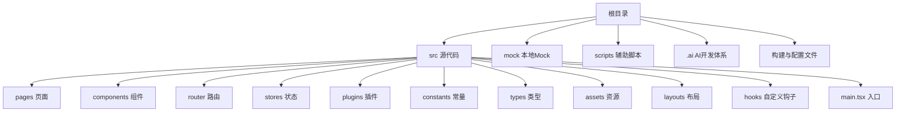
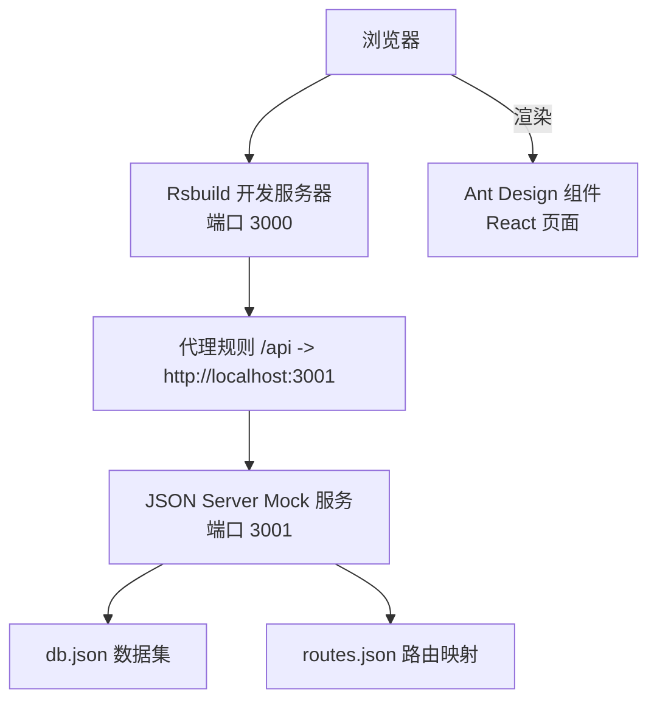
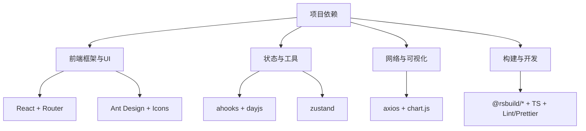

# 快速开始

<cite>
**本文引用的文件**
- [package.json](file://package.json)
- [rsbuild.config.ts](file://rsbuild.config.ts)
- [tsconfig.json](file://tsconfig.json)
- [.prettierrc](file://.prettierrc)
- [.eslintrc.cjs](file://.eslintrc.cjs)
- [mock/db.json](file://mock/db.json)
- [mock/routes.json](file://mock/routes.json)
- [src/main.tsx](file://src/main.tsx)
- [src/plugins/request/index.ts](file://src/plugins/request/index.ts)
- [src/constants/config.ts](file://src/constants/config.ts)
- [src/router/index.tsx](file://src/router/index.tsx)
- [src/pages/dashboard/index.tsx](file://src/pages/dashboard/index.tsx)
- [src/pages/login/index.tsx](file://src/pages/login/index.tsx)
</cite>

## 目录

1. [简介](#简介)
2. [项目结构](#项目结构)
3. [核心组件](#核心组件)
4. [架构概览](#架构概览)
5. [详细组件分析](#详细组件分析)
6. [依赖分析](#依赖分析)
7. [性能考虑](#性能考虑)
8. [故障排除指南](#故障排除指南)
9. [结论](#结论)
10. [附录](#附录)

## 简介

本指南面向初次接触 AI 管理平台项目的开发者，帮助你在最短时间内完成环境准备、依赖安装、开发服务器启动与 Mock 数据服务运行，并通过基本验证确认开发环境正确配置。项目采用 React + TypeScript 技术栈，使用 Rsbuild 构建工具，内置 JSON Server 作为 Mock 数据服务，提供 Ant Design 组件生态与 ahooks 等常用工具库。

## 项目结构

项目采用按功能域划分的组织方式，核心目录与职责如下：

- src：源代码根目录，包含页面、组件、路由、状态管理、插件、常量与类型定义等
- mock：本地 Mock 数据与路由映射，用于模拟后端接口
- scripts：辅助脚本（如上下文更新）
- .ai：AI 驱动的开发体系配置与模板
- 根目录配置：包管理与构建、格式化、类型检查、代码规范等

**章节来源**

- [package.json](file://package.json#L1-L81)
- [tsconfig.json](file://tsconfig.json#L1-L24)

## 核心组件

- 构建与开发工具链
  - 使用 Rsbuild 作为构建引擎，提供开发服务器、代理、热更新等能力
  - TypeScript 提供类型安全与更好的开发体验
  - ESLint + Prettier 保证代码风格一致与质量
- 前端框架与生态
  - React 18 + React Router DOM 实现页面与路由
  - Ant Design + Icons 提供丰富的 UI 组件与图标
  - axios + interceptors 封装统一请求层，支持全局拦截与错误提示
- Mock 数据服务
  - JSON Server + 路由映射，提供 /api 前缀的后端接口模拟
- 应用入口与国际化
  - 入口文件设置 Ant Design 语言与主题，挂载路由

**章节来源**

- [rsbuild.config.ts](file://rsbuild.config.ts#L1-L30)
- [tsconfig.json](file://tsconfig.json#L1-L24)
- [.eslintrc.cjs](file://.eslintrc.cjs#L1-L21)
- [.prettierrc](file://.prettierrc#L1-L22)
- [src/main.tsx](file://src/main.tsx#L1-L32)
- [src/plugins/request/index.ts](file://src/plugins/request/index.ts#L1-L114)
- [mock/db.json](file://mock/db.json#L1-L140)
- [mock/routes.json](file://mock/routes.json#L1-L11)

## 架构概览

下图展示了开发阶段的典型交互流程：浏览器访问前端开发服务器，请求通过代理转发到 Mock 数据服务；Mock 服务返回预置数据，前端渲染页面并展示。

**图表来源**

- [rsbuild.config.ts](file://rsbuild.config.ts#L11-L22)
- [mock/db.json](file://mock/db.json#L1-L140)
- [mock/routes.json](file://mock/routes.json#L1-L11)

**章节来源**

- [rsbuild.config.ts](file://rsbuild.config.ts#L1-L30)
- [mock/db.json](file://mock/db.json#L1-L140)
- [mock/routes.json](file://mock/routes.json#L1-L11)

## 详细组件分析

### 环境要求与前置条件

- Node.js 版本要求
  - 项目在 engines 字段中声明最低 Node.js 版本为 18.0.0
- 包管理器选择
  - 项目使用 pnpm 作为包管理器，推荐使用 pnpm 进行依赖安装与同步
  - 若使用其他包管理器，可能无法满足 onlyBuiltDependencies 等 pnpm 专属配置
- TypeScript 与构建工具
  - TypeScript 版本与模块解析策略已在 tsconfig.json 中配置
  - Rsbuild 作为构建与开发服务器，提供热重载与代理能力

**章节来源**

- [package.json](file://package.json#L57-L59)
- [package.json](file://package.json#L60-L64)
- [tsconfig.json](file://tsconfig.json#L1-L24)
- [rsbuild.config.ts](file://rsbuild.config.ts#L1-L30)

### 依赖安装步骤

- 安装 pnpm（若尚未安装）
  - 参考官方文档安装 pnpm
- 安装项目依赖
  - 在项目根目录执行 pnpm 安装命令
  - 安装完成后会自动触发 postinstall 钩子，执行 AI 文档同步脚本
- 依赖同步与更新
  - 如需更新 AI 文档或上下文，可执行相关脚本命令

**章节来源**

- [package.json](file://package.json#L18-L18)
- [package.json](file://package.json#L16-L17)

### 开发服务器启动

- 启动开发服务器
  - 执行开发脚本，Rsbuild 将启动本地开发服务器，默认端口为 3000
- 热重载与代理
  - 开发服务器启用热重载，修改源码后页面自动刷新
  - 代理规则将 /api 前缀请求转发至 Mock 服务（端口 3001），便于前后端并行开发
- 端口配置
  - 如需自定义端口，可在 Rsbuild 配置中调整 server.port

**章节来源**

- [package.json](file://package.json#L8-L8)
- [rsbuild.config.ts](file://rsbuild.config.ts#L11-L22)

### Mock 数据服务启动

- 启动 Mock 服务
  - 执行 mock 脚本，JSON Server 将监听本地端口 3001，并加载 db.json 与 routes.json
- 数据集与路由映射
  - db.json 包含用户、文章、分类、项目等示例数据
  - routes.json 将 /auth/_、/users/_、/posts/_、/categories/_ 等路径映射到对应资源
- 与前端集成
  - 前端通过 /api 前缀发起请求，Rsbuild 代理将其转发到 Mock 服务，实现无后端依赖的联调

**章节来源**

- [package.json](file://package.json#L11-L11)
- [mock/db.json](file://mock/db.json#L1-L140)
- [mock/routes.json](file://mock/routes.json#L1-L11)
- [rsbuild.config.ts](file://rsbuild.config.ts#L13-L21)

### 基本验证步骤

- 访问开发页面
  - 浏览器打开 http://localhost:3000，应看到登录页
- 登录验证
  - 使用任意用户名与密码点击登录，应跳转到仪表盘页面
- Mock 接口可用性
  - 在浏览器开发者工具 Network 面板中，观察 /api/users、/api/posts 等请求是否能正常返回数据
- 国际化与主题
  - 页面应显示中文与默认 Ant Design 主题配置

**章节来源**

- [src/pages/login/index.tsx](file://src/pages/login/index.tsx#L1-L133)
- [src/pages/dashboard/index.tsx](file://src/pages/dashboard/index.tsx#L1-L170)
- [src/main.tsx](file://src/main.tsx#L17-L31)
- [rsbuild.config.ts](file://rsbuild.config.ts#L11-L22)

## 依赖分析

- 前端框架与 UI
  - React、React Router DOM、Ant Design、@ant-design/icons、lucide-react
- 状态与工具
  - ahooks、immer、lodash-es、dayjs、zustand
- 网络与可视化
  - axios、chart.js、react-chartjs-2
- 构建与开发
  - @rsbuild/core、@rsbuild/plugin-react、typescript、eslint、prettier

**图表来源**

- [package.json](file://package.json#L20-L56)

**章节来源**

- [package.json](file://package.json#L20-L56)

## 性能考虑

- 开发阶段
  - 启用热重载减少手动刷新成本
  - 使用代理避免跨域问题，提升联调效率
- 生产构建
  - Rsbuild 默认优化打包与资源输出，建议在生产环境使用构建产物进行预览与部署
- 代码质量
  - ESLint 与 Prettier 规范可降低维护成本，减少潜在性能隐患

**章节来源**

- [package.json](file://package.json#L9-L11)
- [package.json](file://package.json#L14-L14)
- [.eslintrc.cjs](file://.eslintrc.cjs#L1-L21)
- [.prettierrc](file://.prettierrc#L1-L22)

## 故障排除指南

- Node.js 版本不满足要求
  - 症状：安装或启动时报错
  - 解决：升级 Node.js 至 18.0.0 或以上版本
- pnpm 未安装或不可用
  - 症状：执行 pnpm install 失败
  - 解决：安装 pnpm 并确保 PATH 可用；如需更换包管理器，请注意项目对 pnpm 的专用配置
- 端口被占用
  - 症状：开发服务器或 Mock 服务启动失败
  - 解决：修改 Rsbuild 配置中的 server.port 或关闭占用端口的进程
- 代理转发异常
  - 症状：/api 请求 404 或跨域
  - 解决：确认 Rsbuild 代理配置与 Mock 服务端口一致；检查请求路径是否符合 routes.json 映射
- Mock 数据为空或不正确
  - 症状：接口返回空数组或字段缺失
  - 解决：检查 db.json 结构与字段命名；确认 routes.json 路径映射正确
- 登录后无法跳转或页面空白
  - 症状：登录成功但未进入首页或页面无内容
  - 解决：确认路由配置与入口渲染逻辑；检查 Ant Design 主题与语言设置是否生效

**章节来源**

- [package.json](file://package.json#L57-L59)
- [package.json](file://package.json#L60-L64)
- [rsbuild.config.ts](file://rsbuild.config.ts#L11-L22)
- [mock/db.json](file://mock/db.json#L1-L140)
- [mock/routes.json](file://mock/routes.json#L1-L11)
- [src/main.tsx](file://src/main.tsx#L17-L31)
- [src/router/index.tsx](file://src/router/index.tsx#L1-L9)

## 结论

按照本指南完成环境准备与依赖安装后，你将能够顺利启动开发服务器与 Mock 数据服务，并通过基本验证确认开发环境正确配置。后续可基于现有页面与插件体系快速扩展业务功能。

## 附录

- 常用命令参考
  - 开发：执行开发脚本启动 Rsbuild 开发服务器
  - 构建：执行构建脚本生成生产包
  - 预览：执行预览脚本查看生产效果
  - Mock：执行 mock 脚本启动 JSON Server
  - 代码规范：执行 ESLint 与 Prettier 相关脚本
  - 类型检查：执行类型检查脚本
- 配置文件定位
  - Rsbuild：构建与开发服务器配置
  - TypeScript：编译与模块解析配置
  - ESLint：代码规范与规则
  - Prettier：格式化规则与插件

**章节来源**

- [package.json](file://package.json#L6-L18)
- [rsbuild.config.ts](file://rsbuild.config.ts#L1-L30)
- [tsconfig.json](file://tsconfig.json#L1-L24)
- [.eslintrc.cjs](file://.eslintrc.cjs#L1-L21)
- [.prettierrc](file://.prettierrc#L1-L22)
