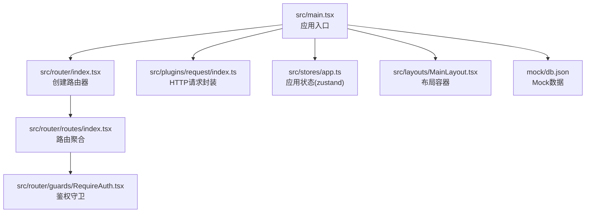
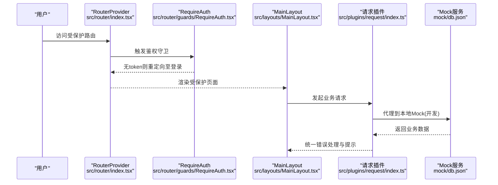
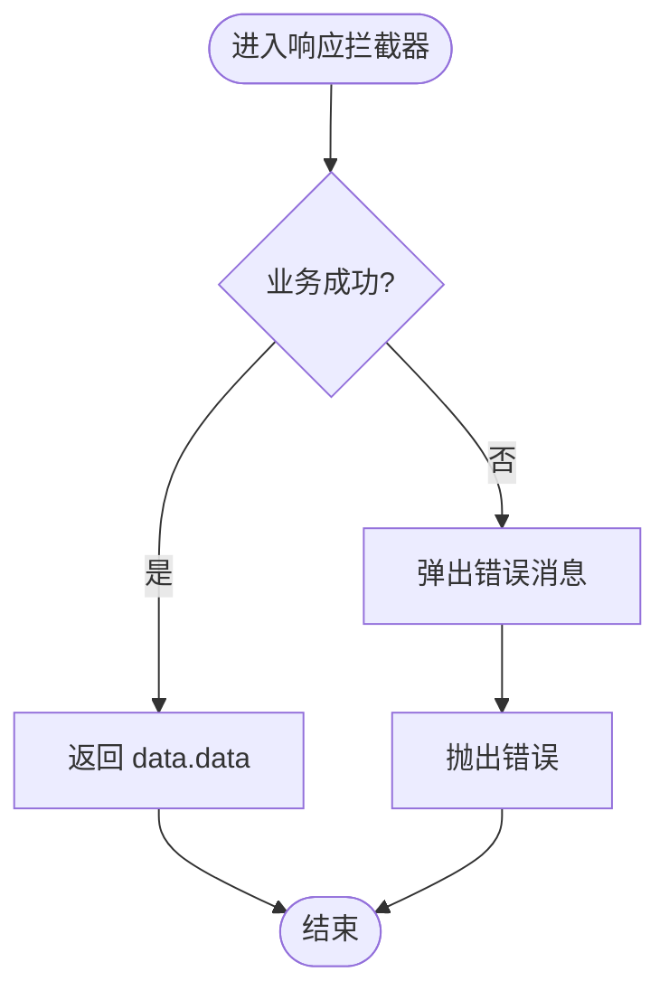
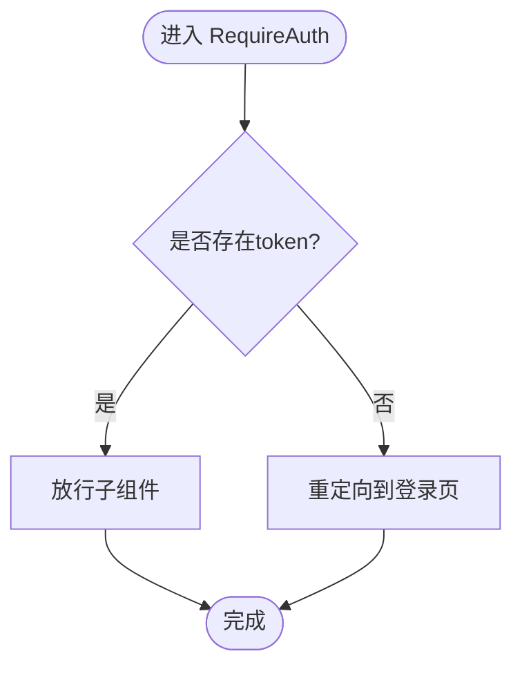

# 故障排除

<cite>
**本文引用的文件**
- [package.json](file://package.json)
- [rsbuild.config.ts](file://rsbuild.config.ts)
- [src/main.tsx](file://src/main.tsx)
- [src/plugins/request/index.ts](file://src/plugins/request/index.ts)
- [src/router/index.tsx](file://src/router/index.tsx)
- [src/router/routes/index.tsx](file://src/router/routes/index.tsx)
- [src/router/guards/RequireAuth.tsx](file://src/router/guards/RequireAuth.tsx)
- [src/types/index.ts](file://src/types/index.ts)
- [src/stores/app.ts](file://src/stores/app.ts)
- [src/constants/config.ts](file://src/constants/config.ts)
- [.eslintrc.cjs](file://.eslintrc.cjs)
- [src/layouts/MainLayout.tsx](file://src/layouts/MainLayout.tsx)
- [src/pages/error/404.tsx](file://src/pages/error/404.tsx)
- [src/utils/index.ts](file://src/utils/index.ts)
- [mock/db.json](file://mock/db.json)
</cite>

## 目录

1. [简介](#简介)
2. [项目结构](#项目结构)
3. [核心组件](#核心组件)
4. [架构总览](#架构总览)
5. [详细组件分析](#详细组件分析)
6. [依赖与环境问题排查](#依赖与环境问题排查)
7. [构建与开发服务器问题排查](#构建与开发服务器问题排查)
8. [运行时异常与错误处理](#运行时异常与错误处理)
9. [性能问题诊断与优化](#性能问题诊断与优化)
10. [调试技巧与诊断方法](#调试技巧与诊断方法)
11. [结论](#结论)
12. [附录](#附录)

## 简介

本指南面向使用该AI管理系统前端代码库的开发者，聚焦于常见问题与故障排除：依赖冲突、构建错误、运行时异常、网络请求错误、路由鉴权失效、状态持久化异常、性能瓶颈等。文档提供可操作的诊断步骤、最佳实践与优化建议，并结合仓库中的实际实现给出定位与修复路径。

## 项目结构

该项目采用 React + TypeScript + Rsbuild 构建，使用 Ant Design 作为UI基础，Zustand 管理全局状态，Axios 封装统一请求，配合 Mock 数据服务进行本地联调。核心入口在主应用文件中挂载 RouterProvider，路由通过模块化组织，鉴权守卫控制访问，请求插件集中处理认证与错误提示。

图表来源

- [src/main.tsx](file://src/main.tsx#L1-L32)
- [src/router/index.tsx](file://src/router/index.tsx#L1-L9)
- [src/router/routes/index.tsx](file://src/router/routes/index.tsx#L1-L31)
- [src/router/guards/RequireAuth.tsx](file://src/router/guards/RequireAuth.tsx#L1-L25)
- [src/plugins/request/index.ts](file://src/plugins/request/index.ts#L1-L114)
- [src/stores/app.ts](file://src/stores/app.ts#L1-L59)
- [src/layouts/MainLayout.tsx](file://src/layouts/MainLayout.tsx#L1-L174)
- [mock/db.json](file://mock/db.json#L1-L140)

章节来源

- [package.json](file://package.json#L1-L81)
- [rsbuild.config.ts](file://rsbuild.config.ts#L1-L30)
- [src/main.tsx](file://src/main.tsx#L1-L32)

## 核心组件

- 应用入口与主题配置：在入口文件中初始化国际化、主题与路由挂载，便于统一错误边界与全局样式注入。
- 请求插件：集中处理超时、认证头、业务错误与HTTP错误的统一提示与跳转。
- 路由与鉴权：通过 RequireAuth 守卫读取用户状态判断是否放行。
- 全局状态：Zustand + Immer + Persist 管理侧边栏、主题、语言等，支持持久化。
- 类型系统：统一的 API 响应与表单/表格配置类型，降低对接成本。
- 工具函数：防抖、节流、深拷贝、格式化、下载等常用能力。

章节来源

- [src/main.tsx](file://src/main.tsx#L1-L32)
- [src/plugins/request/index.ts](file://src/plugins/request/index.ts#L1-L114)
- [src/router/guards/RequireAuth.tsx](file://src/router/guards/RequireAuth.tsx#L1-L25)
- [src/stores/app.ts](file://src/stores/app.ts#L1-L59)
- [src/types/index.ts](file://src/types/index.ts#L1-L101)
- [src/utils/index.ts](file://src/utils/index.ts#L1-L106)

## 架构总览

下图展示从浏览器到后端的请求链路与错误处理路径，以及鉴权守卫对路由访问的控制。

图表来源

- [src/router/index.tsx](file://src/router/index.tsx#L1-L9)
- [src/router/guards/RequireAuth.tsx](file://src/router/guards/RequireAuth.tsx#L1-L25)
- [src/layouts/MainLayout.tsx](file://src/layouts/MainLayout.tsx#L1-L174)
- [src/plugins/request/index.ts](file://src/plugins/request/index.ts#L1-L114)
- [mock/db.json](file://mock/db.json#L1-L140)

## 详细组件分析

### 请求插件与错误处理

- 功能要点
  - 统一超时、Content-Type、Authorization 头。
  - 响应拦截：根据业务字段判定成功/失败；失败时弹出消息并抛出错误。
  - HTTP 错误：按状态码分类提示，401 自动清理 token 并跳转登录。
  - 提供 get/post/put/delete/patch 方法封装。
- 常见问题
  - 后端返回结构不一致导致业务判断失败。
  - 未携带 token 或 token 过期导致 401。
  - 网络异常或跨域代理未正确配置。
- 排查步骤
  - 检查响应结构是否符合统一接口约定。
  - 在请求拦截器中打印 Authorization 头与关键参数。
  - 校验代理配置与目标端口。
  - 使用浏览器 Network 面板观察状态码与响应体。

图表来源

- [src/plugins/request/index.ts](file://src/plugins/request/index.ts#L34-L76)

章节来源

- [src/plugins/request/index.ts](file://src/plugins/request/index.ts#L1-L114)
- [src/types/index.ts](file://src/types/index.ts#L87-L93)

### 鉴权守卫与路由访问控制

- 功能要点
  - 读取用户状态中的 token，无 token 则重定向登录。
  - 支持自定义重定向地址。
- 常见问题
  - token 未持久化或被清除。
  - 用户状态未同步更新。
- 排查步骤
  - 检查用户状态存储与 token 字段。
  - 确认登录流程正确写入 token。
  - 校验白名单路由配置。

图表来源

- [src/router/guards/RequireAuth.tsx](file://src/router/guards/RequireAuth.tsx#L11-L22)
- [src/constants/config.ts](file://src/constants/config.ts#L24-L31)

章节来源

- [src/router/guards/RequireAuth.tsx](file://src/router/guards/RequireAuth.tsx#L1-L25)
- [src/constants/config.ts](file://src/constants/config.ts#L24-L31)

### 应用状态与持久化

- 功能要点
  - Zustand + Immer 简化不可变更新。
  - Persist 仅持久化部分字段，避免存储冗余。
- 常见问题
  - 持久化键冲突或命名变更导致旧数据残留。
  - 更新逻辑未触发重渲染。
- 排查步骤
  - 检查持久化中间件配置与序列化字段。
  - 使用浏览器 DevTools 的 Redux 面板观察状态变化。
  - 确认 store 的 selector 使用稳定引用。

章节来源

- [src/stores/app.ts](file://src/stores/app.ts#L1-L59)
- [src/constants/config.ts](file://src/constants/config.ts#L1-L19)

### 主布局与导航

- 功能要点
  - 侧边栏折叠、头部用户菜单、内容区 Outlet。
  - 与路由联动，保持选中态与跳转。
- 常见问题
  - 选中态与当前路由不一致。
  - 用户菜单点击未触发登出或跳转。
- 排查步骤
  - 检查 selectedKeys 与 location.pathname 的映射。
  - 校验菜单项 key 与路由 path 对应关系。

章节来源

- [src/layouts/MainLayout.tsx](file://src/layouts/MainLayout.tsx#L1-L174)

### 404 页面与错误边界

- 功能要点
  - 使用 Result 组件展示 404 页面与返回首页按钮。
- 常见问题
  - 路由未正确声明导致未命中 404。
- 排查步骤
  - 确认错误路由模块已加入路由聚合。
  - 检查路由顺序与通配符匹配。

章节来源

- [src/pages/error/404.tsx](file://src/pages/error/404.tsx#L1-L23)
- [src/router/routes/index.tsx](file://src/router/routes/index.tsx#L27-L28)

## 依赖与环境问题排查

- Node 版本要求
  - 项目要求 Node >= 18，若低于此版本会导致构建或工具链报错。
- 包管理器与安装
  - 使用 pnpm，确保锁版本一致；如出现依赖冲突，优先执行清理与重装。
- 依赖冲突定位
  - 使用包管理器的依赖树查看工具，定位重复或版本不兼容的包。
  - 关注 @types/\* 与运行时包的版本一致性。
- TypeScript 类型检查
  - 使用脚本进行类型检查，定位未处理的 any 或类型不匹配。
- ESLint 规则
  - 若规则导致编辑器频繁告警，检查规则配置与忽略模式。

章节来源

- [package.json](file://package.json#L57-L59)
- [package.json](file://package.json#L37-L56)
- [.eslintrc.cjs](file://.eslintrc.cjs#L1-L21)

## 构建与开发服务器问题排查

- 开发服务器端口与代理
  - Rsbuild 默认端口为 3000；代理将 /api 前缀转发到本地 3001 的 Mock 服务。
  - 若无法访问后端或出现跨域，检查代理 target、changeOrigin、pathRewrite。
- 构建产物与预览
  - 构建后可通过预览命令启动静态服务验证打包结果。
- 常见症状与处理
  - 代理 404：确认 Mock 路由与资源路径。
  - 构建失败：查看控制台错误堆栈，优先修复首报错；关注缺失的类型声明或语法错误。

章节来源

- [rsbuild.config.ts](file://rsbuild.config.ts#L11-L22)
- [package.json](file://package.json#L6-L18)

## 运行时异常与错误处理

- 统一错误处理最佳实践
  - 在请求插件中区分业务错误与网络错误，分别提示与记录。
  - 对 401 自动登出并跳转登录，避免用户处于半登录状态。
  - 对 403/404/500 等状态码提供明确提示，必要时引导反馈。
- 用户体验优化
  - 使用轻量消息组件提示，避免阻塞交互。
  - 对关键操作提供加载态与取消机制。
- 错误边界与降级
  - 在布局层包裹错误边界组件，捕获子树异常并优雅降级。
  - 对网络异常提供重试策略（结合配置项）。

章节来源

- [src/plugins/request/index.ts](file://src/plugins/request/index.ts#L48-L76)
- [src/plugins/request/index.ts](file://src/plugins/request/index.ts#L53-L69)

## 性能问题诊断与优化

- 内存泄漏检测
  - 使用浏览器性能面板监控内存曲线，排查未释放的定时器、事件监听器与闭包引用。
  - 检查长列表渲染与虚拟化方案，避免一次性渲染过多节点。
- 渲染性能分析
  - 使用 React DevTools Profiler 分析组件渲染频率与耗时。
  - 对高频更新的组件使用 memo、useMemo、useCallback 优化。
- 网络请求优化
  - 合理设置超时与重试，避免阻塞主线程。
  - 对重复请求进行去重或缓存，减少不必要的网络往返。
- 工具函数与计算
  - 防抖/节流用于搜索、滚动、窗口尺寸变化等高频事件。
  - 深拷贝仅在必要时使用，避免大对象频繁复制。

章节来源

- [src/utils/index.ts](file://src/utils/index.ts#L58-L87)
- [src/plugins/request/index.ts](file://src/plugins/request/index.ts#L12-L17)

## 调试技巧与诊断方法

- 日志与断点
  - 在请求拦截器中输出关键参数与响应摘要，定位异常请求。
  - 使用浏览器断点跟踪状态更新与路由切换。
- 状态追踪
  - 结合 Redux DevTools 或 Zustand DevTools 插件观察状态变化。
- 网络诊断
  - 使用 Network 面板查看请求头、响应体、状态码与耗时。
  - 校验代理链路与 Mock 资源可用性。
- 路由与鉴权
  - 在守卫组件中打印 token 与当前路径，确认放行条件。
- Mock 数据
  - 修改 mock/db.json 验证不同场景下的 UI 行为与错误提示。

章节来源

- [src/plugins/request/index.ts](file://src/plugins/request/index.ts#L19-L32)
- [src/router/guards/RequireAuth.tsx](file://src/router/guards/RequireAuth.tsx#L15-L19)
- [mock/db.json](file://mock/db.json#L1-L140)

## 结论

本指南围绕请求插件、路由鉴权、状态持久化、布局导航与工具函数等关键模块，提供了从依赖环境、构建代理到运行时错误与性能优化的系统化排查路径。建议在日常开发中：

- 严格遵循统一的请求与错误处理规范；
- 在路由守卫中确保鉴权状态一致；
- 使用工具函数与性能分析工具持续优化；
- 通过 Mock 快速验证边界场景与异常分支。

## 附录

- 常用脚本
  - 开发：启动 Rsbuild 开发服务器
  - 构建：打包构建
  - 预览：本地预览构建产物
  - Mock：启动本地 Mock 服务
  - Lint：ESLint 检查与自动修复
  - Prettier：格式化代码
  - 类型检查：TypeScript 类型校验
- 代理配置
  - 将 /api 前缀代理到本地 3001，便于联调后端或 Mock 服务。

章节来源

- [package.json](file://package.json#L6-L18)
- [rsbuild.config.ts](file://rsbuild.config.ts#L13-L21)
