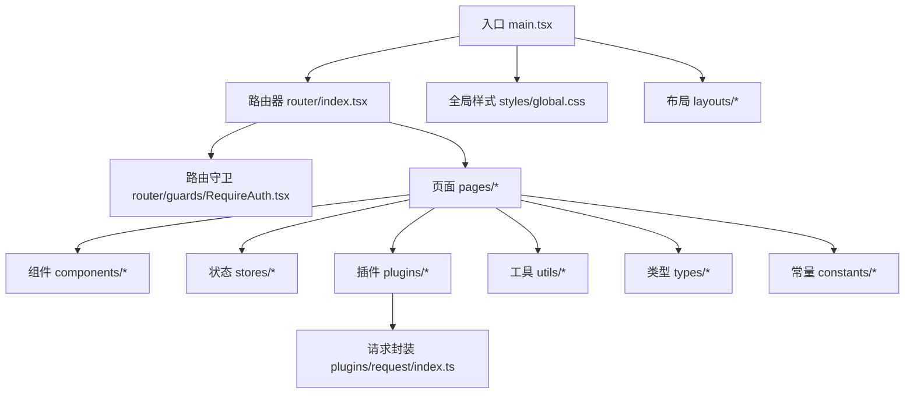
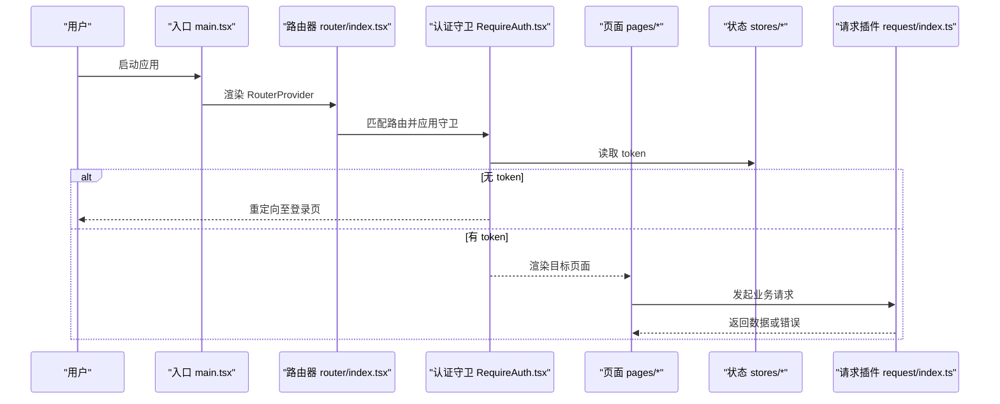
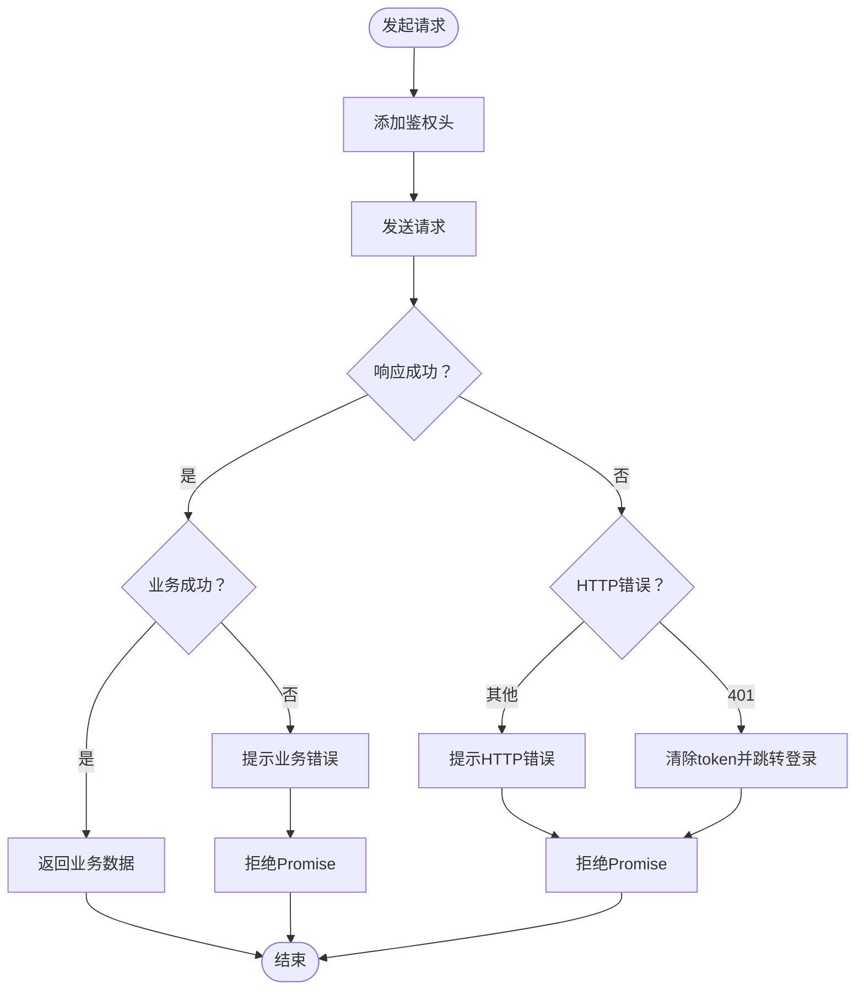
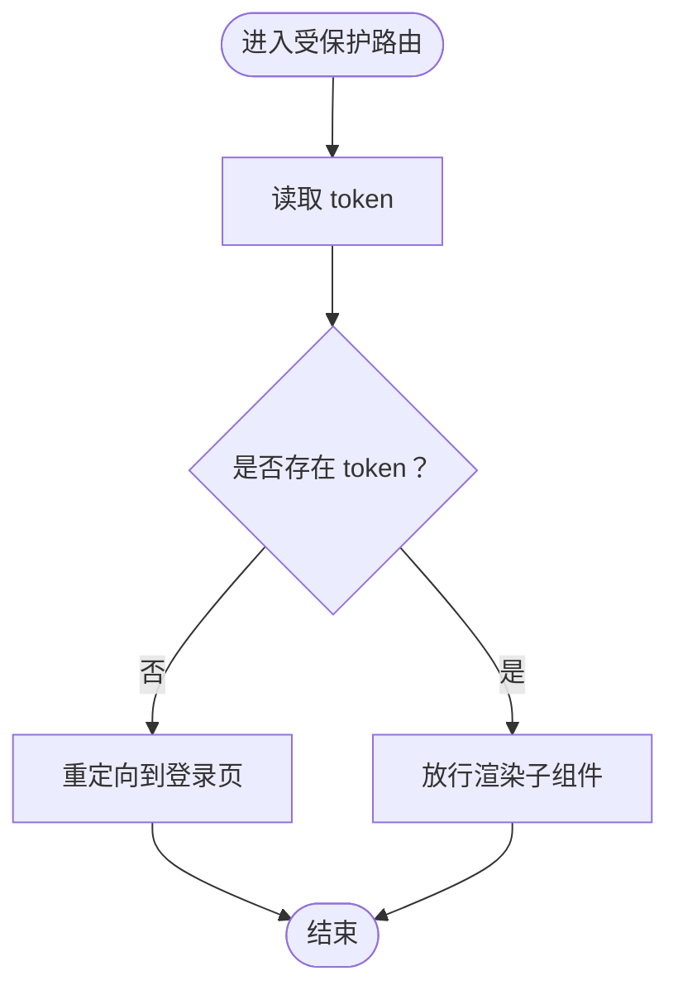
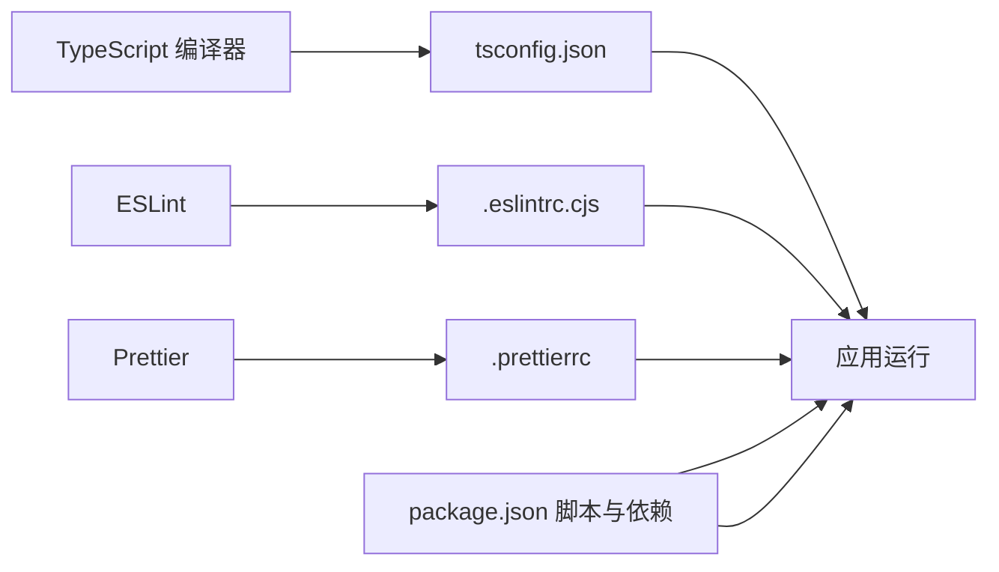

# 可维护性设计

<cite>
**本文引用的文件**
- [package.json](file://package.json)
- [tsconfig.json](file://tsconfig.json)
- [main.tsx](file://src/main.tsx)
- [index.tsx](file://src/router/index.tsx)
- [RequireAuth.tsx](file://src/router/guards/RequireAuth.tsx)
- [index.ts](file://src/plugins/request/index.ts)
- [.eslintrc.cjs](file://.eslintrc.cjs)
- [.prettierrc](file://.prettierrc)
- [index.ts](file://src/utils/index.ts)
- [index.ts](file://src/types/index.ts)
- [index.ts](file://src/constants/index.ts)
- [enum.ts](file://src/constants/enum.ts)
- [config.ts](file://src/constants/config.ts)
- [index.ts](file://src/stores/index.ts)
- [index.ts](file://src/hooks/index.ts)
- [index.ts](file://src/layouts/index.ts)
- [index.tsx](file://src/pages/dashboard/index.tsx)
</cite>

## 目录

1. [引言](#引言)
2. [项目结构](#项目结构)
3. [核心组件](#核心组件)
4. [架构概览](#架构概览)
5. [详细组件分析](#详细组件分析)
6. [依赖分析](#依赖分析)
7. [性能考虑](#性能考虑)
8. [故障排除指南](#故障排除指南)
9. [结论](#结论)
10. [附录](#附录)

## 引言

本文件围绕可维护性设计这一核心目标，系统梳理该前端项目的代码组织、模块划分、组件设计与工程化实践，总结命名规范、注释与文档标准，并提供重构与演进策略及质量评估方法。通过对入口、路由、状态管理、工具库、常量与类型等关键模块的深入分析，形成一套可复用、可扩展且易于协作的工程化准则。

## 项目结构

该项目采用以功能域为中心的目录组织方式，结合清晰的分层职责划分：页面、组件、路由、状态、插件、工具与类型常量等模块边界明确，便于维护与扩展。

图表来源

- [main.tsx](file://src/main.tsx#L1-L32)
- [index.tsx](file://src/router/index.tsx#L1-L9)
- [RequireAuth.tsx](file://src/router/guards/RequireAuth.tsx#L1-L25)
- [index.ts](file://src/plugins/request/index.ts#L1-L114)

章节来源

- [main.tsx](file://src/main.tsx#L1-L32)
- [index.tsx](file://src/router/index.tsx#L1-L9)

## 核心组件

本节聚焦于对可维护性影响最大的核心模块：应用入口、路由系统、认证守卫、请求插件、工具库与类型常量。

- 应用入口与主题配置
  - 在入口中集中初始化国际化、主题与路由器，确保全局一致性与最小化副作用。
  - 关键路径参考：[入口渲染与主题配置](file://src/main.tsx#L14-L31)

- 路由与守卫
  - 路由器通过集中导出路由表，简化导入复杂度；认证守卫以高阶组件形式注入，保证权限控制的一致性。
  - 关键路径参考：[路由器创建](file://src/router/index.tsx#L1-L9)、[认证守卫](file://src/router/guards/RequireAuth.tsx#L11-L22)

- 请求插件与错误处理
  - 插件封装统一的请求方法与拦截器，集中处理鉴权头、业务错误与HTTP错误映射，降低重复逻辑与提升可测试性。
  - 关键路径参考：[请求实例与拦截器](file://src/plugins/request/index.ts#L11-L76)、[请求方法封装](file://src/plugins/request/index.ts#L78-L111)

- 工具库与类型常量
  - 工具库提供通用的日期、金额、防抖节流、判空等能力，避免在页面中散落重复逻辑。
  - 类型常量统一导出枚举与配置，便于跨模块共享与约束。
  - 关键路径参考：[工具函数集合](file://src/utils/index.ts#L1-L106)、[类型定义](file://src/types/index.ts#L1-L101)、[常量统一导出](file://src/constants/index.ts#L1-L4)

章节来源

- [main.tsx](file://src/main.tsx#L14-L31)
- [index.tsx](file://src/router/index.tsx#L1-L9)
- [RequireAuth.tsx](file://src/router/guards/RequireAuth.tsx#L11-L22)
- [index.ts](file://src/plugins/request/index.ts#L11-L111)
- [index.ts](file://src/utils/index.ts#L1-L106)
- [index.ts](file://src/types/index.ts#L1-L101)
- [index.ts](file://src/constants/index.ts#L1-L4)

## 架构概览

下图展示从入口到页面的数据与控制流，以及权限校验与网络请求的关键节点。

图表来源

- [main.tsx](file://src/main.tsx#L17-L31)
- [index.tsx](file://src/router/index.tsx#L1-L9)
- [RequireAuth.tsx](file://src/router/guards/RequireAuth.tsx#L11-L22)
- [index.ts](file://src/plugins/request/index.ts#L78-L111)

## 详细组件分析

### 组件A：请求插件（plugins/request）

- 设计要点
  - 单例 Axios 实例，集中配置超时与默认头。
  - 请求拦截器自动附加鉴权头；响应拦截器统一处理业务成功/失败与HTTP状态映射。
  - 对外暴露简洁的请求方法封装，便于调用与测试。
- 复杂度与性能
  - 拦截器为 O(1)，请求方法为封装调用，整体开销极低。
- 错误处理
  - 明确区分业务错误与网络错误，统一提示与部分场景的自动登出流程。
- 可维护性
  - 集中式配置与错误处理，便于后续扩展中间件、重试策略或链路追踪。

图表来源

- [index.ts](file://src/plugins/request/index.ts#L19-L76)

章节来源

- [index.ts](file://src/plugins/request/index.ts#L11-L111)

### 组件B：认证守卫（router/guards/RequireAuth）

- 设计要点
  - 通过状态存储读取 token，未登录时重定向至登录页，已登录则放行。
  - 支持自定义重定向地址，增强灵活性。
- 可维护性
  - 逻辑简单清晰，易于单元测试与替换为更复杂的权限模型。

图表来源

- [RequireAuth.tsx](file://src/router/guards/RequireAuth.tsx#L11-L22)

章节来源

- [RequireAuth.tsx](file://src/router/guards/RequireAuth.tsx#L1-L25)

### 组件C：工具库（utils）

- 设计要点
  - 提供日期格式化、金额格式化、深拷贝、防抖节流、唯一 ID、判空等通用能力。
  - 函数职责单一，参数与返回值类型明确，便于复用与测试。
- 可维护性
  - 集中管理公共逻辑，减少页面中的重复实现，降低维护成本。

章节来源

- [index.ts](file://src/utils/index.ts#L1-L106)

### 组件D：类型与常量（types、constants）

- 设计要点
  - 类型定义覆盖分页、用户、菜单、表格列、表单字段、API 响应与错误等常用结构。
  - 常量统一导出枚举与配置，如用户状态、HTTP 状态、正则、日期格式与应用配置等。
- 可维护性
  - 类型与常量集中管理，避免魔法值与分散的类型声明，提升协作效率与一致性。

章节来源

- [index.ts](file://src/types/index.ts#L1-L101)
- [index.ts](file://src/constants/index.ts#L1-L4)
- [enum.ts](file://src/constants/enum.ts#L1-L70)
- [config.ts](file://src/constants/config.ts#L1-L76)

## 依赖分析

- 工程化工具链
  - 使用 TypeScript 编译器严格模式与路径别名，提升类型安全与导入便捷性。
  - ESLint 与 Prettier 规范统一代码风格与规则，减少分歧。
- 关键依赖
  - React 生态与 Ant Design 组件库，提供稳定的 UI 与交互基础。
  - Zustand 状态管理，轻量易用，适合中小型应用的状态集中管理。
  - Axios 与 Day.js 等成熟库，降低自研成本与风险。

图表来源

- [tsconfig.json](file://tsconfig.json#L1-L24)
- [.eslintrc.cjs](file://.eslintrc.cjs#L1-L21)
- [.prettierrc](file://.prettierrc#L1-L22)
- [package.json](file://package.json#L1-L81)

章节来源

- [tsconfig.json](file://tsconfig.json#L1-L24)
- [.eslintrc.cjs](file://.eslintrc.cjs#L1-L21)
- [.prettierrc](file://.prettierrc#L1-L22)
- [package.json](file://package.json#L1-L81)

## 性能考虑

- 路由与渲染
  - 使用 React Router 的懒加载与 KeepAlive（如需）可减少首屏体积与提升切换体验。
- 状态管理
  - 将大型对象拆分为细粒度 Store，避免不必要的重渲染。
- 网络请求
  - 合理设置超时与重试策略，结合缓存与分页，减轻后端压力。
- 工具与格式化
  - 防抖节流仅用于高频事件，避免阻塞主线程；格式化函数尽量在服务端或离线计算。

## 故障排除指南

- 路由跳转异常
  - 检查守卫是否正确读取 token，确认白名单配置与重定向地址。
  - 参考：[认证守卫实现](file://src/router/guards/RequireAuth.tsx#L11-L22)
- 请求失败
  - 查看响应拦截器的错误分支，确认业务错误与 HTTP 错误的处理逻辑。
  - 参考：[响应拦截器](file://src/plugins/request/index.ts#L34-L76)
- 类型错误
  - 使用 tsconfig 的严格模式与 noUnusedLocals/Parameters 规则，尽早发现类型问题。
  - 参考：[编译选项](file://tsconfig.json#L13-L16)
- 代码风格不一致
  - 通过脚本统一执行 Prettier 与 ESLint，修复规则冲突。
  - 参考：[脚本与规则](file://package.json#L6-L18)、[ESLint 配置](file://.eslintrc.cjs#L1-L21)、[Prettier 配置](file://.prettierrc#L1-L22)

章节来源

- [RequireAuth.tsx](file://src/router/guards/RequireAuth.tsx#L11-L22)
- [index.ts](file://src/plugins/request/index.ts#L34-L76)
- [tsconfig.json](file://tsconfig.json#L13-L16)
- [package.json](file://package.json#L6-L18)
- [.eslintrc.cjs](file://.eslintrc.cjs#L1-L21)
- [.prettierrc](file://.prettierrc#L1-L22)

## 结论

本项目在可维护性方面体现了良好的工程化实践：清晰的目录结构、集中式的入口与配置、统一的类型与常量、可复用的工具库与请求插件，以及完善的 lint 与格式化规范。建议在现有基础上进一步完善文档与测试体系，持续进行技术债清理与架构演进，以支撑更大规模的团队协作与长期发展。

## 附录

### 命名规范与文件组织最佳实践

- 文件命名
  - 页面与组件：使用帕斯卡命名法，如 DashboardPage、MainLayout。
  - 工具函数：动词短语或描述性名词，如 formatDate、isEmpty。
  - 类型与常量：使用名词或形容词，如 ApiResponse、APP_CONFIG。
- 目录组织
  - 功能域优先：pages、components、stores、router、plugins、utils、types、constants。
  - 统一导出：在各模块的 index.ts 中集中导出，减少深层导入。
- 路径别名
  - 使用 @/\* 作为 src 的别名，提升可读性与迁移便利性。
  - 参考：[路径别名配置](file://tsconfig.json#L18-L20)

章节来源

- [tsconfig.json](file://tsconfig.json#L18-L20)

### 注释与文档标准

- 代码注释
  - 公共函数与复杂逻辑需提供简要说明，参数与返回值清晰标注。
  - 参考：[工具函数注释示例](file://src/utils/index.ts#L3-L35)
- API 文档
  - 类型定义作为接口契约，配合注释说明字段含义与取值范围。
  - 参考：[类型定义示例](file://src/types/index.ts#L87-L101)
- 变更日志
  - 采用语义化版本与清晰的变更记录，便于回溯与升级。

### 重构与演进策略

- 技术债管理
  - 定期扫描未使用变量与函数，清理无用代码与重复逻辑。
  - 参考：[严格规则](file://tsconfig.json#L14-L15)、[未使用变量规则](file://.eslintrc.cjs#L18-L18)
- 代码清理
  - 通过 Prettier 与 ESLint 自动修复，保持风格一致。
  - 参考：[格式化与修复脚本](file://package.json#L11-L13)
- 架构演进
  - 将大型页面拆分为更小的可组合组件，引入细粒度 Store 与 Hook。
  - 在路由层增加权限模型扩展点，支持更细粒度的权限控制。
- 评估方法
  - 代码覆盖率、圈复杂度、平均文件大小、依赖层级深度等指标辅助评估。

### 具体重构案例

- 案例A：将页面中的日期格式化逻辑抽取到工具库
  - 现状：页面内直接使用日期格式化。
  - 方案：调用工具库中的格式化函数，统一实现与测试。
  - 参考：[页面使用示例](file://src/pages/dashboard/index.tsx#L88-L93)、[工具函数](file://src/utils/index.ts#L3-L19)
- 案例B：将重复的请求封装迁移到插件层
  - 现状：多处直接使用 Axios。
  - 方案：统一通过 request 封装方法，集中处理拦截器与错误。
  - 参考：[请求封装](file://src/plugins/request/index.ts#L78-L111)

章节来源

- [index.ts](file://src/utils/index.ts#L3-L19)
- [index.tsx](file://src/pages/dashboard/index.tsx#L88-L93)
- [index.ts](file://src/plugins/request/index.ts#L78-L111)
