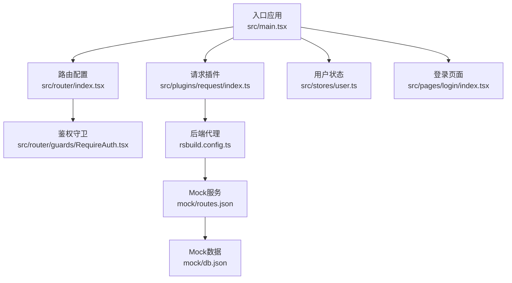
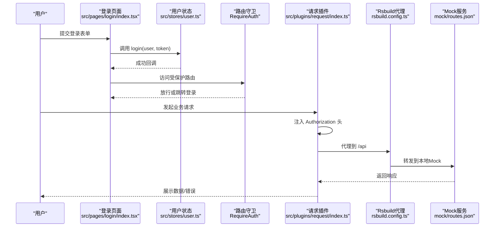
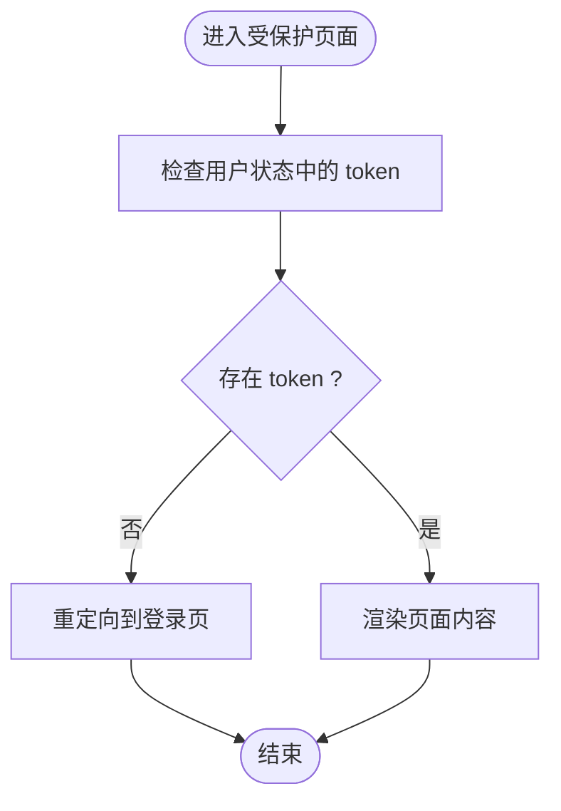
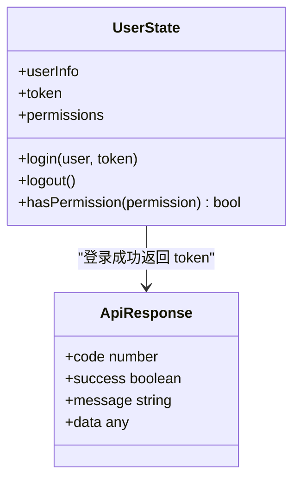
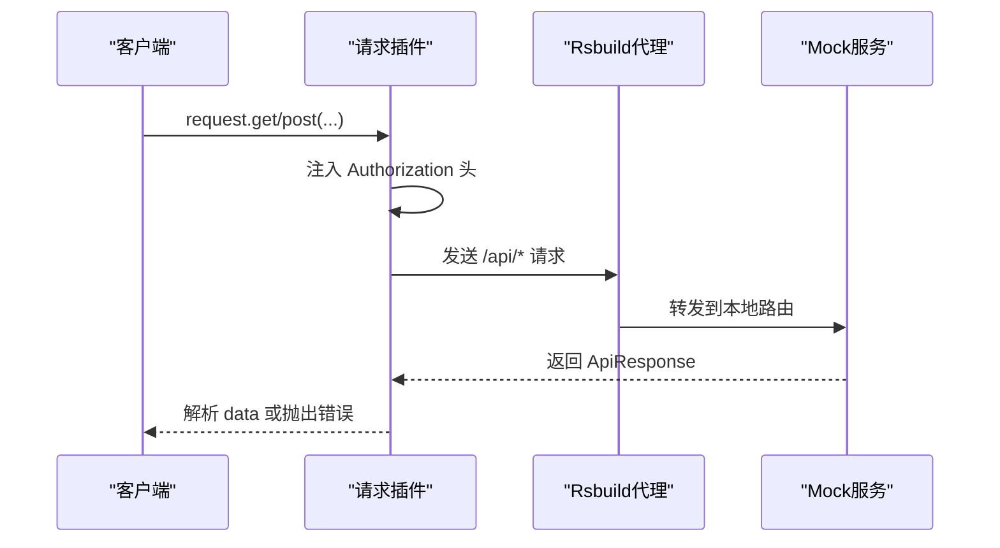
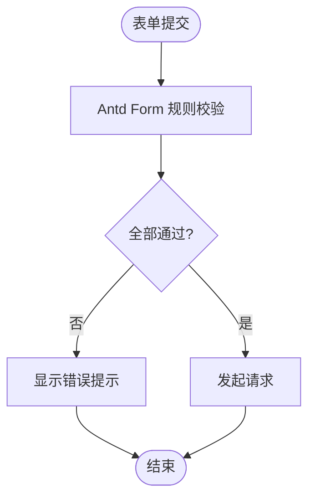
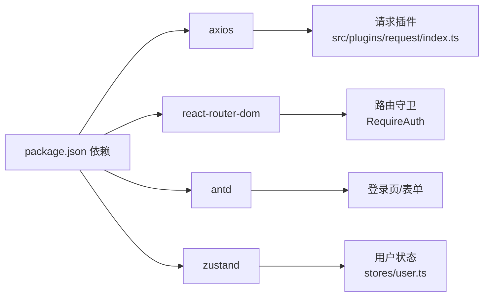

# 安全开发

<cite>
**本文引用的文件**
- [src/main.tsx](file://src/main.tsx)
- [src/router/index.tsx](file://src/router/index.tsx)
- [src/router/guards/RequireAuth.tsx](file://src/router/guards/RequireAuth.tsx)
- [src/stores/user.ts](file://src/stores/user.ts)
- [src/plugins/request/index.ts](file://src/plugins/request/index.ts)
- [src/router/routes/auth.tsx](file://src/router/routes/auth.tsx)
- [src/pages/login/index.tsx](file://src/pages/login/index.tsx)
- [src/constants/config.ts](file://src/constants/config.ts)
- [src/types/index.ts](file://src/types/index.ts)
- [rsbuild.config.ts](file://rsbuild.config.ts)
- [mock/db.json](file://mock/db.json)
- [mock/routes.json](file://mock/routes.json)
- [package.json](file://package.json)
</cite>

## 目录

1. [引言](#引言)
2. [项目结构](#项目结构)
3. [核心组件](#核心组件)
4. [架构总览](#架构总览)
5. [详细组件分析](#详细组件分析)
6. [依赖分析](#依赖分析)
7. [性能考虑](#性能考虑)
8. [故障排查指南](#故障排查指南)
9. [结论](#结论)
10. [附录](#附录)

## 引言

本指南面向前端安全开发，结合当前仓库中的实际实现，系统讲解以下内容：

- 前端安全威胁与防护：XSS、CSRF、点击劫持等
- 身份认证与授权：令牌管理、权限验证、会话安全
- 数据传输安全：HTTPS、敏感数据处理、API 设计
- 输入验证与输出编码：最佳实践与常见陷阱
- 常见漏洞案例与修复建议

目标是帮助开发者在不牺牲开发体验的前提下，建立可落地的安全基线。

## 项目结构

该前端工程采用 React + TypeScript 技术栈，配合 Zustand 状态管理、Ant Design UI 组件库与 Axios 请求封装。路由守卫负责鉴权控制，Mock 服务用于本地联调。

图示来源

- [src/main.tsx](file://src/main.tsx#L1-L32)
- [src/router/index.tsx](file://src/router/index.tsx#L1-L9)
- [src/router/guards/RequireAuth.tsx](file://src/router/guards/RequireAuth.tsx#L1-L25)
- [src/plugins/request/index.ts](file://src/plugins/request/index.ts#L1-L114)
- [src/stores/user.ts](file://src/stores/user.ts#L1-L76)
- [src/pages/login/index.tsx](file://src/pages/login/index.tsx#L1-L133)
- [rsbuild.config.ts](file://rsbuild.config.ts#L1-L29)
- [mock/routes.json](file://mock/routes.json#L1-L10)
- [mock/db.json](file://mock/db.json#L1-L140)

章节来源

- [src/main.tsx](file://src/main.tsx#L1-L32)
- [src/router/index.tsx](file://src/router/index.tsx#L1-L9)
- [rsbuild.config.ts](file://rsbuild.config.ts#L1-L29)

## 核心组件

- 路由守卫 RequireAuth：通过读取用户状态中的 token 决定是否放行
- 请求插件 request：统一注入 Authorization 头、集中处理 401/403 等错误
- 用户状态 stores/user：保存 token、用户信息、权限，并持久化部分状态
- 登录页面：触发登录流程，写入用户状态与本地存储
- 常量配置：白名单路由、超时、正则校验等

章节来源

- [src/router/guards/RequireAuth.tsx](file://src/router/guards/RequireAuth.tsx#L1-L25)
- [src/plugins/request/index.ts](file://src/plugins/request/index.ts#L1-L114)
- [src/stores/user.ts](file://src/stores/user.ts#L1-L76)
- [src/pages/login/index.tsx](file://src/pages/login/index.tsx#L1-L133)
- [src/constants/config.ts](file://src/constants/config.ts#L1-L76)

## 架构总览

下图展示了从用户交互到后端请求的整体流程，以及关键的安全控制点。

图示来源

- [src/pages/login/index.tsx](file://src/pages/login/index.tsx#L1-L133)
- [src/stores/user.ts](file://src/stores/user.ts#L1-L76)
- [src/router/guards/RequireAuth.tsx](file://src/router/guards/RequireAuth.tsx#L1-L25)
- [src/plugins/request/index.ts](file://src/plugins/request/index.ts#L1-L114)
- [rsbuild.config.ts](file://rsbuild.config.ts#L1-L29)
- [mock/routes.json](file://mock/routes.json#L1-L10)

## 详细组件分析

### 身份认证与会话安全

- 令牌存储：前端使用本地存储保存 token；退出登录时移除本地 token
- 请求头注入：请求拦截器自动为每个请求附加 Authorization 头
- 401 处理：响应拦截器检测 401，提示过期并跳转登录
- 路由守卫：未携带有效 token 的访问被重定向至登录页

图示来源

- [src/router/guards/RequireAuth.tsx](file://src/router/guards/RequireAuth.tsx#L1-L25)
- [src/stores/user.ts](file://src/stores/user.ts#L1-L76)

章节来源

- [src/stores/user.ts](file://src/stores/user.ts#L1-L76)
- [src/plugins/request/index.ts](file://src/plugins/request/index.ts#L1-L114)
- [src/router/guards/RequireAuth.tsx](file://src/router/guards/RequireAuth.tsx#L1-L25)

### 授权与权限验证

- 权限模型：用户状态维护权限数组，支持通配符“\*”
- 权限判断：hasPermission 检查是否存在具体权限或通配符
- 路由元信息：类型中定义了 permission 字段，可用于声明式权限

图示来源

- [src/stores/user.ts](file://src/stores/user.ts#L1-L76)
- [src/types/index.ts](file://src/types/index.ts#L87-L101)

章节来源

- [src/stores/user.ts](file://src/stores/user.ts#L1-L76)
- [src/types/index.ts](file://src/types/index.ts#L30-L37)

### 数据传输安全与 API 设计

- 请求封装：统一超时、JSON 头部、错误处理
- 代理配置：开发环境通过 Rsbuild 将 /api 前缀代理到本地 Mock 服务
- 响应格式：统一 ApiResponse 结构，便于前端一致处理

图示来源

- [src/plugins/request/index.ts](file://src/plugins/request/index.ts#L1-L114)
- [rsbuild.config.ts](file://rsbuild.config.ts#L13-L21)
- [mock/routes.json](file://mock/routes.json#L1-L10)

章节来源

- [src/plugins/request/index.ts](file://src/plugins/request/index.ts#L1-L114)
- [rsbuild.config.ts](file://rsbuild.config.ts#L1-L29)
- [mock/routes.json](file://mock/routes.json#L1-L10)

### 输入验证与输出编码

- 表单校验：Ant Design Form 的规则用于必填、类型校验
- 正则常量：REGEX 中提供手机号、邮箱、密码、URL、身份证等正则
- 输出渲染：使用 Ant Design 组件，避免直接 innerHTML 渲染用户输入

图示来源

- [src/pages/login/index.tsx](file://src/pages/login/index.tsx#L72-L120)
- [src/constants/config.ts](file://src/constants/config.ts#L48-L61)

章节来源

- [src/pages/login/index.tsx](file://src/pages/login/index.tsx#L1-L133)
- [src/constants/config.ts](file://src/constants/config.ts#L48-L61)

### 前端安全威胁与防护

#### XSS（跨站脚本攻击）

- 风险：直接 innerHTML 或危险 DOM API 可能执行恶意脚本
- 现状：页面未出现直接 innerHTML 使用；表单输出经 Antd 组件渲染
- 建议：
  - 严格禁止使用 innerHTML、dangerouslySetInnerHTML
  - 使用 Content Security Policy（CSP），限制脚本来源
  - 对富文本输出进行白名单过滤或使用安全的渲染库
  - 对用户输入进行严格的输入验证与最小权限输出

章节来源

- [src/pages/login/index.tsx](file://src/pages/login/index.tsx#L52-L130)

#### CSRF（跨站请求伪造）

- 风险：登录态持久化在本地存储，无 SameSite Cookie 保护
- 现状：请求通过 Authorization Bearer 头传递，未使用同源 Cookie
- 建议：
  - 后端开启 SameSite=Strict/Lax，配合 CSRF Token
  - 前端对关键操作增加二次确认与验证码
  - 限制敏感操作的幂等性与有效期
  - 使用双提交 Cookie 模式（需后端配合）

章节来源

- [src/plugins/request/index.ts](file://src/plugins/request/index.ts#L20-L32)

#### 点击劫持

- 风险：iframe 嵌套导致用户误点
- 现状：未发现显式的 iframe 嵌套场景
- 建议：
  - 设置 X-Frame-Options: DENY 或使用 CSP frame-ancestors
  - 对弹窗、模态框等覆盖层设置 z-index 与遮罩层级
  - 对外部链接打开新窗口并关闭返回来源

章节来源

- [src/main.tsx](file://src/main.tsx#L17-L31)

#### 敏感数据处理

- 令牌存储：localStorage 存储 token，存在 XSS 风险
- 建议：
  - 将 token 存放在 HttpOnly Cookie 中（需后端配合）
  - 若必须使用 localStorage，启用 CSP、HTTPS、最小暴露面
  - 对 token 设置较短有效期与刷新机制
  - 退出登录时清理本地存储与内存中的 token

章节来源

- [src/stores/user.ts](file://src/stores/user.ts#L53-L60)
- [src/plugins/request/index.ts](file://src/plugins/request/index.ts#L20-L32)

#### HTTPS 与传输安全

- 现状：开发环境通过 Rsbuild 代理；生产部署需启用 HTTPS
- 建议：
  - 生产环境强制 HTTPS，HSTS 启用
  - 证书更新与中间证书链完整
  - 开启 TLS 最小版本与安全套件策略

章节来源

- [rsbuild.config.ts](file://rsbuild.config.ts#L11-L22)
- [package.json](file://package.json#L1-L81)

## 依赖分析

- Axios：统一请求封装与错误处理
- React Router：路由与守卫控制
- Ant Design：UI 与表单校验能力
- Rsbuild：开发代理与构建

图示来源

- [package.json](file://package.json#L20-L36)
- [src/plugins/request/index.ts](file://src/plugins/request/index.ts#L1-L114)
- [src/router/guards/RequireAuth.tsx](file://src/router/guards/RequireAuth.tsx#L1-L25)
- [src/stores/user.ts](file://src/stores/user.ts#L1-L76)

章节来源

- [package.json](file://package.json#L20-L36)

## 性能考虑

- 请求拦截器统一注入 Authorization，减少重复代码
- 响应拦截器集中处理错误，避免分散的错误分支
- 路由守卫轻量判断 token，避免复杂逻辑阻塞首屏

[本节为通用指导，不直接分析具体文件]

## 故障排查指南

- 登录后仍被重定向到登录页
  - 检查登录成功后是否正确调用登录动作写入状态
  - 确认路由守卫读取的 token 是否存在
- 401 未触发跳转
  - 检查响应拦截器是否正确识别 401 并清理 token
  - 确认页面刷新后是否重新加载状态
- 请求失败或报错
  - 查看响应拦截器对不同状态码的处理
  - 检查代理配置与 Mock 路由映射

章节来源

- [src/pages/login/index.tsx](file://src/pages/login/index.tsx#L36-L43)
- [src/router/guards/RequireAuth.tsx](file://src/router/guards/RequireAuth.tsx#L15-L21)
- [src/plugins/request/index.ts](file://src/plugins/request/index.ts#L34-L76)
- [mock/routes.json](file://mock/routes.json#L1-L10)

## 结论

本项目在前端安全方面具备基础的令牌管理、统一请求封装与路由守卫机制。为进一步强化安全，建议：

- 后端配合启用 SameSite Cookie 与 CSRF Token，前端补充二次确认
- 生产环境强制 HTTPS，完善 CSP 策略
- 对 token 存储进行更安全的方案评估
- 在权限模型基础上扩展细粒度资源级授权

[本节为总结性内容，不直接分析具体文件]

## 附录

### 常见漏洞案例与修复建议

- 案例：XSS 注入
  - 现象：用户输入被直接渲染为 HTML
  - 修复：避免 innerHTML；使用安全渲染；CSP 限制
- 案例：CSRF
  - 现象：第三方站点发起未授权请求
  - 修复：SameSite Cookie + CSRF Token；关键操作二次确认
- 案例：点击劫持
  - 现象：用户误点弹窗或按钮
  - 修复：X-Frame-Options 或 CSP frame-ancestors；合理遮罩层级
- 案例：令牌泄露
  - 现象：localStorage 中 token 被 XSS 读取
  - 修复：HttpOnly Cookie；缩短有效期；刷新机制

[本节为概念性内容，不直接分析具体文件]
