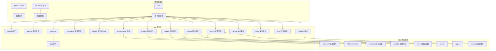
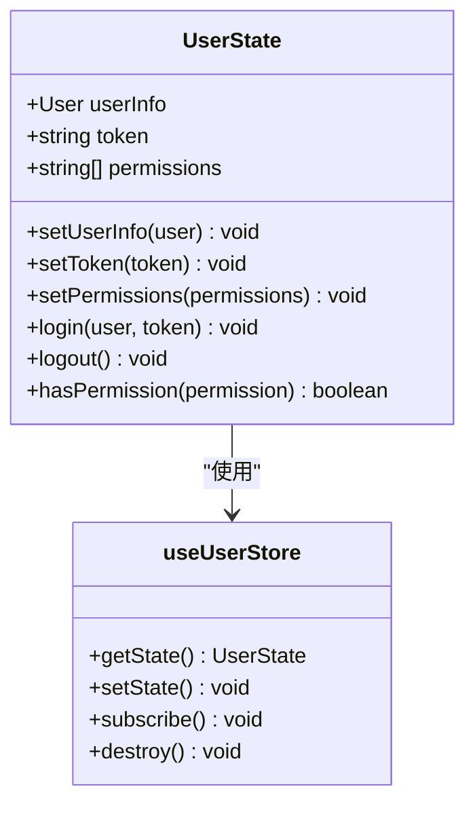
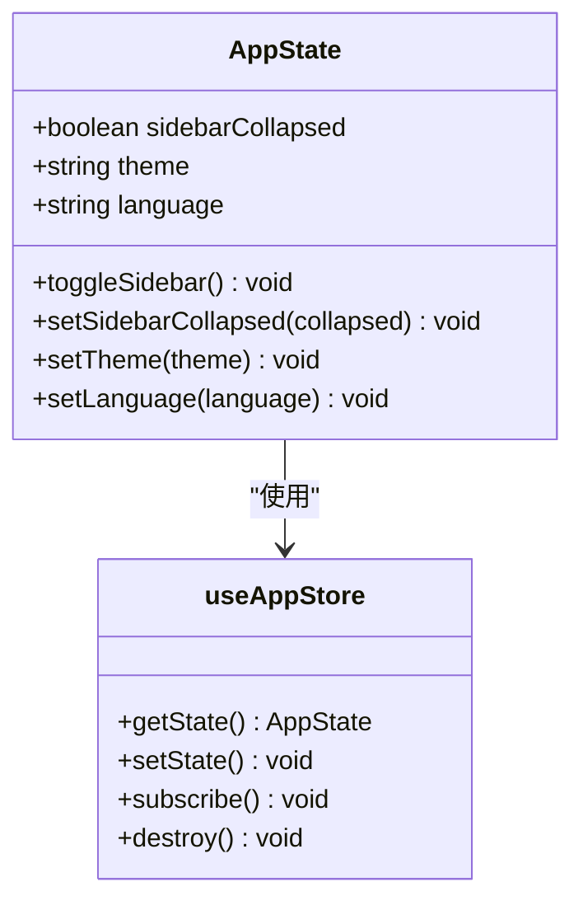
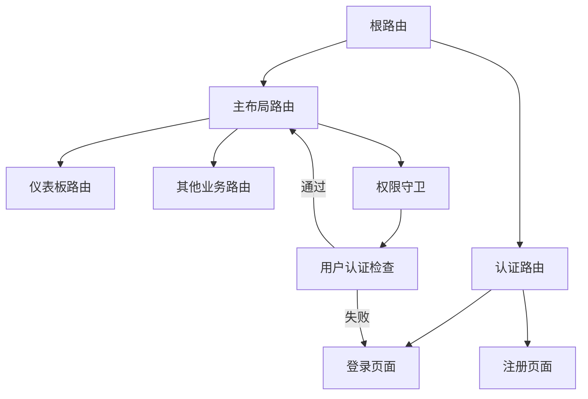
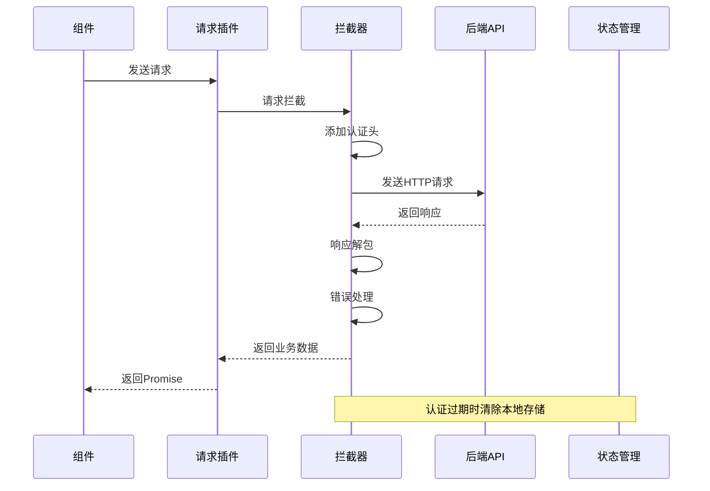
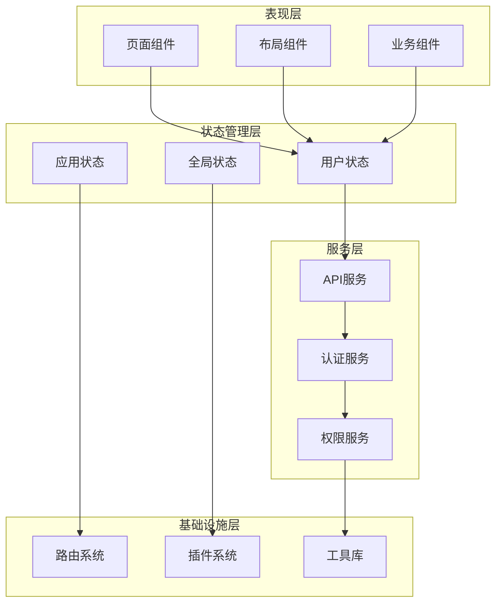
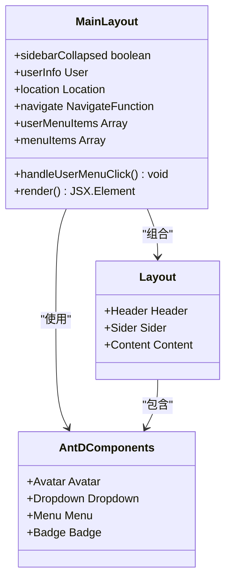
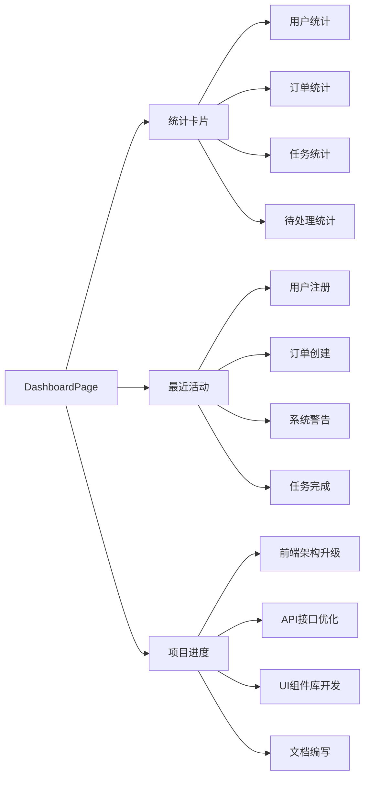
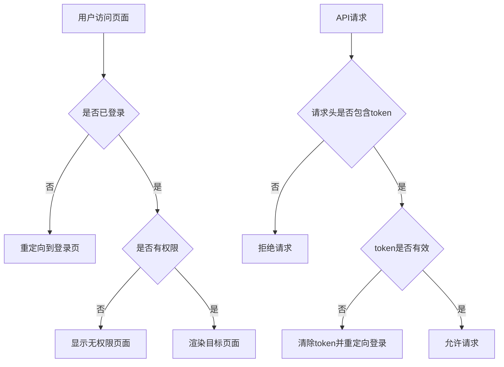
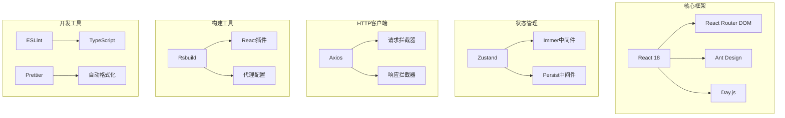

# 开发指南

<cite>
**本文档引用的文件**
- [package.json](file://package.json)
- [rsbuild.config.ts](file://rsbuild.config.ts)
- [src/main.tsx](file://src/main.tsx)
- [src/router/index.tsx](file://src/router/index.tsx)
- [src/router/routes/index.tsx](file://src/router/routes/index.tsx)
- [src/layouts/MainLayout.tsx](file://src/layouts/MainLayout.tsx)
- [src/pages/dashboard/index.tsx](file://src/pages/dashboard/index.tsx)
- [src/stores/user.ts](file://src/stores/user.ts)
- [src/stores/app.ts](file://src/stores/app.ts)
- [src/plugins/request/index.ts](file://src/plugins/request/index.ts)
- [src/constants/config.ts](file://src/constants/config.ts)
- [src/types/index.ts](file://src/types/index.ts)
</cite>

## 目录

1. [简介](#简介)
2. [项目结构](#项目结构)
3. [核心组件](#核心组件)
4. [架构概览](#架构概览)
5. [详细组件分析](#详细组件分析)
6. [依赖关系分析](#依赖关系分析)
7. [性能考虑](#性能考虑)
8. [故障排除指南](#故障排除指南)
9. [结论](#结论)

## 简介

AI管理系统是一个基于React 18、TypeScript和Ant Design的现代化前端应用。该项目采用模块化架构设计，集成了状态管理、路由控制、API请求处理等核心功能，为AI相关业务提供完整的管理界面解决方案。

项目具有以下特点：

- 响应式设计，支持多设备访问
- 完整的用户认证和权限控制系统
- 模块化的组件架构
- 类型安全的TypeScript实现
- 现代化的构建工具链

## 项目结构

项目采用清晰的目录组织结构，按照功能模块进行划分：

**图表来源**

- [src/main.tsx:1-32](file://src/main.tsx#L1-L32)
- [package.json:1-86](file://package.json#L1-L86)

**章节来源**

- [package.json:1-86](file://package.json#L1-L86)
- [rsbuild.config.ts:1-30](file://rsbuild.config.ts#L1-L30)

## 核心组件

### 状态管理系统

项目采用Zustand作为状态管理解决方案，提供了轻量级且类型安全的状态管理方案。

#### 用户状态管理

用户状态管理涵盖了用户信息、认证令牌和权限控制等功能：

**图表来源**

- [src/stores/user.ts:1-76](file://src/stores/user.ts#L1-L76)

#### 应用状态管理

应用状态管理负责管理全局应用配置，如侧边栏状态、主题切换和语言设置：

**图表来源**

- [src/stores/app.ts:1-59](file://src/stores/app.ts#L1-L59)

**章节来源**

- [src/stores/user.ts:1-76](file://src/stores/user.ts#L1-L76)
- [src/stores/app.ts:1-59](file://src/stores/app.ts#L1-L59)

### 路由系统

项目采用React Router v6的现代路由系统，支持嵌套路由和权限控制：

**图表来源**

- [src/router/routes/index.tsx:1-31](file://src/router/routes/index.tsx#L1-L31)
- [src/router/index.tsx:1-9](file://src/router/index.tsx#L1-L9)

**章节来源**

- [src/router/routes/index.tsx:1-31](file://src/router/routes/index.tsx#L1-L31)
- [src/router/index.tsx:1-9](file://src/router/index.tsx#L1-L9)

### API请求插件

统一的HTTP请求处理机制，提供了完整的请求和响应拦截器：

**图表来源**

- [src/plugins/request/index.ts:1-115](file://src/plugins/request/index.ts#L1-L115)

**章节来源**

- [src/plugins/request/index.ts:1-115](file://src/plugins/request/index.ts#L1-L115)

## 架构概览

项目采用分层架构设计，各层职责明确，耦合度低：

**图表来源**

- [src/main.tsx:1-32](file://src/main.tsx#L1-L32)
- [src/layouts/MainLayout.tsx:1-174](file://src/layouts/MainLayout.tsx#L1-L174)

## 详细组件分析

### 主布局组件

主布局组件是整个应用的核心容器，提供了统一的导航和用户界面：

**图表来源**

- [src/layouts/MainLayout.tsx:1-174](file://src/layouts/MainLayout.tsx#L1-L174)

#### 布局特性

- 响应式侧边栏，支持折叠展开
- 用户信息下拉菜单
- 通知徽章显示
- 动态主题适配

**章节来源**

- [src/layouts/MainLayout.tsx:1-174](file://src/layouts/MainLayout.tsx#L1-L174)

### 仪表板页面

仪表板页面展示了核心的业务统计数据和实时信息：

**图表来源**

- [src/pages/dashboard/index.tsx:1-170](file://src/pages/dashboard/index.tsx#L1-L170)

**章节来源**

- [src/pages/dashboard/index.tsx:1-170](file://src/pages/dashboard/index.tsx#L1-L170)

### 权限控制系统

项目实现了完善的权限控制机制，确保系统的安全性：

**图表来源**

- [src/stores/user.ts:62-65](file://src/stores/user.ts#L62-L65)
- [src/plugins/request/index.ts:21-33](file://src/plugins/request/index.ts#L21-L33)

**章节来源**

- [src/stores/user.ts:62-65](file://src/stores/user.ts#L62-L65)
- [src/plugins/request/index.ts:21-33](file://src/plugins/request/index.ts#L21-L33)

## 依赖关系分析

项目使用了现代化的技术栈，各依赖项协同工作：

**图表来源**

- [package.json:31-47](file://package.json#L31-L47)
- [package.json:48-72](file://package.json#L48-L72)

**章节来源**

- [package.json:31-47](file://package.json#L31-L47)
- [package.json:48-72](file://package.json#L48-L72)

### 关键依赖说明

| 依赖项   | 版本    | 用途       |
| -------- | ------- | ---------- |
| react    | ^18.3.0 | 核心框架   |
| antd     | ^5.29.3 | UI组件库   |
| zustand  | ^5.0.11 | 状态管理   |
| axios    | ^1.7.0  | HTTP客户端 |
| dayjs    | ^1.11.0 | 日期处理   |
| chart.js | ^4.5.1  | 图表可视化 |

**章节来源**

- [package.json:31-47](file://package.json#L31-L47)

## 性能考虑

### 构建优化

- 使用Rsbuild进行快速构建
- 支持代码分割和懒加载
- 开发环境热更新支持

### 运行时优化

- Zustand提供高性能状态管理
- Immer中间件优化不可变更新
- 按需加载Ant Design组件

### 缓存策略

- Token持久化存储
- 应用配置缓存
- 图片和静态资源缓存

## 故障排除指南

### 常见问题及解决方案

#### 登录认证问题

**症状**: 登录后无法访问受保护页面
**原因**: Token过期或无效
**解决**: 清除浏览器本地存储，重新登录

#### API请求失败

**症状**: 页面加载空白或出现错误提示
**原因**: 后端服务不可用或网络问题
**解决**: 检查后端服务状态，确认网络连接

#### 样式显示异常

**症状**: 页面布局错乱或样式丢失
**原因**: CSS文件加载失败
**解决**: 刷新页面，检查网络连接

**章节来源**

- [src/plugins/request/index.ts:49-77](file://src/plugins/request/index.ts#L49-L77)

### 开发调试技巧

#### 环境配置

- 开发环境端口: 3000
- API代理目标: http://localhost:3001
- 热更新支持

#### 调试工具

- 浏览器开发者工具
- React DevTools
- Redux DevTools（用于状态调试）

## 结论

AI管理系统是一个结构清晰、功能完整的前端应用框架。项目采用了现代化的技术栈和最佳实践，为AI相关业务提供了可靠的技术基础。

### 主要优势

- 模块化架构设计，易于维护和扩展
- 类型安全的TypeScript实现
- 完善的权限控制机制
- 现代化的构建工具链
- 丰富的UI组件库集成

### 发展建议

- 继续完善组件库建设
- 增强测试覆盖率
- 优化性能监控
- 扩展国际化支持

该框架为后续的功能扩展和技术演进奠定了良好的基础，适合在企业级AI管理场景中长期使用和发展。
