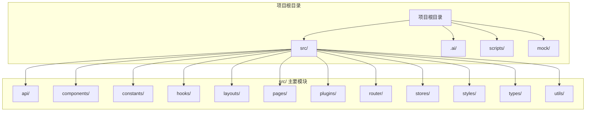
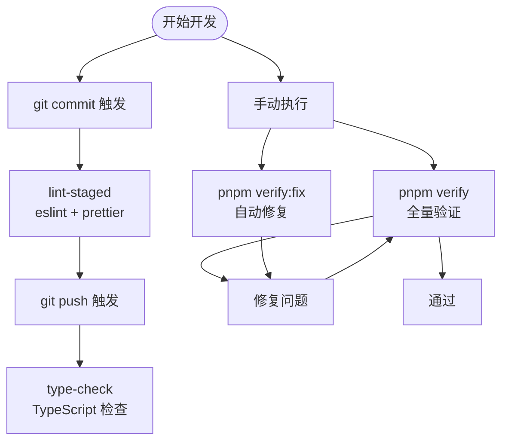
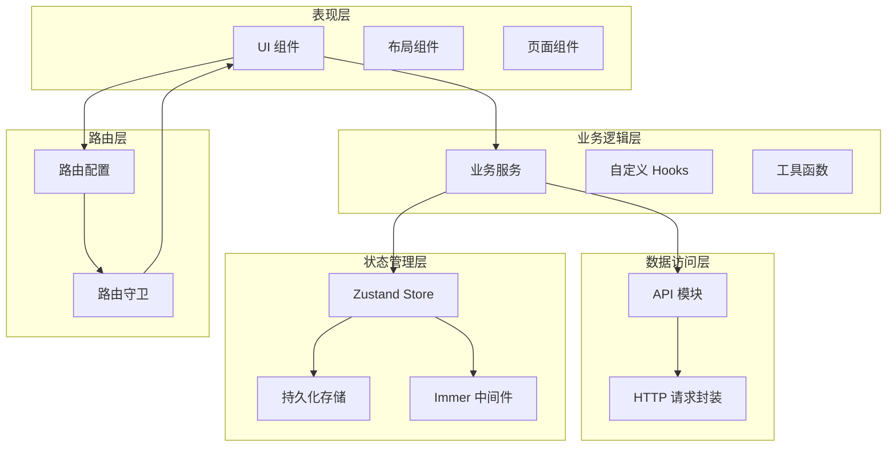
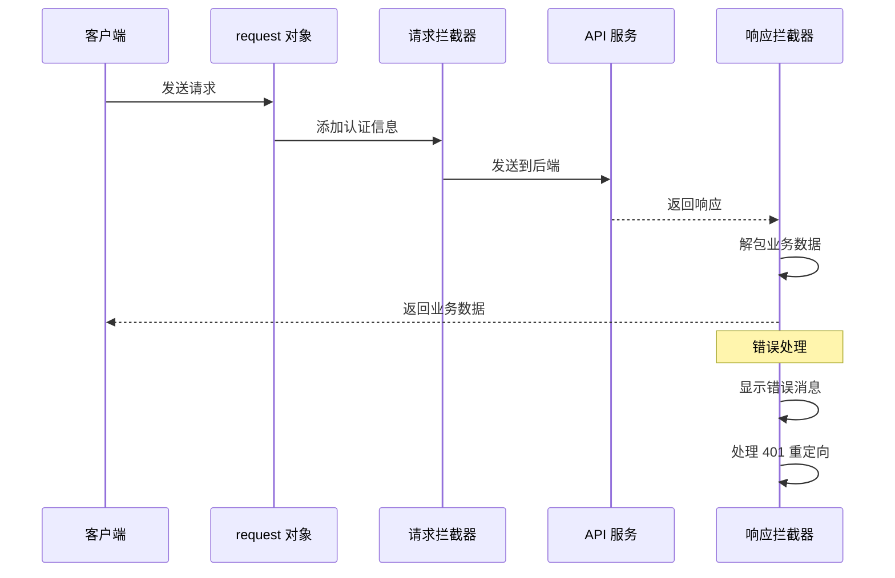
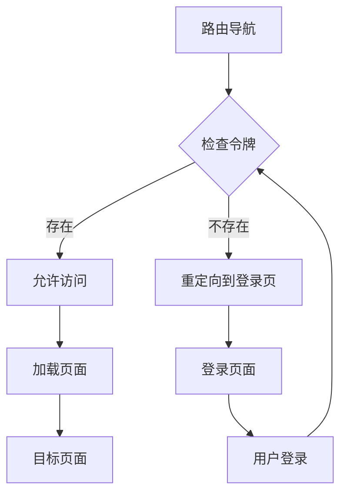
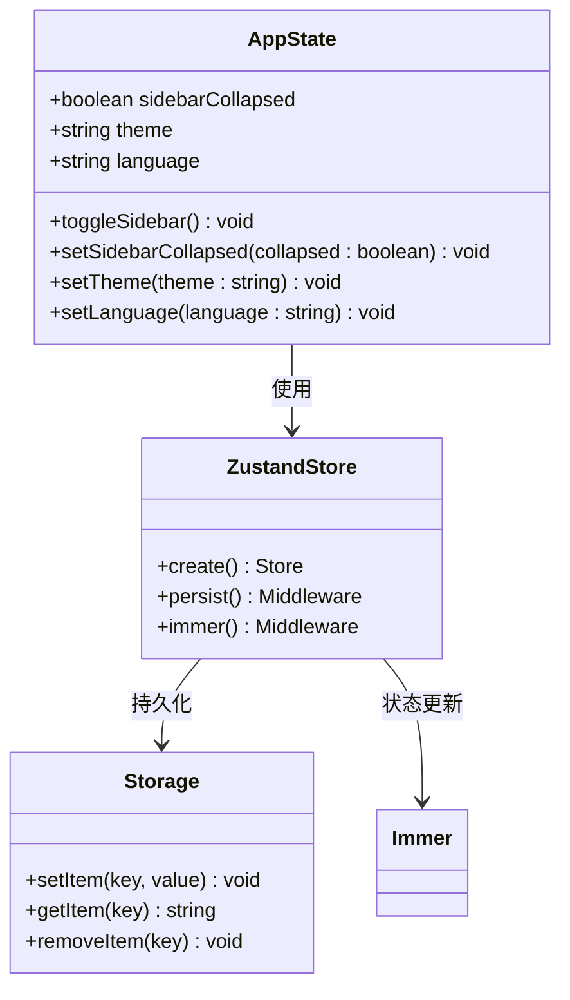
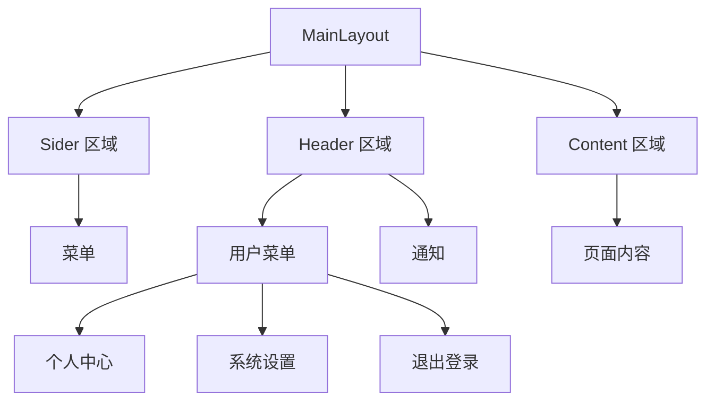

# 开发约定

<cite>
**本文档引用的文件**
- [package.json](file://package.json)
- [eslint.config.mjs](file://eslint.config.mjs)
- [.prettierrc](file://.prettierrc)
- [tsconfig.json](file://tsconfig.json)
- [AGENTS.md](file://AGENTS.md)
- [.ai/README.md](file://.ai/README.md)
- [src/constants/config.ts](file://src/constants/config.ts)
- [src/plugins/request/index.ts](file://src/plugins/request/index.ts)
- [src/router/guards/RequireAuth.tsx](file://src/router/guards/RequireAuth.tsx)
- [src/stores/app.ts](file://src/stores/app.ts)
- [src/layouts/MainLayout.tsx](file://src/layouts/MainLayout.tsx)
- [src/utils/index.ts](file://src/utils/index.ts)
</cite>

## 目录

1. [简介](#简介)
2. [项目结构](#项目结构)
3. [核心开发约定](#核心开发约定)
4. [架构概览](#架构概览)
5. [详细组件分析](#详细组件分析)
6. [依赖关系分析](#依赖关系分析)
7. [性能考虑](#性能考虑)
8. [故障排除指南](#故障排除指南)
9. [结论](#结论)

## 简介

本项目是一个基于 React 18 + TypeScript 5 + @dalydb/sdesign + Zustand + Rsbuild 的前端管理系统。项目采用严格的开发约定和最佳实践，确保代码质量和开发效率。

## 项目结构

项目采用模块化的组织方式，主要分为以下几个核心目录：



**图表来源**

- [AGENTS.md:42-60](file://AGENTS.md#L42-L60)

**章节来源**

- [AGENTS.md:42-60](file://AGENTS.md#L42-L60)

## 核心开发约定

### 组件使用约束

项目严格限制业务组件中对 antd 高阶组件的直接使用，强制使用 @dalydb/sdesign 组件库：

| 禁止直接使用        | 必须替换为                | 来源              |
| ------------------- | ------------------------- | ----------------- |
| antd `Table`        | `STable` / `SSearchTable` | `@dalydb/sdesign` |
| antd `Form`         | `SForm` / `SForm.Search`  | `@dalydb/sdesign` |
| antd `Button`       | `SButton`                 | `@dalydb/sdesign` |
| antd `Descriptions` | `SDetail`                 | `@dalydb/sdesign` |

**豁免范围**：仅限以下目录/文件可直接使用 antd 组件：

- `src/pages/login/`
- `src/pages/error/`
- `src/layouts/`
- `src/router/`

**章节来源**

- [AGENTS.md:7-21](file://AGENTS.md#L7-L21)

### 导入规则

1. **HTTP 请求**：禁止直接导入 axios，必须使用 `@/plugins/request` 中的 request 对象
2. **类型安全**：禁止使用 `any` 类型，必须使用具体类型或泛型
3. **导入语法**：类型导入使用 `import type { ... }`
4. **路径别名**：使用 `@/` 或 `src/` 别名，禁止使用 `../../` 相对路径
5. **状态管理**：使用 Zustand + immer，禁止 Redux

**章节来源**

- [AGENTS.md:22-28](file://AGENTS.md#L22-L28)

### 代码质量保证

项目通过多种工具确保代码质量：



**图表来源**

- [package.json:22-30](file://package.json#L22-L30)
- [package.json:6](file://package.json#L6-L21)

**章节来源**

- [package.json:6-21](file://package.json#L6-L21)
- [package.json:22-30](file://package.json#L22-L30)

## 架构概览

项目采用分层架构设计，各层职责明确：



**图表来源**

- [AGENTS.md:42-60](file://AGENTS.md#L42-L60)
- [src/plugins/request/index.ts:1-115](file://src/plugins/request/index.ts#L1-L115)
- [src/stores/app.ts:1-59](file://src/stores/app.ts#L1-L59)

## 详细组件分析

### HTTP 请求封装

项目实现了统一的 HTTP 请求封装，提供完整的错误处理机制：



**图表来源**

- [src/plugins/request/index.ts:20-77](file://src/plugins/request/index.ts#L20-L77)

**章节来源**

- [src/plugins/request/index.ts:1-115](file://src/plugins/request/index.ts#L1-L115)

### 路由守卫机制

项目实现基于令牌的路由守卫，确保用户认证：



**图表来源**

- [src/router/guards/RequireAuth.tsx:11-22](file://src/router/guards/RequireAuth.tsx#L11-L22)

**章节来源**

- [src/router/guards/RequireAuth.tsx:1-25](file://src/router/guards/RequireAuth.tsx#L1-L25)

### 状态管理架构

项目采用 Zustand + Immer + Persist 的组合方案：



**图表来源**

- [src/stores/app.ts:18-58](file://src/stores/app.ts#L18-L58)

**章节来源**

- [src/stores/app.ts:1-59](file://src/stores/app.ts#L1-L59)

### 布局组件设计

主布局组件提供完整的应用框架：



**图表来源**

- [src/layouts/MainLayout.tsx:74-170](file://src/layouts/MainLayout.tsx#L74-L170)

**章节来源**

- [src/layouts/MainLayout.tsx:1-174](file://src/layouts/MainLayout.tsx#L1-L174)

## 依赖关系分析

项目的核心依赖关系如下：

```mermaid
graph TB
subgraph "运行时依赖"
React[react]
Antd[antd]
Sdesign[@dalydb/sdesign]
Axios[axios]
Zustand[zustand]
Immer[immer]
Dayjs[dayjs]
Ahooks[ahooks]
end
subgraph "开发依赖"
TypeScript[typescript]
ESLint[eslint]
Prettier[prettier]
Rsbuild[@rsbuild/core]
Husky[husky]
end
subgraph "构建工具"
TsConfig[tsconfig.json]
ESLintConfig[eslint.config.mjs]
PrettierConfig[.prettierrc]
end
React --> Antd
React --> Sdesign
Sdesign --> Antd
Zustand --> Immer
Dayjs --> Utils
Axios --> Request
Request --> Plugins
TypeScript --> TsConfig
ESLint --> ESLintConfig
Prettier --> PrettierConfig
```

**图表来源**

- [package.json:31-71](file://package.json#L31-L71)
- [tsconfig.json:2-23](file://tsconfig.json#L2-L23)

**章节来源**

- [package.json:31-71](file://package.json#L31-L71)
- [tsconfig.json:2-23](file://tsconfig.json#L2-L23)

## 性能考虑

### 代码分割和懒加载

项目采用按需加载策略，优化首屏加载性能：

- 页面组件使用 React.lazy 实现代码分割
- 路由级别懒加载减少初始包体积
- 图片和字体资源优化加载

### 状态管理优化

- 使用 Zustand 替代 Redux，减少样板代码
- Immer 中间件提供不可变更新的便利性
- Persist 中间件实现状态持久化，避免重复请求

### 缓存策略

- HTTP 请求缓存机制
- 浏览器本地存储优化
- 组件渲染缓存

## 故障排除指南

### 常见 ESLint 错误

1. **类型安全错误**
   - 症状：`Type 'any' is not assignable to type 'string'`
   - 解决：使用具体类型或泛型替代 any

2. **导入路径错误**
   - 症状：`Cannot find module '@/plugins/request'`
   - 解决：使用正确的路径别名 `@/` 或 `src/`

3. **组件使用错误**
   - 症状：`'Table' is not allowed here`
   - 解决：使用对应的 SForm/SButton 等组件

### 构建错误排查

1. **TypeScript 编译错误**
   - 使用 `pnpm type-check` 进行类型检查
   - 检查 tsconfig.json 配置

2. **Prettier 格式化错误**
   - 使用 `pnpm prettier` 进行格式化检查
   - 检查 .prettierrc 配置

3. **ESLint 规则冲突**
   - 使用 `pnpm lint:fix` 自动修复
   - 检查 eslint.config.mjs 配置

**章节来源**

- [eslint.config.mjs:28-95](file://eslint.config.mjs#L28-L95)
- [package.json:10-20](file://package.json#L10-L20)

## 结论

本项目建立了完善的开发约定体系，通过严格的组件使用约束、统一的导入规则、完善的代码质量保证机制，确保了项目的可维护性和开发效率。项目采用现代化的技术栈和最佳实践，为后续的功能扩展和团队协作奠定了坚实的基础。

关键优势包括：

- 明确的组件使用规范，确保设计一致性
- 完善的错误处理机制，提升用户体验
- 严格的代码质量控制，保证代码可维护性
- 清晰的项目结构，便于新成员快速上手

建议开发者在开发过程中始终遵循这些约定，确保代码质量和项目稳定性。
