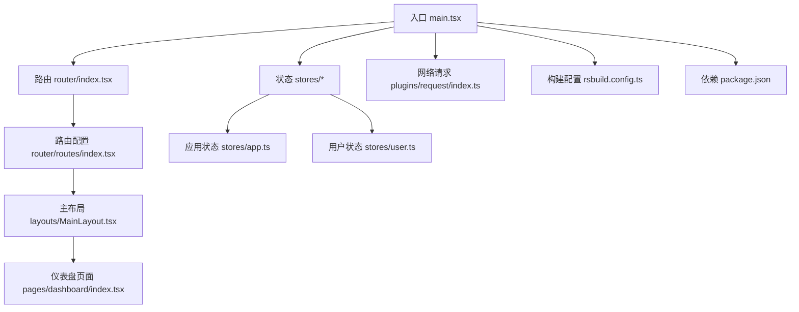
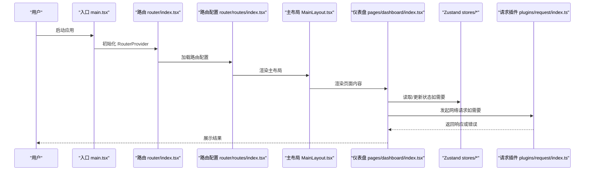
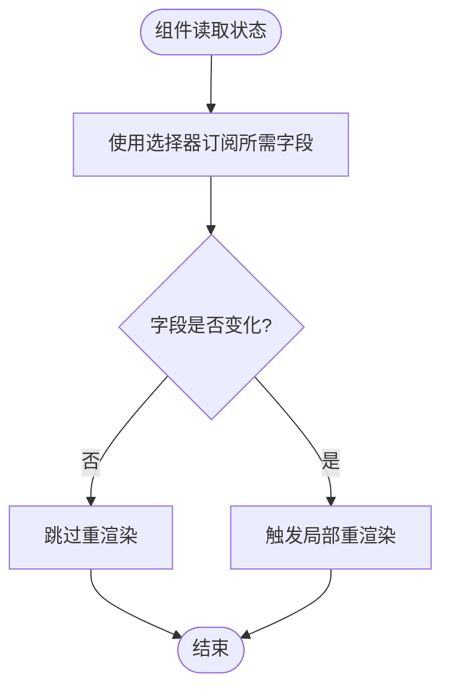
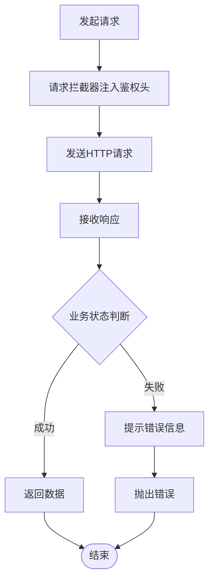
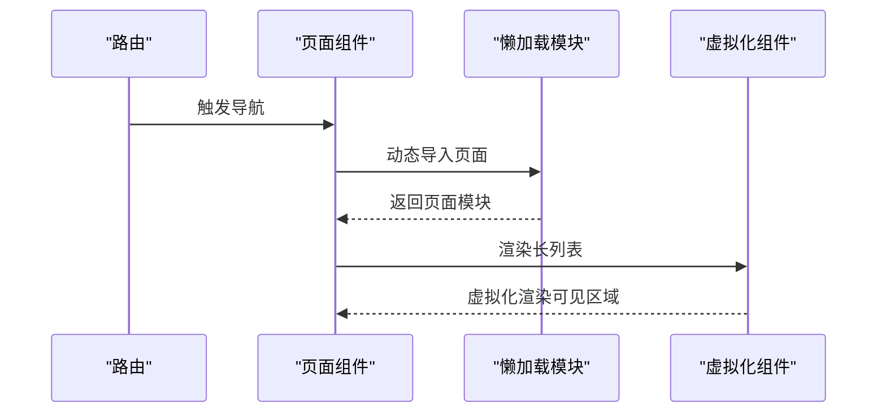
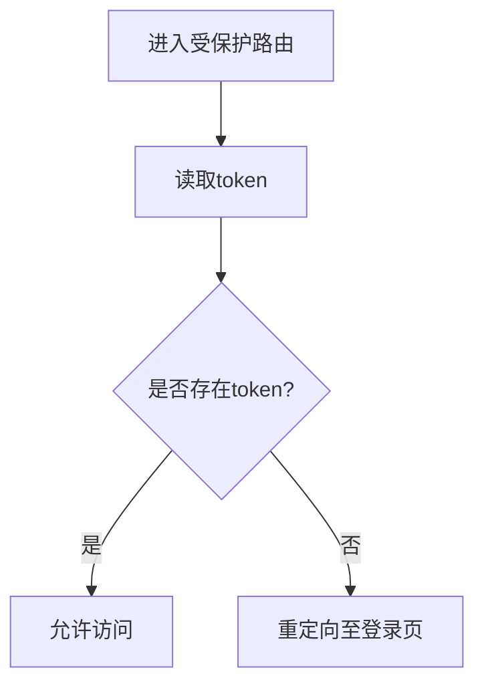
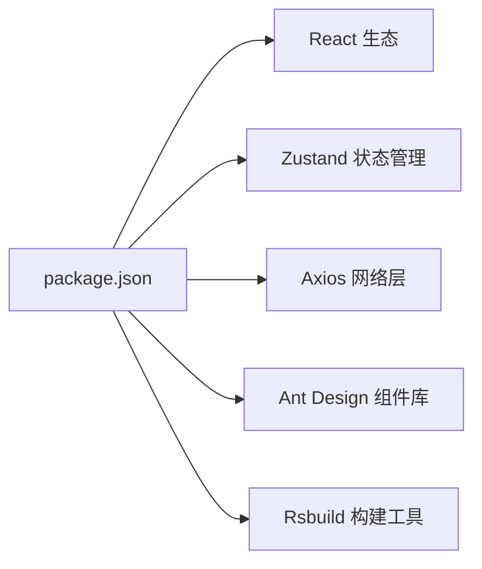

# 性能优化

<cite>
**本文引用的文件**
- [package.json](file://package.json)
- [rsbuild.config.ts](file://rsbuild.config.ts)
- [src/main.tsx](file://src/main.tsx)
- [src/stores/app.ts](file://src/stores/app.ts)
- [src/stores/user.ts](file://src/stores/user.ts)
- [src/stores/index.ts](file://src/stores/index.ts)
- [src/plugins/request/index.ts](file://src/plugins/request/index.ts)
- [src/layouts/MainLayout.tsx](file://src/layouts/MainLayout.tsx)
- [src/pages/dashboard/index.tsx](file://src/pages/dashboard/index.tsx)
- [src/router/index.tsx](file://src/router/index.tsx)
- [src/router/routes/index.tsx](file://src/router/routes/index.tsx)
- [src/router/guards/RequireAuth.tsx](file://src/router/guards/RequireAuth.tsx)
</cite>

## 目录

1. [引言](#引言)
2. [项目结构](#项目结构)
3. [核心组件](#核心组件)
4. [架构总览](#架构总览)
5. [详细组件分析](#详细组件分析)
6. [依赖分析](#依赖分析)
7. [性能考量与优化建议](#性能考量与优化建议)
8. [故障排查指南](#故障排查指南)
9. [结论](#结论)
10. [附录：性能指标与监控方案](#附录性能指标与监控方案)

## 引言

本指南围绕该AI管理系统前端的性能优化展开，结合现有代码实现，系统性地给出React组件优化（memo化、懒加载、代码分割）、状态管理（Zustand）性能考虑、网络请求优化（缓存、并发控制、错误重试）、构建优化（Tree Shaking、Bundle分析、资源压缩）以及性能指标监控与案例分析。目标是帮助开发者在不破坏现有功能的前提下，持续提升应用的首屏速度、交互流畅度与资源占用。

## 项目结构

项目采用React + TypeScript + Rsbuild 构建，状态管理基于Zustand，网络请求通过Axios封装插件统一处理，路由采用React Router v6。整体结构清晰，便于进行模块级性能优化。

图表来源

- [src/main.tsx](file://src/main.tsx#L1-L32)
- [src/router/index.tsx](file://src/router/index.tsx#L1-L9)
- [src/router/routes/index.tsx](file://src/router/routes/index.tsx#L1-L31)
- [src/layouts/MainLayout.tsx](file://src/layouts/MainLayout.tsx#L1-L174)
- [src/pages/dashboard/index.tsx](file://src/pages/dashboard/index.tsx#L1-L170)
- [src/stores/app.ts](file://src/stores/app.ts#L1-L59)
- [src/stores/user.ts](file://src/stores/user.ts#L1-L76)
- [src/plugins/request/index.ts](file://src/plugins/request/index.ts#L1-L114)
- [rsbuild.config.ts](file://rsbuild.config.ts#L1-L30)
- [package.json](file://package.json#L1-L81)

章节来源

- [src/main.tsx](file://src/main.tsx#L1-L32)
- [rsbuild.config.ts](file://rsbuild.config.ts#L1-L30)
- [package.json](file://package.json#L1-L81)

## 核心组件

- 入口与主题配置：在入口中集中配置Ant Design主题与国际化，减少重复渲染与全局样式抖动。
- 状态层：使用Zustand的持久化中间件与Immer，按域拆分store，降低无关状态变更导致的重渲染范围。
- 网络层：Axios实例化与拦截器统一封装，集中处理鉴权头、业务错误与网络异常提示。
- 路由守卫：基于用户token的鉴权守卫，避免无意义的页面渲染与无效请求。
- 页面与布局：Dashboard页面为静态展示型组件，适合后续引入懒加载与虚拟化优化。

章节来源

- [src/main.tsx](file://src/main.tsx#L17-L31)
- [src/stores/app.ts](file://src/stores/app.ts#L1-L59)
- [src/stores/user.ts](file://src/stores/user.ts#L1-L76)
- [src/plugins/request/index.ts](file://src/plugins/request/index.ts#L1-L114)
- [src/router/guards/RequireAuth.tsx](file://src/router/guards/RequireAuth.tsx#L1-L25)
- [src/pages/dashboard/index.tsx](file://src/pages/dashboard/index.tsx#L1-L170)

## 架构总览

下图展示了从入口到页面渲染、状态更新与网络请求的整体流程，便于定位性能瓶颈与优化切入点。

图表来源

- [src/main.tsx](file://src/main.tsx#L1-L32)
- [src/router/index.tsx](file://src/router/index.tsx#L1-L9)
- [src/router/routes/index.tsx](file://src/router/routes/index.tsx#L1-L31)
- [src/layouts/MainLayout.tsx](file://src/layouts/MainLayout.tsx#L1-L174)
- [src/pages/dashboard/index.tsx](file://src/pages/dashboard/index.tsx#L1-L170)
- [src/stores/index.ts](file://src/stores/index.ts#L1-L3)
- [src/plugins/request/index.ts](file://src/plugins/request/index.ts#L1-L114)

## 详细组件分析

### Zustand 状态管理的性能优化

- 拆分粒度：将应用状态与用户状态分别存储，避免全局状态变更触发非相关组件重渲染。
- 持久化与选择器：仅持久化必要字段；在组件中使用选择器读取子状态，减少订阅范围。
- Immer优化：在不可变更新场景下保持简洁写法，同时避免深层拷贝开销。
- 订阅最小化：避免在组件内直接订阅整个store对象，推荐按需订阅字段。

图表来源

- [src/stores/app.ts](file://src/stores/app.ts#L1-L59)
- [src/stores/user.ts](file://src/stores/user.ts#L1-L76)
- [src/stores/index.ts](file://src/stores/index.ts#L1-L3)

章节来源

- [src/stores/app.ts](file://src/stores/app.ts#L1-L59)
- [src/stores/user.ts](file://src/stores/user.ts#L1-L76)
- [src/stores/index.ts](file://src/stores/index.ts#L1-L3)

### 网络请求优化

- 统一拦截器：在请求拦截器中注入鉴权头，在响应拦截器中处理业务错误与网络异常，减少重复逻辑。
- 错误分类与提示：对401、403、404、500等状态码进行差异化处理，避免未捕获异常导致的崩溃。
- 并发控制与重试：当前实现未内置重试机制，可在请求插件中增加指数退避与并发队列控制，避免风暴效应。
- 缓存策略：可引入请求去重与响应缓存（如LRU），针对高频且低变动的数据接口提升命中率。

图表来源

- [src/plugins/request/index.ts](file://src/plugins/request/index.ts#L1-L114)

章节来源

- [src/plugins/request/index.ts](file://src/plugins/request/index.ts#L1-L114)

### React 组件性能优化

- 懒加载与代码分割：对路由级页面与重型组件采用动态导入，配合Suspense实现渐进式加载。
- Memo化：对纯展示组件使用memo，避免props浅比较相等时的重复渲染；对高阶组件与回调函数使用useMemo/useCallback。
- 列表渲染：对长列表使用虚拟化（如react-window或react-virtualized），降低DOM节点数量。
- 图片与资源：启用图片懒加载、WebP格式与合适的尺寸裁剪，减少带宽与内存占用。

图表来源

- [src/router/routes/index.tsx](file://src/router/routes/index.tsx#L1-L31)
- [src/pages/dashboard/index.tsx](file://src/pages/dashboard/index.tsx#L1-L170)

章节来源

- [src/router/routes/index.tsx](file://src/router/routes/index.tsx#L1-L31)
- [src/pages/dashboard/index.tsx](file://src/pages/dashboard/index.tsx#L1-L170)

### 路由守卫与鉴权

- 基于token的鉴权守卫在进入受保护路由前检查用户状态，避免无效渲染与请求。
- 建议将鉴权逻辑与路由配置解耦，便于在多处复用与测试。

图表来源

- [src/router/guards/RequireAuth.tsx](file://src/router/guards/RequireAuth.tsx#L1-L25)

章节来源

- [src/router/guards/RequireAuth.tsx](file://src/router/guards/RequireAuth.tsx#L1-L25)

## 依赖分析

- 构建工具：Rsbuild默认启用React插件，具备基础的Tree Shaking能力；可通过配置进一步优化打包策略。
- 运行时依赖：React、Zustand、Axios、Ant Design等均为性能敏感模块，需关注版本与体积。
- 开发依赖：ESLint、Prettier、TypeScript等提升开发效率，间接促进性能优化落地。

图表来源

- [package.json](file://package.json#L20-L56)
- [rsbuild.config.ts](file://rsbuild.config.ts#L1-L30)

章节来源

- [package.json](file://package.json#L1-L81)
- [rsbuild.config.ts](file://rsbuild.config.ts#L1-L30)

## 性能考量与优化建议

### React 组件优化

- 使用memo化：对稳定props的展示组件进行memo，避免无谓重渲染。
- 回调与计算：对昂贵计算使用useMemo，对回调使用useCallback，防止闭包导致的重复渲染。
- 路由级懒加载：将大型页面组件通过动态导入实现代码分割，结合Suspense提升体验。
- 列表虚拟化：对长列表采用虚拟化方案，仅渲染可视区域元素。

章节来源

- [src/pages/dashboard/index.tsx](file://src/pages/dashboard/index.tsx#L1-L170)
- [src/layouts/MainLayout.tsx](file://src/layouts/MainLayout.tsx#L1-L174)

### 状态管理优化（Zustand）

- 拆分store：按领域拆分store，避免跨域状态互相影响。
- 选择器订阅：在组件中使用选择器订阅子状态，缩小订阅范围。
- 持久化精简：仅持久化必要字段，减少本地存储压力与初始化成本。
- Immer与不可变更新：在保证可读性的前提下，减少深拷贝开销。

章节来源

- [src/stores/app.ts](file://src/stores/app.ts#L1-L59)
- [src/stores/user.ts](file://src/stores/user.ts#L1-L76)

### 网络请求优化

- 请求缓存：对高频查询接口增加缓存（如LRU），设置TTL与失效策略。
- 并发控制：限制同时请求数量，避免风暴效应；对重复请求进行去重。
- 错误重试：对临时性错误（如网络抖动）实施指数退避重试，提升成功率。
- 统一拦截器：继续完善拦截器，集中处理鉴权、错误与日志上报。

章节来源

- [src/plugins/request/index.ts](file://src/plugins/request/index.ts#L1-L114)

### 构建优化

- Tree Shaking：确保模块导出为命名导出，避免副作用；使用Rsbuild默认策略。
- Bundle分析：开启分析报告，识别大体积依赖与重复模块，针对性优化。
- 资源压缩：启用Gzip/Brotli压缩与资源内联策略，平衡首屏与缓存。
- 代码分割：对路由页面与第三方库进行按需加载，减少初始包体。

章节来源

- [rsbuild.config.ts](file://rsbuild.config.ts#L1-L30)
- [package.json](file://package.json#L1-L81)

### 性能指标与监控

- 关键指标：FCP/LCP/FID/CLS/TBT，结合浏览器性能面板与Web Vitals。
- 埋点与上报：在路由切换、页面渲染、请求完成等节点埋点，采集耗时与错误。
- APM集成：接入轻量APM（如自研或开源方案），实时观测性能趋势与回归。

章节来源

- [src/main.tsx](file://src/main.tsx#L1-L32)
- [src/plugins/request/index.ts](file://src/plugins/request/index.ts#L1-L114)

## 故障排查指南

- 登录态异常：若出现401自动跳转登录，检查本地token是否被清理或过期，确认拦截器是否正确注入Authorization头。
- 请求失败：根据响应状态码查看错误提示，定位后端问题或参数错误。
- 路由无法进入：检查鉴权守卫逻辑与token状态，确保路由配置正确。
- 打包体积过大：使用分析报告定位大依赖，评估是否可替换或按需加载。

章节来源

- [src/plugins/request/index.ts](file://src/plugins/request/index.ts#L48-L76)
- [src/router/guards/RequireAuth.tsx](file://src/router/guards/RequireAuth.tsx#L15-L21)
- [rsbuild.config.ts](file://rsbuild.config.ts#L1-L30)

## 结论

通过在组件层引入memo化与懒加载、在状态层精细化拆分与选择器订阅、在网络层完善缓存与重试策略，并结合构建工具的Tree Shaking与Bundle分析，可以系统性地提升应用的启动速度、交互流畅度与资源占用表现。建议在迭代过程中持续监控关键指标，形成“优化—观测—再优化”的闭环。

## 附录：性能指标与监控方案

- 指标采集：首屏时间、交互延迟、布局抖动、错误率。
- 上报策略：采样上报、批量合并、降噪处理。
- 工具链：浏览器开发者工具、Web Vitals、构建分析报告、APM平台。
