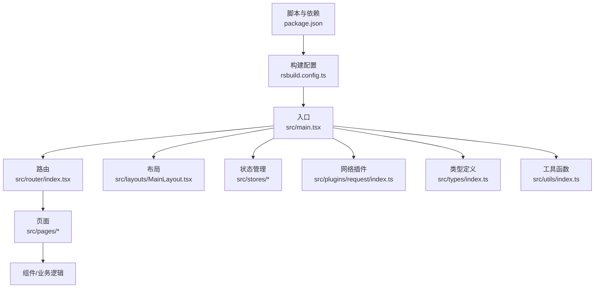
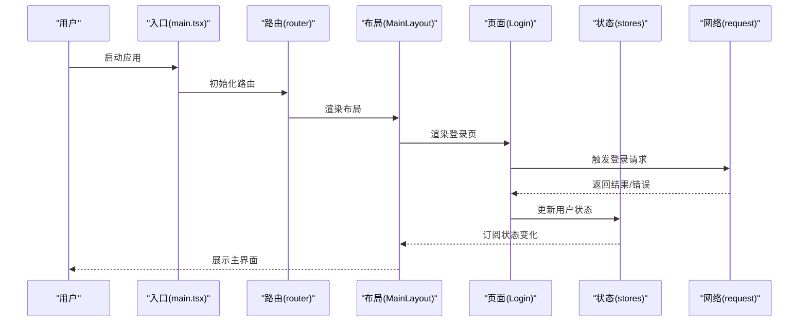
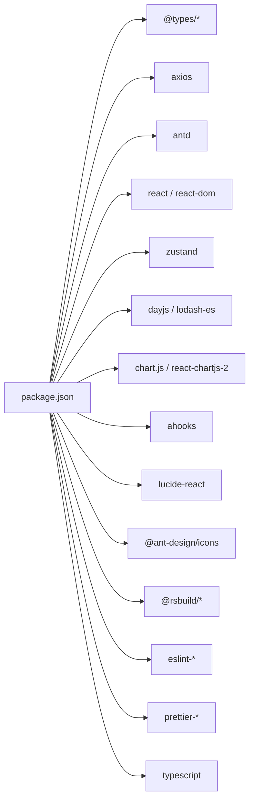

# 最佳实践

<cite>
**本文引用的文件**
- [.eslintrc.cjs](file://.eslintrc.cjs)
- [.prettierrc](file://.prettierrc)
- [tsconfig.json](file://tsconfig.json)
- [package.json](file://package.json)
- [rsbuild.config.ts](file://rsbuild.config.ts)
- [src/main.tsx](file://src/main.tsx)
- [src/types/index.ts](file://src/types/index.ts)
- [src/utils/index.ts](file://src/utils/index.ts)
- [src/hooks/index.ts](file://src/hooks/index.ts)
- [src/router/index.tsx](file://src/router/index.tsx)
- [src/stores/index.ts](file://src/stores/index.ts)
- [src/plugins/request/index.ts](file://src/plugins/request/index.ts)
- [src/layouts/MainLayout.tsx](file://src/layouts/MainLayout.tsx)
- [src/pages/login/index.tsx](file://src/pages/login/index.tsx)
</cite>

## 目录

1. [引言](#引言)
2. [项目结构](#项目结构)
3. [核心组件](#核心组件)
4. [架构总览](#架构总览)
5. [详细组件分析](#详细组件分析)
6. [依赖分析](#依赖分析)
7. [性能考量](#性能考量)
8. [故障排查指南](#故障排查指南)
9. [结论](#结论)
10. [附录](#附录)

## 引言

本指南面向本项目的前端开发团队，旨在建立统一的开发最佳实践，覆盖编码规范与风格（ESLint、Prettier、TypeScript）、性能优化（组件渲染、状态管理、网络请求）、安全开发（认证与授权、输入校验、错误处理）以及可维护性设计（模块组织、命名约定、注释与文档）。文中所有建议均基于仓库现有配置与代码实现进行提炼，并提供可操作的改进建议与重构思路。

## 项目结构

项目采用以功能域为中心的目录组织方式：页面、布局、组件、路由、状态、工具、类型、插件与构建配置相对独立且职责清晰。入口文件负责初始化国际化、主题与路由；全局类型与工具函数为各页面与组件提供一致的数据模型与通用能力；网络层通过 Axios 插件封装统一鉴权与错误处理；状态管理采用 Zustand 简化应用状态；构建使用 Rsbuild 并内置 React 插件与代理配置。

图表来源

- [src/main.tsx](file://src/main.tsx#L1-L32)
- [src/router/index.tsx](file://src/router/index.tsx#L1-L9)
- [src/layouts/MainLayout.tsx](file://src/layouts/MainLayout.tsx#L1-L174)
- [src/stores/index.ts](file://src/stores/index.ts#L1-L3)
- [src/plugins/request/index.ts](file://src/plugins/request/index.ts#L1-L114)
- [src/types/index.ts](file://src/types/index.ts#L1-L101)
- [src/utils/index.ts](file://src/utils/index.ts#L1-L106)
- [rsbuild.config.ts](file://rsbuild.config.ts#L1-L30)
- [package.json](file://package.json#L1-L81)

章节来源

- [src/main.tsx](file://src/main.tsx#L1-L32)
- [rsbuild.config.ts](file://rsbuild.config.ts#L1-L30)
- [package.json](file://package.json#L1-L81)

## 核心组件

- 类型系统：集中于 src/types/index.ts，提供分页、用户、路由元信息、菜单、表格列、表单字段、API 响应与错误等接口，确保跨模块数据契约一致。
- 工具函数：src/utils/index.ts 提供日期格式化、金额/数字格式化、下载、深拷贝、防抖、节流、唯一 ID、空值判断等通用能力。
- 网络层：src/plugins/request/index.ts 封装 Axios 实例，统一添加 Authorization 头、统一封装响应业务判断与错误提示、按状态码处理 401/403/404/500 等场景。
- 状态管理：src/stores/index.ts 导出 useUserStore/useAppStore，Zustand 简化状态读取与更新。
- 路由与导航：src/router/index.tsx 使用 createBrowserRouter，结合守卫与页面路由组织。
- 布局与页面：src/layouts/MainLayout.tsx 提供侧边栏、头部、内容区与用户下拉菜单；src/pages/login/index.tsx 展示登录流程与表单校验。

章节来源

- [src/types/index.ts](file://src/types/index.ts#L1-L101)
- [src/utils/index.ts](file://src/utils/index.ts#L1-L106)
- [src/plugins/request/index.ts](file://src/plugins/request/index.ts#L1-L114)
- [src/stores/index.ts](file://src/stores/index.ts#L1-L3)
- [src/router/index.tsx](file://src/router/index.tsx#L1-L9)
- [src/layouts/MainLayout.tsx](file://src/layouts/MainLayout.tsx#L1-L174)
- [src/pages/login/index.tsx](file://src/pages/login/index.tsx#L1-L133)

## 架构总览

前端采用“入口初始化 → 路由分发 → 布局承载 → 页面/组件执行 → 状态/网络协同”的线性控制流。构建阶段通过 Rsbuild 注入 React 插件与本地代理，开发时将 /api 前缀转发至本地 Mock 服务端口，便于前后端并行开发。

图表来源

- [src/main.tsx](file://src/main.tsx#L1-L32)
- [src/router/index.tsx](file://src/router/index.tsx#L1-L9)
- [src/layouts/MainLayout.tsx](file://src/layouts/MainLayout.tsx#L1-L174)
- [src/pages/login/index.tsx](file://src/pages/login/index.tsx#L1-L133)
- [src/plugins/request/index.ts](file://src/plugins/request/index.ts#L1-L114)
- [src/stores/index.ts](file://src/stores/index.ts#L1-L3)

## 详细组件分析

### 编码规范与风格（ESLint、Prettier、TypeScript）

- ESLint 规则要点
  - 扩展推荐规则集，启用 TypeScript 与 React Hooks 相关规则。
  - 关闭对显式 any 的报错，允许在特定场景使用，但建议配合严格类型替代。
  - 未使用变量规则开启，忽略以下划线开头的参数占位符，保持简洁。
  - 启用 react-refresh 的仅导出组件警告，避免常量导出导致热更新异常。
  - 忽略 dist 与自身配置文件路径，减少误报。
- Prettier 配置要点
  - 使用 @ianvs/prettier-plugin-sort-imports 对导入顺序进行排序，提升一致性。
  - 支持 package.json 的自动格式化插件，统一版本与脚本格式。
  - 单行宽度 80，单引号，尾随逗号，Markdown 文件保留换行策略。
  - 忽略 node_modules 目录，避免格式化第三方包。
- TypeScript 编译选项要点
  - 目标 ES2022，启用严格模式与未使用检查，禁止 switch 穿透。
  - 使用 bundler 模块解析，支持 TS 扩展名与 JSON 模块。
  - JSX 使用 react-jsx，路径别名 @/\* 指向 src，便于统一导入。

章节来源

- [.eslintrc.cjs](file://.eslintrc.cjs#L1-L21)
- [.prettierrc](file://.prettierrc#L1-L22)
- [tsconfig.json](file://tsconfig.json#L1-L24)

### 性能优化最佳实践

- 组件渲染优化
  - 使用 React.memo 或 useMemo/useCallback 缓存昂贵计算与子组件渲染，避免不必要的重渲染。
  - 列表渲染时提供稳定 key，减少列表重排开销。
  - 图片与大图懒加载，按需加载非首屏资源。
- 状态管理优化
  - Zustand 中拆分细粒度 Store，避免单一 Store 过大导致全局订阅频繁触发。
  - 使用 selector 精准订阅，只订阅需要的状态片段。
  - 避免在 Store 内存放临时 UI 状态或重复派生状态。
- 网络请求优化
  - 合并与去重请求，使用防抖/节流控制高频请求（参考工具函数中的防抖与节流实现）。
  - 合理设置超时与重试策略，区分业务错误与网络错误。
  - 使用分页与懒加载，避免一次性加载大量数据。
- 构建与运行时
  - 使用 Rsbuild 的 Tree Shaking 与代码分割，按需引入依赖。
  - 生产环境开启压缩与资源内联策略，减少请求数量。

章节来源

- [src/utils/index.ts](file://src/utils/index.ts#L56-L87)
- [src/stores/index.ts](file://src/stores/index.ts#L1-L3)
- [rsbuild.config.ts](file://rsbuild.config.ts#L1-L30)

### 安全开发指导原则

- XSS 防护
  - 不直接拼接用户输入到 innerHTML，优先使用受控组件与安全的渲染方式。
  - 对富文本输出进行白名单过滤或使用安全的富文本库。
- CSRF 保护
  - 在请求头中携带 Token，并在服务端校验；前端避免使用 Cookie 自动携带导致跨站请求。
- 数据验证
  - 表单层使用 Ant Design Form 的 rules 进行即时校验，后端返回的业务错误统一处理与提示。
  - 对外部输入与 URL 参数进行严格的类型与范围校验。
- 错误处理与日志
  - 网络层对 401/403/404/500 等状态进行明确处理，必要时记录上下文信息但不泄露敏感数据。
  - 使用统一的消息提示组件，避免直接暴露堆栈或内部错误细节。

章节来源

- [src/plugins/request/index.ts](file://src/plugins/request/index.ts#L34-L76)
- [src/pages/login/index.tsx](file://src/pages/login/index.tsx#L72-L120)

### 可维护性设计原则

- 代码组织
  - 功能域划分清晰：pages、layouts、components、stores、plugins、utils、types。
  - 路由与页面分离，页面内尽量保持纯展示与交互逻辑，复杂逻辑下沉至 hooks 或 stores。
- 命名规范
  - 组件与文件使用帕斯卡命名；常量使用大写下划线；函数与变量使用驼峰；路径别名统一使用 @/\*。
- 注释与文档
  - 公共接口与复杂逻辑添加清晰注释；类型定义提供用途说明；README 或 AI 配置文档补充技术栈与最佳实践。
- 版本与依赖
  - 使用 package.json 的 engines 约束 Node 版本；依赖升级遵循语义化版本；定期运行类型检查与格式化校验。

章节来源

- [src/types/index.ts](file://src/types/index.ts#L1-L101)
- [package.json](file://package.json#L57-L59)

### 代码示例与重构案例

- 示例：登录流程（页面 → 网络 → 状态）
  - 页面层使用 Form.Item 与 rules 进行校验，提交时调用登录 API。
  - 网络层统一注入 Token，根据业务字段判断成功与否并提示。
  - 状态层接收用户信息与 Token，更新全局状态并跳转首页。
- 重构建议
  - 将登录 API 抽离为独立模块，便于替换与测试。
  - 将消息提示抽象为统一的 toast 或 modal 组件，避免散落在页面中。
  - 将 Token 存储策略标准化（如 HttpOnly Cookie 或安全存储），并增加刷新机制。
  - 将布局中的菜单项与权限控制解耦，通过路由元信息与守卫统一管理。

章节来源

- [src/pages/login/index.tsx](file://src/pages/login/index.tsx#L14-L50)
- [src/plugins/request/index.ts](file://src/plugins/request/index.ts#L19-L32)
- [src/stores/index.ts](file://src/stores/index.ts#L1-L3)
- [src/layouts/MainLayout.tsx](file://src/layouts/MainLayout.tsx#L63-L71)

## 依赖分析

- 运行时依赖
  - React、ReactDOM、Ant Design、Chart.js、Day.js、Immer、Lodash-es、Lucide React、React Router DOM、Zustand。
- 开发时依赖
  - Rsbuild、@rsbuild/plugin-react、ESLint 及其 TypeScript、React Hooks、React Refresh 插件，Prettier 及排序与 package.json 插件，TypeScript。
- 构建与代理
  - Rsbuild 配置启用 React 插件，设置本地代理将 /api 转发到本地 Mock 服务端口，便于前后端联调。

图表来源

- [package.json](file://package.json#L20-L56)

章节来源

- [package.json](file://package.json#L1-L81)
- [rsbuild.config.ts](file://rsbuild.config.ts#L1-L30)

## 性能考量

- 渲染层面
  - 控制组件层级深度，避免深层嵌套导致的重渲染风暴。
  - 对高频交互（滚动、输入）使用节流/防抖，降低回调频率。
- 状态层面
  - 将可派生状态从 Store 中移除，通过 selector 计算，减少不必要的订阅。
  - 将 UI 状态与业务状态分离，UI 状态不应触发持久化或全局订阅。
- 网络层面
  - 合理设置超时与重试次数，区分瞬时网络波动与服务不可用。
  - 对长列表与图片资源使用懒加载与缓存策略。
- 构建层面
  - 启用 Tree Shaking 与按需打包，避免引入未使用的依赖。
  - 生产环境开启压缩与资源内联，减少请求数与体积。

章节来源

- [src/utils/index.ts](file://src/utils/index.ts#L56-L87)
- [src/plugins/request/index.ts](file://src/plugins/request/index.ts#L12-L17)
- [rsbuild.config.ts](file://rsbuild.config.ts#L1-L30)

## 故障排查指南

- ESLint 与 Prettier
  - 若出现导入顺序不一致，运行导入排序脚本；若存在未修复的规则，使用 lint:fix 一键修复。
  - 类型检查失败时，先修正类型错误再继续开发。
- 网络请求
  - 401：通常表示 Token 失效，清理本地 Token 并跳转登录页；确认后端是否正确校验 Token。
  - 403：权限不足，检查路由守卫与权限标识；确认用户角色与菜单权限映射。
  - 404：资源不存在，检查接口路径与 Mock 配置；确认代理规则是否正确。
  - 500：服务器内部错误，查看后端日志并回退最近变更。
- 构建与代理
  - 本地代理失效：检查 Rsbuild 代理配置与 Mock 服务端口；确认 /api 前缀是否匹配。
  - 资源加载失败：检查输出目录与静态资源路径；确认 CDN 或本地资源是否存在。

章节来源

- [.eslintrc.cjs](file://.eslintrc.cjs#L9-L19)
- [.prettierrc](file://.prettierrc#L1-L22)
- [tsconfig.json](file://tsconfig.json#L13-L16)
- [src/plugins/request/index.ts](file://src/plugins/request/index.ts#L48-L76)
- [rsbuild.config.ts](file://rsbuild.config.ts#L13-L22)

## 结论

本项目已在编码规范、类型系统、网络层与构建配置方面形成较为完善的基础设施。建议在此基础上进一步强化安全与性能工程实践：完善权限模型与 Token 策略、细化状态拆分与选择器使用、加强网络请求的幂等与重试策略、持续进行代码审查与性能回归测试。通过以上措施，可显著提升系统的稳定性、安全性与可维护性。

## 附录

- 常用脚本
  - 开发：启动 Rsbuild 开发服务器
  - 构建：打包构建产物
  - 预览：本地预览生产构建
  - Mock：启动本地 Mock 服务
  - Lint：执行 ESLint 检查
  - Lint 修复：自动修复可修复问题
  - Prettier：格式化代码并写回
  - 类型检查：执行 TypeScript 类型检查
- 配置文件位置
  - ESLint：.eslintrc.cjs
  - Prettier：.prettierrc
  - TypeScript：tsconfig.json
  - Rsbuild：rsbuild.config.ts
  - 依赖与脚本：package.json

章节来源

- [package.json](file://package.json#L6-L18)
- [.eslintrc.cjs](file://.eslintrc.cjs#L1-L21)
- [.prettierrc](file://.prettierrc#L1-L22)
- [tsconfig.json](file://tsconfig.json#L1-L24)
- [rsbuild.config.ts](file://rsbuild.config.ts#L1-L30)
