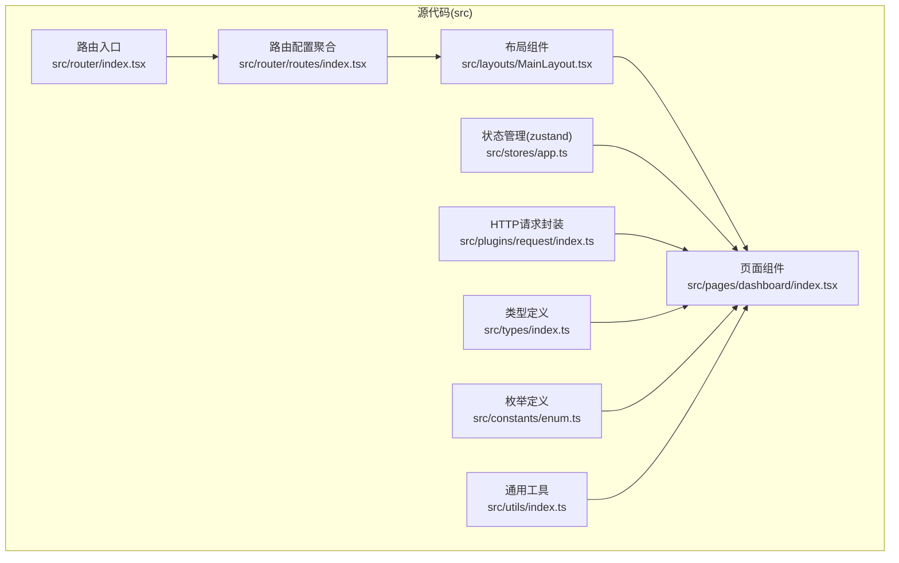
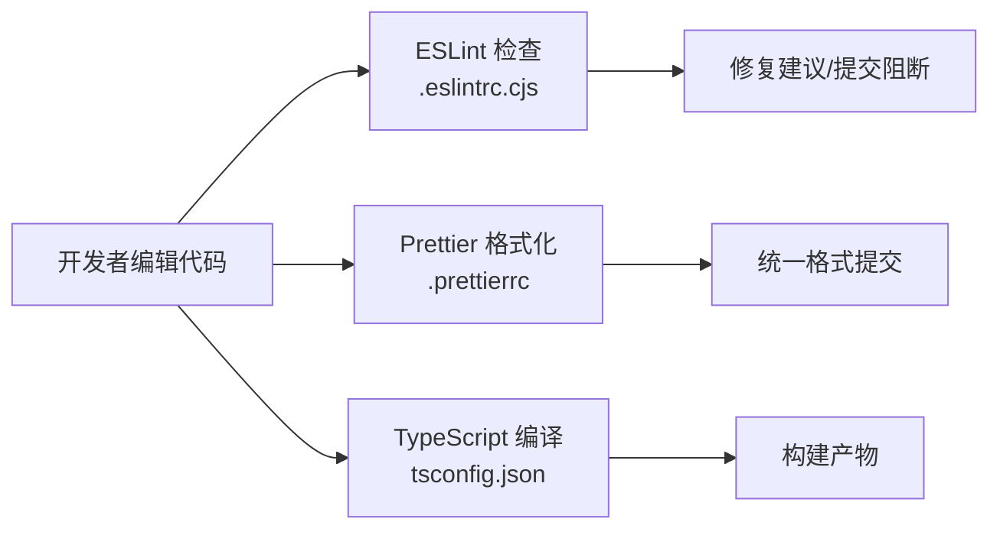
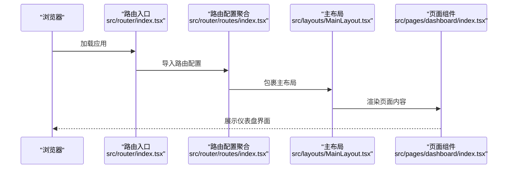
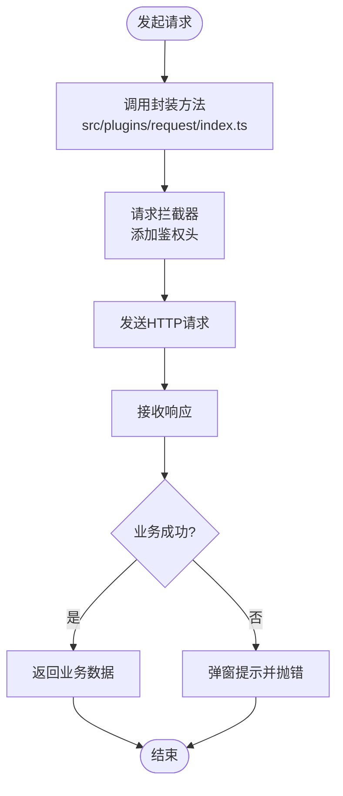
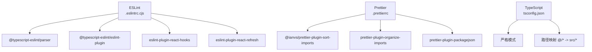

# 编码规范

<cite>
**本文引用的文件**
- [.eslintrc.cjs](file://.eslintrc.cjs)
- [.prettierrc](file://.prettierrc)
- [package.json](file://package.json)
- [tsconfig.json](file://tsconfig.json)
- [src/types/index.ts](file://src/types/index.ts)
- [src/constants/enum.ts](file://src/constants/enum.ts)
- [src/utils/index.ts](file://src/utils/index.ts)
- [src/stores/app.ts](file://src/stores/app.ts)
- [src/plugins/request/index.ts](file://src/plugins/request/index.ts)
- [src/router/index.tsx](file://src/router/index.tsx)
- [src/router/routes/index.tsx](file://src/router/routes/index.tsx)
- [src/layouts/MainLayout.tsx](file://src/layouts/MainLayout.tsx)
- [src/pages/dashboard/index.tsx](file://src/pages/dashboard/index.tsx)
</cite>

## 目录

1. [简介](#简介)
2. [项目结构](#项目结构)
3. [核心组件](#核心组件)
4. [架构概览](#架构概览)
5. [详细组件分析](#详细组件分析)
6. [依赖分析](#依赖分析)
7. [性能考虑](#性能考虑)
8. [故障排查指南](#故障排查指南)
9. [结论](#结论)
10. [附录](#附录)

## 简介

本文件基于项目中的 ESLint、Prettier、TypeScript 编译器配置与典型代码实现，系统性地总结 JavaScript/TypeScript 编码规范与最佳实践，覆盖变量命名、函数定义、接口设计、类型约束、导入排序、格式化标准、以及常见问题排查建议。目标是帮助团队在大型前端工程中保持一致的代码风格与高质量的类型安全。

## 项目结构

本项目采用按功能域组织的目录结构，前端代码集中在 src 目录下，包含页面、布局、路由、状态管理、工具函数、类型定义与插件等模块。TypeScript 严格模式开启，配合 ESLint 与 Prettier 形成“静态检查 + 自动格式化”的质量保障链路。

图表来源

- [src/router/index.tsx](file://src/router/index.tsx#L1-L9)
- [src/router/routes/index.tsx](file://src/router/routes/index.tsx#L1-L31)
- [src/layouts/MainLayout.tsx](file://src/layouts/MainLayout.tsx#L1-L174)
- [src/pages/dashboard/index.tsx](file://src/pages/dashboard/index.tsx#L1-L170)
- [src/stores/app.ts](file://src/stores/app.ts#L1-L59)
- [src/plugins/request/index.ts](file://src/plugins/request/index.ts#L1-L114)
- [src/types/index.ts](file://src/types/index.ts#L1-L101)
- [src/constants/enum.ts](file://src/constants/enum.ts#L1-L70)
- [src/utils/index.ts](file://src/utils/index.ts#L1-L106)

章节来源

- [package.json](file://package.json#L1-L81)
- [tsconfig.json](file://tsconfig.json#L1-L24)

## 核心组件

- ESLint 规则与插件：启用 TypeScript 推荐规则、React Hooks 推荐规则，并通过插件 react-refresh 控制刷新策略；对未使用变量进行严格检查，对显式 any 进行宽松处理。
- Prettier 插件：使用 @ianvs/prettier-plugin-sort-imports 实现导入顺序自动整理，结合内置 organize-imports 与 packagejson 插件提升一致性；支持 Markdown 文本包裹策略定制。
- TypeScript 编译选项：严格模式开启，禁用未使用局部变量与参数，禁止 switch 中遗漏分支，启用 JSX 语法，路径映射 @/_ -> src/_，确保类型安全与可维护性。

章节来源

- [.eslintrc.cjs](file://.eslintrc.cjs#L1-L21)
- [.prettierrc](file://.prettierrc#L1-L22)
- [package.json](file://package.json#L37-L56)
- [tsconfig.json](file://tsconfig.json#L1-L24)

## 架构概览

从“静态检查”到“自动格式化”，再到“编译时类型校验”，形成完整的质量闭环。

图表来源

- [.eslintrc.cjs](file://.eslintrc.cjs#L1-L21)
- [.prettierrc](file://.prettierrc#L1-L22)
- [tsconfig.json](file://tsconfig.json#L1-L24)
- [package.json](file://package.json#L6-L18)

## 详细组件分析

### JavaScript/TypeScript 编码规范（变量命名、函数定义、接口设计、类型约束）

- 变量与常量命名
  - 使用语义化英文命名，避免缩写或无意义名称。
  - 布尔值使用 is/has/can 等前缀，增强可读性。
  - 常量使用全大写下划线分隔命名。
- 函数定义
  - 优先使用具名函数表达式，便于调试与堆栈追踪。
  - 对外暴露的公共函数应具备明确的输入输出类型。
  - 避免在函数体内使用未声明的全局变量。
- 接口设计
  - 使用清晰的领域命名，如 PageData、User、RouteMeta 等。
  - 字段尽量使用只读或受控可变，必要时使用可选属性标记可缺失字段。
  - 对枚举值或联合类型进行收敛，减少歧义。
- 类型约束
  - 合理使用泛型，保持函数与组件的复用性与类型安全。
  - 在需要时使用类型守卫与条件类型，提升类型推导准确性。
  - 避免滥用 any，必要时使用 unknown 并进行运行时校验。

章节来源

- [src/types/index.ts](file://src/types/index.ts#L1-L101)
- [src/constants/enum.ts](file://src/constants/enum.ts#L1-L70)
- [src/utils/index.ts](file://src/utils/index.ts#L1-L106)
- [src/stores/app.ts](file://src/stores/app.ts#L1-L59)

### Prettier 格式化规则与最佳实践

- 导入顺序
  - 通过插件自动将第三方库、@ 开头的别名、相对路径与通配符分类排序。
  - 保持稳定且可预测的导入顺序，降低合并冲突。
- 代码宽度与换行
  - 单行最大长度为 80，超出时自动换行。
  - Markdown 文件采用保留换行策略，保证文档可读性。
- 引号与逗号
  - 统一使用单引号。
  - 所有对象与数组末尾保留拖尾逗号，提升 diff 友好度。
- 缓存与脚本
  - 提供缓存扫描与批量格式化脚本，加速本地与 CI 流程。

章节来源

- [.prettierrc](file://.prettierrc#L1-L22)
- [package.json](file://package.json#L12-L13)

### TypeScript 类型系统最佳实践

- 严格模式与未使用检测
  - 启用严格模式、未使用局部变量与参数检测，减少潜在错误。
- 泛型与类型推导
  - 在高阶函数与工具函数中广泛使用泛型，保持类型精确性。
  - 通过条件类型与工具类型提升可组合性。
- 接口与枚举
  - 使用接口描述契约，使用枚举收敛取值范围，避免魔法字符串。
- 路径映射与模块解析
  - 使用 @/\* 映射 src，简化导入路径，提升可移植性。

章节来源

- [tsconfig.json](file://tsconfig.json#L1-L24)
- [src/types/index.ts](file://src/types/index.ts#L1-L101)
- [src/constants/enum.ts](file://src/constants/enum.ts#L1-L70)
- [src/utils/index.ts](file://src/utils/index.ts#L52-L87)

### 代码示例：正确与错误写法对比（示例路径）

以下示例不直接展示代码内容，仅提供路径以便对照学习：

- 正确：使用具名函数与明确类型
  - [src/utils/index.ts](file://src/utils/index.ts#L59-L87)
- 错误：使用匿名函数与隐式 any
  - [src/plugins/request/index.ts](file://src/plugins/request/index.ts#L79-L111)
- 正确：接口字段收敛与可选属性
  - [src/types/index.ts](file://src/types/index.ts#L17-L28)
- 错误：魔法字符串与未收敛枚举
  - [src/constants/enum.ts](file://src/constants/enum.ts#L4-L8)
- 正确：泛型约束与类型守卫
  - [src/utils/index.ts](file://src/utils/index.ts#L52-L87)
- 错误：未使用变量与未处理的异常
  - [src/plugins/request/index.ts](file://src/plugins/request/index.ts#L34-L76)

章节来源

- [src/utils/index.ts](file://src/utils/index.ts#L52-L87)
- [src/plugins/request/index.ts](file://src/plugins/request/index.ts#L79-L111)
- [src/types/index.ts](file://src/types/index.ts#L17-L28)
- [src/constants/enum.ts](file://src/constants/enum.ts#L4-L8)

### 路由与布局集成流程

图表来源

- [src/router/index.tsx](file://src/router/index.tsx#L1-L9)
- [src/router/routes/index.tsx](file://src/router/routes/index.tsx#L1-L31)
- [src/layouts/MainLayout.tsx](file://src/layouts/MainLayout.tsx#L1-L174)
- [src/pages/dashboard/index.tsx](file://src/pages/dashboard/index.tsx#L1-L170)

### 状态管理与请求封装流程

图表来源

- [src/plugins/request/index.ts](file://src/plugins/request/index.ts#L1-L114)
- [src/stores/app.ts](file://src/stores/app.ts#L1-L59)

## 依赖分析

- ESLint 生态：基于 TypeScript 解析器与推荐规则集，结合 React Hooks 与刷新策略插件，形成前端 TypeScript/JSX 的静态检查基线。
- Prettier 生态：通过导入排序插件与包文件插件，统一多语言格式化策略。
- TypeScript 生态：严格模式与路径映射，确保类型安全与模块化开发体验。

图表来源

- [.eslintrc.cjs](file://.eslintrc.cjs#L1-L21)
- [.prettierrc](file://.prettierrc#L1-L22)
- [package.json](file://package.json#L37-L56)
- [tsconfig.json](file://tsconfig.json#L1-L24)

章节来源

- [.eslintrc.cjs](file://.eslintrc.cjs#L1-L21)
- [.prettierrc](file://.prettierrc#L1-L22)
- [package.json](file://package.json#L37-L56)
- [tsconfig.json](file://tsconfig.json#L1-L24)

## 性能考虑

- 导入顺序与模块拆分：通过统一的导入排序与模块划分，减少不必要的重排与循环依赖，提升构建与热更新效率。
- 类型检查与编译：严格模式与未使用检测有助于早期发现潜在性能隐患（如冗余计算、未清理的订阅）。
- 工具函数：防抖与节流函数在高频事件中可显著降低渲染压力，建议在滚动、窗口大小变化等场景中使用。

章节来源

- [src/utils/index.ts](file://src/utils/index.ts#L59-L87)
- [tsconfig.json](file://tsconfig.json#L13-L16)

## 故障排查指南

- ESLint 报错
  - 未使用变量：根据规则配置，函数参数若以 \_ 开头可忽略检查；否则请移除或使用参数解构。
  - 显式 any：默认关闭严格限制，但建议在必要时使用 unknown 并进行运行时校验。
- Prettier 格式化
  - 导入顺序异常：执行导入排序脚本，确保第三方、别名与相对路径的顺序符合预设。
  - 缓存问题：使用 --cache 参数清理缓存后重新格式化。
- TypeScript 编译
  - 严格模式报错：检查未使用局部变量与参数、switch 是否穷尽分支。
  - 路径映射：确认 @/\* 是否正确指向 src，避免模块解析失败。

章节来源

- [.eslintrc.cjs](file://.eslintrc.cjs#L17-L19)
- [.prettierrc](file://.prettierrc#L3-L7)
- [package.json](file://package.json#L12-L13)
- [tsconfig.json](file://tsconfig.json#L13-L20)

## 结论

本规范以 ESLint、Prettier 与 TypeScript 为核心，结合项目实际代码实践，形成“可执行、可落地、可持续”的编码标准。建议在日常开发中：

- 使用统一的脚本进行静态检查与格式化；
- 在新增模块时，先定义类型与接口，再实现逻辑；
- 在重构过程中，优先消除未使用变量与魔法字符串，提升可维护性。

## 附录

- 常用命令
  - Lint：运行 ESLint 检查与自动修复
  - Prettier：格式化与写回
  - Type-check：仅类型检查，不生成产物
- 质量门禁
  - 提交前必须通过 Lint 与 Prettier 校验，确保代码风格与类型安全。

章节来源

- [package.json](file://package.json#L6-L18)
