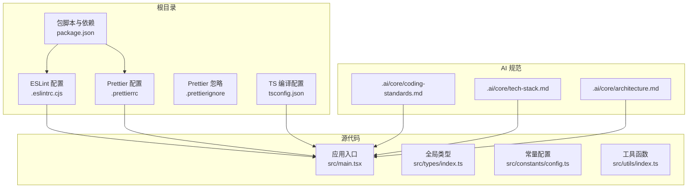
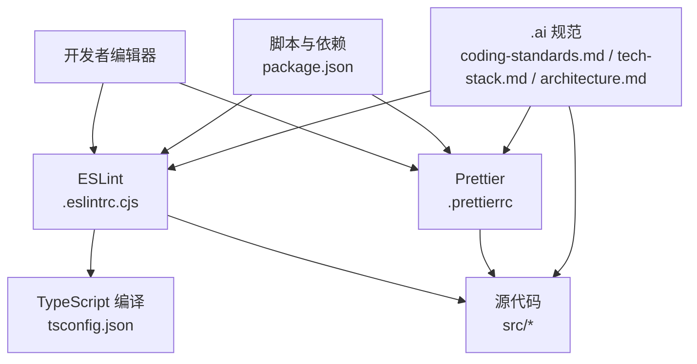
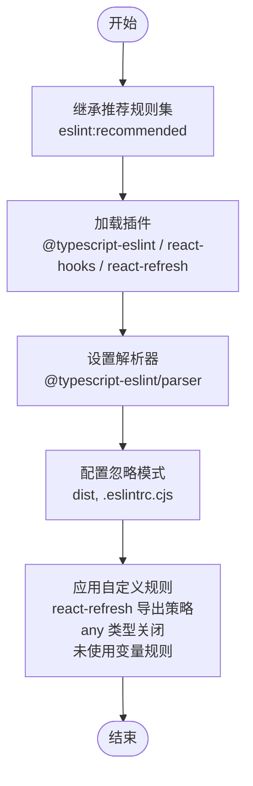
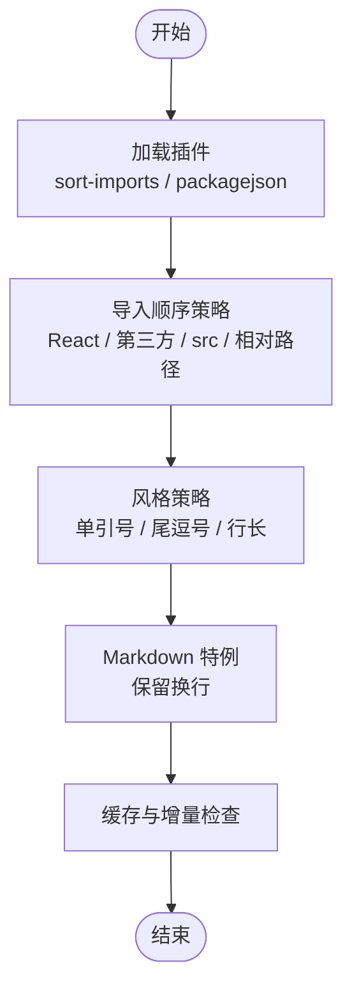
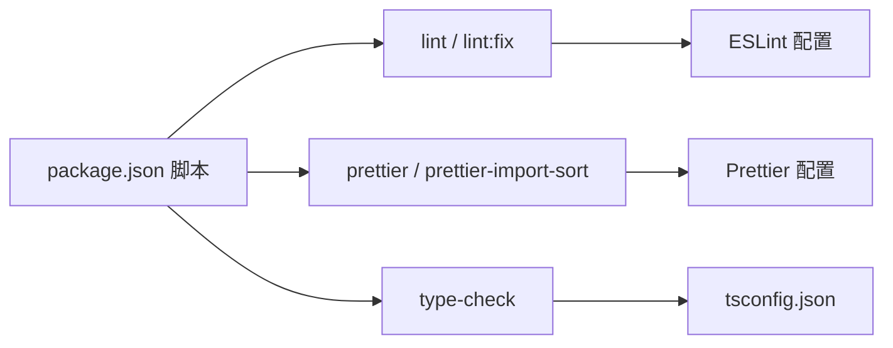

# 代码质量工具

<cite>
**本文引用的文件**
- [.eslintrc.cjs](file://.eslintrc.cjs)
- [.prettierrc](file://.prettierrc)
- [.prettierignore](file://.prettierignore)
- [package.json](file://package.json)
- [tsconfig.json](file://tsconfig.json)
- [.ai/core/coding-standards.md](file://.ai/core/coding-standards.md)
- [.ai/core/tech-stack.md](file://.ai/core/tech-stack.md)
- [.ai/core/architecture.md](file://.ai/core/architecture.md)
- [src/main.tsx](file://src/main.tsx)
- [src/types/index.ts](file://src/types/index.ts)
- [src/constants/config.ts](file://src/constants/config.ts)
- [src/utils/index.ts](file://src/utils/index.ts)
</cite>

## 目录

1. [简介](#简介)
2. [项目结构](#项目结构)
3. [核心组件](#核心组件)
4. [架构总览](#架构总览)
5. [详细组件分析](#详细组件分析)
6. [依赖分析](#依赖分析)
7. [性能考虑](#性能考虑)
8. [故障排除指南](#故障排除指南)
9. [结论](#结论)
10. [附录](#附录)

## 简介

本指南围绕本项目的代码质量工具链展开，重点覆盖 ESLint 与 Prettier 的配置与最佳实践，并结合项目实际代码与 AI 规范文档，给出可落地的团队协作与质量门禁建议。内容涵盖：

- ESLint 配置解析：TypeScript 检查、React Hooks 规则、自定义规则与插件
- Prettier 格式化配置：导入排序、包文件格式化、宽度与引号策略、Markdown 特例
- 编辑器与 Git 集成：脚本命令、缓存与增量检查
- 团队规范与 CI 集成：提交前检查、持续集成中的质量门禁、编码规范对齐

## 项目结构

本项目采用 React + TypeScript + RSBuild 的前端工程，代码质量工具位于根目录配置文件中，配合 AI 规范文档形成“工具配置 + 规范约束”的双轨保障。

**图示来源**

- [.eslintrc.cjs](file://.eslintrc.cjs#L1-L21)
- [.prettierrc](file://.prettierrc#L1-L22)
- [.prettierignore](file://.prettierignore)
- [package.json](file://package.json#L1-L81)
- [tsconfig.json](file://tsconfig.json#L1-L24)
- [src/main.tsx](file://src/main.tsx#L1-L32)
- [.ai/core/coding-standards.md](file://.ai/core/coding-standards.md#L1-L351)
- [.ai/core/tech-stack.md](file://.ai/core/tech-stack.md#L1-L90)
- [.ai/core/architecture.md](file://.ai/core/architecture.md#L1-L257)

**章节来源**

- [package.json](file://package.json#L1-L81)
- [.eslintrc.cjs](file://.eslintrc.cjs#L1-L21)
- [.prettierrc](file://.prettierrc#L1-L22)
- [tsconfig.json](file://tsconfig.json#L1-L24)

## 核心组件

- ESLint：基于推荐规则集与 TypeScript、React Hooks、react-refresh 插件，结合自定义规则与忽略模式，确保类型安全与组件刷新行为合规。
- Prettier：统一代码风格，启用导入排序与包文件格式化插件，针对 Markdown 提供特例配置，支持缓存与增量检查。
- TS 编译：严格模式、未使用变量/参数检测、路径别名与 JSX 策略，为 ESLint 提供类型检查基础。
- AI 规范：从技术栈、架构、编码规范到性能要求，形成团队共识与质量基线。

**章节来源**

- [.eslintrc.cjs](file://.eslintrc.cjs#L1-L21)
- [.prettierrc](file://.prettierrc#L1-L22)
- [tsconfig.json](file://tsconfig.json#L1-L24)
- [.ai/core/coding-standards.md](file://.ai/core/coding-standards.md#L1-L351)
- [.ai/core/tech-stack.md](file://.ai/core/tech-stack.md#L1-L90)
- [.ai/core/architecture.md](file://.ai/core/architecture.md#L1-L257)

## 架构总览

下图展示了代码质量工具在开发流程中的位置与交互关系，以及与源码、AI 规范的耦合方式。

**图示来源**

- [package.json](file://package.json#L1-L81)
- [.eslintrc.cjs](file://.eslintrc.cjs#L1-L21)
- [.prettierrc](file://.prettierrc#L1-L22)
- [tsconfig.json](file://tsconfig.json#L1-L24)
- [src/main.tsx](file://src/main.tsx#L1-L32)
- [.ai/core/coding-standards.md](file://.ai/core/coding-standards.md#L1-L351)
- [.ai/core/tech-stack.md](file://.ai/core/tech-stack.md#L1-L90)
- [.ai/core/architecture.md](file://.ai/core/architecture.md#L1-L257)

## 详细组件分析

### ESLint 配置与规则

- 继承与扩展
  - 使用推荐规则集作为基础，叠加 TypeScript 与 React Hooks 推荐规则，确保类型安全与 Hook 使用规范。
  - 启用 react-refresh 插件以支持组件热更新与导出约束。
- 解析器与插件
  - 使用 TypeScript 解析器，使 ESLint 能正确理解 TS 语法与类型。
  - 插件包括 react-refresh、@typescript-eslint/eslint-plugin 等。
- 忽略模式
  - 忽略 dist 目录与自身配置文件，避免误报与循环扫描。
- 自定义规则
  - 对 react-refresh 的导出规则进行微调，允许常量导出，兼顾灵活性与稳定性。
  - 关闭显式 any 类型警告，降低对遗留代码的阻抗；开启未使用变量规则并忽略下划线前缀参数，提升可读性。
- 与 TS 的协同
  - tsconfig 的严格模式与未使用检测与 ESLint 规则互补，共同提升代码质量。

**图示来源**

- [.eslintrc.cjs](file://.eslintrc.cjs#L1-L21)

**章节来源**

- [.eslintrc.cjs](file://.eslintrc.cjs#L1-L21)
- [tsconfig.json](file://tsconfig.json#L1-L24)

### Prettier 格式化配置

- 插件与排序
  - 启用导入排序插件与包文件格式化插件，按正则与分组规则自动整理 import 与 package.json。
  - 导入顺序策略包含 React 生态、第三方库、绝对路径 src、相对路径等分组。
- 代码风格
  - 单引号、尾逗号、最大行长等策略统一，Markdown 文件采用保留换行策略。
- 缓存与增量检查
  - 支持缓存与写入模式，提升格式化效率与一致性。
- 忽略与范围
  - 通过 ignorePath 与 overrides 控制忽略范围与文件类型特例。

**图示来源**

- [.prettierrc](file://.prettierrc#L1-L22)

**章节来源**

- [.prettierrc](file://.prettierrc#L1-L22)
- [.prettierignore](file://.prettierignore)

### TypeScript 编译配置

- 严格模式与未使用检测
  - 启用严格模式与未使用局部变量/参数检测，减少潜在问题。
- JSX 与模块解析
  - 使用 React JSX 策略与 bundler 模块解析，适配现代打包工具。
- 路径别名
  - 配置 @/src 路径映射，提升导入可读性与可维护性。

**章节来源**

- [tsconfig.json](file://tsconfig.json#L1-L24)

### AI 规范与质量基线

- 编码规范
  - TypeScript 类型定义、接口命名、类型导出、组件结构与命名、样式规范、导入导出顺序与模式、错误处理与注释规范、性能优化建议。
- 技术栈与架构
  - 明确技术栈、核心组件库、版本兼容性、禁用技术、性能要求与开发环境要求。
- 架构约束
  - 项目结构强制、组件/API/状态管理/页面组件规范、禁止事项清单。

**章节来源**

- [.ai/core/coding-standards.md](file://.ai/core/coding-standards.md#L1-L351)
- [.ai/core/tech-stack.md](file://.ai/core/tech-stack.md#L1-L90)
- [.ai/core/architecture.md](file://.ai/core/architecture.md#L1-L257)

## 依赖分析

- 脚本与命令
  - lint：对 .ts/.tsx 执行 ESLint 检查
  - lint:fix：对 .ts/.tsx 执行 ESLint 自动修复
  - prettier：对全量文件执行格式化检查与写入，带缓存
  - prettier-import-sort：启用导入排序插件的格式化命令
  - type-check：TypeScript 仅类型检查
- 依赖与版本
  - ESLint 与 TypeScript ESLint 生态、React Hooks 与 React Refresh 插件
  - Prettier 与 sort-imports、packagejson 插件
  - RSBuild 与 React 插件用于构建与开发

**图示来源**

- [package.json](file://package.json#L1-L81)
- [.eslintrc.cjs](file://.eslintrc.cjs#L1-L21)
- [.prettierrc](file://.prettierrc#L1-L22)
- [tsconfig.json](file://tsconfig.json#L1-L24)

**章节来源**

- [package.json](file://package.json#L1-L81)

## 性能考虑

- 增量检查与缓存
  - Prettier 支持缓存与写入模式，减少重复格式化开销。
  - ESLint 与 TypeScript 仅检查变更文件，缩短反馈周期。
- 规则粒度
  - 在保证质量的前提下，适度放宽高成本规则（如 any 类型），优先处理高价值问题。
- 构建与运行
  - 结合 RSBuild 与 React 插件，确保开发与生产环境一致的代码质量策略。

[本节为通用指导，不直接分析具体文件]

## 故障排除指南

- ESLint 无法识别 TS 语法
  - 检查解析器与插件是否安装并正确配置。
  - 确认 tsconfig 的严格模式与 JSX 策略与项目一致。
- Prettier 导入排序不符合预期
  - 核对 importOrder 分组与正则，确认 sort-imports 插件已启用。
  - 检查 overrides 是否覆盖了目标文件类型。
- 缓存导致格式化不生效
  - 清理缓存后重试，或临时禁用缓存进行排查。
- 规则冲突与 CI 失败
  - 在本地先执行 lint:fix 与 prettier，再提交；CI 中保持相同命令顺序。
- 与 AI 规范不一致
  - 对照 coding-standards 与 architecture 文档，调整代码结构与命名。

**章节来源**

- [.eslintrc.cjs](file://.eslintrc.cjs#L1-L21)
- [.prettierrc](file://.prettierrc#L1-L22)
- [tsconfig.json](file://tsconfig.json#L1-L24)
- [.ai/core/coding-standards.md](file://.ai/core/coding-standards.md#L1-L351)
- [.ai/core/architecture.md](file://.ai/core/architecture.md#L1-L257)

## 结论

本项目的代码质量工具链以 ESLint 与 Prettier 为核心，结合 tsconfig 的严格模式与 AI 规范文档，形成从“工具配置—编码规范—团队协作—持续集成”的闭环。建议团队在日常开发中坚持“提交前检查 + 缓存与增量优化 + CI 质量门禁”，并在遇到冲突或异常时依据本文提供的定位思路快速解决。

[本节为总结，不直接分析具体文件]

## 附录

- 实际代码示例参考
  - 应用入口与国际化、主题配置：[src/main.tsx](file://src/main.tsx#L1-L32)
  - 全局类型定义（分页、用户、路由元信息等）：[src/types/index.ts](file://src/types/index.ts#L1-L101)
  - 常量配置（应用、路由、请求、正则、日期格式）：[src/constants/config.ts](file://src/constants/config.ts#L1-L76)
  - 工具函数（日期、金额、防抖节流、下载等）：[src/utils/index.ts](file://src/utils/index.ts#L1-L106)

**章节来源**

- [src/main.tsx](file://src/main.tsx#L1-L32)
- [src/types/index.ts](file://src/types/index.ts#L1-L101)
- [src/constants/config.ts](file://src/constants/config.ts#L1-L76)
- [src/utils/index.ts](file://src/utils/index.ts#L1-L106)
