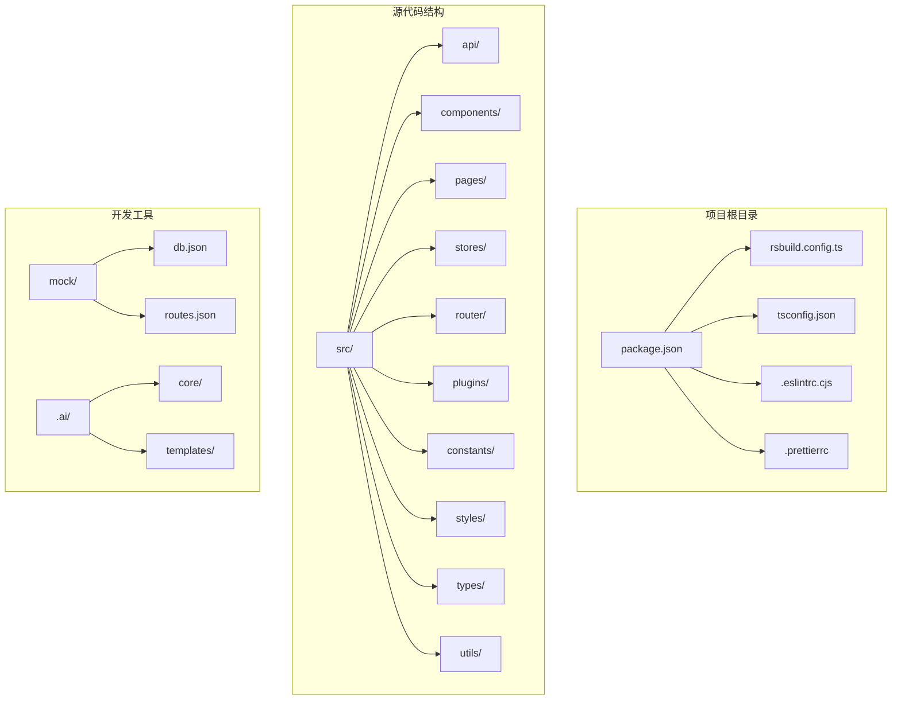
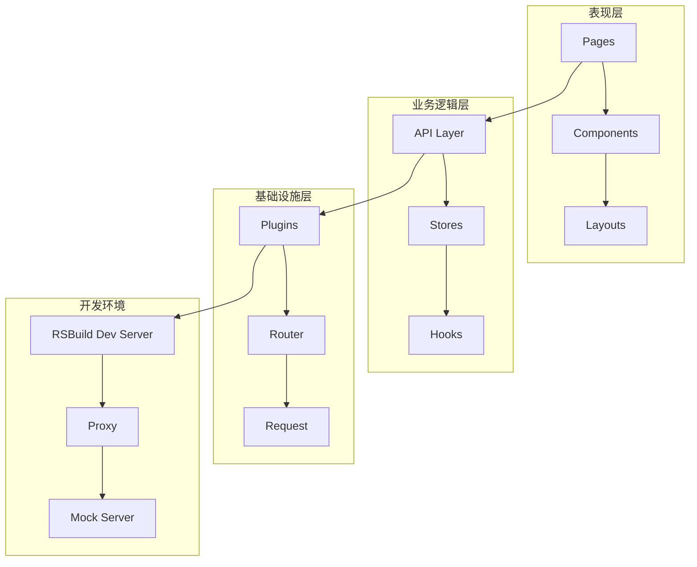
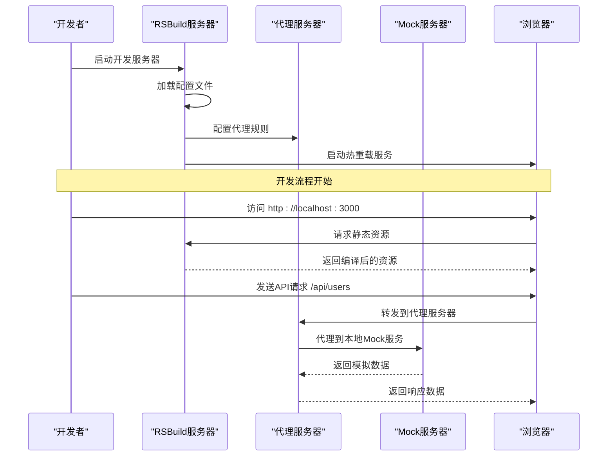
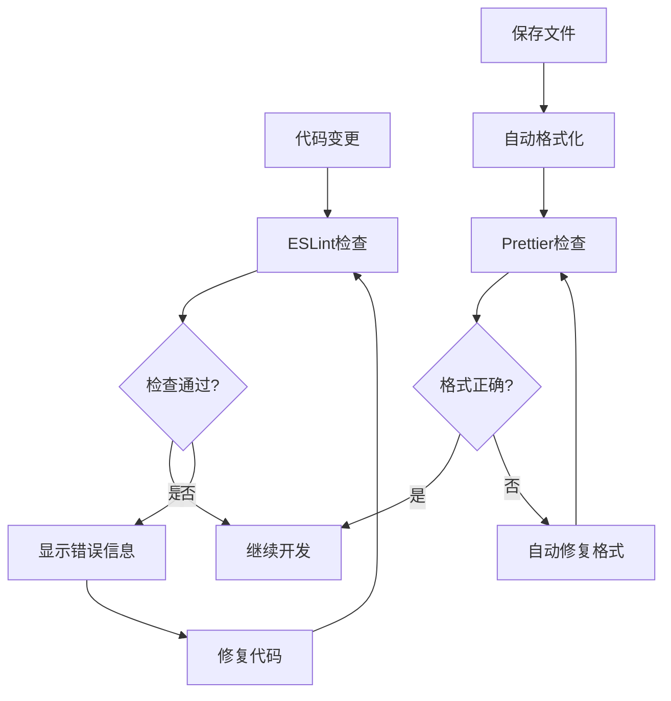
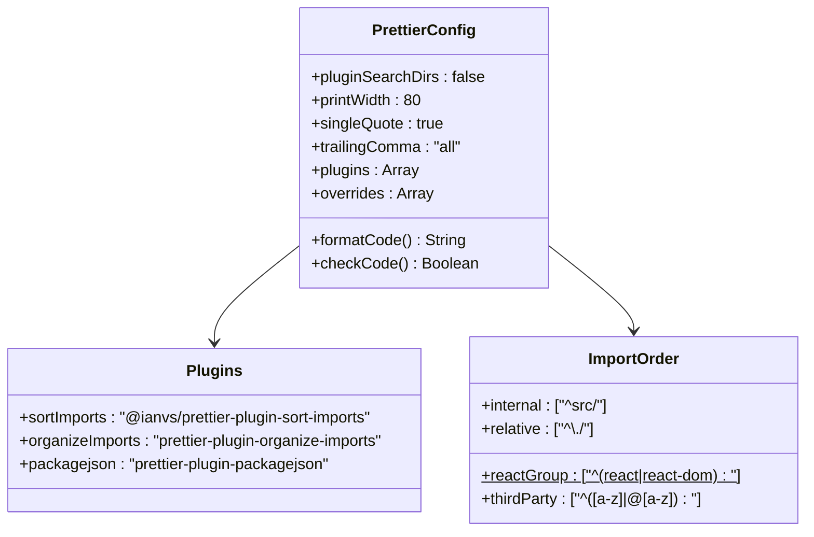
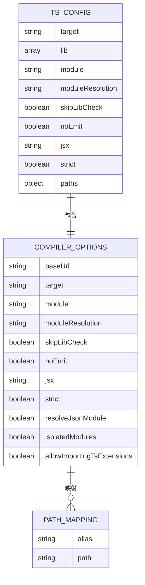
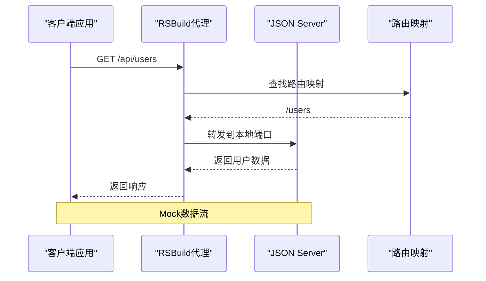
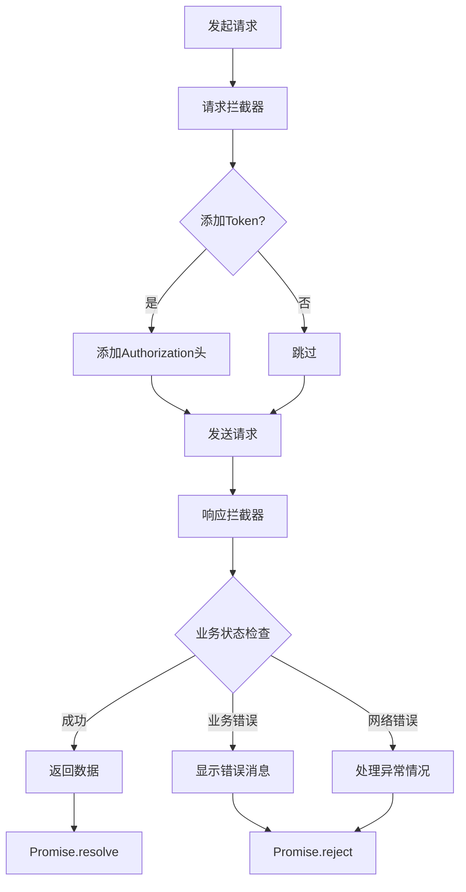
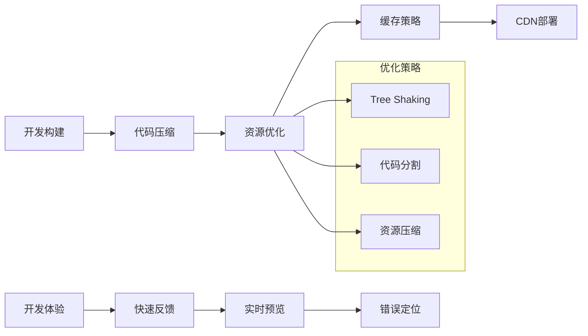
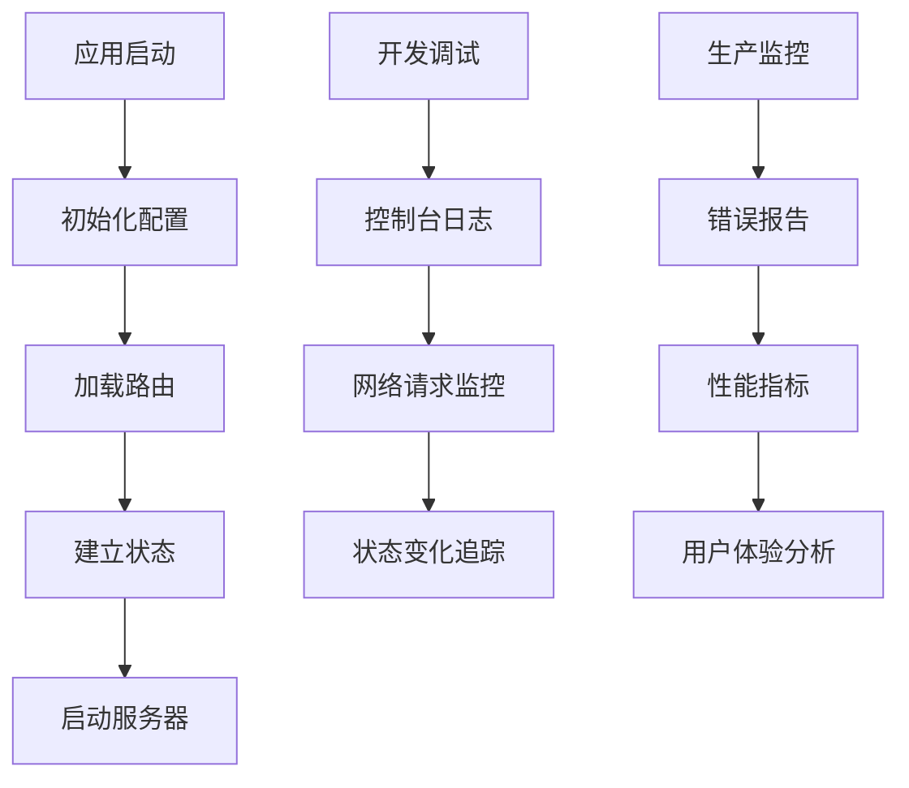

# 开发环境配置

<cite>
**本文档引用的文件**
- [package.json](file://package.json)
- [rsbuild.config.ts](file://rsbuild.config.ts)
- [.eslintrc.cjs](file://.eslintrc.cjs)
- [.prettierrc](file://.prettierrc)
- [.prettierignore](file://.prettierignore)
- [tsconfig.json](file://tsconfig.json)
- [.gitignore](file://.gitignore)
- [mock/db.json](file://mock/db.json)
- [mock/routes.json](file://mock/routes.json)
- [src/main.tsx](file://src/main.tsx)
- [src/plugins/request/index.ts](file://src/plugins/request/index.ts)
- [src/router/index.tsx](file://src/router/index.tsx)
- [src/constants/config.ts](file://src/constants/config.ts)
- [.ai/core/architecture.md](file://.ai/core/architecture.md)
- [.ai/core/coding-standards.md](file://.ai/core/coding-standards.md)
</cite>

## 目录

1. [简介](#简介)
2. [项目结构](#项目结构)
3. [核心组件](#核心组件)
4. [架构概览](#架构概览)
5. [详细组件分析](#详细组件分析)
6. [依赖关系分析](#依赖关系分析)
7. [性能考虑](#性能考虑)
8. [故障排除指南](#故障排除指南)
9. [结论](#结论)

## 简介

本指南为AI前端管理系统提供完整的开发环境配置文档。该系统采用现代化的前端技术栈，包括React 18、TypeScript 5、RSBuild构建工具和Ant Design UI库。开发环境配置涵盖了开发服务器启动、代理配置、热重载机制、ESLint和Prettier代码规范检查、IDE集成等开发工具链设置。

## 项目结构

该项目采用模块化的文件组织结构，遵循约定优于配置的设计原则：



**图表来源**

- [package.json](file://package.json#L1-L81)
- [rsbuild.config.ts](file://rsbuild.config.ts#L1-L30)

**章节来源**

- [package.json](file://package.json#L1-L81)
- [rsbuild.config.ts](file://rsbuild.config.ts#L1-L30)

## 核心组件

### 开发服务器配置

开发服务器基于RSBuild构建工具，提供了完整的开发体验优化功能：

- **端口设置**: 默认监听3000端口
- **代理配置**: 将/api前缀代理到本地Mock服务器
- **热重载机制**: 支持模块热替换，提升开发效率
- **静态资源处理**: 自动处理CSS、图片等静态资源

### 代码质量工具链

系统集成了完整的代码质量工具链，确保代码的一致性和可维护性：

- **ESLint**: TypeScript语法检查和代码规范
- **Prettier**: 代码格式化和自动排序
- **TypeScript**: 类型安全检查
- **自定义规则**: 针对项目特点的代码规范

**章节来源**

- [rsbuild.config.ts](file://rsbuild.config.ts#L11-L22)
- [package.json](file://package.json#L6-L18)

## 架构概览

系统采用分层架构设计，各层职责明确，便于维护和扩展：



**图表来源**

- [.ai/core/architecture.md](file://.ai/core/architecture.md#L20-L75)
- [rsbuild.config.ts](file://rsbuild.config.ts#L1-L30)

## 详细组件分析

### 开发服务器配置详解

RSBuild开发服务器提供了丰富的配置选项，支持现代前端开发的各种需求：



**图表来源**

- [rsbuild.config.ts](file://rsbuild.config.ts#L11-L22)
- [mock/routes.json](file://mock/routes.json#L1-L11)

#### 代理配置分析

代理配置实现了前后端分离开发的理想方案：

| 代理规则       | 目标地址                | 功能说明     |
| -------------- | ----------------------- | ------------ |
| `/api`         | `http://localhost:3001` | API请求转发  |
| `pathRewrite`  | `'^/api'` → ''          | 移除/api前缀 |
| `changeOrigin` | `true`                  | 改变请求源   |

**章节来源**

- [rsbuild.config.ts](file://rsbuild.config.ts#L13-L21)
- [mock/routes.json](file://mock/routes.json#L1-L11)

### ESLint集成配置

ESLint配置确保了代码质量和团队协作的一致性：



**图表来源**

- [.eslintrc.cjs](file://.eslintrc.cjs#L1-L21)

#### ESLint规则配置

系统采用了多层次的代码规范检查：

| 规则类别    | 插件               | 规则         | 作用             |
| ----------- | ------------------ | ------------ | ---------------- |
| 基础检查    | eslint:recommended | 语法错误检测 | 基础代码质量保证 |
| TypeScript  | @typescript-eslint | 类型安全检查 | 强类型约束       |
| React Hooks | react-hooks        | 生命周期检查 | Hook使用规范     |
| 开发优化    | react-refresh      | 组件热更新   | 提升开发效率     |

**章节来源**

- [.eslintrc.cjs](file://.eslintrc.cjs#L4-L19)

### Prettier格式化配置

Prettier提供了统一的代码格式化标准：



**图表来源**

- [.prettierrc](file://.prettierrc#L1-L22)

#### Prettier配置要点

| 配置项          | 值           | 说明               |
| --------------- | ------------ | ------------------ |
| `printWidth`    | 80           | 单行最大字符数     |
| `singleQuote`   | true         | 使用单引号         |
| `trailingComma` | "all"        | 所有元素添加尾逗号 |
| `importOrder`   | 多组分组规则 | 导入语句自动排序   |

**章节来源**

- [.prettierrc](file://.prettierrc#L3-L20)

### TypeScript配置分析

TypeScript配置确保了类型安全和开发体验：



**图表来源**

- [tsconfig.json](file://tsconfig.json#L2-L21)

#### TypeScript编译选项

| 选项               | 值                 | 作用         |
| ------------------ | ------------------ | ------------ |
| `target`           | ES2022             | 编译目标版本 |
| `moduleResolution` | bundler            | 模块解析策略 |
| `baseUrl`          | "."                | 基础路径     |
| `paths`            | {"@/_": ["src/_"]} | 路径别名配置 |

**章节来源**

- [tsconfig.json](file://tsconfig.json#L2-L21)

### Mock服务器配置

Mock服务器为前端开发提供了独立的后端服务：



**图表来源**

- [mock/db.json](file://mock/db.json)
- [mock/routes.json](file://mock/routes.json#L1-L11)

#### Mock数据结构

系统提供了完整的用户管理和认证模拟数据：

| 数据集合 | 文件路径           | 用途           |
| -------- | ------------------ | -------------- |
| 用户数据 | `mock/db.json`     | 用户信息管理   |
| 路由映射 | `mock/routes.json` | API路由转发    |
| 认证模拟 | `mock/db.json`     | 登录和注销功能 |

**章节来源**

- [mock/db.json](file://mock/db.json)
- [mock/routes.json](file://mock/routes.json#L1-L11)

### 请求拦截器配置

统一的HTTP请求处理机制：



**图表来源**

- [src/plugins/request/index.ts](file://src/plugins/request/index.ts#L19-L76)

#### 请求处理流程

系统实现了完整的请求生命周期管理：

1. **请求阶段**: 自动添加认证Token
2. **响应阶段**: 统一处理业务状态
3. **错误处理**: 分类处理各种异常情况
4. **状态管理**: 自动处理登录状态

**章节来源**

- [src/plugins/request/index.ts](file://src/plugins/request/index.ts#L19-L76)

## 依赖关系分析

项目的依赖关系体现了清晰的技术栈分层：

```mermaid
graph TB
subgraph "运行时依赖"
A[react] --> B[react-dom]
C[antd] --> D[dayjs]
E[axios] --> F[react-router-dom]
G[zustand] --> H[immer]
end
subgraph "开发时依赖"
I[@rsbuild/core] --> J[@rsbuild/plugin-react]
K[eslint] --> L[@typescript-eslint/eslint-plugin]
M[prettier] --> N[@ianvs/prettier-plugin-sort-imports]
O[typescript] --> P[类型定义]
end
subgraph "工具链"
Q[json-server] --> R[mock数据]
S[ahooks] --> T[React Hooks工具]
U[chart.js] --> V[数据可视化]
end
```

**图表来源**

- [package.json](file://package.json#L20-L56)

### 核心依赖分析

| 依赖类别  | 包名          | 版本    | 作用           |
| --------- | ------------- | ------- | -------------- |
| 构建工具  | @rsbuild/core | ^1.7.0  | 现代化构建工具 |
| React生态 | react         | ^18.3.0 | 用户界面框架   |
| UI组件库  | antd          | ^5.29.3 | 设计系统组件   |
| 状态管理  | zustand       | ^5.0.11 | 轻量级状态管理 |
| 类型检查  | typescript    | ^5.5.0  | 类型安全保障   |

**章节来源**

- [package.json](file://package.json#L20-L56)

## 性能考虑

### 开发性能优化

系统在开发环境中实现了多项性能优化措施：

1. **热重载优化**: 模块热替换减少页面刷新时间
2. **代理缓存**: 本地Mock服务器减少网络延迟
3. **代码分割**: 按需加载减少初始包体积
4. **类型检查**: 编译时类型检查提升开发效率

### 生产性能优化



## 故障排除指南

### 常见开发问题及解决方案

#### 端口冲突问题

**问题描述**: 开发服务器启动失败，提示端口被占用

**解决方案**:

1. 检查端口占用情况
2. 修改RSBuild配置中的端口号
3. 关闭占用端口的其他进程

#### 代理配置问题

**问题描述**: API请求无法正确转发到Mock服务器

**排查步骤**:

1. 验证代理规则配置
2. 检查Mock服务器是否正常运行
3. 确认路由映射文件格式正确

#### 代码格式化冲突

**问题描述**: Prettier与ESLint规则冲突

**解决方法**:

1. 检查.prettierrc配置文件
2. 验证导入语句排序规则
3. 确认插件安装完整性

#### TypeScript类型错误

**问题描述**: 编译时报类型检查错误

**排查流程**:

1. 检查tsconfig.json配置
2. 验证路径映射设置
3. 确认类型定义文件完整性

**章节来源**

- [rsbuild.config.ts](file://rsbuild.config.ts#L11-L22)
- [.prettierrc](file://.prettierrc#L1-L22)
- [tsconfig.json](file://tsconfig.json#L1-L24)

### 调试技巧

#### 开发工具使用

1. **浏览器开发者工具**: 监控网络请求和状态变化
2. **React DevTools**: 分析组件树和状态管理
3. **Redux DevTools**: 调试Zustand状态变化

#### 日志记录



## 结论

本开发环境配置文档详细介绍了AI前端管理系统的开发工具链设置。系统采用现代化的技术栈和最佳实践，提供了完整的开发体验优化方案。

### 关键优势

1. **高效的开发流程**: 热重载、代理配置、代码格式化一体化
2. **严格的代码质量**: ESLint + Prettier + TypeScript多层保障
3. **灵活的配置管理**: 模块化配置，易于维护和扩展
4. **完善的错误处理**: 统一的请求拦截和错误处理机制

### 最佳实践建议

1. **持续集成**: 在CI/CD流程中集成代码检查和测试
2. **文档维护**: 保持配置文档与代码同步更新
3. **团队协作**: 统一的代码规范和开发流程
4. **性能监控**: 建立开发和生产环境的性能监控体系

通过遵循本指南的配置和最佳实践，开发团队可以建立高效、稳定、可维护的前端开发环境，为AI前端管理系统的长期发展奠定坚实基础。
