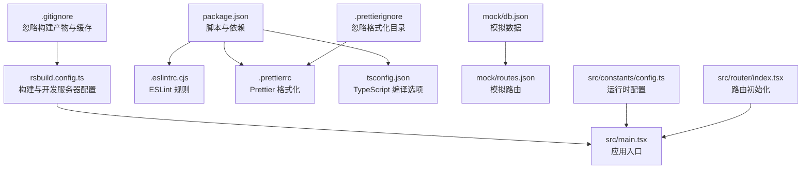
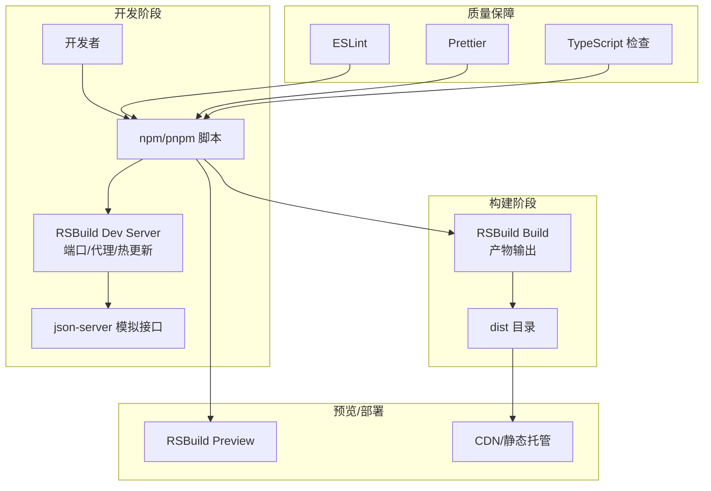
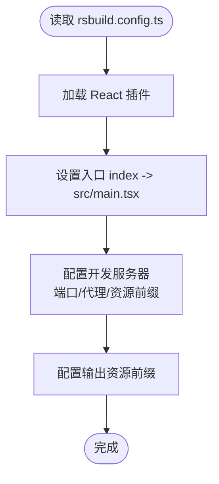
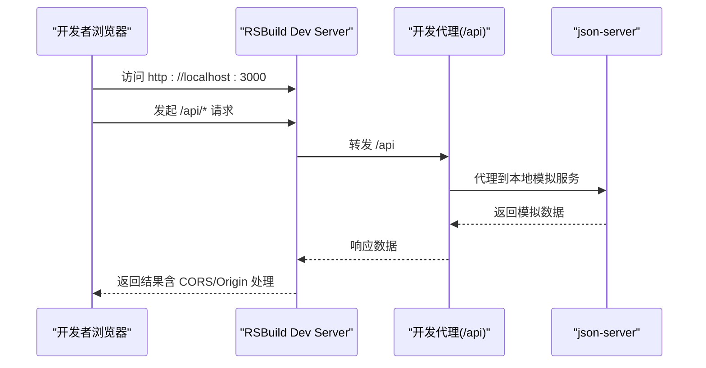
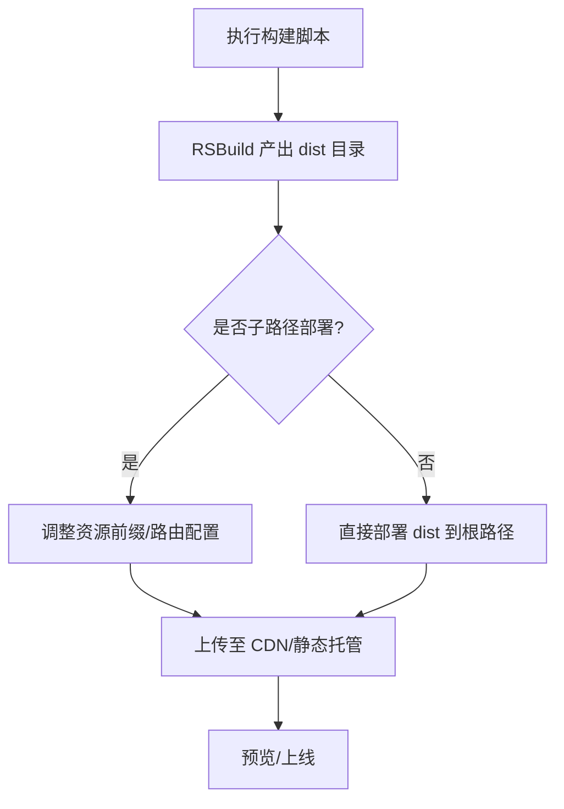
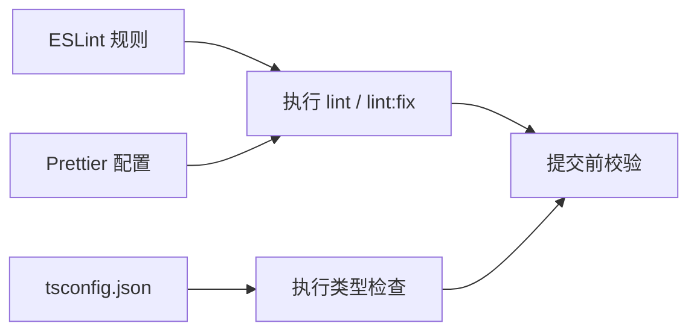
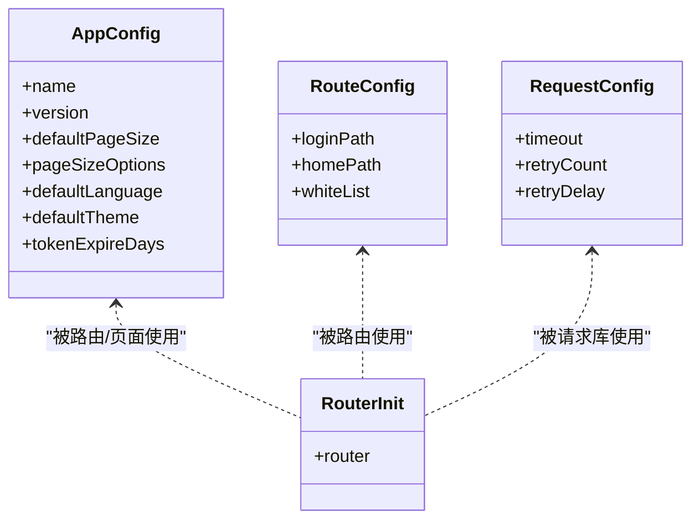
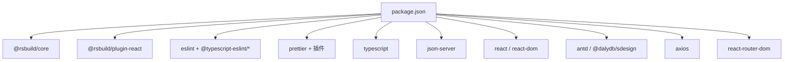

# 构建与部署

<cite>
**本文引用的文件**
- [rsbuild.config.ts](file://rsbuild.config.ts)
- [package.json](file://package.json)
- [.eslintrc.cjs](file://.eslintrc.cjs)
- [.prettierrc](file://.prettierrc)
- [tsconfig.json](file://tsconfig.json)
- [mock/db.json](file://mock/db.json)
- [mock/routes.json](file://mock/routes.json)
- [.prettierignore](file://.prettierignore)
- [.gitignore](file://.gitignore)
- [src/constants/config.ts](file://src/constants/config.ts)
- [src/router/index.tsx](file://src/router/index.tsx)
- [.ai/core/tech-stack.md](file://.ai/core/tech-stack.md)
</cite>

## 目录

1. [简介](#简介)
2. [项目结构](#项目结构)
3. [核心组件](#核心组件)
4. [架构总览](#架构总览)
5. [详细组件分析](#详细组件分析)
6. [依赖关系分析](#依赖关系分析)
7. [性能考虑](#性能考虑)
8. [故障排除指南](#故障排除指南)
9. [结论](#结论)
10. [附录](#附录)

## 简介

本指南面向前端工程团队，围绕 RSBuild 构建工具提供从开发到生产的完整配置与优化策略。内容涵盖：

- 开发环境：端口、代理、热重载、源码映射、错误处理等体验优化
- 生产环境：构建产物优化、CDN/缓存策略建议、部署流程
- 代码质量：ESLint、Prettier、TypeScript 类型检查的集成与最佳实践
- CI/CD：结合现有脚本给出可落地的流水线建议与故障排除

## 项目结构

该仓库采用以“功能域”为主的组织方式，前端入口位于 src/main.tsx，构建配置集中在 rsbuild.config.ts，开发与质量保障工具通过 package.json 的 scripts 集成。

图表来源

- [rsbuild.config.ts](file://rsbuild.config.ts#L1-L30)
- [package.json](file://package.json#L1-L81)
- [.eslintrc.cjs](file://.eslintrc.cjs#L1-L21)
- [.prettierrc](file://.prettierrc#L1-L22)
- [tsconfig.json](file://tsconfig.json#L1-L24)
- [mock/db.json](file://mock/db.json#L1-L140)
- [mock/routes.json](file://mock/routes.json#L1-L11)
- [.prettierignore](file://.prettierignore#L1-L2)
- [.gitignore](file://.gitignore#L1-L42)
- [src/constants/config.ts](file://src/constants/config.ts#L1-L75)
- [src/router/index.tsx](file://src/router/index.tsx#L1-L8)

章节来源

- [rsbuild.config.ts](file://rsbuild.config.ts#L1-L30)
- [package.json](file://package.json#L1-L81)
- [.eslintrc.cjs](file://.eslintrc.cjs#L1-L21)
- [.prettierrc](file://.prettierrc#L1-L22)
- [tsconfig.json](file://tsconfig.json#L1-L24)
- [mock/db.json](file://mock/db.json#L1-L140)
- [mock/routes.json](file://mock/routes.json#L1-L11)
- [.prettierignore](file://.prettierignore#L1-L2)
- [.gitignore](file://.gitignore#L1-L42)
- [src/constants/config.ts](file://src/constants/config.ts#L1-L75)
- [src/router/index.tsx](file://src/router/index.tsx#L1-L8)

## 核心组件

- 构建与开发服务器：通过 RSBuild 提供 dev、build、preview 能力，并内置 React 插件与开发代理
- 质量工具链：ESLint + TypeScript ESLint + React Hooks 规则；Prettier + 插件排序；TypeScript 类型检查
- 模拟后端：json-server + 自定义路由映射，便于本地联调
- 运行时配置：集中管理应用名、默认分页、路由白名单、请求超时等

章节来源

- [rsbuild.config.ts](file://rsbuild.config.ts#L1-L30)
- [package.json](file://package.json#L6-L18)
- [.eslintrc.cjs](file://.eslintrc.cjs#L1-L21)
- [.prettierrc](file://.prettierrc#L1-L22)
- [tsconfig.json](file://tsconfig.json#L1-L24)
- [mock/db.json](file://mock/db.json#L1-L140)
- [mock/routes.json](file://mock/routes.json#L1-L11)
- [src/constants/config.ts](file://src/constants/config.ts#L1-L75)

## 架构总览

下图展示了从开发到生产的典型流程，以及各工具在其中的角色：

图表来源

- [rsbuild.config.ts](file://rsbuild.config.ts#L11-L29)
- [package.json](file://package.json#L6-L18)
- [mock/db.json](file://mock/db.json#L1-L140)
- [mock/routes.json](file://mock/routes.json#L1-L11)

## 详细组件分析

### RSBuild 配置与优化

- 入口与插件：定义单一入口，启用 React 插件以获得 JSX 支持与开发体验增强
- 开发服务器：端口、代理、资源前缀等
- 输出：统一资源前缀，便于后续 CDN/子路径部署

图表来源

- [rsbuild.config.ts](file://rsbuild.config.ts#L4-L29)

章节来源

- [rsbuild.config.ts](file://rsbuild.config.ts#L1-L30)

### 开发环境配置与体验优化

- 端口与代理：开发服务器端口与 /api 前缀代理至本地模拟服务，减少跨域与联调成本
- 热重载：RSBuild 内置 React 插件，通常提供 HMR 能力
- 源码映射：建议在开发模式开启 source map（如需更细粒度控制，可在 RSBuild 配置中补充）
- 错误处理：结合 ESLint 与 TS 类型检查，尽早暴露问题；json-server 提供错误响应便于调试

图表来源

- [rsbuild.config.ts](file://rsbuild.config.ts#L11-L22)
- [mock/db.json](file://mock/db.json#L1-L140)
- [mock/routes.json](file://mock/routes.json#L1-L11)

章节来源

- [rsbuild.config.ts](file://rsbuild.config.ts#L11-L22)
- [mock/db.json](file://mock/db.json#L1-L140)
- [mock/routes.json](file://mock/routes.json#L1-L11)

### 生产环境构建与部署

- 构建命令：通过 npm/pnpm 脚本触发 RSBuild 构建，产物输出至 dist
- 预览：本地验证构建产物
- 部署：将 dist 目录部署至静态站点或 CDN；若使用子路径部署，确保资源前缀与路由历史模式适配

图表来源

- [package.json](file://package.json#L7-L14)
- [rsbuild.config.ts](file://rsbuild.config.ts#L26-L29)

章节来源

- [package.json](file://package.json#L7-L14)
- [rsbuild.config.ts](file://rsbuild.config.ts#L26-L29)

### 代码质量保障

- ESLint：推荐规则集、TypeScript 解析器、React Hooks 规则、禁用特定刷新规则
- Prettier：导入顺序、单引号、尾逗号、插件排序、Package JSON 插件、忽略 dist 与 YAML
- TypeScript：严格模式、路径别名、仅类型检查不 emit

图表来源

- [.eslintrc.cjs](file://.eslintrc.cjs#L1-L21)
- [.prettierrc](file://.prettierrc#L1-L22)
- [tsconfig.json](file://tsconfig.json#L1-L24)

章节来源

- [.eslintrc.cjs](file://.eslintrc.cjs#L1-L21)
- [.prettierrc](file://.prettierrc#L1-L22)
- [tsconfig.json](file://tsconfig.json#L1-L24)

### 运行时配置与路由

- 应用配置：应用名、版本、分页、语言、主题、Token 过期时间等
- 路由配置：登录页、首页、白名单路由
- 请求配置：基础 URL（预留）、超时、重试次数与延迟
- 路由初始化：基于路由表创建浏览器路由实例

图表来源

- [src/constants/config.ts](file://src/constants/config.ts#L1-L75)
- [src/router/index.tsx](file://src/router/index.tsx#L1-L8)

章节来源

- [src/constants/config.ts](file://src/constants/config.ts#L1-L75)
- [src/router/index.tsx](file://src/router/index.tsx#L1-L8)

## 依赖关系分析

- 构建工具：@rsbuild/core、@rsbuild/plugin-react
- 质量工具：eslint、@typescript-eslint/eslint-plugin、@typescript-eslint/parser、prettier 及相关插件
- 类型检查：typescript
- 模拟服务：json-server
- 运行时依赖：React、Ant Design、Axios、路由等

图表来源

- [package.json](file://package.json#L20-L56)

章节来源

- [package.json](file://package.json#L20-L56)

## 性能考虑

- 体积与首屏：参考技术栈文档中的性能目标（单页体积、首屏加载、交互响应、内存占用），在构建后对产物进行分析与优化
- 资源前缀：生产输出与开发输出均设置资源前缀，便于 CDN 与子路径部署
- 依赖与模块化：保持按需引入与 Tree Shaking，避免引入不必要的 polyfill 或大体积依赖

章节来源

- [.ai/core/tech-stack.md](file://.ai/core/tech-stack.md#L69-L90)
- [rsbuild.config.ts](file://rsbuild.config.ts#L26-L29)

## 故障排除指南

- 开发代理无效
  - 检查 /api 代理配置与本地模拟服务端口
  - 确认 json-server 启动成功且路由映射正确
- 端口冲突
  - 修改开发服务器端口或释放占用端口
- 资源路径异常（CDN/子路径）
  - 确认资源前缀与部署路径一致
- ESLint/Prettier 冲突
  - 使用统一的缓存与忽略策略，先执行 Prettier 再执行 ESLint
- TypeScript 报错
  - 在本地执行类型检查，修复后再提交

章节来源

- [rsbuild.config.ts](file://rsbuild.config.ts#L11-L22)
- [mock/db.json](file://mock/db.json#L1-L140)
- [mock/routes.json](file://mock/routes.json#L1-L11)
- [.prettierignore](file://.prettierignore#L1-L2)
- [.gitignore](file://.gitignore#L1-L42)

## 结论

本指南基于现有配置，给出了 RSBuild 在开发与生产阶段的使用建议、质量工具链集成与部署思路。建议团队在 CI 中统一执行类型检查、ESLint 与 Prettier，并在发布前进行构建产物分析，以满足既定性能目标。

## 附录

### 常用脚本与用途

- 开发：启动 RSBuild Dev Server，同时启动 json-server 模拟接口
- 构建：生成 dist 产物
- 预览：本地预览构建产物
- 质量：ESLint 检查与修复、Prettier 格式化、类型检查

章节来源

- [package.json](file://package.json#L6-L18)
