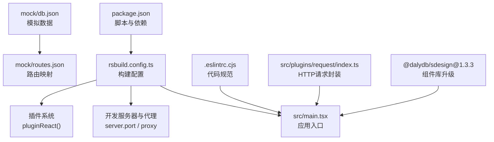
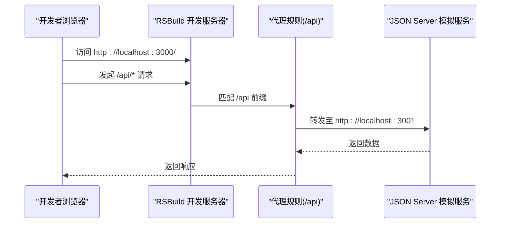
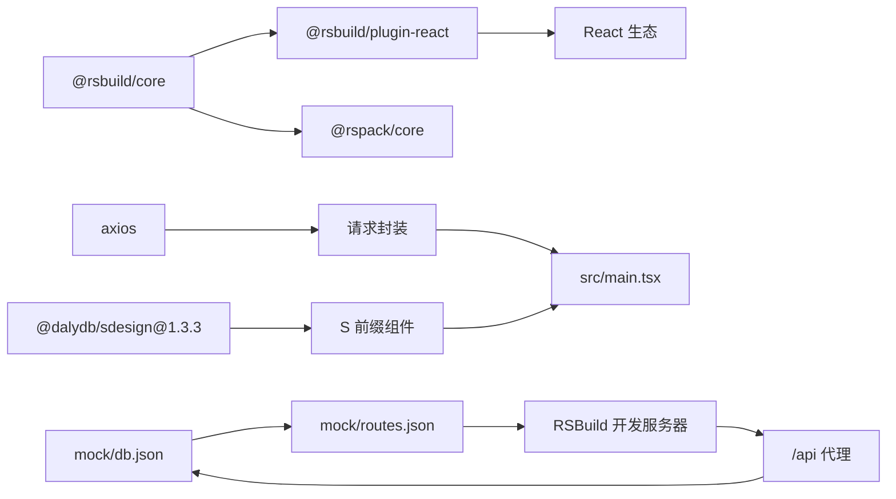

# 构建配置

<cite>
**本文引用的文件**
- [rsbuild.config.ts](file://rsbuild.config.ts)
- [package.json](file://package.json)
- [pnpm-lock.yaml](file://pnpm-lock.yaml)
- [src/plugins/request/index.ts](file://src/plugins/request/index.ts)
- [mock/db.json](file://mock/db.json)
- [mock/routes.json](file://mock/routes.json)
- [.eslintrc.cjs](file://.eslintrc.cjs)
- [src/main.tsx](file://src/main.tsx)
- [src/constants/config.ts](file://src/constants/config.ts)
- [.ai/core/sdesign-docs.md](file://.ai/core/sdesign-docs.md)
</cite>

## 更新摘要

**变更内容**

- 更新 @dalydb/sdesign 依赖版本从 1.3.2 到 1.3.3
- 修正 sdesign 组件库文档版本信息
- 更新依赖锁定文件中的版本信息

## 目录

1. [简介](#简介)
2. [项目结构](#项目结构)
3. [核心组件](#核心组件)
4. [架构总览](#架构总览)
5. [详细组件分析](#详细组件分析)
6. [依赖关系分析](#依赖关系分析)
7. [性能考虑](#性能考虑)
8. [故障排查指南](#故障排查指南)
9. [结论](#结论)
10. [附录](#附录)

## 简介

本文件面向 RSBuild 构建配置的使用者与维护者，系统性解读 rsbuild.config.ts 中的关键配置项，包括入口配置、插件系统、开发服务器与代理、开发与输出资源前缀等，并结合项目实际给出优化建议与最佳实践。同时提供常见问题排查思路与多环境配置管理策略，帮助团队在开发与生产环境中稳定高效地交付前端应用。

**更新** 本版本反映了 @dalydb/sdesign 从 1.3.2 升级到 1.3.3 的依赖更新，以及相关的构建配置优化。

## 项目结构

本项目采用 RSBuild 作为构建工具，核心配置集中在 rsbuild.config.ts；前端入口为 src/main.tsx；开发阶段通过本地 JSON Server 提供后端接口模拟服务；ESLint 规范代码风格与质量。

**图表来源**

- [rsbuild.config.ts:1-30](file://rsbuild.config.ts#L1-L30)
- [src/main.tsx:1-32](file://src/main.tsx#L1-L32)
- [mock/db.json:1-140](file://mock/db.json#L1-L140)
- [mock/routes.json:1-11](file://mock/routes.json#L1-L11)
- [.eslintrc.cjs:1-21](file://.eslintrc.cjs#L1-L21)
- [src/plugins/request/index.ts:1-114](file://src/plugins/request/index.ts#L1-L114)
- [package.json:32-33](file://package.json#L32-L33)
- [pnpm-lock.yaml:14-16](file://pnpm-lock.yaml#L14-L16)

**章节来源**

- [rsbuild.config.ts:1-30](file://rsbuild.config.ts#L1-L30)
- [package.json:1-85](file://package.json#L1-L85)

## 核心组件

- 入口配置：定义应用打包入口，当前仅一个入口 index 指向 src/main.tsx。
- 插件系统：启用 React 插件以支持 JSX/TSX 编译与热更新。
- 开发服务器与代理：监听本地端口并配置 /api 前缀代理到本地模拟服务。
- 开发与输出资源前缀：dev.assetPrefix 与 output.assetPrefix 均设为根路径，便于本地与部署场景统一处理静态资源路径。
- 组件库升级：@dalydb/sdesign 从 1.3.2 升级到 1.3.3，提供增强的 S 前缀组件体系。

**更新** 新版本的 @dalydb/sdesign 带来了性能优化和 bug 修复，提升了开发体验。

**章节来源**

- [rsbuild.config.ts:4-29](file://rsbuild.config.ts#L4-L29)
- [package.json:32-33](file://package.json#L32-L33)
- [pnpm-lock.yaml:14-16](file://pnpm-lock.yaml#L14-L16)

## 架构总览

下图展示从开发启动到请求转发的整体流程，以及与模拟服务的交互关系。

**图表来源**

- [rsbuild.config.ts:11-22](file://rsbuild.config.ts#L11-L22)
- [mock/routes.json:1-11](file://mock/routes.json#L1-L11)
- [mock/db.json:1-140](file://mock/db.json#L1-L140)

## 详细组件分析

### 入口配置（source.entry）

- 当前仅配置了一个入口 index，指向 src/main.tsx。
- 若需多页面或多入口，可在 entry 下新增键值对，分别指定不同入口文件。
- 入口文件负责初始化 React 应用、国际化与主题配置，并挂载 RouterProvider。

**章节来源**

- [rsbuild.config.ts:6-10](file://rsbuild.config.ts#L6-L10)
- [src/main.tsx:1-32](file://src/main.tsx#L1-L32)

### 插件系统（plugins）

- 启用了 @rsbuild/plugin-react 插件，用于：
  - 编译 React/TSX 文件
  - 支持 React Refresh 热更新
  - 自动注入 React 相关的运行时宏与优化
- 插件版本与 RSBuild 版本兼容，确保稳定构建体验。

**章节来源**

- [rsbuild.config.ts:1-5](file://rsbuild.config.ts#L1-L5)
- [package.json:48-70](file://package.json#L48-L70)

### 开发服务器与代理（server）

- 端口：默认监听 3000 端口，可通过环境变量或命令行参数覆盖。
- 代理：将 /api 前缀的请求转发到本地模拟服务（默认 3001 端口），并进行路径重写，移除 /api 前缀，使前端请求与后端接口路径保持一致。
- 代理配置常用于解决跨域问题，便于前后端联调。

**章节来源**

- [rsbuild.config.ts:11-22](file://rsbuild.config.ts#L11-L22)
- [mock/routes.json:1-11](file://mock/routes.json#L1-L11)
- [package.json](file://package.json#L12)

### 开发与输出资源前缀（dev.assetPrefix / output.assetPrefix）

- dev.assetPrefix：开发环境下静态资源的前缀，默认根路径，便于本地调试与热更新。
- output.assetPrefix：生产构建产物的静态资源前缀，默认根路径，适用于根路径部署。
- 若部署在子路径（如 /app/），需将两者均调整为相同子路径，避免资源 404。

**章节来源**

- [rsbuild.config.ts:23-28](file://rsbuild.config.ts#L23-L28)

### 请求封装与代理联动（src/plugins/request/index.ts）

- 使用 axios 统一封装 GET/POST/PUT/DELETE/PATCH 方法。
- 在请求拦截器中自动附加 Authorization 头（若存在 token）。
- 在响应拦截器中根据业务状态与 HTTP 状态码进行统一处理与提示。
- 该封装与代理配置配合，前端以 /api 前缀发起请求，经代理转发至模拟服务，实现前后端解耦。

**章节来源**

- [src/plugins/request/index.ts:1-114](file://src/plugins/request/index.ts#L1-L114)
- [rsbuild.config.ts:13-21](file://rsbuild.config.ts#L13-L21)

### 模拟服务与路由映射（mock/db.json / mock/routes.json）

- db.json 提供用户、文章、分类、项目等基础数据，用于开发与测试。
- routes.json 将 /auth/_、/users/_、/posts/_、/categories/_ 等路径映射到前端路由，便于本地联调。
- 模拟服务通过 package.json 的 mock 脚本启动，端口默认 3001。

**章节来源**

- [mock/db.json:1-140](file://mock/db.json#L1-L140)
- [mock/routes.json:1-11](file://mock/routes.json#L1-L11)
- [package.json](file://package.json#L12)

### 组件库升级（@dalydb/sdesign）

- 版本：从 1.3.2 升级到 1.3.3
- 功能增强：提供 22 种配置化表单控件、增强表格、详情展示等 S 前缀组件
- 性能优化：新版本包含性能改进和 bug 修复
- 兼容性：保持与 Ant Design 5.x 的完全兼容

**更新** 新版本的 @dalydb/sdesign 提供了更好的开发体验和更稳定的组件表现。

**章节来源**

- [package.json:32-33](file://package.json#L32-L33)
- [pnpm-lock.yaml:14-16](file://pnpm-lock.yaml#L14-L16)
- [.ai/core/sdesign-docs.md:7-11](file://.ai/core/sdesign-docs.md#L7-L11)

### 代码规范与质量（.eslintrc.cjs）

- 使用 TypeScript ESLint 与 React Hooks 规则，关闭显式 any 警告，开启未使用变量检查。
- 通过 ignorePatterns 排除 dist 与自身配置文件，减少误报。
- 结合 Prettier 与导入排序插件，统一代码风格。

**章节来源**

- [.eslintrc.cjs:1-21](file://.eslintrc.cjs#L1-L21)

## 依赖关系分析

- 构建工具链：RSBuild 与 Rspack 作为底层打包与编译引擎，提供高性能构建能力。
- React 生态：React、React DOM、React Router DOM、Ant Design 及其图标库构成 UI 与路由基础。
- 工具链：Axios 用于 HTTP 请求，Day.js 用于日期处理，Zustand 用于状态管理，ESLint/Prettier 保障代码质量。
- 组件库：@dalydb/sdesign 1.3.3 提供增强的 S 前缀组件体系，替代传统 Ant Design 组件。

**更新** 依赖关系中包含了最新版本的 @dalydb/sdesign 组件库。

**图表来源**

- [package.json:48-70](file://package.json#L48-L70)
- [rsbuild.config.ts:1-5](file://rsbuild.config.ts#L1-L5)
- [src/plugins/request/index.ts:1-114](file://src/plugins/request/index.ts#L1-L114)
- [mock/db.json:1-140](file://mock/db.json#L1-L140)
- [mock/routes.json:1-11](file://mock/routes.json#L1-L11)
- [package.json:32-33](file://package.json#L32-L33)
- [pnpm-lock.yaml:14-16](file://pnpm-lock.yaml#L14-L16)

**章节来源**

- [package.json:1-85](file://package.json#L1-L85)

## 性能考虑

- 构建性能
  - 使用 Rspack 作为底层打包器，具备更快的增量构建速度与更少的内存占用。
  - 合理拆分入口与按需加载，避免单入口过大导致首屏加载缓慢。
  - 启用压缩与 Tree Shaking，减少产物体积。
- 资源优化
  - 图片与字体资源尽量使用现代格式（如 WebP），并控制尺寸与缓存策略。
  - CSS 与 JS 分离，利用浏览器缓存与 CDN 加速。
- 开发体验
  - 启用 React Refresh，减少页面刷新时间。
  - 代理配置合理化，避免不必要的重定向与路径改写。
- 多环境配置
  - 通过环境变量区分开发、测试、生产环境的 API 地址与资源前缀。
  - 将敏感配置放入环境变量，避免硬编码在配置文件中。
- 组件库优化
  - 使用 @dalydb/sdesign 的 S 前缀组件，提升开发效率和组件一致性。
  - 新版本 1.3.3 包含性能改进，减少不必要的重渲染。

**更新** 新版本的 @dalydb/sdesign 在性能方面有所提升，建议充分利用其提供的增强组件。

## 故障排查指南

- 代理 404 或跨域问题
  - 确认 /api 前缀是否与前端请求一致，代理路径重写是否正确。
  - 检查模拟服务是否正常启动且端口未被占用。
- 资源 404（开发或生产）
  - 若部署在子路径，需将 dev.assetPrefix 与 output.assetPrefix 调整为相同子路径。
  - 检查构建产物目录与静态资源引用路径是否匹配。
- 热更新失效
  - 确认 React 插件已启用，且未禁用 React Refresh。
  - 清理缓存后重启开发服务器。
- 请求失败或鉴权异常
  - 检查请求拦截器是否正确附加 Authorization 头。
  - 关注响应拦截器中的业务状态与 HTTP 状态码处理逻辑。
- 组件库问题
  - 如果使用 @dalydb/sdesign 组件出现问题，检查版本兼容性。
  - 确保与 Ant Design 5.x 的版本匹配。

**更新** 新版本升级后可能出现的组件库相关问题。

**章节来源**

- [rsbuild.config.ts:11-28](file://rsbuild.config.ts#L11-L28)
- [src/plugins/request/index.ts:19-76](file://src/plugins/request/index.ts#L19-L76)
- [mock/routes.json:1-11](file://mock/routes.json#L1-L11)
- [package.json:32-33](file://package.json#L32-L33)

## 结论

本项目的 RSBuild 配置简洁明确，围绕 React 应用入口、代理与资源前缀展开，满足本地开发与生产部署的基本需求。最新的 @dalydb/sdesign 1.3.3 版本升级带来了性能改进和稳定性提升，建议在多环境与资源前缀方面进一步标准化，结合 Rspack 的性能优势与插件生态，持续优化构建效率与产物体积，提升整体开发与交付体验。

**更新** 本次升级体现了项目对依赖管理的重视，新版本的组件库为开发提供了更好的工具支持。

## 附录

### 配置项速查表

- 入口配置（source.entry）
  - 作用：定义打包入口文件
  - 当前值：index -> src/main.tsx
  - 建议：多页面可扩展多个入口键值
- 插件系统（plugins）
  - 作用：启用 React 编译与热更新
  - 当前值：pluginReact()
- 开发服务器（server）
  - 端口：3000
  - 代理：/api -> http://localhost:3001，路径重写移除 /api
- 开发与输出资源前缀（dev.output）
  - dev.assetPrefix：/
  - output.assetPrefix：/
- 组件库版本
  - @dalydb/sdesign：1.3.3

**更新** 新增了组件库版本信息。

**章节来源**

- [rsbuild.config.ts:4-29](file://rsbuild.config.ts#L4-L29)
- [package.json:32-33](file://package.json#L32-L33)

### 多环境配置管理建议

- 环境变量
  - 使用 .env 文件或 CI/CD 注入环境变量，区分开发、测试、生产环境的 API 地址与资源前缀。
- 动态配置
  - 在构建时通过 RSBuild 的 define 或环境变量注入，实现不同环境下的差异化行为。
- 部署路径
  - 若部署在子路径，统一调整 dev.assetPrefix 与 output.assetPrefix，避免资源加载失败。
- 组件库版本管理
  - 定期检查 @dalydb/sdesign 的更新，及时升级以获得最新功能和修复。

**更新** 新增了组件库版本管理建议。

### 常见问题与解决方案

- 问题：本地开发时 /api 请求 404
  - 解决：确认代理规则与模拟服务端口一致，路径重写正确。
- 问题：生产环境资源 404
  - 解决：将 dev.assetPrefix 与 output.assetPrefix 调整为部署子路径。
- 问题：热更新不生效
  - 解决：检查 React 插件启用状态与缓存清理。
- 问题：@dalydb/sdesign 组件使用异常
  - 解决：确认版本兼容性，检查与 Ant Design 5.x 的匹配情况。

**更新** 新增了组件库相关的问题解决方案。

**章节来源**

- [rsbuild.config.ts:11-28](file://rsbuild.config.ts#L11-L28)
- [mock/routes.json:1-11](file://mock/routes.json#L1-L11)
- [package.json:32-33](file://package.json#L32-L33)
