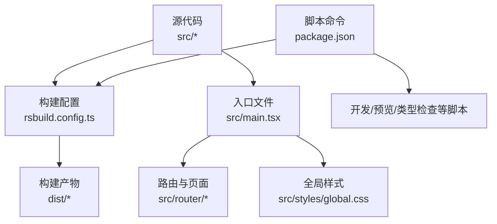
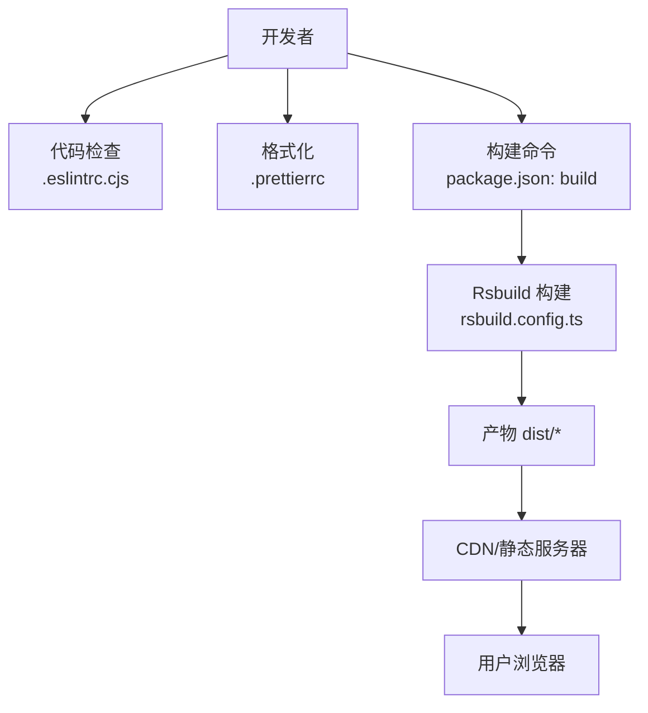
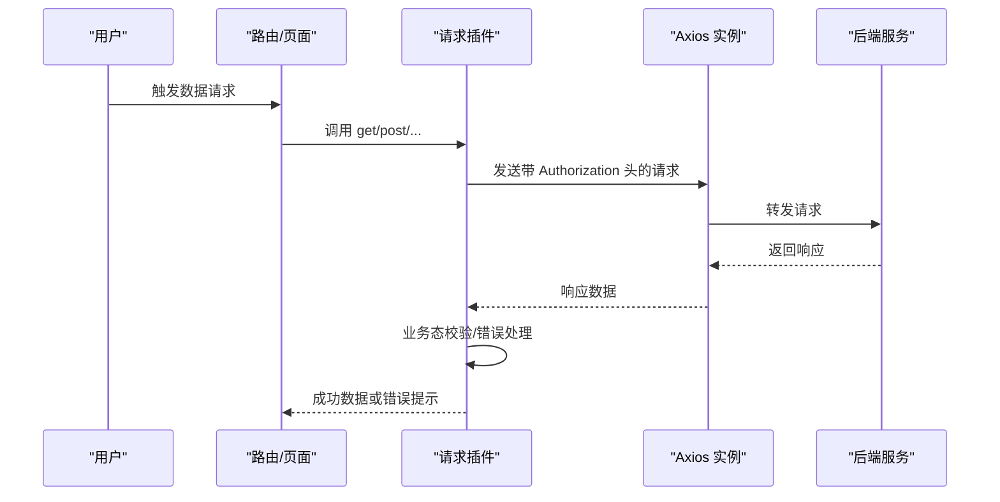
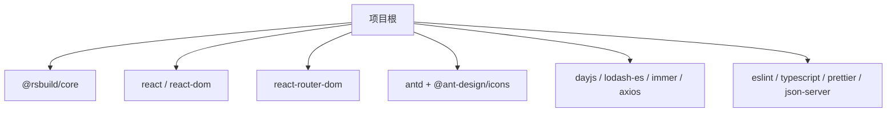

# 生产环境部署

<cite>
**本文引用的文件**
- [package.json](file://package.json)
- [rsbuild.config.ts](file://rsbuild.config.ts)
- [src/main.tsx](file://src/main.tsx)
- [src/plugins/request/index.ts](file://src/plugins/request/index.ts)
- [src/constants/config.ts](file://src/constants/config.ts)
- [.eslintrc.cjs](file://.eslintrc.cjs)
- [.prettierrc](file://.prettierrc)
- [.gitignore](file://.gitignore)
- [.prettierignore](file://.prettierignore)
- [pnpm-lock.yaml](file://pnpm-lock.yaml)
- [.ai/core/tech-stack.md](file://.ai/core/tech-stack.md)
</cite>

## 目录

1. [简介](#简介)
2. [项目结构](#项目结构)
3. [核心组件](#核心组件)
4. [架构总览](#架构总览)
5. [详细组件分析](#详细组件分析)
6. [依赖分析](#依赖分析)
7. [性能考虑](#性能考虑)
8. [部署流程与配置](#部署流程与配置)
9. [监控、回滚与故障恢复](#监控回滚与故障恢复)
10. [结论](#结论)
11. [附录](#附录)

## 简介

本指南面向生产环境部署，围绕该前端项目从构建产物生成、资源优化、静态资源部署到多环境部署方案进行系统性说明，并补充部署后的监控、回滚与故障恢复策略。项目基于 Rsbuild 构建工具链，采用 React + Ant Design 技术栈，具备良好的工程化基础。

## 项目结构

该项目为单页应用（SPA），入口为 React 根节点挂载于 HTML 宿主元素，路由通过 React Router 管理，全局样式在入口处引入。构建配置集中在 Rsbuild 配置文件中，脚本命令集中在包管理配置中。

图表来源

- [rsbuild.config.ts](file://rsbuild.config.ts#L1-L30)
- [src/main.tsx](file://src/main.tsx#L1-L32)
- [package.json](file://package.json#L6-L18)

章节来源

- [rsbuild.config.ts](file://rsbuild.config.ts#L1-L30)
- [src/main.tsx](file://src/main.tsx#L1-L32)
- [package.json](file://package.json#L6-L18)

## 核心组件

- 构建与打包：Rsbuild 作为核心构建工具，提供开发服务器、代理、资源输出等能力。
- 入口与渲染：根组件负责国际化、主题注入与路由挂载。
- 请求插件：封装 Axios 实例，统一添加鉴权头、错误处理与业务态判断。
- 常量与配置：集中管理应用名称、版本、默认分页、路由白名单、请求超时等配置。

章节来源

- [rsbuild.config.ts](file://rsbuild.config.ts#L1-L30)
- [src/main.tsx](file://src/main.tsx#L1-L32)
- [src/plugins/request/index.ts](file://src/plugins/request/index.ts#L1-L114)
- [src/constants/config.ts](file://src/constants/config.ts#L1-L76)

## 架构总览

下图展示从开发到生产的典型流程：本地开发 → Rsbuild 构建 → 产物生成 → 部署至静态服务器/CDN → 访问与缓存策略生效。

图表来源

- [.eslintrc.cjs](file://.eslintrc.cjs#L1-L21)
- [.prettierrc](file://.prettierrc#L1-L22)
- [package.json](file://package.json#L6-L18)
- [rsbuild.config.ts](file://rsbuild.config.ts#L1-L30)

## 详细组件分析

### 构建与打包策略

- 构建入口与输出
  - 入口：index 页面指向 src/main.tsx。
  - 输出：默认输出目录 dist（由 Rsbuild 默认行为决定；可通过配置调整）。
  - 资源前缀：开发与输出阶段均设置为“/”，便于在子路径部署时保持一致。
- 开发服务器与代理
  - 提供本地开发端口与 API 代理，将 /api 前缀转发至本地后端服务，便于联调。
- 依赖与运行时
  - 项目对 Node 版本有明确要求（>=18），并使用 pnpm 管理依赖，锁文件确保一致性。

章节来源

- [rsbuild.config.ts](file://rsbuild.config.ts#L4-L29)
- [package.json](file://package.json#L57-L59)
- [pnpm-lock.yaml](file://pnpm-lock.yaml#L1-L20)

### 请求与鉴权插件

- 统一请求实例：设置超时、默认 Content-Type。
- 请求拦截：自动携带本地存储的 token。
- 响应拦截：区分业务成功/失败与 HTTP 状态码错误，统一提示与跳转。

图表来源

- [src/plugins/request/index.ts](file://src/plugins/request/index.ts#L11-L76)

章节来源

- [src/plugins/request/index.ts](file://src/plugins/request/index.ts#L1-L114)

### 入口与国际化/主题

- 国际化：设置 antd 语言为简体中文，dayjs 语言为 zh-cn。
- 主题：通过 ConfigProvider 注入主题 token，统一主色与圆角。
- 路由挂载：在根节点渲染 RouterProvider，完成页面切换。

章节来源

- [src/main.tsx](file://src/main.tsx#L1-L32)

### 配置与常量

- 应用配置：名称、版本、默认分页、语言、主题、Token 过期时间等。
- 路由配置：登录页路径、首页路径、白名单路由。
- 请求配置：基础 URL（预留）、超时、重试次数与延迟。
- 正则与日期格式：常用正则与日期格式常量。

章节来源

- [src/constants/config.ts](file://src/constants/config.ts#L1-L76)

## 依赖分析

- 构建工具链
  - Rsbuild 核心与 React 插件用于构建与开发体验。
- 前端框架与 UI
  - React、React DOM、React Router、Ant Design、dayjs、ahooks、zustand 等。
- 开发工具
  - ESLint、TypeScript、Prettier、JSON Server（Mock 数据）等。

图表来源

- [package.json](file://package.json#L20-L56)

章节来源

- [package.json](file://package.json#L20-L56)
- [pnpm-lock.yaml](file://pnpm-lock.yaml#L2529-L2537)

## 性能考虑

- 性能目标（来自技术栈文档）
  - 单页体积：不超过 500KB
  - 首屏加载：不超过 2 秒
  - 交互响应：不超过 100ms
  - 内存占用：不超过 100MB
- 优化方向
  - 代码分割与懒加载：按路由拆分包，减少首屏 JS 体积。
  - Tree Shaking：确保未使用的模块被剔除。
  - 资源压缩：启用最小化与压缩策略（Rsbuild 默认开启）。
  - 图片与字体：使用现代格式（WebP/AVIF）与按需加载。
  - 缓存策略：静态资源强缓存，HTML 动态缓存或短缓存。
  - CDN 加速：将静态资源托管至 CDN，提升全球访问速度。
  - 版本化：文件指纹（hash）实现长缓存与灰度/回滚可控。

章节来源

- [.ai/core/tech-stack.md](file://.ai/core/tech-stack.md#L69-L75)

## 部署流程与配置

### 一、构建产物生成

- 本地构建
  - 执行构建命令生成 dist 目录下的静态资源。
  - 构建入口与输出由 Rsbuild 配置控制。
- 产物内容
  - 包含 HTML、JS、CSS、图片、字体等静态资源。
  - 资源命名包含哈希，便于缓存与版本管理。

章节来源

- [package.json](file://package.json#L6-L18)
- [rsbuild.config.ts](file://rsbuild.config.ts#L4-L29)

### 二、静态资源部署配置

#### 1) CDN 集成

- 将 dist 目录上传至 CDN 或对象存储桶。
- 在 CDN 控制台配置：
  - 源站指向静态服务器或对象存储。
  - 自定义域名绑定与 HTTPS。
  - 缓存键包含版本号或文件哈希，避免缓存污染。

#### 2) 缓存策略

- 强缓存：静态资源（JS/CSS/媒体）设置较长有效期（如一年）。
- 即时缓存：HTML 设置较短有效期或禁用缓存，保证首次访问最新。
- Vary：根据 Accept-Encoding 等头部做缓存变体。

#### 3) 版本管理

- 文件指纹：构建时自动加入哈希，文件变更才会改变名称。
- 版本号：可在 HTML 中注入版本号，便于监控与回滚定位。
- 渐进发布：先替换部分资源，观察指标后再全量切换。

#### 4) 资源优化

- 压缩：启用 Gzip/Brotli 压缩。
- 去重：合并重复依赖，减少请求数。
- 懒加载：路由级懒加载，减少首屏负载。

章节来源

- [rsbuild.config.ts](file://rsbuild.config.ts#L26-L29)
- [.ai/core/tech-stack.md](file://.ai/core/tech-stack.md#L69-L75)

### 三、不同部署环境方案

#### 1) 传统服务器部署

- 准备
  - 一台具备 Web 服务器（Nginx/Apache）的 Linux 服务器。
  - 域名解析与 SSL 证书。
- 步骤
  - 将 dist 目录上传至服务器指定目录。
  - 配置 Nginx/Apache，设置根目录、缓存头、Gzip、HTTPS。
  - 配置反向代理（如需）将 /api 前缀转发至后端服务。
  - 启动/重启服务，验证访问。

#### 2) 云平台部署（对象存储 + CDN）

- 准备
  - 对象存储桶（如 OSS/MinIO/云厂商对象存储）。
  - CDN 加速服务（如云厂商 CDN）。
- 步骤
  - 将 dist 上传至对象存储桶。
  - 在 CDN 绑定自定义域名，配置回源地址与缓存策略。
  - 配置 HTTPS 证书与防盗链。
  - 验证资源可访问与缓存命中。

#### 3) 容器化部署（可选扩展）

- 准备
  - Dockerfile：基于 Nginx 镜像，复制 dist 至 /usr/share/nginx/html。
  - docker-compose：编排 Nginx 与健康检查。
- 步骤
  - 构建镜像并推送至镜像仓库。
  - 在容器编排平台（K8s/Docker Swarm）部署，暴露 80/443。
  - 配置 Ingress/LoadBalancer 与证书管理。

章节来源

- [rsbuild.config.ts](file://rsbuild.config.ts#L11-L22)

### 四、部署前置检查清单

- 本地构建无错误，dist 产物存在且符合预期。
- CDN/服务器已配置好缓存与压缩策略。
- 域名解析与证书生效。
- /api 代理或后端服务可达（如需）。
- 监控与日志采集准备就绪。

## 监控、回滚与故障恢复

### 一、部署后监控

- 关键指标
  - 首屏加载时间、TTFB、资源体积、缓存命中率。
  - 4xx/5xx 错误率、用户访问路径分布。
- 工具建议
  - 前端埋点：记录性能与错误事件。
  - CDN/对象存储：查看访问日志与缓存命中统计。
  - APM/日志平台：聚合错误堆栈与告警。

### 二、回滚策略

- 快速回滚
  - 将 CDN/对象存储回退至上一版本的资源。
  - 修改版本号或哈希，使客户端重新拉取旧版本。
- 渐进回滚
  - 逐步降低新版本流量占比，观察指标稳定后再全量回滚。

### 三、故障恢复

- 常见问题
  - 资源 404：检查 CDN 缓存、回源路径与文件哈希。
  - 首屏慢：检查缓存策略、Gzip、资源体积与网络路径。
  - 接口失败：检查 /api 代理、跨域与后端可用性。
- 应急预案
  - 临时关闭强缓存，强制刷新资源。
  - 降级静态资源至备用源（如另一 CDN 或对象存储）。
  - 临时关闭新版本，回滚至稳定版本。

章节来源

- [src/plugins/request/index.ts](file://src/plugins/request/index.ts#L48-L76)

## 结论

本指南提供了从构建到部署、再到监控与回滚的完整流程。结合 Rsbuild 的配置与项目特性，配合 CDN 缓存与版本化策略，可在多环境下稳定交付高质量的前端应用。建议在每次发布前进行性能与兼容性验证，并建立完善的监控与回滚机制以保障线上稳定性。

## 附录

### A. 关键文件与职责对照

- package.json：脚本命令、依赖与引擎版本声明。
- rsbuild.config.ts：构建入口、开发服务器、代理与输出配置。
- src/main.tsx：应用入口、国际化与主题注入。
- src/plugins/request/index.ts：统一请求与错误处理。
- src/constants/config.ts：应用与路由、请求等配置常量。
- .eslintrc.cjs/.prettierrc：代码质量与格式化规范。
- .gitignore/.prettierignore：忽略构建产物与缓存文件。

章节来源

- [package.json](file://package.json#L6-L18)
- [rsbuild.config.ts](file://rsbuild.config.ts#L1-L30)
- [src/main.tsx](file://src/main.tsx#L1-L32)
- [src/plugins/request/index.ts](file://src/plugins/request/index.ts#L1-L114)
- [src/constants/config.ts](file://src/constants/config.ts#L1-L76)
- [.eslintrc.cjs](file://.eslintrc.cjs#L1-L21)
- [.prettierrc](file://.prettierrc#L1-L22)
- [.gitignore](file://.gitignore#L1-L42)
- [.prettierignore](file://.prettierignore#L1-L2)
