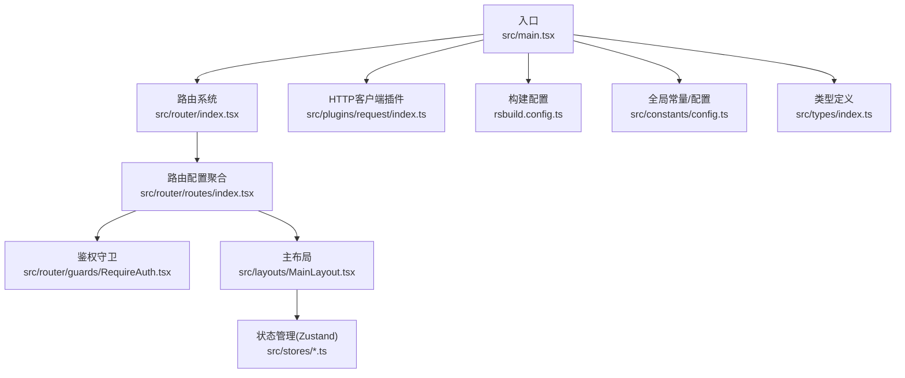
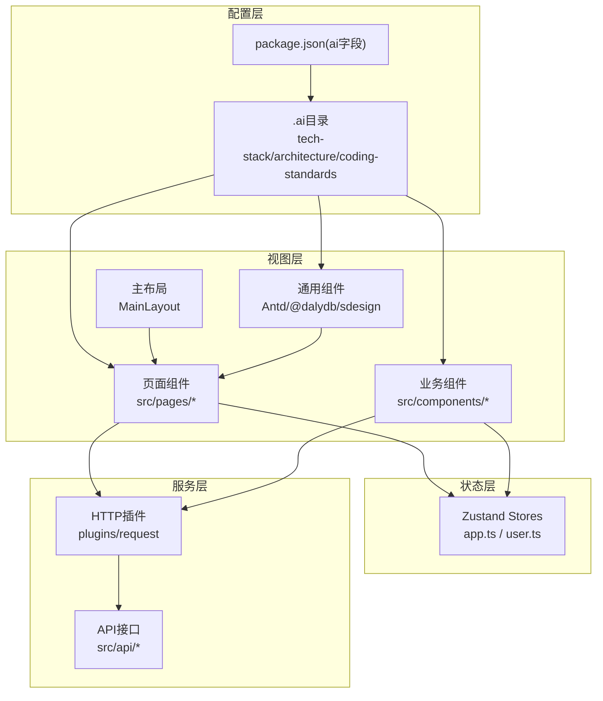
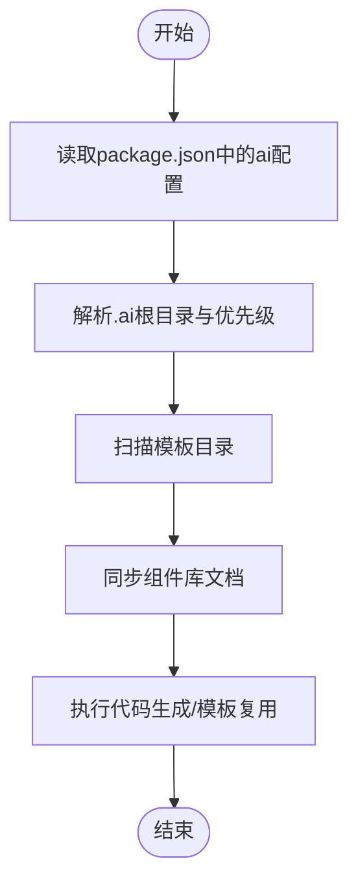
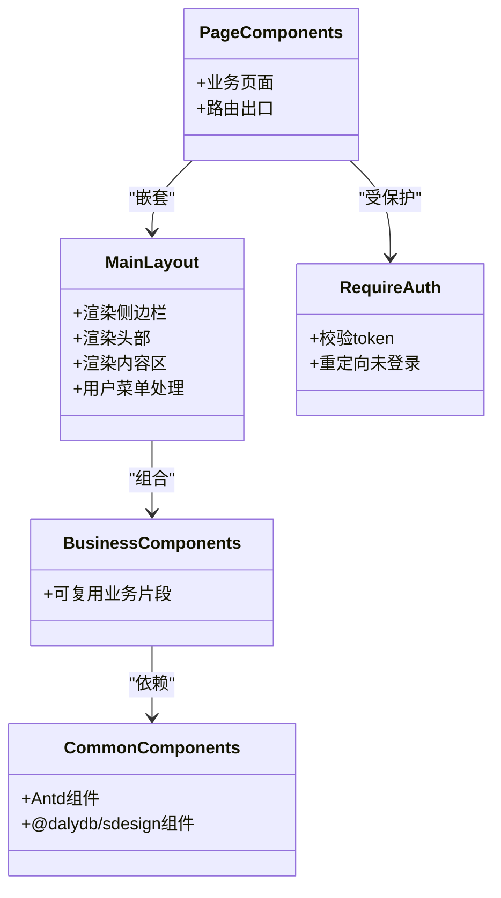
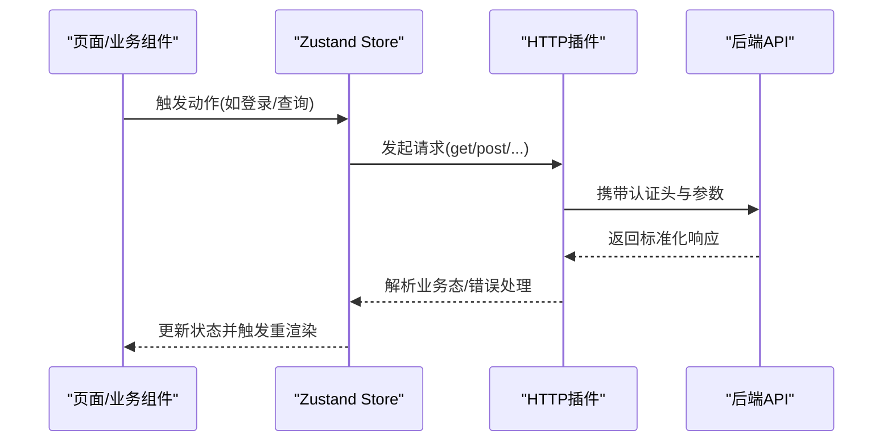
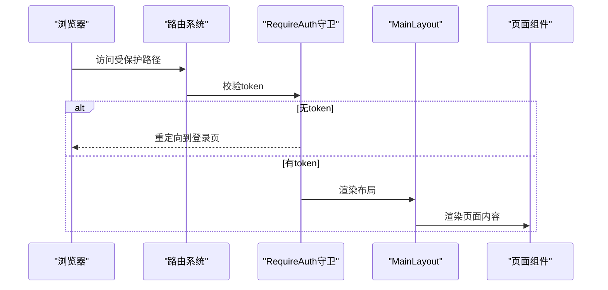
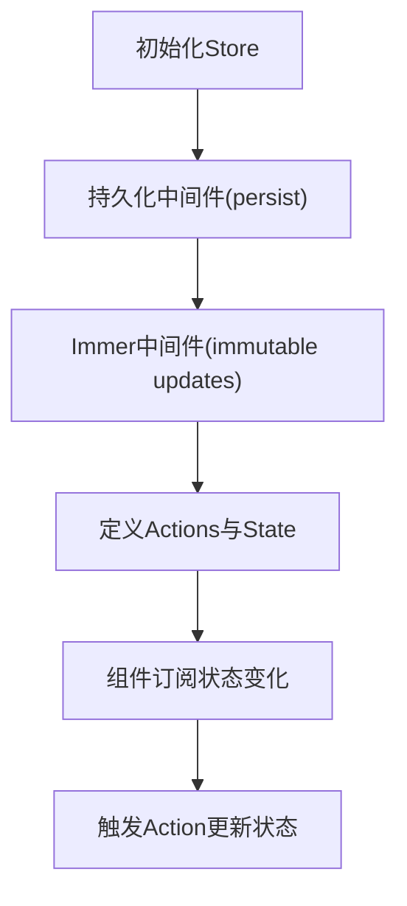
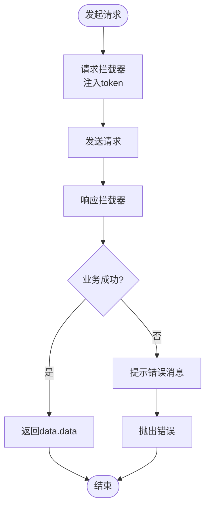
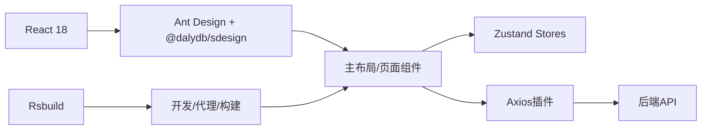

# 前端架构模式

<cite>
**本文引用的文件**
- [package.json](file://package.json)
- [rsbuild.config.ts](file://rsbuild.config.ts)
- [src/main.tsx](file://src/main.tsx)
- [src/router/index.tsx](file://src/router/index.tsx)
- [src/router/routes/index.tsx](file://src/router/routes/index.tsx)
- [src/router/guards/RequireAuth.tsx](file://src/router/guards/RequireAuth.tsx)
- [src/layouts/MainLayout.tsx](file://src/layouts/MainLayout.tsx)
- [src/plugins/request/index.ts](file://src/plugins/request/index.ts)
- [src/stores/app.ts](file://src/stores/app.ts)
- [src/stores/user.ts](file://src/stores/user.ts)
- [src/stores/index.ts](file://src/stores/index.ts)
- [src/constants/config.ts](file://src/constants/config.ts)
- [src/types/index.ts](file://src/types/index.ts)
</cite>

## 目录

1. [引言](#引言)
2. [项目结构](#项目结构)
3. [核心组件](#核心组件)
4. [架构总览](#架构总览)
5. [详细组件分析](#详细组件分析)
6. [依赖分析](#依赖分析)
7. [性能考虑](#性能考虑)
8. [故障排查指南](#故障排查指南)
9. [结论](#结论)
10. [附录](#附录)

## 引言

本文件面向AI管理平台的前端架构，系统性阐述配置驱动架构、组件化架构与分层架构的设计理念与落地实践。重点说明：

- React 18并发特性对架构的影响与利用方式
- Ant Design作为UI框架的选择理由及主题/国际化配置
- 自研@sdesign组件库的集成策略
- 配置驱动开发的核心思想与.ai目录的使用
- 页面组件、业务组件、通用组件的职责划分
- 分层架构中API层、组件层、状态管理层的解耦机制

## 项目结构

项目采用按功能域与职责分层的组织方式：入口、路由、布局、页面、状态、插件、常量与类型等模块清晰分离；构建工具采用Rsbuild，提供代理、开发服务器与构建优化能力。

图表来源

- [src/main.tsx](file://src/main.tsx#L1-L32)
- [src/router/index.tsx](file://src/router/index.tsx#L1-L9)
- [src/router/routes/index.tsx](file://src/router/routes/index.tsx#L1-L31)
- [src/router/guards/RequireAuth.tsx](file://src/router/guards/RequireAuth.tsx#L1-L25)
- [src/layouts/MainLayout.tsx](file://src/layouts/MainLayout.tsx#L1-L174)
- [src/plugins/request/index.ts](file://src/plugins/request/index.ts#L1-L114)
- [rsbuild.config.ts](file://rsbuild.config.ts#L1-L30)
- [src/constants/config.ts](file://src/constants/config.ts#L1-L76)
- [src/types/index.ts](file://src/types/index.ts#L1-L101)

章节来源

- [package.json](file://package.json#L1-L81)
- [rsbuild.config.ts](file://rsbuild.config.ts#L1-L30)
- [src/main.tsx](file://src/main.tsx#L1-L32)

## 核心组件

- 入口与根配置：在入口中统一注入Ant Design的ConfigProvider，完成本地化与主题定制，并挂载RouterProvider；构建配置提供代理与开发体验优化。
- 路由与守卫：路由以模块化聚合，结合鉴权守卫实现受保护页面的访问控制。
- 主布局：提供侧边栏、头部、内容区的统一容器，承载导航与用户交互。
- 状态管理：基于Zustand的轻量状态方案，结合persist与immer中间件实现持久化与不可变更新。
- 插件化HTTP：封装Axios实例与拦截器，统一处理认证、错误提示与业务态转换。
- 配置与类型：集中管理应用配置、路由白名单、正则校验、日期格式等；类型定义覆盖分页、表格、表单、API响应等。

章节来源

- [src/main.tsx](file://src/main.tsx#L1-L32)
- [src/router/index.tsx](file://src/router/index.tsx#L1-L9)
- [src/router/routes/index.tsx](file://src/router/routes/index.tsx#L1-L31)
- [src/router/guards/RequireAuth.tsx](file://src/router/guards/RequireAuth.tsx#L1-L25)
- [src/layouts/MainLayout.tsx](file://src/layouts/MainLayout.tsx#L1-L174)
- [src/stores/app.ts](file://src/stores/app.ts#L1-L59)
- [src/stores/user.ts](file://src/stores/user.ts#L1-L76)
- [src/plugins/request/index.ts](file://src/plugins/request/index.ts#L1-L114)
- [src/constants/config.ts](file://src/constants/config.ts#L1-L76)
- [src/types/index.ts](file://src/types/index.ts#L1-L101)

## 架构总览

整体采用“配置驱动 + 组件化 + 分层”的混合架构：

- 配置驱动：通过.ai目录与package.json中的ai配置，定义技术栈、架构规范与组件库文档同步策略，实现代码生成与模板复用。
- 组件化：页面组件、业务组件、通用组件职责清晰，布局与路由解耦，便于组合与复用。
- 分层：API层负责数据访问与协议适配；组件层负责视图与交互；状态管理层负责跨组件共享与持久化。

图表来源

- [package.json](file://package.json#L65-L79)
- [src/main.tsx](file://src/main.tsx#L1-L32)
- [src/layouts/MainLayout.tsx](file://src/layouts/MainLayout.tsx#L1-L174)
- [src/stores/app.ts](file://src/stores/app.ts#L1-L59)
- [src/stores/user.ts](file://src/stores/user.ts#L1-L76)
- [src/plugins/request/index.ts](file://src/plugins/request/index.ts#L1-L114)

## 详细组件分析

### 配置驱动架构

- .ai目录与package.json的ai字段共同构成配置驱动基础：
  - ai.configRoot与priority用于确定文档优先级与加载顺序
  - templates指向模板目录，支持代码生成与模板复用
  - componentLibrary.name与aiDocs用于对接自研组件库文档同步
- 通过脚本命令实现上下文同步与文档同步，保障团队规范一致性与知识沉淀

图表来源

- [package.json](file://package.json#L65-L79)

章节来源

- [package.json](file://package.json#L65-L79)

### 组件化架构

- 页面组件：位于src/pages，承载具体业务页面，通常包裹于主布局与鉴权守卫之下
- 业务组件：位于src/components，封装可复用的业务逻辑片段
- 通用组件：基于Antd与自研@sdesign，提供统一的UI与行为规范
- 主布局：统一处理侧边栏、头部、通知与用户下拉菜单，作为页面容器

图表来源

- [src/layouts/MainLayout.tsx](file://src/layouts/MainLayout.tsx#L1-L174)
- [src/router/guards/RequireAuth.tsx](file://src/router/guards/RequireAuth.tsx#L1-L25)
- [src/router/routes/index.tsx](file://src/router/routes/index.tsx#L1-L31)

章节来源

- [src/layouts/MainLayout.tsx](file://src/layouts/MainLayout.tsx#L1-L174)
- [src/router/guards/RequireAuth.tsx](file://src/router/guards/RequireAuth.tsx#L1-L25)
- [src/router/routes/index.tsx](file://src/router/routes/index.tsx#L1-L31)

### 分层架构与解耦机制

- API层：通过plugins/request封装Axios，统一处理认证头、业务态与错误提示，向上提供简洁的请求方法
- 组件层：页面与业务组件仅关注UI与交互，不直接依赖具体数据源
- 状态管理层：Zustand Store负责跨组件共享的状态与持久化，避免props钻取与重复请求

图表来源

- [src/plugins/request/index.ts](file://src/plugins/request/index.ts#L1-L114)
- [src/stores/user.ts](file://src/stores/user.ts#L1-L76)
- [src/stores/app.ts](file://src/stores/app.ts#L1-L59)

章节来源

- [src/plugins/request/index.ts](file://src/plugins/request/index.ts#L1-L114)
- [src/stores/user.ts](file://src/stores/user.ts#L1-L76)
- [src/stores/app.ts](file://src/stores/app.ts#L1-L59)

### 路由与鉴权流程

- 路由聚合：路由配置按模块拆分并在index中统一导出
- 鉴权守卫：RequireAuth根据token决定是否放行
- 主布局：统一承载导航与用户交互

图表来源

- [src/router/index.tsx](file://src/router/index.tsx#L1-L9)
- [src/router/routes/index.tsx](file://src/router/routes/index.tsx#L1-L31)
- [src/router/guards/RequireAuth.tsx](file://src/router/guards/RequireAuth.tsx#L1-L25)
- [src/layouts/MainLayout.tsx](file://src/layouts/MainLayout.tsx#L1-L174)

章节来源

- [src/router/index.tsx](file://src/router/index.tsx#L1-L9)
- [src/router/routes/index.tsx](file://src/router/routes/index.tsx#L1-L31)
- [src/router/guards/RequireAuth.tsx](file://src/router/guards/RequireAuth.tsx#L1-L25)
- [src/layouts/MainLayout.tsx](file://src/layouts/MainLayout.tsx#L1-L174)

### 状态管理设计

- 使用Zustand简化状态逻辑，结合persist实现持久化，结合immer实现不可变更新
- 提供toggleSidebar、setTheme、setLanguage等动作，支撑UI主题与布局偏好
- 用户状态包含token、userInfo、权限集合，提供hasPermission判断

图表来源

- [src/stores/app.ts](file://src/stores/app.ts#L1-L59)
- [src/stores/user.ts](file://src/stores/user.ts#L1-L76)
- [src/stores/index.ts](file://src/stores/index.ts#L1-L3)

章节来源

- [src/stores/app.ts](file://src/stores/app.ts#L1-L59)
- [src/stores/user.ts](file://src/stores/user.ts#L1-L76)
- [src/stores/index.ts](file://src/stores/index.ts#L1-L3)

### HTTP插件与错误处理

- 请求拦截：自动注入Authorization头
- 响应拦截：统一业务态判断与错误提示；401自动登出与跳转
- 方法封装：提供get/post/put/delete/patch等常用方法

图表来源

- [src/plugins/request/index.ts](file://src/plugins/request/index.ts#L1-L114)

章节来源

- [src/plugins/request/index.ts](file://src/plugins/request/index.ts#L1-L114)

## 依赖分析

- React 18：并发特性支持Suspense、并发渲染与自动批处理，有助于提升首屏与交互体验
- Ant Design：提供成熟UI生态与国际化支持，结合ConfigProvider进行主题与本地化配置
- @dalydb/sdesign：自研组件库，与.ai文档同步脚本配合，确保组件规范与使用一致性
- Rsbuild：提供React插件、代理与开发服务器，简化构建与调试流程
- Zustand：轻量状态管理，减少样板代码与复杂度
- Axios：统一HTTP客户端，配合拦截器实现横切关注点

图表来源

- [package.json](file://package.json#L20-L36)
- [src/main.tsx](file://src/main.tsx#L1-L32)
- [rsbuild.config.ts](file://rsbuild.config.ts#L1-L30)

章节来源

- [package.json](file://package.json#L20-L36)
- [src/main.tsx](file://src/main.tsx#L1-L32)
- [rsbuild.config.ts](file://rsbuild.config.ts#L1-L30)

## 性能考虑

- 利用React 18并发特性：合理拆分组件、使用Suspense边界与自动批处理，减少长任务阻塞
- 路由懒加载：将页面组件按需加载，降低首屏体积
- 状态分片：Zustand按域拆分store，避免全局状态抖动
- HTTP缓存与重试：在插件层或上层逻辑中引入缓存策略与指数退避重试
- 构建优化：启用压缩、Tree Shaking与按需导入，减少打包体积

## 故障排查指南

- 登录失效/401：检查localStorage中的token是否存在，确认响应拦截器是否正确清除token并跳转登录页
- 路由无法进入：确认路由白名单与鉴权守卫逻辑，检查token状态
- 国际化/主题异常：检查ConfigProvider的locale与theme配置
- 代理不通：核对rsbuild配置中的proxy.target与pathRewrite规则

章节来源

- [src/plugins/request/index.ts](file://src/plugins/request/index.ts#L34-L76)
- [src/router/guards/RequireAuth.tsx](file://src/router/guards/RequireAuth.tsx#L14-L21)
- [src/main.tsx](file://src/main.tsx#L19-L29)
- [rsbuild.config.ts](file://rsbuild.config.ts#L13-L21)

## 结论

本项目通过配置驱动、组件化与分层架构的协同，实现了高内聚、低耦合且易于扩展的前端体系。React 18并发特性与Ant Design生态提供了良好的开发体验与视觉一致性；自研@sdesign组件库与.ai配置体系进一步强化了规范与复用能力。状态管理与HTTP插件的清晰边界，使得组件层专注于视图与交互，API层专注数据与协议，整体架构具备良好的可维护性与可演进性。

## 附录

- 全局常量与配置：应用名称、版本、默认分页、语言与主题、请求超时与重试、正则校验与日期格式等
- 类型定义：分页数据、用户、路由元信息、菜单项、表格列、表单字段、API响应与错误等

章节来源

- [src/constants/config.ts](file://src/constants/config.ts#L1-L76)
- [src/types/index.ts](file://src/types/index.ts#L1-L101)
