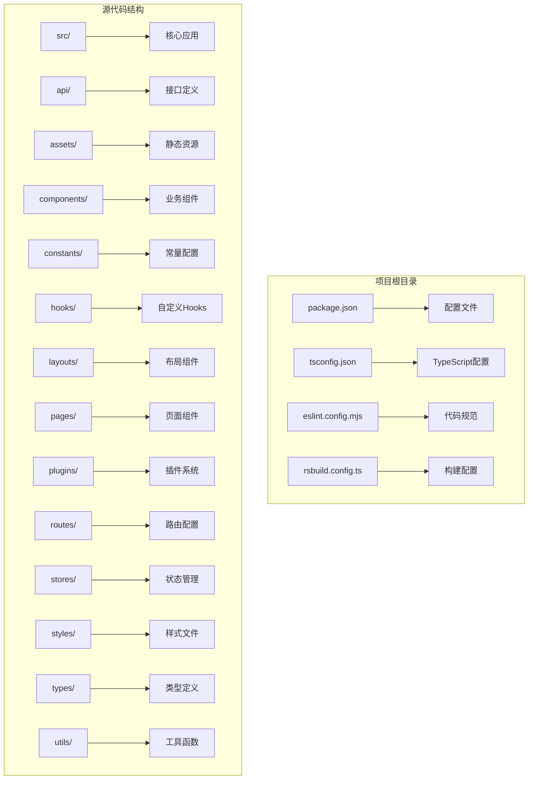
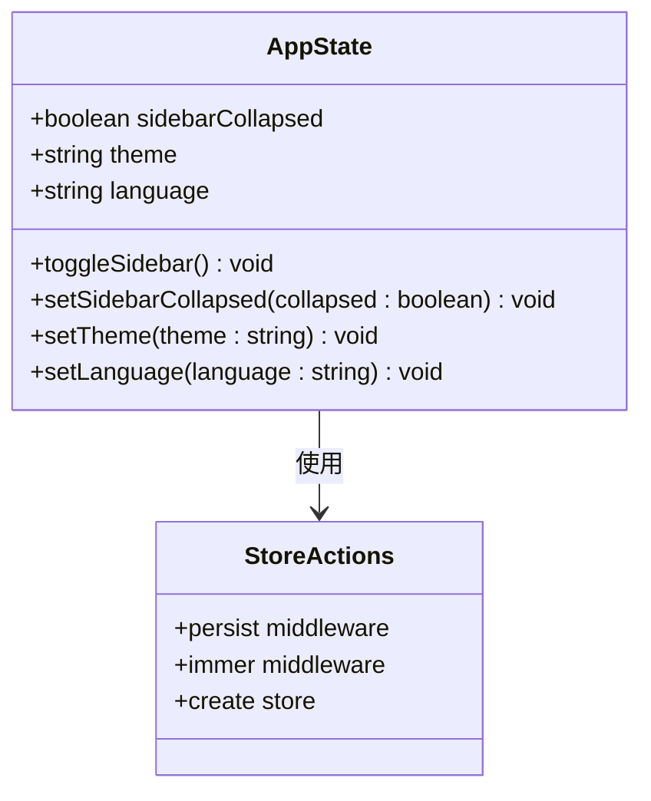
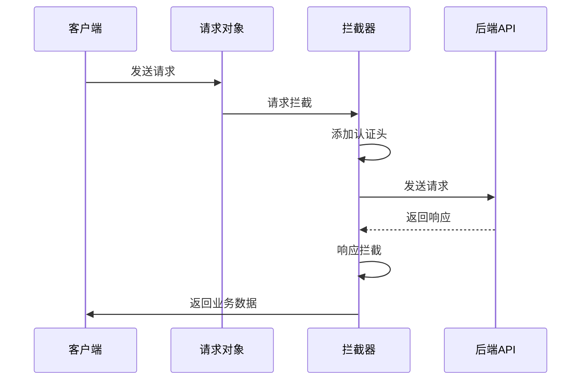
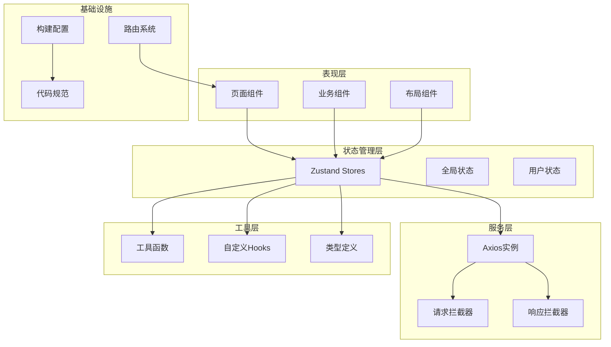
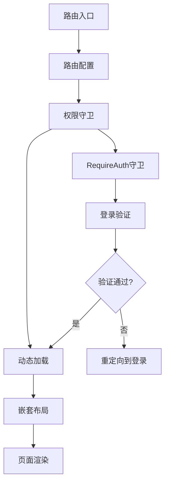
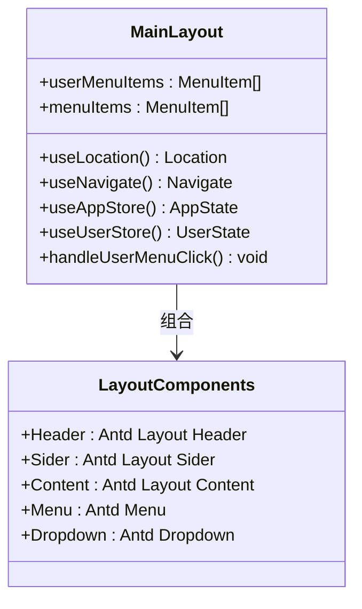
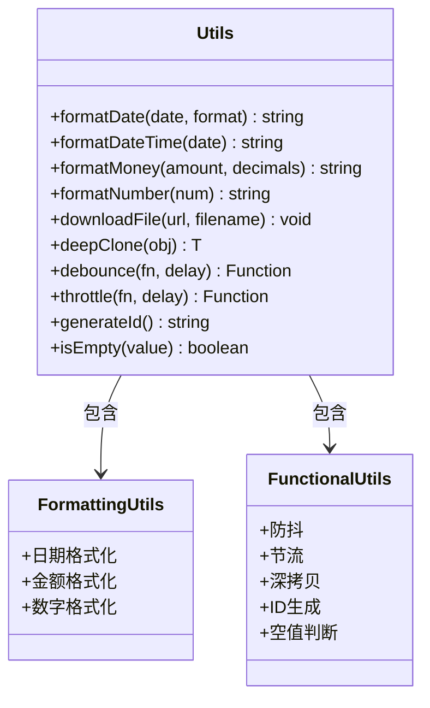
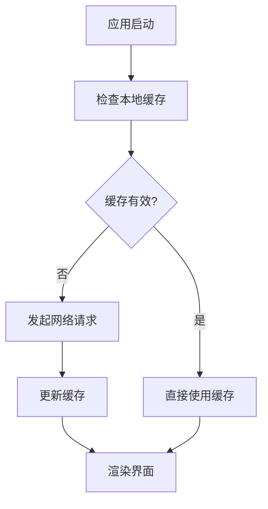
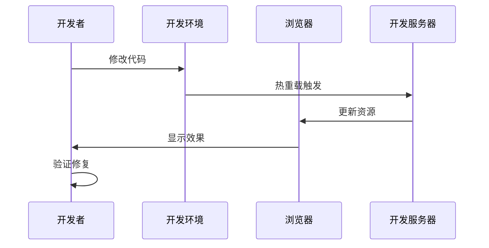

# 技术栈规范

<cite>
**本文档引用的文件**
- [package.json](file://package.json)
- [tsconfig.json](file://tsconfig.json)
- [eslint.config.mjs](file://eslint.config.mjs)
- [rsbuild.config.ts](file://rsbuild.config.ts)
- [src/main.tsx](file://src/main.tsx)
- [src/router/index.tsx](file://src/router/index.tsx)
- [src/plugins/request/index.ts](file://src/plugins/request/index.ts)
- [src/constants/config.ts](file://src/constants/config.ts)
- [.prettierrc](file://.prettierrc)
- [src/utils/index.ts](file://src/utils/index.ts)
- [src/hooks/index.ts](file://src/hooks/index.ts)
- [src/stores/app.ts](file://src/stores/app.ts)
- [src/types/index.ts](file://src/types/index.ts)
- [src/layouts/MainLayout.tsx](file://src/layouts/MainLayout.tsx)
</cite>

## 目录

1. [简介](#简介)
2. [项目结构](#项目结构)
3. [核心组件](#核心组件)
4. [架构概览](#架构概览)
5. [详细组件分析](#详细组件分析)
6. [依赖分析](#依赖分析)
7. [性能考虑](#性能考虑)
8. [故障排除指南](#故障排除指南)
9. [结论](#结论)

## 简介

本技术栈规范文档详细阐述了AI管理系统前端的技术架构、开发规范和最佳实践。该项目采用现代化的前端技术栈，基于React 18、TypeScript、Ant Design以及Zustand状态管理等核心技术构建，旨在提供一个高性能、可维护的企业级管理平台。

## 项目结构

项目采用模块化的组织方式，主要分为以下核心目录：



**图表来源**

- [package.json:1-86](file://package.json#L1-L86)
- [tsconfig.json:1-24](file://tsconfig.json#L1-L24)

**章节来源**

- [package.json:1-86](file://package.json#L1-L86)
- [tsconfig.json:1-24](file://tsconfig.json#L1-L24)

## 核心组件

### 构建工具链

项目采用Rsbuild作为主要构建工具，配合React插件实现现代化的开发体验：

- **构建工具**: Rsbuild 1.7.0
- **React支持**: @rsbuild/plugin-react 1.3.0
- **开发服务器**: 内置热重载和代理功能
- **生产优化**: 自动代码分割和资源压缩

### 状态管理

采用Zustand结合Immer中间件实现高效的状态管理：



**图表来源**

- [src/stores/app.ts:1-59](file://src/stores/app.ts#L1-L59)

### 请求封装

统一的HTTP请求处理机制，确保API调用的一致性和可靠性：



**图表来源**

- [src/plugins/request/index.ts:1-115](file://src/plugins/request/index.ts#L1-L115)

**章节来源**

- [rsbuild.config.ts:1-30](file://rsbuild.config.ts#L1-L30)
- [src/stores/app.ts:1-59](file://src/stores/app.ts#L1-L59)
- [src/plugins/request/index.ts:1-115](file://src/plugins/request/index.ts#L1-L115)

## 架构概览

系统采用分层架构设计，各层职责明确，便于维护和扩展：



**图表来源**

- [src/main.tsx:1-32](file://src/main.tsx#L1-L32)
- [src/router/index.tsx:1-9](file://src/router/index.tsx#L1-L9)
- [src/plugins/request/index.ts:1-115](file://src/plugins/request/index.ts#L1-L115)

## 详细组件分析

### 路由系统

采用React Router 6的现代路由方案，支持嵌套路由和权限控制：



**图表来源**

- [src/router/index.tsx:1-9](file://src/router/index.tsx#L1-L9)

### 布局系统

主布局组件提供完整的管理界面框架：



**图表来源**

- [src/layouts/MainLayout.tsx:1-174](file://src/layouts/MainLayout.tsx#L1-L174)

### 工具函数库

提供常用的工具函数，支持国际化和数据格式化：



**图表来源**

- [src/utils/index.ts:1-106](file://src/utils/index.ts#L1-L106)

**章节来源**

- [src/router/index.tsx:1-9](file://src/router/index.tsx#L1-L9)
- [src/layouts/MainLayout.tsx:1-174](file://src/layouts/MainLayout.tsx#L1-L174)
- [src/utils/index.ts:1-106](file://src/utils/index.ts#L1-L106)

## 依赖分析

项目依赖采用严格的版本管理和约束策略：

```mermaid
graph TB
subgraph "运行时依赖"
A[react@^18.3.0]
B[react-dom@^18.3.0]
C[antd@^5.29.3]
D[zustand@^5.0.11]
E[axios@^1.7.0]
F[dayjs@^1.11.0]
G[lodash-es@^4.17.0]
H[immer@^11.1.4]
end
subgraph "开发依赖"
I[typescript@^5.5.0]
J[@types/react@^18.3.0]
K[eslint@^10.0.3]
L[prettier@^3.8.1]
M[rsbuild@^1.7.0]
N[husky@^9.1.7]
end
subgraph "UI组件库"
O[sdesign@^1.3.3]
P[ant-design/icons@^5.4.0]
Q[lucide-react@^0.577.0]
end
A --> C
C --> O
E --> P
M --> A
K --> I
```

**图表来源**

- [package.json:31-71](file://package.json#L31-L71)

### 版本兼容性

- **Node.js**: >= 18.0.0 (引擎要求)
- **TypeScript**: 5.x系列 (严格类型检查)
- **React**: 18.x系列 (并发特性支持)
- **构建工具**: Rsbuild 1.x系列 (现代化构建)

**章节来源**

- [package.json:31-71](file://package.json#L31-L71)
- [package.json:73-75](file://package.json#L73-L75)

## 性能考虑

### 代码分割

项目采用按需加载策略，优化首屏加载性能：

- **路由级代码分割**: 页面组件按路由自动分割
- **组件级懒加载**: 大型组件使用React.lazy
- **第三方库分离**: 常用库单独打包

### 缓存策略



### 优化建议

1. **图片优化**: 使用WebP格式和适当的尺寸
2. **字体优化**: 使用可变字体和预加载
3. **CDN加速**: 静态资源使用CDN
4. **Gzip压缩**: 生产环境启用压缩

## 故障排除指南

### 常见问题诊断

| 问题类型     | 症状描述               | 解决方案                     |
| ------------ | ---------------------- | ---------------------------- |
| 构建失败     | 编译错误或依赖解析失败 | 检查TypeScript配置和依赖版本 |
| 路由跳转异常 | 页面无法正确导航       | 验证路由配置和权限守卫       |
| API请求失败  | 网络错误或认证失败     | 检查请求拦截器和认证状态     |
| 样式冲突     | 组件样式显示异常       | 确认CSS-in-JS和主题配置      |

### 开发调试



**章节来源**

- [eslint.config.mjs:28-96](file://eslint.config.mjs#L28-L96)
- [src/plugins/request/index.ts:35-77](file://src/plugins/request/index.ts#L35-L77)

## 结论

本技术栈规范为AI管理系统提供了完整的技术指导和最佳实践。通过采用现代化的前端技术栈、严格的代码规范和完善的架构设计，确保了项目的高质量和高可维护性。开发者在遵循这些规范的基础上，可以快速上手项目开发，并保持代码风格的一致性。

关键要点包括：

- 采用React 18的并发特性和TypeScript的强类型系统
- 使用Zustand实现轻量级状态管理
- 通过Rsbuild提供高效的构建体验
- 建立完善的代码规范和质量保证体系
- 设计灵活的组件架构和清晰的职责分工

这些规范不仅适用于当前项目，也为未来的功能扩展和技术演进奠定了坚实的基础。
