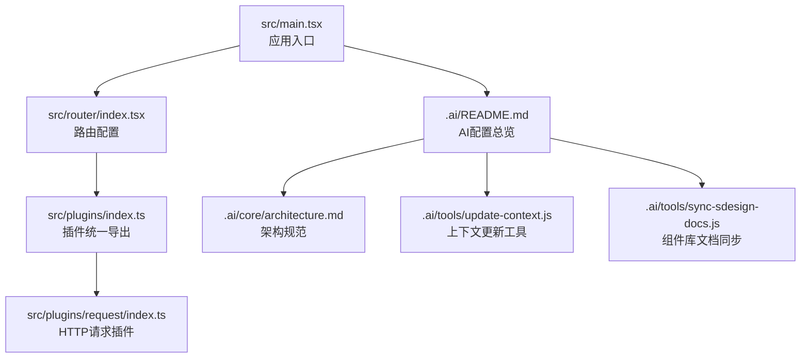
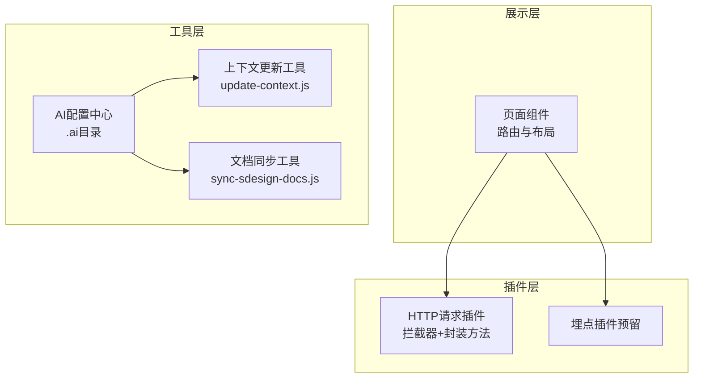
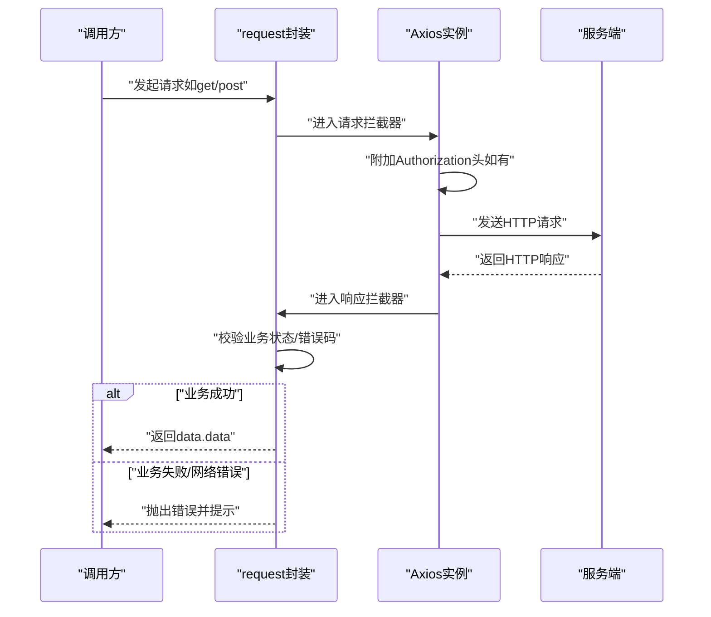
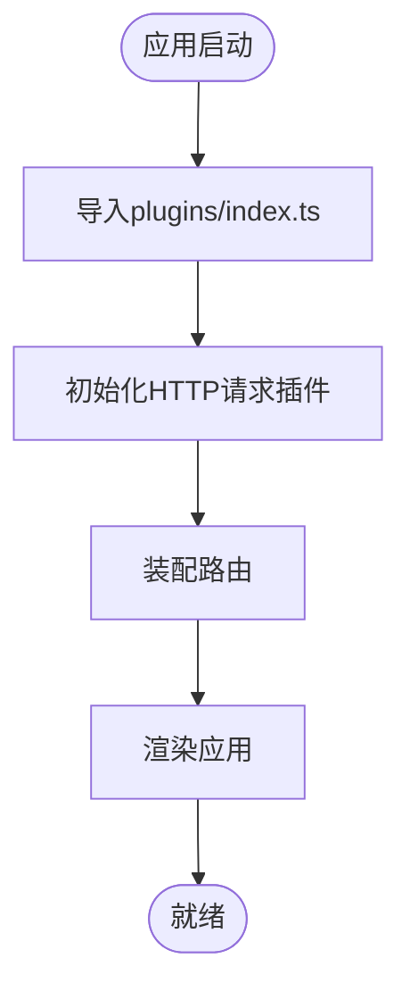
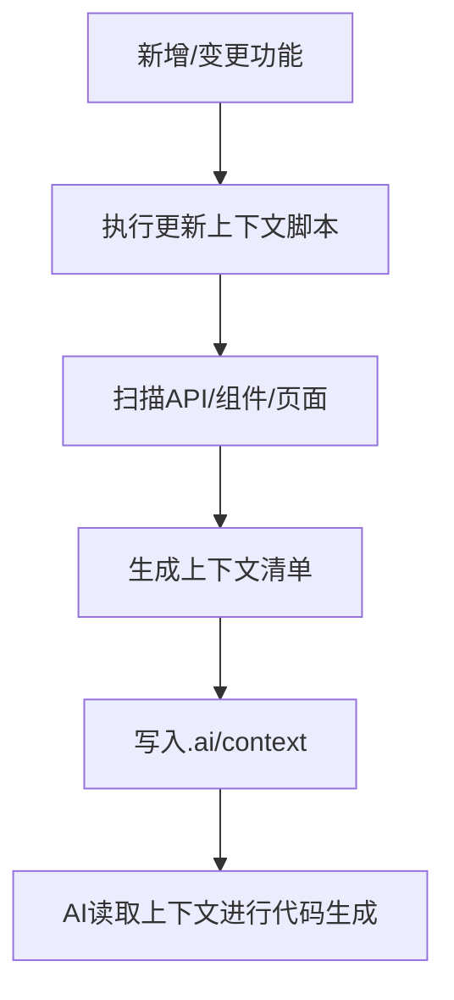
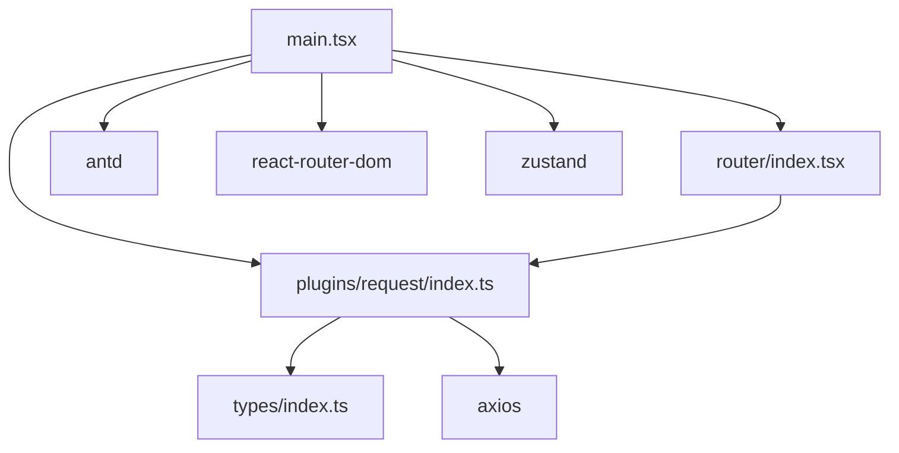

# 插件系统架构

<cite>
**本文引用的文件**
- [src/plugins/index.ts](file://src/plugins/index.ts)
- [src/plugins/request/index.ts](file://src/plugins/request/index.ts)
- [src/main.tsx](file://src/main.tsx)
- [src/router/index.tsx](file://src/router/index.tsx)
- [src/types/index.ts](file://src/types/index.ts)
- [package.json](file://package.json)
- [.ai/README.md](file://.ai/README.md)
- [.ai/core/architecture.md](file://.ai/core/architecture.md)
- [.ai/tools/update-context.js](file://.ai/tools/update-context.js)
- [.ai/tools/sync-sdesign-docs.js](file://.ai/tools/sync-sdesign-docs.js)
</cite>

## 目录

1. [引言](#引言)
2. [项目结构](#项目结构)
3. [核心组件](#核心组件)
4. [架构总览](#架构总览)
5. [详细组件分析](#详细组件分析)
6. [依赖分析](#依赖分析)
7. [性能考虑](#性能考虑)
8. [故障排查指南](#故障排查指南)
9. [结论](#结论)
10. [附录](#附录)

## 引言

本文件面向AI管理平台的插件系统，系统性阐述插件化设计的核心理念与实现方式，重点覆盖HTTP请求插件的设计原理（请求/响应拦截器、错误处理）、插件注册与初始化流程、动态加载与卸载、插件间依赖与生命周期控制、AI工具插件的集成方式（脚本驱动的代码生成与上下文更新）、以及插件配置的集中管理（启用/禁用与参数配置）。文档以仓库现有代码为基础，结合AI配置体系与脚本工具，提供可操作的架构说明与最佳实践。

## 项目结构

插件系统位于前端工程的src/plugins目录，当前实现包含HTTP请求插件与埋点插件占位。整体结构遵循“约定优于配置”的原则，配合AI配置中心与脚本工具，形成可扩展、可验证的开发体系。

**图示来源**

- [src/main.tsx](file://src/main.tsx#L1-L32)
- [src/router/index.tsx](file://src/router/index.tsx#L1-L9)
- [src/plugins/index.ts](file://src/plugins/index.ts#L1-L2)
- [src/plugins/request/index.ts](file://src/plugins/request/index.ts#L1-L114)
- [.ai/README.md](file://.ai/README.md#L1-L209)
- [.ai/core/architecture.md](file://.ai/core/architecture.md#L1-L257)
- [.ai/tools/update-context.js](file://.ai/tools/update-context.js#L1-L254)
- [.ai/tools/sync-sdesign-docs.js](file://.ai/tools/sync-sdesign-docs.js#L1-L123)

**章节来源**

- [src/plugins/index.ts](file://src/plugins/index.ts#L1-L2)
- [src/plugins/request/index.ts](file://src/plugins/request/index.ts#L1-L114)
- [.ai/core/architecture.md](file://.ai/core/architecture.md#L50-L54)

## 核心组件

- HTTP请求插件：基于Axios封装，提供统一的请求方法与拦截器链路，内置鉴权、业务错误与网络错误处理。
- 插件统一导出：通过plugins/index.ts聚合导出，便于应用侧按需引入与扩展。
- 应用入口与路由：main.tsx负责应用初始化与主题配置；router/index.tsx负责路由装配。
- 类型系统：types/index.ts提供全局API响应结构，支撑插件返回值的类型安全。
- AI配置与脚本：.ai目录提供配置驱动的开发规范与自动化工具，支撑插件的上下文更新与文档同步。

**章节来源**

- [src/plugins/request/index.ts](file://src/plugins/request/index.ts#L1-L114)
- [src/plugins/index.ts](file://src/plugins/index.ts#L1-L2)
- [src/main.tsx](file://src/main.tsx#L1-L32)
- [src/router/index.tsx](file://src/router/index.tsx#L1-L9)
- [src/types/index.ts](file://src/types/index.ts#L87-L93)
- [.ai/README.md](file://.ai/README.md#L104-L108)

## 架构总览

插件系统采用“分层+插件化”的架构设计：

- 展示层：React应用通过路由与页面组件消费插件能力。
- 插件层：插件以模块形式提供能力，当前实现HTTP请求插件，后续可扩展埋点、监控等插件。
- 工具层：AI配置中心与脚本工具负责上下文更新、文档同步与验证，保障插件与业务的一致性。

**图示来源**

- [src/plugins/request/index.ts](file://src/plugins/request/index.ts#L1-L114)
- [.ai/README.md](file://.ai/README.md#L1-L209)
- [.ai/tools/update-context.js](file://.ai/tools/update-context.js#L1-L254)
- [.ai/tools/sync-sdesign-docs.js](file://.ai/tools/sync-sdesign-docs.js#L1-L123)

## 详细组件分析

### HTTP请求插件（request）

该插件以Axios为核心，提供统一的请求封装与拦截器链路，具备以下特性：

- 实例化与默认配置：设置超时、默认Content-Type等。
- 请求拦截器：自动注入Authorization头（Bearer Token），增强安全性。
- 响应拦截器：解析业务成功/失败状态，统一封装返回数据；处理401/403/404/500等HTTP错误码；对无响应场景给出网络错误提示。
- 方法封装：提供get/post/put/delete/patch等常用方法，简化调用。

**图示来源**

- [src/plugins/request/index.ts](file://src/plugins/request/index.ts#L12-L114)

**章节来源**

- [src/plugins/request/index.ts](file://src/plugins/request/index.ts#L1-L114)
- [src/types/index.ts](file://src/types/index.ts#L87-L93)

### 插件注册与初始化流程

- 插件导出：plugins/index.ts统一导出各插件模块，便于应用按需引入。
- 应用入口：main.tsx负责应用初始化（主题、国际化、路由挂载），插件能力通过模块导入后在组件中使用。
- 路由装配：router/index.tsx负责路由配置，插件能力可作为页面或服务层的依赖被间接使用。

**图示来源**

- [src/plugins/index.ts](file://src/plugins/index.ts#L1-L2)
- [src/plugins/request/index.ts](file://src/plugins/request/index.ts#L12-L17)
- [src/main.tsx](file://src/main.tsx#L17-L31)
- [src/router/index.tsx](file://src/router/index.tsx#L1-L9)

**章节来源**

- [src/plugins/index.ts](file://src/plugins/index.ts#L1-L2)
- [src/main.tsx](file://src/main.tsx#L1-L32)
- [src/router/index.tsx](file://src/router/index.tsx#L1-L9)

### 插件间的依赖管理与生命周期控制

- 依赖管理：当前HTTP请求插件不依赖其他插件，但可作为其他插件（如埋点插件）的底层依赖。建议通过统一入口导出与按需引入的方式管理依赖。
- 生命周期：HTTP请求插件在应用启动时初始化一次，拦截器贯穿整个应用的HTTP请求周期；若扩展埋点插件，可在应用启动阶段注册，销毁时机由具体插件实现或在路由切换时清理。

**章节来源**

- [src/plugins/request/index.ts](file://src/plugins/request/index.ts#L12-L114)
- [.ai/core/architecture.md](file://.ai/core/architecture.md#L50-L54)

### AI工具插件的集成方式（脚本与上下文更新）

- 上下文更新工具：update-context.js扫描API模块、组件与页面，生成AI理解所需的上下文清单，支持自动化更新。
- 组件库文档同步：sync-sdesign-docs.js将组件库的AI文档同步至.ai/core，解决pnpm软链接导致的读取问题。
- 配置驱动：package.json中的脚本命令与.ai配置共同驱动工具执行，形成可重复的自动化流程。

**图示来源**

- [.ai/tools/update-context.js](file://.ai/tools/update-context.js#L207-L247)
- [.ai/README.md](file://.ai/README.md#L104-L108)

**章节来源**

- [.ai/tools/update-context.js](file://.ai/tools/update-context.js#L1-L254)
- [.ai/tools/sync-sdesign-docs.js](file://.ai/tools/sync-sdesign-docs.js#L1-L123)
- [.ai/README.md](file://.ai/README.md#L1-L209)
- [package.json](file://package.json#L16-L18)

### 插件配置的集中管理（启用/禁用与参数配置）

- 插件启用/禁用：通过plugins/index.ts的导出与应用侧按需引入实现“启用/禁用”。例如，移除某插件的导出会自然禁用其功能。
- 参数配置：HTTP请求插件的默认配置（如超时、头部）在request/index.ts中集中管理；如需扩展，可在同一文件中增加配置项并通过环境变量或配置中心注入。
- AI配置：.ai/core/architecture.md定义了插件目录结构与规范，确保插件实现遵循统一约定。

**章节来源**

- [src/plugins/index.ts](file://src/plugins/index.ts#L1-L2)
- [src/plugins/request/index.ts](file://src/plugins/request/index.ts#L12-L17)
- [.ai/core/architecture.md](file://.ai/core/architecture.md#L50-L54)

## 依赖分析

- 外部依赖：Axios用于HTTP通信；Ant Design提供UI与消息提示；React Router提供路由能力；Zustand用于状态管理。
- 内部依赖：插件层依赖类型系统（types/index.ts）保证API响应结构一致；应用入口依赖路由与插件导出。

**图示来源**

- [src/plugins/request/index.ts](file://src/plugins/request/index.ts#L1-L114)
- [src/types/index.ts](file://src/types/index.ts#L87-L93)
- [src/main.tsx](file://src/main.tsx#L1-L32)
- [src/router/index.tsx](file://src/router/index.tsx#L1-L9)
- [package.json](file://package.json#L20-L36)

**章节来源**

- [package.json](file://package.json#L20-L36)
- [src/plugins/request/index.ts](file://src/plugins/request/index.ts#L1-L114)
- [src/types/index.ts](file://src/types/index.ts#L87-L93)

## 性能考虑

- 请求拦截器：避免在拦截器中执行耗时逻辑，保持请求/响应处理的低延迟。
- 缓存与重试：可在插件层增加缓存策略或重试机制，结合业务场景提升稳定性。
- 并发控制：对高频请求进行并发限制，防止资源争用。
- 体积优化：按需引入插件与依赖，避免打包冗余。

## 故障排查指南

- 401未授权：拦截器检测到401时会清除本地Token并跳转登录页，检查Token有效期与刷新策略。
- 403权限不足：确认用户权限与接口权限模型是否匹配。
- 404资源不存在：核对请求路径与后端接口映射。
- 500服务器错误：查看服务端日志与错误堆栈。
- 网络错误：检查网络连通性与代理配置。

**章节来源**

- [src/plugins/request/index.ts](file://src/plugins/request/index.ts#L48-L76)

## 结论

本插件系统以HTTP请求插件为核心，结合统一导出与应用入口装配，实现了模块化与可扩展性。配合AI配置中心与脚本工具，形成“配置驱动+自动化”的开发闭环。未来可在现有基础上扩展埋点、监控等插件，并通过集中配置与生命周期管理进一步增强系统的灵活性与可维护性。

## 附录

- 快速定位：可通过.ai/README.md中的关键词快速定位到架构、规范与模板文件。
- 常用命令：使用package.json中的脚本命令执行上下文更新与文档同步。

**章节来源**

- [.ai/README.md](file://.ai/README.md#L164-L173)
- [package.json](file://package.json#L6-L18)
