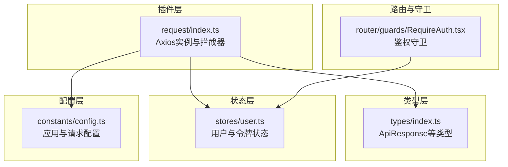
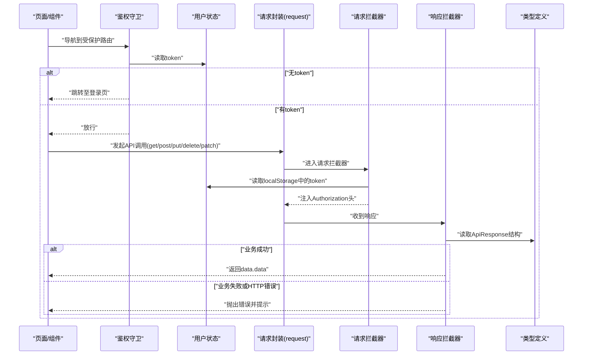
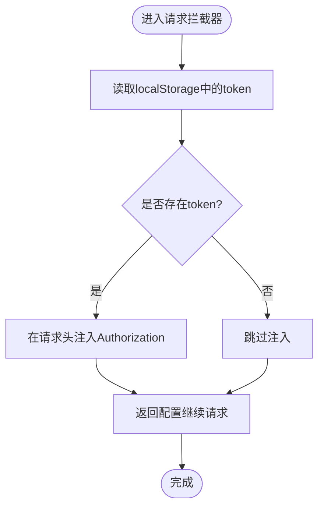
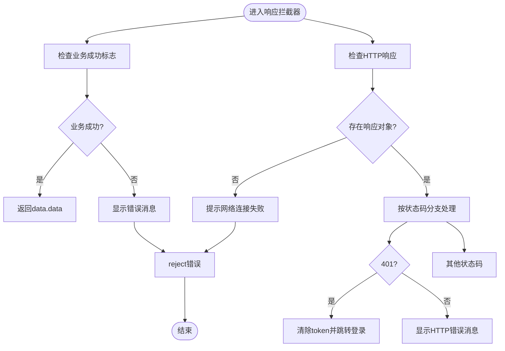
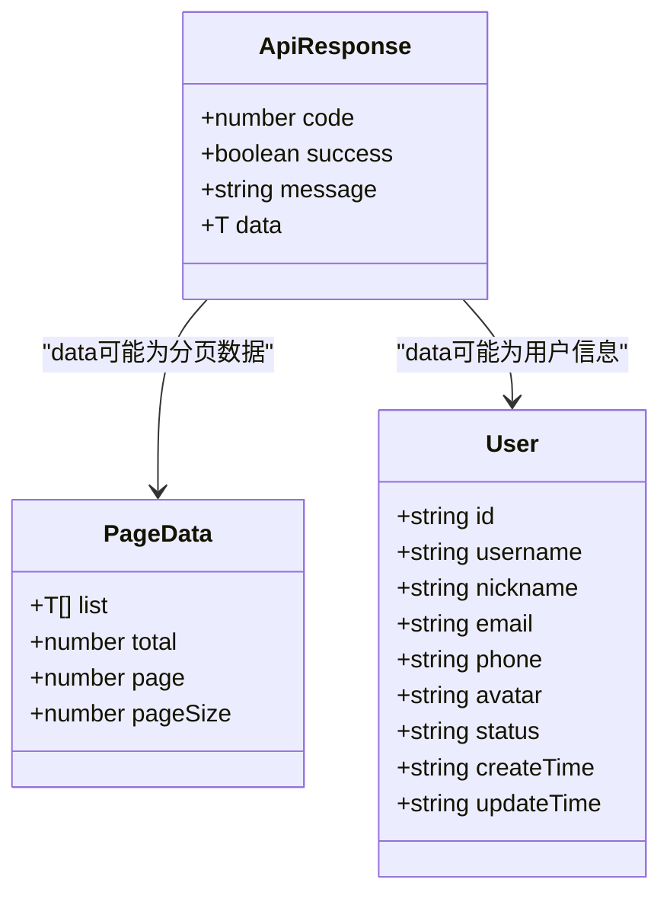
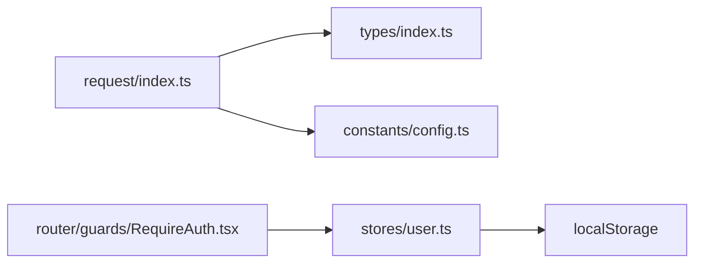

# API数据流

<cite>
**本文引用的文件**
- [src/plugins/request/index.ts](file://src/plugins/request/index.ts)
- [src/types/index.ts](file://src/types/index.ts)
- [src/stores/user.ts](file://src/stores/user.ts)
- [src/constants/config.ts](file://src/constants/config.ts)
- [src/router/guards/RequireAuth.tsx](file://src/router/guards/RequireAuth.tsx)
- [src/plugins/index.ts](file://src/plugins/index.ts)
- [.ai/templates/api-module.md](file://.ai/templates/api-module.md)
- [.ai/validation/rules.json](file://.ai/validation/rules.json)
- [.ai/validation/validator.ts](file://.ai/validation/validator.ts)
</cite>

## 目录

1. [引言](#引言)
2. [项目结构](#项目结构)
3. [核心组件](#核心组件)
4. [架构总览](#架构总览)
5. [详细组件分析](#详细组件分析)
6. [依赖分析](#依赖分析)
7. [性能考虑](#性能考虑)
8. [故障排查指南](#故障排查指南)
9. [结论](#结论)
10. [附录](#附录)

## 引言

本文件面向AI管理平台的前端API数据流，系统性梳理HTTP请求从发起到响应的完整生命周期，重点说明：

- 请求拦截器如何统一注入认证令牌与请求头
- 响应拦截器如何进行状态码判断、错误提示与业务解构
- API调用模式（GET查询、POST提交、PUT更新、DELETE删除、PATCH部分更新）
- 数据模型与验证：前后端数据格式一致性保障
- 并发控制与重试机制现状与改进建议
- 网络异常与超时处理策略

## 项目结构

围绕API数据流的关键文件组织如下：

- 插件层：统一的HTTP客户端封装与请求/响应拦截器
- 类型层：统一的API响应模型与通用类型
- 状态层：用户态与权限状态，支撑鉴权与路由守卫
- 配置层：应用与请求的基础配置
- 模板与校验：API模块生成规范与校验规则

图表来源

- [src/plugins/request/index.ts](file://src/plugins/request/index.ts#L1-L114)
- [src/types/index.ts](file://src/types/index.ts#L87-L93)
- [src/stores/user.ts](file://src/stores/user.ts#L1-L76)
- [src/constants/config.ts](file://src/constants/config.ts#L36-L45)
- [src/router/guards/RequireAuth.tsx](file://src/router/guards/RequireAuth.tsx#L1-L24)

章节来源

- [src/plugins/request/index.ts](file://src/plugins/request/index.ts#L1-L114)
- [src/types/index.ts](file://src/types/index.ts#L1-L101)
- [src/stores/user.ts](file://src/stores/user.ts#L1-L76)
- [src/constants/config.ts](file://src/constants/config.ts#L1-L76)
- [src/router/guards/RequireAuth.tsx](file://src/router/guards/RequireAuth.tsx#L1-L24)

## 核心组件

- Axios实例与拦截器：负责超时、默认请求头、认证令牌注入、业务解构与错误处理
- API响应模型：统一的响应结构，便于前端一致处理
- 用户状态与鉴权守卫：支撑令牌读取与路由保护
- 请求配置：基础URL、超时、重试次数与延迟（当前未在请求层实现）

章节来源

- [src/plugins/request/index.ts](file://src/plugins/request/index.ts#L11-L17)
- [src/plugins/request/index.ts](file://src/plugins/request/index.ts#L19-L32)
- [src/plugins/request/index.ts](file://src/plugins/request/index.ts#L34-L76)
- [src/types/index.ts](file://src/types/index.ts#L87-L93)
- [src/stores/user.ts](file://src/stores/user.ts#L1-L76)
- [src/constants/config.ts](file://src/constants/config.ts#L36-L45)

## 架构总览

下图展示一次典型API请求的端到端流程：从页面触发到响应返回，贯穿拦截器、状态与守卫。

图表来源

- [src/router/guards/RequireAuth.tsx](file://src/router/guards/RequireAuth.tsx#L11-L22)
- [src/stores/user.ts](file://src/stores/user.ts#L53-L60)
- [src/plugins/request/index.ts](file://src/plugins/request/index.ts#L19-L32)
- [src/plugins/request/index.ts](file://src/plugins/request/index.ts#L34-L76)
- [src/types/index.ts](file://src/types/index.ts#L87-L93)

## 详细组件分析

### 请求拦截器工作机制

- 认证令牌注入：从本地存储读取token并在请求头中附加
- 请求头设置：默认JSON内容类型与超时时间
- 参数序列化：通过Axios默认行为处理请求体与查询参数
- 错误传递：拦截器内错误直接reject，交由响应拦截器统一处理

图表来源

- [src/plugins/request/index.ts](file://src/plugins/request/index.ts#L19-L32)

章节来源

- [src/plugins/request/index.ts](file://src/plugins/request/index.ts#L19-L32)

### 响应拦截器处理逻辑

- 业务成功判定：依据success或code=200进行解构，返回data.data
- 业务错误处理：弹出消息并reject，上层可捕获
- HTTP错误处理：根据状态码给出友好提示；401时清理token并跳转登录
- 网络异常：无response时提示网络连接失败

图表来源

- [src/plugins/request/index.ts](file://src/plugins/request/index.ts#L34-L76)

章节来源

- [src/plugins/request/index.ts](file://src/plugins/request/index.ts#L34-L76)

### API接口调用模式

- GET查询：用于分页列表与条件筛选
- POST提交：用于新增资源
- PUT更新：用于全量更新资源
- DELETE删除：用于删除资源
- PATCH部分更新：用于局部更新资源

上述模式均通过request对象的同名方法封装，保持调用风格一致。

章节来源

- [src/plugins/request/index.ts](file://src/plugins/request/index.ts#L78-L111)

### 数据模型定义与验证

- 统一响应模型：包含code、success、message与data字段，便于前端统一处理
- 通用类型：分页、用户、菜单项、表格列、表单字段等
- 类型完整性：AI模板与校验规则要求API模块实现与类型定义完整，避免使用any

图表来源

- [src/types/index.ts](file://src/types/index.ts#L87-L93)
- [src/types/index.ts](file://src/types/index.ts#L3-L9)
- [src/types/index.ts](file://src/types/index.ts#L17-L28)

章节来源

- [src/types/index.ts](file://src/types/index.ts#L1-L101)
- [.ai/templates/api-module.md](file://.ai/templates/api-module.md#L49-L58)
- [.ai/validation/rules.json](file://.ai/validation/rules.json#L22-L44)
- [.ai/validation/validator.ts](file://.ai/validation/validator.ts#L75-L82)

### 异步请求的并发控制与重试机制

- 当前实现：请求拦截器与封装方法未内置重试与并发限制
- 可选方案：
  - 在请求层增加重试：基于状态码与超时进行指数退避重试
  - 并发控制：引入队列或信号量限制同时请求数
  - 超时与取消：结合AbortController与axios取消令牌
- 配置参考：REQUEST_CONFIG提供超时、重试次数与延迟的配置常量，可用于扩展实现

章节来源

- [src/plugins/request/index.ts](file://src/plugins/request/index.ts#L12-L17)
- [src/constants/config.ts](file://src/constants/config.ts#L36-L45)
- [.ai/validation/rules.json](file://.ai/validation/rules.json#L40-L44)

### 网络异常与超时处理

- 超时：Axios实例默认30秒，可在调用时覆盖
- 网络异常：无响应对象时统一提示“网络连接失败”
- 401处理：自动清理token并跳转登录页，避免无效请求继续

章节来源

- [src/plugins/request/index.ts](file://src/plugins/request/index.ts#L12-L17)
- [src/plugins/request/index.ts](file://src/plugins/request/index.ts#L48-L76)
- [src/stores/user.ts](file://src/stores/user.ts#L53-L60)

## 依赖分析

- request封装依赖类型定义以进行响应解构
- 路由守卫依赖用户状态以决定是否放行
- 用户状态依赖localStorage以持久化token
- 请求配置提供超时与重试参数（待在请求层落地）

图表来源

- [src/plugins/request/index.ts](file://src/plugins/request/index.ts#L1-L114)
- [src/types/index.ts](file://src/types/index.ts#L1-L101)
- [src/stores/user.ts](file://src/stores/user.ts#L1-L76)
- [src/constants/config.ts](file://src/constants/config.ts#L1-L76)
- [src/router/guards/RequireAuth.tsx](file://src/router/guards/RequireAuth.tsx#L1-L24)

章节来源

- [src/plugins/request/index.ts](file://src/plugins/request/index.ts#L1-L114)
- [src/stores/user.ts](file://src/stores/user.ts#L1-L76)
- [src/router/guards/RequireAuth.tsx](file://src/router/guards/RequireAuth.tsx#L1-L24)

## 性能考虑

- 合理设置超时：避免长时间阻塞UI线程
- 控制并发：对高频接口采用节流/去抖或批量合并
- 缓存策略：对只读列表数据启用内存缓存与失效策略
- 传输优化：仅传输必要字段，避免大对象重复传输
- 错误快速失败：对明显无效请求尽早拒绝，减少后端压力

## 故障排查指南

- 无法登录或频繁被踢出
  - 检查localStorage中token是否存在与过期
  - 响应拦截器对401会自动清理token并跳转登录
- 请求报错但无明确信息
  - 检查响应拦截器对HTTP错误与网络异常的提示
- 列表数据不更新
  - 确认GET请求参数是否正确传递
  - 检查分页参数与服务端分页实现一致性
- 新增/更新失败
  - 确认POST/PUT请求体结构与服务端期望一致
  - 检查类型定义与API实现是否匹配

章节来源

- [src/plugins/request/index.ts](file://src/plugins/request/index.ts#L48-L76)
- [src/stores/user.ts](file://src/stores/user.ts#L53-L60)

## 结论

本项目通过统一的请求封装与拦截器实现了标准化的API数据流：请求阶段注入认证、响应阶段进行业务解构与错误处理，并辅以路由守卫与用户状态管理保障安全性。类型系统与AI模板/校验规则共同提升了前后端数据格式一致性。未来可在请求层补充重试与并发控制能力，进一步提升稳定性与用户体验。

## 附录

- API模块生成规范与校验规则可作为开发约束与质量保障
- 插件导出入口集中于plugins/index.ts，便于统一导入与使用

章节来源

- [.ai/templates/api-module.md](file://.ai/templates/api-module.md#L1-L91)
- [.ai/validation/rules.json](file://.ai/validation/rules.json#L1-L44)
- [.ai/validation/validator.ts](file://.ai/validation/validator.ts#L66-L103)
- [src/plugins/index.ts](file://src/plugins/index.ts#L1-L2)
