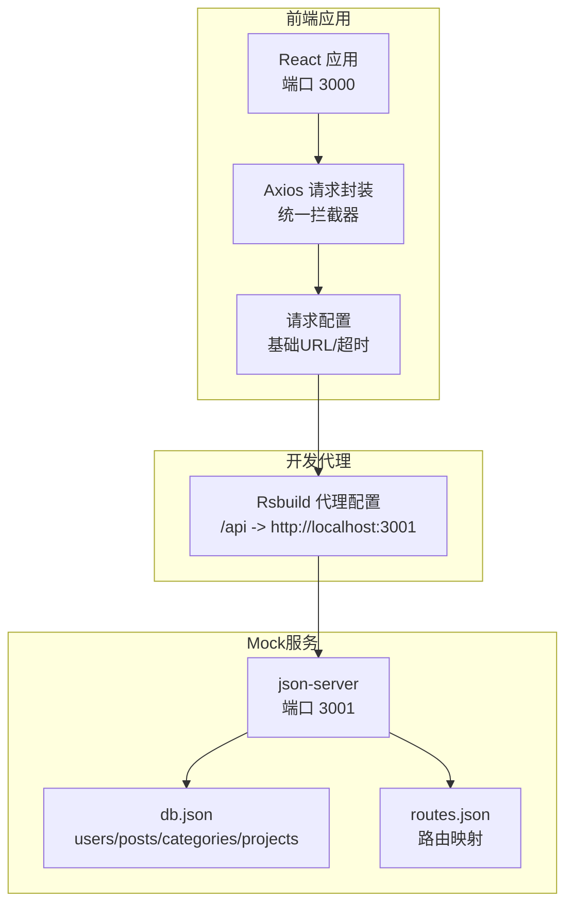
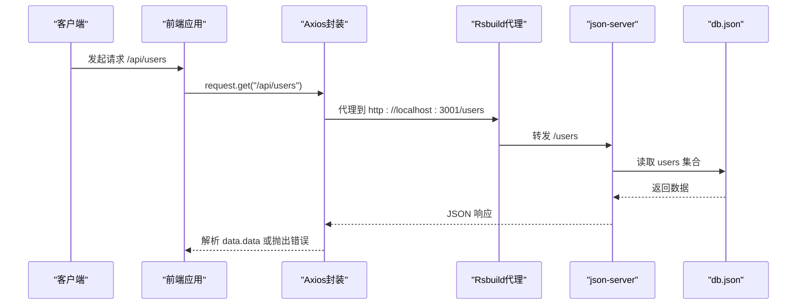
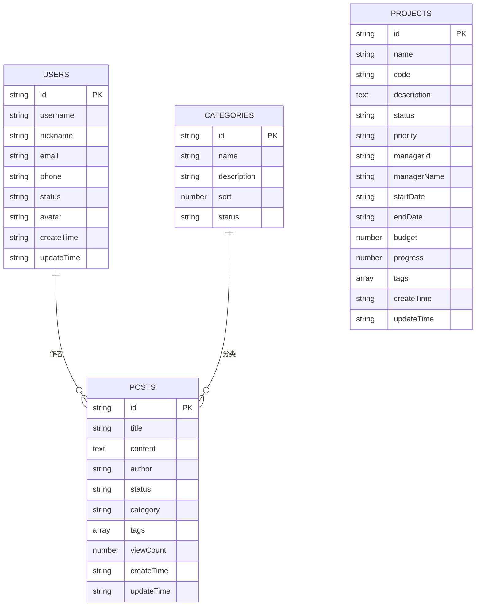
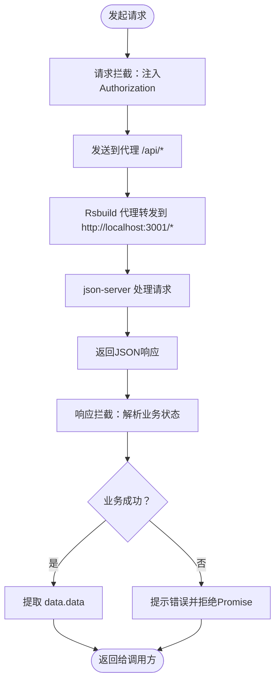
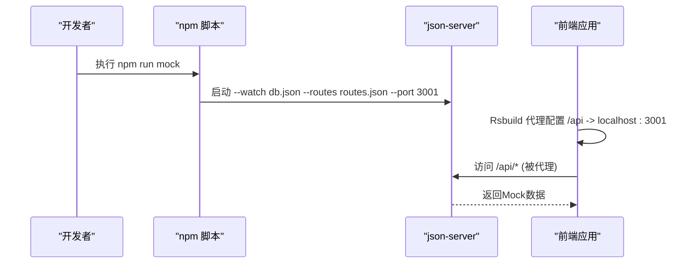
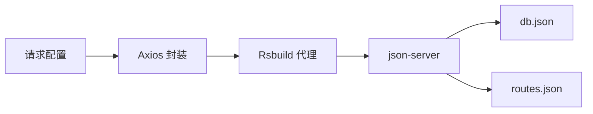

# Mock数据集成

<cite>
**本文引用的文件**
- [mock/db.json](file://mock/db.json)
- [mock/routes.json](file://mock/routes.json)
- [package.json](file://package.json)
- [src/plugins/request/index.ts](file://src/plugins/request/index.ts)
- [src/constants/config.ts](file://src/constants/config.ts)
- [src/types/index.ts](file://src/types/index.ts)
- [rsbuild.config.ts](file://rsbuild.config.ts)
- [scripts/update-context.cjs](file://scripts/update-context.cjs)
- [.ai/templates/api-module.md](file://.ai/templates/api-module.md)
</cite>

## 目录

1. [简介](#简介)
2. [项目结构](#项目结构)
3. [核心组件](#核心组件)
4. [架构总览](#架构总览)
5. [详细组件分析](#详细组件分析)
6. [依赖关系分析](#依赖关系分析)
7. [性能考虑](#性能考虑)
8. [故障排查指南](#故障排查指南)
9. [结论](#结论)
10. [附录](#附录)

## 简介

本文件面向AI管理平台的Mock数据集成，系统性阐述Mock服务的架构设计与实现细节，包括：

- 数据库模拟与路由拦截机制
- db.json中的数据模型定义（用户、项目、文章、分类等）
- routes.json中的路由映射规则
- Mock服务的启动与停止机制（开发/生产环境切换策略）
- 动态生成与随机化处理（模拟真实数据变化）
- 与真实API的兼容性保证
- 维护与扩展指南（新增数据类型与现有数据修改）

## 项目结构

Mock数据集成采用“本地JSON数据库 + 路由重写”的轻量方案，通过json-server提供REST风格接口，前端通过代理转发到Mock服务。

图表来源

- [rsbuild.config.ts](file://rsbuild.config.ts#L11-L22)
- [package.json](file://package.json#L11-L11)
- [mock/db.json](file://mock/db.json#L1-L140)
- [mock/routes.json](file://mock/routes.json#L1-L11)

章节来源

- [rsbuild.config.ts](file://rsbuild.config.ts#L1-L29)
- [package.json](file://package.json#L1-L81)

## 核心组件

- Mock数据库：以db.json作为数据源，包含用户、文章、分类、项目等实体集合。
- 路由映射：routes.json将前端调用的路径（如/api/users）重写到json-server内部资源路径（/users）。
- 请求封装：前端通过Axios封装统一拦截器，自动注入Token、处理业务错误码与HTTP错误码。
- 代理配置：Rsbuild在开发环境下将/api前缀请求代理到Mock服务（默认3001端口）。
- 启动脚本：package.json中提供mock脚本，直接运行json-server并加载db.json与routes.json。

章节来源

- [mock/db.json](file://mock/db.json#L1-L140)
- [mock/routes.json](file://mock/routes.json#L1-L11)
- [src/plugins/request/index.ts](file://src/plugins/request/index.ts#L1-L114)
- [rsbuild.config.ts](file://rsbuild.config.ts#L11-L22)
- [package.json](file://package.json#L11-L11)

## 架构总览

前端请求经由Rsbuild代理转发至json-server，json-server根据routes.json进行路径重写，再从db.json读取或写入数据，返回标准JSON响应。Axios拦截器负责统一处理响应体中的业务状态与HTTP状态码。

图表来源

- [rsbuild.config.ts](file://rsbuild.config.ts#L13-L20)
- [package.json](file://package.json#L11-L11)
- [src/plugins/request/index.ts](file://src/plugins/request/index.ts#L35-L76)
- [mock/db.json](file://mock/db.json#L2-L36)

## 详细组件分析

### 数据模型定义（db.json）

db.json采用集合式结构，每个实体对应一个数组，包含若干字段。以下为关键实体的字段说明与复杂度分析：

- 用户集合（users）
  - 字段要点：标识、用户名、昵称、邮箱、电话、状态、头像、创建/更新时间
  - 复杂度：查询/更新为O(1)，排序/过滤为O(n)
  - 示例路径：[users集合](file://mock/db.json#L2-L36)

- 文章集合（posts）
  - 字段要点：标题、内容、作者、状态、分类、标签、浏览数、创建/更新时间
  - 复杂度：同上
  - 示例路径：[posts集合](file://mock/db.json#L37-L62)

- 分类集合（categories）
  - 字段要点：名称、描述、排序、状态
  - 复杂度：同上
  - 示例路径：[categories集合](file://mock/db.json#L63-L85)

- 项目集合（projects）
  - 字段要点：名称、编号、描述、状态、优先级、负责人、起止日期、预算、进度、标签、创建/更新时间
  - 复杂度：同上
  - 示例路径：[projects集合](file://mock/db.json#L86-L138)

图表来源

- [mock/db.json](file://mock/db.json#L2-L138)
- [src/types/index.ts](file://src/types/index.ts#L17-L28)
- [src/types/index.ts](file://src/types/index.ts#L87-L93)

章节来源

- [mock/db.json](file://mock/db.json#L1-L140)
- [src/types/index.ts](file://src/types/index.ts#L17-L28)
- [src/types/index.ts](file://src/types/index.ts#L87-L93)

### 路由映射规则（routes.json）

routes.json定义了前端调用路径与json-server内部资源路径之间的映射关系，支持通配符与参数占位符。

- 映射规则
  - /auth/login → /login
  - /auth/logout → /logout
  - /users/:id → /users/:id
  - /users → /users
  - /posts/:id → /posts/:id
  - /posts → /posts
  - /categories/:id → /categories/:id
  - /categories → /categories

- 实现机制
  - json-server内置express-urlrewrite中间件，按routes.json逐条匹配并重写路径
  - 支持动态参数（如:id），便于RESTful风格的CRUD操作

章节来源

- [mock/routes.json](file://mock/routes.json#L1-L11)

### 请求封装与拦截器（Axios）

前端通过Axios封装统一处理请求与响应，关键逻辑如下：

- 请求拦截：自动从localStorage读取token并注入Authorization头
- 响应拦截：识别业务成功/失败（success或code=200），统一提取data.data；对HTTP错误码进行提示与路由跳转
- 错误处理：区分401（跳转登录）、403、404、500等，统一消息提示

图表来源

- [src/plugins/request/index.ts](file://src/plugins/request/index.ts#L19-L76)
- [rsbuild.config.ts](file://rsbuild.config.ts#L13-L20)

章节来源

- [src/plugins/request/index.ts](file://src/plugins/request/index.ts#L1-L114)

### 启动与停止机制

- 启动
  - 开发环境：执行脚本 npm run mock，json-server监听3001端口，读取db.json与routes.json
  - 前端：Rsbuild本地服务3000端口，/api前缀请求被代理到3001端口
- 停止
  - Ctrl+C终止json-server进程；关闭浏览器后Rsbuild代理自动断开
- 生产环境
  - 该方案仅用于开发与测试；生产环境需替换为真实后端服务，保持API一致即可

图表来源

- [package.json](file://package.json#L11-L11)
- [rsbuild.config.ts](file://rsbuild.config.ts#L13-L20)

章节来源

- [package.json](file://package.json#L11-L11)
- [rsbuild.config.ts](file://rsbuild.config.ts#L1-L29)

### 动态生成与随机化处理

- 自增ID：json-server为新增记录自动生成唯一ID，避免手动维护
- 时间戳：创建/更新时间字段采用ISO字符串，便于排序与展示
- 随机化建议
  - 可通过自定义中间件在json-server中实现随机字段生成（如随机浏览数、进度百分比）
  - 对于复杂随机需求，可在前端或独立工具中生成数据集后再导入db.json
- 真实场景模拟
  - 通过调整状态字段（如active/inactive、published/planning/completed）模拟业务流转
  - 通过标签与分类字段模拟多维筛选与聚合

章节来源

- [mock/db.json](file://mock/db.json#L1-L140)

### 与真实API的兼容性保证

- 接口形态一致性
  - 保持相同的HTTP方法（GET/POST/PUT/DELETE/PATCH）、路径结构与参数命名
  - 响应体遵循统一结构：{ code, data, message, success }
- 类型与字段
  - 在src/types中定义与db.json字段一致的接口类型，确保前端类型安全
  - 字段命名与枚举值（如状态、优先级）保持一致
- 测试与校验
  - 使用API模板生成器与上下文扫描工具，确保新增模块符合规范
  - 通过脚本扫描API模块，辅助生成与校验

章节来源

- [src/types/index.ts](file://src/types/index.ts#L17-L28)
- [src/types/index.ts](file://src/types/index.ts#L87-L93)
- [.ai/templates/api-module.md](file://.ai/templates/api-module.md#L79-L91)
- [scripts/update-context.cjs](file://scripts/update-context.cjs#L15-L49)

## 依赖关系分析

- 前端依赖
  - axios：请求封装与拦截器
  - antd：UI与消息提示
- 开发依赖
  - json-server：Mock数据库与REST服务
  - @rsbuild/core：开发代理与构建
- 关键耦合点
  - Rsbuild代理将/api前缀转发到Mock服务
  - Axios拦截器依赖统一的响应结构
  - routes.json与db.json共同决定API形态

图表来源

- [src/plugins/request/index.ts](file://src/plugins/request/index.ts#L1-L114)
- [rsbuild.config.ts](file://rsbuild.config.ts#L13-L20)
- [package.json](file://package.json#L51-L51)

章节来源

- [package.json](file://package.json#L51-L51)
- [rsbuild.config.ts](file://rsbuild.config.ts#L1-L29)
- [src/plugins/request/index.ts](file://src/plugins/request/index.ts#L1-L114)

## 性能考虑

- 数据规模
  - db.json适合小中型数据集；若数据量增大，建议拆分集合或引入分页/索引策略
- 查询效率
  - json-server不支持复杂查询；可通过前端分页与筛选降低单次请求负载
- 缓存与并发
  - 建议在前端增加缓存策略（如useRequest缓存），减少重复请求
- 代理与网络
  - 代理层无额外计算开销；注意控制请求频率，避免频繁写入导致db.json频繁落盘

## 故障排查指南

- 无法访问Mock数据
  - 确认npm run mock是否正常启动且端口3001可用
  - 检查Rsbuild代理配置是否正确（/api -> localhost:3001）
- 响应结构异常
  - 确保响应拦截器能正确识别success或code=200
  - 检查db.json字段是否与类型定义一致
- 路由404
  - 确认routes.json中的映射是否覆盖实际调用路径
  - 检查是否存在多余斜杠或大小写不一致
- 权限与登录
  - 确认localStorage中存在token，请求头Authorization是否正确注入
  - 401错误会触发跳转登录流程

章节来源

- [src/plugins/request/index.ts](file://src/plugins/request/index.ts#L35-L76)
- [rsbuild.config.ts](file://rsbuild.config.ts#L13-L20)
- [mock/routes.json](file://mock/routes.json#L1-L11)

## 结论

本Mock数据集成方案以最小成本实现了与真实API的高度兼容，通过db.json与routes.json清晰定义数据与接口契约，配合Axios拦截器与Rsbuild代理，满足开发与测试阶段的高效迭代需求。建议在团队内统一API规范与类型定义，持续维护db.json与路由映射，确保Mock与真实后端的平滑切换。

## 附录

### 新增数据类型的步骤

- 在db.json中添加新的集合与示例数据
- 在routes.json中补充对应的路由映射
- 在src/types/index.ts中新增对应接口类型
- 使用API模板生成器与上下文扫描工具，确保模块化与规范一致

章节来源

- [.ai/templates/api-module.md](file://.ai/templates/api-module.md#L79-L91)
- [scripts/update-context.cjs](file://scripts/update-context.cjs#L15-L49)
