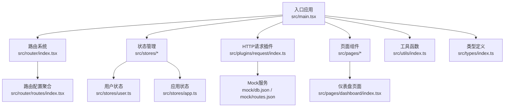
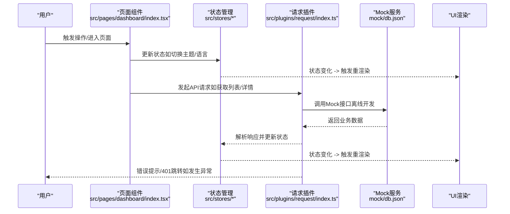
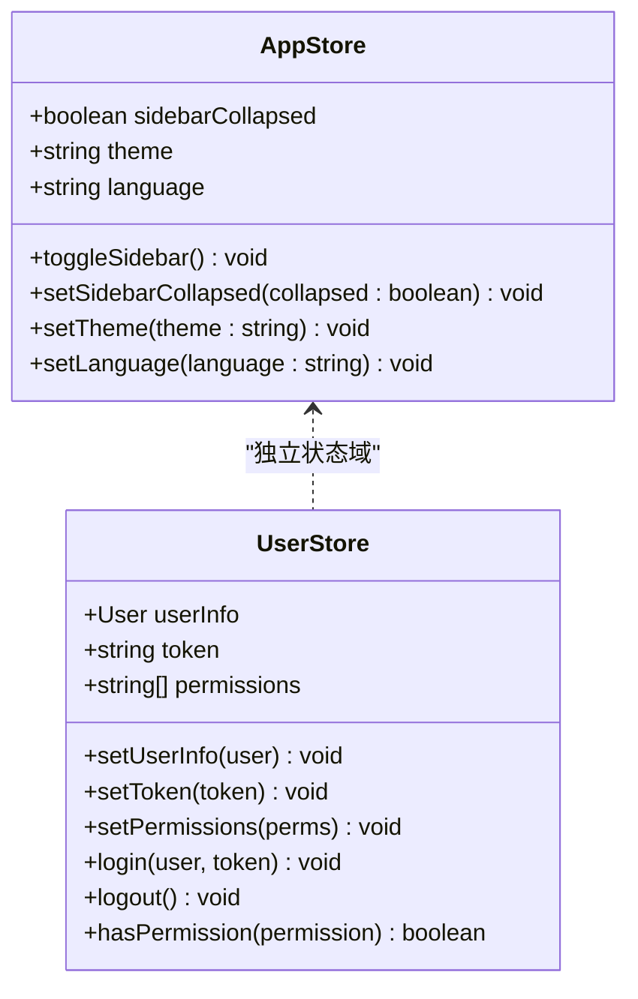
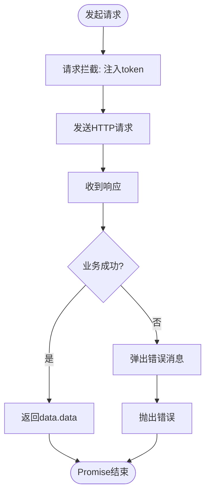
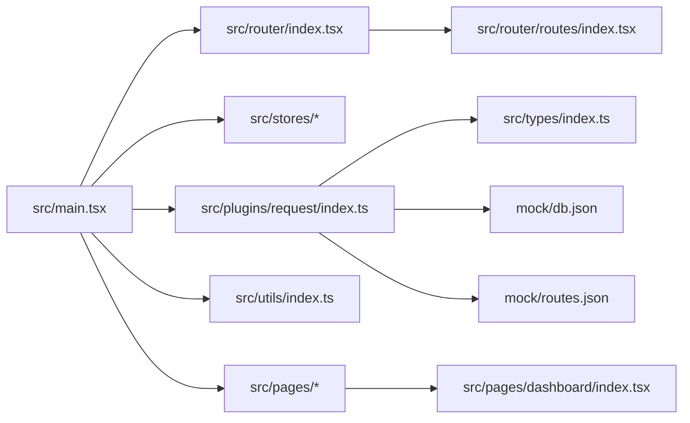

# 数据流架构

<cite>
**本文引用的文件**
- [src/main.tsx](file://src/main.tsx)
- [src/plugins/request/index.ts](file://src/plugins/request/index.ts)
- [src/stores/app.ts](file://src/stores/app.ts)
- [src/stores/user.ts](file://src/stores/user.ts)
- [src/stores/index.ts](file://src/stores/index.ts)
- [src/router/index.tsx](file://src/router/index.tsx)
- [src/router/routes/index.tsx](file://src/router/routes/index.tsx)
- [src/tabs/index.tsx](file://src/tabs/index.tsx)
- [src/pages/dashboard/index.tsx](file://src/pages/dashboard/index.tsx)
- [src/utils/index.ts](file://src/utils/index.ts)
- [src/types/index.ts](file://src/types/index.ts)
- [mock/db.json](file://mock/db.json)
- [mock/routes.json](file://mock/routes.json)
- [package.json](file://package.json)
</cite>

## 目录

1. [引言](#引言)
2. [项目结构](#项目结构)
3. [核心组件](#核心组件)
4. [架构总览](#架构总览)
5. [详细组件分析](#详细组件分析)
6. [依赖关系分析](#依赖关系分析)
7. [性能考量](#性能考量)
8. [故障排查指南](#故障排查指南)
9. [结论](#结论)
10. [附录](#附录)

## 引言

本文件面向AI管理平台的数据流架构，聚焦“从用户操作到UI更新”的完整数据路径，系统阐述事件触发、状态更新、API调用与响应处理的环节；解释单向数据流设计原则与状态管理如何保证一致性与可预测性；分析异步数据处理（Promise链式调用、错误处理、loading状态管理）；说明Mock数据服务的集成方式与前后端分离开发；剖析数据缓存策略（内存缓存、本地存储、网络缓存）；最后讨论数据验证与转换，确保数据格式正确与安全。

## 项目结构

该工程采用分层与功能域结合的组织方式：入口应用在根部，路由与守卫负责导航控制，状态管理使用轻量状态库，插件层封装HTTP请求，Mock服务提供离线接口，页面组件负责UI渲染与交互。

图示来源

- [src/main.tsx](file://src/main.tsx#L1-L32)
- [src/router/index.tsx](file://src/router/index.tsx#L1-L9)
- [src/router/routes/index.tsx](file://src/router/routes/index.tsx#L1-L31)
- [src/stores/user.ts](file://src/stores/user.ts#L1-L76)
- [src/stores/app.ts](file://src/stores/app.ts#L1-L59)
- [src/plugins/request/index.ts](file://src/plugins/request/index.ts#L1-L114)
- [mock/db.json](file://mock/db.json#L1-L140)
- [mock/routes.json](file://mock/routes.json#L1-L11)
- [src/pages/dashboard/index.tsx](file://src/pages/dashboard/index.tsx#L1-L170)
- [src/utils/index.ts](file://src/utils/index.ts#L1-L106)
- [src/types/index.ts](file://src/types/index.ts#L1-L101)

章节来源

- [src/main.tsx](file://src/main.tsx#L1-L32)
- [src/router/index.tsx](file://src/router/index.tsx#L1-L9)
- [src/router/routes/index.tsx](file://src/router/routes/index.tsx#L1-L31)

## 核心组件

- 应用入口与主题配置：负责初始化UI框架、国际化与路由挂载。
- 状态管理（Zustand + Immer + Persist）：提供用户态与应用态的持久化状态，支持主题、语言、侧边栏折叠等。
- 请求插件（Axios封装）：统一请求/响应拦截、鉴权头注入、错误提示与401跳转。
- Mock服务（JSON Server）：提供离线接口，便于前后端并行开发。
- 页面组件：以仪表盘为例，展示静态数据渲染与UI交互。
- 工具函数：日期格式化、防抖节流、深拷贝等辅助能力。
- 类型系统：统一的API响应、分页、表单、菜单项等类型定义。

章节来源

- [src/stores/app.ts](file://src/stores/app.ts#L1-L59)
- [src/stores/user.ts](file://src/stores/user.ts#L1-L76)
- [src/plugins/request/index.ts](file://src/plugins/request/index.ts#L1-L114)
- [mock/db.json](file://mock/db.json#L1-L140)
- [src/pages/dashboard/index.tsx](file://src/pages/dashboard/index.tsx#L1-L170)
- [src/utils/index.ts](file://src/utils/index.ts#L1-L106)
- [src/types/index.ts](file://src/types/index.ts#L1-L101)

## 架构总览

下图展示了从用户操作到UI更新的端到端数据流：用户在页面组件触发交互或加载事件，状态管理器接收并更新状态，请求插件执行网络调用，Mock服务或后端返回数据，响应拦截器统一处理错误与业务状态，最终通过状态变更驱动UI重渲染。

图示来源

- [src/pages/dashboard/index.tsx](file://src/pages/dashboard/index.tsx#L1-L170)
- [src/stores/app.ts](file://src/stores/app.ts#L1-L59)
- [src/stores/user.ts](file://src/stores/user.ts#L1-L76)
- [src/plugins/request/index.ts](file://src/plugins/request/index.ts#L1-L114)
- [mock/db.json](file://mock/db.json#L1-L140)

## 详细组件分析

### 状态管理（Zustand + Immer + Persist）

- 设计原则：集中式状态、不可变更新（Immer）、持久化（localStorage）。
- 关键点：
  - 应用状态：侧边栏折叠、主题、语言，支持toggle/set系列动作。
  - 用户状态：用户信息、token、权限集合，提供登录/登出与权限校验。
  - 持久化策略：仅保存必要字段，避免敏感信息落盘。
- 单向数据流：组件只通过store actions更新状态，状态变更驱动订阅者重渲染。

图示来源

- [src/stores/app.ts](file://src/stores/app.ts#L1-L59)
- [src/stores/user.ts](file://src/stores/user.ts#L1-L76)

章节来源

- [src/stores/app.ts](file://src/stores/app.ts#L1-L59)
- [src/stores/user.ts](file://src/stores/user.ts#L1-L76)
- [src/stores/index.ts](file://src/stores/index.ts#L1-L3)

### 请求插件（Axios封装）

- 请求拦截：自动从localStorage读取token并注入Authorization头。
- 响应拦截：统一解析业务成功/失败，业务错误弹出消息；对401/403/404/500等状态做分支处理；网络异常统一提示。
- 方法封装：提供get/post/put/delete/patch等常用方法，返回Promise以便链式调用。
- 与Mock集成：通过路由映射将真实API路径代理到本地db.json，便于离线开发。

图示来源

- [src/plugins/request/index.ts](file://src/plugins/request/index.ts#L1-L114)
- [mock/routes.json](file://mock/routes.json#L1-L11)

章节来源

- [src/plugins/request/index.ts](file://src/plugins/request/index.ts#L1-L114)
- [mock/routes.json](file://mock/routes.json#L1-L11)

### Mock数据服务集成

- 数据源：mock/db.json包含用户、文章、分类、项目等实体。
- 路由映射：mock/routes.json将真实API路径映射到本地资源，支持GET/POST/PUT/DELETE等。
- 启动方式：通过脚本命令启动JSON Server，端口默认3001。
- 价值：前后端并行开发，无需等待后端联调；可模拟复杂场景与边界条件。

章节来源

- [mock/db.json](file://mock/db.json#L1-L140)
- [mock/routes.json](file://mock/routes.json#L1-L11)
- [package.json](file://package.json#L1-L81)

### 页面组件与UI更新

- 仪表盘页面：以静态数据演示统计卡片、活动列表与项目进度条，体现单向数据流：状态变化驱动UI渲染。
- 实际场景建议：将静态数据替换为异步加载，结合loading状态与错误处理完善数据流闭环。

章节来源

- [src/pages/dashboard/index.tsx](file://src/pages/dashboard/index.tsx#L1-L170)

### 工具函数与类型系统

- 工具函数：日期格式化、金额/数字格式化、下载、深拷贝、防抖/节流、唯一ID、空值判断等，支撑数据展示与交互体验。
- 类型系统：统一的分页、用户、菜单项、表格列、表单字段、API响应与错误类型，确保数据结构一致与编译期安全。

章节来源

- [src/utils/index.ts](file://src/utils/index.ts#L1-L106)
- [src/types/index.ts](file://src/types/index.ts#L1-L101)

## 依赖关系分析

- 入口应用依赖路由系统与状态管理；路由系统依赖守卫与布局；页面组件依赖状态与工具函数；请求插件依赖Axios与类型定义；Mock服务通过脚本与路由映射对接。
- 状态持久化依赖浏览器localStorage；请求拦截依赖本地token；UI主题与国际化由入口应用统一配置。

图示来源

- [src/main.tsx](file://src/main.tsx#L1-L32)
- [src/router/index.tsx](file://src/router/index.tsx#L1-L9)
- [src/router/routes/index.tsx](file://src/router/routes/index.tsx#L1-L31)
- [src/stores/app.ts](file://src/stores/app.ts#L1-L59)
- [src/stores/user.ts](file://src/stores/user.ts#L1-L76)
- [src/plugins/request/index.ts](file://src/plugins/request/index.ts#L1-L114)
- [src/types/index.ts](file://src/types/index.ts#L1-L101)
- [src/utils/index.ts](file://src/utils/index.ts#L1-L106)
- [mock/db.json](file://mock/db.json#L1-L140)
- [mock/routes.json](file://mock/routes.json#L1-L11)
- [src/pages/dashboard/index.tsx](file://src/pages/dashboard/index.tsx#L1-L170)

章节来源

- [src/main.tsx](file://src/main.tsx#L1-L32)
- [src/router/index.tsx](file://src/router/index.tsx#L1-L9)
- [src/router/routes/index.tsx](file://src/router/routes/index.tsx#L1-L31)

## 性能考量

- 网络层
  - 使用请求拦截统一注入token，减少重复逻辑。
  - 对高频请求采用防抖/节流（工具函数提供），降低请求频率。
  - 合理设置超时时间，避免长时间阻塞UI。
- 状态层
  - 使用Immer简化不可变更新，降低心智负担。
  - 持久化仅保存必要字段，避免localStorage膨胀。
- 渲染层
  - 页面组件按需渲染，避免不必要的重渲染。
  - 大列表采用虚拟滚动或分页，减少DOM节点数量。
- 缓存策略
  - 内存缓存：短期频繁访问的数据驻留内存。
  - 本地存储：跨会话持久化的轻量状态（如主题、语言、侧边栏状态）。
  - 网络缓存：结合HTTP缓存头与请求去重，减少重复请求。
- Mock服务
  - 在开发阶段使用本地JSON Server，显著缩短联调周期。

## 故障排查指南

- 登录过期/无权限
  - 现象：401时弹出提示并跳转登录页；403提示无权限。
  - 排查：检查localStorage中token是否存在与有效；确认后端权限策略。
- 网络异常
  - 现象：网络断开或超时提示。
  - 排查：确认Mock服务是否启动；检查网络连通性；查看拦截器错误分支。
- 业务错误
  - 现象：响应success=false时弹出业务消息。
  - 排查：根据返回message定位问题；核对参数与数据格式。
- UI不更新
  - 现象：状态已更新但界面未刷新。
  - 排查：确认组件是否订阅了对应store；检查actions是否正确更新状态；避免直接修改引用导致浅比较失效。

章节来源

- [src/plugins/request/index.ts](file://src/plugins/request/index.ts#L1-L114)
- [src/stores/user.ts](file://src/stores/user.ts#L1-L76)

## 结论

本项目通过清晰的单向数据流与分层架构实现了从前端交互到UI更新的可控闭环：状态管理确保一致性与可预测性；请求插件统一处理异步与错误；Mock服务支撑前后端并行开发；类型系统与工具函数保障数据正确性与可维护性。建议在实际页面中引入异步加载、loading状态与缓存策略，进一步完善数据流的健壮性与性能表现。

## 附录

- 常用脚本
  - 开发：启动主应用与Mock服务，分别监听不同端口，互不冲突。
  - 预览：构建产物预览，验证生产环境行为。
- Mock数据结构参考
  - 用户、文章、分类、项目等实体字段与示例数据，便于接口契约对齐。

章节来源

- [package.json](file://package.json#L1-L81)
- [mock/db.json](file://mock/db.json#L1-L140)
