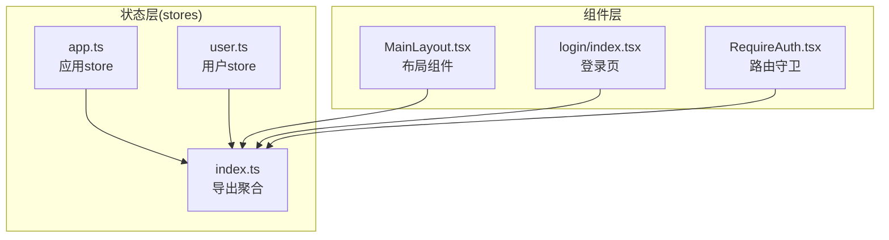
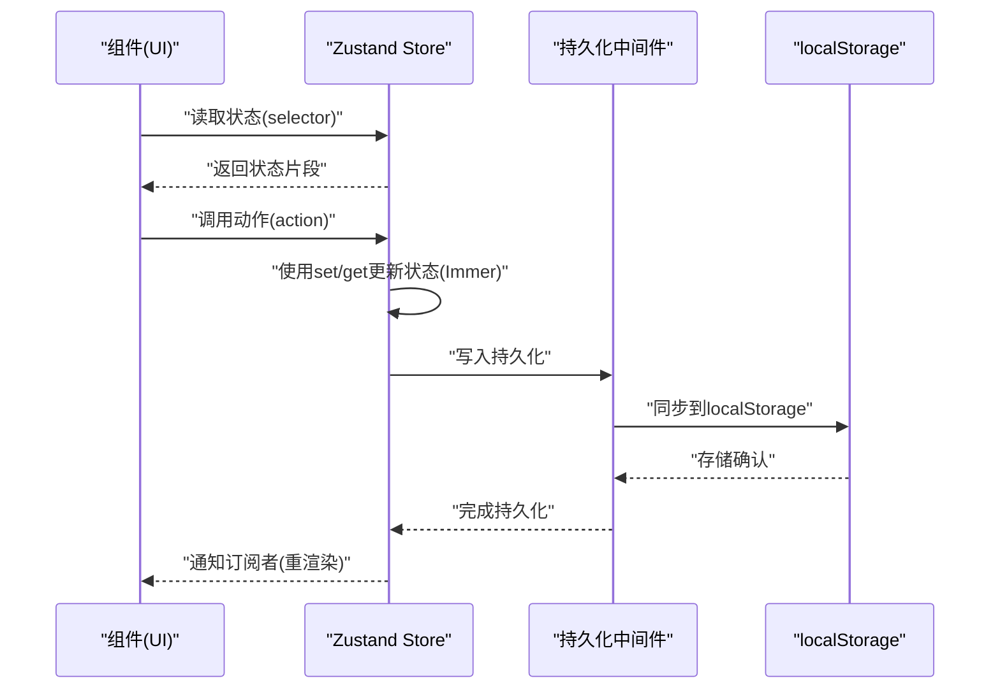
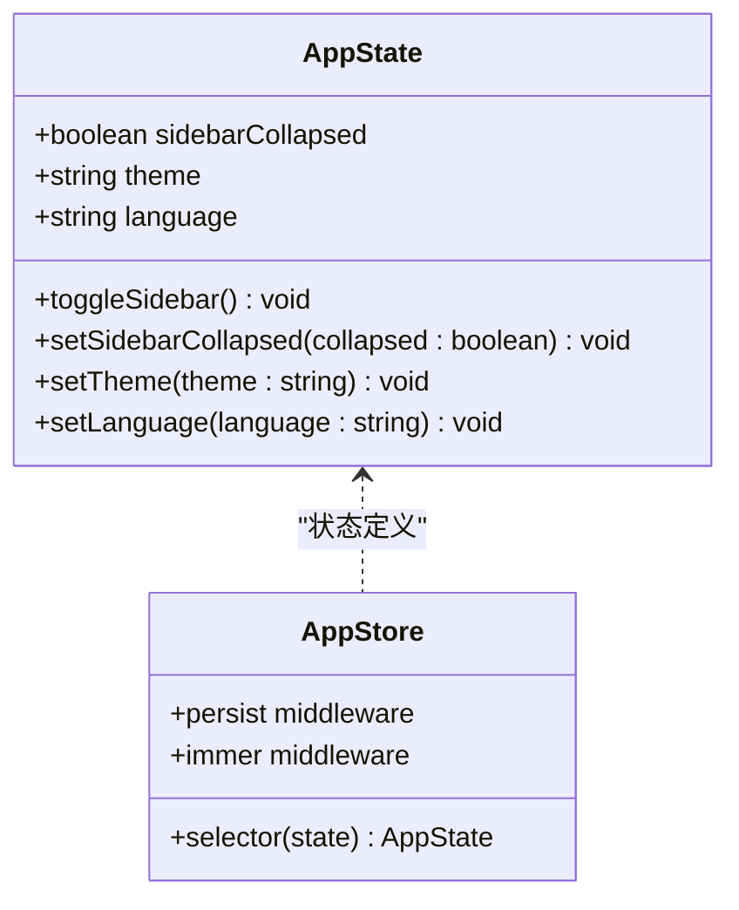
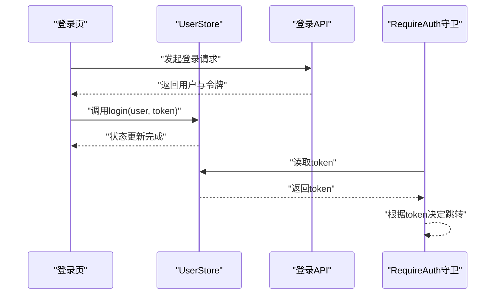
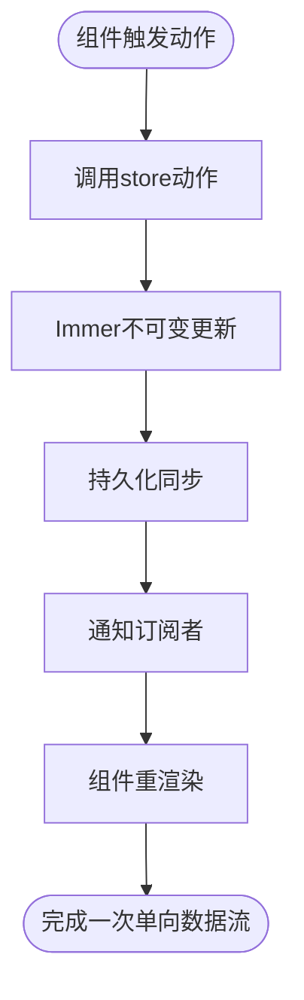
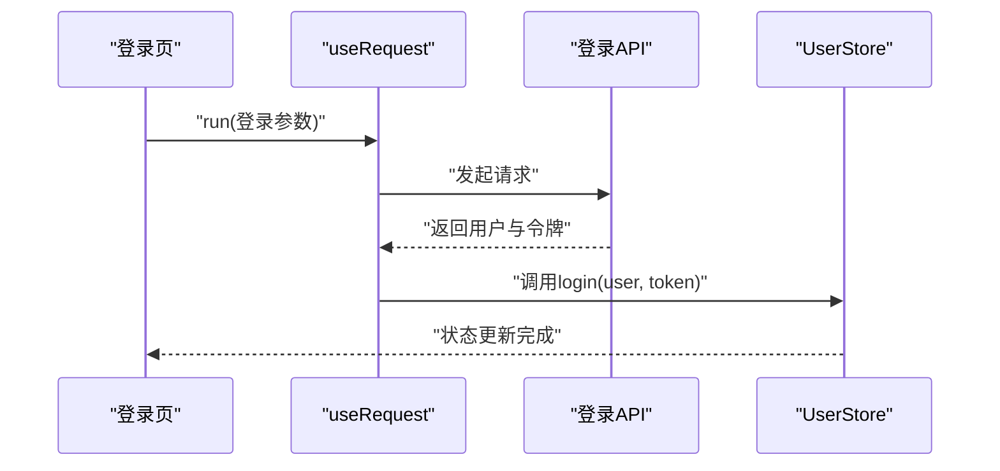
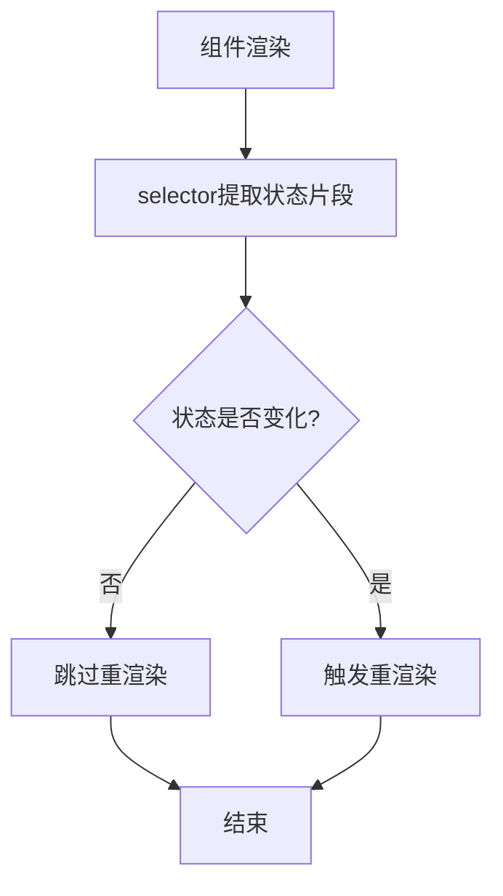
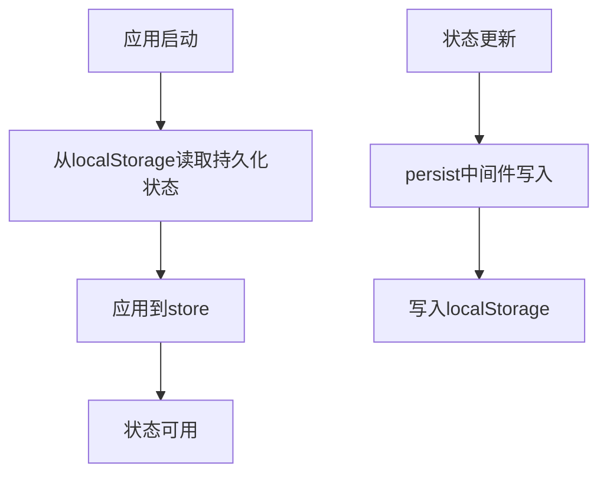
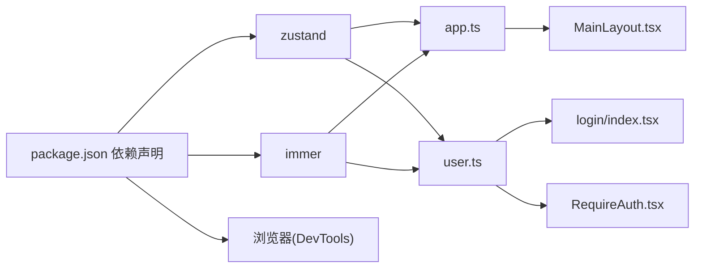

# 状态管理数据流

<cite>
**本文引用的文件**
- [src/stores/index.ts](file://src/stores/index.ts)
- [src/stores/app.ts](file://src/stores/app.ts)
- [src/stores/user.ts](file://src/stores/user.ts)
- [src/layouts/MainLayout.tsx](file://src/layouts/MainLayout.tsx)
- [src/pages/login/index.tsx](file://src/pages/login/index.tsx)
- [src/router/guards/RequireAuth.tsx](file://src/router/guards/RequireAuth.tsx)
- [.ai/core/architecture.md](file://.ai/core/architecture.md)
- [package.json](file://package.json)
</cite>

## 目录

1. [引言](#引言)
2. [项目结构](#项目结构)
3. [核心组件](#核心组件)
4. [架构总览](#架构总览)
5. [详细组件分析](#详细组件分析)
6. [依赖分析](#依赖分析)
7. [性能考虑](#性能考虑)
8. [故障排查指南](#故障排查指南)
9. [结论](#结论)
10. [附录](#附录)

## 引言

本文件围绕AI管理平台的状态管理数据流进行系统化梳理，重点基于Zustand实现的store创建、状态更新与订阅机制，阐述单向数据流原则、持久化策略、异步更新处理、状态选择器优化以及调试方法。文档以仓库中已有的store与组件使用为依据，提供可操作的最佳实践与可视化说明。

## 项目结构

状态管理位于src/stores目录，采用按域划分的store文件组织方式，统一在index.ts导出，便于组件按需引入。当前包含应用全局配置store与用户会话store两部分，分别覆盖主题、语言、侧边栏折叠状态与用户信息、令牌、权限等。

**图示来源**

- [src/stores/app.ts](file://src/stores/app.ts#L1-L59)
- [src/stores/user.ts](file://src/stores/user.ts#L1-L76)
- [src/stores/index.ts](file://src/stores/index.ts#L1-L3)
- [src/layouts/MainLayout.tsx](file://src/layouts/MainLayout.tsx#L14-L24)
- [src/pages/login/index.tsx](file://src/pages/login/index.tsx#L6-L43)
- [src/router/guards/RequireAuth.tsx](file://src/router/guards/RequireAuth.tsx#L4-L22)

**章节来源**

- [src/stores/index.ts](file://src/stores/index.ts#L1-L3)
- [.ai/core/architecture.md](file://.ai/core/architecture.md#L66-L75)

## 核心组件

- 应用store(app.ts)
  - 状态：侧边栏折叠、主题、语言
  - 动作：切换侧边栏、设置折叠、设置主题、设置语言
  - 特性：持久化到localStorage，仅保存必要字段
- 用户store(user.ts)
  - 状态：用户信息、令牌、权限集合
  - 动作：设置用户、设置令牌、设置权限、登录、登出、权限校验
  - 特性：持久化令牌与用户信息；登出时清理本地令牌

上述store均使用Zustand v5与persist、immer中间件，确保不可变更新与持久化能力。

**章节来源**

- [src/stores/app.ts](file://src/stores/app.ts#L5-L16)
- [src/stores/app.ts](file://src/stores/app.ts#L18-L58)
- [src/stores/user.ts](file://src/stores/user.ts#L6-L19)
- [src/stores/user.ts](file://src/stores/user.ts#L21-L75)

## 架构总览

Zustand在本项目中的使用遵循“单向数据流”：组件通过selector订阅所需状态片段；动作(action)通过set/get触发状态更新；immer保证不可变更新；persist负责与localStorage同步与恢复。

**图示来源**

- [src/stores/app.ts](file://src/stores/app.ts#L18-L58)
- [src/stores/user.ts](file://src/stores/user.ts#L21-L75)
- [.ai/core/architecture.md](file://.ai/core/architecture.md#L140-L181)

## 详细组件分析

### 应用store(AppStore)分析

- 状态模型
  - 侧边栏折叠状态：布尔值
  - 主题：浅色/深色枚举
  - 语言：简体中文/英文枚举
- 动作模型
  - 切换侧边栏折叠
  - 设置侧边栏折叠
  - 设置主题
  - 设置语言
- 持久化策略
  - 存储键名：应用store专属名称
  - 仅持久化必要字段，减少存储体积
- 订阅与使用
  - 组件通过解构读取状态与动作
  - 在布局组件中用于控制侧边栏与头部交互

**图示来源**

- [src/stores/app.ts](file://src/stores/app.ts#L5-L16)
- [src/stores/app.ts](file://src/stores/app.ts#L18-L58)

**章节来源**

- [src/stores/app.ts](file://src/stores/app.ts#L5-L16)
- [src/stores/app.ts](file://src/stores/app.ts#L18-L58)
- [src/layouts/MainLayout.tsx](file://src/layouts/MainLayout.tsx#L23-L24)

### 用户store(UserStore)分析

- 状态模型
  - 用户信息：用户对象或空
  - 令牌：字符串或空
  - 权限集合：字符串数组
- 动作模型
  - 设置用户信息
  - 设置令牌
  - 设置权限
  - 登录：同时设置用户与令牌
  - 登出：清空用户、令牌与权限，并移除本地令牌
  - 权限校验：基于权限数组判断
- 持久化策略
  - 存储键名：用户store专属名称
  - 仅持久化令牌与用户信息，避免敏感数据泄露
- 订阅与使用
  - 登录页通过selector获取login动作，配合异步请求后触发登录
  - 路由守卫通过selector读取token决定是否放行

**图示来源**

- [src/pages/login/index.tsx](file://src/pages/login/index.tsx#L34-L43)
- [src/stores/user.ts](file://src/stores/user.ts#L46-L51)
- [src/router/guards/RequireAuth.tsx](file://src/router/guards/RequireAuth.tsx#L15-L19)

**章节来源**

- [src/stores/user.ts](file://src/stores/user.ts#L6-L19)
- [src/stores/user.ts](file://src/stores/user.ts#L21-L75)
- [src/pages/login/index.tsx](file://src/pages/login/index.tsx#L34-L43)
- [src/router/guards/RequireAuth.tsx](file://src/router/guards/RequireAuth.tsx#L15-L19)

### 单向数据流与动作触发

- 数据流向
  - 组件通过selector订阅状态片段
  - 动作通过set/get更新状态，immer保证不可变更新
  - 状态变更触发订阅者重渲染
- 动作示例
  - 应用store：toggleSidebar/setSidebarCollapsed/setTheme/setLanguage
  - 用户store：login/logout/hasPermission
- 可预测性保障
  - 使用immer中间件，避免直接修改状态
  - 动作集中定义，便于追踪与测试

**图示来源**

- [src/stores/app.ts](file://src/stores/app.ts#L25-L47)
- [src/stores/user.ts](file://src/stores/user.ts#L28-L65)
- [.ai/core/architecture.md](file://.ai/core/architecture.md#L140-L181)

**章节来源**

- [src/stores/app.ts](file://src/stores/app.ts#L25-L47)
- [src/stores/user.ts](file://src/stores/user.ts#L28-L65)
- [.ai/core/architecture.md](file://.ai/core/architecture.md#L140-L181)

### 异步状态更新与非阻塞处理

- 实现方式
  - 登录流程：使用异步API获取用户与令牌，成功回调中调用store的login动作
  - 非阻塞：动作内部仅做状态更新，不阻塞UI线程
- 示例流程
  - 登录页通过useRequest手动触发登录请求
  - 成功后调用login(user, token)，随后导航至主页

**图示来源**

- [src/pages/login/index.tsx](file://src/pages/login/index.tsx#L36-L43)
- [src/stores/user.ts](file://src/stores/user.ts#L46-L51)

**章节来源**

- [src/pages/login/index.tsx](file://src/pages/login/index.tsx#L36-L43)

### 状态选择器优化与防抖

- 优化策略
  - 使用selector仅订阅需要的状态片段，避免无关状态变更导致的重渲染
  - 将计算逻辑放在selector外部或使用memo化工具，降低重复计算
- 实践示例
  - 路由守卫使用selector读取token
  - 布局组件使用selector读取sidebarCollapsed与toggleSidebar

**图示来源**

- [src/router/guards/RequireAuth.tsx](file://src/router/guards/RequireAuth.tsx#L15-L15)
- [src/layouts/MainLayout.tsx](file://src/layouts/MainLayout.tsx#L23-L23)

**章节来源**

- [src/router/guards/RequireAuth.tsx](file://src/router/guards/RequireAuth.tsx#L15-L15)
- [src/layouts/MainLayout.tsx](file://src/layouts/MainLayout.tsx#L23-L23)

### 状态持久化与恢复

- 实现方式
  - 使用persist中间件，配置存储键名与持久化字段
  - 应用store仅持久化主题、语言、侧边栏折叠状态
  - 用户store仅持久化令牌与用户信息
- 恢复机制
  - 应用启动时自动从localStorage恢复状态
- 安全注意
  - 用户store未持久化密码等敏感字段
  - 登出时主动移除本地令牌

**图示来源**

- [src/stores/app.ts](file://src/stores/app.ts#L49-L57)
- [src/stores/user.ts](file://src/stores/user.ts#L67-L73)
- [src/stores/user.ts](file://src/stores/user.ts#L59-L59)

**章节来源**

- [src/stores/app.ts](file://src/stores/app.ts#L49-L57)
- [src/stores/user.ts](file://src/stores/user.ts#L67-L73)
- [src/stores/user.ts](file://src/stores/user.ts#L59-L59)

### 调试与状态快照

- 调试工具
  - 可使用Redux DevTools扩展对Zustand进行调试（需安装相应中间件或适配器）
  - 通过DevTools可查看action历史、状态快照与时间旅行
- 快照建议
  - 在关键流程（如登录、权限切换）前后截图，便于问题定位
  - 结合浏览器网络面板观察异步请求与状态更新时序

[本节为通用指导，不直接分析具体文件，故无“章节来源”]

## 依赖分析

- 外部依赖
  - Zustand v5：状态管理核心
  - Immer：不可变更新中间件
  - Persist：持久化中间件
- 内部依赖
  - stores/index.ts统一导出各store，组件按需引入
  - 组件通过selector订阅状态，动作集中于store内部

**图示来源**

- [package.json](file://package.json#L20-L36)
- [src/stores/app.ts](file://src/stores/app.ts#L1-L3)
- [src/stores/user.ts](file://src/stores/user.ts#L1-L4)
- [src/layouts/MainLayout.tsx](file://src/layouts/MainLayout.tsx#L14-L14)
- [src/pages/login/index.tsx](file://src/pages/login/index.tsx#L6-L6)
- [src/router/guards/RequireAuth.tsx](file://src/router/guards/RequireAuth.tsx#L4-L4)

**章节来源**

- [package.json](file://package.json#L20-L36)
- [src/stores/index.ts](file://src/stores/index.ts#L1-L3)

## 性能考虑

- 选择器粒度
  - 仅订阅必要字段，避免大对象整体变化引发的重渲染
- 动作合并
  - 将多次状态更新合并为单次动作，减少中间态渲染
- 持久化范围
  - 仅持久化必要字段，降低localStorage写入开销
- 异步处理
  - 将耗时请求与状态更新分离，保持UI响应性

[本节为通用指导，不直接分析具体文件，故无“章节来源”]

## 故障排查指南

- 症状：页面刷新后状态丢失
  - 检查persist配置的存储键名与持久化字段是否正确
  - 确认localStorage中是否存在对应键
- 症状：组件频繁重渲染
  - 检查selector是否订阅了过大状态片段
  - 确认动作是否使用immer中间件进行不可变更新
- 症状：登录后仍提示未登录
  - 检查登录流程是否正确调用了store的login动作
  - 确认路由守卫的token读取逻辑
- 症状：登出后本地仍有令牌
  - 检查store的logout动作是否移除了localStorage中的令牌

**章节来源**

- [src/stores/app.ts](file://src/stores/app.ts#L49-L57)
- [src/stores/user.ts](file://src/stores/user.ts#L59-L59)
- [src/pages/login/index.tsx](file://src/pages/login/index.tsx#L38-L42)
- [src/router/guards/RequireAuth.tsx](file://src/router/guards/RequireAuth.tsx#L15-L19)

## 结论

本项目基于Zustand实现了清晰、可维护的状态管理方案：通过单向数据流、不可变更新与持久化中间件，确保状态的可预测性与可靠性；通过selector优化避免不必要重渲染；通过异步动作与路由守卫实现安全可控的用户会话管理。遵循架构规范与最佳实践，可在复杂业务场景中持续演进。

## 附录

- 规范参考
  - 状态管理规范（强制）：包含store模板与中间件使用要求
- 相关文件
  - stores导出入口：统一导出各store，便于组件按需引入

**章节来源**

- [.ai/core/architecture.md](file://.ai/core/architecture.md#L140-L181)
- [src/stores/index.ts](file://src/stores/index.ts#L1-L3)
