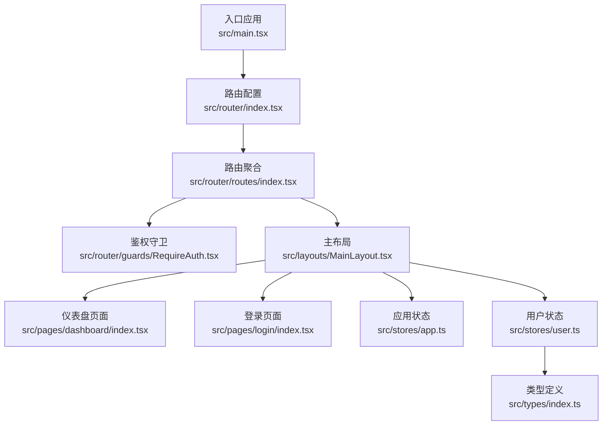
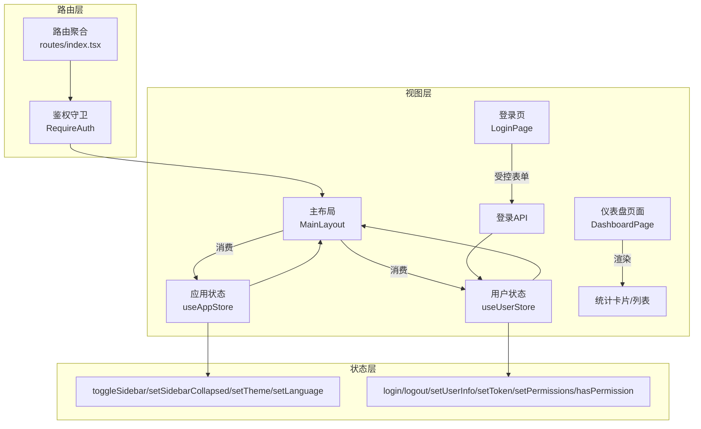
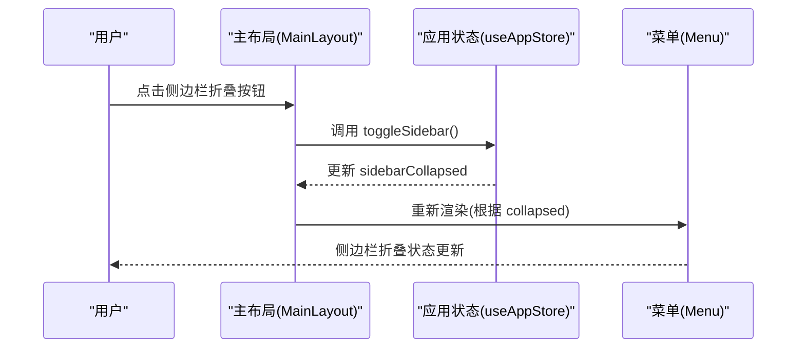
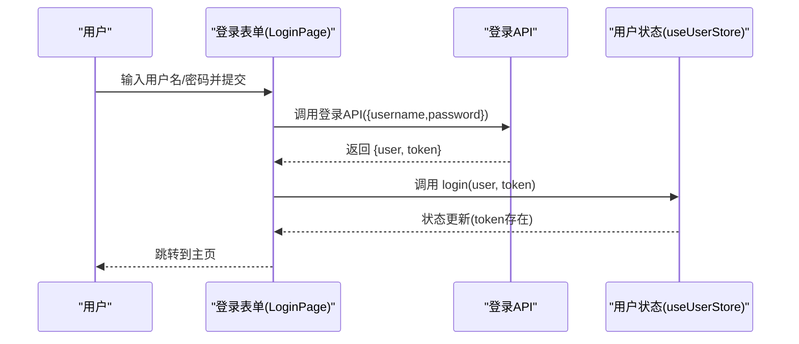
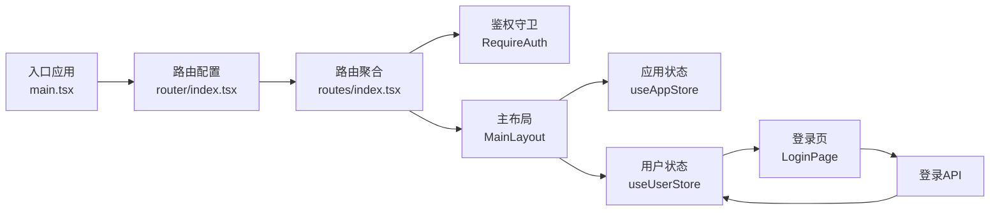

# 组件数据绑定

<cite>
**本文引用的文件**
- [src/main.tsx](file://src/main.tsx)
- [src/router/index.tsx](file://src/router/index.tsx)
- [src/router/routes/index.tsx](file://src/router/routes/index.tsx)
- [src/router/guards/RequireAuth.tsx](file://src/router/guards/RequireAuth.tsx)
- [src/layouts/MainLayout.tsx](file://src/layouts/MainLayout.tsx)
- [src/pages/dashboard/index.tsx](file://src/pages/dashboard/index.tsx)
- [src/pages/login/index.tsx](file://src/pages/login/index.tsx)
- [src/stores/app.ts](file://src/stores/app.ts)
- [src/stores/user.ts](file://src/stores/user.ts)
- [src/stores/index.ts](file://src/stores/index.ts)
- [src/types/index.ts](file://src/types/index.ts)
</cite>

## 目录

1. [引言](#引言)
2. [项目结构](#项目结构)
3. [核心组件](#核心组件)
4. [架构总览](#架构总览)
5. [详细组件分析](#详细组件分析)
6. [依赖关系分析](#依赖关系分析)
7. [性能考量](#性能考量)
8. [故障排查指南](#故障排查指南)
9. [结论](#结论)
10. [附录](#附录)

## 引言

本文件围绕AI管理平台的“组件数据绑定”主题，系统梳理从父组件到子组件的props传递、从子组件到父组件的回调通知、状态驱动的UI更新（useState/useEffect）、表单组件的受控与非受控模式、列表组件的虚拟化渲染策略、组件间通信最佳实践（Context API与事件总线思路）、安全性考虑（XSS与数据泄露防护），以及调试技巧（React DevTools与数据流追踪）。文档结合仓库实际代码进行分析，并提供可视化图示帮助理解。

## 项目结构

项目采用按功能域组织的目录结构：页面、布局、路由守卫、状态管理（Zustand）、类型定义等。数据绑定贯穿于路由层、布局层、页面层与状态层之间，形成清晰的单向数据流与事件回传链路。

图表来源

- [src/main.tsx](file://src/main.tsx#L17-L31)
- [src/router/index.tsx](file://src/router/index.tsx#L1-L9)
- [src/router/routes/index.tsx](file://src/router/routes/index.tsx#L9-L28)
- [src/router/guards/RequireAuth.tsx](file://src/router/guards/RequireAuth.tsx#L11-L22)
- [src/layouts/MainLayout.tsx](file://src/layouts/MainLayout.tsx#L18-L25)
- [src/pages/dashboard/index.tsx](file://src/pages/dashboard/index.tsx#L12-L167)
- [src/pages/login/index.tsx](file://src/pages/login/index.tsx#L32-L50)
- [src/stores/app.ts](file://src/stores/app.ts#L18-L58)
- [src/stores/user.ts](file://src/stores/user.ts#L21-L75)
- [src/types/index.ts](file://src/types/index.ts#L17-L28)

章节来源

- [src/main.tsx](file://src/main.tsx#L17-L31)
- [src/router/index.tsx](file://src/router/index.tsx#L1-L9)
- [src/router/routes/index.tsx](file://src/router/routes/index.tsx#L9-L28)

## 核心组件

- 应用状态（Zustand）
  - 应用状态：包含侧边栏折叠、主题、语言等状态与对应的动作，通过持久化中间件保存至本地存储。
  - 用户状态：包含用户信息、token、权限集合与登录、登出、权限判断等动作。
- 页面与布局
  - 主布局：整合侧边栏、头部、内容区，消费应用状态与用户状态，提供用户菜单与侧边栏切换交互。
  - 仪表盘：静态数据驱动的统计卡片与活动列表，演示props传递与列表渲染。
  - 登录页：基于受控表单（Ant Design Form）提交，调用用户状态的登录动作，完成后跳转。
- 路由与鉴权
  - 路由聚合：统一挂载主布局与子路由；鉴权守卫通过读取用户状态token决定是否放行。

章节来源

- [src/stores/app.ts](file://src/stores/app.ts#L5-L16)
- [src/stores/user.ts](file://src/stores/user.ts#L6-L19)
- [src/layouts/MainLayout.tsx](file://src/layouts/MainLayout.tsx#L23-L24)
- [src/pages/dashboard/index.tsx](file://src/pages/dashboard/index.tsx#L14-L79)
- [src/pages/login/index.tsx](file://src/pages/login/index.tsx#L34-L43)
- [src/router/guards/RequireAuth.tsx](file://src/router/guards/RequireAuth.tsx#L15-L15)

## 架构总览

下图展示了数据在应用中的流动方向：外部请求或用户交互触发状态变更，状态变化驱动UI更新；同时，UI交互通过回调向上游传递，最终回到状态层，形成闭环。

图表来源

- [src/layouts/MainLayout.tsx](file://src/layouts/MainLayout.tsx#L23-L24)
- [src/stores/app.ts](file://src/stores/app.ts#L25-L47)
- [src/stores/user.ts](file://src/stores/user.ts#L46-L65)
- [src/router/routes/index.tsx](file://src/router/routes/index.tsx#L11-L17)
- [src/router/guards/RequireAuth.tsx](file://src/router/guards/RequireAuth.tsx#L15-L15)
- [src/pages/login/index.tsx](file://src/pages/login/index.tsx#L34-L43)

## 详细组件分析

### 父组件到子组件的props传递与子组件到父组件的回调通知

- 主布局消费应用状态与用户状态，向下传递给子组件（如菜单、头像、通知徽标等），并通过回调（如侧边栏折叠切换、用户菜单点击）更新状态。
- 仪表盘页面通过props形式接收静态数据（统计数据、活动列表、项目进度），并以列表渲染方式展示。
- 登录页通过受控表单收集用户输入，提交后调用用户状态的登录动作，完成登录流程。

图表来源

- [src/layouts/MainLayout.tsx](file://src/layouts/MainLayout.tsx#L119-L125)
- [src/stores/app.ts](file://src/stores/app.ts#L25-L29)

章节来源

- [src/layouts/MainLayout.tsx](file://src/layouts/MainLayout.tsx#L73-L104)
- [src/pages/dashboard/index.tsx](file://src/pages/dashboard/index.tsx#L84-L161)
- [src/pages/login/index.tsx](file://src/pages/login/index.tsx#L45-L50)

### 状态驱动的UI更新机制（useState/useEffect）

- 当前代码未直接使用React内置的useState/useEffect，而是采用Zustand作为全局状态管理。Zustand通过订阅机制实现状态变化驱动UI更新，具备更清晰的状态边界与持久化能力。
- 在需要局部状态或副作用场景时，可在具体组件内结合useState/useEffect使用，但需注意避免与Zustand产生重复状态。

章节来源

- [src/stores/app.ts](file://src/stores/app.ts#L1-L59)
- [src/stores/user.ts](file://src/stores/user.ts#L1-L76)

### 表单组件的数据绑定模式（受控与非受控）

- 受控组件：登录页使用Ant Design Form组件，通过Form.Item的name属性与onFinish回调实现双向绑定，提交时将表单值传入登录API，成功后调用用户状态的登录动作。该模式适合需要集中校验、联动与提交的场景。
- 非受控组件：当前仓库未见典型非受控组件实现；若需使用，可通过ref获取DOM值，但不建议与Zustand混用，以免造成状态分散。

图表来源

- [src/pages/login/index.tsx](file://src/pages/login/index.tsx#L34-L50)
- [src/stores/user.ts](file://src/stores/user.ts#L46-L51)

章节来源

- [src/pages/login/index.tsx](file://src/pages/login/index.tsx#L72-L120)

### 列表组件的虚拟化渲染与大数据量优化

- 当前仪表盘页面使用Ant Design List与静态数据进行渲染，未引入虚拟化方案。
- 针对大数据量列表，建议采用虚拟化（如react-window或react-virtualized）以降低DOM节点数量，提升滚动性能。实现要点：
  - 将数据源抽象为可索引的数据池
  - 计算可视区域起止索引
  - 仅渲染可视区域内的元素
  - 使用固定高度或测量高度策略
- 与Zustand结合时，确保数据更新不会导致整个列表重渲染，可通过稳定key与浅比较优化。

章节来源

- [src/pages/dashboard/index.tsx](file://src/pages/dashboard/index.tsx#L118-L131)

### 组件间通信最佳实践（Context API与事件总线思路）

- Zustand已承担跨组件状态共享职责，无需额外引入Context API，可减少上下文层级与渲染开销。
- 若确需事件总线模式，可在工具层封装轻量事件发布/订阅，避免在UI层直接耦合。注意：
  - 事件命名规范与作用域隔离
  - 清理订阅，防止内存泄漏
  - 与Zustand状态同步，避免状态漂移

章节来源

- [src/stores/index.ts](file://src/stores/index.ts#L1-L3)

### 数据绑定的安全性考虑（XSS与数据泄露）

- XSS防护
  - 不直接使用dangerouslySetInnerHTML或动态拼接HTML
  - 对用户输入与后端返回内容进行白名单过滤或使用安全的富文本组件
  - 使用Content-Security-Policy限制脚本执行
- 数据泄露
  - 敏感字段（如token）仅存于状态与本地存储，避免在日志与URL中暴露
  - 使用持久化中间件时，仅持久化必要字段，避免持久化敏感信息
  - 登出时清理token与用户信息

章节来源

- [src/stores/user.ts](file://src/stores/user.ts#L53-L60)
- [src/stores/app.ts](file://src/stores/app.ts#L49-L57)

### 调试技巧（React DevTools与数据流追踪）

- React DevTools
  - 使用Profiler分析渲染次数与耗时，定位过度渲染组件
  - 使用组件树查看props与state，确认数据流向是否符合预期
- 数据流追踪
  - 在Zustand中打印action与状态变化，确认状态更新路径
  - 在路由守卫中打印token状态，验证鉴权逻辑
  - 在表单提交前后打印表单值与返回结果，定位数据绑定问题

章节来源

- [src/router/guards/RequireAuth.tsx](file://src/router/guards/RequireAuth.tsx#L15-L15)
- [src/pages/login/index.tsx](file://src/pages/login/index.tsx#L36-L43)

## 依赖关系分析

- 入口应用通过ConfigProvider统一主题与语言，RouterProvider承载路由体系。
- 路由聚合将主布局与子路由组合，鉴权守卫基于用户状态token控制访问。
- 主布局消费应用与用户状态，向子组件传递状态与回调。
- 页面层通过静态数据或受控表单与状态层交互。

图表来源

- [src/main.tsx](file://src/main.tsx#L17-L31)
- [src/router/index.tsx](file://src/router/index.tsx#L1-L9)
- [src/router/routes/index.tsx](file://src/router/routes/index.tsx#L11-L17)
- [src/router/guards/RequireAuth.tsx](file://src/router/guards/RequireAuth.tsx#L15-L15)
- [src/layouts/MainLayout.tsx](file://src/layouts/MainLayout.tsx#L23-L24)
- [src/pages/login/index.tsx](file://src/pages/login/index.tsx#L34-L43)

章节来源

- [src/main.tsx](file://src/main.tsx#L17-L31)
- [src/router/index.tsx](file://src/router/index.tsx#L1-L9)
- [src/router/routes/index.tsx](file://src/router/routes/index.tsx#L9-L28)

## 性能考量

- 状态粒度
  - 将大对象拆分为细粒度状态，避免无关状态变化引发的UI重渲染
- 渲染优化
  - 列表渲染使用唯一key，减少不必要的diff
  - 对频繁更新的UI使用memo化（如React.memo、useMemo、useCallback）
- 网络与异步
  - 合理使用并发请求与缓存策略，避免重复请求
  - 在登录页等关键流程中，使用加载态与防抖，提升用户体验

## 故障排查指南

- 登录失败
  - 检查登录API返回结构与用户状态login动作调用
  - 确认token写入与鉴权守卫逻辑
- 侧边栏状态异常
  - 检查应用状态toggleSidebar与useAppStore的调用
  - 确认主布局中onClick与collapsed props绑定
- 鉴权失效
  - 在鉴权守卫中打印token状态，确认token是否持久化
  - 检查登出流程是否清理token

章节来源

- [src/pages/login/index.tsx](file://src/pages/login/index.tsx#L34-L50)
- [src/stores/user.ts](file://src/stores/user.ts#L53-L60)
- [src/layouts/MainLayout.tsx](file://src/layouts/MainLayout.tsx#L119-L125)
- [src/router/guards/RequireAuth.tsx](file://src/router/guards/RequireAuth.tsx#L15-L15)

## 结论

本项目通过Zustand实现了清晰的全局状态管理，配合受控表单与静态数据驱动的页面渲染，形成了稳定的组件数据绑定机制。建议在后续迭代中引入列表虚拟化、进一步细化状态粒度与渲染优化，并强化安全与调试手段，以支撑更大规模的业务场景。

## 附录

- 类型定义
  - 用户类型、分页类型、表格列配置、表单字段配置等，为数据绑定提供类型保障。
- 路由与守卫
  - 路由聚合与鉴权守卫确保访问控制与状态一致性。

章节来源

- [src/types/index.ts](file://src/types/index.ts#L17-L28)
- [src/router/routes/index.tsx](file://src/router/routes/index.tsx#L9-L28)
