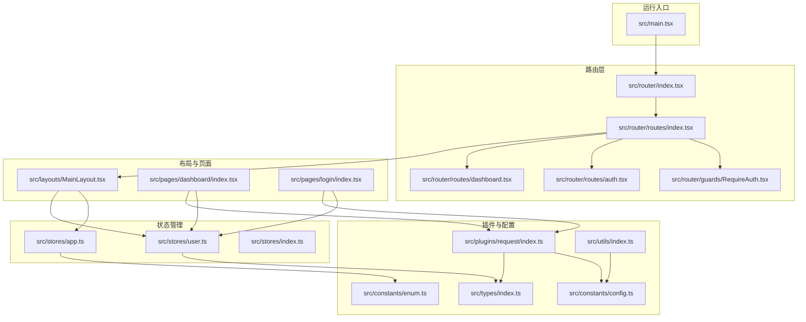
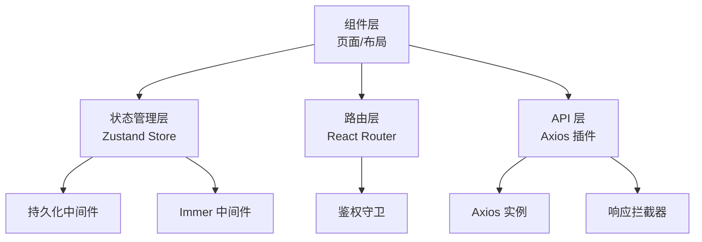
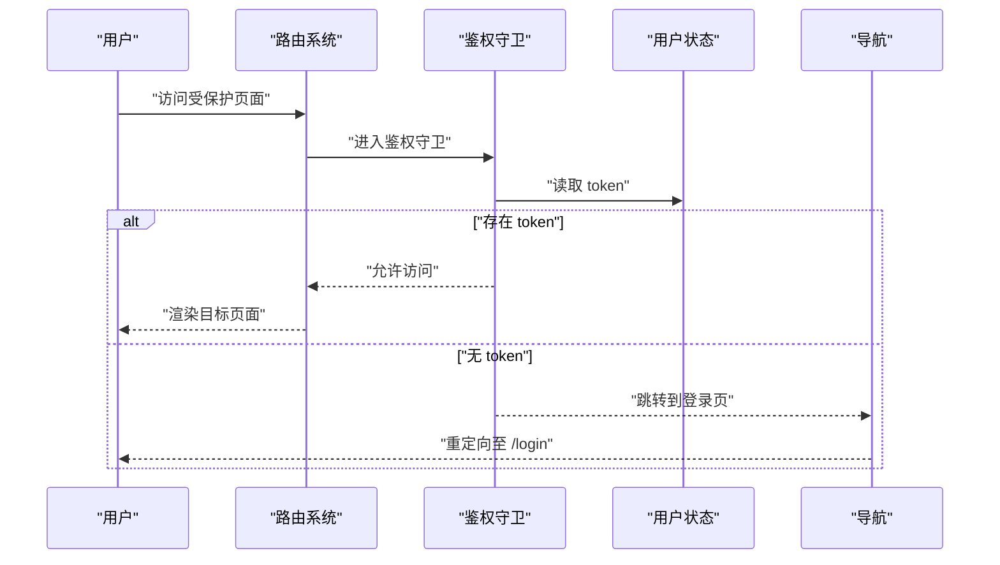
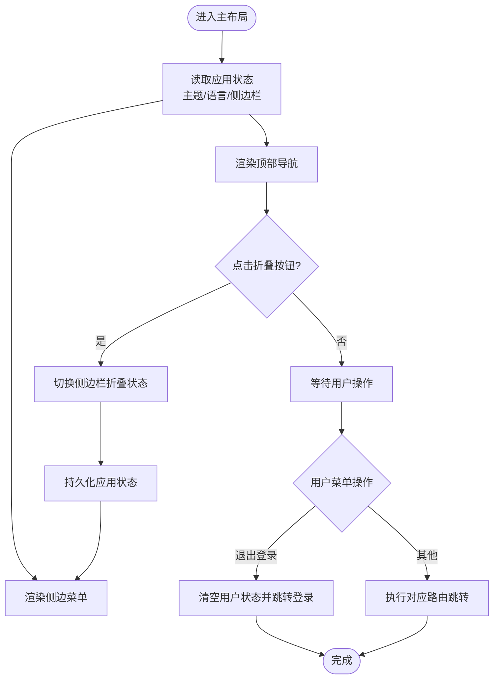
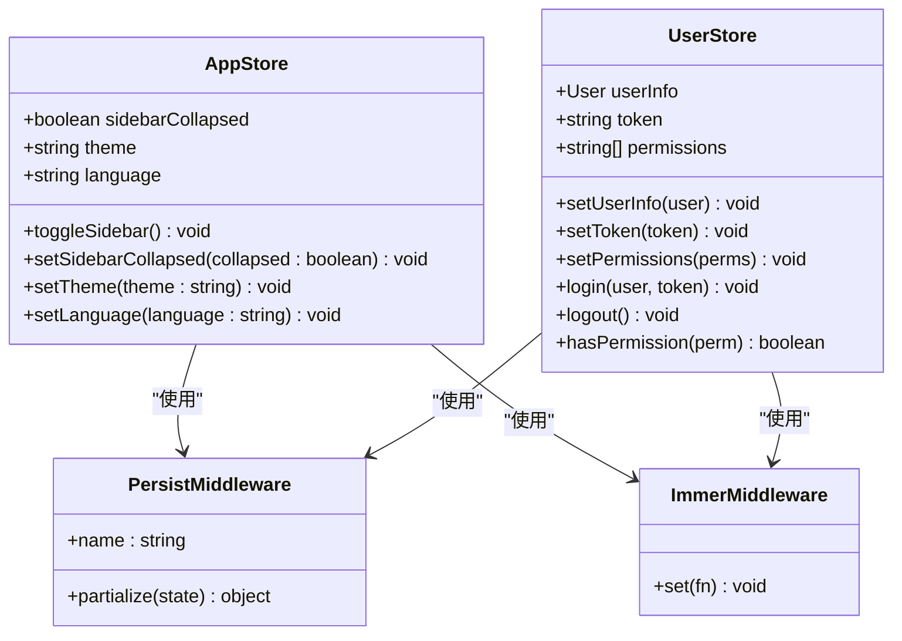
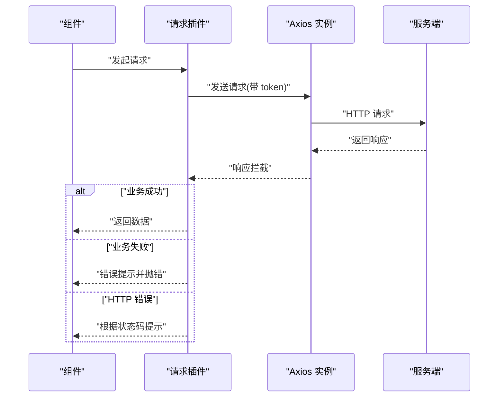
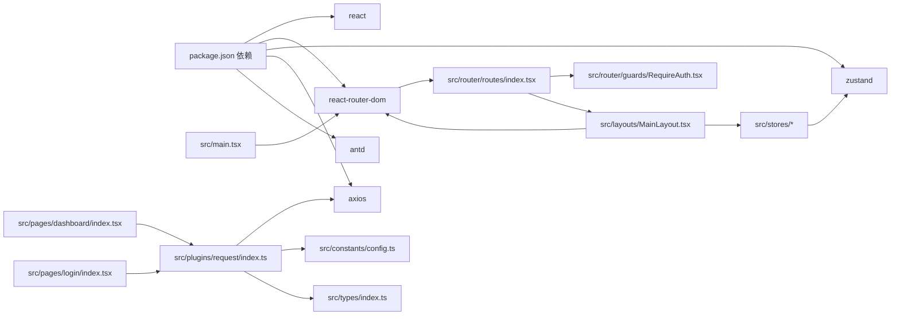

# 架构设计

<cite>
**本文引用的文件**
- [package.json](file://package.json)
- [main.tsx](file://src/main.tsx)
- [router/index.tsx](file://src/router/index.tsx)
- [router/routes/index.tsx](file://src/router/routes/index.tsx)
- [router/guards/RequireAuth.tsx](file://src/router/guards/RequireAuth.tsx)
- [router/routes/auth.tsx](file://src/router/routes/auth.tsx)
- [router/routes/dashboard.tsx](file://src/router/routes/dashboard.tsx)
- [layouts/MainLayout.tsx](file://src/layouts/MainLayout.tsx)
- [stores/app.ts](file://src/stores/app.ts)
- [stores/user.ts](file://src/stores/user.ts)
- [stores/index.ts](file://src/stores/index.ts)
- [plugins/request/index.ts](file://src/plugins/request/index.ts)
- [constants/config.ts](file://src/constants/config.ts)
- [constants/enum.ts](file://src/constants/enum.ts)
- [types/index.ts](file://src/types/index.ts)
- [utils/index.ts](file://src/utils/index.ts)
</cite>

## 目录

1. [引言](#引言)
2. [项目结构](#项目结构)
3. [核心组件](#核心组件)
4. [架构总览](#架构总览)
5. [详细组件分析](#详细组件分析)
6. [依赖分析](#依赖分析)
7. [性能考量](#性能考量)
8. [故障排查指南](#故障排查指南)
9. [结论](#结论)
10. [附录](#附录)

## 引言

本项目采用配置驱动与组件化相结合的前端架构，围绕“API 层-组件层-状态管理层-路由层”的分层职责进行组织。通过 React Router 实现声明式路由与鉴权守卫，使用 Zustand 提供轻量级状态管理，并以 Axios 插件封装统一请求与错误处理。整体架构强调可维护性、可扩展性与开发体验，适合中大型后台管理类应用。

## 项目结构

项目采用按功能域划分的目录组织方式，主要模块如下：

- API 层：通过插件化请求封装统一调用入口
- 组件层：页面与布局组件，复用 UI 库与自定义组件
- 状态管理层：基于 Zustand 的应用状态与用户状态
- 路由层：集中式路由配置与鉴权守卫
- 常量与工具：配置常量、类型定义、通用工具函数
- 构建与脚手架：基于 Rsbuild 的构建配置与 AI 配置驱动体系

**图表来源**

- [main.tsx](file://src/main.tsx#L1-L32)
- [router/index.tsx](file://src/router/index.tsx#L1-L9)
- [router/routes/index.tsx](file://src/router/routes/index.tsx#L1-L31)
- [router/guards/RequireAuth.tsx](file://src/router/guards/RequireAuth.tsx#L1-L25)
- [router/routes/auth.tsx](file://src/router/routes/auth.tsx#L1-L15)
- [router/routes/dashboard.tsx](file://src/router/routes/dashboard.tsx#L1-L17)
- [layouts/MainLayout.tsx](file://src/layouts/MainLayout.tsx#L1-L174)
- [stores/app.ts](file://src/stores/app.ts#L1-L59)
- [stores/user.ts](file://src/stores/user.ts#L1-L76)
- [plugins/request/index.ts](file://src/plugins/request/index.ts#L1-L114)
- [constants/config.ts](file://src/constants/config.ts#L1-L76)
- [constants/enum.ts](file://src/constants/enum.ts#L1-L70)
- [types/index.ts](file://src/types/index.ts#L1-L101)
- [utils/index.ts](file://src/utils/index.ts#L1-L106)

**章节来源**

- [package.json](file://package.json#L1-L81)
- [main.tsx](file://src/main.tsx#L1-L32)
- [router/index.tsx](file://src/router/index.tsx#L1-L9)
- [router/routes/index.tsx](file://src/router/routes/index.tsx#L1-L31)

## 核心组件

- 路由与导航
  - 路由入口与配置：集中导出路由对象，便于在入口文件注入
  - 路由模块化：按功能拆分认证、仪表盘、错误页等路由集合
  - 鉴权守卫：基于用户 token 控制访问，未登录自动跳转登录页
- 布局与页面
  - 主布局：提供顶部导航、侧边菜单、内容区与用户下拉菜单
  - 页面组件：仪表盘与登录页懒加载，减少首屏体积
- 状态管理
  - 应用状态：主题、语言、侧边栏折叠等
  - 用户状态：用户信息、token、权限与登录登出流程
- 请求插件
  - Axios 实例：统一封装请求头、超时、重试策略
  - 响应拦截：统一业务错误处理与异常提示
  - 方法封装：GET/POST/PUT/DELETE/PATCH 等常用方法
- 配置与类型
  - 应用配置：分页、默认语言、主题、正则与日期格式
  - 类型定义：分页、用户、表格列、表单字段、API 响应等
  - 枚举：用户状态、HTTP 状态码、存储键名等

**章节来源**

- [router/index.tsx](file://src/router/index.tsx#L1-L9)
- [router/routes/index.tsx](file://src/router/routes/index.tsx#L1-L31)
- [router/guards/RequireAuth.tsx](file://src/router/guards/RequireAuth.tsx#L1-L25)
- [layouts/MainLayout.tsx](file://src/layouts/MainLayout.tsx#L1-L174)
- [stores/app.ts](file://src/stores/app.ts#L1-L59)
- [stores/user.ts](file://src/stores/user.ts#L1-L76)
- [plugins/request/index.ts](file://src/plugins/request/index.ts#L1-L114)
- [constants/config.ts](file://src/constants/config.ts#L1-L76)
- [types/index.ts](file://src/types/index.ts#L1-L101)
- [constants/enum.ts](file://src/constants/enum.ts#L1-L70)

## 架构总览

系统采用“配置驱动 + 组件化 + 状态管理 + 路由控制”的分层架构：

- API 层：通过插件化请求封装统一调用，集中处理鉴权与错误
- 组件层：页面与布局组件，复用 UI 库与自定义组件
- 状态管理层：Zustand 提供轻量状态，支持持久化与 Immer 不可变更新
- 路由层：React Router v6 管理导航与鉴权，支持懒加载与嵌套路由

**图表来源**

- [main.tsx](file://src/main.tsx#L1-L32)
- [router/index.tsx](file://src/router/index.tsx#L1-L9)
- [router/guards/RequireAuth.tsx](file://src/router/guards/RequireAuth.tsx#L1-L25)
- [layouts/MainLayout.tsx](file://src/layouts/MainLayout.tsx#L1-L174)
- [stores/app.ts](file://src/stores/app.ts#L1-L59)
- [stores/user.ts](file://src/stores/user.ts#L1-L76)
- [plugins/request/index.ts](file://src/plugins/request/index.ts#L1-L114)

## 详细组件分析

### 路由与鉴权

- 路由策略
  - 使用集中式路由配置，主路由包裹鉴权守卫，确保受保护页面的安全访问
  - 子路由模块化拆分，便于扩展与维护
- 鉴权机制
  - 通过用户状态中的 token 决定是否放行
  - 未登录自动跳转至登录页，避免直接访问受保护资源

**图表来源**

- [router/routes/index.tsx](file://src/router/routes/index.tsx#L1-L31)
- [router/guards/RequireAuth.tsx](file://src/router/guards/RequireAuth.tsx#L1-L25)
- [stores/user.ts](file://src/stores/user.ts#L1-L76)

**章节来源**

- [router/routes/index.tsx](file://src/router/routes/index.tsx#L1-L31)
- [router/guards/RequireAuth.tsx](file://src/router/guards/RequireAuth.tsx#L1-L25)

### 布局与导航

- 主布局职责
  - 提供顶部导航栏、侧边菜单、内容区与用户下拉菜单
  - 支持切换侧边栏折叠、主题与语言
  - 退出登录后跳转至登录页
- 交互流程
  - 顶部按钮触发侧边栏折叠切换
  - 用户菜单项触发路由跳转或登出操作

**图表来源**

- [layouts/MainLayout.tsx](file://src/layouts/MainLayout.tsx#L1-L174)
- [stores/app.ts](file://src/stores/app.ts#L1-L59)
- [stores/user.ts](file://src/stores/user.ts#L1-L76)

**章节来源**

- [layouts/MainLayout.tsx](file://src/layouts/MainLayout.tsx#L1-L174)

### 状态管理（Zustand）

- 设计原则
  - 轻量化：仅在需要时引入，避免过度工程化
  - 可组合：应用状态与用户状态分离，职责清晰
  - 可持久化：结合持久化中间件，提升用户体验
  - 不可变更新：使用 Immer 中间件简化状态更新
- 关键点
  - 应用状态：主题、语言、侧边栏折叠
  - 用户状态：用户信息、token、权限与登录登出
  - 权限校验：支持通配符权限快速判断

**图表来源**

- [stores/app.ts](file://src/stores/app.ts#L1-L59)
- [stores/user.ts](file://src/stores/user.ts#L1-L76)

**章节来源**

- [stores/app.ts](file://src/stores/app.ts#L1-L59)
- [stores/user.ts](file://src/stores/user.ts#L1-L76)
- [stores/index.ts](file://src/stores/index.ts#L1-L3)

### 请求插件（Axios）

- 统一配置
  - 超时、请求头、基础配置集中管理
  - 请求拦截：自动附加 Authorization 头
  - 响应拦截：统一业务错误处理与提示
- 错误处理
  - 401 自动清除 token 并跳转登录
  - 403/404/500 等错误提示
  - 网络异常兜底提示

**图表来源**

- [plugins/request/index.ts](file://src/plugins/request/index.ts#L1-L114)
- [constants/config.ts](file://src/constants/config.ts#L1-L76)
- [types/index.ts](file://src/types/index.ts#L1-L101)

**章节来源**

- [plugins/request/index.ts](file://src/plugins/request/index.ts#L1-L114)
- [constants/config.ts](file://src/constants/config.ts#L1-L76)
- [types/index.ts](file://src/types/index.ts#L1-L101)

### 配置与类型

- 配置常量
  - 应用配置：名称、版本、分页、默认语言与主题、Token 过期时间
  - 路由配置：登录页路径、首页路径、白名单
  - 请求配置：超时、重试次数与延迟
  - 正则与日期格式：手机号、邮箱、密码、URL、身份证与多种日期格式
- 类型定义
  - 分页数据与查询参数
  - 用户模型与路由元信息
  - 表格列与表单字段配置
  - API 响应与错误结构
- 枚举
  - 用户状态、订单状态、性别、主题模式、语言、HTTP 状态码、存储键名

**章节来源**

- [constants/config.ts](file://src/constants/config.ts#L1-L76)
- [types/index.ts](file://src/types/index.ts#L1-L101)
- [constants/enum.ts](file://src/constants/enum.ts#L1-L70)

## 依赖分析

- 技术栈与版本
  - React 18、React Router DOM 6、Ant Design 5、Zustand 5、Axios
- 构建与开发
  - Rsbuild 构建、TypeScript 类型检查、ESLint/Prettier 规范
- 依赖关系
  - 入口文件依赖路由；路由依赖守卫与布局；布局依赖状态；页面依赖请求插件与状态；插件依赖配置与类型

**图表来源**

- [package.json](file://package.json#L1-L81)
- [main.tsx](file://src/main.tsx#L1-L32)
- [router/routes/index.tsx](file://src/router/routes/index.tsx#L1-L31)
- [router/guards/RequireAuth.tsx](file://src/router/guards/RequireAuth.tsx#L1-L25)
- [layouts/MainLayout.tsx](file://src/layouts/MainLayout.tsx#L1-L174)
- [stores/app.ts](file://src/stores/app.ts#L1-L59)
- [stores/user.ts](file://src/stores/user.ts#L1-L76)
- [plugins/request/index.ts](file://src/plugins/request/index.ts#L1-L114)
- [constants/config.ts](file://src/constants/config.ts#L1-L76)
- [types/index.ts](file://src/types/index.ts#L1-L101)

**章节来源**

- [package.json](file://package.json#L1-L81)

## 性能考量

- 路由与组件
  - 使用懒加载与动态导入，降低首屏包体
  - 嵌套路由与 KeepAlive 可选配置，按需启用
- 状态管理
  - Zustand 无样板代码，减少不必要的渲染
  - 持久化仅保存必要字段，避免存储膨胀
- 请求层
  - 统一超时与错误处理，减少重复逻辑
  - 合理的重试策略与网络异常兜底
- 工具函数
  - 防抖与节流用于高频事件优化
  - 格式化工具减少重复计算

[本节为通用指导，不直接分析具体文件，故无“章节来源”]

## 故障排查指南

- 登录态失效
  - 现象：401 提示并跳转登录
  - 排查：确认本地 token 是否存在与过期；检查后端签发与刷新策略
- 权限不足
  - 现象：403 提示
  - 排查：确认用户权限列表与路由权限配置
- 网络异常
  - 现象：网络连接失败提示
  - 排查：检查网络连通性与代理设置；查看请求拦截器日志
- 状态不同步
  - 现象：界面未更新或状态丢失
  - 排查：确认状态订阅与持久化配置；检查 Immer 更新写法

**章节来源**

- [plugins/request/index.ts](file://src/plugins/request/index.ts#L1-L114)
- [stores/user.ts](file://src/stores/user.ts#L1-L76)

## 结论

该架构以配置驱动为核心，结合组件化与状态管理，形成清晰的分层职责与稳定的交互模式。Zustand 的轻量与易用性满足中小型项目的复杂度需求；React Router 的声明式路由与守卫保障了导航安全；Axios 插件统一了请求与错误处理。整体设计兼顾可维护性与扩展性，适合持续演进的后台管理平台。

[本节为总结性内容，不直接分析具体文件，故无“章节来源”]

## 附录

- 技术选型说明
  - Zustand vs Redux：Zustand 更贴近直觉的状态更新方式，减少样板代码与心智负担；Redux 更适合超大应用的强约束场景
  - React Router：v6 的 v5 语法迁移成本低，支持懒加载与嵌套路由，满足当前规模需求
- 最佳实践
  - 将配置集中于 constants，类型集中于 types，便于统一维护
  - 在布局中聚合通用 UI 与状态，页面专注业务逻辑
  - 对高频状态与请求结果进行缓存与节流处理

[本节为概念性内容，不直接分析具体文件，故无“章节来源”]
