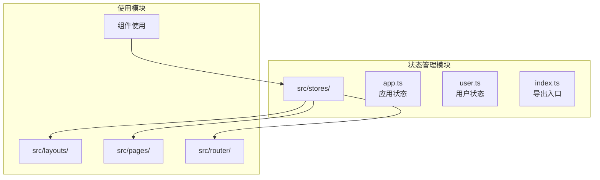
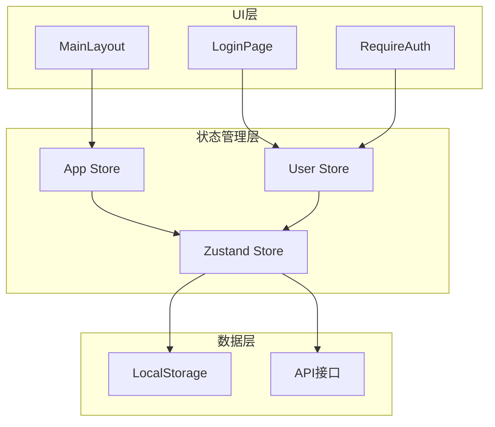
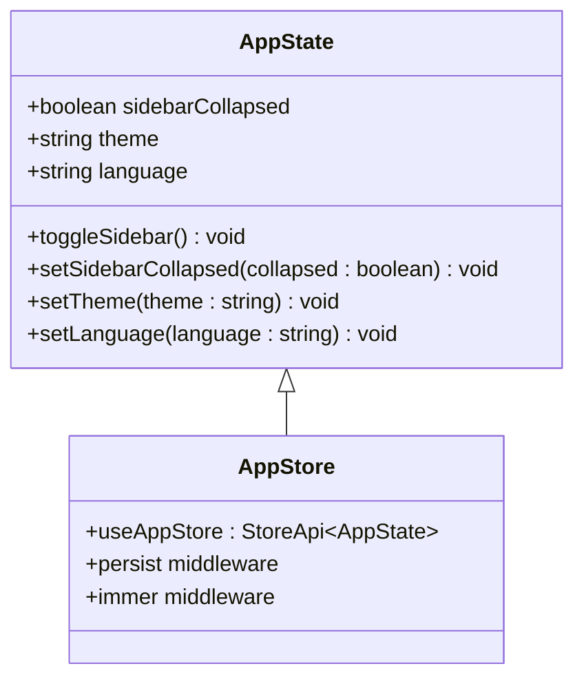
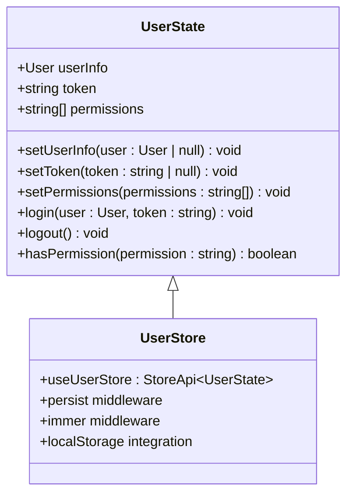
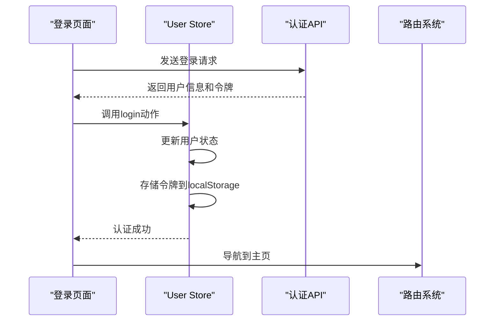
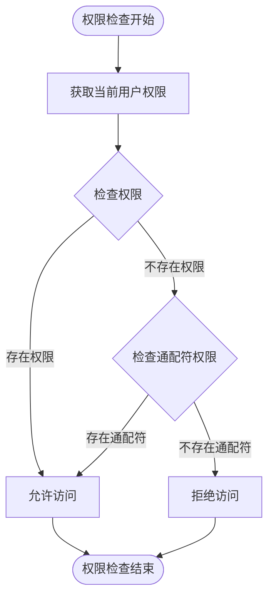
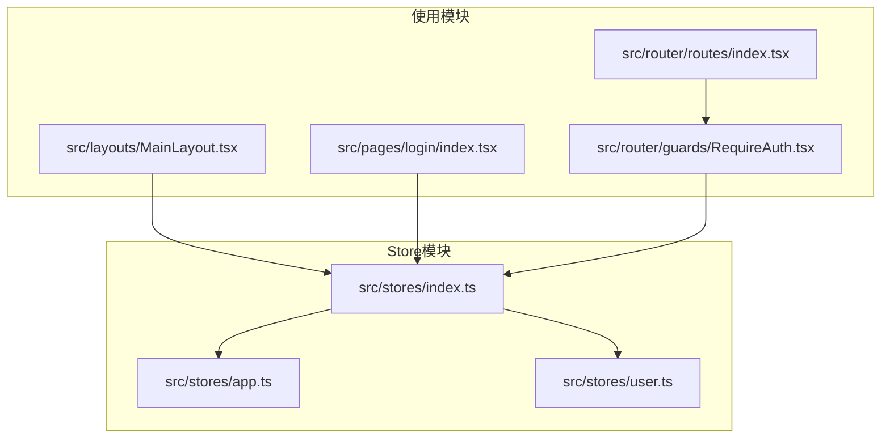

# Zustand集成与配置

<cite>
**本文档引用的文件**
- [package.json](file://package.json)
- [src/stores/index.ts](file://src/stores/index.ts)
- [src/stores/app.ts](file://src/stores/app.ts)
- [src/stores/user.ts](file://src/stores/user.ts)
- [src/main.tsx](file://src/main.tsx)
- [src/layouts/MainLayout.tsx](file://src/layouts/MainLayout.tsx)
- [src/pages/login/index.tsx](file://src/pages/login/index.tsx)
- [src/router/guards/RequireAuth.tsx](file://src/router/guards/RequireAuth.tsx)
- [src/router/routes/index.tsx](file://src/router/routes/index.tsx)
- [src/types/index.ts](file://src/types/index.ts)
</cite>

## 目录

1. [简介](#简介)
2. [项目结构](#项目结构)
3. [核心组件](#核心组件)
4. [架构概览](#架构概览)
5. [详细组件分析](#详细组件分析)
6. [依赖关系分析](#依赖关系分析)
7. [性能考虑](#性能考虑)
8. [故障排除指南](#故障排除指南)
9. [结论](#结论)

## 简介

本项目采用Zustand作为主要的状态管理解决方案，这是一个现代化的React状态管理库。Zustand因其轻量级特性、简洁的API设计和优秀的TypeScript支持而被选中。

### 选择Zustand的原因

**轻量级特性**

- 仅1KB的包大小，相比Redux等传统方案更加轻量
- 无需复杂的中间件配置，开箱即用

**易于使用的API设计**

- 直观的函数式API，学习成本低
- 支持多种使用模式：简单store、带中间件的store等

**与TypeScript的良好兼容性**

- 完整的类型推断支持
- 编译时类型检查，减少运行时错误

## 项目结构

项目采用按功能模块组织的结构，状态管理相关文件位于`src/stores/`目录下：



**图表来源**

- [src/stores/index.ts](file://src/stores/index.ts#L1-L3)
- [src/stores/app.ts](file://src/stores/app.ts#L1-L59)
- [src/stores/user.ts](file://src/stores/user.ts#L1-L76)

**章节来源**

- [src/stores/index.ts](file://src/stores/index.ts#L1-L3)
- [src/stores/app.ts](file://src/stores/app.ts#L1-L59)
- [src/stores/user.ts](file://src/stores/user.ts#L1-L76)

## 核心组件

### Zustand基础概念

**Store（存储）**

- Zustand的核心是store对象，包含状态和操作状态的方法
- 每个store都是独立的状态容器，可以按功能模块划分

**Actions（动作）**

- 定义在store中的方法，用于修改状态
- 支持同步和异步操作

**Selectors（选择器）**

- 通过store的函数式API选择性地订阅状态片段
- 提供细粒度的状态订阅，避免不必要的重渲染

### Store创建方式

项目中使用了两种store创建模式：

**简单store模式**

```typescript
// 基础store创建
export const useAppStore = create<AppState>()((set) => ({
  // 状态定义
  sidebarCollapsed: false,
  theme: 'light',
  language: 'zh-CN',

  // 动作定义
  toggleSidebar: () =>
    set((state) => ({
      sidebarCollapsed: !state.sidebarCollapsed,
    })),
}));
```

**带中间件的store模式**

```typescript
// 带中间件的store创建
export const useUserStore = create<UserState>()(
  persist(
    immer((set, get) => ({
      // 状态定义
      userInfo: null,
      token: null,
      permissions: [],

      // 动作定义
      login: (user, token) =>
        set((state) => ({
          userInfo: user,
          token: token,
        })),

      logout: () => {
        set((state) => ({
          userInfo: null,
          token: null,
          permissions: [],
        }));
        localStorage.removeItem('token');
      },
    })),
    {
      name: 'user-store',
      partialize: (state) => ({
        token: state.token,
        userInfo: state.userInfo,
      }),
    },
  ),
);
```

**章节来源**

- [src/stores/app.ts](file://src/stores/app.ts#L18-L58)
- [src/stores/user.ts](file://src/stores/user.ts#L21-L75)

## 架构概览

项目采用分层架构，将状态管理与业务逻辑分离：



**图表来源**

- [src/layouts/MainLayout.tsx](file://src/layouts/MainLayout.tsx#L14-L24)
- [src/pages/login/index.tsx](file://src/pages/login/index.tsx#L6-L34)
- [src/router/guards/RequireAuth.tsx](file://src/router/guards/RequireAuth.tsx#L4-L15)

## 详细组件分析

### 应用状态管理（App Store）

App Store负责管理应用级别的全局状态，包括侧边栏折叠状态、主题切换和语言设置。

#### Store结构设计



**图表来源**

- [src/stores/app.ts](file://src/stores/app.ts#L5-L16)
- [src/stores/app.ts](file://src/stores/app.ts#L18-L58)

#### 核心功能实现

**状态管理**

- `sidebarCollapsed`: 控制侧边栏的折叠/展开状态
- `theme`: 应用主题（light/dark）
- `language`: 界面语言设置

**动作实现**

- `toggleSidebar()`: 切换侧边栏状态
- `setSidebarCollapsed(collapsed)`: 设置侧边栏具体状态
- `setTheme(theme)`: 切换应用主题
- `setLanguage(language)`: 设置界面语言

**章节来源**

- [src/stores/app.ts](file://src/stores/app.ts#L5-L16)
- [src/stores/app.ts](file://src/stores/app.ts#L18-L58)

### 用户状态管理（User Store）

User Store专门处理用户相关的状态管理，包括用户信息、认证令牌和权限控制。

#### Store结构设计



**图表来源**

- [src/stores/user.ts](file://src/stores/user.ts#L6-L19)
- [src/stores/user.ts](file://src/stores/user.ts#L21-L75)

#### 核心功能实现

**用户认证流程**



**图表来源**

- [src/pages/login/index.tsx](file://src/pages/login/index.tsx#L34-L43)
- [src/stores/user.ts](file://src/stores/user.ts#L46-L60)

**权限验证机制**



**图表来源**

- [src/stores/user.ts](file://src/stores/user.ts#L62-L65)

**章节来源**

- [src/stores/user.ts](file://src/stores/user.ts#L6-L19)
- [src/stores/user.ts](file://src/stores/user.ts#L21-L75)

### 中间件集成

#### Immer中间件

Immer中间件提供了不可变更新的便利语法：

**原子性状态更新**

- 自动处理状态更新的不可变性
- 简化复杂状态更新逻辑
- 提供更好的开发体验

**使用示例**

```typescript
// Immer中间件提供的语法糖
set((state) => {
  state.sidebarCollapsed = !state.sidebarCollapsed;
});

// 等价于传统写法
set((state) => ({
  sidebarCollapsed: !state.sidebarCollapsed,
}));
```

#### Persist中间件

Persist中间件实现了状态的持久化存储：

**本地存储策略**

- 自动序列化和反序列化状态
- 支持部分状态持久化（partialize函数）
- 内存和存储之间的状态同步

**配置选项**

- `name`: 存储在localStorage中的键名
- `partialize`: 指定需要持久化的状态字段

**章节来源**

- [src/stores/app.ts](file://src/stores/app.ts#L1-L3)
- [src/stores/app.ts](file://src/stores/app.ts#L49-L57)
- [src/stores/user.ts](file://src/stores/user.ts#L3-L4)
- [src/stores/user.ts](file://src/stores/user.ts#L67-L73)

### Hook使用模式

#### useStore Hook的使用

**完整状态订阅**

```typescript
// 订阅整个store的状态
const { sidebarCollapsed, toggleSidebar } = useAppStore();
const { userInfo, logout } = useUserStore();
```

**选择性状态订阅**

```typescript
// 只订阅特定状态，避免不必要的重渲染
const login = useUserStore((state) => state.login);
const token = useUserStore((state) => state.token);
```

**章节来源**

- [src/layouts/MainLayout.tsx](file://src/layouts/MainLayout.tsx#L23-L24)
- [src/pages/login/index.tsx](file://src/pages/login/index.tsx#L34-L34)
- [src/router/guards/RequireAuth.tsx](file://src/router/guards/RequireAuth.tsx#L15-L15)

## 依赖关系分析

### 外部依赖

项目对Zustand及其中间件的依赖关系：

```mermaid
graph TB
subgraph "Zustand生态系统"
Zustand[zustand@^5.0.11]
Immer[immer@^11.1.4]
Persist[zustand/middleware/persist]
ImmerMiddleware[zustand/middleware/immer]
end
subgraph "项目依赖"
PackageJSON[package.json]
AppStore[app.ts]
UserStore[user.ts]
end
PackageJSON --> Zustand
PackageJSON --> Immer
AppStore --> Zustand
AppStore --> Persist
AppStore --> ImmerMiddleware
UserStore --> Zustand
UserStore --> Persist
UserStore --> ImmerMiddleware
```

**图表来源**

- [package.json](file://package.json#L20-L36)
- [src/stores/app.ts](file://src/stores/app.ts#L1-L3)
- [src/stores/user.ts](file://src/stores/user.ts#L2-L4)

### 内部依赖关系



**图表来源**

- [src/stores/index.ts](file://src/stores/index.ts#L1-L2)
- [src/layouts/MainLayout.tsx](file://src/layouts/MainLayout.tsx#L14-L14)
- [src/pages/login/index.tsx](file://src/pages/login/index.tsx#L6-L6)
- [src/router/guards/RequireAuth.tsx](file://src/router/guards/RequireAuth.tsx#L4-L4)

**章节来源**

- [package.json](file://package.json#L20-L36)
- [src/stores/index.ts](file://src/stores/index.ts#L1-L2)

## 性能考虑

### 状态订阅优化

**选择性订阅策略**

- 使用选择器函数只订阅需要的状态片段
- 避免不必要的组件重渲染
- 提高应用整体性能

**最佳实践**

```typescript
// ✅ 推荐：选择性订阅
const token = useUserStore((state) => state.token);
const login = useUserStore((state) => state.login);

// ❌ 不推荐：订阅整个store
const { token, login } = useUserStore();
```

### 中间件性能影响

**Immer中间件**

- 提供不可变更新的便利性
- 对小规模状态更新性能影响可忽略
- 在复杂状态更新场景下提升开发效率

**Persist中间件**

- localStorage读写操作可能影响性能
- 建议只持久化必要的状态字段
- 避免存储大型数据结构

## 故障排除指南

### 常见问题及解决方案

**状态不更新问题**

- 检查是否正确使用了Immer中间件的更新语法
- 确认状态更新函数是否在正确的上下文中调用

**持久化失效问题**

- 验证localStorage的可用性和容量限制
- 检查partialize函数是否正确配置
- 确认store名称的唯一性

**内存泄漏问题**

- 确保组件卸载时不会持有过期的store引用
- 避免在effect中创建无限循环的状态更新

**类型安全问题**

- 确保store接口定义完整覆盖所有状态字段
- 使用TypeScript严格模式进行编译检查

### 调试技巧

**开发工具支持**

- 使用React DevTools检查组件重渲染情况
- 利用Zustand的调试工具监控状态变化
- 通过浏览器开发者工具检查localStorage内容

**日志记录**

```typescript
// 在关键状态更新点添加日志
const login = (user, token) => {
  console.log('用户登录:', { user, token });
  set({ userInfo: user, token });
};
```

## 结论

本项目成功集成了Zustand作为状态管理解决方案，通过合理的架构设计和中间件配置，实现了高效、类型安全的状态管理。

### 主要优势

**开发体验**

- 简洁的API设计，降低学习成本
- 完整的TypeScript支持，提供编译时类型检查
- 灵活的使用模式，适应不同复杂度的需求

**性能表现**

- 轻量级实现，减少bundle大小
- 选择性订阅机制，优化重渲染性能
- 中间件架构支持功能扩展

**维护性**

- 清晰的模块化结构
- 完善的类型定义
- 良好的测试友好性

### 未来改进方向

**功能扩展**

- 考虑添加状态快照和时间旅行功能
- 实现更精细的错误边界处理
- 增强开发环境的调试工具

**性能优化**

- 实现状态懒加载机制
- 优化大规模状态的更新性能
- 添加状态压缩和去重功能

通过持续的优化和改进，Zustand状态管理方案将继续为项目的稳定发展提供强有力的支持。
