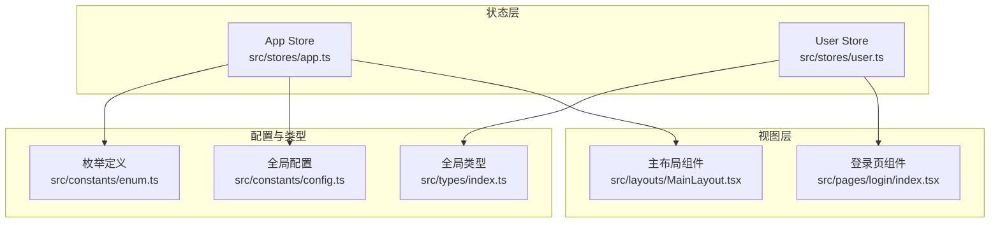
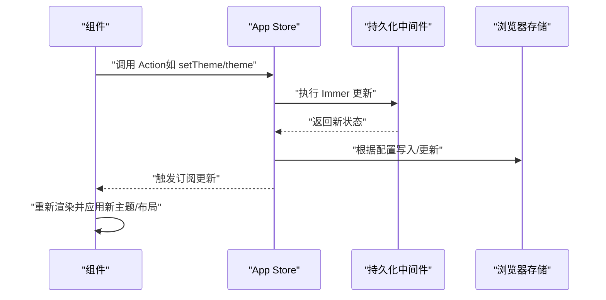
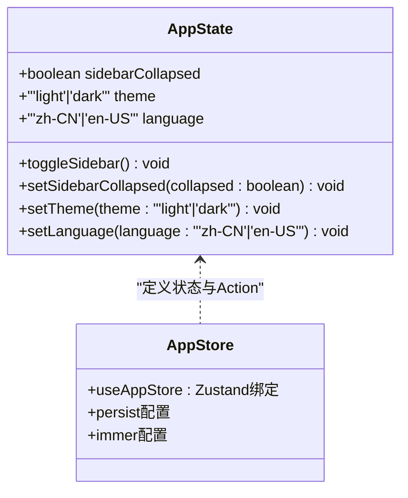
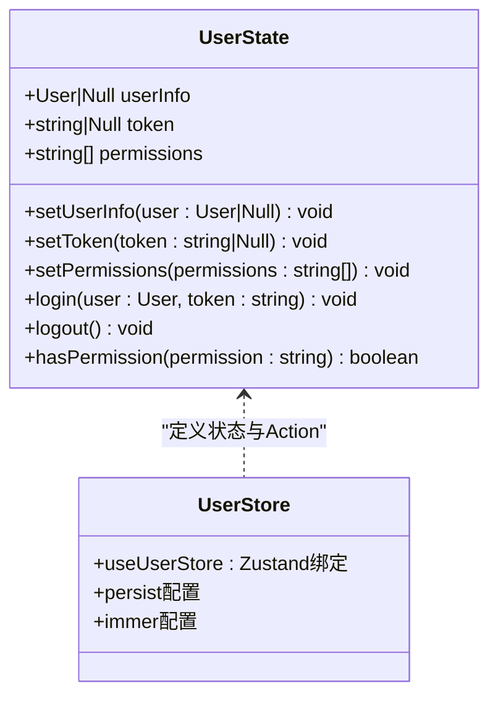
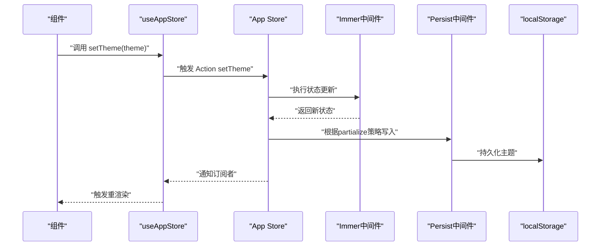
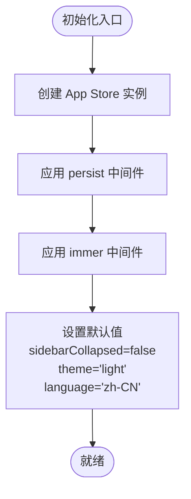
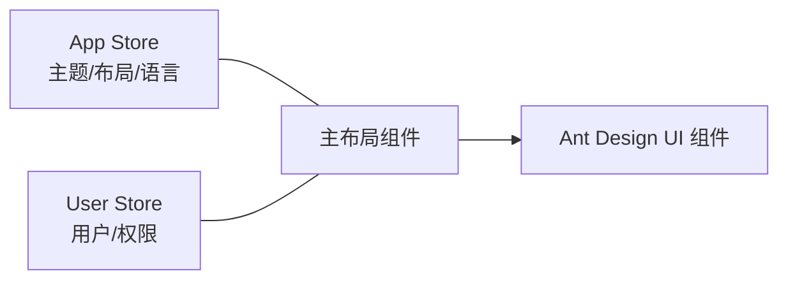
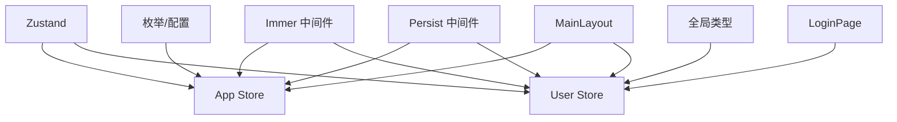

# 应用状态管理

<cite>
**本文引用的文件**
- [src/stores/app.ts](file://src/stores/app.ts)
- [src/stores/user.ts](file://src/stores/user.ts)
- [src/stores/index.ts](file://src/stores/index.ts)
- [src/layouts/MainLayout.tsx](file://src/layouts/MainLayout.tsx)
- [src/pages/login/index.tsx](file://src/pages/login/index.tsx)
- [src/main.tsx](file://src/main.tsx)
- [src/constants/config.ts](file://src/constants/config.ts)
- [src/types/index.ts](file://src/types/index.ts)
- [.ai/core/architecture.md](file://.ai/core/architecture.md)
- [src/constants/enum.ts](file://src/constants/enum.ts)
</cite>

## 目录

1. [简介](#简介)
2. [项目结构](#项目结构)
3. [核心组件](#核心组件)
4. [架构概览](#架构概览)
5. [详细组件分析](#详细组件分析)
6. [依赖分析](#依赖分析)
7. [性能考虑](#性能考虑)
8. [故障排查指南](#故障排查指南)
9. [结论](#结论)
10. [附录](#附录)

## 简介

本文件面向AI管理平台的应用状态管理，聚焦“应用状态”（App Store），阐述其设计目的、职责范围、数据结构、初始化与默认值、更新机制（Action与dispatch模式）、在组件中的使用方式及对UI的影响，并对比“应用状态”与“用户状态”的区别与协作关系。  
应用状态主要负责全局应用配置、主题状态、布局状态等横切关注点；用户状态负责登录态、权限等用户相关信息。两者通过独立的store进行解耦，避免相互污染。

## 项目结构

应用状态管理位于src/stores目录，采用Zustand + Immer + Persist的组合方案，确保状态可持久化、更新简洁且不可变。应用状态与用户状态分别独立维护，便于按域拆分与扩展。

图表来源

- [src/stores/app.ts](file://src/stores/app.ts#L1-L59)
- [src/stores/user.ts](file://src/stores/user.ts#L1-L76)
- [src/layouts/MainLayout.tsx](file://src/layouts/MainLayout.tsx#L1-L174)
- [src/pages/login/index.tsx](file://src/pages/login/index.tsx#L1-L133)
- [src/constants/config.ts](file://src/constants/config.ts#L1-L76)
- [src/types/index.ts](file://src/types/index.ts#L1-L101)
- [src/constants/enum.ts](file://src/constants/enum.ts#L1-L69)

章节来源

- [src/stores/app.ts](file://src/stores/app.ts#L1-L59)
- [src/stores/user.ts](file://src/stores/user.ts#L1-L76)
- [src/stores/index.ts](file://src/stores/index.ts#L1-L3)

## 核心组件

- App Store（应用状态）
  - 职责：管理全局布局状态（如侧边栏折叠）、主题模式（亮/暗）、语言（简体中文/英文）等。
  - 初始化默认值：侧边栏未折叠、主题为亮色、语言为简体中文。
  - 更新机制：提供toggleSidebar、setSidebarCollapsed、setTheme、setLanguage等Action，通过Immer进行不可变更新，并持久化到本地存储。
- User Store（用户状态）
  - 职责：管理用户信息、登录态token、权限列表，提供登录、登出、权限校验等能力。
  - 初始化默认值：用户信息为空、token为空、权限数组为空。
  - 更新机制：提供setUserInfo、setToken、setPermissions、login、logout、hasPermission等Action，同样使用Immer与持久化。

章节来源

- [src/stores/app.ts](file://src/stores/app.ts#L5-L16)
- [src/stores/app.ts](file://src/stores/app.ts#L18-L58)
- [src/stores/user.ts](file://src/stores/user.ts#L6-L19)
- [src/stores/user.ts](file://src/stores/user.ts#L21-L75)

## 架构概览

应用状态与用户状态均基于Zustand创建，通过persist中间件实现本地持久化，通过immer中间件简化不可变更新。组件通过useAppStore/useUserStore订阅状态变化，实现UI联动。

图表来源

- [src/stores/app.ts](file://src/stores/app.ts#L18-L58)
- [src/layouts/MainLayout.tsx](file://src/layouts/MainLayout.tsx#L23-L24)

## 详细组件分析

### App Store 设计与实现

- 数据结构
  - 字段：sidebarCollapsed（boolean）、theme（'light'|'dark'）、language（'zh-CN'|'en-US'）
  - 命名规范：布尔型状态使用“形容词+名词”或“副词+动词”形式，字符串枚举使用联合字面量类型
- 初始化与默认值
  - 默认值：sidebarCollapsed=false、theme='light'、language='zh-CN'
- Action与更新机制
  - toggleSidebar：切换侧边栏折叠状态
  - setSidebarCollapsed：设置侧边栏折叠状态
  - setTheme：设置主题模式
  - setLanguage：设置语言
  - 使用Immer进行不可变更新，persist中间件按partialize策略持久化指定字段
- 在组件中的使用
  - 主布局组件从App Store订阅sidebarCollapsed与toggleSidebar，用于控制Sider折叠与Header按钮交互
  - 登录页组件未直接使用App Store，但App Store的默认语言与主题会影响全局UI呈现

图表来源

- [src/stores/app.ts](file://src/stores/app.ts#L5-L16)
- [src/stores/app.ts](file://src/stores/app.ts#L18-L58)

章节来源

- [src/stores/app.ts](file://src/stores/app.ts#L5-L16)
- [src/stores/app.ts](file://src/stores/app.ts#L18-L58)
- [src/layouts/MainLayout.tsx](file://src/layouts/MainLayout.tsx#L23-L24)

### User Store 设计与实现

- 数据结构
  - 字段：userInfo（User|null）、token（string|null）、permissions（string[]）
  - 类型：User来自全局类型定义
- 初始化与默认值
  - 默认值：userInfo=null、token=null、permissions=[]
- Action与更新机制
  - setUserInfo/setToken/setPermissions：单项更新
  - login：一次性设置用户与token
  - logout：清空用户、token、权限，并移除本地token
  - hasPermission：基于权限数组判断是否拥有某权限
- 在组件中的使用
  - 登录页组件通过useUserStore的login Action完成登录流程
  - 主布局组件从User Store获取userInfo用于头像与用户信息展示

图表来源

- [src/stores/user.ts](file://src/stores/user.ts#L6-L19)
- [src/stores/user.ts](file://src/stores/user.ts#L21-L75)
- [src/types/index.ts](file://src/types/index.ts#L17-L28)

章节来源

- [src/stores/user.ts](file://src/stores/user.ts#L6-L19)
- [src/stores/user.ts](file://src/stores/user.ts#L21-L75)
- [src/pages/login/index.tsx](file://src/pages/login/index.tsx#L34-L43)
- [src/layouts/MainLayout.tsx](file://src/layouts/MainLayout.tsx#L24)

### App Store 更新流程（序列图）

以下序列图展示了App Store中setTheme的典型调用链路，体现Action定义与dispatch模式（Zustand内部的set回调即为dispatch语义）：

图表来源

- [src/stores/app.ts](file://src/stores/app.ts#L37-L41)
- [src/stores/app.ts](file://src/stores/app.ts#L49-L57)

### App Store 初始化与默认值（流程图）

图表来源

- [src/stores/app.ts](file://src/stores/app.ts#L18-L23)
- [src/stores/app.ts](file://src/stores/app.ts#L49-L57)

### App Store 与用户状态的协作关系

- 区别
  - App Store：全局应用配置与UI行为状态（布局、主题、语言）
  - User Store：用户身份与权限状态（登录、token、权限）
- 协作
  - 主布局组件同时订阅App Store与User Store，实现“主题/布局”与“用户信息”的统一呈现
  - 登录成功后，User Store更新用户信息与token，App Store维持当前主题/语言偏好，二者互不影响

图表来源

- [src/layouts/MainLayout.tsx](file://src/layouts/MainLayout.tsx#L23-L24)
- [src/stores/app.ts](file://src/stores/app.ts#L5-L16)
- [src/stores/user.ts](file://src/stores/user.ts#L6-L19)

## 依赖分析

- App Store依赖
  - Zustand：状态容器
  - Immer中间件：不可变更新
  - Persist中间件：本地持久化
  - 枚举与配置：主题、语言等枚举与默认值
- User Store依赖
  - Zustand、Immer、Persist
  - 全局类型User
- 组件依赖
  - 主布局组件：useAppStore、useUserStore
  - 登录页组件：useUserStore

图表来源

- [src/stores/app.ts](file://src/stores/app.ts#L1-L3)
- [src/stores/user.ts](file://src/stores/user.ts#L1-L4)
- [src/layouts/MainLayout.tsx](file://src/layouts/MainLayout.tsx#L14)
- [src/pages/login/index.tsx](file://src/pages/login/index.tsx#L6)
- [src/constants/enum.ts](file://src/constants/enum.ts#L30-L45)
- [src/types/index.ts](file://src/types/index.ts#L17-L28)

章节来源

- [src/stores/app.ts](file://src/stores/app.ts#L1-L3)
- [src/stores/user.ts](file://src/stores/user.ts#L1-L4)
- [src/layouts/MainLayout.tsx](file://src/layouts/MainLayout.tsx#L14)
- [src/pages/login/index.tsx](file://src/pages/login/index.tsx#L6)

## 性能考虑

- 状态粒度：App Store与User Store按域拆分，避免无关状态导致的无谓重渲染
- 订阅范围：组件仅订阅所需字段（如MainLayout仅订阅sidebarCollapsed与toggleSidebar），减少订阅开销
- 持久化策略：App Store通过partialize仅持久化必要字段（主题、语言、侧边栏状态），降低存储压力
- 不可变更新：Immer中间件保证更新路径清晰、副作用可控，提升调试与可维护性

## 故障排查指南

- 症状：切换主题后刷新页面失效
  - 排查：确认persist中间件已正确配置，且localStorage中存在对应键值
  - 参考：App Store的persist配置与partialize策略
- 症状：登录后用户信息未显示
  - 排查：确认useUserStore的login是否被调用，userInfo是否被正确设置
  - 参考：User Store的login与setUserInfo
- 症状：侧边栏切换无效
  - 排查：确认MainLayout中是否正确使用useAppStore的toggleSidebar与sidebarCollapsed
  - 参考：App Store的toggleSidebar与setSidebarCollapsed

章节来源

- [src/stores/app.ts](file://src/stores/app.ts#L49-L57)
- [src/stores/user.ts](file://src/stores/user.ts#L46-L51)
- [src/layouts/MainLayout.tsx](file://src/layouts/MainLayout.tsx#L23-L24)

## 结论

App Store以简洁的数据结构与明确的职责边界，承担了全局布局、主题与语言等横切关注点；配合User Store的用户态管理，形成清晰的“应用态+用户态”双轨状态体系。通过Zustand + Immer + Persist的组合，既保证了开发效率，又兼顾了可维护性与性能。建议后续在App Store中增加更多布局与国际化配置项，并完善权限驱动的主题/语言切换逻辑，以进一步提升用户体验与可扩展性。

## 附录

- 状态字段命名规范
  - 布尔型状态：使用“形容词+名词”或“副词+动词”，如sidebarCollapsed
  - 枚举型状态：使用联合字面量类型，如theme、language
- 默认值与配置来源
  - App Store默认值：见初始化部分
  - 全局配置：应用名称、版本、默认分页大小等
- 架构规范参考
  - 状态管理规范（强制）模板与最佳实践

章节来源

- [src/stores/app.ts](file://src/stores/app.ts#L5-L23)
- [src/constants/config.ts](file://src/constants/config.ts#L4-L19)
- [.ai/core/architecture.md](file://.ai/core/architecture.md#L140-L181)
