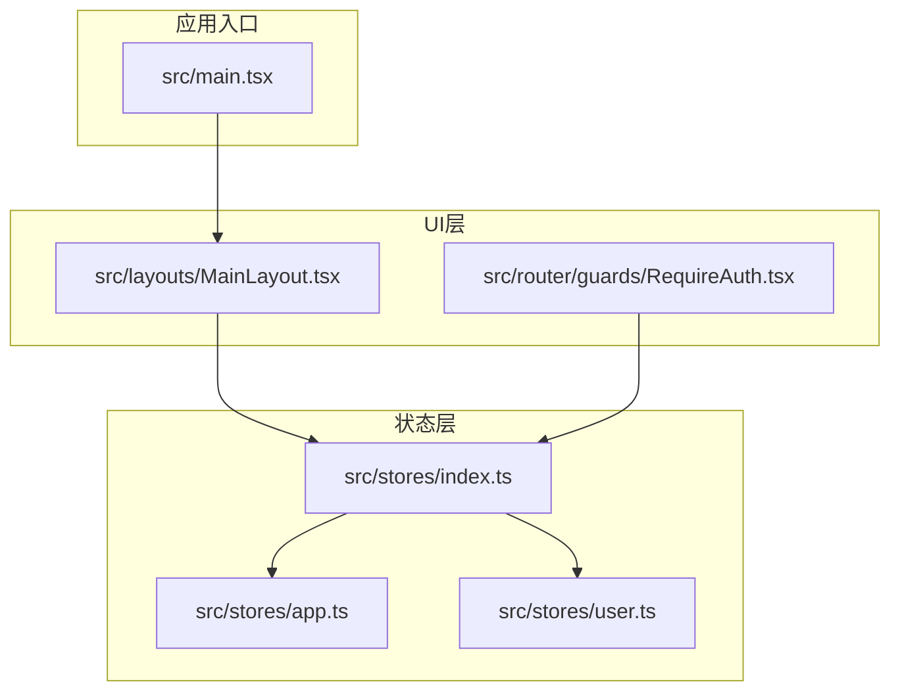
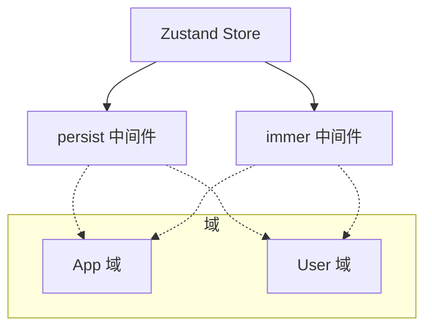
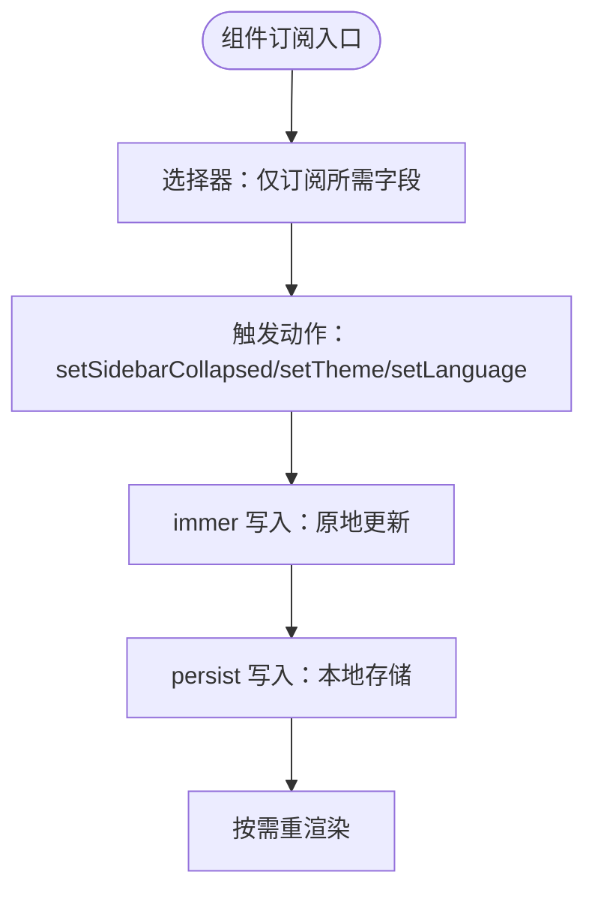
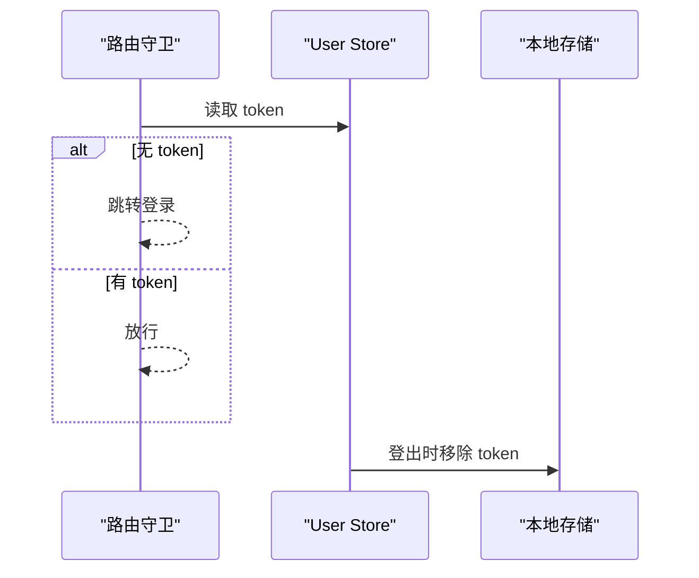
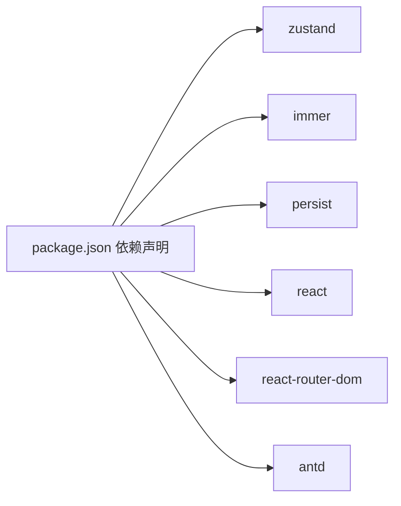

# 状态性能优化

<cite>
**本文引用的文件**
- [src/stores/index.ts](file://src/stores/index.ts)
- [src/stores/app.ts](file://src/stores/app.ts)
- [src/stores/user.ts](file://src/stores/user.ts)
- [src/layouts/MainLayout.tsx](file://src/layouts/MainLayout.tsx)
- [src/router/guards/RequireAuth.tsx](file://src/router/guards/RequireAuth.tsx)
- [src/main.tsx](file://src/main.tsx)
- [package.json](file://package.json)
- [.ai/core/architecture.md](file://.ai/core/architecture.md)
</cite>

## 目录

1. [引言](#引言)
2. [项目结构](#项目结构)
3. [核心组件](#核心组件)
4. [架构概览](#架构概览)
5. [详细组件分析](#详细组件分析)
6. [依赖分析](#依赖分析)
7. [性能考虑](#性能考虑)
8. [故障排查指南](#故障排查指南)
9. [结论](#结论)
10. [附录](#附录)

## 引言

本文件面向AI管理平台的状态性能优化，聚焦以下主题：

- 状态选择器的使用与最佳实践：如何通过精确的选择器减少不必要的组件重渲染
- 状态订阅的粒度控制：避免“全量订阅”导致的过度渲染
- Immer中间件在不可变状态更新中的性能优势与使用注意事项
- 大型状态树的管理策略：状态分割、模块化设计与持久化策略
- 性能监控与调试：React DevTools、状态变化追踪与内存泄漏预防
- 应用整体性能影响评估与优化建议

## 项目结构

本项目采用 Zustand 管理全局状态，状态以“域”划分，分别位于 stores 目录下；UI层通过自定义 Hook 订阅状态；路由守卫基于状态进行鉴权。

图表来源

- [src/main.tsx](file://src/main.tsx#L17-L31)
- [src/stores/index.ts](file://src/stores/index.ts#L1-L2)
- [src/stores/app.ts](file://src/stores/app.ts#L1-L59)
- [src/stores/user.ts](file://src/stores/user.ts#L1-L76)
- [src/layouts/MainLayout.tsx](file://src/layouts/MainLayout.tsx#L14-L24)
- [src/router/guards/RequireAuth.tsx](file://src/router/guards/RequireAuth.tsx#L4-L22)

章节来源

- [src/main.tsx](file://src/main.tsx#L17-L31)
- [src/stores/index.ts](file://src/stores/index.ts#L1-L2)
- [src/stores/app.ts](file://src/stores/app.ts#L1-L59)
- [src/stores/user.ts](file://src/stores/user.ts#L1-L76)
- [src/layouts/MainLayout.tsx](file://src/layouts/MainLayout.tsx#L14-L24)
- [src/router/guards/RequireAuth.tsx](file://src/router/guards/RequireAuth.tsx#L4-L22)

## 核心组件

- 应用状态域（App Store）：包含侧边栏折叠、主题、语言等轻量级状态，适合细粒度订阅
- 用户状态域（User Store）：包含用户信息、token、权限等，提供登录、登出、权限校验等动作
- 共享导出：stores/index.ts 将各域的 Hook 汇总导出，便于统一引入

章节来源

- [src/stores/app.ts](file://src/stores/app.ts#L5-L16)
- [src/stores/user.ts](file://src/stores/user.ts#L6-L19)
- [src/stores/index.ts](file://src/stores/index.ts#L1-L2)

## 架构概览

Zustand 在本项目中采用“域划分 + 中间件”的组合：

- 中间件：persist（持久化）、immer（不可变更新）
- 域划分：app.ts、user.ts 各自独立，互不耦合
- 订阅方式：组件直接从对应域 Hook 读取状态或触发动作

图表来源

- [src/stores/app.ts](file://src/stores/app.ts#L1-L59)
- [src/stores/user.ts](file://src/stores/user.ts#L1-L76)

章节来源

- [src/stores/app.ts](file://src/stores/app.ts#L1-L59)
- [src/stores/user.ts](file://src/stores/user.ts#L1-L76)

## 详细组件分析

### App Store：侧边栏、主题与语言

- 状态字段：sidebarCollapsed、theme、language
- 动作：toggleSidebar、setSidebarCollapsed、setTheme、setLanguage
- 中间件：persist + immer
- 订阅建议：仅订阅需要的字段，避免全量订阅导致的全局重渲染

图表来源

- [src/stores/app.ts](file://src/stores/app.ts#L18-L58)
- [src/layouts/MainLayout.tsx](file://src/layouts/MainLayout.tsx#L23-L24)

章节来源

- [src/stores/app.ts](file://src/stores/app.ts#L5-L16)
- [src/stores/app.ts](file://src/stores/app.ts#L18-L58)
- [src/layouts/MainLayout.tsx](file://src/layouts/MainLayout.tsx#L23-L24)

### User Store：用户信息、token与权限

- 状态字段：userInfo、token、permissions
- 动作：setUserInfo、setToken、setPermissions、login、logout、hasPermission
- 中间件：persist + immer
- 订阅建议：登录页、路由守卫等仅订阅 token；用户信息展示订阅 userInfo

图表来源

- [src/router/guards/RequireAuth.tsx](file://src/router/guards/RequireAuth.tsx#L15-L21)
- [src/stores/user.ts](file://src/stores/user.ts#L53-L60)

章节来源

- [src/stores/user.ts](file://src/stores/user.ts#L6-L19)
- [src/stores/user.ts](file://src/stores/user.ts#L21-L76)
- [src/router/guards/RequireAuth.tsx](file://src/router/guards/RequireAuth.tsx#L15-L21)

### 状态选择器与订阅优化

- 最佳实践
  - 使用“字段级订阅”而非“对象级订阅”，避免因对象引用变化引发的重渲染
  - 在路由守卫中仅订阅 token 字段，确保鉴权逻辑最小化
- 典型路径
  - 路由守卫仅订阅 token：[src/router/guards/RequireAuth.tsx](file://src/router/guards/RequireAuth.tsx#L15-L21)
  - 主布局订阅 sidebarCollapsed 与 userInfo：[src/layouts/MainLayout.tsx](file://src/layouts/MainLayout.tsx#L23-L24)

章节来源

- [src/router/guards/RequireAuth.tsx](file://src/router/guards/RequireAuth.tsx#L15-L21)
- [src/layouts/MainLayout.tsx](file://src/layouts/MainLayout.tsx#L23-L24)

### Immer 中间件的性能优势与注意事项

- 优势
  - 原地更新，减少深拷贝成本；在频繁小规模更新场景下更高效
  - 语法简洁，降低出错概率
- 注意事项
  - 避免在 Immer 闭包内创建新的函数或对象（如 action 内部），防止闭包持有导致的引用不稳定
  - 对于复杂嵌套状态，仍需谨慎拆分域，避免单域过大
- 在本项目中的体现
  - app.ts 与 user.ts 的 actions 均使用 immer 包裹的 set 回调，保持原地更新

章节来源

- [src/stores/app.ts](file://src/stores/app.ts#L18-L58)
- [src/stores/user.ts](file://src/stores/user.ts#L21-L76)

### 大型状态树的管理策略

- 状态分割
  - 按业务域拆分：app.ts 管理应用级 UI 状态；user.ts 管理用户态
  - 避免跨域互相写入，降低耦合
- 模块化设计
  - stores/index.ts 汇总导出，统一引入，避免重复导入
- 持久化策略
  - 仅持久化必要字段：app.ts 持久化主题、语言、侧边栏状态；user.ts 持久化 token 与用户信息
  - 通过 partialize 控制序列化范围，减少存储体积与 IO 成本

章节来源

- [src/stores/index.ts](file://src/stores/index.ts#L1-L2)
- [src/stores/app.ts](file://src/stores/app.ts#L49-L57)
- [src/stores/user.ts](file://src/stores/user.ts#L67-L73)

## 依赖分析

- 状态管理依赖
  - zustand：状态容器
  - immer：不可变更新中间件
  - persist：持久化中间件
- 运行时依赖
  - react、react-router-dom：UI与路由
  - antd：UI 组件库

图表来源

- [package.json](file://package.json#L20-L36)

章节来源

- [package.json](file://package.json#L20-L36)

## 性能考虑

- 订阅粒度控制
  - 仅订阅必要字段，避免全量对象订阅
  - 路由守卫仅订阅 token，主布局仅订阅当前页面需要的字段
- 更新路径优化
  - 使用 immer 原地更新，减少深拷贝
  - 将大对象拆分为多个小状态，降低更新范围
- 持久化开销
  - 通过 partialize 精准持久化，减少 IO 与序列化成本
- 渲染优化
  - 结合 React.memo、useMemo、useCallback 等手段，配合细粒度订阅进一步降低重渲染
- 大状态树扩展
  - 新增域时遵循现有规范：引入 persist 与 immer，明确状态与动作边界

章节来源

- [src/router/guards/RequireAuth.tsx](file://src/router/guards/RequireAuth.tsx#L15-L21)
- [src/layouts/MainLayout.tsx](file://src/layouts/MainLayout.tsx#L23-L24)
- [src/stores/app.ts](file://src/stores/app.ts#L49-L57)
- [src/stores/user.ts](file://src/stores/user.ts#L67-L73)
- [.ai/core/architecture.md](file://.ai/core/architecture.md#L140-L181)

## 故障排查指南

- 常见问题与定位
  - 过度重渲染：检查是否进行了对象级订阅，确认是否使用了字段级选择器
  - 鉴权异常：确认路由守卫是否正确读取 token，以及登录后是否更新了 token
  - 登出后状态未清除：确认 logout 动作是否清空了相关字段并移除了本地存储
- 调试方法
  - React DevTools：使用 Profiler 分析渲染次数与耗时，定位重渲染热点
  - 状态追踪：利用浏览器开发者工具的 Redux DevTools 或 Zustand 自带日志（可选），观察状态变化轨迹
- 内存泄漏预防
  - 不在状态中保存临时函数或大对象引用
  - 登出时清理本地存储与全局副作用
  - 避免在组件卸载后仍持有状态引用

章节来源

- [src/router/guards/RequireAuth.tsx](file://src/router/guards/RequireAuth.tsx#L15-L21)
- [src/stores/user.ts](file://src/stores/user.ts#L53-L60)

## 结论

本项目通过“域划分 + 中间件”的方式实现了清晰、可维护且具备良好性能基础的状态管理。后续可在以下方面持续优化：

- 强化字段级订阅与选择器使用
- 扩展路由守卫与 UI 组件的订阅粒度
- 在新增域时延续现有规范，确保一致性与可维护性
- 结合 React DevTools 与状态追踪工具，持续监控与优化渲染性能

## 附录

- 状态管理规范参考：[.ai/core/architecture.md](file://.ai/core/architecture.md#L140-L181)
- 依赖清单：[package.json](file://package.json#L20-L36)
