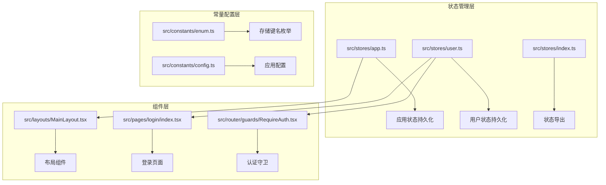
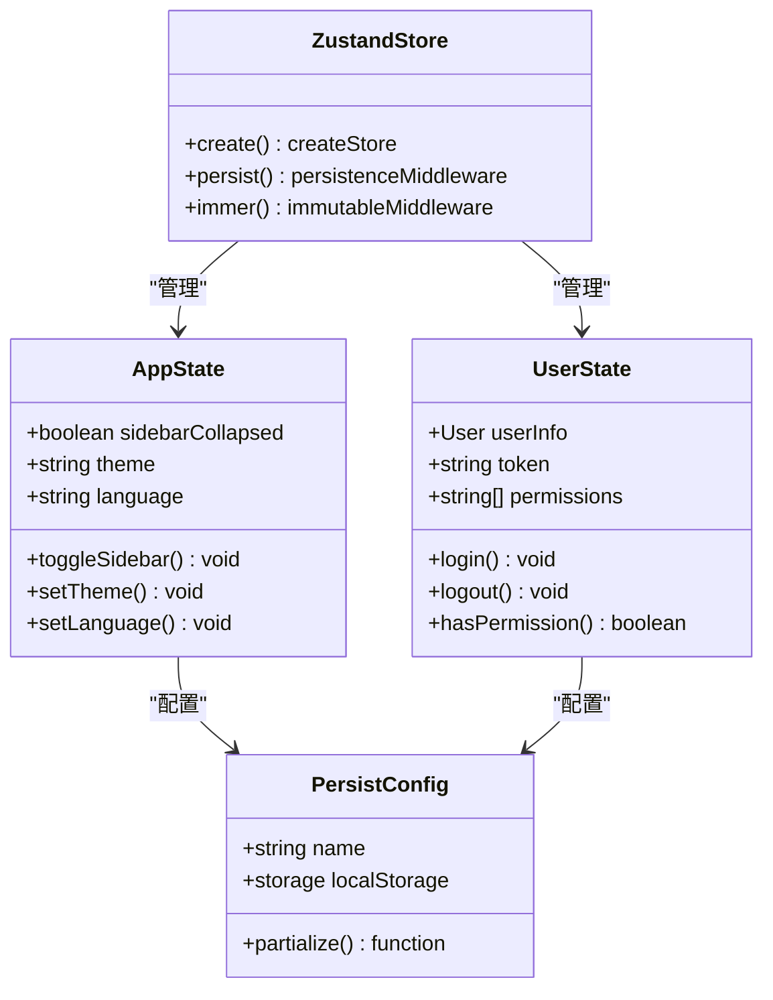
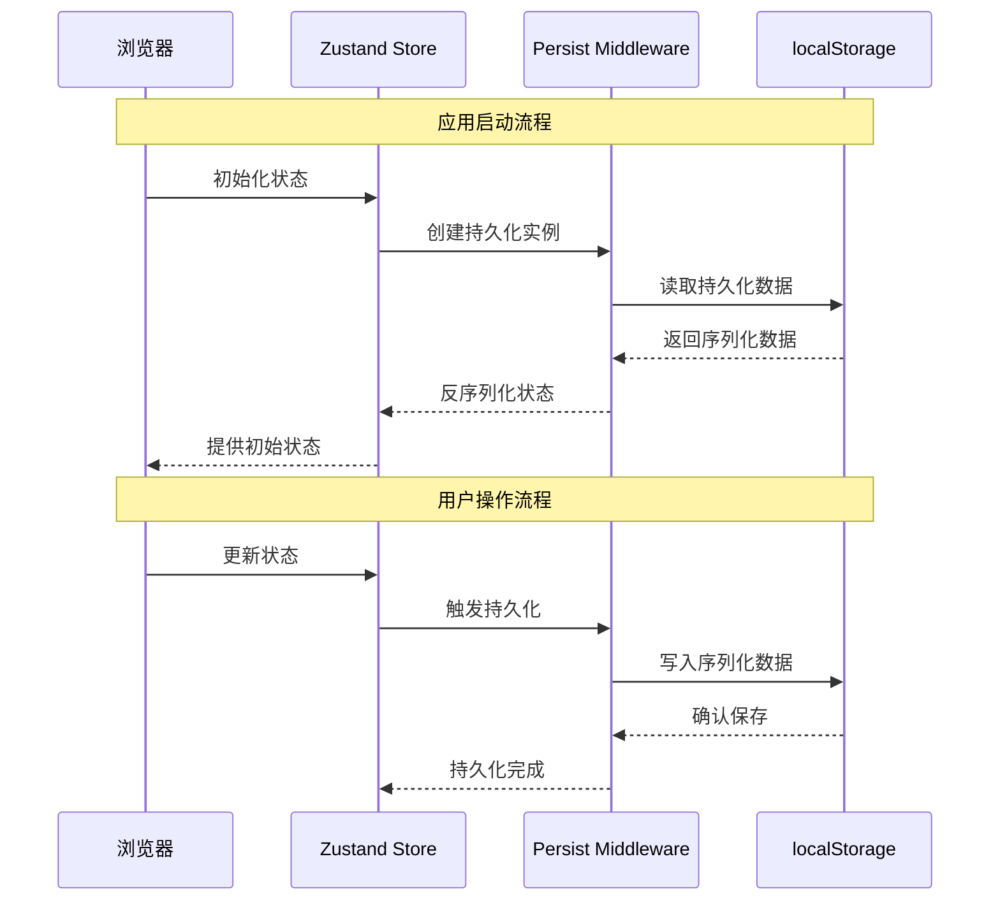
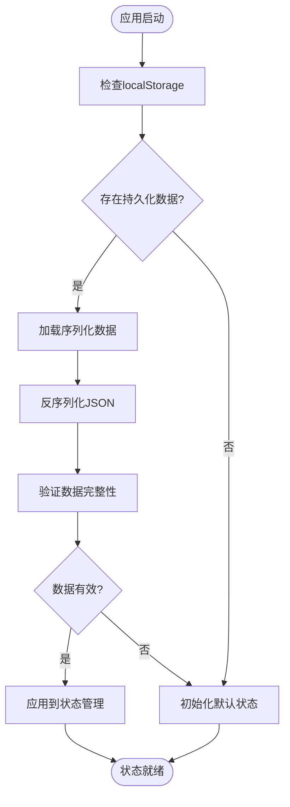
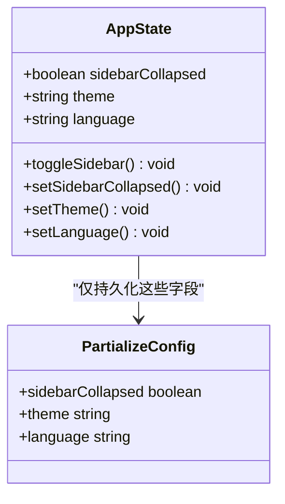
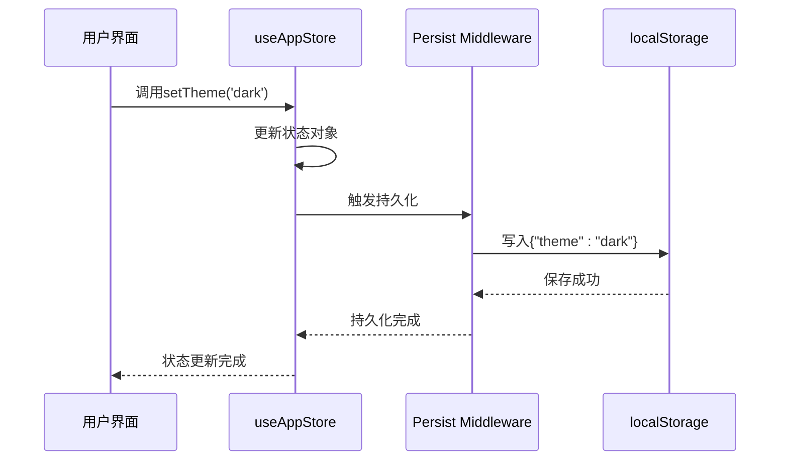
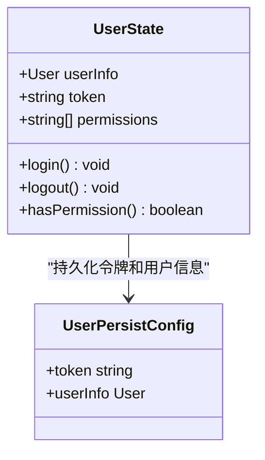
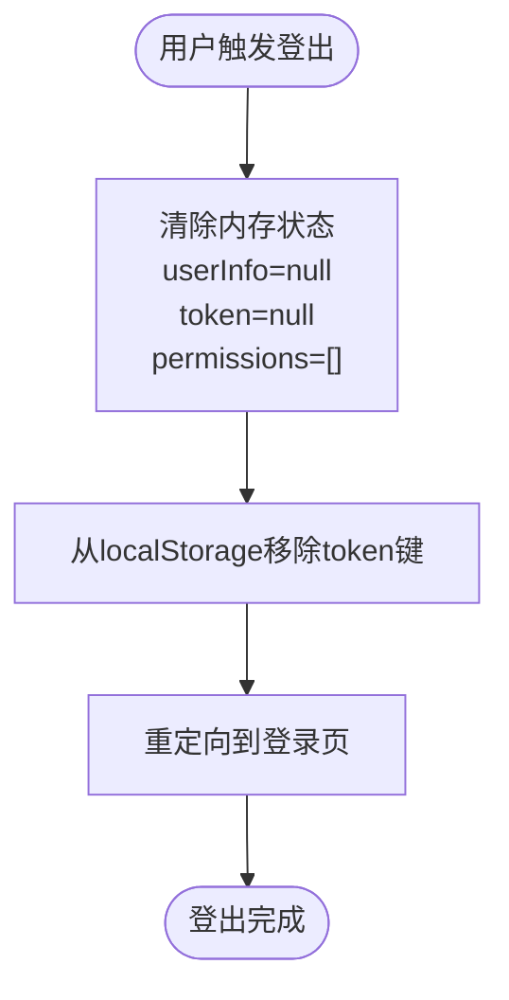
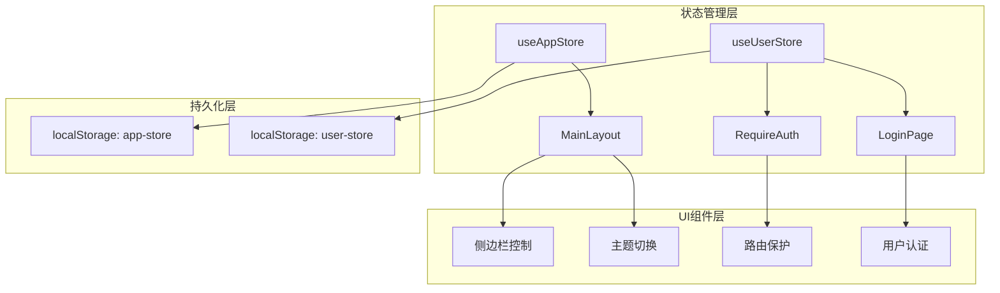
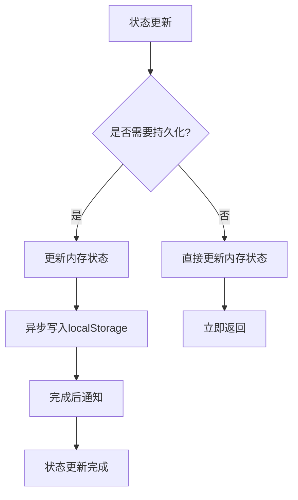

# 状态持久化机制

<cite>
**本文档引用的文件**
- [src/stores/app.ts](file://src/stores/app.ts)
- [src/stores/user.ts](file://src/stores/user.ts)
- [src/stores/index.ts](file://src/stores/index.ts)
- [src/constants/enum.ts](file://src/constants/enum.ts)
- [src/constants/config.ts](file://src/constants/config.ts)
- [src/layouts/MainLayout.tsx](file://src/layouts/MainLayout.tsx)
- [src/pages/login/index.tsx](file://src/pages/login/index.tsx)
- [src/router/guards/RequireAuth.tsx](file://src/router/guards/RequireAuth.tsx)
- [src/main.tsx](file://src/main.tsx)
- [package.json](file://package.json)
</cite>

## 目录

1. [简介](#简介)
2. [项目结构](#项目结构)
3. [核心组件](#核心组件)
4. [架构概览](#架构概览)
5. [详细组件分析](#详细组件分析)
6. [依赖关系分析](#依赖关系分析)
7. [性能考量](#性能考量)
8. [故障排除指南](#故障排除指南)
9. [结论](#结论)

## 简介

本项目采用Zustand状态管理库配合persist中间件实现浏览器localStorage状态持久化机制。该机制确保用户在刷新页面或重新打开应用时能够保持个性化设置和认证状态。

## 项目结构

项目采用模块化架构，状态管理集中在stores目录下：



**图表来源**

- [src/stores/app.ts](file://src/stores/app.ts#L1-L59)
- [src/stores/user.ts](file://src/stores/user.ts#L1-L76)
- [src/stores/index.ts](file://src/stores/index.ts#L1-L3)

**章节来源**

- [src/stores/app.ts](file://src/stores/app.ts#L1-L59)
- [src/stores/user.ts](file://src/stores/user.ts#L1-L76)
- [src/stores/index.ts](file://src/stores/index.ts#L1-L3)

## 核心组件

### Zustand状态管理架构

项目使用Zustand作为状态管理解决方案，具有以下特点：

- **轻量级**: 相比Redux更简洁的API设计
- **零样板代码**: 减少不必要的复杂性
- **类型安全**: 完整的TypeScript支持
- **中间件支持**: 可扩展的功能特性

### 持久化中间件配置

每个store都配置了persist中间件，实现自动序列化和反序列化：



**图表来源**

- [src/stores/app.ts](file://src/stores/app.ts#L18-L58)
- [src/stores/user.ts](file://src/stores/user.ts#L21-L75)

**章节来源**

- [src/stores/app.ts](file://src/stores/app.ts#L1-L59)
- [src/stores/user.ts](file://src/stores/user.ts#L1-L76)

## 架构概览

### 状态持久化工作流程



**图表来源**

- [src/stores/app.ts](file://src/stores/app.ts#L19-L57)
- [src/stores/user.ts](file://src/stores/user.ts#L22-L74)

### 状态恢复机制



**图表来源**

- [src/stores/app.ts](file://src/stores/app.ts#L49-L57)
- [src/stores/user.ts](file://src/stores/user.ts#L67-L74)

## 详细组件分析

### 应用状态管理 (AppState)

应用状态包含用户界面相关的配置信息：

#### 状态字段定义

| 字段名           | 类型             | 默认值  | 描述           |
| ---------------- | ---------------- | ------- | -------------- |
| sidebarCollapsed | boolean          | false   | 侧边栏折叠状态 |
| theme            | 'light'\|'dark'  | 'light' | 主题配置       |
| language         | 'zh-CN'\|'en-US' | 'zh-CN' | 语言选择       |

#### 持久化配置

应用状态通过partialize函数精确控制持久化范围：



**图表来源**

- [src/stores/app.ts](file://src/stores/app.ts#L5-L16)
- [src/stores/app.ts](file://src/stores/app.ts#L51-L55)

#### 状态更新流程



**图表来源**

- [src/stores/app.ts](file://src/stores/app.ts#L37-L41)

**章节来源**

- [src/stores/app.ts](file://src/stores/app.ts#L1-L59)

### 用户状态管理 (UserState)

用户状态管理包含认证和权限相关信息：

#### 状态字段定义

| 字段名      | 类型         | 默认值 | 描述         |
| ----------- | ------------ | ------ | ------------ |
| userInfo    | User\|null   | null   | 用户信息对象 |
| token       | string\|null | null   | 认证令牌     |
| permissions | string[]     | []     | 用户权限列表 |

#### 认证状态持久化

用户状态采用选择性持久化策略：



**图表来源**

- [src/stores/user.ts](file://src/stores/user.ts#L6-L19)
- [src/stores/user.ts](file://src/stores/user.ts#L69-L72)

#### 登出清理机制

登出操作不仅清除内存中的状态，还同步清理localStorage中的令牌：



**图表来源**

- [src/stores/user.ts](file://src/stores/user.ts#L53-L60)

**章节来源**

- [src/stores/user.ts](file://src/stores/user.ts#L1-L76)

### 常量配置系统

#### 存储键名枚举

项目定义了统一的存储键名常量，便于维护和修改：

| 枚举值                      | 键名                | 用途           |
| --------------------------- | ------------------- | -------------- |
| StorageKey.Token            | 'token'             | 认证令牌存储   |
| StorageKey.UserInfo         | 'user_info'         | 用户信息存储   |
| StorageKey.Theme            | 'theme'             | 主题配置存储   |
| StorageKey.Language         | 'language'          | 语言配置存储   |
| StorageKey.SidebarCollapsed | 'sidebar_collapsed' | 侧边栏状态存储 |

#### 应用配置常量

应用的基础配置信息：

| 配置项                     | 值      | 描述         |
| -------------------------- | ------- | ------------ |
| APP_CONFIG.defaultLanguage | 'zh-CN' | 默认语言     |
| APP_CONFIG.defaultTheme    | 'light' | 默认主题     |
| APP_CONFIG.tokenExpireDays | 7       | 令牌过期天数 |

**章节来源**

- [src/constants/enum.ts](file://src/constants/enum.ts#L61-L69)
- [src/constants/config.ts](file://src/constants/config.ts#L13-L19)

## 依赖关系分析

### 核心依赖

项目使用以下关键依赖实现状态持久化：

```mermaid
graph LR
subgraph "状态管理依赖"
A[zustand@^5.0.11] --> B[persist中间件]
A --> C[immer中间件]
end
subgraph "UI框架依赖"
D[react@^18.3.0] --> E[状态订阅]
F[react-router-dom@^6.26.0] --> G[路由守卫]
end
subgraph "工具库依赖"
H[dayjs@^1.11.0] --> I[日期处理]
J[antd@^5.29.3] --> K[UI组件]
end
B --> L[localStorage API]
C --> M[不可变状态更新]
```

**图表来源**

- [package.json](file://package.json#L20-L36)

### 组件间依赖关系



**图表来源**

- [src/stores/index.ts](file://src/stores/index.ts#L1-L3)
- [src/layouts/MainLayout.tsx](file://src/layouts/MainLayout.tsx#L14-L24)
- [src/router/guards/RequireAuth.tsx](file://src/router/guards/RequireAuth.tsx#L4-L15)

**章节来源**

- [package.json](file://package.json#L20-L36)
- [src/stores/index.ts](file://src/stores/index.ts#L1-L3)

## 性能考量

### 持久化性能优化

1. **选择性持久化**: 使用partialize函数只持久化必要状态，减少存储空间占用
2. **异步存储**: localStorage操作为异步，避免阻塞主线程
3. **状态最小化**: 避免持久化大型对象或重复数据

### 内存管理



### 存储容量监控

建议实现存储容量检查机制：

```typescript
// 存储容量检查示例
function checkStorageCapacity(): {
  used: number;
  available: number;
  percentage: number;
} {
  // 实现存储容量检查逻辑
}
```

## 故障排除指南

### 常见问题及解决方案

#### 1. 状态不同步问题

**症状**: 页面刷新后状态丢失
**原因**: localStorage访问权限问题或存储空间不足
**解决方案**:

- 检查浏览器隐私设置
- 清理localStorage缓存
- 实现存储容量监控

#### 2. 数据格式错误

**症状**: 应用启动时报错
**原因**: localStorage中存储的数据格式不正确
**解决方案**:

- 实现数据验证机制
- 添加错误边界处理
- 提供数据重置功能

#### 3. 认证状态异常

**症状**: 登录后仍提示未登录
**原因**: token状态不同步
**解决方案**:

- 检查token存储和读取逻辑
- 实现token有效性验证
- 添加自动登出机制

### 调试技巧

1. **开发者工具**: 使用Application标签查看localStorage内容
2. **状态监控**: 在开发环境中启用状态变更日志
3. **错误捕获**: 实现持久化异常处理机制

**章节来源**

- [src/stores/user.ts](file://src/stores/user.ts#L59-L60)

## 结论

本项目的状态持久化机制通过Zustand + persist中间件实现了高效、可靠的状态管理。主要优势包括：

1. **简洁性**: 相比传统状态管理方案更加简洁易用
2. **可靠性**: 自动序列化/反序列化，保证数据一致性
3. **可维护性**: 清晰的配置分离，便于扩展和修改
4. **性能**: 选择性持久化，优化存储和性能

建议后续改进方向：

- 实现版本管理和数据迁移机制
- 添加加密存储选项
- 增强错误处理和恢复能力
- 优化大状态对象的存储策略
