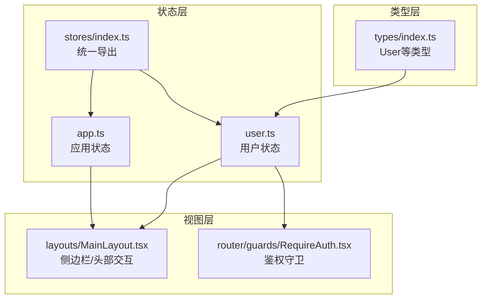
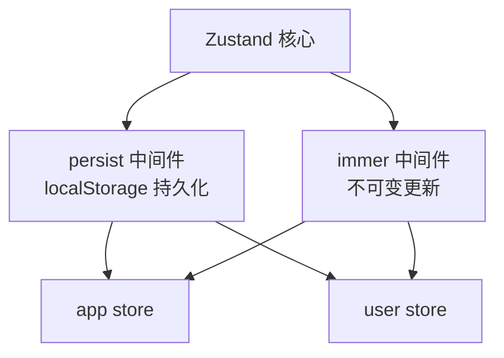
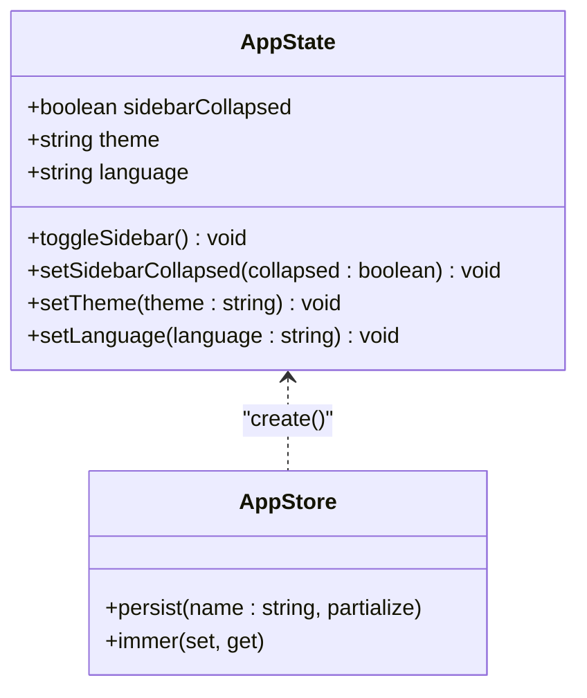
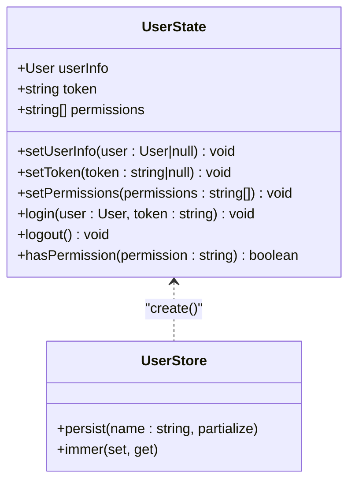
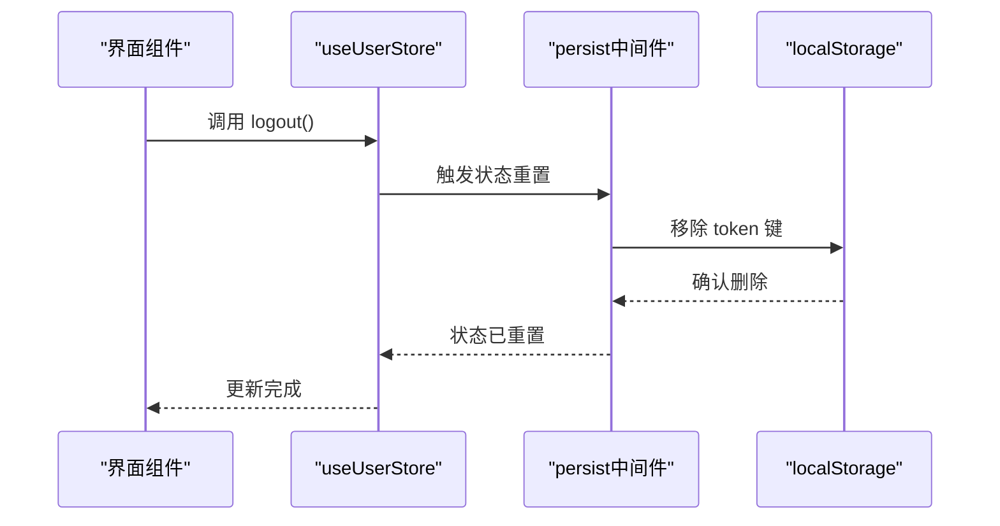
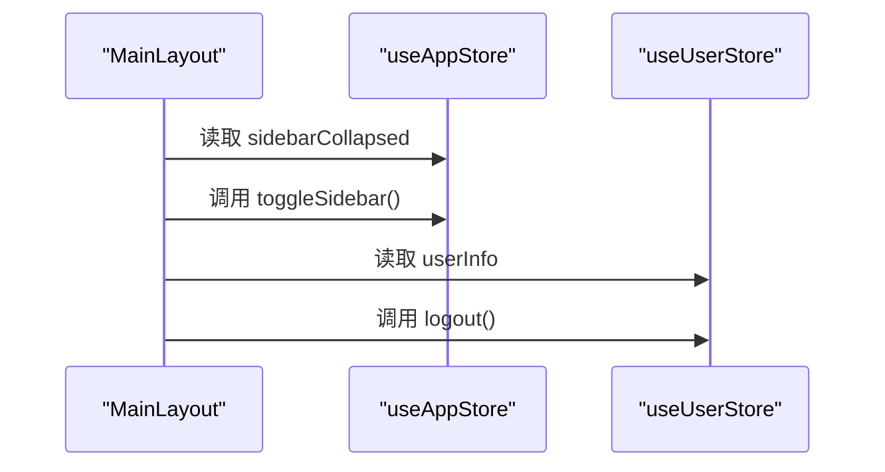
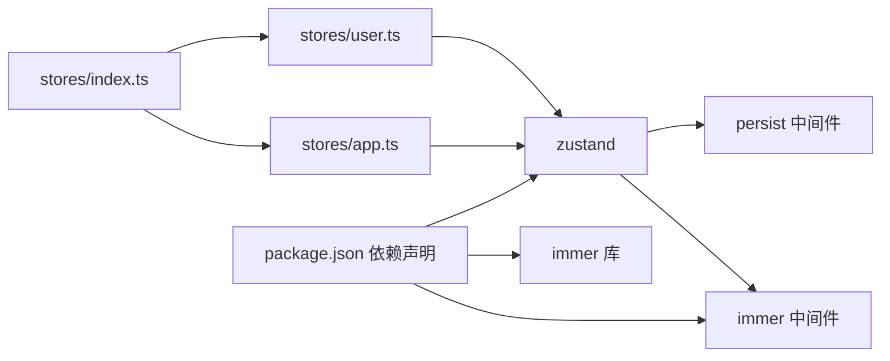

# 状态管理架构

<cite>
**本文档引用的文件**
- [src/stores/index.ts](file://src/stores/index.ts)
- [src/stores/app.ts](file://src/stores/app.ts)
- [src/stores/user.ts](file://src/stores/user.ts)
- [src/types/index.ts](file://src/types/index.ts)
- [src/layouts/MainLayout.tsx](file://src/layouts/MainLayout.tsx)
- [src/router/guards/RequireAuth.tsx](file://src/router/guards/RequireAuth.tsx)
- [package.json](file://package.json)
- [src/constants/enum.ts](file://src/constants/enum.ts)
- [.ai/core/architecture.md](file://.ai/core/architecture.md)
</cite>

## 目录

1. [引言](#引言)
2. [项目结构](#项目结构)
3. [核心组件](#核心组件)
4. [架构总览](#架构总览)
5. [详细组件分析](#详细组件分析)
6. [依赖关系分析](#依赖关系分析)
7. [性能考虑](#性能考虑)
8. [故障排查指南](#故障排查指南)
9. [结论](#结论)
10. [附录](#附录)

## 引言

本文件面向AI管理平台的状态管理架构，系统性阐述Zustand作为状态管理库的选择原因与架构优势，对比传统状态管理方案的差异；解释应用状态与用户状态的分离设计，明确app store与user store的职责划分；描述状态持久化机制及localStorage的跨会话保持策略；阐述状态更新的原子性保障与Immer在不可变更新中的作用；分析性能优化策略（状态选择器、订阅优化、内存泄漏防护）；最后说明AI配置驱动的状态管理扩展能力。

## 项目结构

状态管理相关代码集中在src/stores目录，采用按域分层的模块化组织：

- stores/index.ts：统一导出useAppStore与useUserStore，便于全局复用
- stores/app.ts：应用级状态（主题、语言、侧边栏折叠等），具备持久化与Immer支持
- stores/user.ts：用户级状态（用户信息、令牌、权限等），具备持久化与Immer支持
- types/index.ts：定义User等类型，确保状态模型的类型安全
- layouts/MainLayout.tsx：展示app store与user store在UI中的典型使用
- router/guards/RequireAuth.tsx：演示基于useUserStore的状态选择器用法

图表来源

- [src/stores/index.ts](file://src/stores/index.ts#L1-L3)
- [src/stores/app.ts](file://src/stores/app.ts#L1-L59)
- [src/stores/user.ts](file://src/stores/user.ts#L1-L76)
- [src/types/index.ts](file://src/types/index.ts#L17-L28)
- [src/layouts/MainLayout.tsx](file://src/layouts/MainLayout.tsx#L14-L25)
- [src/router/guards/RequireAuth.tsx](file://src/router/guards/RequireAuth.tsx#L4-L15)

章节来源

- [src/stores/index.ts](file://src/stores/index.ts#L1-L3)
- [src/stores/app.ts](file://src/stores/app.ts#L1-L59)
- [src/stores/user.ts](file://src/stores/user.ts#L1-L76)
- [src/types/index.ts](file://src/types/index.ts#L17-L28)
- [src/layouts/MainLayout.tsx](file://src/layouts/MainLayout.tsx#L14-L25)
- [src/router/guards/RequireAuth.tsx](file://src/router/guards/RequireAuth.tsx#L4-L15)

## 核心组件

- app store：管理应用外观与行为偏好，包含sidebarCollapsed、theme、language等字段，提供toggleSidebar、setSidebarCollapsed、setTheme、setLanguage等动作，并持久化到localStorage
- user store：管理用户认证与授权状态，包含userInfo、token、permissions等字段，提供setUserInfo、setToken、setPermissions、login、logout、hasPermission等动作，并持久化token与userInfo
- stores/index.ts：统一导出useAppStore与useUserStore，避免重复导入

章节来源

- [src/stores/app.ts](file://src/stores/app.ts#L5-L16)
- [src/stores/app.ts](file://src/stores/app.ts#L18-L58)
- [src/stores/user.ts](file://src/stores/user.ts#L6-L19)
- [src/stores/user.ts](file://src/stores/user.ts#L21-L75)
- [src/stores/index.ts](file://src/stores/index.ts#L1-L3)

## 架构总览

Zustand在本项目中的定位是轻量、可组合、可持久化的状态管理方案。其优势体现在：

- 无Provider层级，直接创建store，减少上下文传播成本
- 支持中间件链式组合（persist + immer），实现持久化与不可变更新
- 与React Hooks深度集成，通过selector精确订阅，降低渲染开销
- 类型安全友好，配合TypeScript接口定义清晰的状态结构

图表来源

- [src/stores/app.ts](file://src/stores/app.ts#L1-L3)
- [src/stores/user.ts](file://src/stores/user.ts#L1-L4)
- [package.json](file://package.json#L28-L35)

## 详细组件分析

### 应用状态管理（app store）

职责边界

- 管理UI外观与行为偏好：sidebarCollapsed（侧边栏折叠）、theme（主题）、language（语言）
- 提供切换与设置动作，保证状态更新的原子性与可追踪性

持久化策略

- 使用persist中间件，指定存储键名为'app-store'
- 通过partialize仅持久化sidebarCollapsed、theme、language，避免冗余数据

不可变更新

- 使用immer中间件，允许以可变语法编写更新逻辑，内部自动实现不可变更新

图表来源

- [src/stores/app.ts](file://src/stores/app.ts#L5-L16)
- [src/stores/app.ts](file://src/stores/app.ts#L18-L58)

章节来源

- [src/stores/app.ts](file://src/stores/app.ts#L5-L16)
- [src/stores/app.ts](file://src/stores/app.ts#L18-L58)

### 用户状态管理（user store）

职责边界

- 管理用户认证与授权：userInfo、token、permissions
- 提供登录、登出、权限校验等动作，确保用户态变更的原子性

持久化策略

- 使用persist中间件，指定存储键名为'user-store'
- 通过partialize仅持久化token与userInfo，避免持久化敏感或冗余数据
- 登出时主动清理localStorage中的token键

权限校验

- hasPermission通过selector读取当前权限集合，支持通配符'\*'

图表来源

- [src/stores/user.ts](file://src/stores/user.ts#L6-L19)
- [src/stores/user.ts](file://src/stores/user.ts#L21-L75)

章节来源

- [src/stores/user.ts](file://src/stores/user.ts#L6-L19)
- [src/stores/user.ts](file://src/stores/user.ts#L21-L75)

### 状态持久化与跨会话保持

- app store：持久化sidebarCollapsed、theme、language，实现主题、语言与布局偏好跨会话保持
- user store：持久化token与userInfo，实现登录态与用户信息跨会话保持
- 通过localStorage键名区分不同store，避免冲突
- 登出时显式移除token键，确保敏感信息不被意外保留

图表来源

- [src/stores/user.ts](file://src/stores/user.ts#L53-L60)

章节来源

- [src/stores/app.ts](file://src/stores/app.ts#L49-L57)
- [src/stores/user.ts](file://src/stores/user.ts#L67-L73)
- [src/stores/user.ts](file://src/stores/user.ts#L53-L60)

### 状态更新的原子性与Immer作用

- Immer中间件允许在set回调中以可变语法更新状态，内部自动实现不可变更新，保证状态树的原子性与一致性
- 在app store与user store中均启用immer，简化更新逻辑并降低出错概率

章节来源

- [src/stores/app.ts](file://src/stores/app.ts#L1-L3)
- [src/stores/user.ts](file://src/stores/user.ts#L1-L4)

### 应用状态与用户状态的分离设计

- app store：纯应用偏好，不涉及用户隐私，适合持久化
- user store：包含token与用户信息，需谨慎持久化与清理
- 通过独立的store与不同的持久化策略，实现职责清晰、边界明确的状态管理

章节来源

- [src/stores/app.ts](file://src/stores/app.ts#L18-L58)
- [src/stores/user.ts](file://src/stores/user.ts#L21-L75)

### 在UI中的实际应用

- MainLayout：使用useAppStore控制侧边栏折叠与主题显示，使用useUserStore展示用户头像与昵称
- RequireAuth：使用状态选择器读取token进行路由守卫

图表来源

- [src/layouts/MainLayout.tsx](file://src/layouts/MainLayout.tsx#L23-L24)
- [src/layouts/MainLayout.tsx](file://src/layouts/MainLayout.tsx#L56-L58)
- [src/router/guards/RequireAuth.tsx](file://src/router/guards/RequireAuth.tsx#L15)

章节来源

- [src/layouts/MainLayout.tsx](file://src/layouts/MainLayout.tsx#L14-L25)
- [src/router/guards/RequireAuth.tsx](file://src/router/guards/RequireAuth.tsx#L4-L15)

## 依赖关系分析

- 外部依赖：zustand、zustand/middleware/persist、zustand/middleware/immer、immer
- 内部依赖：stores/index.ts统一导出useAppStore与useUserStore，供各组件按需导入
- 类型依赖：types/index.ts中的User类型用于user store的类型约束

图表来源

- [package.json](file://package.json#L28-L35)
- [src/stores/index.ts](file://src/stores/index.ts#L1-L3)
- [src/stores/app.ts](file://src/stores/app.ts#L1-L3)
- [src/stores/user.ts](file://src/stores/user.ts#L1-L4)

章节来源

- [package.json](file://package.json#L28-L35)
- [src/stores/index.ts](file://src/stores/index.ts#L1-L3)

## 性能考虑

- 状态选择器：在组件中使用selector（如useUserStore(state => state.token)）仅订阅必要字段，避免无关状态变化导致的重渲染
- 订阅优化：Zustand默认使用浅比较，结合selector可进一步降低订阅范围
- 内存泄漏防护：确保在组件卸载时不会持有过期的store引用；store本身生命周期与应用一致，无需手动销毁
- 持久化粒度：通过partialize仅持久化必要字段，减少localStorage写入与解析开销

章节来源

- [src/router/guards/RequireAuth.tsx](file://src/router/guards/RequireAuth.tsx#L15)
- [src/stores/app.ts](file://src/stores/app.ts#L49-L57)
- [src/stores/user.ts](file://src/stores/user.ts#L67-L73)

## 故障排查指南

- 登录后仍被重定向至登录页
  - 检查useUserStore的token是否正确设置
  - 确认persist中间件是否正常工作，localStorage中是否存在token键
- 主题或语言未生效
  - 检查app store的theme与language是否正确设置
  - 确认persist中间件是否持久化了对应字段
- 登出后仍显示用户信息
  - 确认logout动作是否触发状态重置与localStorage清理
  - 检查是否有其他地方仍在读取旧的token或userInfo

章节来源

- [src/router/guards/RequireAuth.tsx](file://src/router/guards/RequireAuth.tsx#L15-L19)
- [src/stores/app.ts](file://src/stores/app.ts#L49-L57)
- [src/stores/user.ts](file://src/stores/user.ts#L53-L60)

## 结论

本项目采用Zustand作为状态管理核心，结合persist与immer中间件，实现了简洁、高效且可持久化的状态管理方案。通过app store与user store的职责分离，既满足了应用偏好的跨会话保持，又确保了用户态信息的安全与可控。配合状态选择器与最小订阅原则，有效降低了渲染成本与内存占用。整体架构易于扩展，可借助AI配置驱动的方式快速生成新的领域store，保持一致的开发体验与最佳实践。

## 附录

- AI配置驱动扩展能力
  - 参考架构规范模板，新增领域store时遵循统一结构：接口定义、actions、persist配置、immer包裹
  - 通过AI工具生成新store的骨架代码，确保类型安全与中间件使用的一致性

章节来源

- [.ai/core/architecture.md](file://.ai/core/architecture.md#L140-L181)
