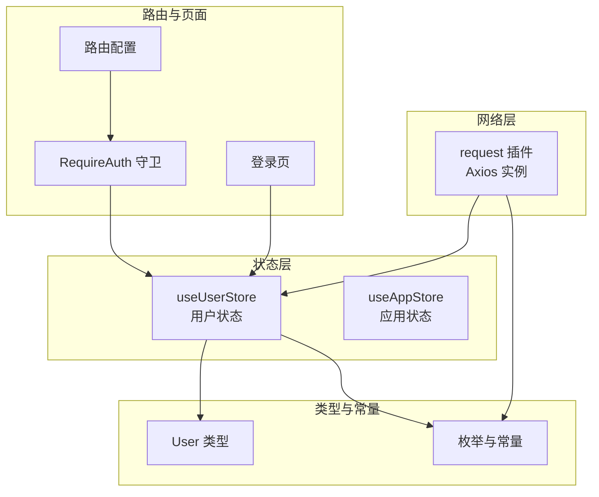
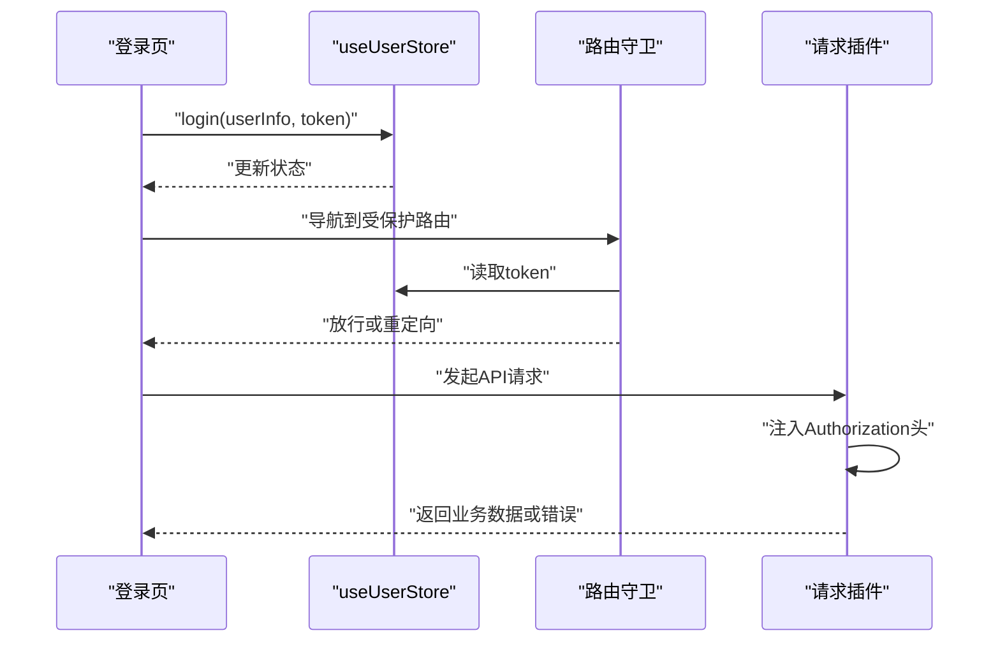
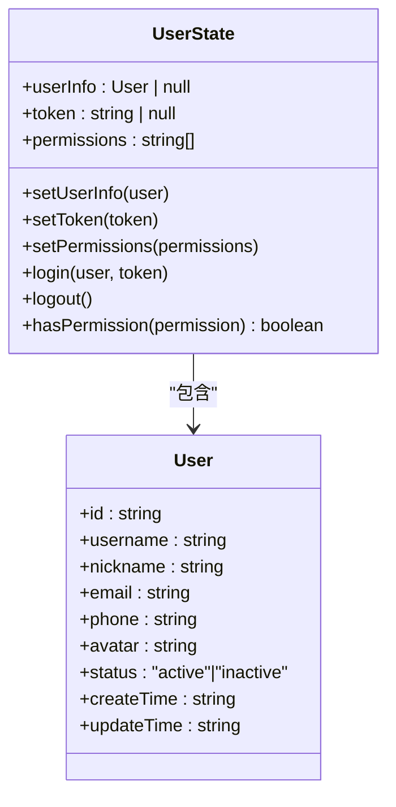
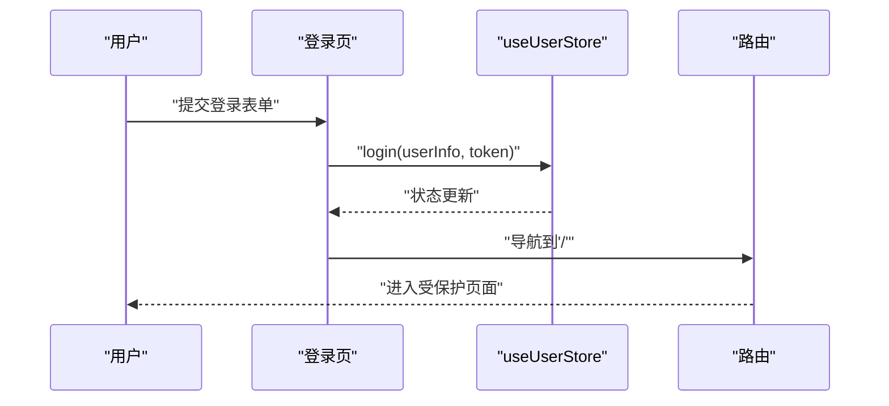
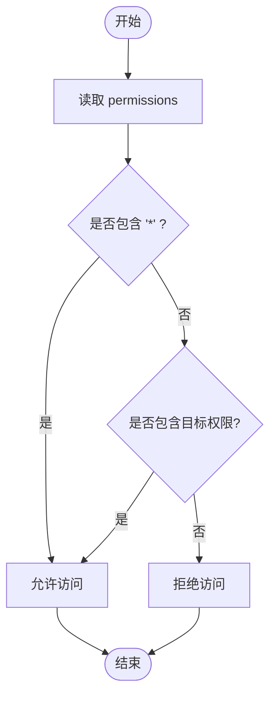
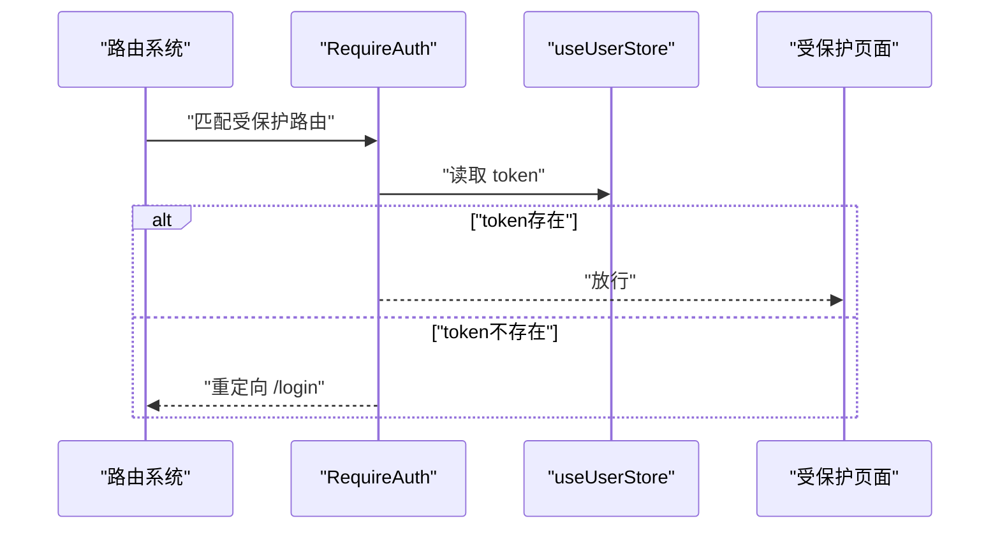
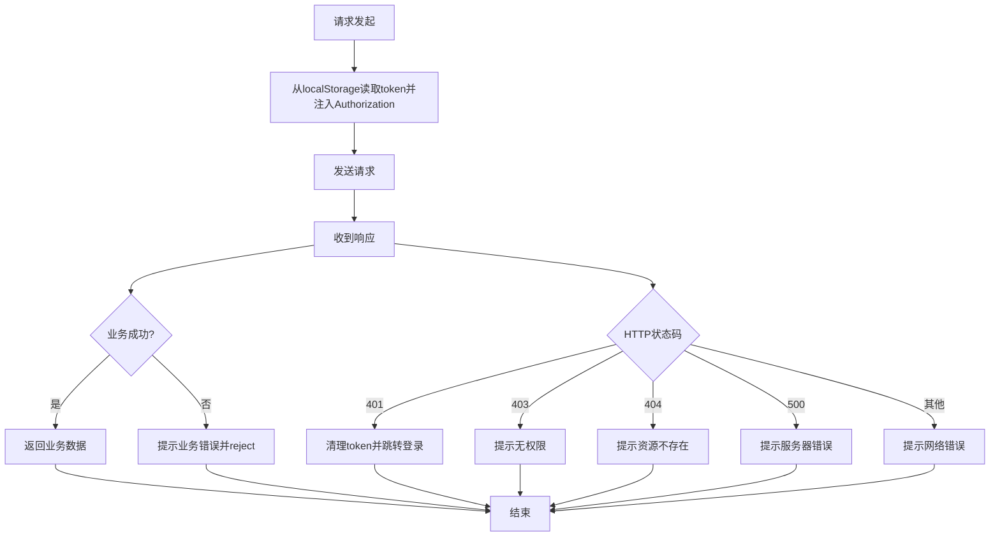
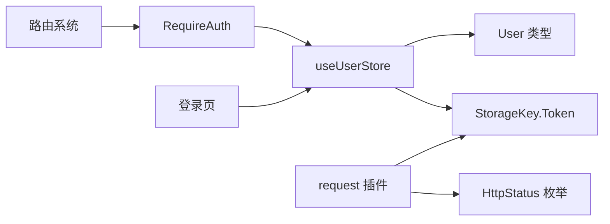

# 用户状态管理

<cite>
**本文引用的文件**
- [src/stores/user.ts](file://src/stores/user.ts)
- [src/stores/index.ts](file://src/stores/index.ts)
- [src/t/ypes/index.ts](file://src/types/index.ts)
- [src/constants/enum.ts](file://src/constants/enum.ts)
- [src/router/guards/RequireAuth.tsx](file://src/router/guards/RequireAuth.tsx)
- [src/router/routes/index.tsx](file://src/router/routes/index.tsx)
- [src/router/routes/auth.tsx](file://src/router/routes/auth.tsx)
- [src/pages/login/index.tsx](file://src/pages/login/index.tsx)
- [src/plugins/request/index.ts](file://src/plugins/request/index.ts)
- [src/router/utils/index.tsx](file://src/router/utils/index.tsx)
- [src/router/index.tsx](file://src/router/index.tsx)
</cite>

## 目录

1. [简介](#简介)
2. [项目结构](#项目结构)
3. [核心组件](#核心组件)
4. [架构总览](#架构总览)
5. [详细组件分析](#详细组件分析)
6. [依赖关系分析](#依赖关系分析)
7. [性能考量](#性能考量)
8. [故障排查指南](#故障排查指南)
9. [结论](#结论)
10. [附录](#附录)

## 简介

本文件面向AI管理平台的用户状态管理，系统性阐述用户store的设计理念与核心功能，覆盖认证状态、权限信息、个人资料等；解析用户状态的数据模型与状态结构；说明登录/登出流程及token的存储与验证机制；分析权限状态维护（角色权限检查与动态权限处理）；并给出路由守卫与组件中使用模式的示例路径，以及与API层的交互与错误处理机制。

## 项目结构

围绕用户状态管理的关键目录与文件如下：

- stores：集中存放全局状态（用户、应用）
- types：统一类型定义（含用户类型）
- constants：常量与枚举（如用户状态、HTTP状态码、存储键名）
- router：路由与守卫（鉴权守卫RequireAuth）
- pages：页面（登录页）
- plugins/request：HTTP请求封装与拦截器（自动注入Authorization头、统一错误处理）

图表来源

- [src/stores/user.ts](file://src/stores/user.ts#L1-L76)
- [src/stores/app.ts](file://src/stores/app.ts#L1-L59)
- [src/types/index.ts](file://src/types/index.ts#L17-L28)
- [src/constants/enum.ts](file://src/constants/enum.ts#L1-L70)
- [src/router/routes/index.tsx](file://src/router/routes/index.tsx#L1-L31)
- [src/router/guards/RequireAuth.tsx](file://src/router/guards/RequireAuth.tsx#L1-L25)
- [src/pages/login/index.tsx](file://src/pages/login/index.tsx#L1-L133)
- [src/plugins/request/index.ts](file://src/plugins/request/index.ts#L1-L114)

章节来源

- [src/stores/user.ts](file://src/stores/user.ts#L1-L76)
- [src/types/index.ts](file://src/types/index.ts#L17-L28)
- [src/constants/enum.ts](file://src/constants/enum.ts#L1-L70)
- [src/router/routes/index.tsx](file://src/router/routes/index.tsx#L1-L31)
- [src/router/guards/RequireAuth.tsx](file://src/router/guards/RequireAuth.tsx#L1-L25)
- [src/pages/login/index.tsx](file://src/pages/login/index.tsx#L1-L133)
- [src/plugins/request/index.ts](file://src/plugins/request/index.ts#L1-L114)

## 核心组件

- 用户状态仓库（useUserStore）
  - 状态字段：userInfo、token、permissions
  - 动作：setUserInfo、setToken、setPermissions、login、logout、hasPermission
  - 持久化策略：仅持久化token与userInfo，避免敏感信息落盘
- 鉴权守卫（RequireAuth）
  - 基于token存在与否进行路由拦截
- 登录页（LoginPage）
  - 使用useUserStore.login完成登录态写入，并跳转首页
- 请求插件（request）
  - 请求前从localStorage读取token并注入Authorization头
  - 统一业务错误提示与HTTP错误分支处理（含401自动清理token并跳转登录）

章节来源

- [src/stores/user.ts](file://src/stores/user.ts#L6-L19)
- [src/stores/user.ts](file://src/stores/user.ts#L21-L75)
- [src/router/guards/RequireAuth.tsx](file://src/router/guards/RequireAuth.tsx#L11-L22)
- [src/pages/login/index.tsx](file://src/pages/login/index.tsx#L32-L50)
- [src/plugins/request/index.ts](file://src/plugins/request/index.ts#L19-L76)

## 架构总览

用户状态管理贯穿“状态层-路由守卫-页面-网络层”的闭环：

- 状态层：useUserStore负责认证态、权限态与用户信息
- 路由守卫：RequireAuth基于token决定是否放行
- 页面：登录页调用store写入token与userInfo
- 网络层：request插件自动携带token并处理401等错误

图表来源

- [src/pages/login/index.tsx](file://src/pages/login/index.tsx#L32-L50)
- [src/router/guards/RequireAuth.tsx](file://src/router/guards/RequireAuth.tsx#L15-L19)
- [src/plugins/request/index.ts](file://src/plugins/request/index.ts#L20-L32)

## 详细组件分析

### 用户状态仓库（useUserStore）

设计理念

- 使用zustand + persist + immer实现轻量、可持久化的状态管理
- 仅持久化token与userInfo，避免将敏感权限列表持久化
- 提供hasPermission用于快速判断权限

状态结构

- userInfo：当前登录用户信息（User类型）
- token：认证令牌
- permissions：权限字符串数组，支持通配符“\*”

动作说明

- setUserInfo：更新用户信息
- setToken：更新token
- setPermissions：设置权限列表
- login：一次性写入userInfo与token
- logout：清空用户态并移除本地token
- hasPermission：判断某权限是否存在，支持“\*”通配

图表来源

- [src/stores/user.ts](file://src/stores/user.ts#L6-L19)
- [src/types/index.ts](file://src/types/index.ts#L17-L28)

章节来源

- [src/stores/user.ts](file://src/stores/user.ts#L21-L75)
- [src/types/index.ts](file://src/types/index.ts#L17-L28)

### 登录与登出流程

登录流程

- 用户在登录页输入凭据
- 调用useUserStore.login写入userInfo与token
- 导航至首页

登出流程

- 调用useUserStore.logout清空用户态
- 移除localStorage中的token
- 由请求拦截器在401时触发跳转登录

图表来源

- [src/pages/login/index.tsx](file://src/pages/login/index.tsx#L32-L50)
- [src/router/routes/index.tsx](file://src/router/routes/index.tsx#L11-L26)

章节来源

- [src/pages/login/index.tsx](file://src/pages/login/index.tsx#L32-L50)
- [src/stores/user.ts](file://src/stores/user.ts#L53-L60)

### 权限状态维护与校验

权限模型

- permissions为字符串数组，支持通配符“\*”
- hasPermission用于判断是否具备某权限

权限检查流程

- 在需要权限的页面或组件中，通过useUserStore.hasPermission进行判断
- 若无权限，可结合路由meta.permission或UI控制隐藏/禁用

图表来源

- [src/stores/user.ts](file://src/stores/user.ts#L62-L65)

章节来源

- [src/stores/user.ts](file://src/stores/user.ts#L62-L65)

### 路由守卫与组件使用模式

路由守卫（RequireAuth）

- 读取token，若为空则重定向至登录页
- 否则放行子路由

组件使用模式

- 在页面或布局中包裹RequireAuth
- 在需要权限的组件中调用hasPermission进行渲染控制

图表来源

- [src/router/routes/index.tsx](file://src/router/routes/index.tsx#L11-L26)
- [src/router/guards/RequireAuth.tsx](file://src/router/guards/RequireAuth.tsx#L15-L19)

章节来源

- [src/router/guards/RequireAuth.tsx](file://src/router/guards/RequireAuth.tsx#L11-L22)
- [src/router/routes/index.tsx](file://src/router/routes/index.tsx#L9-L28)

### 与API层的交互与错误处理

请求拦截器

- 自动从localStorage读取token并注入Authorization头
- 对业务错误（success或code=200）透传数据，否则统一错误提示

响应拦截器

- 业务错误：提示并reject
- HTTP错误：
  - 401：提示“登录已过期”，清理token并跳转登录
  - 403：提示“没有权限访问”
  - 404：提示“请求的资源不存在”
  - 500：提示“服务器内部错误”
  - 其他：提示网络错误

图表来源

- [src/plugins/request/index.ts](file://src/plugins/request/index.ts#L19-L76)

章节来源

- [src/plugins/request/index.ts](file://src/plugins/request/index.ts#L19-L76)

## 依赖关系分析

- useUserStore依赖User类型与StorageKey枚举（间接通过localStorage键名）
- RequireAuth依赖useUserStore的token状态
- 登录页依赖useUserStore的login动作
- 路由系统依赖RequireAuth守卫
- request插件依赖localStorage键名与HTTP状态码枚举

图表来源

- [src/stores/user.ts](file://src/stores/user.ts#L1-L76)
- [src/types/index.ts](file://src/types/index.ts#L17-L28)
- [src/constants/enum.ts](file://src/constants/enum.ts#L63-L69)
- [src/router/guards/RequireAuth.tsx](file://src/router/guards/RequireAuth.tsx#L1-L25)
- [src/pages/login/index.tsx](file://src/pages/login/index.tsx#L1-L133)
- [src/plugins/request/index.ts](file://src/plugins/request/index.ts#L1-L114)

章节来源

- [src/stores/user.ts](file://src/stores/user.ts#L1-L76)
- [src/constants/enum.ts](file://src/constants/enum.ts#L63-L69)
- [src/plugins/request/index.ts](file://src/plugins/request/index.ts#L1-L114)

## 性能考量

- 状态粒度：仅持久化token与userInfo，降低持久化开销与安全风险
- 渲染优化：useUserStore按需订阅token与权限，避免无关组件重渲染
- 请求缓存：可在request层引入缓存策略（如按URL+参数组合缓存），减少重复请求
- 权限判断：hasPermission为O(n)线性查找，建议在权限量较大时考虑Set结构或预构建索引

## 故障排查指南

常见问题与定位

- 无法进入受保护页面
  - 检查localStorage中是否存在token
  - 确认useUserStore.token是否正确写入
- 登录后仍被重定向到登录页
  - 检查login动作是否调用成功
  - 确认路由守卫逻辑未误判
- 请求401频繁出现
  - 检查服务端token有效期与刷新策略
  - 确认请求拦截器是否正确注入Authorization头
- 权限判断不生效
  - 检查permissions数组是否正确设置
  - 确认通配符“\*”是否包含

章节来源

- [src/router/guards/RequireAuth.tsx](file://src/router/guards/RequireAuth.tsx#L15-L19)
- [src/plugins/request/index.ts](file://src/plugins/request/index.ts#L52-L72)
- [src/stores/user.ts](file://src/stores/user.ts#L62-L65)

## 结论

本方案以zustand为核心，结合persist与immer实现轻量、可持久化的用户状态管理；通过RequireAuth实现基于token的路由级鉴权；借助request插件实现统一的认证头注入与错误处理。权限模型采用字符串数组与通配符“\*”，满足基础权限控制需求。整体架构清晰、职责分离明确，便于扩展与维护。

## 附录

- 示例路径参考
  - 登录页写入用户态：[src/pages/login/index.tsx](file://src/pages/login/index.tsx#L32-L50)
  - 路由守卫使用：[src/router/routes/index.tsx](file://src/router/routes/index.tsx#L11-L26)
  - 权限判断：[src/stores/user.ts](file://src/stores/user.ts#L62-L65)
  - 请求拦截器注入token：[src/plugins/request/index.ts](file://src/plugins/request/index.ts#L20-L32)
  - 401自动清理与跳转：[src/plugins/request/index.ts](file://src/plugins/request/index.ts#L52-L57)
