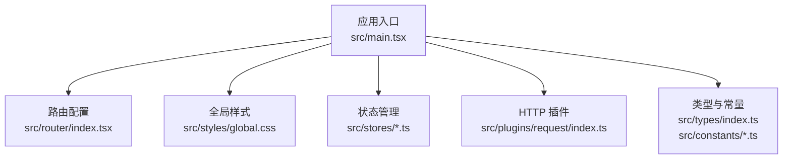
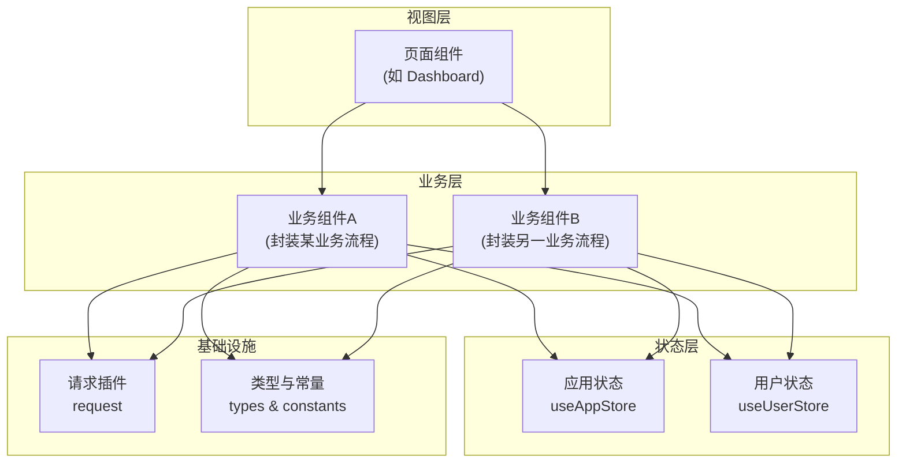
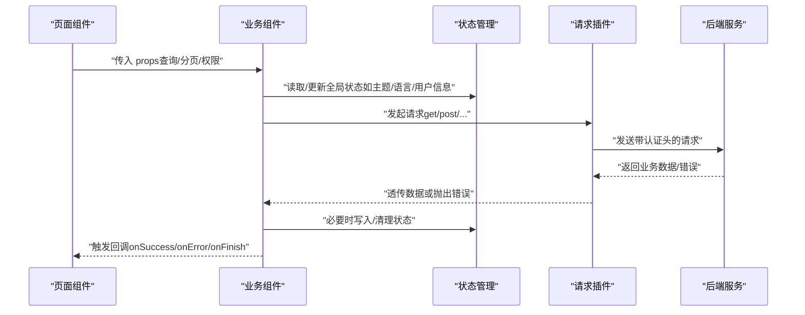
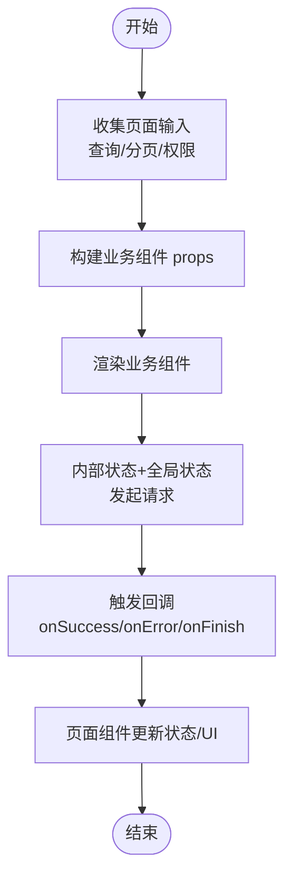
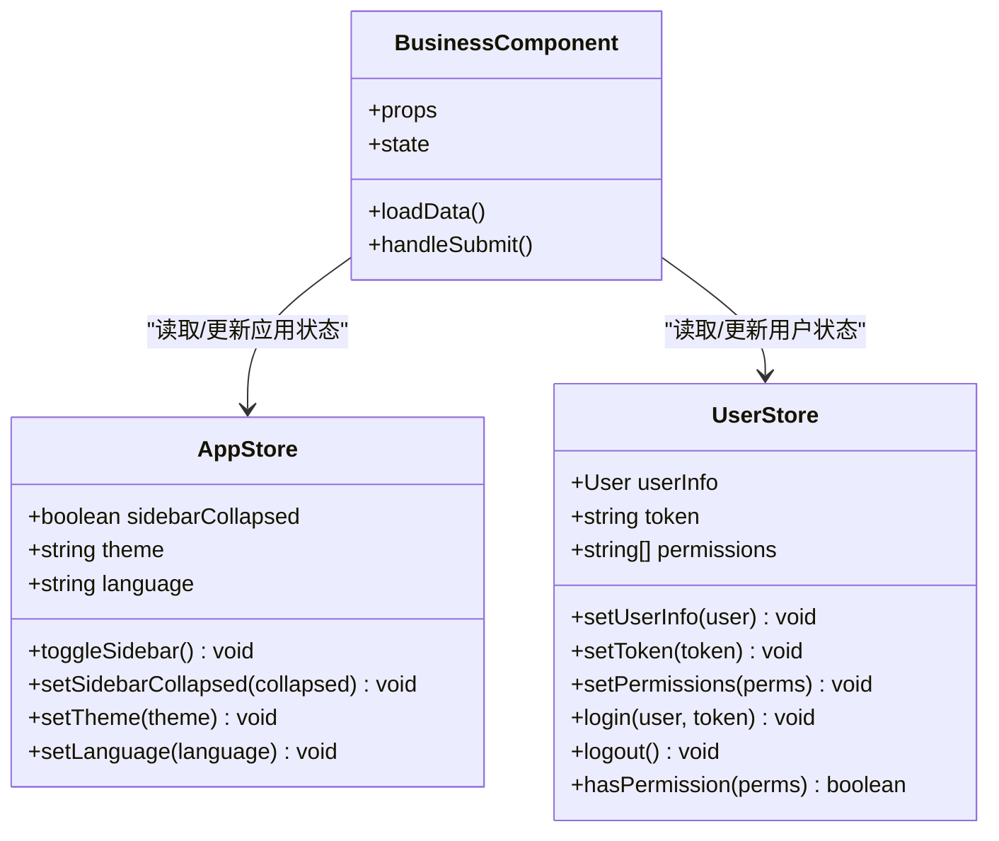
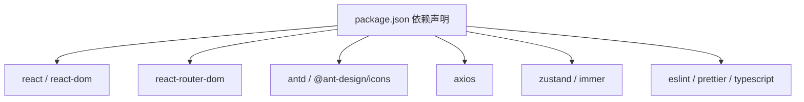

# 业务组件开发

<cite>
**本文引用的文件**
- [src/main.tsx](file://src/main.tsx)
- [src/router/index.tsx](file://src/router/index.tsx)
- [src/plugins/request/index.ts](file://src/plugins/request/index.ts)
- [src/stores/app.ts](file://src/stores/app.ts)
- [src/stores/user.ts](file://src/stores/user.ts)
- [src/stores/index.ts](file://src/stores/index.ts)
- [src/constants/config.ts](file://src/constants/config.ts)
- [src/constants/enum.ts](file://src/constants/enum.ts)
- [src/types/index.ts](file://src/types/index.ts)
- [package.json](file://package.json)
- [tsconfig.json](file://tsconfig.json)
</cite>

## 目录

1. [引言](#引言)
2. [项目结构](#项目结构)
3. [核心组件](#核心组件)
4. [架构总览](#架构总览)
5. [详细组件分析](#详细组件分析)
6. [依赖分析](#依赖分析)
7. [性能考虑](#性能考虑)
8. [故障排查指南](#故障排查指南)
9. [结论](#结论)
10. [附录](#附录)

## 引言

本文件面向“AI管理平台”的前端工程，聚焦于“业务组件”的设计原则与开发规范，系统阐述以下内容：

- 业务组件的职责边界、接口设计与数据流向
- 业务组件与页面组件的协作模式（props 传递与事件回调）
- 业务组件的复用机制（通用业务逻辑抽象与可配置参数）
- 状态管理策略（局部状态与全局状态的协同）
- 测试策略（单元测试与集成测试）
- 开发模板与参考路径（以仓库现有实现为依据）

## 项目结构

项目采用按功能域与职责分层的组织方式：入口应用、路由、状态管理、插件化请求、类型与常量等模块清晰分离。业务组件通常位于页面组件之下，封装具体业务逻辑，并通过 props 与事件与页面交互。

图表来源

- [src/main.tsx](file://src/main.tsx#L1-L32)
- [src/router/index.tsx](file://src/router/index.tsx#L1-L9)
- [src/plugins/request/index.ts](file://src/plugins/request/index.ts#L1-L114)
- [src/stores/app.ts](file://src/stores/app.ts#L1-L59)
- [src/stores/user.ts](file://src/stores/user.ts#L1-L76)
- [src/types/index.ts](file://src/types/index.ts#L1-L101)
- [src/constants/config.ts](file://src/constants/config.ts#L1-L76)

章节来源

- [src/main.tsx](file://src/main.tsx#L1-L32)
- [src/router/index.tsx](file://src/router/index.tsx#L1-L9)
- [package.json](file://package.json#L1-L81)
- [tsconfig.json](file://tsconfig.json#L1-L24)

## 核心组件

本节从“业务组件”的角度，梳理与之直接相关的基础设施与约定，作为后续设计与开发的基线。

- 状态管理（Zustand + Immer + Persist）
  - 应用级状态：侧边栏折叠、主题、语言
  - 用户级状态：用户信息、Token、权限集合、登录/登出、权限校验
  - 参考路径：[应用状态](file://src/stores/app.ts#L1-L59)、[用户状态](file://src/stores/user.ts#L1-L76)、[导出聚合](file://src/stores/index.ts#L1-L3)

- 请求插件（Axios + 拦截器）
  - 统一添加 Authorization 头
  - 统一处理业务成功/失败与各类 HTTP 错误
  - 提供 get/post/put/delete/patch 方法
  - 参考路径：[请求插件](file://src/plugins/request/index.ts#L1-L114)

- 类型与常量
  - 全局类型：分页、表格列、表单字段、API 响应、错误等
  - 配置项：应用默认分页、路由白名单、请求超时与重试、正则与日期格式
  - 枚举：用户状态、订单状态、性别、主题、语言、HTTP 状态、存储键
  - 参考路径：[类型定义](file://src/types/index.ts#L1-L101)、[配置](file://src/constants/config.ts#L1-L76)、[枚举](file://src/constants/enum.ts#L1-L70)

- 路由与入口
  - 路由集中配置与创建
  - 应用根节点注入国际化与主题
  - 参考路径：[路由](file://src/router/index.tsx#L1-L9)、[入口](file://src/main.tsx#L1-L32)

章节来源

- [src/stores/app.ts](file://src/stores/app.ts#L1-L59)
- [src/stores/user.ts](file://src/stores/user.ts#L1-L76)
- [src/stores/index.ts](file://src/stores/index.ts#L1-L3)
- [src/plugins/request/index.ts](file://src/plugins/request/index.ts#L1-L114)
- [src/types/index.ts](file://src/types/index.ts#L1-L101)
- [src/constants/config.ts](file://src/constants/config.ts#L1-L76)
- [src/constants/enum.ts](file://src/constants/enum.ts#L1-L70)
- [src/router/index.tsx](file://src/router/index.tsx#L1-L9)
- [src/main.tsx](file://src/main.tsx#L1-L32)

## 架构总览

下图展示业务组件在整体中的位置与交互关系：页面组件负责视图与用户交互；业务组件封装业务逻辑与数据流；状态管理提供全局共享状态；请求插件统一处理网络层；类型与常量提供契约与默认值。

图表来源

- [src/stores/app.ts](file://src/stores/app.ts#L1-L59)
- [src/stores/user.ts](file://src/stores/user.ts#L1-L76)
- [src/plugins/request/index.ts](file://src/plugins/request/index.ts#L1-L114)
- [src/types/index.ts](file://src/types/index.ts#L1-L101)
- [src/constants/config.ts](file://src/constants/config.ts#L1-L76)

## 详细组件分析

### 设计原则与职责边界

- 单一职责：每个业务组件聚焦一个明确的业务场景或流程片段
- 可配置性：通过 props 对行为进行参数化控制（如分页、过滤、渲染开关）
- 可复用性：将通用逻辑抽象为可复用的 Hook 或工具函数，避免重复代码
- 可观测性：对关键操作与错误进行日志或提示，保证用户体验与可诊断性

### 接口设计与数据流向

- 输入接口（props）
  - 必需参数：业务主键、查询条件、分页参数、权限标识等
  - 可选参数：渲染控制、回调钩子、加载态、空态配置
- 输出接口（事件/回调）
  - 数据变更：onSuccess/onError/onFinish
  - 用户交互：onReload/onFilter/onPageChange/onSubmit
- 数据流向
  - 页面组件负责收集用户输入与状态变更
  - 业务组件内部组合状态与全局状态，调用请求插件发起网络请求
  - 请求插件统一处理错误与成功，业务组件根据结果更新内部状态并触发回调

图表来源

- [src/plugins/request/index.ts](file://src/plugins/request/index.ts#L1-L114)
- [src/stores/app.ts](file://src/stores/app.ts#L1-L59)
- [src/stores/user.ts](file://src/stores/user.ts#L1-L76)

章节来源

- [src/plugins/request/index.ts](file://src/plugins/request/index.ts#L1-L114)
- [src/stores/app.ts](file://src/stores/app.ts#L1-L59)
- [src/stores/user.ts](file://src/stores/user.ts#L1-L76)
- [src/types/index.ts](file://src/types/index.ts#L1-L101)

### 业务组件与页面组件的协作模式

- Props 传递
  - 页面组件向业务组件传递查询条件、分页参数、渲染配置、权限标识
  - 业务组件内部使用这些 props 组合为请求参数，或决定 UI 渲染策略
- 事件回调
  - 业务组件通过回调向上反馈数据加载状态、成功/失败、完成等
  - 页面组件监听回调并更新自身状态或触发其他副作用

图表来源

- [src/plugins/request/index.ts](file://src/plugins/request/index.ts#L1-L114)
- [src/stores/app.ts](file://src/stores/app.ts#L1-L59)
- [src/stores/user.ts](file://src/stores/user.ts#L1-L76)

章节来源

- [src/plugins/request/index.ts](file://src/plugins/request/index.ts#L1-L114)
- [src/stores/app.ts](file://src/stores/app.ts#L1-L59)
- [src/stores/user.ts](file://src/stores/user.ts#L1-L76)

### 复用机制与可配置参数

- 通用业务逻辑抽象
  - 将“分页查询”“列表渲染”“表单提交”“权限校验”等抽象为可复用的 Hook 或工具函数
  - 通过 Hook 返回状态、动作与派生数据，降低页面组件负担
- 可配置参数设计
  - 使用类型系统约束参数合法性（如分页、排序、筛选）
  - 通过默认值与可选参数实现灵活配置，同时保持最小可用参数集

章节来源

- [src/types/index.ts](file://src/types/index.ts#L1-L101)
- [src/constants/config.ts](file://src/constants/config.ts#L1-L76)
- [src/constants/enum.ts](file://src/constants/enum.ts#L1-L70)

### 状态管理策略

- 局部状态
  - 业务组件内部使用 useState/useReducer 管理 UI 相关状态（如加载中、错误信息、临时表单值）
- 全局状态
  - 应用级状态（主题、语言、侧边栏）与用户级状态（用户信息、Token、权限）通过 Zustand 管理
  - 业务组件通过 Hook 读取/更新全局状态，确保跨页面一致性
- 协同与持久化
  - 使用 persist 中间件持久化关键状态（如 Token、主题、语言），提升用户体验

图表来源

- [src/stores/app.ts](file://src/stores/app.ts#L1-L59)
- [src/stores/user.ts](file://src/stores/user.ts#L1-L76)

章节来源

- [src/stores/app.ts](file://src/stores/app.ts#L1-L59)
- [src/stores/user.ts](file://src/stores/user.ts#L1-L76)
- [src/stores/index.ts](file://src/stores/index.ts#L1-L3)

### 测试策略

- 单元测试
  - 针对纯函数与 Hook 的行为进行断言，覆盖正常路径与异常路径
  - 使用内存状态模拟（Mock Store）与假请求（Mock Request）隔离外部依赖
- 集成测试
  - 在页面组件中集成业务组件，验证 props 传递、回调触发与 UI 更新
  - 使用真实请求插件与最小化后端环境，验证端到端流程
- 最佳实践
  - 为每个业务组件编写独立的测试文件，命名与路径与被测组件一致
  - 使用快照测试记录 UI 结构变化，结合交互测试验证用户流程

（本节为通用测试指导，不直接分析具体源码文件）

### 开发模板与参考路径

- 业务组件开发模板（步骤建议）
  - 定义 props 类型与默认值（参考类型定义）
  - 组合局部状态与全局状态（参考状态管理）
  - 编排请求流程（参考请求插件）
  - 触发回调与错误处理（参考请求插件与类型）
  - 暴露最小可用 API，保持可配置性
- 参考实现路径
  - 请求封装与拦截器：[请求插件](file://src/plugins/request/index.ts#L1-L114)
  - 应用状态与用户状态：[应用状态](file://src/stores/app.ts#L1-L59)、[用户状态](file://src/stores/user.ts#L1-L76)
  - 类型与常量：[类型定义](file://src/types/index.ts#L1-L101)、[配置](file://src/constants/config.ts#L1-L76)、[枚举](file://src/constants/enum.ts#L1-L70)

章节来源

- [src/plugins/request/index.ts](file://src/plugins/request/index.ts#L1-L114)
- [src/stores/app.ts](file://src/stores/app.ts#L1-L59)
- [src/stores/user.ts](file://src/stores/user.ts#L1-L76)
- [src/types/index.ts](file://src/types/index.ts#L1-L101)
- [src/constants/config.ts](file://src/constants/config.ts#L1-L76)
- [src/constants/enum.ts](file://src/constants/enum.ts#L1-L70)

## 依赖分析

- 技术栈与版本
  - React、React Router、Ant Design、Axios、Zustand、Immer、Prettier、ESLint、TypeScript
  - 参考路径：[依赖声明](file://package.json#L20-L36)
- TypeScript 配置
  - 路径别名、严格模式、JSX 支持、模块解析策略
  - 参考路径：[TS 配置](file://tsconfig.json#L1-L24)

图表来源

- [package.json](file://package.json#L20-L36)
- [tsconfig.json](file://tsconfig.json#L1-L24)

章节来源

- [package.json](file://package.json#L1-L81)
- [tsconfig.json](file://tsconfig.json#L1-L24)

## 性能考虑

- 状态粒度与订阅范围
  - 将全局状态按领域拆分，避免不必要的重渲染
- 请求缓存与去抖
  - 对高频查询使用防抖/节流与本地缓存，减少无效请求
- 渲染优化
  - 使用 React.memo/useMemo/useCallback 控制渲染范围
- 分页与懒加载
  - 利用默认分页与滚动懒加载，降低初始负载

（本节为通用性能指导，不直接分析具体源码文件）

## 故障排查指南

- 请求失败与鉴权问题
  - 检查请求插件是否正确设置 Authorization 头
  - 关注响应拦截器对 401/403/404/500 的处理与提示
  - 参考路径：[请求插件](file://src/plugins/request/index.ts#L1-L114)
- 状态不同步
  - 确认状态持久化配置与键名一致
  - 检查全局状态更新动作是否正确触发
  - 参考路径：[应用状态](file://src/stores/app.ts#L1-L59)、[用户状态](file://src/stores/user.ts#L1-L76)
- 类型不匹配
  - 对照类型定义修正参数与返回值
  - 参考路径：[类型定义](file://src/types/index.ts#L1-L101)

章节来源

- [src/plugins/request/index.ts](file://src/plugins/request/index.ts#L1-L114)
- [src/stores/app.ts](file://src/stores/app.ts#L1-L59)
- [src/stores/user.ts](file://src/stores/user.ts#L1-L76)
- [src/types/index.ts](file://src/types/index.ts#L1-L101)

## 结论

业务组件应以“单一职责、可配置、可复用、可观测”为核心设计原则，通过清晰的 props/回调契约与类型约束，与页面组件高效协作；借助全局状态与请求插件，实现一致的用户体验与稳定的业务流程。遵循本文的开发模板与测试策略，可在保证质量的同时提升交付效率。

## 附录

- 关键实现参考路径汇总
  - 请求插件：[请求插件](file://src/plugins/request/index.ts#L1-L114)
  - 应用状态：[应用状态](file://src/stores/app.ts#L1-L59)
  - 用户状态：[用户状态](file://src/stores/user.ts#L1-L76)
  - 类型与常量：[类型定义](file://src/types/index.ts#L1-L101)、[配置](file://src/constants/config.ts#L1-L76)、[枚举](file://src/constants/enum.ts#L1-L70)
  - 路由与入口：[路由](file://src/router/index.tsx#L1-L9)、[入口](file://src/main.tsx#L1-L32)
