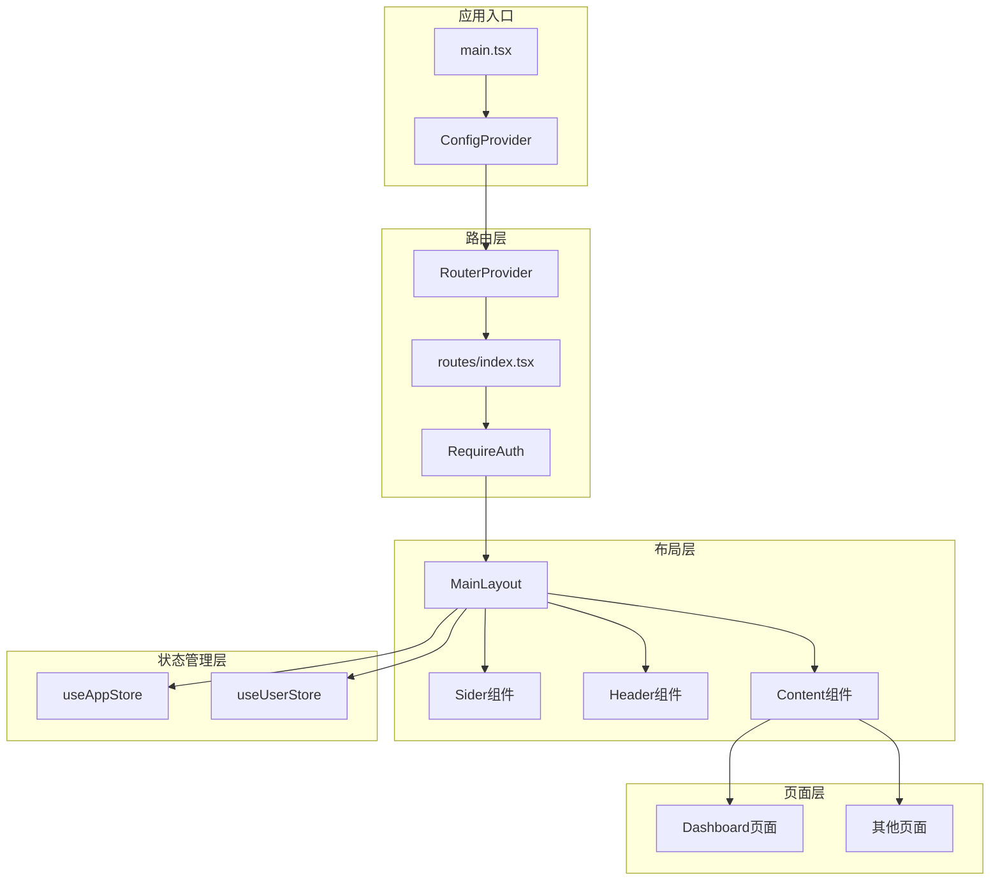
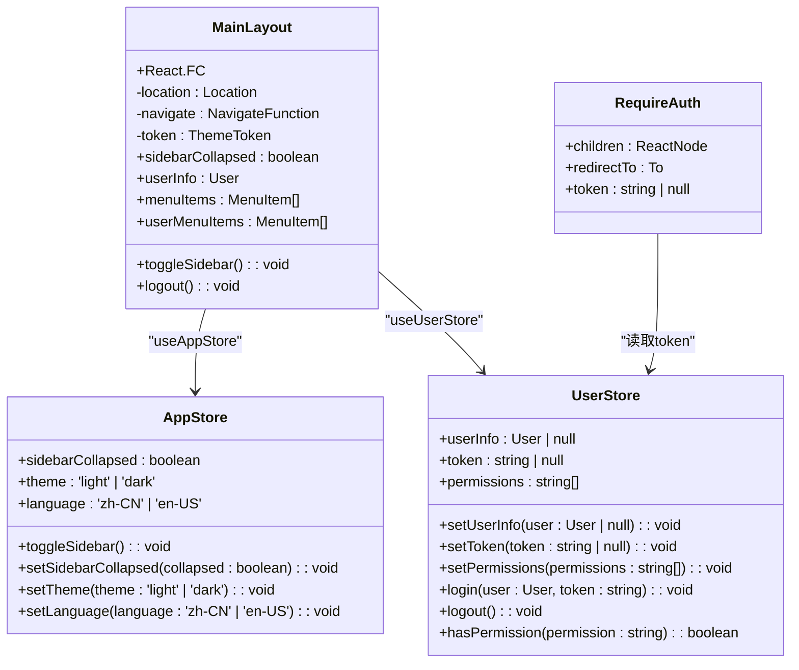
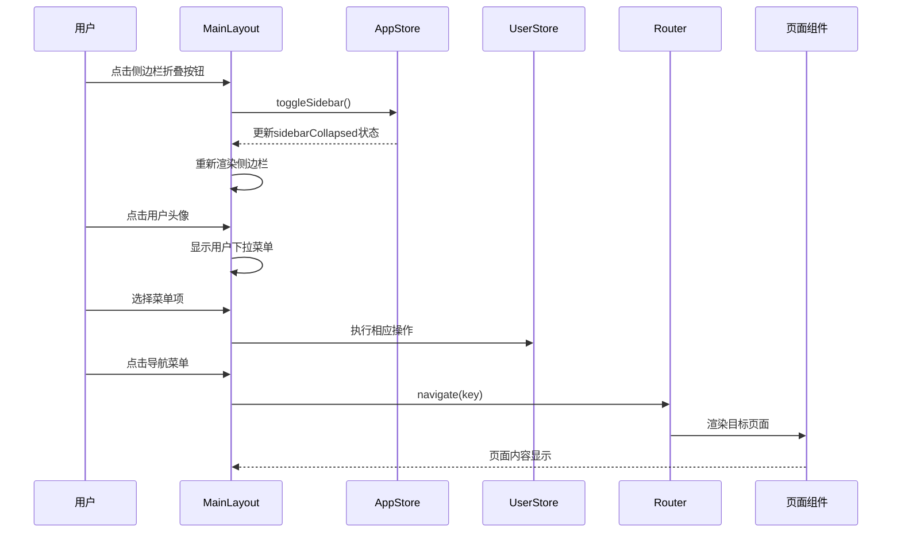
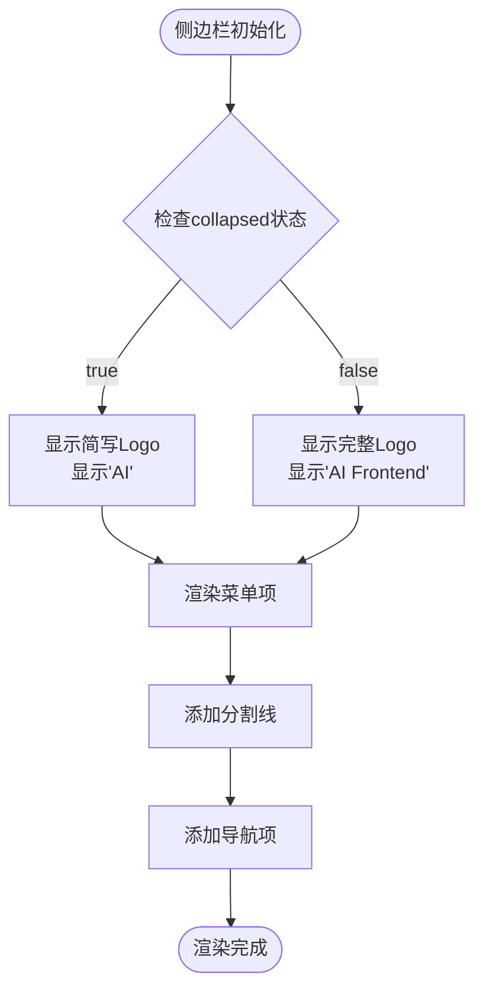
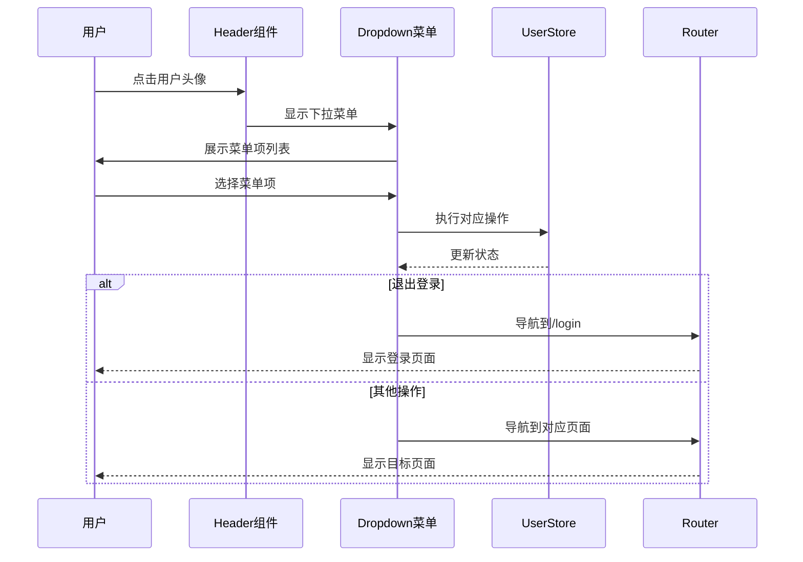
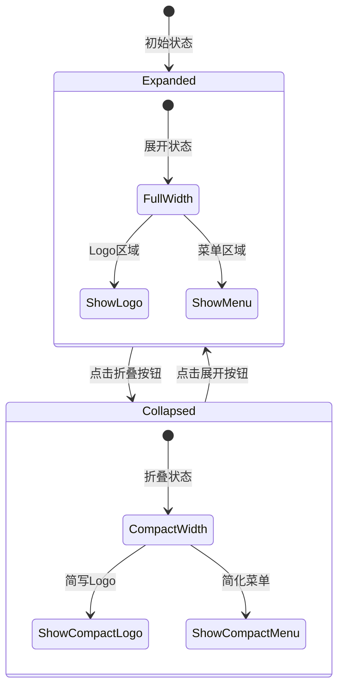
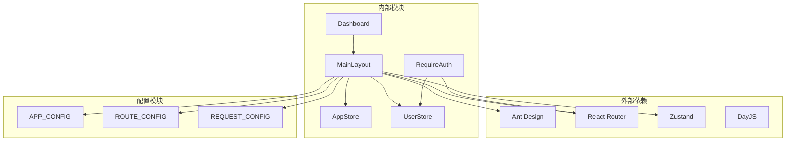
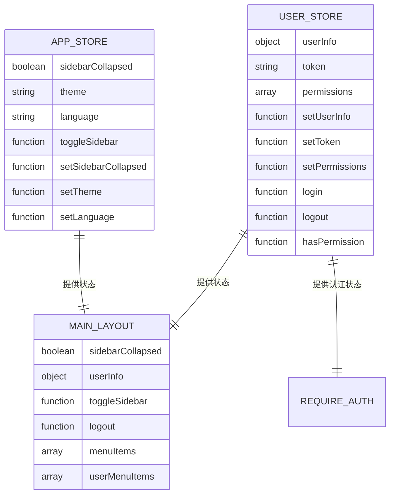

# 布局组件设计

<cite>
**本文档引用的文件**
- [MainLayout.tsx](file://src/layouts/MainLayout.tsx)
- [app.ts](file://src/stores/app.ts)
- [user.ts](file://src/stores/user.ts)
- [index.tsx](file://src/router/routes/index.tsx)
- [config.ts](file://src/constants/config.ts)
- [index.tsx](file://src/router/routes/dashboard.tsx)
- [index.ts](file://src/router/utils/index.tsx)
- [index.tsx](file://src/router/guards/RequireAuth.tsx)
- [index.tsx](file://src/main.tsx)
- [index.ts](file://src/types/index.ts)
- [index.tsx](file://src/pages/dashboard/index.tsx)
</cite>

## 目录

1. [引言](#引言)
2. [项目结构](#项目结构)
3. [核心组件](#核心组件)
4. [架构概览](#架构概览)
5. [详细组件分析](#详细组件分析)
6. [依赖关系分析](#依赖关系分析)
7. [性能考虑](#性能考虑)
8. [故障排除指南](#故障排除指南)
9. [结论](#结论)
10. [附录](#附录)

## 引言

本设计文档专注于AI管理平台的布局组件设计，重点分析MainLayout组件作为根布局的设计理念和实现细节。该布局组件采用Ant Design的Layout组件体系，实现了响应式布局、主题色值动态获取和样式计算等功能。文档将深入解析Sider侧边栏、Header头部区域和Content内容区域的职责划分，以及布局组件与状态管理的集成方式。

## 项目结构

AI管理平台采用模块化的项目结构，布局组件位于`src/layouts/`目录下，配合状态管理、路由配置和类型定义形成完整的前端架构。



**图表来源**

- [main.tsx](file://src/main.tsx#L17-L31)
- [index.tsx](file://src/router/routes/index.tsx#L9-L28)
- [MainLayout.tsx](file://src/layouts/MainLayout.tsx#L73-L170)

**章节来源**

- [main.tsx](file://src/main.tsx#L1-L32)
- [index.tsx](file://src/router/routes/index.tsx#L1-L31)

## 核心组件

### MainLayout组件架构

MainLayout作为应用的根布局组件，采用了Ant Design的Layout组件体系，实现了以下核心功能：

#### 布局结构设计

- **整体布局**：采用`<Layout style={{ height: '100vh' }}>`确保全屏高度
- **区域划分**：Sider侧边栏 + Header头部 + Content内容区域的三栏布局
- **响应式适配**：支持侧边栏折叠展开，适应不同屏幕尺寸

#### 状态管理集成

- **应用状态**：通过`useAppStore`管理侧边栏折叠状态、主题和语言
- **用户状态**：通过`useUserStore`管理用户信息、token和权限
- **主题集成**：使用`theme.useToken()`动态获取Ant Design主题变量

**章节来源**

- [MainLayout.tsx](file://src/layouts/MainLayout.tsx#L18-L174)
- [app.ts](file://src/stores/app.ts#L18-L58)
- [user.ts](file://src/stores/user.ts#L21-L75)

## 架构概览

### 组件层次结构



**图表来源**

- [MainLayout.tsx](file://src/layouts/MainLayout.tsx#L18-L61)
- [app.ts](file://src/stores/app.ts#L5-L16)
- [user.ts](file://src/stores/user.ts#L6-L19)
- [index.tsx](file://src/router/guards/RequireAuth.tsx#L6-L15)

### 数据流架构



**图表来源**

- [MainLayout.tsx](file://src/layouts/MainLayout.tsx#L119-L125)
- [MainLayout.tsx](file://src/layouts/MainLayout.tsx#L48-L61)
- [app.ts](file://src/stores/app.ts#L25-L29)
- [user.ts](file://src/stores/user.ts#L53-L60)

**章节来源**

- [MainLayout.tsx](file://src/layouts/MainLayout.tsx#L18-L174)
- [app.ts](file://src/stores/app.ts#L18-L58)
- [user.ts](file://src/stores/user.ts#L21-L75)

## 详细组件分析

### Sider侧边栏组件

#### 设计理念

Sider侧边栏作为应用的主要导航容器，承担着以下职责：

- **品牌展示**：顶部区域显示应用Logo，支持折叠状态下的简化显示
- **导航功能**：提供主要功能模块的快捷访问
- **状态指示**：根据当前选中状态高亮对应菜单项

#### 实现细节

- **折叠控制**：通过`collapsible`和`collapsed`属性实现折叠展开
- **样式计算**：使用`theme.useToken()`动态获取主题色值
- **阴影效果**：添加右侧阴影增强视觉层次感



**图表来源**

- [MainLayout.tsx](file://src/layouts/MainLayout.tsx#L75-L104)
- [MainLayout.tsx](file://src/layouts/MainLayout.tsx#L95-L96)

**章节来源**

- [MainLayout.tsx](file://src/layouts/MainLayout.tsx#L75-L104)

### Header头部组件

#### 功能特性

Header区域集成了多种用户交互功能：

- **侧边栏控制**：动态切换折叠/展开图标
- **通知系统**：显示消息提醒数量
- **用户面板**：提供用户信息管理和退出登录功能

#### 用户菜单设计

用户菜单采用Ant Design的Dropdown组件，支持以下功能：

- **个人中心**：跳转到用户个人信息页面
- **系统设置**：进入系统配置界面
- **退出登录**：清理用户状态并返回登录页



**图表来源**

- [MainLayout.tsx](file://src/layouts/MainLayout.tsx#L133-L152)
- [MainLayout.tsx](file://src/layouts/MainLayout.tsx#L48-L61)

**章节来源**

- [MainLayout.tsx](file://src/layouts/MainLayout.tsx#L108-L154)

### Content内容区域

#### 设计原则

Content区域作为页面内容的容器，遵循以下设计原则：

- **统一样式**：使用主题色值确保视觉一致性
- **响应式布局**：支持不同屏幕尺寸的自适应
- **滚动处理**：提供良好的滚动体验

#### 样式计算机制

Content区域的样式通过`theme.useToken()`动态计算：

- **背景色**：使用`token.colorBgContainer`
- **圆角半径**：使用`token.borderRadiusLG`
- **阴影效果**：使用`token.boxShadowSecondary`

**章节来源**

- [MainLayout.tsx](file://src/layouts/MainLayout.tsx#L156-L168)

### 响应式布局实现

#### 侧边栏折叠逻辑

布局组件实现了完整的响应式折叠机制：



**图表来源**

- [MainLayout.tsx](file://src/layouts/MainLayout.tsx#L75-L104)
- [app.ts](file://src/stores/app.ts#L25-L29)

#### 主题色值动态获取

组件通过Ant Design的`theme.useToken()`钩子实现主题色值的动态获取：

- **颜色变量**：`token.colorPrimary`、`token.colorBgContainer`
- **边框变量**：`token.colorBorderSecondary`
- **圆角变量**：`token.borderRadiusLG`

**章节来源**

- [MainLayout.tsx](file://src/layouts/MainLayout.tsx#L21-L24)
- [MainLayout.tsx](file://src/layouts/MainLayout.tsx#L79-L81)

### 状态管理集成

#### Zustand状态管理

布局组件采用Zustand进行状态管理，实现了以下功能：

```mermaid
graph LR
subgraph "应用状态"
AppStore[useAppStore]
SidebarState[sidebarCollapsed: boolean]
ThemeState[theme: 'light' | 'dark']
LanguageState[language: 'zh-CN' | 'en-US']
end
subgraph "用户状态"
UserStore[useUserStore]
UserInfo[userInfo: User | null]
TokenState[token: string | null]
PermissionState[permissions: string[]]
end
subgraph "组件集成"
MainLayout[MainLayout组件]
Sider[Sider组件]
Header[Header组件]
Content[Content组件]
end
AppStore --> MainLayout
UserStore --> MainLayout
AppStore --> Sider
UserStore --> Header
AppStore --> Content
MainLayout --> SidebarState
MainLayout --> ThemeState
MainLayout --> LanguageState
MainLayout --> UserInfo
MainLayout --> TokenState
MainLayout --> PermissionState
```

**图表来源**

- [app.ts](file://src/stores/app.ts#L18-L58)
- [user.ts](file://src/stores/user.ts#L21-L75)
- [MainLayout.tsx](file://src/layouts/MainLayout.tsx#L23-L24)

#### 全局状态控制机制

- **持久化存储**：使用`persist`中间件实现状态持久化
- **Immer优化**：使用`immer`中间件简化状态更新逻辑
- **选择器模式**：通过状态选择器减少不必要的重渲染

**章节来源**

- [app.ts](file://src/stores/app.ts#L18-L58)
- [user.ts](file://src/stores/user.ts#L21-L75)

### 可扩展性设计

#### 菜单项动态生成机制

布局组件预留了菜单项动态生成的扩展点：

- **注释标记**：`// AI生成的新菜单项将添加在这里`
- **类型安全**：基于`MenuItem`接口定义菜单结构
- **路由集成**：菜单项与路由系统无缝对接

#### 用户菜单配置化管理

用户菜单采用配置化设计，便于维护和扩展：

- **菜单项结构**：统一的`MenuItem`接口定义
- **权限控制**：支持基于权限的菜单项显示控制
- **国际化支持**：便于实现多语言菜单

**章节来源**

- [MainLayout.tsx](file://src/layouts/MainLayout.tsx#L27-L45)
- [MainLayout.tsx](file://src/layouts/MainLayout.tsx#L64-L71)
- [index.ts](file://src/types/index.ts#L39-L47)

## 依赖关系分析

### 组件依赖图



**图表来源**

- [MainLayout.tsx](file://src/layouts/MainLayout.tsx#L1-L14)
- [index.tsx](file://src/router/guards/RequireAuth.tsx#L1-L5)
- [config.ts](file://src/constants/config.ts#L4-L45)

### 状态依赖关系



**图表来源**

- [app.ts](file://src/stores/app.ts#L5-L16)
- [user.ts](file://src/stores/user.ts#L6-L19)
- [MainLayout.tsx](file://src/layouts/MainLayout.tsx#L23-L24)

**章节来源**

- [index.tsx](file://src/router/routes/index.tsx#L1-L31)
- [config.ts](file://src/constants/config.ts#L1-L76)

## 性能考虑

### 渲染优化策略

- **状态分离**：将应用状态和用户状态分离，避免不必要的重渲染
- **选择器模式**：使用状态选择器只订阅需要的状态变化
- **懒加载机制**：页面组件采用React.lazy实现按需加载

### 内存管理

- **状态持久化**：关键状态通过localStorage持久化存储
- **清理机制**：退出登录时清理所有用户相关状态
- **资源释放**：组件卸载时自动清理事件监听器

## 故障排除指南

### 常见问题及解决方案

#### 侧边栏不响应折叠

- **检查状态同步**：确认`useAppStore`中的`sidebarCollapsed`状态正确更新
- **验证事件绑定**：检查`toggleSidebar`函数是否正确绑定到按钮点击事件
- **样式冲突排查**：检查是否有CSS样式覆盖导致的视觉问题

#### 用户菜单显示异常

- **权限验证**：确认`useUserStore`中的`permissions`状态正确设置
- **菜单项配置**：检查`userMenuItems`数组的结构和数据类型
- **路由配置**：验证目标路由是否存在且可访问

#### 主题色值不生效

- **Ant Design版本**：确认使用的Ant Design版本支持主题定制
- **ConfigProvider配置**：检查`main.tsx`中的`ConfigProvider`配置
- **Token获取时机**：确保在组件渲染后才调用`theme.useToken()`

**章节来源**

- [app.ts](file://src/stores/app.ts#L25-L29)
- [user.ts](file://src/stores/user.ts#L53-L60)
- [index.tsx](file://src/router/guards/RequireAuth.tsx#L15-L21)

## 结论

AI管理平台的MainLayout布局组件设计体现了现代前端架构的最佳实践：

### 设计优势

- **模块化架构**：清晰的组件层次和职责划分
- **状态管理**：采用Zustand实现轻量级状态管理
- **主题集成**：深度集成Ant Design主题系统
- **响应式设计**：完善的响应式布局实现
- **可扩展性**：预留充足的扩展点和配置空间

### 技术亮点

- **动态样式计算**：通过`theme.useToken()`实现主题色值的动态获取
- **状态持久化**：关键状态通过localStorage实现持久化存储
- **权限控制**：基于用户权限的菜单项显示控制
- **国际化支持**：为多语言环境预留扩展空间

### 改进建议

- **菜单权限**：可以增加基于权限的菜单项动态生成
- **主题切换**：支持运行时主题切换功能
- **多语言**：完善国际化菜单项支持
- **性能监控**：增加组件渲染性能监控机制

## 附录

### 使用示例

#### 基本使用

```typescript
// 在路由配置中使用MainLayout
{
  path: '/',
  element: <MainLayout />,
  children: [
    {
      index: true,
      element: <Navigate to="/dashboard" replace />,
    },
    ...dashboardRoutes,
  ],
}
```

#### 自定义指南

##### 修改侧边栏菜单

```typescript
// 在MainLayout中添加新的菜单项
const menuItems = [
  {
    key: '/dashboard',
    icon: <HomeOutlined />,
    label: '首页',
  },
  {
    key: '/projects',
    icon: <ProjectOutlined />,
    label: '项目管理',
  },
  // 新增的菜单项
];
```

##### 配置用户菜单

```typescript
// 自定义用户菜单项
const userMenuItems = [
  {
    key: 'profile',
    icon: <UserOutlined />,
    label: '个人资料',
  },
  {
    key: 'settings',
    icon: <SettingOutlined />,
    label: '系统设置',
  },
  { type: 'divider' },
  {
    key: 'logout',
    icon: <LogoutOutlined />,
    label: '退出登录',
    danger: true,
  },
];
```

##### 主题定制

```typescript
// 在main.tsx中定制主题
<ConfigProvider
  theme={{
    token: {
      colorPrimary: '#1677ff',
      borderRadius: 6,
    },
  }}
>
  <RouterProvider router={router} />
</ConfigProvider>
```

**章节来源**

- [index.tsx](file://src/router/routes/index.tsx#L9-L28)
- [MainLayout.tsx](file://src/layouts/MainLayout.tsx#L64-L71)
- [MainLayout.tsx](file://src/layouts/MainLayout.tsx#L27-L45)
- [index.tsx](file://src/main.tsx#L19-L29)
