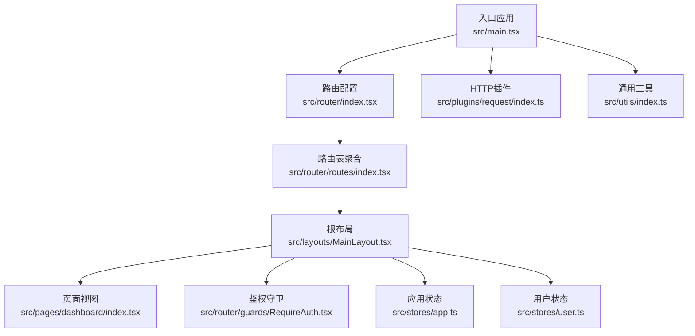
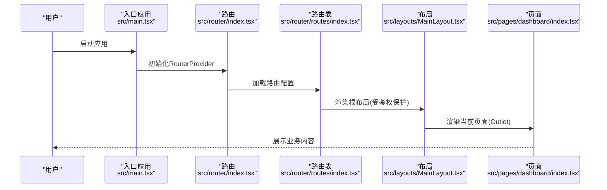
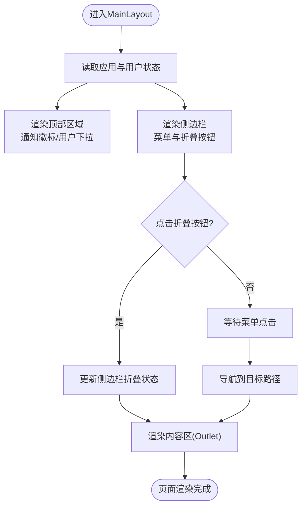
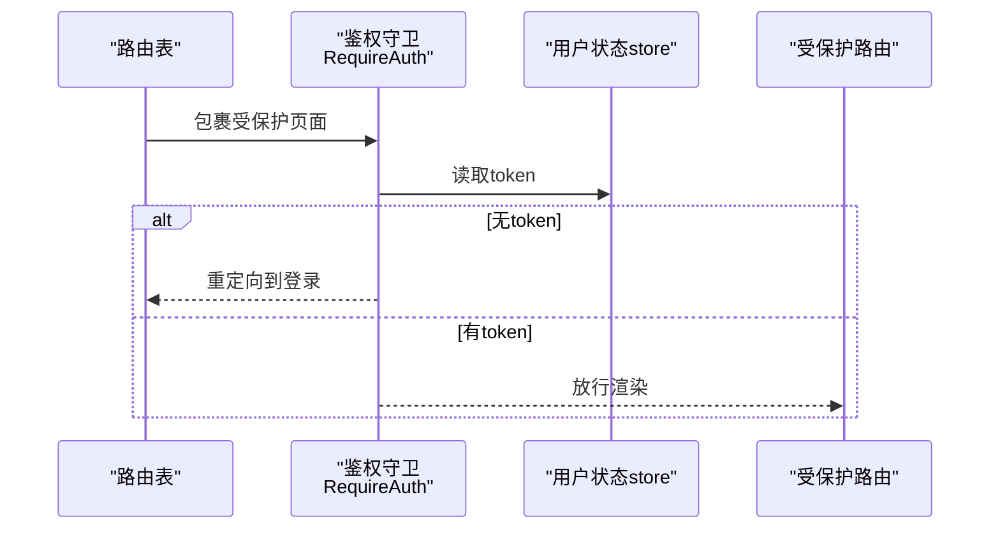
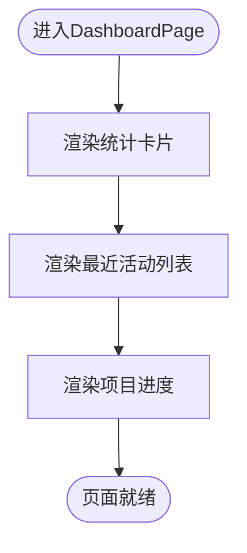
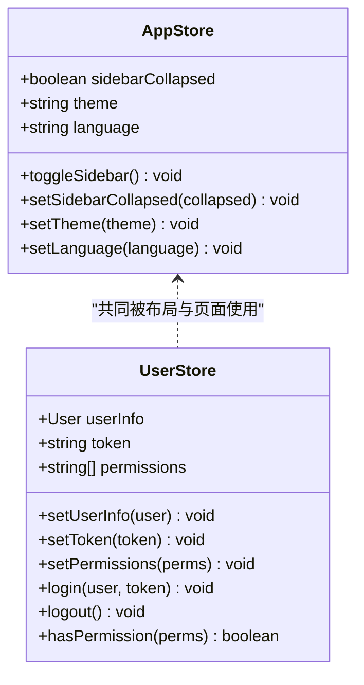
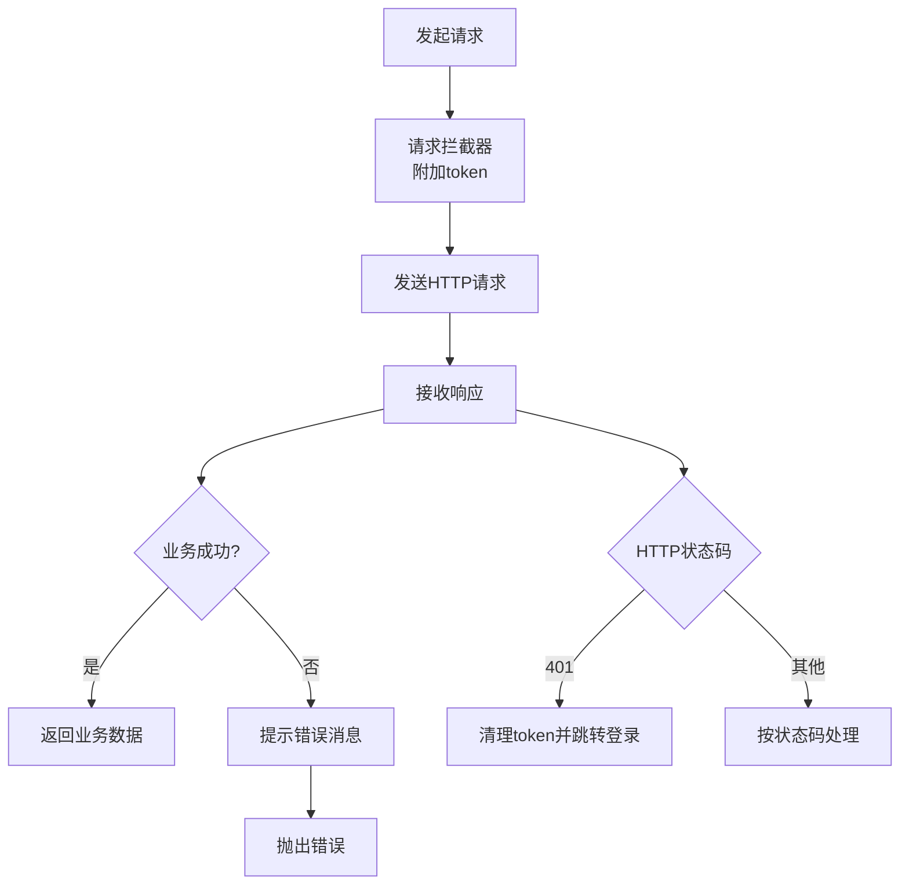
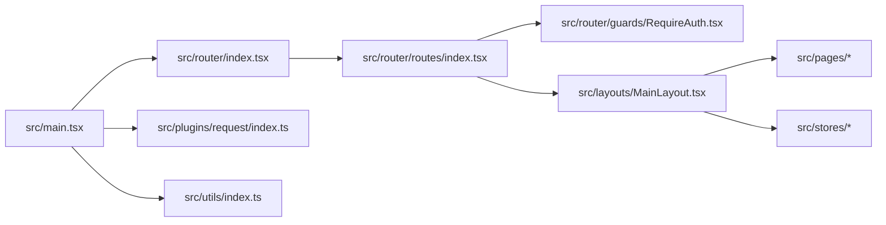

# 组件架构设计

<cite>
**本文引用的文件**
- [src/main.tsx](file://src/main.tsx)
- [src/layouts/MainLayout.tsx](file://src/layouts/MainLayout.tsx)
- [src/router/index.tsx](file://src/router/index.tsx)
- [src/router/routes/index.tsx](file://src/router/routes/index.tsx)
- [src/router/guards/RequireAuth.tsx](file://src/router/guards/RequireAuth.tsx)
- [src/stores/app.ts](file://src/stores/app.ts)
- [src/stores/user.ts](file://src/stores/user.ts)
- [src/plugins/request/index.ts](file://src/plugins/request/index.ts)
- [src/utils/index.ts](file://src/utils/index.ts)
- [src/pages/dashboard/index.tsx](file://src/pages/dashboard/index.tsx)
</cite>

## 目录

1. [引言](#引言)
2. [项目结构](#项目结构)
3. [核心组件](#核心组件)
4. [架构总览](#架构总览)
5. [组件详细分析](#组件详细分析)
6. [依赖关系分析](#依赖关系分析)
7. [性能考虑](#性能考虑)
8. [故障排查指南](#故障排查指南)
9. [结论](#结论)

## 引言

本设计文档面向AI管理平台的前端组件架构，围绕布局组件、页面组件、业务组件与通用组件的职责划分展开；重点阐释MainLayout作为根布局的设计理念（统一主题配置、国际化设置、路由容器），并总结组件间数据传递模式（props、context、状态提升）、组件复用机制（高阶组件与自定义Hook）、生命周期管理与性能优化策略（懒加载、memo化、代码分割）。文档同时提供多类Mermaid图示，帮助读者从不同维度理解系统。

## 项目结构

项目采用按“关注点”分层的组织方式：入口应用在根部初始化全局配置与路由；路由层负责页面级导航与鉴权守卫；布局层提供统一的页面骨架；页面层承载具体业务视图；状态层通过轻量状态库集中管理应用与用户态；插件层封装HTTP请求；工具层提供通用能力。

图表来源

- [src/main.tsx](file://src/main.tsx#L17-L31)
- [src/router/index.tsx](file://src/router/index.tsx#L1-L9)
- [src/router/routes/index.tsx](file://src/router/routes/index.tsx#L9-L28)
- [src/layouts/MainLayout.tsx](file://src/layouts/MainLayout.tsx#L18-L171)
- [src/stores/app.ts](file://src/stores/app.ts#L18-L58)
- [src/stores/user.ts](file://src/stores/user.ts#L21-L75)
- [src/plugins/request/index.ts](file://src/plugins/request/index.ts#L1-L114)
- [src/utils/index.ts](file://src/utils/index.ts#L1-L106)

章节来源

- [src/main.tsx](file://src/main.tsx#L1-L32)
- [src/router/index.tsx](file://src/router/index.tsx#L1-L9)
- [src/router/routes/index.tsx](file://src/router/routes/index.tsx#L1-L31)

## 核心组件

- 布局组件：MainLayout提供统一的侧边栏、头部与内容区，内置用户下拉菜单、通知徽标与侧边折叠控制，并通过Ant Design主题令牌实现一致的视觉风格。
- 页面组件：DashboardPage展示统计卡片、活动列表与项目进度等业务信息，体现页面级数据消费与UI组合。
- 业务组件：当前仓库未显式拆分业务组件，但可通过页面内的复合UI组合逐步抽象为可复用的业务单元。
- 通用组件：当前仓库未独立抽取通用组件目录，建议在后续迭代中将常用控件（如表格、表单、弹窗）沉淀为通用组件库。

章节来源

- [src/layouts/MainLayout.tsx](file://src/layouts/MainLayout.tsx#L18-L171)
- [src/pages/dashboard/index.tsx](file://src/pages/dashboard/index.tsx#L12-L167)

## 架构总览

整体采用“入口配置 → 路由 → 布局 → 页面”的线性调用链，配合状态层与插件层形成清晰的职责边界。入口应用负责国际化与主题注入；路由负责导航与鉴权；布局负责容器与上下文；页面负责业务渲染；状态与插件分别承担跨组件共享与数据访问。

图表来源

- [src/main.tsx](file://src/main.tsx#L17-L31)
- [src/router/index.tsx](file://src/router/index.tsx#L1-L9)
- [src/router/routes/index.tsx](file://src/router/routes/index.tsx#L9-L28)
- [src/layouts/MainLayout.tsx](file://src/layouts/MainLayout.tsx#L73-L170)
- [src/pages/dashboard/index.tsx](file://src/pages/dashboard/index.tsx#L81-L166)

## 组件详细分析

### 布局组件：MainLayout

- 设计要点
  - 使用Ant Design Layout/Sider/Header/Content构建三段式布局，支持侧边栏折叠与阴影效果。
  - 顶部区域包含侧边栏切换按钮、通知徽标与用户下拉菜单，实现统一的操作入口。
  - 内容区通过Outlet承载子路由页面，形成标准的路由容器形态。
  - 主题与样式通过Ant Design主题令牌自动适配，确保背景、边框、圆角等视觉一致性。
- 数据与行为
  - 通过应用状态store管理侧边栏折叠状态与主题语言偏好。
  - 通过用户状态store读取用户信息与登出动作，结合路由跳转实现登录态维护。
  - 侧边菜单项目前固定为首页，后续可通过动态注入扩展。

图表来源

- [src/layouts/MainLayout.tsx](file://src/layouts/MainLayout.tsx#L18-L171)
- [src/stores/app.ts](file://src/stores/app.ts#L18-L58)
- [src/stores/user.ts](file://src/stores/user.ts#L21-L75)

章节来源

- [src/layouts/MainLayout.tsx](file://src/layouts/MainLayout.tsx#L18-L171)
- [src/stores/app.ts](file://src/stores/app.ts#L18-L58)
- [src/stores/user.ts](file://src/stores/user.ts#L21-L75)

### 路由与鉴权：RequireAuth

- 设计要点
  - 通过用户状态store读取token，无token时重定向至登录页，有token则放行子组件。
  - 作为路由包裹器，保证受保护页面的统一鉴权策略。
- 数据传递
  - 通过store选择器直接订阅token，避免不必要重渲染。

图表来源

- [src/router/routes/index.tsx](file://src/router/routes/index.tsx#L11-L17)
- [src/router/guards/RequireAuth.tsx](file://src/router/guards/RequireAuth.tsx#L11-L22)
- [src/stores/user.ts](file://src/stores/user.ts#L21-L75)

章节来源

- [src/router/routes/index.tsx](file://src/router/routes/index.tsx#L9-L28)
- [src/router/guards/RequireAuth.tsx](file://src/router/guards/RequireAuth.tsx#L11-L22)
- [src/stores/user.ts](file://src/stores/user.ts#L21-L75)

### 页面组件：DashboardPage

- 设计要点
  - 使用栅格与卡片组合展示统计数据、活动列表与项目进度。
  - 通过图标与颜色表达趋势与状态，增强信息密度。
- 数据与行为
  - 当前为静态数据演示，后续可接入API与状态管理进行动态更新。

图表来源

- [src/pages/dashboard/index.tsx](file://src/pages/dashboard/index.tsx#L12-L167)

章节来源

- [src/pages/dashboard/index.tsx](file://src/pages/dashboard/index.tsx#L12-L167)

### 状态管理：应用与用户状态

- 应用状态(app.ts)
  - 管理侧边栏折叠、主题与语言偏好，使用持久化中间件保存到本地存储。
- 用户状态(user.ts)
  - 管理用户信息、token与权限集合，提供登录、登出与权限判断方法，使用持久化中间件保存token与用户信息。

图表来源

- [src/stores/app.ts](file://src/stores/app.ts#L5-L16)
- [src/stores/app.ts](file://src/stores/app.ts#L18-L58)
- [src/stores/user.ts](file://src/stores/user.ts#L6-L19)
- [src/stores/user.ts](file://src/stores/user.ts#L21-L75)

章节来源

- [src/stores/app.ts](file://src/stores/app.ts#L1-L59)
- [src/stores/user.ts](file://src/stores/user.ts#L1-L76)

### 插件与工具：HTTP请求与通用工具

- HTTP插件(request/index.ts)
  - 基于axios封装实例，内置请求/响应拦截器，统一封装GET/POST/PUT/DELETE/PATCH方法。
  - 在响应拦截中根据业务字段与HTTP状态码进行提示与错误处理，401时清理token并跳转登录。
- 通用工具(utils/index.ts)
  - 提供日期格式化、金额/数字格式化、下载、深拷贝、防抖、节流、ID生成、空值判断等通用能力。

图表来源

- [src/plugins/request/index.ts](file://src/plugins/request/index.ts#L19-L76)

章节来源

- [src/plugins/request/index.ts](file://src/plugins/request/index.ts#L1-L114)
- [src/utils/index.ts](file://src/utils/index.ts#L1-L106)

## 依赖关系分析

- 入口应用依赖Ant Design国际化与主题配置，统一注入全局样式与路由。
- 路由层依赖路由表与鉴权守卫，形成页面级安全边界。
- 布局层依赖状态层与路由容器，承载页面骨架与用户交互。
- 页面层依赖UI库与业务数据（当前为静态演示）。
- 插件层与工具层为横切关注点，被各层按需使用。

图表来源

- [src/main.tsx](file://src/main.tsx#L17-L31)
- [src/router/index.tsx](file://src/router/index.tsx#L1-L9)
- [src/router/routes/index.tsx](file://src/router/routes/index.tsx#L1-L31)
- [src/router/guards/RequireAuth.tsx](file://src/router/guards/RequireAuth.tsx#L1-L25)
- [src/layouts/MainLayout.tsx](file://src/layouts/MainLayout.tsx#L1-L174)
- [src/plugins/request/index.ts](file://src/plugins/request/index.ts#L1-L114)
- [src/utils/index.ts](file://src/utils/index.ts#L1-L106)

章节来源

- [src/main.tsx](file://src/main.tsx#L1-L32)
- [src/router/index.tsx](file://src/router/index.tsx#L1-L9)
- [src/router/routes/index.tsx](file://src/router/routes/index.tsx#L1-L31)

## 性能考虑

- 懒加载与代码分割
  - 建议对大型页面或非首屏路由采用动态导入，减少初始包体积，提升首屏速度。
  - 可结合路由懒加载与React Suspense实现渐进式渲染。
- memo化与选择器
  - 对频繁渲染的UI组件使用浅比较或深度比较策略，避免不必要的重渲染。
  - 在布局与页面中优先使用store选择器，仅在需要时订阅特定字段，降低重渲染范围。
- 图标与主题
  - Ant Design图标按需引入，避免全量打包；主题令牌统一配置，减少重复计算。
- 请求缓存与节流
  - 对高频查询使用防抖/节流策略，结合本地缓存减少重复请求。
  - 对幂等请求可加入缓存层，缩短响应时间。

## 故障排查指南

- 登录态失效
  - 现象：401错误后跳转登录页。
  - 处理：检查本地token是否被清理，确认鉴权守卫逻辑与路由包裹是否生效。
- 国际化与主题异常
  - 现象：界面语言或主题不一致。
  - 处理：确认入口应用的ConfigProvider配置与Ant Design locale是否正确注入。
- 侧边栏状态丢失
  - 现象：刷新后侧边栏状态恢复默认。
  - 处理：确认应用状态store的持久化配置是否启用且未被意外清空。
- 请求失败与提示
  - 现象：接口报错或网络异常。
  - 处理：查看响应拦截器中的错误分支，核对业务字段与HTTP状态码映射。

章节来源

- [src/router/guards/RequireAuth.tsx](file://src/router/guards/RequireAuth.tsx#L11-L22)
- [src/main.tsx](file://src/main.tsx#L19-L29)
- [src/stores/app.ts](file://src/stores/app.ts#L49-L57)
- [src/plugins/request/index.ts](file://src/plugins/request/index.ts#L34-L76)

## 结论

该架构以MainLayout为核心容器，结合路由与鉴权守卫形成清晰的安全边界，通过轻量状态库实现跨组件共享，借助插件与工具层提供稳定的数据访问与通用能力。建议后续在页面内进一步抽象业务组件、引入懒加载与memo化策略，并完善国际化与主题的动态切换能力，持续提升可维护性与用户体验。
